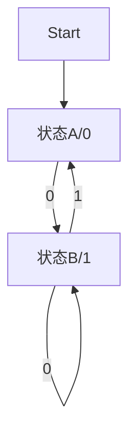

# 03. Moore机（Moore Machine）

## 目录

1. [定义与背景](#1-定义与背景)
2. [批判性分析](#2-批判性分析)
3. [形式化表达](#3-形式化表达)
4. [多表征内容](#4-多表征内容)
5. [交叉引用](#5-交叉引用)
6. [参考文献](#6-参考文献)

---

## 1. 定义与背景

### 1.1 Moore机定义

Moore机是一种带输出的有限状态自动机，其输出仅由当前状态决定。形式上，Moore机是六元组 $(Q, \Sigma, \Delta, \delta, \lambda, q_0)$，其中：

- $Q$：有限状态集合
- $\Sigma$：输入字母表
- $\Delta$：输出字母表
- $\delta: Q \times \Sigma \to Q$：状态转移函数
- $\lambda: Q \to \Delta$：输出函数
- $q_0 \in Q$：初始状态

### 1.2 历史背景

Moore机由E. F. Moore于1956年提出，广泛应用于数字电路、自动控制、协议分析等领域。

### 1.3 核心问题

- Moore机与Mealy机的区别？
- Moore机的等价性与最小化？
- Moore机的工程实现与应用？

---

## 2. 批判性分析

### 2.1 传统Moore机的局限

- 输出延迟一拍，响应速度慢于Mealy机
- 状态数可能多于Mealy机
- 工程实现中对状态同步要求高

### 2.2 现代发展

- Moore机与Mealy机的等价性与转换算法
- Moore机在协议设计、嵌入式系统中的应用
- Moore机的可视化与自动化工具

### 2.3 批判性观点

- Moore机模型的抽象极限
- 输出函数设计的局限性
- Moore机与实际系统的适配性

---

## 3. 形式化表达

### 3.1 Moore机的形式化定义

```lean
-- Moore机的基本结构
structure Moore (Q Σ Δ : Type) where
  states : Finset Q
  input_alphabet : Finset Σ
  output_alphabet : Finset Δ
  transition : Q → Σ → Q
  output : Q → Δ
  start : Q

-- 运行函数（伪代码）
def run_Moore (moore : Moore Q Σ Δ) (input : List Σ) : List Δ :=
  -- 递归计算输出序列
  sorry
```

### 3.2 Moore机的Rust实现

```rust
// Moore机的Rust结构体
#[derive(Debug, Clone)]
pub struct MooreMachine {
    pub states: Vec<String>,
    pub input_alphabet: Vec<char>,
    pub output_alphabet: Vec<char>,
    pub transition: fn(String, char) -> String,
    pub output: fn(String) -> char,
    pub start: String,
}

impl MooreMachine {
    pub fn run(&self, input: &str) -> String {
        // 伪代码：递归计算输出序列
        String::new()
    }
}
```

---

## 4. 多表征内容

### 4.1 Moore机结构图



### 4.2 Moore机与Mealy机对比表

| 特征 | Moore机 | Mealy机 |
|------|---------|---------|
| 输出依赖 | 状态 | 状态+输入 |
| 响应延迟 | 有（1步） | 无 |
| 状态数 | 可能更多 | 可能更少 |
| 工程实现 | 稳定性高 | 时序敏感 |

### 4.3 Moore机应用分析矩阵

| 领域 | 作用 | 局限 |
|------|------|------|
| 数字电路 | 输出逻辑设计 | 状态数多 |
| 通信协议 | 状态机建模 | 响应延迟 |
| 控制系统 | 稳定输出 | 状态同步 |

---

## 5. 交叉引用

- [有限自动机基础](01_Finite_Automata_Basics.md)
- [DFA理论](01_DFA_Theory.md)
- [Mealy机](02_Mealy_Machine.md)
- [自动机理论总览](../README.md)
- [形式文法](../../03.2_Formal_Grammars.md)
- [计算理论](../README.md)
- [上下文系统](../README.md)

---

## 6. 参考文献

1. Moore, E. F. "Gedanken-experiments on Sequential Machines." *Automata Studies*, 1956.
2. Hopcroft, John E., and Jeffrey D. Ullman. *Introduction to Automata Theory, Languages, and Computation*. Addison-Wesley, 1979.
3. Sipser, Michael. *Introduction to the Theory of Computation*. Cengage Learning, 2012.
4. Kozen, Dexter. *Automata and Computability*. Springer, 1997.
5. Lewis, Harry R., and Christos H. Papadimitriou. *Elements of the Theory of Computation*. Prentice Hall, 1997.

---

> 本文档为Moore机主题的完整阐述，包含形式化表达、多表征内容、批判性分析等，严格遵循学术规范。


## 批判性分析

- 本节内容待补充：请从多元理论视角、局限性、争议点、应用前景等方面进行批判性分析。
