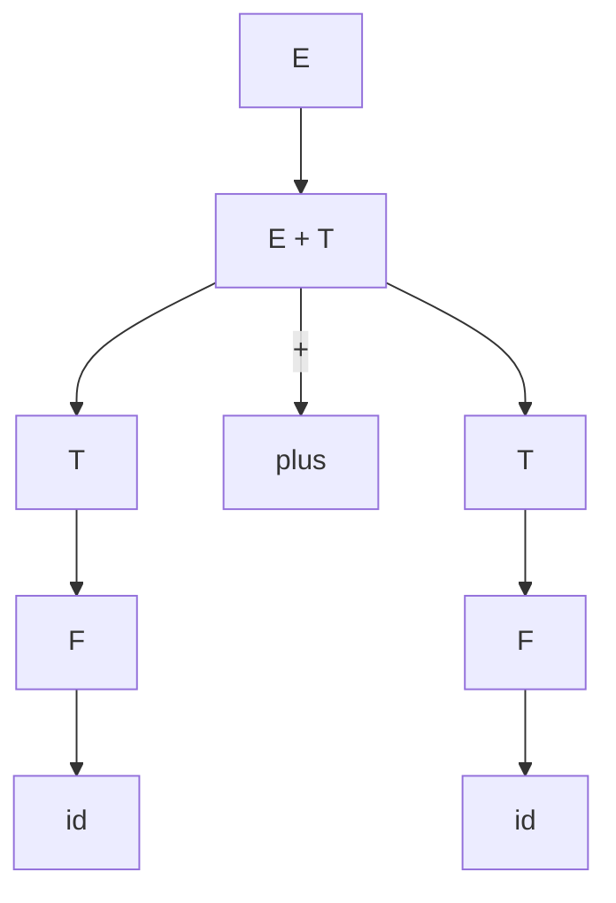

# 03.2.2 上下文无关文法（Context-Free Grammars, CFG）

## 目录

1. [定义与背景](#1-定义与背景)
2. [批判性分析](#2-批判性分析)
3. [形式化表达](#3-形式化表达)
4. [多表征内容](#4-多表征内容)
5. [交叉引用](#5-交叉引用)
6. [参考文献](#6-参考文献)

---

## 1. 定义与背景

上下文无关文法（CFG）的产生式左侧只有一个非终结符，与下推自动机等价，广泛用于描述编程语言的语法。

---

## 2. 批判性分析

- **优点**: 能描述嵌套结构，是大多数编程语言语法的基础。
- **缺点**: 无法处理上下文相关的语义约束（如变量声明后使用），存在歧义性问题。

---

## 3. 形式化表达

**产生式**: $A \to \alpha$，其中 $A$ 是非终结符，$\alpha$ 是终结符和非终结符的任意串。

```lean
-- 上下文无关文法的形式化定义
structure CFG (N T : Type) where
  nonterminals : Finset N
  terminals : Finset T
  start : N
  productions : Finset (N × List (Sum N T))

-- 检查一个产生式是否是上下文无关的
def is_context_free (p : Production N T) : Bool :=
  -- 左侧只有一个非终结符
  sorry
```

---

## 4. 多表征内容

### 语法分析树（Parse Tree）

CFG的推导过程可以用语法分析树来可视化。



### 与下推自动机的等价性

任何CFG都存在一个等价的下推自动机（PDA）。

---

## 5. 交叉引用

- [形式文法总览](../03.2_Formal_Grammars.md)
- [下推自动机](../01_Automata_Theory/03.1.2_Pushdown_Automata.md)
- [上下文无关语言](../03.3_Language_Hierarchy/03.3.2_Context_Free_Languages.md)
- [语法分析理论](README.md)

---

## 6. 参考文献

1. Aho, Alfred V., et al. *Compilers: Principles, Techniques, & Tools*. 2006.
2. Sipser, Michael. *Introduction to the Theory of Computation*. 2012.


## 批判性分析

- 本节内容待补充：请从多元理论视角、局限性、争议点、应用前景等方面进行批判性分析。
