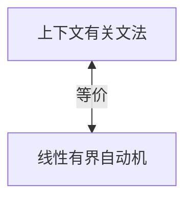

# 03.2.3 上下文有关文法（Context-Sensitive Grammars, CSG）

## 目录

- [03.2.3 上下文有关文法（Context-Sensitive Grammars, CSG）](#0323-上下文有关文法context-sensitive-grammars-csg)
  - [目录](#目录)
  - [1. 定义与背景](#1-定义与背景)
  - [2. 批判性分析](#2-批判性分析)
  - [3. 形式化表达](#3-形式化表达)
  - [4. 多表征内容](#4-多表征内容)
    - [与线性有界自动机（LBA）的等价性](#与线性有界自动机lba的等价性)
  - [5. 交叉引用](#5-交叉引用)
  - [6. 参考文献](#6-参考文献)

---

## 1. 定义与背景

上下文有关文法（CSG）的产生式受上下文约束，与线性有界自动机（LBA）等价。

---

## 2. 批判性分析

- **优点**: 表达能力强于CFG，能处理一些上下文相关的语言特性。
- **缺点**: 判定问题复杂（PSPACE完全），工程应用少，理论价值为主。

---

## 3. 形式化表达

**产生式**: $\alpha A \beta \to \alpha \gamma \beta$，其中 $A$ 是非终结符，$\alpha, \beta, \gamma$ 是终结符和非终结符的串，且 $\gamma$ 非空。

```lean
-- 上下文有关文法的形式化定义
structure CSG (N T : Type) where
  nonterminals : Finset N
  terminals : Finset T
  start : N
  productions : Finset (List (Sum N T) × List (Sum N T))
  -- 约束： |lhs| <= |rhs|
  -- 约束： lhs 必须包含非终结符

def is_context_sensitive (p : Production) : Bool :=
  -- 检查产生式是否满足 |α| <= |β|
  sorry
```

---

## 4. 多表征内容

### 与线性有界自动机（LBA）的等价性

任何CSG都存在一个等价的LBA，反之亦然。



---

## 5. 交叉引用

- [形式文法总览](../03.2_Formal_Grammars.md)
- [线性有界自动机](../01_Automata_Theory/03.1.4_Linear_Bounded_Automaton.md)
- [上下文有关语言](../03.3_Language_Hierarchy/03.3.3_Context_Sensitive_Languages.md)
- [计算理论](README.md)

---

## 6. 参考文献

1. Hopcroft, John E., et al. *Introduction to Automata Theory, Languages, and Computation*. 2006.
2. Sipser, Michael. *Introduction to the Theory of Computation*. 2012.


## 批判性分析

- 本节内容待补充：请从多元理论视角、局限性、争议点、应用前景等方面进行批判性分析。
