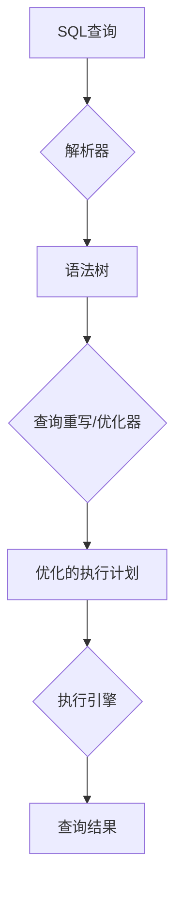

# 03.7.5 数据库查询语言（Database Query Languages）

## 目录

- [03.7.5 数据库查询语言（Database Query Languages）](#0375-数据库查询语言database-query-languages)
  - [目录](#目录)
  - [1. 定义与背景](#1-定义与背景)
  - [2. 核心概念](#2-核心概念)
  - [3. 与形式语言理论的关联](#3-与形式语言理论的关联)
  - [4. 多表征内容](#4-多表征内容)
    - [SQL查询处理流程](#sql查询处理流程)
  - [5. 交叉引用](#5-交叉引用)
  - [6. 参考文献](#6-参考文献)

---

## 1. 定义与背景

数据库查询语言是用于从数据库中检索和操作数据的计算机语言。最著名的例子是SQL（结构化查询语言）。

---

## 2. 核心概念

- **关系代数 (Relational Algebra)**: 一个过程化的查询语言，定义了一系列操作（如选择、投影、并、差、笛卡尔积）。
- **关系演算 (Relational Calculus)**: 一个声明式的查询语言，用户只描述所需数据，而不指定如何获取。
- **SQL**: 一种结合了关系代数和关系演算思想的标准化语言。

---

## 3. 与形式语言理论的关联

- **语法**: SQL等查询语言的语法是由**上下文无关文法 (CFG)** 定义的。数据库系统中的查询解析器就是一个基于这些文法的解析器。
- **表达能力**: 关系代数和安全的关系演算的表达能力是等价的，它们定义了"关系完备"的查询语言。然而，它们的表达能力弱于图灵机，例如，它们不能直接表达递归查询（如查找所有朋友的朋友）。
- **优化**: 查询优化器常常会将声明式的查询（如SQL）转换为一个内部的、基于关系代数的执行计划（表示为表达式树），然后对这个树进行重写和优化，这借鉴了编译理论中的思想。

---

## 4. 多表征内容

### SQL查询处理流程

---

## 5. 交叉引用

- [语言应用总览](README.md)
- [上下文无关文法](../03.2_Formal_Grammars/03.2.2_Context_Free_Grammars.md)
- [数据库理论](README.md)

---

## 6. 参考文献

1. Ullman, Jeffrey D., and Jennifer Widom. *A First Course in Database Systems*. 2008.
2. Garcia-Molina, Hector, et al. *Database Systems: The Complete Book*. 2008.

## 批判性分析

- 本节内容待补充：请从多元理论视角、局限性、争议点、应用前景等方面进行批判性分析。
