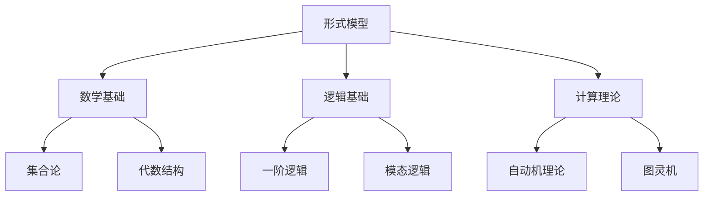
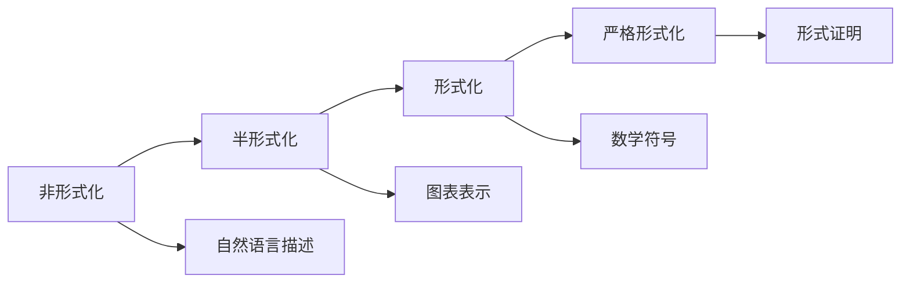

# 形式模型综合框架

## 目录

1. [概述](#1-概述)
2. [理论基础](#2-理论基础)
3. [Petri网理论体系](#3-petri网理论体系)
4. [模型分类体系](#4-模型分类体系)
5. [形式化方法](#5-形式化方法)
6. [应用领域](#6-应用领域)
7. [哲学批判与反思](#7-哲学批判与反思)
8. [理论整合](#8-理论整合)
9. [未来发展方向](#9-未来发展方向)

## 1. 概述

### 1.1 定义与范围

**定义 1.1.1** 形式模型 (Formal Model)
形式模型是对现实系统或抽象概念的数学化、符号化表示，通过严格的形式化语言描述系统的结构、行为和性质。

**定义 1.1.2** 形式化方法 (Formal Methods)
形式化方法是基于数学逻辑和形式语言来规范、开发和验证软件系统的方法论。

### 1.2 核心特征

| 特征 | 描述 | 重要性 |
|------|------|--------|
| 精确性 | 使用数学语言，避免歧义 | 高 |
| 可验证性 | 支持形式化验证和证明 | 高 |
| 抽象性 | 关注本质特征，忽略细节 | 中 |
| 可组合性 | 支持模块化构建和组合 | 中 |
| 可扩展性 | 支持理论扩展和应用 | 中 |

### 1.3 理论地位



## 2. 理论基础

### 2.1 数学基础

#### 2.1.1 集合论基础

**公理 2.1.1** (外延公理)
两个集合相等当且仅当它们包含相同的元素：

```text
∀A∀B[A = B ↔ ∀x(x ∈ A ↔ x ∈ B)]
```

**公理 2.1.2** (空集公理)
存在一个不包含任何元素的集合：

```text
∃A∀x(x ∉ A)
```

#### 2.1.2 关系理论

**定义 2.1.1** 二元关系
集合 A 和 B 之间的二元关系是 A × B 的子集。

**定义 2.1.2** 等价关系
关系 R ⊆ A × A 是等价关系，如果满足：

1. 自反性：∀a ∈ A, (a, a) ∈ R
2. 对称性：∀a, b ∈ A, (a, b) ∈ R → (b, a) ∈ R
3. 传递性：∀a, b, c ∈ A, (a, b) ∈ R ∧ (b, c) ∈ R → (a, c) ∈ R

### 2.2 逻辑基础

#### 2.2.1 命题逻辑

**定义 2.2.1** 命题公式
命题公式的递归定义：

1. 原子命题是公式
2. 如果 φ 是公式，则 ¬φ 是公式
3. 如果 φ, ψ 是公式，则 (φ ∧ ψ), (φ ∨ ψ), (φ → ψ) 是公式

#### 2.2.2 一阶逻辑

**定义 2.2.2** 一阶语言
一阶语言包含：

- 常量符号集 C
- 函数符号集 F
- 谓词符号集 P
- 变量符号集 V

### 2.3 计算理论

#### 2.3.1 自动机理论

**定义 2.3.1** 有限自动机
有限自动机是一个五元组 M = (Q, Σ, δ, q₀, F)，其中：

- Q 是有限状态集
- Σ 是有限输入字母表
- δ: Q × Σ → Q 是转移函数
- q₀ ∈ Q 是初始状态
- F ⊆ Q 是接受状态集

## 3. Petri网理论体系

### 3.1 基本Petri网

#### 3.1.1 形式定义

**定义 3.1.1** 基本Petri网
基本Petri网是一个四元组 N = (P, T, F, M₀)，其中：

- P 是有限库所集 (places)
- T 是有限变迁集 (transitions)，P ∩ T = ∅
- F ⊆ (P × T) ∪ (T × P) 是流关系 (flow relation)
- M₀: P → ℕ 是初始标识 (initial marking)

#### 3.1.2 基本概念

**定义 3.1.2** 标识 (Marking)
标识是一个函数 M: P → ℕ，表示每个库所中的托肯数量。

**定义 3.1.3** 前集和后集

```text
•t = {p ∈ P | (p, t) ∈ F}    (变迁 t 的前集)
t• = {p ∈ P | (t, p) ∈ F}    (变迁 t 的后集)
•p = {t ∈ T | (t, p) ∈ F}    (库所 p 的前集)
p• = {t ∈ T | (p, t) ∈ F}    (库所 p 的后集)
```

#### 3.1.3 变迁规则

**定义 3.1.4** 变迁使能条件
变迁 t 在标识 M 下使能，当且仅当：

```latex
∀p ∈ •t: M(p) ≥ 1
```

**定义 3.1.5** 变迁发生
如果变迁 t 在标识 M 下使能，则 t 可以发生，产生新标识 M'：

```latex
M'(p) = M(p) - 1, 如果 p ∈ •t - t•
M'(p) = M(p) + 1, 如果 p ∈ t• - •t
M'(p) = M(p),     其他情况
```

### 3.2 高级Petri网

#### 3.2.1 时间Petri网

**定义 3.2.1** 时间Petri网
时间Petri网是一个六元组 N = (P, T, F, M₀, I, D)，其中：

- (P, T, F, M₀) 是基本Petri网
- I: T → ℝ⁺ × (ℝ⁺ ∪ {∞}) 是时间间隔函数
- D: T → ℝ⁺ 是延迟函数

#### 3.2.2 着色Petri网

**定义 3.2.2** 着色Petri网
着色Petri网是一个六元组 N = (P, T, F, M₀, C, G)，其中：

- (P, T, F, M₀) 是基本Petri网
- C: P ∪ T → Σ 是颜色函数
- G: T → Bool 是守卫函数

### 3.3 分析技术

#### 3.3.1 可达性分析

**定义 3.3.1** 可达性关系
标识 M' 从标识 M 可达，记作 M →* M'，如果存在变迁序列 σ = t₁t₂...tₙ 使得：

```latex
M →^{t₁} M₁ →^{t₂} M₂ → ... →^{tₙ} M'
```

**定理 3.3.1** (可达性判定)
Petri网的可达性问题在一般情况下是不可判定的。

#### 3.3.2 不变性分析

**定义 3.3.2** 不变性
向量 I: P → ℤ 是Petri网的不变性，如果对于任意标识 M 和变迁 t：

```latex
如果 M →^{t} M'，则 I · M = I · M'
```

## 4. 模型分类体系

### 4.1 按抽象层次分类

| 层次 | 模型类型 | 特点 | 应用领域 |
|------|----------|------|----------|
| 物理层 | 物理模型 | 基于物理定律 | 工程系统 |
| 逻辑层 | 逻辑模型 | 基于逻辑推理 | 软件系统 |
| 代数层 | 代数模型 | 基于代数结构 | 数学系统 |
| 语义层 | 语义模型 | 基于语义解释 | 语言系统 |

### 4.2 按应用领域分类

#### 4.2.1 计算机科学模型

- **自动机模型**：有限自动机、下推自动机、图灵机
- **语言模型**：形式文法、正则表达式、上下文无关文法
- **并发模型**：Petri网、进程代数、时序逻辑

#### 4.2.2 数学模型

- **代数模型**：群、环、域、向量空间
- **几何模型**：拓扑空间、流形、纤维丛
- **分析模型**：度量空间、函数空间、算子理论

#### 4.2.3 认知模型

- **认知架构**：ACT-R、SOAR、CLARION
- **神经网络**：人工神经网络、深度学习模型
- **符号系统**：专家系统、知识表示

### 4.3 按形式化程度分类



## 5. 形式化方法

### 5.1 规范方法

#### 5.1.1 Z语言

**定义 5.1.1** Z模式
Z模式是Z语言的基本构造单元，包含：

- 声明部分：定义变量和类型
- 谓词部分：定义约束和关系

**示例 5.1.1** 简单系统规范

```z
[State]
x: ℕ
y: ℕ

Init
x = 0 ∧ y = 0

Operation
Δ(State)
x' = x + 1 ∧ y' = y
```

#### 5.1.2 VDM

**定义 5.1.2** VDM规范
VDM (Vienna Development Method) 是一种形式化规范语言，支持：

- 抽象数据类型定义
- 前置条件和后置条件
- 不变性约束

### 5.2 验证方法

#### 5.2.1 模型检验

**定义 5.2.1** 模型检验
模型检验是自动验证有限状态系统是否满足时序逻辑公式的方法。

**算法 5.2.1** CTL模型检验

```rust
fn model_check(ks: &KripkeStructure, phi: &CTLFormula) -> bool {
    match phi {
        CTLFormula::True => true,
        CTLFormula::False => false,
        CTLFormula::Atomic(p) => ks.satisfies_atomic(p),
        CTLFormula::Not(psi) => !model_check(ks, psi),
        CTLFormula::And(psi1, psi2) => {
            model_check(ks, psi1) && model_check(ks, psi2)
        },
        CTLFormula::EX(psi) => {
            ks.states().any(|s| {
                ks.successors(s).any(|s_prime| {
                    model_check_at_state(ks, s_prime, psi)
                })
            })
        },
        // ... 其他操作符
    }
}
```

#### 5.2.2 定理证明

**定义 5.2.2** 形式证明
形式证明是基于逻辑推理规则的严格证明过程。

**示例 5.2.2** 简单证明

```latex
目标：证明 ∀x(P(x) → Q(x)) ∧ ∀x(Q(x) → R(x)) → ∀x(P(x) → R(x))

证明：
1. 假设 ∀x(P(x) → Q(x)) ∧ ∀x(Q(x) → R(x))  [假设]
2. 取任意个体 a
3. 从1得到 P(a) → Q(a)  [全称实例化]
4. 从1得到 Q(a) → R(a)  [全称实例化]
5. 假设 P(a)  [假设]
6. 从3和5得到 Q(a)  [假言推理]
7. 从4和6得到 R(a)  [假言推理]
8. 从5-7得到 P(a) → R(a)  [条件证明]
9. 从2和8得到 ∀x(P(x) → R(x))  [全称概括]
```

## 6. 应用领域

### 6.1 软件工程

#### 6.1.1 软件规范

**应用 6.1.1** 需求规范
使用形式化方法描述软件需求，确保：

- 需求的完整性和一致性
- 需求的精确性和无歧义性
- 需求的可验证性

#### 6.1.2 软件验证

**应用 6.1.2** 程序验证
使用形式化方法验证程序正确性：

- 模型检验验证并发程序
- 定理证明验证算法正确性
- 静态分析检测程序缺陷

### 6.2 系统建模

#### 6.2.1 并发系统

**应用 6.2.1** 并发控制
使用Petri网建模并发系统：

- 死锁检测
- 资源竞争分析
- 性能评估

#### 6.2.2 实时系统

**应用 6.2.2** 时间约束
使用时间Petri网建模实时系统：

- 时间约束验证
- 调度分析
- 响应时间计算

### 6.3 人工智能

#### 6.3.1 知识表示

**应用 6.3.1** 逻辑编程
使用形式逻辑表示知识：

- 谓词逻辑表示事实和规则
- 模态逻辑表示信念和知识
- 时序逻辑表示动态知识

#### 6.3.2 机器学习

**应用 6.3.2** 形式化学习
使用形式化方法分析学习算法：

- 学习理论的形式化
- 算法收敛性证明
- 泛化能力分析

## 7. 哲学批判与反思

### 7.1 认识论批判

#### 7.1.1 形式化的局限性

**批判 7.1.1** 抽象与具体
形式化方法通过抽象化处理复杂系统，但这种抽象可能：

- 丢失重要的具体细节
- 忽略非形式化的直觉知识
- 过度简化现实复杂性

**反思 7.1.1** 平衡策略
需要在形式化精确性和现实复杂性之间找到平衡：

- 分层抽象：不同层次使用不同抽象度
- 渐进形式化：从非形式化逐步走向形式化
- 多视角建模：结合多种建模方法

#### 7.1.2 知识的可形式化性

**批判 7.1.2** 形式化边界
并非所有知识都可以完全形式化：

- 直觉知识难以形式化
- 经验知识需要实践验证
- 创造性思维难以建模

### 7.2 方法论批判

#### 7.2.1 形式化方法的适用性

**批判 7.2.1** 适用范围
形式化方法并非适用于所有问题：

- 复杂系统可能超出形式化能力
- 创新性问题缺乏现成形式化框架
- 实践问题需要经验指导

#### 7.2.2 工具与目的

**批判 7.2.2** 工具主义
形式化方法可能成为目的而非工具：

- 过度追求形式化而忽略实用性
- 形式化本身成为研究目标
- 忽视形式化背后的直觉理解

### 7.3 价值论批判

#### 7.3.1 形式化的价值

**批判 7.3.1** 价值判断
形式化方法的价值需要批判性评估：

- 形式化是否真正提高了理解
- 形式化成本是否合理
- 形式化结果是否可靠

#### 7.3.2 伦理考虑

**批判 7.3.2** 伦理责任
形式化方法的应用需要考虑伦理问题：

- 形式化系统的社会影响
- 形式化决策的公平性
- 形式化技术的责任归属

## 8. 理论整合

### 8.1 跨学科整合

#### 8.1.1 数学与计算机科学

**整合 8.1.1** 理论基础
形式模型为计算机科学提供数学基础：

- 算法分析的形式化
- 数据结构的形式化
- 计算复杂度的形式化

#### 8.1.2 逻辑与人工智能

**整合 8.1.2** 智能推理
形式逻辑为人工智能提供推理基础：

- 知识表示的形式化
- 推理机制的形式化
- 学习过程的形式化

### 8.2 方法论整合

#### 8.2.1 形式化与非形式化

**整合 8.2.1** 混合方法
结合形式化和非形式化方法：

- 形式化提供精确性
- 非形式化提供直觉性
- 两者互补增强理解

#### 8.2.2 理论与实践

**整合 8.2.2** 实践导向
形式化方法需要与实践结合：

- 理论指导实践
- 实践验证理论
- 理论与实践相互促进

### 8.3 技术整合

#### 8.3.1 工具集成

**整合 8.3.1** 工具链
集成多种形式化工具：

- 规范工具：Z、VDM、B
- 验证工具：模型检验器、定理证明器
- 分析工具：静态分析器、动态分析器

#### 8.3.2 标准统一

**整合 8.3.2** 标准化
建立形式化方法的标准：

- 符号表示标准
- 证明格式标准
- 工具接口标准

## 9. 未来发展方向

### 9.1 技术发展趋势

#### 9.1.1 自动化程度提升

**趋势 9.1.1** 智能辅助
形式化方法将更加智能化：

- 自动规范生成
- 智能证明辅助
- 自动错误检测

#### 9.1.2 可扩展性增强

**趋势 9.1.2** 规模扩展
形式化方法将处理更大规模系统：

- 分布式系统建模
- 大规模软件验证
- 复杂系统分析

### 9.2 应用领域扩展

#### 9.2.1 新兴领域

**扩展 9.2.1** 新应用
形式化方法将扩展到新领域：

- 量子计算建模
- 生物系统建模
- 社会系统建模

#### 9.2.2 跨学科应用

**扩展 9.2.2** 学科融合
形式化方法将促进学科融合：

- 数学与物理学的融合
- 计算机科学与生物学的融合
- 逻辑学与社会学的融合

### 9.3 理论深化

#### 9.3.1 基础理论

**深化 9.3.1** 理论发展
形式化方法的基础理论将深化：

- 新的逻辑系统
- 新的代数结构
- 新的计算模型

#### 9.3.2 方法论创新

**深化 9.3.2** 方法创新
形式化方法的方法论将创新：

- 新的建模方法
- 新的验证技术
- 新的分析工具

## 总结

形式模型作为现代科学和工程的重要工具，通过严格的数学化和符号化，为复杂系统的理解和分析提供了强有力的方法。从基本的Petri网理论到高级的形式化方法，从理论构建到实际应用，形式模型展现了其强大的表达能力和分析能力。

然而，我们也需要保持批判性思维，认识到形式化方法的局限性和适用边界。通过哲学批判和理论整合，我们可以更好地理解形式化方法的本质和价值，推动其在更广泛领域的应用和发展。

未来，随着技术的进步和理论的发展，形式模型将继续在科学、工程、人工智能等领域发挥重要作用，为人类认识和改造世界提供更加精确和可靠的工具。

---

-**参考文献**

1. Petri, C. A. (1962). Kommunikation mit Automaten. PhD thesis, University of Bonn.
2. Reisig, W. (1985). Petri Nets: An Introduction. Springer-Verlag.
3. Murata, T. (1989). Petri nets: Properties, analysis and applications. Proceedings of the IEEE, 77(4), 541-580.
4. Jensen, K. (1997). Coloured Petri Nets: Basic Concepts, Analysis Methods and Practical Use. Springer-Verlag.
5. Berthomieu, B., & Diaz, M. (1991). Modeling and verification of time dependent systems using time Petri nets. IEEE Transactions on Software Engineering, 17(3), 259-273.

-**相关链接**

- [返回主目录](../00_Master_Index/01_Comprehensive_Knowledge_System.md)
- [数学基础](../02_Mathematical_Foundation/01_Comprehensive_Mathematical_Framework.md)
- [理论体系](../03_Theoretical_System/01_Comprehensive_Theory_Framework.md)
- [形式语言](../07_Formal_Language/01_Automata_Theory.md)
