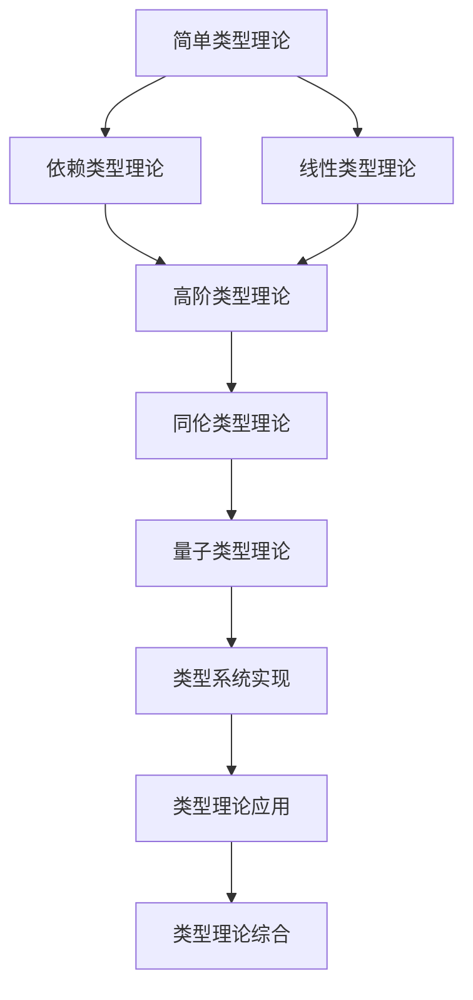

# 类型理论索引 (Type Theory Index)

## 📋 **目录**

### 1. [简单类型理论](04.1_Simple_Type_Theory.md)

### 2. [依赖类型理论](04.2_Dependent_Type_Theory.md)

### 3. [线性类型理论](04.3_Linear_Type_Theory.md)

### 4. [高阶类型理论](04.4_Higher_Order_Type_Theory.md)

### 5. [同伦类型理论](04.5_Homotopy_Type_Theory.md)

### 6. [量子类型理论](04.6_Quantum_Type_Theory.md)

### 7. [类型系统实现](04.7_Type_System_Implementation.md)

### 8. [类型理论应用](04.8_Type_Theory_Applications.md)

---

## 🎯 **类型理论概述**

类型理论是形式科学体系的核心理论之一，它研究类型系统的数学基础、逻辑性质和计算意义。类型理论为编程语言、形式验证和数学基础提供了统一的框架。

### 核心特征

1. **数学严格性**：基于严格的数学基础
2. **逻辑一致性**：类型系统与逻辑系统对应
3. **计算相关性**：类型与计算过程紧密相关
4. **抽象化能力**：支持高度抽象的类型构造
5. **形式化验证**：提供程序正确性的形式化保证

### 理论层次

```
┌─────────────────────────────────────────────────────────────┐
│                    类型理论综合 (4.9)                         │
├─────────────────────────────────────────────────────────────┤
│ 应用理论 (4.8) │ 实现理论 (4.7) │ 量子理论 (4.6) │ 同伦理论 (4.5) │
├─────────────────────────────────────────────────────────────┤
│ 高阶理论 (4.4) │ 线性理论 (4.3) │ 依赖理论 (4.2) │ 简单理论 (4.1) │
└─────────────────────────────────────────────────────────────┘
```

---

## 🔗 **理论关联图**



---

## 📚 **详细主题结构**

### 4.1 简单类型理论

- **4.1.1** [λ演算基础](04.1_Simple_Type_Theory.md#411-λ演算基础)
- **4.1.2** [简单类型λ演算](04.1_Simple_Type_Theory.md#412-简单类型λ演算)
- **4.1.3** [类型推导](04.1_Simple_Type_Theory.md#413-类型推导)
- **4.1.4** [类型安全性](04.1_Simple_Type_Theory.md#414-类型安全性)

### 4.2 依赖类型理论

- **4.2.1** [依赖类型基础](04.2_Dependent_Type_Theory.md#421-依赖类型基础)
- **4.2.2** [构造演算](04.2_Dependent_Type_Theory.md#422-构造演算)
- **4.2.3** [归纳类型](04.2_Dependent_Type_Theory.md#423-归纳类型)
- **4.2.4** [依赖模式匹配](04.2_Dependent_Type_Theory.md#424-依赖模式匹配)

### 4.3 线性类型理论

- **4.3.1** [线性逻辑基础](04.3_Linear_Type_Theory.md#431-线性逻辑基础)
- **4.3.2** [线性λ演算](04.3_Linear_Type_Theory.md#432-线性λ演算)
- **4.3.3** [资源管理](04.3_Linear_Type_Theory.md#433-资源管理)
- **4.3.4** [并发控制](04.3_Linear_Type_Theory.md#434-并发控制)

### 4.4 高阶类型理论

- **4.4.1** [高阶抽象](04.4_Higher_Order_Type_Theory.md#441-高阶抽象)
- **4.4.2** [类型构造子](04.4_Higher_Order_Type_Theory.md#442-类型构造子)
- **4.4.3** [高阶类型族](04.4_Higher_Order_Type_Theory.md#443-高阶类型族)
- **4.4.4** [类型级编程](04.4_Higher_Order_Type_Theory.md#444-类型级编程)

### 4.5 同伦类型理论

- **4.5.1** [同伦论基础](04.5_Homotopy_Type_Theory.md#451-同伦论基础)
- **4.5.2** [类型作为空间](04.5_Homotopy_Type_Theory.md#452-类型作为空间)
- **4.5.3** [路径类型](04.5_Homotopy_Type_Theory.md#453-路径类型)
- **4.5.4** [高阶归纳类型](04.5_Homotopy_Type_Theory.md#454-高阶归纳类型)

### 4.6 量子类型理论

- **4.6.1** [量子计算基础](04.6_Quantum_Type_Theory.md#461-量子计算基础)
- **4.6.2** [量子类型系统](04.6_Quantum_Type_Theory.md#462-量子类型系统)
- **4.6.3** [量子资源管理](04.6_Quantum_Type_Theory.md#463-量子资源管理)
- **4.6.4** [量子程序验证](04.6_Quantum_Type_Theory.md#464-量子程序验证)

### 4.7 类型系统实现

- **4.7.1** [类型检查器](04.7_Type_System_Implementation.md#471-类型检查器)
- **4.7.2** [类型推导算法](04.7_Type_System_Implementation.md#472-类型推导算法)
- **4.7.3** [类型系统优化](04.7_Type_System_Implementation.md#473-类型系统优化)
- **4.7.4** [类型系统扩展](04.7_Type_System_Implementation.md#474-类型系统扩展)

### 4.8 类型理论应用

- **4.8.1** [函数式编程](04.8_Type_Theory_Applications.md#481-函数式编程)
- **4.8.2** [定理证明](04.8_Type_Theory_Applications.md#482-定理证明)
- **4.8.3** [程序验证](04.8_Type_Theory_Applications.md#483-程序验证)
- **4.8.4** [语言设计](04.8_Type_Theory_Applications.md#484-语言设计)

---

## 🔄 **与其他理论的关联**

### 向上关联

- **形式语言理论**：[03_Formal_Language_Theory](../03_Formal_Language_Theory/01_Formal_Language_Theory_Index.md)
- **数学基础理论**：[02_Mathematical_Foundation](../02_Mathematical_Foundation/01_Mathematical_Foundation_Index.md)

### 向下关联

- **控制论理论**：[05_Control_Theory](../05_Control_Theory/01_Control_Theory_Index.md)
- **编程语言理论**：[08_Programming_Language_Theory](../08_Programming_Language_Theory/01_Programming_Language_Theory_Index.md)

---

## 📖 **学习路径建议**

### 基础路径

1. 简单类型理论 → 依赖类型理论 → 高阶类型理论
2. 线性类型理论 → 同伦类型理论 → 量子类型理论
3. 类型系统实现 → 类型理论应用 → 类型理论综合

### 专业路径

- **函数式编程方向**：简单类型 → 依赖类型 → 函数式编程
- **形式验证方向**：依赖类型 → 同伦类型 → 定理证明
- **量子计算方向**：线性类型 → 量子类型 → 量子程序验证

---

## 🎯 **核心概念索引**

| 概念 | 定义位置 | 相关理论 |
|------|----------|----------|
| λ演算 | [4.1.1](04.1_Simple_Type_Theory.md#411-λ演算基础) | 简单类型理论 |
| 依赖类型 | [4.2.1](04.2_Dependent_Type_Theory.md#421-依赖类型基础) | 依赖类型理论 |
| 线性类型 | [4.3.1](04.3_Linear_Type_Theory.md#431-线性逻辑基础) | 线性类型理论 |
| 高阶类型 | [4.4.1](04.4_Higher_Order_Type_Theory.md#441-高阶抽象) | 高阶类型理论 |
| 同伦类型 | [4.5.1](04.5_Homotopy_Type_Theory.md#451-同伦论基础) | 同伦类型理论 |
| 量子类型 | [4.6.1](04.6_Quantum_Type_Theory.md#461-量子计算基础) | 量子类型理论 |
| 类型检查 | [4.7.1](04.7_Type_System_Implementation.md#471-类型检查器) | 类型系统实现 |
| 函数式编程 | [4.8.1](04.8_Type_Theory_Applications.md#481-函数式编程) | 类型理论应用 |

---

## 🔄 **持续更新**

**最后更新时间**：2024-12-20
**版本**：v1.0.0
**维护者**：类型理论重构团队

---

## 📋 **待完成任务**

- [ ] 创建所有子主题的详细文档
- [ ] 建立类型概念间的交叉引用系统
- [ ] 完善形式化证明和算法
- [ ] 构建类型理论与编程实践的桥梁
