# 类型理论 (Type Theory)

## 🎯 **概述**

类型理论是现代计算机科学和数学的基础理论，研究类型系统、类型检查和类型推导，为编程语言、形式化验证和数学基础提供理论支撑。

## 📋 **目录结构**

### 1. 简单类型理论 (Simple Type Theory)

- **4.1_Simple_Type_Theory/**
  - 4.1.1 基本概念
  - 4.1.2 简单类型λ演算
  - 4.1.3 类型检查算法
  - 4.1.4 类型推导算法
  - 4.1.5 类型等价性

### 2. 依赖类型理论 (Dependent Type Theory)

- **4.2_Dependent_Type_Theory/**
  - 4.2.1 依赖类型基础
  - 4.2.2 构造演算
  - 4.2.3 同伦类型论
  - 4.2.4 类型族
  - 4.2.5 归纳类型

### 3. 线性类型理论 (Linear Type Theory)

- **4.3_Linear_Type_Theory/**
  - 4.3.1 线性逻辑基础
  - 4.3.2 线性λ演算
  - 4.3.3 资源管理
  - 4.3.4 并发控制
  - 4.3.5 量子类型系统

### 4. 仿射类型理论 (Affine Type Theory)

- **4.4_Affine_Type_Theory/**
  - 4.4.1 仿射逻辑
  - 4.4.2 仿射λ演算
  - 4.4.3 所有权系统
  - 4.4.4 内存安全
  - 4.4.5 Rust类型系统

### 5. 量子类型理论 (Quantum Type Theory)

- **4.5_Quantum_Type_Theory/**
  - 4.5.1 量子线性逻辑
  - 4.5.2 量子λ演算
  - 4.5.3 量子资源管理
  - 4.5.4 量子测量
  - 4.5.5 量子编程语言

## 🔗 **快速导航**

### 按主题分类

- [简单类型理论](4.1_Simple_Type_Theory/README.md)
- [依赖类型理论](4.2_Dependent_Type_Theory/README.md)
- [线性类型理论](4.3_Linear_Type_Theory/README.md)
- [仿射类型理论](4.4_Affine_Type_Theory/README.md)
- [量子类型理论](4.5_Quantum_Type_Theory/README.md)

### 按层次分类

- **基础层**: 简单类型理论
- **高级层**: 依赖类型理论
- **资源层**: 线性类型理论、仿射类型理论
- **前沿层**: 量子类型理论

## 📊 **类型理论图谱**

```mermaid
graph TB
    A[类型理论] --> B[简单类型理论]
    A --> C[依赖类型理论]
    A --> D[线性类型理论]
    A --> E[仿射类型理论]
    A --> F[量子类型理论]
    
    B --> B1[基本概念]
    B --> B2[简单类型λ演算]
    B --> B3[类型检查算法]
    B --> B4[类型推导算法]
    B --> B5[类型等价性]
    
    C --> C1[依赖类型基础]
    C --> C2[构造演算]
    C --> C3[同伦类型论]
    C --> C4[类型族]
    C --> C5[归纳类型]
    
    D --> D1[线性逻辑基础]
    D --> D2[线性λ演算]
    D --> D3[资源管理]
    D --> D4[并发控制]
    D --> D5[量子类型系统]
    
    E --> E1[仿射逻辑]
    E --> E2[仿射λ演算]
    E --> E3[所有权系统]
    E --> E4[内存安全]
    E --> E5[Rust类型系统]
    
    F --> F1[量子线性逻辑]
    F --> F2[量子λ演算]
    F --> F3[量子资源管理]
    F --> F4[量子测量]
    F --> F5[量子编程语言]
```

## 🎯 **重构原则**

### 1. 形式化规范

- 严格的数学符号和公式
- 完整的证明过程
- 规范的定理定义

### 2. 多表征方式

- 文字描述
- 数学公式
- 图表说明
- 代码示例

### 3. 一致性保证

- 术语一致性
- 符号一致性
- 逻辑一致性
- 引用一致性

### 4. 系统性组织

- 层次化结构
- 模块化设计
- 交叉引用
- 索引导航

## 📈 **进度跟踪**

### 已完成模块

- [x] 目录结构设计
- [x] 导航系统构建
- [x] 理论框架建立

### 进行中模块

- [ ] 简单类型理论重构
- [ ] 依赖类型理论重构
- [ ] 线性类型理论重构

### 待完成模块

- [ ] 仿射类型理论重构
- [ ] 量子类型理论重构

## 🔄 **持续更新**

本文档将持续更新，反映类型理论重构的进度和发展。

**最后更新时间**: 2024-12-20
**版本**: v1.0.0
**状态**: 进行中
