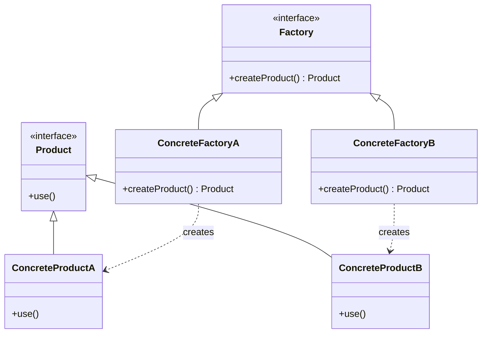
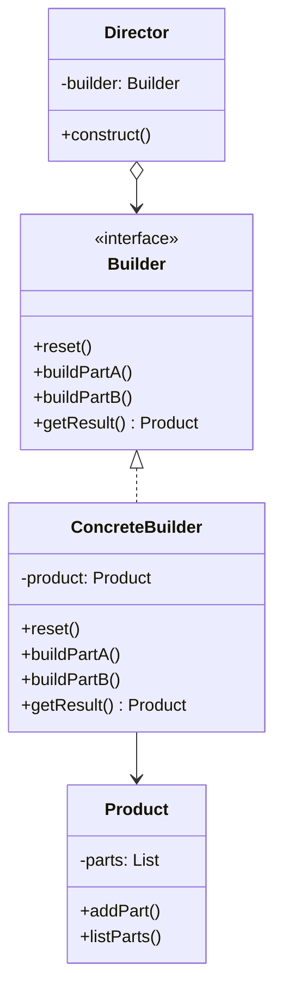
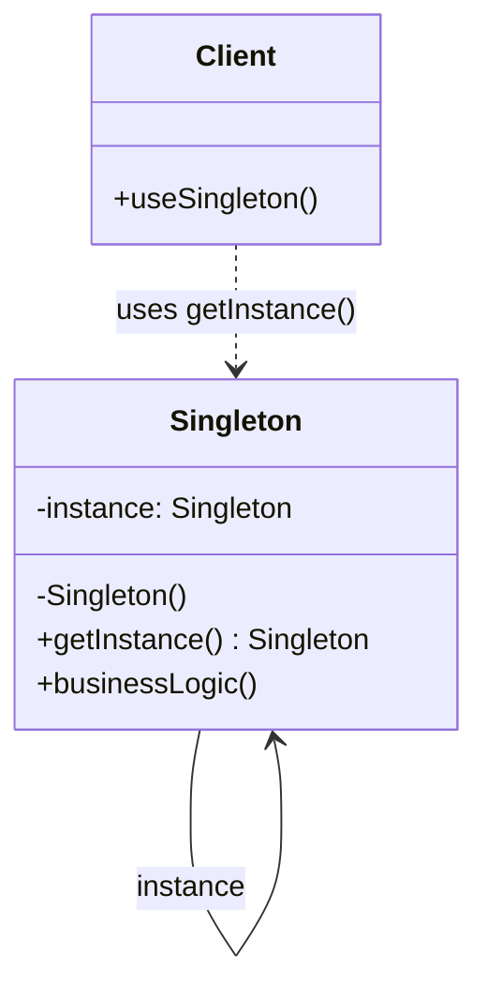
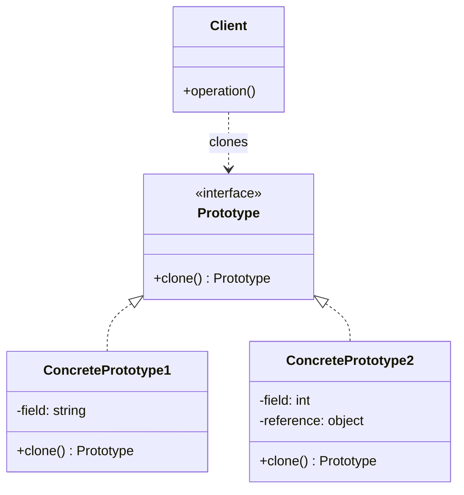

# 01.1 创建型模式 (Creational Patterns)

---

📌 **内容摘要**

本文档深入探讨创建型模式的核心原理和关键方法。内容涵盖设计模式领域的主要知识点，包括相关理论、方法及应用。适合初学者建立基础知识体系。

**关键词**: 设计模式

📚 **学习目标**
- 理解创建型模式的基本概念和核心原理
- 掌握相关术语和符号表示
- 建立该领域的系统性知识框架

🎯 **难度级别**: 初级

⏱️ **预计阅读时间**: 15分钟

**前置知识**: 基础数学知识

---


## 目录

- [01.1 创建型模式 (Creational Patterns)](#011-创建型模式-creational-patterns)
  - [目录](#目录)
  - [1. 概述](#1-概述)
  - [2. 工厂模式 (Factory Pattern)](#2-工厂模式-factory-pattern)
    - [2.1 形式化定义](#21-形式化定义)
    - [2.2 架构图](#22-架构图)
    - [2.3 Rust 实现](#23-rust-实现)
    - [2.4 Go 实现](#24-go-实现)
  - [3. 构建器模式 (Builder Pattern)](#3-构建器模式-builder-pattern)
    - [3.1 形式化定义](#31-形式化定义)
    - [3.2 架构图](#32-架构图)
    - [3.3 Rust 实现](#33-rust-实现)
    - [3.4 Go 实现](#34-go-实现)
  - [4. 单例模式 (Singleton Pattern)](#4-单例模式-singleton-pattern)
    - [4.1 形式化定义](#41-形式化定义)
    - [4.2 架构图](#42-架构图)
    - [4.3 Rust 实现](#43-rust-实现)
    - [4.4 Go 实现](#44-go-实现)
  - [5. 原型模式 (Prototype Pattern)](#5-原型模式-prototype-pattern)
    - [5.1 形式化定义](#51-形式化定义)
    - [5.2 架构图](#52-架构图)
    - [5.3 Rust 实现](#53-rust-实现)
    - [5.4 Go 实现](#54-go-实现)
  - [6. 模式对比与选择](#6-模式对比与选择)
  - [7. 相关文档](#7-相关文档)

## 1. 概述

创建型模式关注对象的创建机制，提供了一种在创建对象的同时隐藏创建逻辑的方式，而不是使用 new 运算符直接实例化对象。

**核心目标**：

- 解耦对象的创建与使用
- 控制系统中对象的创建过程
- 提供灵活的实例化策略

## 2. 工厂模式 (Factory Pattern)

### 2.1 形式化定义

设产品族 $P = \{p_1, p_2, ..., p_n\}$，工厂函数 $F: T \rightarrow P$，其中 $T$ 为产品类型标识符。

**抽象工厂**：
$$\forall t \in T, \exists f_t \in F: f_t() \rightarrow p \in P_t$$

其中 $P_t \subseteq P$ 表示类型 $t$ 对应的产品集合。

### 2.2 架构图



### 2.3 Rust 实现

```rust
use std::sync::Arc;

// 产品 trait
trait Product: Send + Sync {
    fn operation(&self) -> String;
}

// 具体产品 A
struct ConcreteProductA;
impl Product for ConcreteProductA {
    fn operation(&self) -> String {
        "Product A".to_string()
    }
}

// 具体产品 B
struct ConcreteProductB;
impl Product for ConcreteProductB {
    fn operation(&self) -> String {
        "Product B".to_string()
    }
}

// 工厂 trait
trait Factory {
    fn create_product(&self) -> Box<dyn Product>;
}

// 具体工厂 A
struct ConcreteFactoryA;
impl Factory for ConcreteFactoryA {
    fn create_product(&self) -> Box<dyn Product> {
        Box::new(ConcreteProductA)
    }
}

// 具体工厂 B
struct ConcreteFactoryB;
impl Factory for ConcreteFactoryB {
    fn create_product(&self) -> Box<dyn Product> {
        Box::new(ConcreteProductB)
    }
}

// 使用示例
fn client_code(factory: &dyn Factory) {
    let product = factory.create_product();
    println!("Result: {}", product.operation());
}

fn main() {
    let factory_a = ConcreteFactoryA;
    client_code(&factory_a);

    let factory_b = ConcreteFactoryB;
    client_code(&factory_b);
}
```

### 2.4 Go 实现

```go
package main

import "fmt"

// Product interface
type Product interface {
    Operation() string
}

// ConcreteProductA implements Product
type ConcreteProductA struct{}

func (p *ConcreteProductA) Operation() string {
    return "Product A"
}

// ConcreteProductB implements Product
type ConcreteProductB struct{}

func (p *ConcreteProductB) Operation() string {
    return "Product B"
}

// Factory interface
type Factory interface {
    CreateProduct() Product
}

// ConcreteFactoryA implements Factory
type ConcreteFactoryA struct{}

func (f *ConcreteFactoryA) CreateProduct() Product {
    return &ConcreteProductA{}
}

// ConcreteFactoryB implements Factory
type ConcreteFactoryB struct{}

func (f *ConcreteFactoryB) CreateProduct() Product {
    return &ConcreteProductB{}
}

// Client code
func ClientCode(factory Factory) {
    product := factory.CreateProduct()
    fmt.Printf("Result: %s\n", product.Operation())
}

func main() {
    factoryA := &ConcreteFactoryA{}
    ClientCode(factoryA)

    factoryB := &ConcreteFactoryB{}
    ClientCode(factoryB)
}
```

## 3. 构建器模式 (Builder Pattern)

### 3.1 形式化定义

设复杂对象 $O$ 由组件集合 $C = \{c_1, c_2, ..., c_n\}$ 组成，构建器 $B$ 定义装配过程：

$$B = \{build\_c_1, build\_c_2, ..., build\_c_n, get\_result\}$$

**构建过程**：
$$O = get\_result(build\_c_n(...(build\_c_2(build\_c_1(\emptyset)))...))$$

### 3.2 架构图



### 3.3 Rust 实现

```rust
// 产品
#[derive(Debug, Default)]
struct Product {
    parts: Vec<String>,
}

impl Product {
    fn add_part(&mut self, part: &str) {
        self.parts.push(part.to_string());
    }

    fn list_parts(&self) {
        println!("Product parts: {:?}", self.parts);
    }
}

// 构建器 trait
trait Builder {
    fn reset(&mut self);
    fn build_step_a(&mut self);
    fn build_step_b(&mut self);
    fn get_result(&self) -> Product;
}

// 具体构建器
struct ConcreteBuilder {
    product: Product,
}

impl ConcreteBuilder {
    fn new() -> Self {
        let mut builder = Self { product: Product::default() };
        builder.reset();
        builder
    }
}

impl Builder for ConcreteBuilder {
    fn reset(&mut self) {
        self.product = Product::default();
    }

    fn build_step_a(&mut self) {
        self.product.add_part("PartA");
    }

    fn build_step_b(&mut self) {
        self.product.add_part("PartB");
    }

    fn get_result(&self) -> Product {
        Product {
            parts: self.product.parts.clone(),
        }
    }
}

// 指挥者
struct Director;

impl Director {
    fn construct_minimal_viable_product(builder: &mut dyn Builder) -> Product {
        builder.reset();
        builder.build_step_a();
        builder.get_result()
    }

    fn construct_full_featured_product(builder: &mut dyn Builder) -> Product {
        builder.reset();
        builder.build_step_a();
        builder.build_step_b();
        builder.get_result()
    }
}

// 使用
fn main() {
    let mut builder = ConcreteBuilder::new();

    let minimal = Director::construct_minimal_viable_product(&mut builder);
    minimal.list_parts();

    let full = Director::construct_full_featured_product(&mut builder);
    full.list_parts();
}
```

### 3.4 Go 实现

```go
package main

import (
    "fmt"
    "strings"
)

// Product
type Product struct {
    parts []string
}

func (p *Product) AddPart(part string) {
    p.parts = append(p.parts, part)
}

func (p *Product) ListParts() string {
    return "Product parts: " + strings.Join(p.parts, ", ")
}

// Builder interface
type Builder interface {
    Reset()
    BuildStepA()
    BuildStepB()
    GetResult() *Product
}

// ConcreteBuilder
type ConcreteBuilder struct {
    product *Product
}

func NewConcreteBuilder() *ConcreteBuilder {
    b := &ConcreteBuilder{}
    b.Reset()
    return b
}

func (b *ConcreteBuilder) Reset() {
    b.product = &Product{}
}

func (b *ConcreteBuilder) BuildStepA() {
    b.product.AddPart("PartA")
}

func (b *ConcreteBuilder) BuildStepB() {
    b.product.AddPart("PartB")
}

func (b *ConcreteBuilder) GetResult() *Product {
    result := b.product
    b.Reset()
    return result
}

// Director
type Director struct {
    builder Builder
}

func NewDirector(b Builder) *Director {
    return &Director{builder: b}
}

func (d *Director) ConstructMinimalProduct() *Product {
    d.builder.Reset()
    d.builder.BuildStepA()
    return d.builder.GetResult()
}

func (d *Director) ConstructFullProduct() *Product {
    d.builder.Reset()
    d.builder.BuildStepA()
    d.builder.BuildStepB()
    return d.builder.GetResult()
}

func main() {
    builder := NewConcreteBuilder()
    director := NewDirector(builder)

    minimal := director.ConstructMinimalProduct()
    fmt.Println(minimal.ListParts())

    full := director.ConstructFullProduct()
    fmt.Println(full.ListParts())
}
```

## 4. 单例模式 (Singleton Pattern)

### 4.1 形式化定义

设类 $S$ 的实例集合为 $I_S$，单例保证：

$$|I_S| \leq 1 \land \exists! \text{ access\_point}: \text{access\_point} \rightarrow I_S$$

**全局访问**：
$$\forall c \in \text{Clients}, c \text{ can access } I_S \text{ via } getInstance()$$

### 4.2 架构图



### 4.3 Rust 实现

```rust
use std::sync::{Arc, Mutex, OnceLock};

// 线程安全单例
pub struct Singleton {
    data: String,
}

impl Singleton {
    fn new() -> Self {
        Singleton {
            data: "Initial Data".to_string(),
        }
    }

    // 全局访问点
    pub fn instance() -> Arc<Mutex<Singleton>> {
        static INSTANCE: OnceLock<Arc<Mutex<Singleton>>> = OnceLock::new();
        INSTANCE.get_or_init(|| {
            Arc::new(Mutex::new(Singleton::new()))
        }).clone()
    }

    pub fn get_data(&self) -> &str {
        &self.data
    }

    pub fn set_data(&mut self, data: &str) {
        self.data = data.to_string();
    }
}

// 使用示例
fn main() {
    // 获取单例实例
    let instance1 = Singleton::instance();
    {
        let mut s = instance1.lock().unwrap();
        s.set_data("Modified by Client 1");
        println!("Instance 1: {}", s.get_data());
    }

    // 再次获取，应该是同一实例
    let instance2 = Singleton::instance();
    {
        let s = instance2.lock().unwrap();
        println!("Instance 2: {}", s.get_data());
    }

    // 验证是同一实例
    println!("Same instance: {}", Arc::ptr_eq(&instance1, &instance2));
}
```

### 4.4 Go 实现

```go
package main

import (
    "fmt"
    "sync"
)

// Singleton struct
type Singleton struct {
    data string
}

var (
    instance *Singleton
    once     sync.Once
)

// GetInstance returns the singleton instance
func GetInstance() *Singleton {
    once.Do(func() {
        instance = &Singleton{
            data: "Initial Data",
        }
    })
    return instance
}

func (s *Singleton) GetData() string {
    return s.data
}

func (s *Singleton) SetData(data string) {
    s.data = data
}

func main() {
    // Get singleton instance
    s1 := GetInstance()
    s1.SetData("Modified by Client 1")
    fmt.Printf("Instance 1: %s\n", s1.GetData())

    // Get again, should be same instance
    s2 := GetInstance()
    fmt.Printf("Instance 2: %s\n", s2.GetData())

    // Verify same instance
    fmt.Printf("Same instance: %t\n", s1 == s2)
}
```

## 5. 原型模式 (Prototype Pattern)

### 5.1 形式化定义

设原型集合 $R = \{r_1, r_2, ..., r_n\}$，克隆操作 $clone: R \rightarrow R'$：

$$\forall r \in R, clone(r) = r' \text{ where } r' \cong r \land r' \neq r$$

**深拷贝 vs 浅拷贝**：

- 浅拷贝：$r'.field_i = r.field_i$（引用相同）
- 深拷贝：$r'.field_i = copy(r.field_i)$（值复制）

### 5.2 架构图



### 5.3 Rust 实现

```rust
use std::sync::Arc;

// 原型 trait
trait Prototype: Clone {
    fn clone_box(&self) -> Box<dyn Prototype>;
    fn describe(&self) -> String;
}

// 具体原型 A
#[derive(Clone)]
struct ConcretePrototypeA {
    field: String,
}

impl ConcretePrototypeA {
    fn new(field: &str) -> Self {
        Self {
            field: field.to_string(),
        }
    }
}

impl Prototype for ConcretePrototypeA {
    fn clone_box(&self) -> Box<dyn Prototype> {
        Box::new(self.clone())
    }

    fn describe(&self) -> String {
        format!("ConcretePrototypeA with field: {}", self.field)
    }
}

// 具体原型 B（含嵌套引用）
#[derive(Clone)]
struct NestedData {
    value: i32,
}

#[derive(Clone)]
struct ConcretePrototypeB {
    field: i32,
    nested: Arc<NestedData>,
}

impl ConcretePrototypeB {
    fn new(field: i32, nested_value: i32) -> Self {
        Self {
            field,
            nested: Arc::new(NestedData { value: nested_value }),
        }
    }

    // 深拷贝
    fn deep_clone(&self) -> Self {
        Self {
            field: self.field,
            nested: Arc::new(NestedData {
                value: self.nested.value,
            }),
        }
    }
}

impl Prototype for ConcretePrototypeB {
    fn clone_box(&self) -> Box<dyn Prototype> {
        Box::new(self.clone())
    }

    fn describe(&self) -> String {
        format!(
            "ConcretePrototypeB with field: {}, nested: {}",
            self.field, self.nested.value
        )
    }
}

// 原型注册表
struct PrototypeRegistry {
    prototypes: Vec<Box<dyn Prototype>>,
}

impl PrototypeRegistry {
    fn new() -> Self {
        Self {
            prototypes: Vec::new(),
        }
    }

    fn add(&mut self, prototype: Box<dyn Prototype>) {
        self.prototypes.push(prototype);
    }

    fn get(&self, index: usize) -> Option<Box<dyn Prototype>> {
        self.prototypes.get(index).map(|p| p.clone_box())
    }
}

fn main() {
    let mut registry = PrototypeRegistry::new();

    // 注册原型
    registry.add(Box::new(ConcretePrototypeA::new("Original A")));
    registry.add(Box::new(ConcretePrototypeB::new(42, 100)));

    // 克隆原型
    if let Some(clone_a) = registry.get(0) {
        println!("{}", clone_a.describe());
    }

    if let Some(clone_b) = registry.get(1) {
        println!("{}", clone_b.describe());
    }
}
```

### 5.4 Go 实现

```go
package main

import (
    "fmt"
)

// Prototype interface
type Prototype interface {
    Clone() Prototype
    Describe() string
}

// ConcretePrototypeA
type ConcretePrototypeA struct {
    Field string
}

func (p *ConcretePrototypeA) Clone() Prototype {
    return &ConcretePrototypeA{
        Field: p.Field,
    }
}

func (p *ConcretePrototypeA) Describe() string {
    return fmt.Sprintf("ConcretePrototypeA with field: %s", p.Field)
}

// ConcretePrototypeB
type NestedData struct {
    Value int
}

type ConcretePrototypeB struct {
    Field  int
    Nested *NestedData
}

func (p *ConcretePrototypeB) Clone() Prototype {
    // Deep clone
    return &ConcretePrototypeB{
        Field: p.Field,
        Nested: &NestedData{
            Value: p.Nested.Value,
        },
    }
}

func (p *ConcretePrototypeB) Describe() string {
    return fmt.Sprintf("ConcretePrototypeB with field: %d, nested: %d",
        p.Field, p.Nested.Value)
}

// PrototypeRegistry
type PrototypeRegistry struct {
    prototypes []Prototype
}

func NewPrototypeRegistry() *PrototypeRegistry {
    return &PrototypeRegistry{
        prototypes: []Prototype{},
    }
}

func (r *PrototypeRegistry) Add(prototype Prototype) {
    r.prototypes = append(r.prototypes, prototype)
}

func (r *PrototypeRegistry) Get(index int) (Prototype, bool) {
    if index < 0 || index >= len(r.prototypes) {
        return nil, false
    }
    return r.prototypes[index].Clone(), true
}

func main() {
    registry := NewPrototypeRegistry()

    // Register prototypes
    registry.Add(&ConcretePrototypeA{Field: "Original A"})
    registry.Add(&ConcretePrototypeB{
        Field:  42,
        Nested: &NestedData{Value: 100},
    })

    // Clone prototypes
    if cloneA, ok := registry.Get(0); ok {
        fmt.Println(cloneA.Describe())
    }

    if cloneB, ok := registry.Get(1); ok {
        fmt.Println(cloneB.Describe())
    }
}
```

## 6. 模式对比与选择

| 模式 | 适用场景 | 优点 | 缺点 |
|------|---------|------|------|
| 工厂 | 多种产品族，需解耦创建 | 符合开闭原则，扩展性好 | 类数量增加 |
| 构建器 | 复杂对象分步骤创建 | 精细控制构建过程 | 代码冗余 |
| 单例 | 全局唯一实例 | 节省资源，全局访问 | 测试困难，隐式依赖 |
| 原型 | 通过复制创建对象 | 避免继承复杂性 | 深拷贝实现复杂 |

**选择决策树**：

```
需要创建对象？
├── 需要全局唯一实例？ → 单例
├── 需要分步骤构建？ → 构建器
├── 需要复制现有对象？ → 原型
└── 需要解耦产品创建？ → 工厂
```

## 7. 相关文档

- [01.2_结构型模式](./01.2_结构型模式.md) - 对象的组合与结构
- [01.3_行为型模式](./01.3_行为型模式.md) - 对象间通信与行为
- [01.4_并发模式](./01.4_并发模式.md) - 多线程环境下的模式
- [02_微服务架构](../02_微服务架构/02.1_微服务设计原则.md) - 分布式系统设计
---

## 📚 延伸阅读

- [02.1 微服务形式化模型](../02_微服务架构/02.1_微服务形式化模型.md)
- [02.1 微服务设计原则](../02_微服务架构/02.1_微服务设计原则.md)
- [01.2 结构型模式 (Structural Patterns)](../01_设计模式/01.2_结构型模式.md)
- [01.2 结构型模式形式化](../01_设计模式/01.2_结构型模式形式化.md)
- [01.1 创建型模式形式化](../01_设计模式/01.1_创建型模式形式化.md)
