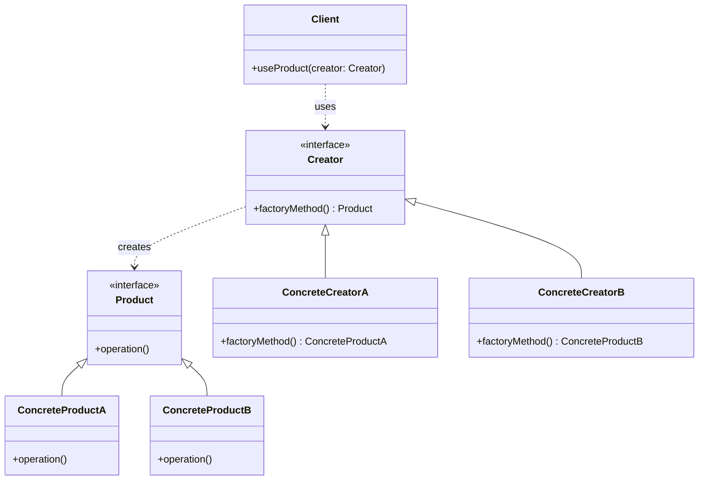
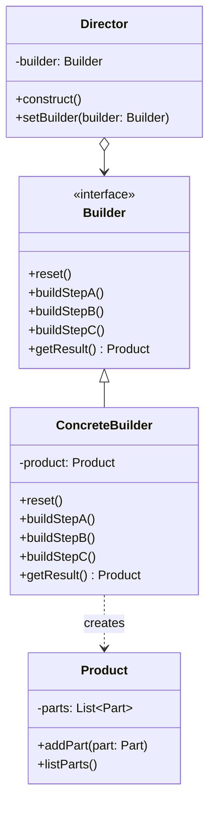
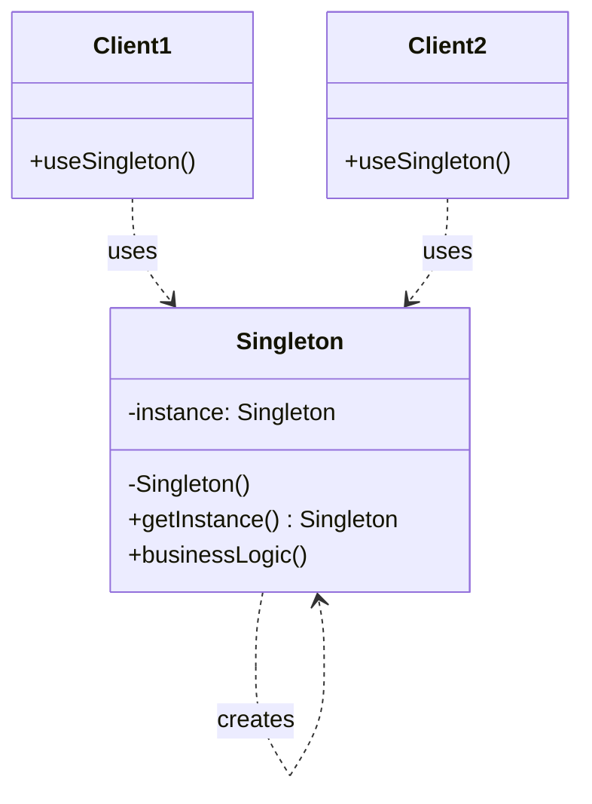

# 01.1 创建型模式形式化

## 01.1.1 概述

创建型模式关注对象的创建机制，通过形式化方法确保对象创建的正确性和一致性。

> **交叉引用**: 与 [01.2 结构型模式](./01.2_结构型模式形式化.md) 和 [01.3 行为型模式](./01.3_行为型模式形式化.md) 共同构成完整的设计模式理论体系。

---

## 01.1.2 工厂模式形式化

### 01.1.2.1 形式化定义

**定义 01.1.1** (产品接口). 设产品接口 $P$ 为对象类型的集合，其中每个 $p \in P$ 满足接口契约 $C_P$。

**定义 01.1.2** (工厂接口). 工厂 $F$ 是一个映射：
$$F: T \times C \to P$$
其中 $T$ 为产品类型集合，$C$ 为配置参数集合。

**定义 01.1.3** (具体工厂). 对于类型 $t \in T$，具体工厂 $F_t$ 满足：
$$\forall c \in C: F_t(c) = p_t \land p_t.type = t$$

### 01.1.2.2 形式化定理

**定理 01.1.1** (工厂正确性). 对于任意工厂 $F$ 和类型 $t$：
$$F.create(t, c).type = t$$

_证明_：由定义 01.1.3，具体工厂 $F_t$ 保证返回类型为 $t$ 的产品。$\square$

**定理 01.1.2** (开闭原则保持). 添加新产品类型 $t_{new}$ 不需要修改现有工厂代码。

_证明_：通过扩展映射 $F$ 的定义域 $T' = T \cup \{t_{new}\}$，创建新的具体工厂 $F_{t_{new}}$ 即可。$\square$

### 01.1.2.3 架构图



### 01.1.2.4 代码示例

**Rust 实现：**

```rust
// 产品接口
pub trait Product {
    fn operation(&self) -> String;
}

// 具体产品 A
pub struct ConcreteProductA;
impl Product for ConcreteProductA {
    fn operation(&self) -> String {
        "Product A".to_string()
    }
}

// 具体产品 B
pub struct ConcreteProductB;
impl Product for ConcreteProductB {
    fn operation(&self) -> String {
        "Product B".to_string()
    }
}

// 工厂接口
pub trait Factory {
    type ProductType: Product;
    fn create(&self) -> Self::ProductType;
}

// 具体工厂 A
pub struct ConcreteFactoryA;
impl Factory for ConcreteFactoryA {
    type ProductType = ConcreteProductA;
    fn create(&self) -> Self::ProductType {
        ConcreteProductA
    }
}

// 具体工厂 B
pub struct ConcreteFactoryB;
impl Factory for ConcreteFactoryB {
    type ProductType = ConcreteProductB;
    fn create(&self) -> Self::ProductType {
        ConcreteProductB
    }
}

// 使用
fn client_code<F: Factory>(factory: &F) -> String {
    let product = factory.create();
    product.operation()
}
```

**Java 实现：**

```java
// 产品接口
public interface Product {
    String operation();
}

// 具体产品
public class ConcreteProductA implements Product {
    @Override
    public String operation() {
        return "Product A";
    }
}

public class ConcreteProductB implements Product {
    @Override
    public String operation() {
        return "Product B";
    }
}

// 工厂接口
public interface Factory {
    Product create();
}

// 具体工厂
public class ConcreteFactoryA implements Factory {
    @Override
    public Product create() {
        return new ConcreteProductA();
    }
}

public class ConcreteFactoryB implements Factory {
    @Override
    public Product create() {
        return new ConcreteProductB();
    }
}
```

---

## 01.1.3 建造者模式形式化

### 01.1.3.1 形式化定义

**定义 01.1.4** (建造者). 建造者 $B$ 是一个四元组：
$$B = (S, s_0, \delta, \gamma)$$
其中：

- $S$: 构建状态集合
- $s_0 \in S$: 初始状态
- $\delta: S \times A \to S$: 状态转移函数，$A$ 为构建动作集合
- $\gamma: S \to O$: 产物生成函数，$O$ 为最终产物集合

**定义 01.1.5** (构建步骤序列). 构建步骤序列 $\sigma = [a_1, a_2, ..., a_n]$ 是动作的有序序列，满足：
$$s_i = \delta(s_{i-1}, a_i), \quad i = 1, ..., n$$

### 01.1.3.2 形式化定理

**定理 01.1.3** (建造者完整性). 对于任意有效构建序列 $\sigma$：
$$\gamma(\delta^*(s_0, \sigma)) \neq \bot$$
其中 $\delta^*$ 表示序列的累积应用。

**定理 01.1.4** (步骤顺序无关性). 若构建动作满足交换律，即：
$$\forall a_i, a_j \in A: \delta(\delta(s, a_i), a_j) = \delta(\delta(s, a_j), a_i)$$
则产物与步骤顺序无关。

### 01.1.3.3 架构图



### 01.1.3.4 代码示例

**Rust 实现：**

```rust
// 产品
#[derive(Debug, Default)]
pub struct House {
    walls: Option<String>,
    roof: Option<String>,
    windows: Option<i32>,
}

// 建造者接口
pub trait HouseBuilder {
    fn new() -> Self;
    fn build_walls(&mut self, material: &str) -> &mut Self;
    fn build_roof(&mut self, style: &str) -> &mut Self;
    fn build_windows(&mut self, count: i32) -> &mut Self;
    fn build(self) -> House;
}

// 具体建造者
pub struct ConcreteHouseBuilder {
    house: House,
}

impl HouseBuilder for ConcreteHouseBuilder {
    fn new() -> Self {
        Self {
            house: House::default(),
        }
    }

    fn build_walls(&mut self, material: &str) -> &mut Self {
        self.house.walls = Some(material.to_string());
        self
    }

    fn build_roof(&mut self, style: &str) -> &mut Self {
        self.house.roof = Some(style.to_string());
        self
    }

    fn build_windows(&mut self, count: i32) -> &mut Self {
        self.house.windows = Some(count);
        self
    }

    fn build(self) -> House {
        self.house
    }
}

// 导演者
pub struct Director;

impl Director {
    pub fn construct_standard_house(builder: &mut ConcreteHouseBuilder) -> House {
        builder
            .build_walls("brick")
            .build_roof("gable")
            .build_windows(4)
            .build()
    }
}

// 使用
fn main() {
    let mut builder = ConcreteHouseBuilder::new();
    let house = builder
        .build_walls("wood")
        .build_roof("flat")
        .build_windows(6)
        .build();
    println!("{:?}", house);
}
```

**Java 实现：**

```java
public class House {
    private String walls;
    private String roof;
    private int windows;

    public static class Builder {
        private House house = new House();

        public Builder walls(String material) {
            house.walls = material;
            return this;
        }

        public Builder roof(String style) {
            house.roof = style;
            return this;
        }

        public Builder windows(int count) {
            house.windows = count;
            return this;
        }

        public House build() {
            return house;
        }
    }
}

// 使用
House house = new House.Builder()
    .walls("brick")
    .roof("gable")
    .windows(4)
    .build();
```

---

## 01.1.4 单例模式形式化

### 01.1.4.1 形式化定义

**定义 01.1.6** (单例). 单例 $S$ 是一个对象实例，满足：
$$\forall t_1, t_2: \text{getInstance}()_{t_1} = \text{getInstance}()_{t_2}$$
即所有调用返回同一实例。

**定义 01.1.7** (懒汉式单例). 实例在首次访问时创建：
$$\text{instance} = \begin{cases} \text{new } S & \text{if } \text{instance} = \text{null} \\ \text{instance} & \text{otherwise} \end{cases}$$

**定义 01.1.8** (饿汉式单例). 实例在类加载时创建：
$$\text{instance} = \text{new } S \quad \text{(static initialization)}$$

### 01.1.4.2 形式化定理

**定理 01.1.5** (单例唯一性). 对于正确实现的单例模式，最多存在一个实例：
$$|\{s \in S : s \text{ 是单例实例}\}| \leq 1$$

_证明_：由构造函数私有化和静态实例变量保证。$\square$

**定理 01.1.6** (线程安全). 使用双重检查锁定的单例实现是线程安全的。

_证明_：

1. 第一次检查避免不必要的同步
2. `volatile` 关键字保证可见性和有序性
3. 第二次检查确保只有一个线程创建实例$\square$

### 01.1.4.3 架构图



### 01.1.4.4 代码示例

**Rust 实现（线程安全）：**

```rust
use std::sync::{Arc, Mutex, Once};
use std::mem::MaybeUninit;

pub struct Singleton {
    data: String,
}

impl Singleton {
    fn new() -> Self {
        Self {
            data: "Singleton Data".to_string(),
        }
    }

    pub fn get_instance() -> &'static Mutex<Singleton> {
        static mut INSTANCE: MaybeUninit<Mutex<Singleton>> = MaybeUninit::uninit();
        static ONCE: Once = Once::new();

        unsafe {
            ONCE.call_once(|| {
                INSTANCE.write(Mutex::new(Singleton::new()));
            });
            &*INSTANCE.as_ptr()
        }
    }

    pub fn do_something(&self) -> String {
        format!("Doing: {}", self.data)
    }
}

// 更现代的 Rust 实现使用 lazy_static
#[macro_use]
extern crate lazy_static;

lazy_static! {
    static ref INSTANCE: Mutex<Singleton> = Mutex::new(Singleton::new());
}
```

**Java 实现（双重检查锁定）：**

```java
public class Singleton {
    private static volatile Singleton instance;
    private String data;

    private Singleton() {
        this.data = "Singleton Data";
    }

    public static Singleton getInstance() {
        if (instance == null) {
            synchronized (Singleton.class) {
                if (instance == null) {
                    instance = new Singleton();
                }
            }
        }
        return instance;
    }

    public String doSomething() {
        return "Doing: " + data;
    }
}

// 枚举实现（最简洁）
public enum SingletonEnum {
    INSTANCE;

    private String data = "Singleton Data";

    public String doSomething() {
        return "Doing: " + data;
    }
}
```

---

## 01.1.5 模式比较与选择

| 模式 | 适用场景 | 复杂度 | 扩展性 |
|------|---------|--------|--------|
| 工厂 | 多种产品类型 | 中 | 高 |
| 建造者 | 复杂对象构造 | 高 | 中 |
| 单例 | 全局唯一资源 | 低 | 低 |

> **交叉引用**: 并发环境下的单例实现请参考 [01.4 并发模式](./01.4_并发模式形式化.md)。
