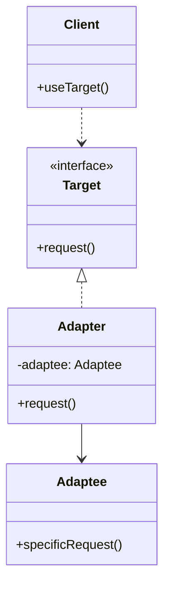
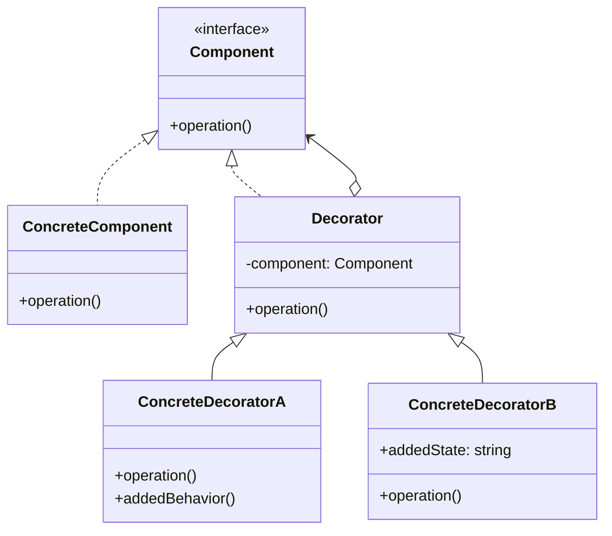
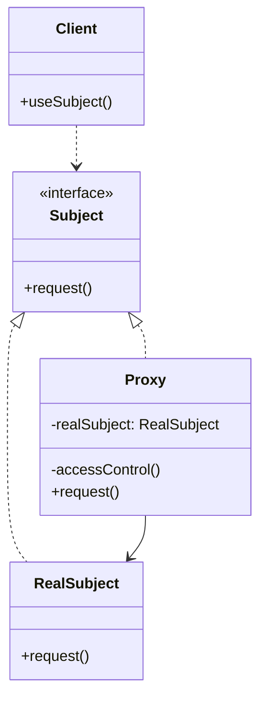
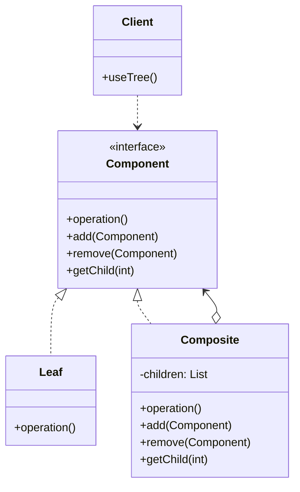

# 01.2 结构型模式 (Structural Patterns)

---

📌 **内容摘要**

本文档深入探讨结构型模式的核心原理和关键方法。内容涵盖设计模式领域的主要知识点，包括相关理论、方法及应用。适合初学者建立基础知识体系。

**关键词**: 设计模式

📚 **学习目标**

- 理解结构型模式的基本概念和核心原理
- 掌握相关术语和符号表示
- 建立该领域的系统性知识框架

🎯 **难度级别**: 初级

⏱️ **预计阅读时间**: 15分钟

**前置知识**: 基础数学知识

---


## 目录

- [01.2 结构型模式 (Structural Patterns)](#012-结构型模式-structural-patterns)
  - [目录](#目录)
  - [1. 概述](#1-概述)
  - [2. 适配器模式 (Adapter Pattern)](#2-适配器模式-adapter-pattern)
    - [2.1 形式化定义](#21-形式化定义)
    - [2.2 架构图](#22-架构图)
    - [2.3 Rust 实现](#23-rust-实现)
    - [2.4 Go 实现](#24-go-实现)
  - [3. 装饰器模式 (Decorator Pattern)](#3-装饰器模式-decorator-pattern)
    - [3.1 形式化定义](#31-形式化定义)
    - [3.2 架构图](#32-架构图)
    - [3.3 Rust 实现](#33-rust-实现)
    - [3.4 Go 实现](#34-go-实现)
  - [4. 代理模式 (Proxy Pattern)](#4-代理模式-proxy-pattern)
    - [4.1 形式化定义](#41-形式化定义)
    - [4.2 架构图](#42-架构图)
    - [4.3 Rust 实现](#43-rust-实现)
    - [4.4 Go 实现](#44-go-实现)
  - [5. 组合模式 (Composite Pattern)](#5-组合模式-composite-pattern)
    - [5.1 形式化定义](#51-形式化定义)
    - [5.2 架构图](#52-架构图)
    - [5.3 Rust 实现](#53-rust-实现)
    - [5.4 Go 实现](#54-go-实现)
  - [6. 模式对比](#6-模式对比)
  - [7. 相关文档](#7-相关文档)
  - [📋 前置知识](#-前置知识)
  - [📚 延伸阅读](#-延伸阅读)

## 1. 概述

结构型模式关注如何组合类和对象以形成更大的结构，同时保持结构的灵活性和高效性。

**核心主题**：

- 类与对象的组合
- 接口的转换与适配
- 功能的动态扩展
- 访问控制与代理

## 2. 适配器模式 (Adapter Pattern)

### 2.1 形式化定义

设目标接口为 $T$，被适配对象为 $A$，适配器 $Ad$ 满足：

$$\forall t \in T, \exists a \in A: Ad(t) \rightarrow a$$

**适配映射**：
$$f_{adapt}: T \times A \rightarrow \text{Compatible}$$

### 2.2 架构图



### 2.3 Rust 实现

```rust
// 目标接口
trait Target {
    fn request(&self) -> String;
}

// 被适配者
struct Adaptee;

impl Adaptee {
    fn specific_request(&self) -> String {
        ".eetpadA eht fo roivaheb laicepS".to_string()
    }
}

// 适配器
struct Adapter {
    adaptee: Adaptee,
}

impl Adapter {
    fn new(adaptee: Adaptee) -> Self {
        Self { adaptee }
    }
}

impl Target for Adapter {
    fn request(&self) -> String {
        // 转换被适配者的接口
        let specific = self.adaptee.specific_request();
        specific.chars().rev().collect()
    }
}

// 客户端代码
fn client_code(target: &dyn Target) {
    println!("{}", target.request());
}

fn main() {
    let adaptee = Adaptee;
    let adapter = Adapter::new(adaptee);
    client_code(&adapter);
}
```

### 2.4 Go 实现

```go
package main

import (
    "fmt"
)

// Target interface
type Target interface {
    Request() string
}

// Adaptee
type Adaptee struct{}

func (a *Adaptee) SpecificRequest() string {
    return ".eetpadA eht fo roivaheb laicepS"
}

// Adapter
type Adapter struct {
    adaptee *Adaptee
}

func NewAdapter(adaptee *Adaptee) *Adapter {
    return &Adapter{adaptee: adaptee}
}

func (a *Adapter) Request() string {
    // Reverse the string
    specific := a.adaptee.SpecificRequest()
    runes := []rune(specific)
    for i, j := 0, len(runes)-1; i < j; i, j = i+1, j-1 {
        runes[i], runes[j] = runes[j], runes[i]
    }
    return string(runes)
}

// Client code
func ClientCode(target Target) {
    fmt.Println(target.Request())
}

func main() {
    adaptee := &Adaptee{}
    adapter := NewAdapter(adaptee)
    ClientCode(adapter)
}
```

## 3. 装饰器模式 (Decorator Pattern)

### 3.1 形式化定义

设组件接口为 $C$，具体组件为 $C_c$，装饰器 $D$ 满足：

$$D = C_c \oplus \Delta C$$

其中 $\Delta C$ 表示附加功能，$\oplus$ 表示功能组合。

**递归装饰**：
$$D_n = D_{n-1} \oplus \Delta C_n$$

### 3.2 架构图



### 3.3 Rust 实现

```rust
// 组件 trait
trait Component {
    fn operation(&self) -> String;
}

// 具体组件
struct ConcreteComponent;

impl Component for ConcreteComponent {
    fn operation(&self) -> String {
        "ConcreteComponent".to_string()
    }
}

// 装饰器基类
struct Decorator {
    component: Box<dyn Component>,
}

impl Decorator {
    fn new(component: Box<dyn Component>) -> Self {
        Self { component }
    }
}

impl Component for Decorator {
    fn operation(&self) -> String {
        self.component.operation()
    }
}

// 具体装饰器 A
struct ConcreteDecoratorA {
    decorator: Decorator,
}

impl ConcreteDecoratorA {
    fn new(component: Box<dyn Component>) -> Self {
        Self {
            decorator: Decorator::new(component),
        }
    }
}

impl Component for ConcreteDecoratorA {
    fn operation(&self) -> String {
        format!("ConcreteDecoratorA({})", self.decorator.operation())
    }
}

// 具体装饰器 B
struct ConcreteDecoratorB {
    decorator: Decorator,
    added_state: String,
}

impl ConcreteDecoratorB {
    fn new(component: Box<dyn Component>, state: &str) -> Self {
        Self {
            decorator: Decorator::new(component),
            added_state: state.to_string(),
        }
    }
}

impl Component for ConcreteDecoratorB {
    fn operation(&self) -> String {
        format!(
            "ConcreteDecoratorB{}",
            self.added_state,
            self.decorator.operation()
        )
    }
}

fn main() {
    let simple = ConcreteComponent;
    println!("Simple: {}", simple.operation());

    let decorated_a = ConcreteDecoratorA::new(Box::new(simple));
    println!("With A: {}", decorated_a.operation());

    let decorated_b = ConcreteDecoratorB::new(Box::new(decorated_a), "extra");
    println!("With A and B: {}", decorated_b.operation());
}
```

### 3.4 Go 实现

```go
package main

import (
    "fmt"
)

// Component interface
type Component interface {
    Operation() string
}

// ConcreteComponent
type ConcreteComponent struct{}

func (c *ConcreteComponent) Operation() string {
    return "ConcreteComponent"
}

// Decorator
type Decorator struct {
    component Component
}

func (d *Decorator) Operation() string {
    return d.component.Operation()
}

// ConcreteDecoratorA
type ConcreteDecoratorA struct {
    Decorator
}

func NewConcreteDecoratorA(component Component) *ConcreteDecoratorA {
    return &ConcreteDecoratorA{
        Decorator: Decorator{component: component},
    }
}

func (d *ConcreteDecoratorA) Operation() string {
    return fmt.Sprintf("ConcreteDecoratorA(%s)", d.Decorator.Operation())
}

// ConcreteDecoratorB
type ConcreteDecoratorB struct {
    Decorator
    addedState string
}

func NewConcreteDecoratorB(component Component, state string) *ConcreteDecoratorB {
    return &ConcreteDecoratorB{
        Decorator:  Decorator{component: component},
        addedState: state,
    }
}

func (d *ConcreteDecoratorB) Operation() string {
    return fmt.Sprintf("ConcreteDecoratorB%s", d.addedState, d.Decorator.Operation())
}

func main() {
    simple := &ConcreteComponent{}
    fmt.Printf("Simple: %s\n", simple.Operation())

    decoratedA := NewConcreteDecoratorA(simple)
    fmt.Printf("With A: %s\n", decoratedA.Operation())

    decoratedB := NewConcreteDecoratorB(decoratedA, "extra")
    fmt.Printf("With A and B: %s\n", decoratedB.Operation())
}
```

## 4. 代理模式 (Proxy Pattern)

### 4.1 形式化定义

设真实主题为 $R$，代理为 $P$，共同实现接口 $S$：

$$
P(s) = \begin{cases}
C(s) & \text{if } s \in \text{cache} \\
R(s) & \text{otherwise}
\end{cases}
$$

其中 $C(s)$ 表示缓存访问，代理可添加额外控制逻辑。

### 4.2 架构图



### 4.3 Rust 实现

```rust
use std::collections::HashMap;
use std::sync::Mutex;

// 主题 trait
trait Subject {
    fn request(&self, key: &str) -> String;
}

// 真实主题
struct RealSubject;

impl RealSubject {
    fn new() -> Self {
        println!("RealSubject: Created");
        Self
    }
}

impl Subject for RealSubject {
    fn request(&self, key: &str) -> String {
        // 模拟昂贵的操作
        println!("RealSubject: Handling request for {}", key);
        format!("Data for {}", key)
    }
}

// 缓存代理
struct CachedProxy {
    real_subject: RealSubject,
    cache: Mutex<HashMap<String, String>>,
}

impl CachedProxy {
    fn new() -> Self {
        Self {
            real_subject: RealSubject::new(),
            cache: Mutex::new(HashMap::new()),
        }
    }
}

impl Subject for CachedProxy {
    fn request(&self, key: &str) -> String {
        // 检查缓存
        {
            let cache = self.cache.lock().unwrap();
            if let Some(value) = cache.get(key) {
                println!("CachedProxy: Returning cached result for {}", key);
                return value.clone();
            }
        }

        // 调用真实主题
        let result = self.real_subject.request(key);

        // 存入缓存
        {
            let mut cache = self.cache.lock().unwrap();
            cache.insert(key.to_string(), result.clone());
        }

        result
    }
}

// 访问控制代理
struct AccessControlProxy {
    real_subject: RealSubject,
    allowed_users: Vec<String>,
}

impl AccessControlProxy {
    fn new(allowed_users: Vec<String>) -> Self {
        Self {
            real_subject: RealSubject::new(),
            allowed_users,
        }
    }

    fn check_access(&self, user: &str) -> bool {
        self.allowed_users.contains(&user.to_string())
    }
}

impl Subject for AccessControlProxy {
    fn request(&self, key: &str) -> String {
        if !self.check_access(key) {
            return "Access Denied".to_string();
        }
        self.real_subject.request(key)
    }
}

fn main() {
    // 使用缓存代理
    let proxy = CachedProxy::new();
    println!("{}", proxy.request("key1"));
    println!("{}", proxy.request("key1")); // 从缓存获取

    // 使用访问控制代理
    let access_proxy = AccessControlProxy::new(vec!["admin".to_string(), "user1".to_string()]);
    println!("{}", access_proxy.request("admin"));
    println!("{}", access_proxy.request("unknown"));
}
```

### 4.4 Go 实现

```go
package main

import (
    "fmt"
    "sync"
)

// Subject interface
type Subject interface {
    Request(key string) string
}

// RealSubject
type RealSubject struct{}

func NewRealSubject() *RealSubject {
    fmt.Println("RealSubject: Created")
    return &RealSubject{}
}

func (r *RealSubject) Request(key string) string {
    fmt.Printf("RealSubject: Handling request for %s\n", key)
    return fmt.Sprintf("Data for %s", key)
}

// CachedProxy
type CachedProxy struct {
    realSubject *RealSubject
    cache       map[string]string
    mu          sync.RWMutex
}

func NewCachedProxy() *CachedProxy {
    return &CachedProxy{
        realSubject: NewRealSubject(),
        cache:       make(map[string]string),
    }
}

func (p *CachedProxy) Request(key string) string {
    p.mu.RLock()
    if value, ok := p.cache[key]; ok {
        p.mu.RUnlock()
        fmt.Printf("CachedProxy: Returning cached result for %s\n", key)
        return value
    }
    p.mu.RUnlock()

    result := p.realSubject.Request(key)

    p.mu.Lock()
    p.cache[key] = result
    p.mu.Unlock()

    return result
}

// AccessControlProxy
type AccessControlProxy struct {
    realSubject   *RealSubject
    allowedUsers  map[string]bool
}

func NewAccessControlProxy(users []string) *AccessControlProxy {
    allowed := make(map[string]bool)
    for _, user := range users {
        allowed[user] = true
    }
    return &AccessControlProxy{
        realSubject:  NewRealSubject(),
        allowedUsers: allowed,
    }
}

func (p *AccessControlProxy) checkAccess(user string) bool {
    return p.allowedUsers[user]
}

func (p *AccessControlProxy) Request(key string) string {
    if !p.checkAccess(key) {
        return "Access Denied"
    }
    return p.realSubject.Request(key)
}

func main() {
    // Use cached proxy
    proxy := NewCachedProxy()
    fmt.Println(proxy.Request("key1"))
    fmt.Println(proxy.Request("key1")) // From cache

    // Use access control proxy
    accessProxy := NewAccessControlProxy([]string{"admin", "user1"})
    fmt.Println(accessProxy.Request("admin"))
    fmt.Println(accessProxy.Request("unknown"))
}
```

## 5. 组合模式 (Composite Pattern)

### 5.1 形式化定义

设组件接口为 $C$，叶节点为 $L$，复合节点为 $Cp$：

$$Cp = \{c_1, c_2, ..., c_n\} \text{ where } \forall c_i \in C$$

**递归结构**：
$$operation(Cp) = \bigcup_{i=1}^{n} operation(c_i)$$

### 5.2 架构图



### 5.3 Rust 实现

```rust
use std::cell::RefCell;
use std::rc::Rc;

// 组件 trait
trait Component {
    fn operation(&self) -> String;
    fn add(&mut self, _component: Rc<RefCell<dyn Component>>) {}
    fn remove(&mut self, _index: usize) {}
}

// 叶节点
struct Leaf {
    name: String,
}

impl Leaf {
    fn new(name: &str) -> Self {
        Self {
            name: name.to_string(),
        }
    }
}

impl Component for Leaf {
    fn operation(&self) -> String {
        format!("Leaf({})", self.name)
    }
}

// 复合节点
struct Composite {
    name: String,
    children: Vec<Rc<RefCell<dyn Component>>>,
}

impl Composite {
    fn new(name: &str) -> Self {
        Self {
            name: name.to_string(),
            children: Vec::new(),
        }
    }
}

impl Component for Composite {
    fn operation(&self) -> String {
        let mut result = format!("Composite({})[", self.name);
        for (i, child) in self.children.iter().enumerate() {
            if i > 0 {
                result.push_str(", ");
            }
            result.push_str(&child.borrow().operation());
        }
        result.push_str("]");
        result
    }

    fn add(&mut self, component: Rc<RefCell<dyn Component>>) {
        self.children.push(component);
    }

    fn remove(&mut self, index: usize) {
        if index < self.children.len() {
            self.children.remove(index);
        }
    }
}

fn main() {
    let root = Rc::new(RefCell::new(Composite::new("Root")));

    let branch1 = Rc::new(RefCell::new(Composite::new("Branch1")));
    let branch2 = Rc::new(RefCell::new(Composite::new("Branch2")));

    let leaf1 = Rc::new(RefCell::new(Leaf::new("Leaf1")));
    let leaf2 = Rc::new(RefCell::new(Leaf::new("Leaf2")));
    let leaf3 = Rc::new(RefCell::new(Leaf::new("Leaf3")));

    branch1.borrow_mut().add(leaf1);
    branch1.borrow_mut().add(leaf2);
    branch2.borrow_mut().add(leaf3);

    root.borrow_mut().add(branch1.clone());
    root.borrow_mut().add(branch2.clone());

    println!("{}", root.borrow().operation());
}
```

### 5.4 Go 实现

```go
package main

import (
    "fmt"
    "strings"
)

// Component interface
type Component interface {
    Operation() string
    Add(component Component)
    Remove(index int)
}

// Leaf
type Leaf struct {
    name string
}

func NewLeaf(name string) *Leaf {
    return &Leaf{name: name}
}

func (l *Leaf) Operation() string {
    return fmt.Sprintf("Leaf(%s)", l.name)
}

func (l *Leaf) Add(component Component) {
    // Leaf cannot add children
}

func (l *Leaf) Remove(index int) {
    // Leaf has no children
}

// Composite
type Composite struct {
    name     string
    children []Component
}

func NewComposite(name string) *Composite {
    return &Composite{
        name:     name,
        children: []Component{},
    }
}

func (c *Composite) Operation() string {
    var parts []string
    for _, child := range c.children {
        parts = append(parts, child.Operation())
    }
    return fmt.Sprintf("Composite(%s)[%s]", c.name, strings.Join(parts, ", "))
}

func (c *Composite) Add(component Component) {
    c.children = append(c.children, component)
}

func (c *Composite) Remove(index int) {
    if index >= 0 && index < len(c.children) {
        c.children = append(c.children[:index], c.children[index+1:]...)
    }
}

func main() {
    root := NewComposite("Root")

    branch1 := NewComposite("Branch1")
    branch2 := NewComposite("Branch2")

    leaf1 := NewLeaf("Leaf1")
    leaf2 := NewLeaf("Leaf2")
    leaf3 := NewLeaf("Leaf3")

    branch1.Add(leaf1)
    branch1.Add(leaf2)
    branch2.Add(leaf3)

    root.Add(branch1)
    root.Add(branch2)

    fmt.Println(root.Operation())
}
```

## 6. 模式对比

| 模式 | 核心作用 | 使用场景 |
|------|---------|---------|
| 适配器 | 接口转换 | 集成不兼容接口 |
| 装饰器 | 动态添加功能 | 功能扩展，避免子类爆炸 |
| 代理 | 访问控制 | 权限、缓存、延迟加载 |
| 组合 | 树形结构 | 部分-整体层次结构 |

## 7. 相关文档

- [01.1_创建型模式](./01.1_创建型模式.md) - 对象创建机制
- [01.3_行为型模式](./01.3_行为型模式.md) - 对象间交互
- [01.4_并发模式](./01.4_并发模式.md) - 并发安全结构
- [04_分布式系统](../04_分布式系统/04.1_分布式基础.md) - 分布式架构

---

## 📋 前置知识

- [01.1 创建型模式 (Creational Patterns)](../01_设计模式/01.1_创建型模式.md)

---

## 📚 延伸阅读

- [01.4 并发模式 (Concurrent Patterns)](../01_设计模式/01.4_并发模式.md)
- [01.4 并发模式形式化](../01_设计模式/01.4_并发模式形式化.md)
- [01.3 行为型模式 (Behavioral Patterns)](../01_设计模式/01.3_行为型模式.md)
- [01.3 行为型模式形式化](../01_设计模式/01.3_行为型模式形式化.md)
- [01.2 结构型模式形式化](../01_设计模式/01.2_结构型模式形式化.md)
