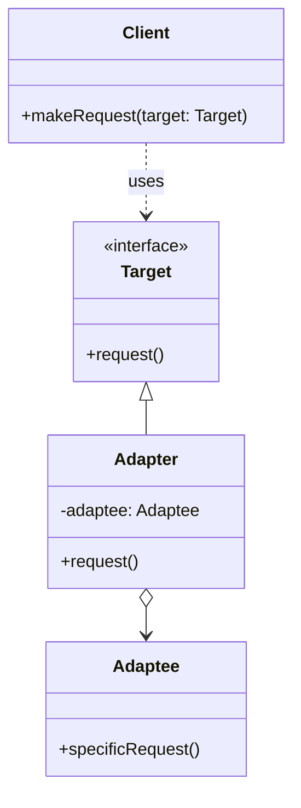
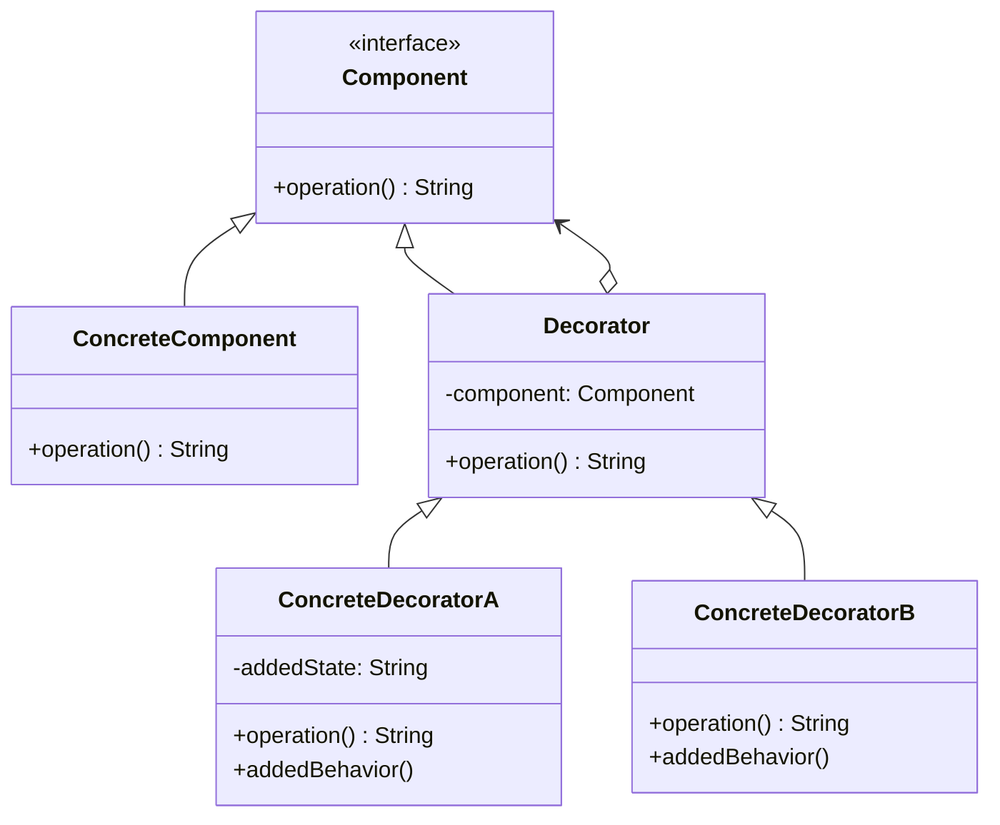
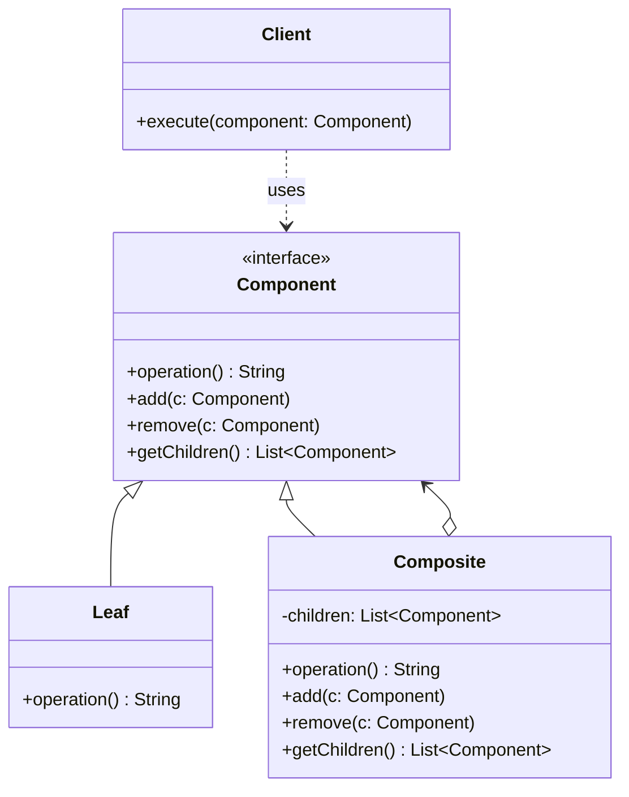
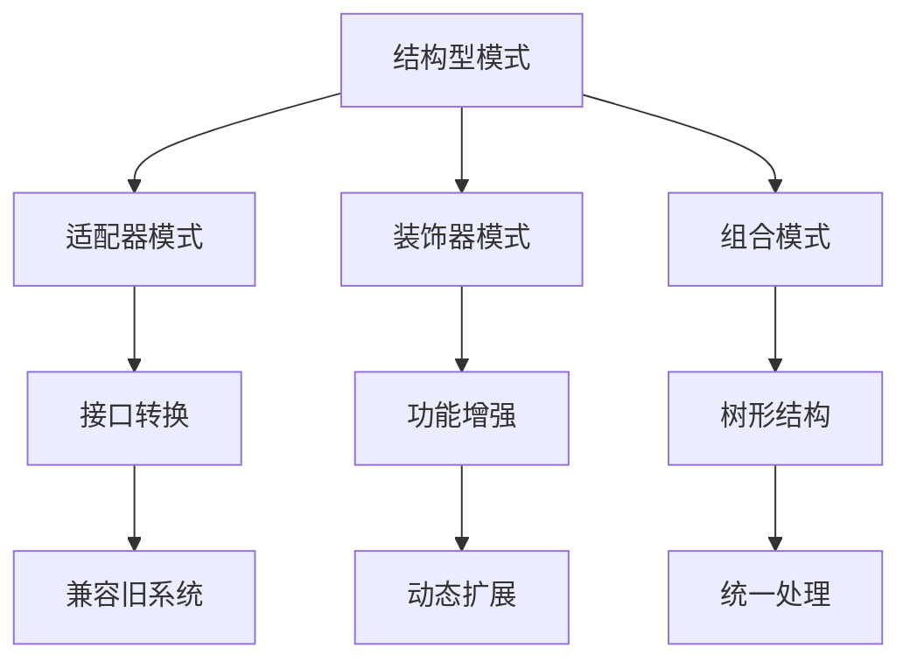

# 01.2 结构型模式形式化

---

📌 **内容摘要**

本文档深入探讨结构型模式形式化的核心原理和关键方法。内容涵盖设计模式领域的主要知识点，包括创建型, 结构型等关键主题。适合具备相关基础的学习者进行深入研究。

**关键词**: 创建型, 结构型, 设计模式

📚 **学习目标**
- 深入理解结构型模式形式化的理论体系和形式化方法
- 能够进行相关定理的形式化证明
- 掌握形式化证明的基本技巧

🎯 **难度级别**: 高级

⏱️ **预计阅读时间**: 15分钟

**前置知识**: 该领域的中级知识, 形式化方法基础

---


## 01.2.1 概述

结构型模式关注如何将类或对象组合成更大的结构，同时保持结构的灵活性和高效性。

> **交叉引用**: 与 [01.1 创建型模式](./01.1_创建型模式形式化.md) 和 [01.3 行为型模式](./01.3_行为型模式形式化.md) 形成完整的设计模式体系。

---

## 01.2.2 适配器模式形式化

### 01.2.2.1 形式化定义

**定义 01.2.1** (目标接口). 设目标接口 $T$ 定义了客户端期望的操作集合 $O_T = \{o_1, o_2, ..., o_n\}$。

**定义 01.2.2** (被适配者). 被适配者 $A$ 实现了操作集合 $O_A = \{a_1, a_2, ..., a_m\}$，其中 $O_A \cap O_T = \emptyset$。

**定义 01.2.3** (适配器). 适配器 $Ad$ 是一个映射：
$$Ad: O_T \to O_A^*$$
其中 $O_A^*$ 表示 $O_A$ 操作的序列组合。

**定义 01.2.4** (适配正确性). 适配器 $Ad$ 是正确的，当且仅当：
$$\forall o \in O_T: Ad(o) \approx_T o$$
其中 $\approx_T$ 表示在目标接口语义下的等价关系。

### 01.2.2.2 形式化定理

**定理 01.2.1** (适配器保持性). 若 $Ad$ 是正确的适配器，则对于所有 $t \in T$：
$$t.request() = Ad.adaptee.specificRequest()$$

_证明_：由定义 01.2.4 的等价关系直接可得。$\square$

**定理 01.2.2** (开闭原则). 添加新的被适配者类型不需要修改现有客户端代码。

_证明_：适配器实现了目标接口 $T$，客户端仅依赖 $T$。新的被适配者通过新的适配器类实现 $T$。$\square$

### 01.2.2.3 架构图



### 01.2.2.4 代码示例

**Rust 实现：**

```rust
// 目标接口
pub trait Target {
    fn request(&self) -> String;
}

// 被适配者
pub struct Adaptee {
    pub data: String,
}

impl Adaptee {
    pub fn new(data: &str) -> Self {
        Self {
            data: data.to_string(),
        }
    }

    pub fn specific_request(&self) -> String {
        format!("Specific: {}", self.data)
    }
}

// 对象适配器
pub struct Adapter {
    adaptee: Adaptee,
}

impl Adapter {
    pub fn new(adaptee: Adaptee) -> Self {
        Self { adaptee }
    }
}

impl Target for Adapter {
    fn request(&self) -> String {
        // 转换调用
        let specific = self.adaptee.specific_request();
        format!("Adapter converted: {}", specific)
    }
}

// 类适配器（使用泛型）
pub struct ClassAdapter<T> {
    adaptee: T,
}

impl<T: SpecificInterface> Target for ClassAdapter<T> {
    fn request(&self) -> String {
        self.adaptee.specific_request()
    }
}

pub trait SpecificInterface {
    fn specific_request(&self) -> String;
}

impl SpecificInterface for Adaptee {
    fn specific_request(&self) -> String {
        format!("Specific: {}", self.data)
    }
}

// 使用
fn client_code(target: &dyn Target) -> String {
    target.request()
}
```

**Java 实现：**

```java
// 目标接口
public interface Target {
    String request();
}

// 被适配者
public class Adaptee {
    public String specificRequest() {
        return "Specific request";
    }
}

// 对象适配器
public class Adapter implements Target {
    private Adaptee adaptee;

    public Adapter(Adaptee adaptee) {
        this.adaptee = adaptee;
    }

    @Override
    public String request() {
        return "Adapter: " + adaptee.specificRequest();
    }
}

// 类适配器
public class ClassAdapter extends Adaptee implements Target {
    @Override
    public String request() {
        return specificRequest();
    }
}
```

---

## 01.2.3 装饰器模式形式化

### 01.2.3.1 形式化定义

**定义 01.2.5** (组件接口). 组件接口 $C$ 定义了基本操作：
$$C = (M, \Sigma)$$
其中 $M$ 为方法集合，$\Sigma$ 为方法签名。

**定义 01.2.6** (装饰器). 装饰器 $D$ 是一个递归结构：
$$D = (C_{base}, C_{wrap}, \phi)$$
其中：

- $C_{base}$: 被装饰的基础组件
- $C_{wrap}$: 包装后的组件
- $\phi: M \to M$: 方法增强映射

**定义 01.2.7** (装饰器链). 装饰器链是一个递归定义：
$$Chain_n = \begin{cases} C & n = 0 \\ D(Chain_{n-1}) & n > 0 \end{cases}$$

### 01.2.3.2 形式化定理

**定理 01.2.3** (装饰器透明性). 对于任意装饰器链 $Chain_n$ 和客户端 $Client$：
$$Client.use(Chain_n) = Client.use(C)$$
即客户端无法区分原始组件和装饰后组件。

_证明_：装饰器实现了组件接口 $C$，客户端仅依赖 $C$。由里氏替换原则可得。$\square$

**定理 01.2.4** (功能叠加). 设装饰器 $D_1, D_2, ..., D_n$ 分别添加功能 $f_1, f_2, ..., f_n$，则：
$$D_n(...D_2(D_1(C))...).m() = f_n(...f_2(f_1(C.m()))...)$$

### 01.2.3.3 架构图



### 01.2.3.4 代码示例

**Rust 实现：**

```rust
// 组件接口
pub trait Component {
    fn operation(&self) -> String;
}

// 具体组件
pub struct ConcreteComponent;

impl Component for ConcreteComponent {
    fn operation(&self) -> String {
        "ConcreteComponent".to_string()
    }
}

// 装饰器基类
pub struct Decorator<T: Component> {
    component: T,
}

impl<T: Component> Decorator<T> {
    pub fn new(component: T) -> Self {
        Self { component }
    }
}

impl<T: Component> Component for Decorator<T> {
    fn operation(&self) -> String {
        self.component.operation()
    }
}

// 具体装饰器 A
pub struct ConcreteDecoratorA<T: Component> {
    decorator: Decorator<T>,
    added_state: String,
}

impl<T: Component> ConcreteDecoratorA<T> {
    pub fn new(component: T) -> Self {
        Self {
            decorator: Decorator::new(component),
            added_state: "A".to_string(),
        }
    }

    fn added_behavior(&self) -> String {
        format!("Behavior {}", self.added_state)
    }
}

impl<T: Component> Component for ConcreteDecoratorA<T> {
    fn operation(&self) -> String {
        format!(
            "{} + {}",
            self.decorator.operation(),
            self.added_behavior()
        )
    }
}

// 具体装饰器 B
pub struct ConcreteDecoratorB<T: Component> {
    decorator: Decorator<T>,
}

impl<T: Component> ConcreteDecoratorB<T> {
    pub fn new(component: T) -> Self {
        Self {
            decorator: Decorator::new(component),
        }
    }
}

impl<T: Component> Component for ConcreteDecoratorB<T> {
    fn operation(&self) -> String {
        format!(
            "{} + DecoratorB",
            self.decorator.operation()
        )
    }
}

// 使用
fn main() {
    let simple = ConcreteComponent;
    println!("{}", simple.operation());

    let decorated_a = ConcreteDecoratorA::new(simple);
    println!("{}", decorated_a.operation());

    let decorated_b = ConcreteDecoratorB::new(decorated_a);
    println!("{}", decorated_b.operation());
}
```

**Java 实现：**

```java
// 组件接口
public interface Component {
    String operation();
}

// 具体组件
public class ConcreteComponent implements Component {
    @Override
    public String operation() {
        return "ConcreteComponent";
    }
}

// 抽象装饰器
public abstract class Decorator implements Component {
    protected Component component;

    public Decorator(Component component) {
        this.component = component;
    }

    @Override
    public String operation() {
        return component.operation();
    }
}

// 具体装饰器 A
public class ConcreteDecoratorA extends Decorator {
    public ConcreteDecoratorA(Component component) {
        super(component);
    }

    @Override
    public String operation() {
        return super.operation() + " + DecoratorA";
    }
}

// 具体装饰器 B
public class ConcreteDecoratorB extends Decorator {
    public ConcreteDecoratorB(Component component) {
        super(component);
    }

    @Override
    public String operation() {
        return super.operation() + " + DecoratorB";
    }
}

// 使用
Component simple = new ConcreteComponent();
Component decorated = new ConcreteDecoratorB(
    new ConcreteDecoratorA(simple)
);
```

---

## 01.2.4 组合模式形式化

### 01.2.4.1 形式化定义

**定义 01.2.8** (组件). 组件 $C$ 是组合模式的基本元素：
$$C = (id, M, P)$$
其中：

- $id$: 唯一标识符
- $M$: 方法集合
- $P$: 父节点引用（可选）

**定义 01.2.9** (叶子节点). 叶子节点 $L$ 是没有子节点的组件：
$$L = (id, M, P, \emptyset)$$

**定义 01.2.10** (复合节点). 复合节点 $Composite$ 是包含子节点的组件：
$$Composite = (id, M, P, \{C_1, C_2, ..., C_n\})$$
其中 $\{C_1, C_2, ..., C_n\}$ 是子组件集合。

**定义 01.2.11** (树结构). 组合模式形成一棵树 $T = (V, E)$，其中：

- $V$: 所有组件节点
- $E = \{(parent, child) | child \in parent.children\}$

### 01.2.4.2 形式化定理

**定理 01.2.5** (树的归纳). 对于组合树中的任意操作 $op$：
$$op(Composite) = f(op(C_1), op(C_2), ..., op(C_n))$$
其中 $f$ 是聚合函数。

**定理 01.2.6** (统一接口). 对于任意组件 $c \in V$：
$$c \in L \lor c \in Composite \Rightarrow c \text{ 实现相同接口 } I$$

_证明_：组合模式要求叶子和复合节点实现相同接口，客户端可以统一处理。$\square$

### 01.2.4.3 架构图



### 01.2.4.4 代码示例

**Rust 实现：**

```rust
use std::rc::Rc;
use std::cell::RefCell;

// 组件接口
pub trait Component {
    fn operation(&self) -> String;
    fn add(&mut self, component: Rc<RefCell<dyn Component>>);
    fn remove(&mut self, component: Rc<RefCell<dyn Component>>);
}

// 叶子节点
pub struct Leaf {
    name: String,
}

impl Leaf {
    pub fn new(name: &str) -> Self {
        Self {
            name: name.to_string(),
        }
    }
}

impl Component for Leaf {
    fn operation(&self) -> String {
        format!("Leaf({})", self.name)
    }

    fn add(&mut self, _component: Rc<RefCell<dyn Component>>) {
        panic!("Cannot add to a leaf");
    }

    fn remove(&mut self, _component: Rc<RefCell<dyn Component>>) {
        panic!("Cannot remove from a leaf");
    }
}

// 复合节点
pub struct Composite {
    name: String,
    children: Vec<Rc<RefCell<dyn Component>>>,
}

impl Composite {
    pub fn new(name: &str) -> Self {
        Self {
            name: name.to_string(),
            children: Vec::new(),
        }
    }
}

impl Component for Composite {
    fn operation(&self) -> String {
        let mut result = format!("Composite({})[", self.name);
        for (i, child) in self.children.iter().enumerate() {
            if i > 0 {
                result.push_str(", ");
            }
            result.push_str(&child.borrow().operation());
        }
        result.push_str("]");
        result
    }

    fn add(&mut self, component: Rc<RefCell<dyn Component>>) {
        self.children.push(component);
    }

    fn remove(&mut self, component: Rc<RefCell<dyn Component>>) {
        self.children.retain(|c| !Rc::ptr_eq(c, &component));
    }
}

// 使用
fn main() {
    let root = Rc::new(RefCell::new(Composite::new("root")));

    let branch1 = Rc::new(RefCell::new(Composite::new("branch1")));
    let branch2 = Rc::new(RefCell::new(Composite::new("branch2")));

    let leaf1 = Rc::new(RefCell::new(Leaf::new("leaf1")));
    let leaf2 = Rc::new(RefCell::new(Leaf::new("leaf2")));
    let leaf3 = Rc::new(RefCell::new(Leaf::new("leaf3")));

    branch1.borrow_mut().add(leaf1);
    branch1.borrow_mut().add(leaf2);
    branch2.borrow_mut().add(leaf3);

    root.borrow_mut().add(branch1);
    root.borrow_mut().add(branch2);

    println!("{}", root.borrow().operation());
}
```

**Java 实现：**

```java
import java.util.ArrayList;
import java.util.List;

// 组件接口
public interface Component {
    String operation();
    void add(Component component);
    void remove(Component component);
    List<Component> getChildren();
}

// 叶子节点
public class Leaf implements Component {
    private String name;

    public Leaf(String name) {
        this.name = name;
    }

    @Override
    public String operation() {
        return "Leaf(" + name + ")";
    }

    @Override
    public void add(Component component) {
        throw new UnsupportedOperationException();
    }

    @Override
    public void remove(Component component) {
        throw new UnsupportedOperationException();
    }

    @Override
    public List<Component> getChildren() {
        return new ArrayList<>();
    }
}

// 复合节点
public class Composite implements Component {
    private String name;
    private List<Component> children = new ArrayList<>();

    public Composite(String name) {
        this.name = name;
    }

    @Override
    public String operation() {
        StringBuilder sb = new StringBuilder("Composite(" + name + ")[");
        for (int i = 0; i < children.size(); i++) {
            if (i > 0) sb.append(", ");
            sb.append(children.get(i).operation());
        }
        sb.append("]");
        return sb.toString();
    }

    @Override
    public void add(Component component) {
        children.add(component);
    }

    @Override
    public void remove(Component component) {
        children.remove(component);
    }

    @Override
    public List<Component> getChildren() {
        return children;
    }
}
```

---

## 01.2.5 模式关系图



> **交叉引用**: 组合模式在微服务架构中的应用请参考 [02.1 微服务形式化模型](../02_微服务架构/02.1_微服务形式化模型.md)。
---

## 📚 延伸阅读

- [02.1 微服务形式化模型](../02_微服务架构/02.1_微服务形式化模型.md)
- [02.1 微服务设计原则](../02_微服务架构/02.1_微服务设计原则.md)
- [01.3 行为型模式 (Behavioral Patterns)](../01_设计模式/01.3_行为型模式.md)
- [01.3 行为型模式形式化](../01_设计模式/01.3_行为型模式形式化.md)
- [01.2 结构型模式 (Structural Patterns)](../01_设计模式/01.2_结构型模式.md)
