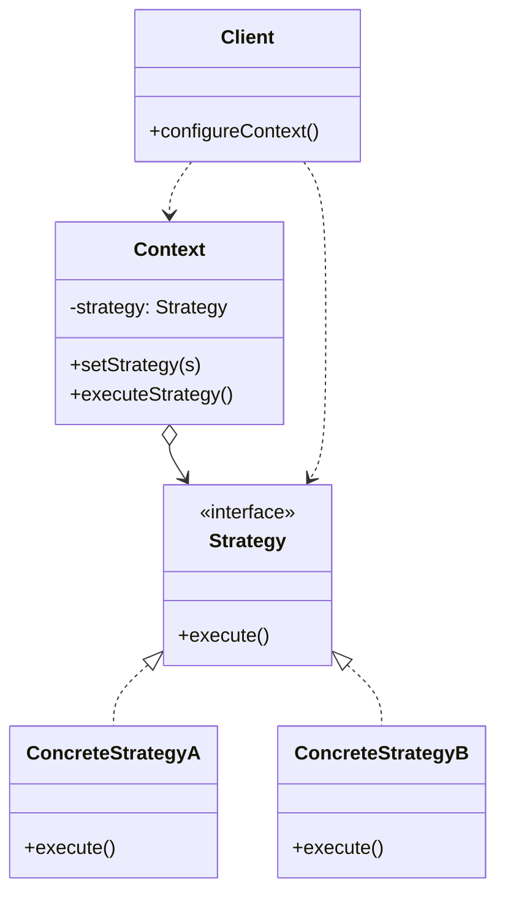
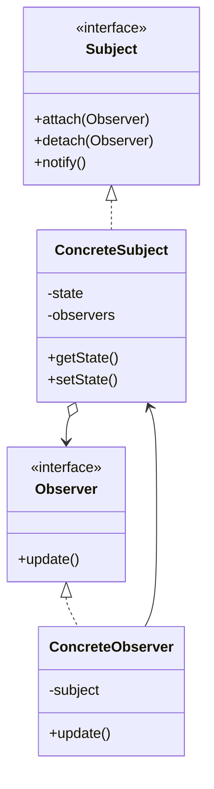
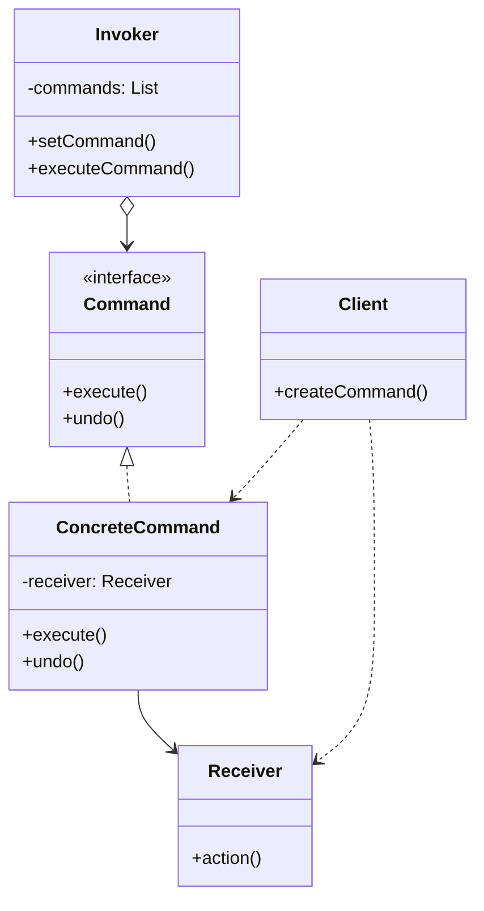
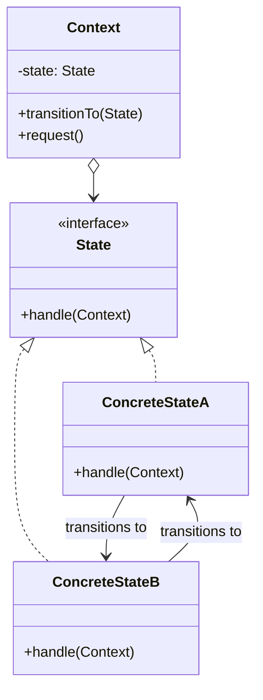
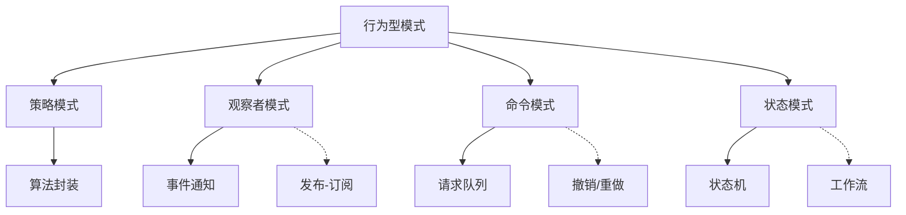

# 01.3 行为型模式 (Behavioral Patterns)

## 目录

- [01.3 行为型模式 (Behavioral Patterns)](#013-行为型模式-behavioral-patterns)
  - [目录](#目录)
  - [1. 概述](#1-概述)
  - [2. 策略模式 (Strategy Pattern)](#2-策略模式-strategy-pattern)
    - [2.1 形式化定义](#21-形式化定义)
    - [2.2 架构图](#22-架构图)
    - [2.3 Rust 实现](#23-rust-实现)
    - [2.4 Go 实现](#24-go-实现)
  - [3. 观察者模式 (Observer Pattern)](#3-观察者模式-observer-pattern)
    - [3.1 形式化定义](#31-形式化定义)
    - [3.2 架构图](#32-架构图)
    - [3.3 Rust 实现](#33-rust-实现)
    - [3.4 Go 实现](#34-go-实现)
  - [4. 命令模式 (Command Pattern)](#4-命令模式-command-pattern)
    - [4.1 形式化定义](#41-形式化定义)
    - [4.2 架构图](#42-架构图)
    - [4.3 Rust 实现](#43-rust-实现)
    - [4.4 Go 实现](#44-go-实现)
  - [5. 状态模式 (State Pattern)](#5-状态模式-state-pattern)
    - [5.1 形式化定义](#51-形式化定义)
    - [5.2 架构图](#52-架构图)
    - [5.3 Rust 实现](#53-rust-实现)
    - [5.4 Go 实现](#54-go-实现)
  - [6. 模式关系](#6-模式关系)
  - [7. 相关文档](#7-相关文档)

## 1. 概述

行为型模式关注对象之间的通信和职责分配，定义了对象如何交互以及如何分配职责。

**核心关注点**：

- 算法封装与替换
- 对象间状态通知
- 请求封装与队列
- 状态转换管理

## 2. 策略模式 (Strategy Pattern)

### 2.1 形式化定义

设策略接口为 $S$，具体策略集合为 $S_c = \{s_1, s_2, ..., s_n\}$，上下文 $C$ 持有策略引用：

$$C.execute() = s_i.algorithm() \text{ where } s_i \in S_c$$

**策略切换**：
$$C.set\_strategy(s_j): C.execute() \rightarrow s_j.algorithm()$$

### 2.2 架构图



### 2.3 Rust 实现

```rust
// 策略 trait
trait Strategy {
    fn execute(&self, data: &[i32]) -> i32;
}

// 具体策略：求和
struct SumStrategy;

impl Strategy for SumStrategy {
    fn execute(&self, data: &[i32]) -> i32 {
        data.iter().sum()
    }
}

// 具体策略：求平均值
struct AverageStrategy;

impl Strategy for AverageStrategy {
    fn execute(&self, data: &[i32]) -> i32 {
        if data.is_empty() {
            0
        } else {
            data.iter().sum::<i32>() / data.len() as i32
        }
    }
}

// 具体策略：求最大值
struct MaxStrategy;

impl Strategy for MaxStrategy {
    fn execute(&self, data: &[i32]) -> i32 {
        data.iter().copied().max().unwrap_or(0)
    }
}

// 上下文
struct Context {
    strategy: Box<dyn Strategy>,
}

impl Context {
    fn new(strategy: Box<dyn Strategy>) -> Self {
        Self { strategy }
    }

    fn set_strategy(&mut self, strategy: Box<dyn Strategy>) {
        self.strategy = strategy;
    }

    fn execute(&self, data: &[i32]) -> i32 {
        self.strategy.execute(data)
    }
}

fn main() {
    let data = vec![1, 5, 3, 9, 2, 8];

    let mut context = Context::new(Box::new(SumStrategy));
    println!("Sum: {}", context.execute(&data));

    context.set_strategy(Box::new(AverageStrategy));
    println!("Average: {}", context.execute(&data));

    context.set_strategy(Box::new(MaxStrategy));
    println!("Max: {}", context.execute(&data));
}
```

### 2.4 Go 实现

```go
package main

import (
    "fmt"
)

// Strategy interface
type Strategy interface {
    Execute(data []int) int
}

// SumStrategy
type SumStrategy struct{}

func (s *SumStrategy) Execute(data []int) int {
    sum := 0
    for _, v := range data {
        sum += v
    }
    return sum
}

// AverageStrategy
type AverageStrategy struct{}

func (s *AverageStrategy) Execute(data []int) int {
    if len(data) == 0 {
        return 0
    }
    sum := 0
    for _, v := range data {
        sum += v
    }
    return sum / len(data)
}

// MaxStrategy
type MaxStrategy struct{}

func (s *MaxStrategy) Execute(data []int) int {
    if len(data) == 0 {
        return 0
    }
    max := data[0]
    for _, v := range data[1:] {
        if v > max {
            max = v
        }
    }
    return max
}

// Context
type Context struct {
    strategy Strategy
}

func NewContext(strategy Strategy) *Context {
    return &Context{strategy: strategy}
}

func (c *Context) SetStrategy(strategy Strategy) {
    c.strategy = strategy
}

func (c *Context) Execute(data []int) int {
    return c.strategy.Execute(data)
}

func main() {
    data := []int{1, 5, 3, 9, 2, 8}

    context := NewContext(&SumStrategy{})
    fmt.Printf("Sum: %d\n", context.Execute(data))

    context.SetStrategy(&AverageStrategy{})
    fmt.Printf("Average: %d\n", context.Execute(data))

    context.SetStrategy(&MaxStrategy{})
    fmt.Printf("Max: %d\n", context.Execute(data))
}
```

## 3. 观察者模式 (Observer Pattern)

### 3.1 形式化定义

设主题 $S$ 和观察者集合 $O = \{o_1, o_2, ..., o_n\}$：

$$S.attach(o_i): O \rightarrow O \cup \{o_i\}$$
$$S.detach(o_i): O \rightarrow O \setminus \{o_i\}$$
$$S.notify(): \forall o \in O, o.update(S)$$

**状态传播**：
$$\Delta S \Rightarrow S.notify() \Rightarrow \forall o \in O: o.update(S)$$

### 3.2 架构图



### 3.3 Rust 实现

```rust
use std::cell::RefCell;
use std::rc::{Rc, Weak};
use std::sync::atomic::{AtomicUsize, Ordering};

// 观察者 trait
trait Observer {
    fn update(&self, state: &str);
    fn id(&self) -> usize;
}

// 主题 trait
trait Subject {
    fn attach(&mut self, observer: Rc<dyn Observer>);
    fn detach(&mut self, id: usize);
    fn notify(&self);
}

// 具体主题
struct ConcreteSubject {
    state: RefCell<String>,
    observers: RefCell<Vec<Rc<dyn Observer>>>,
}

impl ConcreteSubject {
    fn new() -> Self {
        Self {
            state: RefCell::new(String::new()),
            observers: RefCell::new(Vec::new()),
        }
    }

    fn set_state(&self, state: &str) {
        *self.state.borrow_mut() = state.to_string();
        self.notify();
    }

    fn get_state(&self) -> String {
        self.state.borrow().clone()
    }
}

impl Subject for ConcreteSubject {
    fn attach(&mut self, observer: Rc<dyn Observer>) {
        self.observers.borrow_mut().push(observer);
    }

    fn detach(&mut self, id: usize) {
        let mut observers = self.observers.borrow_mut();
        observers.retain(|o| o.id() != id);
    }

    fn notify(&self) {
        let state = self.get_state();
        for observer in self.observers.borrow().iter() {
            observer.update(&state);
        }
    }
}

// ID 生成器
static ID_COUNTER: AtomicUsize = AtomicUsize::new(0);

// 具体观察者
struct ConcreteObserver {
    id: usize,
    name: String,
}

impl ConcreteObserver {
    fn new(name: &str) -> Self {
        Self {
            id: ID_COUNTER.fetch_add(1, Ordering::SeqCst),
            name: name.to_string(),
        }
    }
}

impl Observer for ConcreteObserver {
    fn update(&self, state: &str) {
        println!("Observer {} received state: {}", self.name, state);
    }

    fn id(&self) -> usize {
        self.id
    }
}

fn main() {
    let mut subject = ConcreteSubject::new();

    let observer1 = Rc::new(ConcreteObserver::new("A"));
    let observer2 = Rc::new(ConcreteObserver::new("B"));
    let observer3 = Rc::new(ConcreteObserver::new("C"));

    subject.attach(observer1.clone());
    subject.attach(observer2.clone());
    subject.attach(observer3.clone());

    subject.set_state("State 1");

    subject.detach(observer2.id());

    subject.set_state("State 2");
}
```

### 3.4 Go 实现

```go
package main

import (
    "fmt"
    "sync"
    "sync/atomic"
)

var idCounter int64

// Observer interface
type Observer interface {
    Update(state string)
    ID() int64
}

// Subject interface
type Subject interface {
    Attach(observer Observer)
    Detach(id int64)
    Notify()
}

// ConcreteSubject
type ConcreteSubject struct {
    state     string
    observers map[int64]Observer
    mu        sync.RWMutex
}

func NewConcreteSubject() *ConcreteSubject {
    return &ConcreteSubject{
        observers: make(map[int64]Observer),
    }
}

func (s *ConcreteSubject) SetState(state string) {
    s.mu.Lock()
    s.state = state
    s.mu.Unlock()
    s.Notify()
}

func (s *ConcreteSubject) GetState() string {
    s.mu.RLock()
    defer s.mu.RUnlock()
    return s.state
}

func (s *ConcreteSubject) Attach(observer Observer) {
    s.mu.Lock()
    defer s.mu.Unlock()
    s.observers[observer.ID()] = observer
}

func (s *ConcreteSubject) Detach(id int64) {
    s.mu.Lock()
    defer s.mu.Unlock()
    delete(s.observers, id)
}

func (s *ConcreteSubject) Notify() {
    s.mu.RLock()
    observers := make([]Observer, 0, len(s.observers))
    for _, o := range s.observers {
        observers = append(observers, o)
    }
    state := s.state
    s.mu.RUnlock()

    for _, observer := range observers {
        observer.Update(state)
    }
}

// ConcreteObserver
type ConcreteObserver struct {
    id   int64
    name string
}

func NewConcreteObserver(name string) *ConcreteObserver {
    return &ConcreteObserver{
        id:   atomic.AddInt64(&idCounter, 1),
        name: name,
    }
}

func (o *ConcreteObserver) Update(state string) {
    fmt.Printf("Observer %s received state: %s\n", o.name, state)
}

func (o *ConcreteObserver) ID() int64 {
    return o.id
}

func main() {
    subject := NewConcreteSubject()

    observer1 := NewConcreteObserver("A")
    observer2 := NewConcreteObserver("B")
    observer3 := NewConcreteObserver("C")

    subject.Attach(observer1)
    subject.Attach(observer2)
    subject.Attach(observer3)

    subject.SetState("State 1")

    subject.Detach(observer2.ID())

    subject.SetState("State 2")
}
```

## 4. 命令模式 (Command Pattern)

### 4.1 形式化定义

设命令接口为 $C$，接收者为 $R$，调用者为 $I$：

$$C.execute(): R.operation()$$
$$I.submit(c): c.execute()$$

**命令队列**：
$$Q = [c_1, c_2, ..., c_n]$$
$$Q.execute\_all(): \forall c \in Q, c.execute()$$

### 4.2 架构图



### 4.3 Rust 实现

```rust
// 命令 trait
trait Command {
    fn execute(&self);
    fn undo(&self);
}

// 接收者
struct Receiver;

impl Receiver {
    fn action(&self, msg: &str) {
        println!("Receiver: {}", msg);
    }
}

// 具体命令
struct ConcreteCommand {
    receiver: Receiver,
    payload: String,
    backup: RefCell<String>,
}

use std::cell::RefCell;

impl ConcreteCommand {
    fn new(receiver: Receiver, payload: &str) -> Self {
        Self {
            receiver,
            payload: payload.to_string(),
            backup: RefCell::new(String::new()),
        }
    }
}

impl Command for ConcreteCommand {
    fn execute(&self) {
        *self.backup.borrow_mut() = self.payload.clone();
        self.receiver.action(&format!("Executing: {}", self.payload));
    }

    fn undo(&self) {
        self.receiver.action(&format!("Undoing: {}", self.backup.borrow()));
    }
}

// 调用者
struct Invoker {
    history: RefCell<Vec<Box<dyn Command>>>,
}

impl Invoker {
    fn new() -> Self {
        Self {
            history: RefCell::new(Vec::new()),
        }
    }

    fn execute(&self, command: Box<dyn Command>) {
        command.execute();
        self.history.borrow_mut().push(command);
    }

    fn undo(&self) {
        if let Some(command) = self.history.borrow_mut().pop() {
            command.undo();
        }
    }
}

fn main() {
    let receiver = Receiver;
    let invoker = Invoker::new();

    let cmd1 = Box::new(ConcreteCommand::new(receiver, "Command 1"));
    invoker.execute(cmd1);

    let cmd2 = Box::new(ConcreteCommand::new(receiver, "Command 2"));
    invoker.execute(cmd2);

    invoker.undo();
    invoker.undo();
}
```

### 4.4 Go 实现

```go
package main

import (
    "fmt"
)

// Command interface
type Command interface {
    Execute()
    Undo()
}

// Receiver
type Receiver struct{}

func (r *Receiver) Action(msg string) {
    fmt.Printf("Receiver: %s\n", msg)
}

// ConcreteCommand
type ConcreteCommand struct {
    receiver *Receiver
    payload  string
    backup   string
}

func NewConcreteCommand(receiver *Receiver, payload string) *ConcreteCommand {
    return &ConcreteCommand{
        receiver: receiver,
        payload:  payload,
    }
}

func (c *ConcreteCommand) Execute() {
    c.backup = c.payload
    c.receiver.Action(fmt.Sprintf("Executing: %s", c.payload))
}

func (c *ConcreteCommand) Undo() {
    c.receiver.Action(fmt.Sprintf("Undoing: %s", c.backup))
}

// Invoker
type Invoker struct {
    history []Command
}

func NewInvoker() *Invoker {
    return &Invoker{
        history: []Command{},
    }
}

func (i *Invoker) Execute(command Command) {
    command.Execute()
    i.history = append(i.history, command)
}

func (i *Invoker) Undo() {
    if len(i.history) == 0 {
        return
    }
    cmd := i.history[len(i.history)-1]
    i.history = i.history[:len(i.history)-1]
    cmd.Undo()
}

func main() {
    receiver := &Receiver{}
    invoker := NewInvoker()

    cmd1 := NewConcreteCommand(receiver, "Command 1")
    invoker.Execute(cmd1)

    cmd2 := NewConcreteCommand(receiver, "Command 2")
    invoker.Execute(cmd2)

    invoker.Undo()
    invoker.Undo()
}
```

## 5. 状态模式 (State Pattern)

### 5.1 形式化定义

设状态接口为 $S$，具体状态集合为 $S_c = \{s_1, s_2, ..., s_n\}$，上下文 $C$ 持有当前状态：

$$\delta: S_c \times E \rightarrow S_c$$

其中 $E$ 为事件集合，$\delta$ 为状态转移函数。

### 5.2 架构图



### 5.3 Rust 实现

```rust
use std::cell::RefCell;
use std::rc::Rc;

// 前向声明
trait State {
    fn handle(&self, context: &Context);
    fn name(&self) -> &str;
}

// 上下文
struct Context {
    state: RefCell<Rc<dyn State>>,
}

impl Context {
    fn new(initial_state: Rc<dyn State>) -> Self {
        Self {
            state: RefCell::new(initial_state),
        }
    }

    fn transition_to(&self, new_state: Rc<dyn State>) {
        println!("Transition: {} -> {}", self.state.borrow().name(), new_state.name());
        *self.state.borrow_mut() = new_state;
    }

    fn request(&self) {
        self.state.borrow().handle(self);
    }

    fn get_state_name(&self) -> String {
        self.state.borrow().name().to_string()
    }
}

// 具体状态 A
struct StateA;

impl State for StateA {
    fn handle(&self, context: &Context) {
        println!("StateA handling request");
        // 转移到状态 B
        context.transition_to(Rc::new(StateB));
    }

    fn name(&self) -> &str {
        "StateA"
    }
}

// 具体状态 B
struct StateB;

impl State for StateB {
    fn handle(&self, context: &Context) {
        println!("StateB handling request");
        // 转移到状态 A
        context.transition_to(Rc::new(StateA));
    }

    fn name(&self) -> &str {
        "StateB"
    }
}

fn main() {
    let context = Context::new(Rc::new(StateA));

    context.request();
    context.request();
    context.request();
}
```

### 5.4 Go 实现

```go
package main

import (
    "fmt"
)

// State interface
type State interface {
    Handle(context *Context)
    Name() string
}

// Context
type Context struct {
    state State
}

func NewContext(initialState State) *Context {
    return &Context{state: initialState}
}

func (c *Context) TransitionTo(newState State) {
    fmt.Printf("Transition: %s -> %s\n", c.state.Name(), newState.Name())
    c.state = newState
}

func (c *Context) Request() {
    c.state.Handle(c)
}

// StateA
type StateA struct{}

func (s *StateA) Handle(context *Context) {
    fmt.Println("StateA handling request")
    context.TransitionTo(&StateB{})
}

func (s *StateA) Name() string {
    return "StateA"
}

// StateB
type StateB struct{}

func (s *StateB) Handle(context *Context) {
    fmt.Println("StateB handling request")
    context.TransitionTo(&StateA{})
}

func (s *StateB) Name() string {
    return "StateB"
}

func main() {
    context := NewContext(&StateA{})

    context.Request()
    context.Request()
    context.Request()
}
```

## 6. 模式关系



## 7. 相关文档

- [01.1_创建型模式](./01.1_创建型模式.md) - 对象创建
- [01.2_结构型模式](./01.2_结构型模式.md) - 对象组合
- [03_工作流系统](../03_工作流系统/03.1_工作流基础.md) - 状态机应用
- [03.2_编排与编排](../03_工作流系统/03.2_编排与编排.md) - 事件驱动架构
