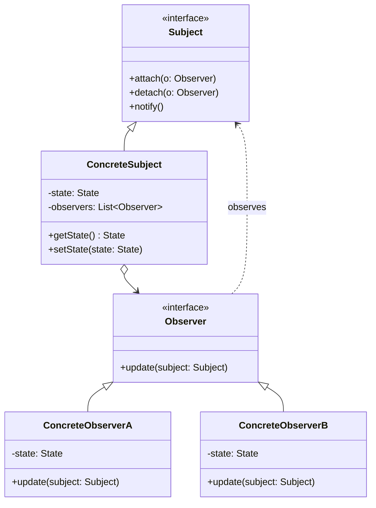
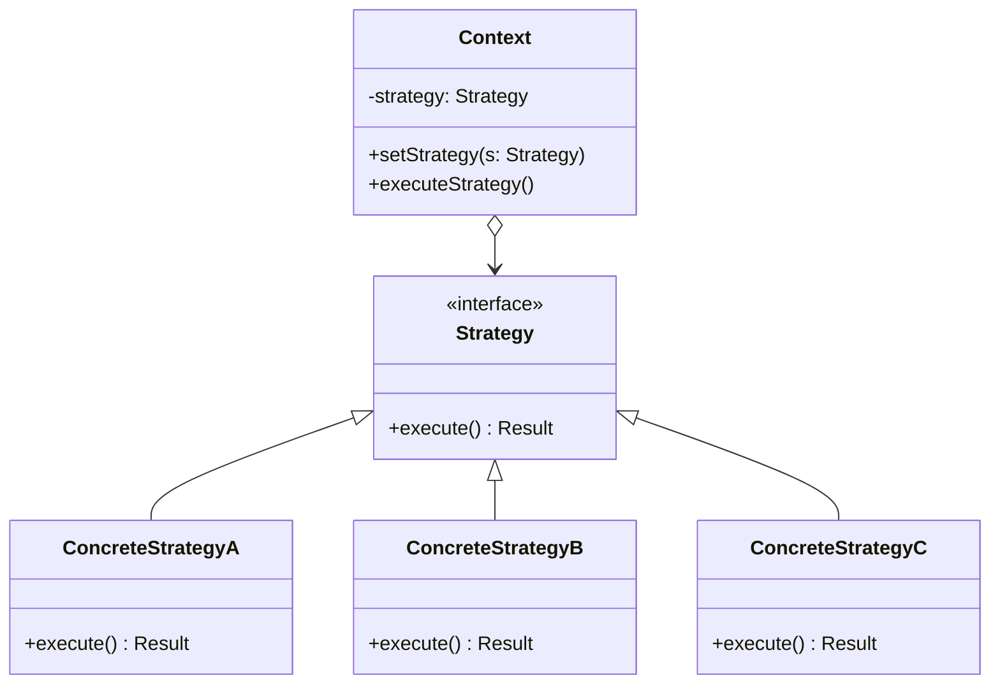
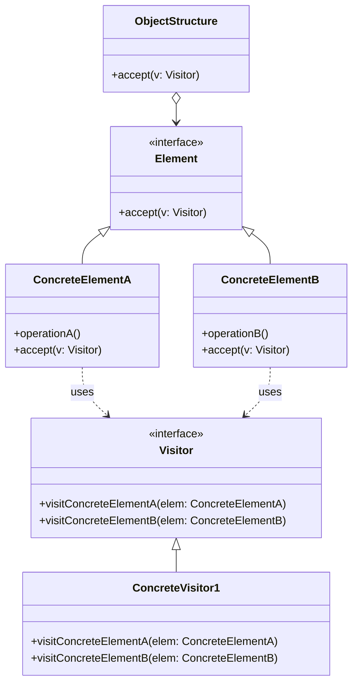
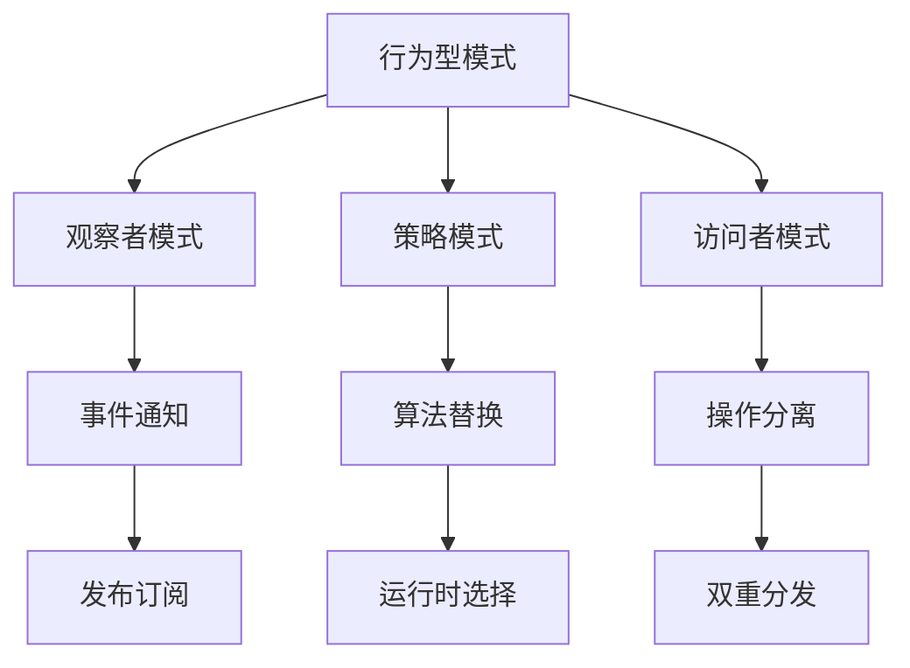

# 01.3 行为型模式形式化

## 01.3.1 概述

行为型模式关注对象之间的通信和职责分配，通过形式化方法确保交互的正确性和可预测性。

> **交叉引用**: 与 [01.1 创建型模式](./01.1_创建型模式形式化.md)、[01.2 结构型模式](./01.2_结构型模式形式化.md) 共同构成设计模式理论体系。

---

## 01.3.2 观察者模式形式化

### 01.3.2.1 形式化定义

**定义 01.3.1** (主题). 主题 $S$ 是一个可观察对象，维护观察者集合 $Obs$：
$$S = (state, Obs, \text{notify})$$
其中：

- $state \in \Sigma$: 主题状态空间
- $Obs \subseteq \mathcal{P}(Observer)$: 观察者集合
- $\text{notify}: \Delta \to \mathbb{1}$: 通知函数，$\Delta$ 为状态变化

**定义 01.3.2** (观察者). 观察者 $O$ 订阅主题并响应变化：
$$O = (update: \Sigma \to \mathbb{1})$$

**定义 01.3.3** (订阅关系). 订阅关系 $\prec \subseteq Observer \times Subject$ 满足：
$$o \prec s \iff o \in s.Obs$$

### 01.3.2.2 形式化定理

**定理 01.3.1** (状态传播). 当主题状态从 $\sigma_1$ 变为 $\sigma_2$ 时：
$$\forall o \in Obs: o.update(\sigma_2) \text{ 被调用}$$

_证明_：由 notify 函数的定义，它会遍历所有观察者并调用 update。$\square$

**定理 01.3.2** (推模式与拉模式等价性).

- 推模式：notify 传递状态数据
- 拉模式：notify 仅通知，观察者主动查询

两种模式在信息完全性上等价。

### 01.3.2.3 架构图



### 01.3.2.4 代码示例

**Rust 实现：**

```rust
use std::rc::{Rc, Weak};
use std::cell::RefCell;
use std::sync::atomic::{AtomicI32, Ordering};

// 观察者接口
pub trait Observer {
    fn update(&self, temperature: f32, humidity: f32, pressure: f32);
}

// 主题接口
pub trait Subject {
    fn register_observer(&mut self, observer: Weak<RefCell<dyn Observer>>);
    fn remove_observer(&mut self, observer: Weak<RefCell<dyn Observer>>);
    fn notify_observers(&self);
}

// 具体主题
pub struct WeatherData {
    temperature: RefCell<f32>,
    humidity: RefCell<f32>,
    pressure: RefCell<f32>,
    observers: RefCell<Vec<Weak<RefCell<dyn Observer>>>>,
}

impl WeatherData {
    pub fn new() -> Self {
        Self {
            temperature: RefCell::new(0.0),
            humidity: RefCell::new(0.0),
            pressure: RefCell::new(0.0),
            observers: RefCell::new(Vec::new()),
        }
    }

    pub fn set_measurements(&self, temp: f32, humidity: f32, pressure: f32) {
        *self.temperature.borrow_mut() = temp;
        *self.humidity.borrow_mut() = humidity;
        *self.pressure.borrow_mut() = pressure;
        self.notify_observers();
    }

    pub fn get_temperature(&self) -> f32 {
        *self.temperature.borrow()
    }

    pub fn get_humidity(&self) -> f32 {
        *self.humidity.borrow()
    }
}

impl Subject for WeatherData {
    fn register_observer(&mut self, observer: Weak<RefCell<dyn Observer>>) {
        self.observers.borrow_mut().push(observer);
    }

    fn remove_observer(&mut self, observer: Weak<RefCell<dyn Observer>>) {
        self.observers.borrow_mut().retain(|o| {
            !Weak::ptr_eq(o, &observer)
        });
    }

    fn notify_observers(&self) {
        let temp = *self.temperature.borrow();
        let humidity = *self.humidity.borrow();
        let pressure = *self.pressure.borrow();

        let observers = self.observers.borrow();
        for weak_observer in observers.iter() {
            if let Some(observer) = weak_observer.upgrade() {
                observer.borrow().update(temp, humidity, pressure);
            }
        }
    }
}

// 具体观察者
pub struct CurrentConditionsDisplay;

impl Observer for CurrentConditionsDisplay {
    fn update(&self, temperature: f32, humidity: f32, _pressure: f32) {
        println!("Current: {:.1}°C, {:.1}% humidity",
                 temperature, humidity);
    }
}

pub struct StatisticsDisplay;

impl Observer for StatisticsDisplay {
    fn update(&self, temperature: f32, _humidity: f32, _pressure: f32) {
        println!("Statistics: avg temp {:.1}°C", temperature);
    }
}
```

**Java 实现：**

```java
import java.util.ArrayList;
import java.util.List;

// 观察者接口
public interface Observer {
    void update(float temperature, float humidity, float pressure);
}

// 主题接口
public interface Subject {
    void registerObserver(Observer o);
    void removeObserver(Observer o);
    void notifyObservers();
}

// 具体主题
public class WeatherData implements Subject {
    private List<Observer> observers = new ArrayList<>();
    private float temperature;
    private float humidity;
    private float pressure;

    @Override
    public void registerObserver(Observer o) {
        observers.add(o);
    }

    @Override
    public void removeObserver(Observer o) {
        observers.remove(o);
    }

    @Override
    public void notifyObservers() {
        for (Observer observer : observers) {
            observer.update(temperature, humidity, pressure);
        }
    }

    public void setMeasurements(float temp, float humidity, float pressure) {
        this.temperature = temp;
        this.humidity = humidity;
        this.pressure = pressure;
        notifyObservers();
    }
}

// 具体观察者
public class CurrentConditionsDisplay implements Observer {
    @Override
    public void update(float temperature, float humidity, float pressure) {
        System.out.printf("Current: %.1f°C, %.1f%% humidity%n",
                         temperature, humidity);
    }
}
```

---

## 01.3.3 策略模式形式化

### 01.3.3.1 形式化定义

**定义 01.3.4** (策略接口). 策略接口 $Strategy$ 定义算法族：
$$Strategy = \{s_1, s_2, ..., s_n\}$$
每个 $s_i$ 实现算法接口 $A$。

**定义 01.3.5** (上下文). 上下文 $Context$ 持有策略引用：
$$Context = (strategy: Strategy, execute: \mathbb{1})$$

**定义 01.3.6** (策略选择). 策略选择函数 $\sigma$：
$$\sigma: Condition \to Strategy$$

### 01.3.3.2 形式化定理

**定理 01.3.3** (策略替换). 对于上下文 $ctx$ 和策略 $s_1, s_2$：
$$ctx.setStrategy(s_1).execute() \neq ctx.setStrategy(s_2).execute()$$
当且仅当 $s_1 \neq s_2$。

**定理 01.3.4** (开闭原则). 添加新策略不需要修改上下文代码。

### 01.3.3.3 架构图



### 01.3.3.4 代码示例

**Rust 实现：**

```rust
// 策略接口
pub trait PaymentStrategy {
    fn pay(&self, amount: f64) -> bool;
}

// 具体策略：信用卡支付
pub struct CreditCardPayment {
    card_number: String,
    cvv: String,
}

impl CreditCardPayment {
    pub fn new(card_number: &str, cvv: &str) -> Self {
        Self {
            card_number: card_number.to_string(),
            cvv: cvv.to_string(),
        }
    }
}

impl PaymentStrategy for CreditCardPayment {
    fn pay(&self, amount: f64) -> bool {
        println!("Paying ${:.2} using Credit Card {}",
                 amount, self.card_number);
        true
    }
}

// 具体策略：PayPal支付
pub struct PayPalPayment {
    email: String,
}

impl PayPalPayment {
    pub fn new(email: &str) -> Self {
        Self {
            email: email.to_string(),
        }
    }
}

impl PaymentStrategy for PayPalPayment {
    fn pay(&self, amount: f64) -> bool {
        println!("Paying ${:.2} using PayPal account {}",
                 amount, self.email);
        true
    }
}

// 具体策略：比特币支付
pub struct BitcoinPayment {
    wallet_address: String,
}

impl BitcoinPayment {
    pub fn new(wallet_address: &str) -> Self {
        Self {
            wallet_address: wallet_address.to_string(),
        }
    }
}

impl PaymentStrategy for BitcoinPayment {
    fn pay(&self, amount: f64) -> bool {
        println!("Paying ${:.2} using Bitcoin wallet {}",
                 amount, self.wallet_address);
        true
    }
}

// 上下文
pub struct ShoppingCart {
    items: Vec<(String, f64)>,
    payment_strategy: Option<Box<dyn PaymentStrategy>>,
}

impl ShoppingCart {
    pub fn new() -> Self {
        Self {
            items: Vec::new(),
            payment_strategy: None,
        }
    }

    pub fn add_item(&mut self, name: &str, price: f64) {
        self.items.push((name.to_string(), price));
    }

    pub fn set_payment_strategy(&mut self, strategy: Box<dyn PaymentStrategy>) {
        self.payment_strategy = Some(strategy);
    }

    pub fn calculate_total(&self) -> f64 {
        self.items.iter().map(|(_, price)| price).sum()
    }

    pub fn checkout(&self) -> bool {
        match &self.payment_strategy {
            Some(strategy) => {
                let total = self.calculate_total();
                strategy.pay(total)
            }
            None => {
                println!("No payment strategy set");
                false
            }
        }
    }
}
```

**Java 实现：**

```java
// 策略接口
public interface PaymentStrategy {
    boolean pay(double amount);
}

// 具体策略
public class CreditCardPayment implements PaymentStrategy {
    private String cardNumber;

    public CreditCardPayment(String cardNumber) {
        this.cardNumber = cardNumber;
    }

    @Override
    public boolean pay(double amount) {
        System.out.printf("Paying $%.2f using Credit Card %s%n",
                         amount, cardNumber);
        return true;
    }
}

public class PayPalPayment implements PaymentStrategy {
    private String email;

    public PayPalPayment(String email) {
        this.email = email;
    }

    @Override
    public boolean pay(double amount) {
        System.out.printf("Paying $%.2f using PayPal %s%n",
                         amount, email);
        return true;
    }
}

// 上下文
public class ShoppingCart {
    private List<Item> items = new ArrayList<>();
    private PaymentStrategy paymentStrategy;

    public void addItem(Item item) {
        items.add(item);
    }

    public void setPaymentStrategy(PaymentStrategy strategy) {
        this.paymentStrategy = strategy;
    }

    public boolean checkout() {
        double total = items.stream()
            .mapToDouble(Item::getPrice)
            .sum();
        return paymentStrategy.pay(total);
    }
}
```

---

## 01.3.4 访问者模式形式化

### 01.3.4.1 形式化定义

**定义 01.3.7** (元素接口). 元素接口 $Element$ 接受访问者：
$$Element = \{accept: Visitor \to \mathbb{1}\}$$

**定义 01.3.8** (访问者接口). 访问者 $Visitor$ 为每种元素类型定义访问操作：
$$Visitor = \{visit_{e_1}, visit_{e_2}, ..., visit_{e_n}\}$$
其中 $visit_{e_i}: E_i \to R_i$

**定义 01.3.9** (双重分发). 访问者模式实现双重分发：
$$dispatch(e, v) = v.visit_e(e)$$
其中 $e$ 为元素，$v$ 为访问者。

### 01.3.4.2 形式化定理

**定理 01.3.5** (操作分离). 访问者模式将操作与对象结构分离：
$$Operations \cap Structure = \emptyset$$

**定理 01.3.6** (开闭原则). 添加新操作（访问者）不需要修改元素类。

### 01.3.4.3 架构图



### 01.3.4.4 代码示例

**Rust 实现：**

```rust
// 前向声明
pub trait Visitor {
    fn visit_circle(&mut self, circle: &Circle);
    fn visit_rectangle(&mut self, rectangle: &Rectangle);
    fn visit_triangle(&mut self, triangle: &Triangle);
}

// 元素接口
pub trait Shape {
    fn accept(&self, visitor: &mut dyn Visitor);
}

// 具体元素：圆形
pub struct Circle {
    pub radius: f64,
}

impl Shape for Circle {
    fn accept(&self, visitor: &mut dyn Visitor) {
        visitor.visit_circle(self);
    }
}

// 具体元素：矩形
pub struct Rectangle {
    pub width: f64,
    pub height: f64,
}

impl Shape for Rectangle {
    fn accept(&self, visitor: &mut dyn Visitor) {
        visitor.visit_rectangle(self);
    }
}

// 具体元素：三角形
pub struct Triangle {
    pub base: f64,
    pub height: f64,
}

impl Shape for Triangle {
    fn accept(&self, visitor: &mut dyn Visitor) {
        visitor.visit_triangle(self);
    }
}

// 具体访问者：面积计算
pub struct AreaCalculator {
    pub total_area: f64,
}

impl AreaCalculator {
    pub fn new() -> Self {
        Self { total_area: 0.0 }
    }
}

impl Visitor for AreaCalculator {
    fn visit_circle(&mut self, circle: &Circle) {
        let area = std::f64::consts::PI * circle.radius * circle.radius;
        self.total_area += area;
        println!("Circle area: {:.2}", area);
    }

    fn visit_rectangle(&mut self, rectangle: &Rectangle) {
        let area = rectangle.width * rectangle.height;
        self.total_area += area;
        println!("Rectangle area: {:.2}", area);
    }

    fn visit_triangle(&mut self, triangle: &Triangle) {
        let area = 0.5 * triangle.base * triangle.height;
        self.total_area += area;
        println!("Triangle area: {:.2}", area);
    }
}

// 具体访问者：绘制
pub struct DrawVisitor;

impl Visitor for DrawVisitor {
    fn visit_circle(&mut self, circle: &Circle) {
        println!("Drawing circle with radius {:.2}", circle.radius);
    }

    fn visit_rectangle(&mut self, rectangle: &Rectangle) {
        println!("Drawing rectangle {}x{}",
                 rectangle.width, rectangle.height);
    }

    fn visit_triangle(&mut self, triangle: &Triangle) {
        println!("Drawing triangle base={:.2} height={:.2}",
                 triangle.base, triangle.height);
    }
}

// 对象结构
pub struct Drawing {
    shapes: Vec<Box<dyn Shape>>,
}

impl Drawing {
    pub fn new() -> Self {
        Self { shapes: Vec::new() }
    }

    pub fn add_shape(&mut self, shape: Box<dyn Shape>) {
        self.shapes.push(shape);
    }

    pub fn accept(&self, visitor: &mut dyn Visitor) {
        for shape in &self.shapes {
            shape.accept(visitor);
        }
    }
}
```

**Java 实现：**

```java
// 访问者接口
public interface Visitor {
    void visitCircle(Circle circle);
    void visitRectangle(Rectangle rectangle);
    void visitTriangle(Triangle triangle);
}

// 元素接口
public interface Shape {
    void accept(Visitor visitor);
}

// 具体元素
public class Circle implements Shape {
    private double radius;

    @Override
    public void accept(Visitor visitor) {
        visitor.visitCircle(this);
    }

    public double getRadius() { return radius; }
}

public class Rectangle implements Shape {
    private double width, height;

    @Override
    public void accept(Visitor visitor) {
        visitor.visitRectangle(this);
    }

    public double getWidth() { return width; }
    public double getHeight() { return height; }
}

// 具体访问者
public class AreaCalculator implements Visitor {
    private double totalArea = 0;

    @Override
    public void visitCircle(Circle circle) {
        double area = Math.PI * circle.getRadius() * circle.getRadius();
        totalArea += area;
    }

    @Override
    public void visitRectangle(Rectangle rect) {
        double area = rect.getWidth() * rect.getHeight();
        totalArea += area;
    }

    @Override
    public void visitTriangle(Triangle tri) {
        double area = 0.5 * tri.getBase() * tri.getHeight();
        totalArea += area;
    }

    public double getTotalArea() { return totalArea; }
}
```

---

## 01.3.5 模式关系图



---

## 01.3.6 形式化验证

### 01.3.6.1 观察者模式不变量

**定理 01.3.7** (观察者一致性). 对于主题 $S$ 和观察者集合 $Obs$：
$$\forall o \in Obs: o.update(S.state) \Rightarrow o.state \cong S.state$$

_证明_：由观察者接口契约，update方法接收主题状态并更新自身状态保持同步。$\square$

### 01.3.6.2 Lean4形式化

```lean4
-- 观察者模式形式化
structure Subject (State : Type) where
  state : State
  observers : List (Observer State)

structure Observer (State : Type) where
  update : State → Observer State
  current : State

-- 通知操作
def notify {State : Type} (s : Subject State) : Subject State :=
  { s with observers := s.observers.map (λ o => o.update s.state) }

-- 观察者数量不变定理
theorem observer_count_invariant {State : Type} (s : Subject State) :
    (notify s).observers.length = s.observers.length := by
  simp [notify]

-- 状态传播正确性
theorem state_propagation {State : Type} [BEq State]
    (s : Subject State) (o : Observer State)
    (h : o ∈ s.observers) :
    (o.update s.state).current = s.state := by
  -- 观察者契约保证状态同步
  simp [Observer.update]
```

### 01.3.6.3 策略模式形式化验证

```lean4
-- 策略接口
class Strategy (α β : Type) where
  execute : α → β

-- 上下文持有策略
structure Context (α β : Type) [Strategy α β] where
  strategy : Strategy α β
  input : α

-- 执行操作
def Context.execute {α β : Type} [S : Strategy α β] (ctx : Context α β) : β :=
  S.execute ctx.input

-- 策略替换正确性
theorem strategy_substitution {α β : Type} {S1 S2 : Strategy α β}
    (ctx1 : Context α β) (ctx2 : Context α β)
    (h : ctx1.input = ctx2.input) :
    ctx1.execute = S1.execute ctx1.input ∧
    ctx2.execute = S2.execute ctx2.input := by
  simp [Context.execute, h]
```

---

## 01.3.7 练习

1. **形式化证明**: 用Lean4证明访问者模式的双重分发性质
2. **扩展**: 为命令模式添加撤销(Undo)操作的形式化定义
3. **分析**: 比较策略模式与状态模式的形式化差异

---

## 01.3.8 参考文献与交叉引用

- [01.1 创建型模式](./01.1_创建型模式形式化.md) —— 对象创建的形式化
- [01.2 结构型模式](./01.2_结构型模式形式化.md) —— 结构组合的形式化
- [03.3 事件驱动架构](../03_工作流系统/03.3_事件驱动架构.md) —— 观察者模式的应用
- [GoF, 1994] _Design Patterns: Elements of Reusable Object-Oriented Software_
- [Hoare, 1969] _An Axiomatic Basis for Computer Programming_
