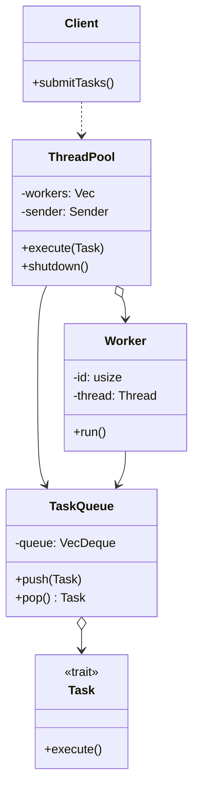
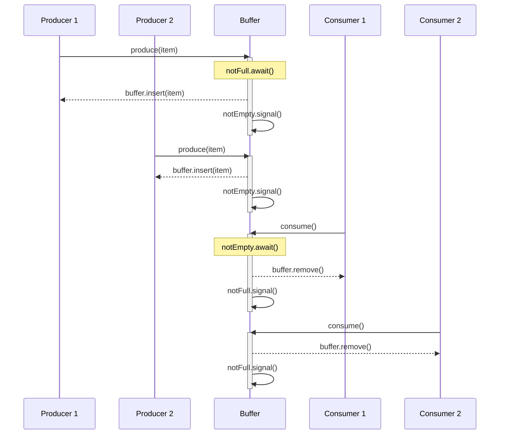
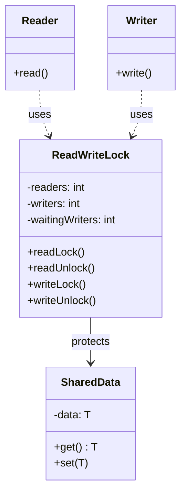

# 01.4 并发模式 (Concurrent Patterns)

---

📌 **内容摘要**

本文档深入探讨并发模式的核心原理和关键方法。内容涵盖设计模式领域的主要知识点，包括同步, 并行, 并发编程等关键主题。适合有一定基础的学习者系统学习。

**关键词**: 同步, 设计模式, 并行, 并发编程

📚 **学习目标**

- 掌握并发模式的核心概念和主要方法
- 理解相关理论的应用场景
- 建立该领域的系统性知识框架

🎯 **难度级别**: 中级

⏱️ **预计阅读时间**: 15分钟

**前置知识**: 相关领域的基础概念

---


## 目录

- [01.4 并发模式 (Concurrent Patterns)](#014-并发模式-concurrent-patterns)
  - [目录](#目录)
  - [1. 概述](#1-概述)
  - [2. 线程池模式 (Thread Pool)](#2-线程池模式-thread-pool)
    - [2.1 形式化定义](#21-形式化定义)
    - [2.2 架构图](#22-架构图)
    - [2.3 Rust 实现](#23-rust-实现)
    - [2.4 Go 实现](#24-go-实现)
  - [3. 生产者-消费者模式 (Producer-Consumer)](#3-生产者-消费者模式-producer-consumer)
    - [3.1 形式化定义](#31-形式化定义)
    - [3.2 架构图](#32-架构图)
    - [3.3 Rust 实现](#33-rust-实现)
    - [3.4 Go 实现](#34-go-实现)
  - [4. 读写锁模式 (Read-Write Lock)](#4-读写锁模式-read-write-lock)
    - [4.1 形式化定义](#41-形式化定义)
    - [4.2 架构图](#42-架构图)
    - [4.3 Rust 实现](#43-rust-实现)
    - [4.4 Go 实现](#44-go-实现)
  - [5. 并发安全考虑](#5-并发安全考虑)
    - [5.1 常见并发问题](#51-常见并发问题)
    - [5.2 Rust vs Go 并发模型](#52-rust-vs-go-并发模型)
  - [6. 相关文档](#6-相关文档)
  - [📋 前置知识](#-前置知识)
  - [📚 延伸阅读](#-延伸阅读)

## 1. 概述

并发模式解决多线程/多协程环境下的资源共享、同步和通信问题，确保程序的正确性和性能。

**核心挑战**：

- 竞态条件 (Race Conditions)
- 死锁 (Deadlock)
- 活锁 (Livelock)
- 饥饿 (Starvation)

## 2. 线程池模式 (Thread Pool)

### 2.1 形式化定义

设线程池 $P = (W, Q, S)$，其中：

- $W = \{w_1, w_2, ..., w_n\}$：工作线程集合
- $Q$：任务队列
- $S$：调度策略

**任务提交**：
$$submit(t): t \rightarrow Q$$

**任务执行**：
$$\forall w \in W: w \sim \text{execute}(q.pop())$$

### 2.2 架构图



### 2.3 Rust 实现

```rust
use std::sync::{mpsc, Arc, Mutex};
use std::thread;

// 任务类型
type Task = Box<dyn FnOnce() + Send + 'static>;

// 线程池
pub struct ThreadPool {
    workers: Vec<Worker>,
    sender: Option<mpsc::Sender<Task>>,
}

impl ThreadPool {
    pub fn new(size: usize) -> Self {
        let (sender, receiver) = mpsc::channel();
        let receiver = Arc::new(Mutex::new(receiver));

        let mut workers = Vec::with_capacity(size);
        for id in 0..size {
            workers.push(Worker::new(id, Arc::clone(&receiver)));
        }

        Self {
            workers,
            sender: Some(sender),
        }
    }

    pub fn execute<F>(&self, f: F)
    where
        F: FnOnce() + Send + 'static,
    {
        let task = Box::new(f);
        if let Some(sender) = &self.sender {
            sender.send(task).expect("Thread pool has shut down");
        }
    }
}

impl Drop for ThreadPool {
    fn drop(&mut self) {
        drop(self.sender.take());

        for worker in &mut self.workers {
            println!("Shutting down worker {}", worker.id);
            if let Some(thread) = worker.thread.take() {
                thread.join().unwrap();
            }
        }
    }
}

// 工作线程
struct Worker {
    id: usize,
    thread: Option<thread::JoinHandle<()>>,
}

impl Worker {
    fn new(id: usize, receiver: Arc<Mutex<mpsc::Receiver<Task>>>) -> Self {
        let thread = thread::spawn(move || loop {
            let task = receiver.lock().unwrap().recv();

            match task {
                Ok(task) => {
                    println!("Worker {} got a task; executing.", id);
                    task();
                }
                Err(_) => {
                    println!("Worker {} shutting down.", id);
                    break;
                }
            }
        });

        Self {
            id,
            thread: Some(thread),
        }
    }
}

fn main() {
    let pool = ThreadPool::new(4);

    for i in 0..8 {
        pool.execute(move || {
            println!("Task {} is running", i);
            thread::sleep(std::time::Duration::from_millis(100));
            println!("Task {} is done", i);
        });
    }

    thread::sleep(std::time::Duration::from_secs(2));
}
```

### 2.4 Go 实现

```go
package main

import (
    "fmt"
    "sync"
    "time"
)

// Task represents a function to be executed
type Task func()

// ThreadPool manages a pool of worker goroutines
type ThreadPool struct {
    workers   int
    taskQueue chan Task
    wg        sync.WaitGroup
}

// NewThreadPool creates a new thread pool
func NewThreadPool(workers, queueSize int) *ThreadPool {
    pool := &ThreadPool{
        workers:   workers,
        taskQueue: make(chan Task, queueSize),
    }

    pool.start()
    return pool
}

// start initializes the worker goroutines
func (p *ThreadPool) start() {
    for i := 0; i < p.workers; i++ {
        p.wg.Add(1)
        go p.worker(i)
    }
}

// worker is the goroutine that processes tasks
func (p *ThreadPool) worker(id int) {
    defer p.wg.Done()

    for task := range p.taskQueue {
        fmt.Printf("Worker %d got a task; executing.\n", id)
        task()
    }

    fmt.Printf("Worker %d shutting down.\n", id)
}

// Execute submits a task to the pool
func (p *ThreadPool) Execute(task Task) {
    p.taskQueue <- task
}

// Shutdown gracefully shuts down the pool
func (p *ThreadPool) Shutdown() {
    close(p.taskQueue)
    p.wg.Wait()
}

func main() {
    pool := NewThreadPool(4, 10)

    for i := 0; i < 8; i++ {
        id := i
        pool.Execute(func() {
            fmt.Printf("Task %d is running\n", id)
            time.Sleep(100 * time.Millisecond)
            fmt.Printf("Task %d is done\n", id)
        })
    }

    time.Sleep(2 * time.Second)
    pool.Shutdown()
}
```

## 3. 生产者-消费者模式 (Producer-Consumer)

### 3.1 形式化定义

设缓冲区 $B$，容量为 $n$，生产者 $P$ 和消费者 $C$：

$$P.produce(x): B \leftarrow x \text{ if } |B| < n$$
$$C.consume(): x \leftarrow B \text{ if } |B| > 0$$

**同步约束**：
$$
\begin{cases}
|P.produce| \leq n & \text{(缓冲区满时阻塞)} \\
|C.consume| \geq 0 & \text{(缓冲区空时阻塞)}
\end{cases}
$$

### 3.2 架构图



### 3.3 Rust 实现

```rust
use std::collections::VecDeque;
use std::sync::{Arc, Condvar, Mutex};
use std::thread;
use std::time::Duration;

struct BoundedBuffer<T> {
    buffer: Mutex<VecDeque<T>>,
    not_full: Condvar,
    not_empty: Condvar,
    capacity: usize,
}

impl<T> BoundedBuffer<T> {
    fn new(capacity: usize) -> Self {
        Self {
            buffer: Mutex::new(VecDeque::with_capacity(capacity)),
            not_full: Condvar::new(),
            not_empty: Condvar::new(),
            capacity,
        }
    }

    fn produce(&self, item: T) {
        let mut buffer = self.buffer.lock().unwrap();

        // 等待缓冲区不满
        while buffer.len() == self.capacity {
            buffer = self.not_full.wait(buffer).unwrap();
        }

        buffer.push_back(item);
        println!("Produced: buffer size = {}", buffer.len());

        self.not_empty.notify_one();
    }

    fn consume(&self) -> T {
        let mut buffer = self.buffer.lock().unwrap();

        // 等待缓冲区不空
        while buffer.is_empty() {
            buffer = self.not_empty.wait(buffer).unwrap();
        }

        let item = buffer.pop_front().unwrap();
        println!("Consumed: buffer size = {}", buffer.len());

        self.not_full.notify_one();
        item
    }
}

fn main() {
    let buffer = Arc::new(BoundedBuffer::new(5));

    // 生产者
    let producer_buffer = Arc::clone(&buffer);
    let producer = thread::spawn(move || {
        for i in 0..10 {
            producer_buffer.produce(i);
            thread::sleep(Duration::from_millis(100));
        }
    });

    // 消费者
    let consumer_buffer = Arc::clone(&buffer);
    let consumer = thread::spawn(move || {
        for _ in 0..10 {
            let item = consumer_buffer.consume();
            println!("Got item: {}", item);
            thread::sleep(Duration::from_millis(200));
        }
    });

    producer.join().unwrap();
    consumer.join().unwrap();
}
```

### 3.4 Go 实现

```go
package main

import (
    "fmt"
    "sync"
    "time"
)

// BoundedBuffer represents a bounded buffer for producer-consumer
type BoundedBuffer struct {
    buffer   chan int
    capacity int
}

// NewBoundedBuffer creates a new bounded buffer
func NewBoundedBuffer(capacity int) *BoundedBuffer {
    return &BoundedBuffer{
        buffer:   make(chan int, capacity),
        capacity: capacity,
    }
}

// Produce adds an item to the buffer (blocks if full)
func (b *BoundedBuffer) Produce(item int) {
    b.buffer <- item
    fmt.Printf("Produced: %d (buffer size = %d)\n", item, len(b.buffer))
}

// Consume removes an item from the buffer (blocks if empty)
func (b *BoundedBuffer) Consume() int {
    item := <-b.buffer
    fmt.Printf("Consumed: %d (buffer size = %d)\n", item, len(b.buffer))
    return item
}

func main() {
    buffer := NewBoundedBuffer(5)
    var wg sync.WaitGroup

    // Producers
    for i := 0; i < 2; i++ {
        wg.Add(1)
        go func(id int) {
            defer wg.Done()
            for j := 0; j < 5; j++ {
                item := id*10 + j
                buffer.Produce(item)
                time.Sleep(100 * time.Millisecond)
            }
        }(i)
    }

    // Consumers
    for i := 0; i < 2; i++ {
        wg.Add(1)
        go func(id int) {
            defer wg.Done()
            for j := 0; j < 5; j++ {
                item := buffer.Consume()
                fmt.Printf("Consumer %d got item: %d\n", id, item)
                time.Sleep(200 * time.Millisecond)
            }
        }(i)
    }

    wg.Wait()
}
```

## 4. 读写锁模式 (Read-Write Lock)

### 4.1 形式化定义

设读写锁 $RW$，读者集合 $R = \{r_1, r_2, ...\}$，写者集合 $W = \{w_1, w_2, ...\}$：

**读共享，写独占**：
$$
\begin{cases}
|r| > 0 \Rightarrow |w| = 0 & \text{(有读者时无写者)} \\
|w| > 0 \Rightarrow |r| = 0 \land |w| = 1 & \text{(有写者时无读者)}
\end{cases}
$$

**公平性策略**：

- 读者优先：新读者可插队
- 写者优先：写者等待时阻塞新读者
- 公平：按请求顺序获取锁

### 4.2 架构图



### 4.3 Rust 实现

```rust
use std::sync::{Arc, RwLock};
use std::thread;
use std::time::Duration;

fn main() {
    // 使用标准库的 RwLock
    let data = Arc::new(RwLock::new(vec![1, 2, 3]));

    let mut handles = vec![];

    // 读者线程
    for i in 0..3 {
        let data = Arc::clone(&data);
        let handle = thread::spawn(move || {
            loop {
                let read_guard = data.read().unwrap();
                println!("Reader {}: {:?}", i, *read_guard);
                drop(read_guard);
                thread::sleep(Duration::from_millis(500));
            }
        });
        handles.push(handle);
    }

    // 写者线程
    for i in 0..2 {
        let data = Arc::clone(&data);
        let handle = thread::spawn(move || {
            loop {
                let mut write_guard = data.write().unwrap();
                write_guard.push(i);
                println!("Writer {}: wrote to data", i);
                drop(write_guard);
                thread::sleep(Duration::from_secs(1));
            }
        });
        handles.push(handle);
    }

    thread::sleep(Duration::from_secs(5));
}

// 自定义读写锁实现（公平策略）
pub struct FairReadWriteLock {
    // 实际实现需要使用更底层的同步原语
    // 这里展示概念性结构
    readers: std::sync::atomic::AtomicUsize,
    writer: std::sync::Mutex<bool>,
}

impl FairReadWriteLock {
    pub fn new() -> Self {
        Self {
            readers: std::sync::atomic::AtomicUsize::new(0),
            writer: std::sync::Mutex::new(false),
        }
    }
}
```

### 4.4 Go 实现

```go
package main

import (
    "fmt"
    "sync"
    "time"
)

func main() {
    // 使用 RWMutex
    var rwm sync.RWMutex
    data := []int{1, 2, 3}

    var wg sync.WaitGroup

    // Readers
    for i := 0; i < 3; i++ {
        wg.Add(1)
        go func(id int) {
            defer wg.Done()
            for j := 0; j < 5; j++ {
                rwm.RLock()
                fmt.Printf("Reader %d: %v\n", id, data)
                rwm.RUnlock()
                time.Sleep(100 * time.Millisecond)
            }
        }(i)
    }

    // Writers
    for i := 0; i < 2; i++ {
        wg.Add(1)
        go func(id int) {
            defer wg.Done()
            for j := 0; j < 3; j++ {
                rwm.Lock()
                data = append(data, id*10+j)
                fmt.Printf("Writer %d: wrote to data\n", id)
                rwm.Unlock()
                time.Sleep(200 * time.Millisecond)
            }
        }(i)
    }

    wg.Wait()
}

// FairReadWriteLock custom implementation
type FairReadWriteLock struct {
    readers       int
    writers       int
    waitingWriters int
    mutex         sync.Mutex
    readCond      *sync.Cond
    writeCond     *sync.Cond
}

func NewFairReadWriteLock() *FairReadWriteLock {
    l := &FairReadWriteLock{}
    l.readCond = sync.NewCond(&l.mutex)
    l.writeCond = sync.NewCond(&l.mutex)
    return l
}

func (l *FairReadWriteLock) ReadLock() {
    l.mutex.Lock()
    for l.writers > 0 || l.waitingWriters > 0 {
        l.readCond.Wait()
    }
    l.readers++
    l.mutex.Unlock()
}

func (l *FairReadWriteLock) ReadUnlock() {
    l.mutex.Lock()
    l.readers--
    if l.readers == 0 {
        l.writeCond.Signal()
    }
    l.mutex.Unlock()
}

func (l *FairReadWriteLock) WriteLock() {
    l.mutex.Lock()
    l.waitingWriters++
    for l.readers > 0 || l.writers > 0 {
        l.writeCond.Wait()
    }
    l.waitingWriters--
    l.writers++
    l.mutex.Unlock()
}

func (l *FairReadWriteLock) WriteUnlock() {
    l.mutex.Lock()
    l.writers--
    if l.waitingWriters > 0 {
        l.writeCond.Signal()
    } else {
        l.readCond.Broadcast()
    }
    l.mutex.Unlock()
}
```

## 5. 并发安全考虑

### 5.1 常见并发问题

```
竞态条件 (Race Condition)
├── 数据竞争：多个线程同时读写
├── 原子性问题：操作未原子执行
└── 解决方案：锁、原子操作、通道

死锁 (Deadlock)
├── 互斥条件：资源独占
├── 占有且等待：持有资源同时等待
├── 不可抢占：资源不能被强制释放
└── 循环等待：形成等待环路

活锁 (Livelock)
├── 线程不断改变状态响应彼此
├── 没有实际进展
└── 解决方案：引入随机等待
```

### 5.2 Rust vs Go 并发模型

| 特性 | Rust | Go |
|------|------|-----|
| 并发原语 | 线程 + 异步 | Goroutine |
| 内存安全 | 编译时保证 | 运行时检测 |
| 通信方式 | Channel + 共享内存 | Channel 优先 |
| 同步机制 | Mutex, RwLock, Condvar | sync 包 |
| 性能 | 零成本抽象 | 轻量级调度 |

## 6. 相关文档

- [01.5_分布式模式](./01.5_分布式模式.md) - 分布式环境下的并发
- [04_分布式系统](../04_分布式系统/04.1_分布式基础.md) - 分布式一致性
- [02_微服务架构](../02_微服务架构/02.4_可观测性.md) - 并发监控

---

## 📋 前置知识

- [1. 并发编程模型](../../03_编程范式/01_编程语言理论/01.4_并发编程模型.md)

---

## 📚 延伸阅读

- [02.1 微服务形式化模型](../02_微服务架构/02.1_微服务形式化模型.md)
- [02.1 微服务设计原则](../02_微服务架构/02.1_微服务设计原则.md)
- [02.4 可观测性](../02_微服务架构/02.4_可观测性.md)
- [02.3 内存安全形式化](../../03_编程范式/02_Rust语言深入/02.3_内存安全形式化.md)
- [01.5 分布式模式 (Distributed Patterns)](../01_设计模式/01.5_分布式模式.md)
