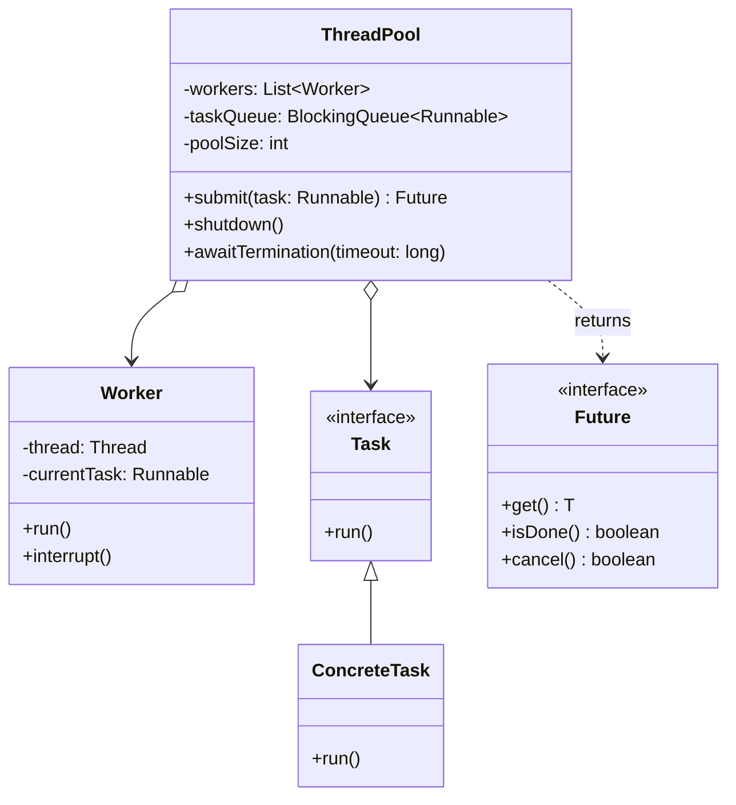
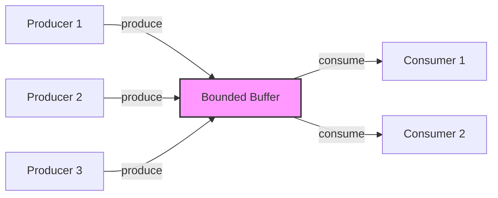
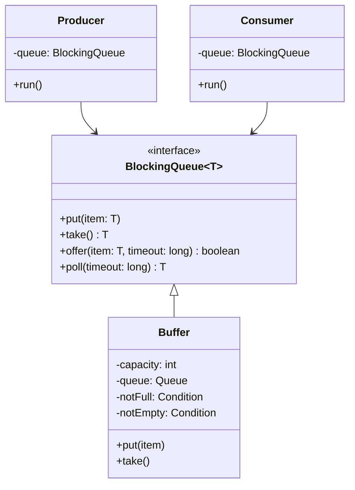

# 01.4 并发模式形式化

## 01.4.1 概述

并发模式关注多线程/多进程环境下的对象交互和资源管理，通过形式化方法确保线程安全性和正确性。

> **交叉引用**: 与 [01.3 行为型模式](./01.3_行为型模式形式化.md)、[04.1 一致性模型](../04_分布式系统/04.1_一致性模型.md) 形成完整的并发理论体系。

---

## 01.4.2 线程池模式形式化

### 01.4.2.1 形式化定义

**定义 01.4.1** (线程池). 线程池 $TP$ 是一个五元组：
$$TP = (W, T, Q, S, M)$$
其中：

- $W$: 工作线程集合，$|W| = n$
- $T$: 任务集合
- $Q$: 任务队列，$Q \subseteq T^*$
- $S$: 线程状态映射 $S: W \to \{idle, busy, terminated\}$
- $M$: 互斥机制

**定义 01.4.2** (任务提交). 任务提交函数 $\text{submit}: T \to \mathbb{B}$：
$$\text{submit}(t) = \begin{cases} true & \text{if } |Q| < maxSize \\ false & \text{otherwise} \end{cases}$$

**定义 01.4.3** (工作窃取). 工作窃取函数 $\text{steal}: W_i \times W_j \to T \cup \{\bot\}$：
$$\text{steal}(w_i, w_j) = \begin{cases} t & \text{if } Q_j \neq \emptyset \\ \bot & \text{otherwise} \end{cases}$$

### 01.4.2.2 形式化定理

**定理 01.4.1** (线程池有界性). 对于固定大小为 $n$ 的线程池：
$$\forall t: |W_{busy}(t)| \leq n$$

**定理 01.4.2** (任务执行保证). 若线程池未关闭且任务队列有界，则：
$$\forall t \in T: \Diamond execute(t)$$
其中 $\Diamond$ 表示最终时态算子。

### 01.4.2.3 架构图



### 01.4.2.4 代码示例

**Rust 实现：**

```rust
use std::sync::{mpsc, Arc, Mutex};
use std::thread;

pub struct ThreadPool {
    workers: Vec<Worker>,
    sender: mpsc::Sender<Message>,
}

type Job = Box<dyn FnOnce() + Send + 'static>;

enum Message {
    NewJob(Job),
    Terminate,
}

impl ThreadPool {
    pub fn new(size: usize) -> ThreadPool {
        assert!(size > 0);

        let (sender, receiver) = mpsc::channel();
        let receiver = Arc::new(Mutex::new(receiver));

        let mut workers = Vec::with_capacity(size);

        for id in 0..size {
            workers.push(Worker::new(id, Arc::clone(&receiver)));
        }

        ThreadPool { workers, sender }
    }

    pub fn execute<F>(&self, f: F)
    where
        F: FnOnce() + Send + 'static,
    {
        let job = Box::new(f);
        self.sender.send(Message::NewJob(job)).unwrap();
    }
}

impl Drop for ThreadPool {
    fn drop(&mut self) {
        for _ in &self.workers {
            self.sender.send(Message::Terminate).unwrap();
        }

        for worker in &mut self.workers {
            if let Some(thread) = worker.thread.take() {
                thread.join().unwrap();
            }
        }
    }
}

struct Worker {
    id: usize,
    thread: Option<thread::JoinHandle<()>>,
}

impl Worker {
    fn new(id: usize, receiver: Arc<Mutex<mpsc::Receiver<Message>>>) -> Worker {
        let thread = thread::spawn(move || loop {
            let message = receiver.lock().unwrap().recv().unwrap();

            match message {
                Message::NewJob(job) => {
                    println!("Worker {} got a job; executing.", id);
                    job();
                }
                Message::Terminate => {
                    println!("Worker {} was told to terminate.", id);
                    break;
                }
            }
        });

        Worker {
            id,
            thread: Some(thread),
        }
    }
}

// 使用 Rayon crate 的现代实现
use rayon::ThreadPoolBuilder;

pub fn create_pool() {
    let pool = ThreadPoolBuilder::new()
        .num_threads(4)
        .build()
        .unwrap();

    pool.install(|| {
        let sum: i32 = (0..100).into_par_iter().sum();
        println!("Sum: {}", sum);
    });
}
```

**Java 实现：**

```java
import java.util.concurrent.*;

public class ThreadPoolExample {

    // 固定大小线程池
    public void fixedPool() {
        ExecutorService executor = Executors.newFixedThreadPool(4);

        for (int i = 0; i < 10; i++) {
            final int taskId = i;
            executor.submit(() -> {
                System.out.println("Task " + taskId +
                    " running on " + Thread.currentThread().getName());
            });
        }

        executor.shutdown();
        try {
            executor.awaitTermination(60, TimeUnit.SECONDS);
        } catch (InterruptedException e) {
            e.printStackTrace();
        }
    }

    // 自定义线程池
    public void customPool() {
        ThreadPoolExecutor executor = new ThreadPoolExecutor(
            2,                      // 核心线程数
            5,                      // 最大线程数
            60L,                    // 空闲线程存活时间
            TimeUnit.SECONDS,
            new LinkedBlockingQueue<>(100),  // 任务队列
            new ThreadFactory() {
                private int count = 0;
                @Override
                public Thread newThread(Runnable r) {
                    return new Thread(r, "custom-pool-" + count++);
                }
            },
            new ThreadPoolExecutor.CallerRunsPolicy()  // 拒绝策略
        );

        // 提交任务
        Future<Integer> future = executor.submit(() -> {
            return 42;
        });

        try {
            Integer result = future.get();
            System.out.println("Result: " + result);
        } catch (Exception e) {
            e.printStackTrace();
        }

        executor.shutdown();
    }
}
```

---

## 01.4.3 生产者-消费者模式形式化

### 01.4.3.1 形式化定义

**定义 01.4.4** (生产者-消费者系统). 系统 $PCS$ 是一个四元组：
$$PCS = (P, C, B, Sync)$$
其中：

- $P = \{p_1, p_2, ..., p_m\}$: 生产者集合
- $C = \{c_1, c_2, ..., c_n\}$: 消费者集合
- $B$: 有界缓冲区，容量为 $k$
- $Sync$: 同步机制

**定义 01.4.5** (生产操作). 生产操作 $produce: Data \to \mathbb{B}$：
$$produce(d) = \begin{cases} B.enqueue(d) & \text{if } |B| < k \\ block & \text{otherwise} \end{cases}$$

**定义 01.4.6** (消费操作). 消费操作 $consume: \mathbb{1} \to Data \cup \{\bot\}$：
$$consume() = \begin{cases} B.dequeue() & \text{if } |B| > 0 \\ block & \text{otherwise} \end{cases}$$

### 01.4.3.2 形式化定理

**定理 01.4.3** (缓冲区不变式). 对于容量为 $k$ 的缓冲区：
$$\forall t: 0 \leq |B(t)| \leq k$$

_证明_：生产者在 $|B| = k$ 时阻塞，消费者在 $|B| = 0$ 时阻塞。$\square$

**定理 01.4.4** (无死锁). 若生产者和消费者都 eventually 运行，则系统无死锁。

_证明_：缓冲区状态有限，生产者/消费者交替改变缓冲区状态，形成活性保证。$\square$

### 01.4.3.3 架构图





### 01.4.3.4 代码示例

**Rust 实现：**

```rust
use std::sync::{mpsc, Arc, Mutex, Condvar};
use std::thread;
use std::collections::VecDeque;

// 有界缓冲区
pub struct BoundedBuffer<T> {
    queue: Mutex<VecDeque<T>>,
    not_full: Condvar,
    not_empty: Condvar,
    capacity: usize,
}

impl<T> BoundedBuffer<T> {
    pub fn new(capacity: usize) -> Self {
        Self {
            queue: Mutex::new(VecDeque::with_capacity(capacity)),
            not_full: Condvar::new(),
            not_empty: Condvar::new(),
            capacity,
        }
    }

    pub fn put(&self, item: T) {
        let mut queue = self.queue.lock().unwrap();

        while queue.len() == self.capacity {
            queue = self.not_full.wait(queue).unwrap();
        }

        queue.push_back(item);
        self.not_empty.notify_one();
    }

    pub fn take(&self) -> T {
        let mut queue = self.queue.lock().unwrap();

        while queue.is_empty() {
            queue = self.not_empty.wait(queue).unwrap();
        }

        let item = queue.pop_front().unwrap();
        self.not_full.notify_one();
        item
    }
}

// 使用标准库的通道
pub fn channel_example() {
    let (tx, rx) = mpsc::channel::<i32>();

    // 生产者线程
    let producer = thread::spawn(move || {
        for i in 0..10 {
            tx.send(i).unwrap();
            println!("Produced: {}", i);
        }
    });

    // 消费者线程
    let consumer = thread::spawn(move || {
        for received in rx {
            println!("Consumed: {}", received);
        }
    });

    producer.join().unwrap();
    consumer.join().unwrap();
}

// 多个生产者和消费者
pub fn multi_producer_consumer() {
    let buffer = Arc::new(BoundedBuffer::new(5));
    let mut handles = vec![];

    // 启动多个生产者
    for i in 0..3 {
        let buffer = Arc::clone(&buffer);
        let handle = thread::spawn(move || {
            for j in 0..5 {
                let item = format!("P{}-{}", i, j);
                buffer.put(item);
                thread::sleep(std::time::Duration::from_millis(100));
            }
        });
        handles.push(handle);
    }

    // 启动多个消费者
    for i in 0..2 {
        let buffer = Arc::clone(&buffer);
        let handle = thread::spawn(move || {
            for _ in 0..7 {
                let item = buffer.take();
                println!("Consumer {} got: {}", i, item);
                thread::sleep(std::time::Duration::from_millis(150));
            }
        });
        handles.push(handle);
    }

    for handle in handles {
        handle.join().unwrap();
    }
}
```

**Java 实现：**

```java
import java.util.concurrent.*;

public class ProducerConsumerExample {

    public void usingBlockingQueue() {
        BlockingQueue<Integer> queue = new ArrayBlockingQueue<>(10);

        // 生产者
        Runnable producer = () -> {
            try {
                for (int i = 0; i < 100; i++) {
                    queue.put(i);
                    System.out.println("Produced: " + i);
                }
            } catch (InterruptedException e) {
                Thread.currentThread().interrupt();
            }
        };

        // 消费者
        Runnable consumer = () -> {
            try {
                while (true) {
                    Integer item = queue.take();
                    System.out.println("Consumed: " + item);
                }
            } catch (InterruptedException e) {
                Thread.currentThread().interrupt();
            }
        };

        new Thread(producer).start();
        new Thread(consumer).start();
    }

    // 自定义实现
    static class BoundedBuffer<T> {
        private final T[] buffer;
        private int putIndex, takeIndex, count;

        @SuppressWarnings("unchecked")
        public BoundedBuffer(int capacity) {
            this.buffer = (T[]) new Object[capacity];
        }

        public synchronized void put(T item) throws InterruptedException {
            while (count == buffer.length) {
                wait();
            }
            buffer[putIndex] = item;
            putIndex = (putIndex + 1) % buffer.length;
            count++;
            notifyAll();
        }

        public synchronized T take() throws InterruptedException {
            while (count == 0) {
                wait();
            }
            T item = buffer[takeIndex];
            buffer[takeIndex] = null;
            takeIndex = (takeIndex + 1) % buffer.length;
            count--;
            notifyAll();
            return item;
        }
    }
}
```

---

## 01.4.4 模式关系与比较

| 模式 | 核心问题 | 解决方案 | 适用场景 |
|------|---------|---------|---------|
| 线程池 | 线程创建开销 | 复用线程 | 大量短任务 |
| 生产者-消费者 | 解耦生产消费速率 | 有界缓冲区 | 异步处理 |

> **交叉引用**: 并发模式在分布式系统中的应用请参考 [04.2 共识算法](../04_分布式系统/04.2_共识算法形式化.md)。
