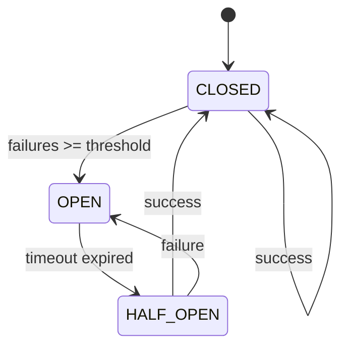
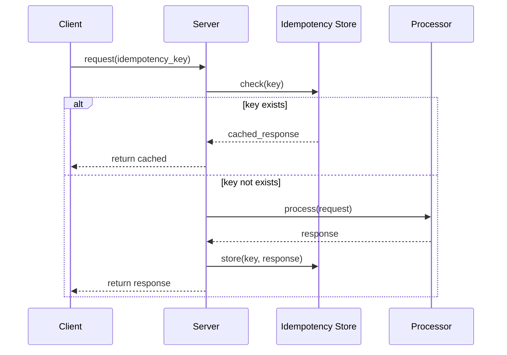
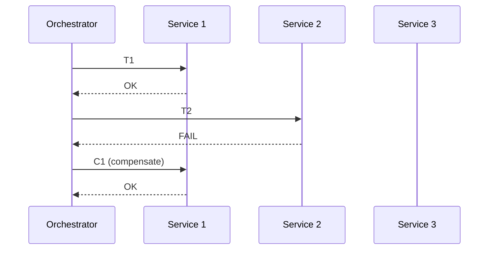
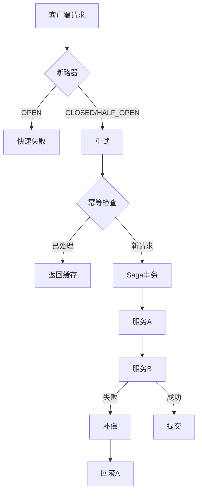

# 01.5 分布式模式 (Distributed Patterns)

## 目录

- [01.5 分布式模式 (Distributed Patterns)](#015-分布式模式-distributed-patterns)
  - [目录](#目录)
  - [1. 概述](#1-概述)
  - [2. 断路器模式 (Circuit Breaker)](#2-断路器模式-circuit-breaker)
    - [2.1 形式化定义](#21-形式化定义)
    - [2.2 状态机](#22-状态机)
    - [2.3 Rust 实现](#23-rust-实现)
    - [2.4 Go 实现](#24-go-实现)
  - [3. 重试模式 (Retry Pattern)](#3-重试模式-retry-pattern)
    - [3.1 形式化定义](#31-形式化定义)
    - [3.2 退避策略](#32-退避策略)
    - [3.3 Rust 实现](#33-rust-实现)
    - [3.4 Go 实现](#34-go-实现)
  - [4. 幂等模式 (Idempotency)](#4-幂等模式-idempotency)
    - [4.1 形式化定义](#41-形式化定义)
    - [4.2 架构图](#42-架构图)
    - [4.3 Rust 实现](#43-rust-实现)
    - [4.4 Go 实现](#44-go-实现)
  - [5. Saga 模式](#5-saga-模式)
    - [5.1 形式化定义](#51-形式化定义)
    - [5.2 架构图](#52-架构图)
    - [5.3 Rust 实现](#53-rust-实现)
    - [5.4 Go 实现](#54-go-实现)
  - [6. 模式组合](#6-模式组合)
  - [7. 相关文档](#7-相关文档)

## 1. 概述

分布式模式解决微服务架构中的可靠性、一致性和容错性问题。

**核心挑战**：

- 网络不可靠
- 服务故障
- 数据一致性
- 性能与可用性权衡

## 2. 断路器模式 (Circuit Breaker)

### 2.1 形式化定义

设断路器状态 $S \in \{CLOSED, OPEN, HALF\_OPEN\}$，失败计数 $f$，阈值 $F$：

$$
transition(f, F): \begin{cases}
CLOSED \rightarrow OPEN & \text{if } f \geq F \\
OPEN \rightarrow HALF\_OPEN & \text{after timeout } T \\
HALF\_OPEN \rightarrow CLOSED & \text{if success} \\
HALF\_OPEN \rightarrow OPEN & \text{if failure}
\end{cases}
$$

### 2.2 状态机



### 2.3 Rust 实现

```rust
use std::sync::{Arc, Mutex};
use std::time::{Duration, Instant};

# [derive(Debug, Clone, Copy, PartialEq)]
enum CircuitState {
    Closed,
    Open,
    HalfOpen,
}

struct CircuitBreaker {
    state: Mutex<CircuitState>,
    failure_count: Mutex<u32>,
    last_failure_time: Mutex<Option<Instant>>,
    failure_threshold: u32,
    timeout: Duration,
}

impl CircuitBreaker {
    fn new(failure_threshold: u32, timeout: Duration) -> Self {
        Self {
            state: Mutex::new(CircuitState::Closed),
            failure_count: Mutex::new(0),
            last_failure_time: Mutex::new(None),
            failure_threshold,
            timeout,
        }
    }

    fn call<F, T>(&self, f: F) -> Result<T, String>
    where
        F: FnOnce() -> Result<T, String>,
    {
        match self.get_state() {
            CircuitState::Open => {
                // 检查是否可以进入半开状态
                if self.can_attempt_reset() {
                    *self.state.lock().unwrap() = CircuitState::HalfOpen;
                } else {
                    return Err("Circuit breaker is OPEN".to_string());
                }
            }
            _ => {}
        }

        match f() {
            Ok(result) => {
                self.on_success();
                Ok(result)
            }
            Err(e) => {
                self.on_failure();
                Err(e)
            }
        }
    }

    fn get_state(&self) -> CircuitState {
        *self.state.lock().unwrap()
    }

    fn can_attempt_reset(&self) -> bool {
        if let Some(last_failure) = *self.last_failure_time.lock().unwrap() {
            Instant::now().duration_since(last_failure) >= self.timeout
        } else {
            false
        }
    }

    fn on_success(&self) {
        *self.state.lock().unwrap() = CircuitState::Closed;
        *self.failure_count.lock().unwrap() = 0;
    }

    fn on_failure(&self) {
        let mut count = self.failure_count.lock().unwrap();
        *count += 1;

        if *count >= self.failure_threshold {
            *self.state.lock().unwrap() = CircuitState::Open;
            *self.last_failure_time.lock().unwrap() = Some(Instant::now());
        }
    }
}

fn main() {
    let cb = Arc::new(CircuitBreaker::new(3, Duration::from_secs(5)));

    // 模拟调用
    for i in 0..10 {
        let result = cb.call(|| {
            if i < 3 {
                Ok("Success")
            } else if i < 6 {
                Err("Failure".to_string())
            } else {
                Ok("Success")
            }
        });

        println!("Call {}: {:?}, State: {:?}", i, result, cb.get_state());
    }
}
```

### 2.4 Go 实现

```go
package main

import (
    "fmt"
    "sync"
    "time"
)

type CircuitState int

const (
    Closed CircuitState = iota
    Open
    HalfOpen
)

type CircuitBreaker struct {
    state           CircuitState
    failureCount    int
    lastFailureTime time.Time
    failureThreshold int
    timeout         time.Duration
    mu              sync.Mutex
}

func NewCircuitBreaker(failureThreshold int, timeout time.Duration) *CircuitBreaker {
    return &CircuitBreaker{
        state:            Closed,
        failureThreshold: failureThreshold,
        timeout:          timeout,
    }
}

func (cb *CircuitBreaker) Call(fn func() error) error {
    cb.mu.Lock()

    switch cb.state {
    case Open:
        if cb.canAttemptReset() {
            cb.state = HalfOpen
        } else {
            cb.mu.Unlock()
            return fmt.Errorf("circuit breaker is OPEN")
        }
    }

    cb.mu.Unlock()

    err := fn()

    if err != nil {
        cb.onFailure()
        return err
    }

    cb.onSuccess()
    return nil
}

func (cb *CircuitBreaker) canAttemptReset() bool {
    return time.Since(cb.lastFailureTime) >= cb.timeout
}

func (cb *CircuitBreaker) onSuccess() {
    cb.mu.Lock()
    defer cb.mu.Unlock()

    cb.state = Closed
    cb.failureCount = 0
}

func (cb *CircuitBreaker) onFailure() {
    cb.mu.Lock()
    defer cb.mu.Unlock()

    cb.failureCount++

    if cb.failureCount >= cb.failureThreshold {
        cb.state = Open
        cb.lastFailureTime = time.Now()
    }
}

func (cb *CircuitBreaker) GetState() CircuitState {
    cb.mu.Lock()
    defer cb.mu.Unlock()
    return cb.state
}

func main() {
    cb := NewCircuitBreaker(3, 5*time.Second)

    for i := 0; i < 10; i++ {
        err := cb.Call(func() error {
            if i < 3 {
                return nil
            } else if i < 6 {
                return fmt.Errorf("failure")
            }
            return nil
        })

        fmt.Printf("Call %d: %v, State: %v\n", i, err, cb.GetState())
    }
}
```

## 3. 重试模式 (Retry Pattern)

### 3.1 形式化定义

设操作 $O$，最大重试次数 $N$，当前尝试 $n$，重试函数 $R(n)$：

$$
R(n) = \begin{cases}
O() & \text{if } n = 0 \\
delay(d_n); O() & \text{if } n \leq N \\
fail & \text{if } n > N
\end{cases}
$$

### 3.2 退避策略

| 策略 | 公式 | 特点 |
|------|------|------|
| 固定间隔 | $d_n = D$ | 简单，可能拥塞 |
| 线性退避 | $d_n = n \cdot D$ | 逐渐增长 |
| 指数退避 | $d_n = D \cdot 2^n$ | 快速分散 |
| 抖动 | $d_n = random(0, D \cdot 2^n)$ | 避免同步 |

### 3.3 Rust 实现

```rust
use std::time::Duration;
use tokio::time::sleep;

enum BackoffStrategy {
    Fixed(Duration),
    Linear(Duration),
    Exponential {
        base: Duration,
        max: Duration,
    },
}

struct RetryPolicy {
    max_attempts: u32,
    strategy: BackoffStrategy,
}

impl RetryPolicy {
    fn new(max_attempts: u32, strategy: BackoffStrategy) -> Self {
        Self {
            max_attempts,
            strategy,
        }
    }

    async fn execute<F, Fut, T, E>(&self, mut operation: F) -> Result<T, E>
    where
        F: FnMut() -> Fut,
        Fut: std::future::Future<Output = Result<T, E>>,
    {
        let mut attempt = 0;

        loop {
            match operation().await {
                Ok(result) => return Ok(result),
                Err(e) if attempt >= self.max_attempts - 1 => return Err(e),
                Err(_) => {
                    let delay = self.calculate_delay(attempt);
                    sleep(delay).await;
                    attempt += 1;
                }
            }
        }
    }

    fn calculate_delay(&self, attempt: u32) -> Duration {
        match &self.strategy {
            BackoffStrategy::Fixed(d) => *d,
            BackoffStrategy::Linear(d) => *d * attempt,
            BackoffStrategy::Exponential { base, max } => {
                let exp = base.saturating_mul(2_u32.saturating_pow(attempt));
                if exp > *max { *max } else { exp }
            }
        }
    }
}

# [tokio::main]
async fn main() {
    let policy = RetryPolicy::new(
        5,
        BackoffStrategy::Exponential {
            base: Duration::from_millis(100),
            max: Duration::from_secs(5),
        },
    );

    let mut counter = 0;
    let result = policy.execute(|| async {
        counter += 1;
        if counter < 3 {
            Err::<(), _>("Temporary failure")
        } else {
            Ok("Success")
        }
    }).await;

    println!("Result: {:?}", result);
}
```

### 3.4 Go 实现

```go
package main

import (
    "fmt"
    "math"
    "math/rand"
    "time"
)

type BackoffStrategy int

const (
    Fixed BackoffStrategy = iota
    Linear
    Exponential
)

type RetryPolicy struct {
    MaxAttempts  int
    Strategy     BackoffStrategy
    BaseDelay    time.Duration
    MaxDelay     time.Duration
    UseJitter    bool
}

func (p *RetryPolicy) Execute(operation func() error) error {
    var err error

    for attempt := 0; attempt < p.MaxAttempts; attempt++ {
        err = operation()
        if err == nil {
            return nil
        }

        if attempt < p.MaxAttempts-1 {
            delay := p.calculateDelay(attempt)
            if p.UseJitter {
                delay = p.addJitter(delay)
            }
            time.Sleep(delay)
        }
    }

    return err
}

func (p *RetryPolicy) calculateDelay(attempt int) time.Duration {
    switch p.Strategy {
    case Fixed:
        return p.BaseDelay
    case Linear:
        return p.BaseDelay * time.Duration(attempt+1)
    case Exponential:
        exp := p.BaseDelay * time.Duration(math.Pow(2, float64(attempt)))
        if exp > p.MaxDelay {
            return p.MaxDelay
        }
        return exp
    default:
        return p.BaseDelay
    }
}

func (p *RetryPolicy) addJitter(delay time.Duration) time.Duration {
    jitter := time.Duration(rand.Float64() * float64(delay))
    return delay/2 + jitter
}

func main() {
    policy := &RetryPolicy{
        MaxAttempts: 5,
        Strategy:    Exponential,
        BaseDelay:   100 * time.Millisecond,
        MaxDelay:    5 * time.Second,
        UseJitter:   true,
    }

    counter := 0
    err := policy.Execute(func() error {
        counter++
        if counter < 3 {
            return fmt.Errorf("temporary failure")
        }
        return nil
    })

    fmt.Printf("Result: %v\n", err)
}
```

## 4. 幂等模式 (Idempotency)

### 4.1 形式化定义

设操作 $f$，幂等性满足：

$$f(f(x)) = f(x)$$

**幂等键**：
$$
\forall k \in Keys, execute(k) = \begin{cases}
op(k) & \text{if } k \notin processed \\
return\_cached(k) & \text{if } k \in processed
\end{cases}
$$

### 4.2 架构图



### 4.3 Rust 实现

```rust
use std::collections::HashMap;
use std::sync::{Arc, Mutex};
use std::time::{Duration, Instant};

# [derive(Clone)]
struct Response {
    data: String,
    timestamp: Instant,
}

struct IdempotencyStore {
    store: Mutex<HashMap<String, Response>>,
    ttl: Duration,
}

impl IdempotencyStore {
    fn new(ttl: Duration) -> Self {
        Self {
            store: Mutex::new(HashMap::new()),
            ttl,
        }
    }

    fn get(&self, key: &str) -> Option<Response> {
        let store = self.store.lock().unwrap();
        store.get(key).cloned().filter(|r| {
            Instant::now().duration_since(r.timestamp) < self.ttl
        })
    }

    fn set(&self, key: String, response: Response) {
        let mut store = self.store.lock().unwrap();
        store.insert(key, response);
    }
}

struct IdempotentProcessor {
    store: Arc<IdempotencyStore>,
}

impl IdempotentProcessor {
    fn new(store: Arc<IdempotencyStore>) -> Self {
        Self { store }
    }

    async fn process<F, Fut>(&self, key: String, operation: F) -> String
    where
        F: FnOnce() -> Fut,
        Fut: std::future::Future<Output = String>,
    {
        // 检查是否已处理
        if let Some(cached) = self.store.get(&key) {
            println!("Returning cached response for key: {}", key);
            return cached.data;
        }

        // 执行操作
        println!("Processing request for key: {}", key);
        let result = operation().await;

        // 缓存结果
        self.store.set(key, Response {
            data: result.clone(),
            timestamp: Instant::now(),
        });

        result
    }
}

# [tokio::main]
async fn main() {
    let store = Arc::new(IdempotencyStore::new(Duration::from_secs(3600)));
    let processor = IdempotentProcessor::new(store);

    // 第一次请求
    let result1 = processor.process("key-1".to_string(), || async {
        "Processed result".to_string()
    }).await;
    println!("Result 1: {}", result1);

    // 重复请求
    let result2 = processor.process("key-1".to_string(), || async {
        "This won't be executed".to_string()
    }).await;
    println!("Result 2: {}", result2);
}
```

### 4.4 Go 实现

```go
package main

import (
    "fmt"
    "sync"
    "time"
)

type Response struct {
    Data      string
    Timestamp time.Time
}

type IdempotencyStore struct {
    store map[string]Response
    ttl   time.Duration
    mu    sync.RWMutex
}

func NewIdempotencyStore(ttl time.Duration) *IdempotencyStore {
    return &IdempotencyStore{
        store: make(map[string]Response),
        ttl:   ttl,
    }
}

func (s *IdempotencyStore) Get(key string) (*Response, bool) {
    s.mu.RLock()
    defer s.mu.RUnlock()

    resp, ok := s.store[key]
    if !ok {
        return nil, false
    }

    if time.Since(resp.Timestamp) > s.ttl {
        return nil, false
    }

    return &resp, true
}

func (s *IdempotencyStore) Set(key string, response Response) {
    s.mu.Lock()
    defer s.mu.Unlock()
    s.store[key] = response
}

type IdempotentProcessor struct {
    store *IdempotencyStore
}

func NewIdempotentProcessor(store *IdempotencyStore) *IdempotentProcessor {
    return &IdempotentProcessor{store: store}
}

func (p *IdempotentProcessor) Process(key string, operation func() string) string {
    // Check if already processed
    if cached, ok := p.store.Get(key); ok {
        fmt.Printf("Returning cached response for key: %s\n", key)
        return cached.Data
    }

    // Execute operation
    fmt.Printf("Processing request for key: %s\n", key)
    result := operation()

    // Cache result
    p.store.Set(key, Response{
        Data:      result,
        Timestamp: time.Now(),
    })

    return result
}

func main() {
    store := NewIdempotencyStore(time.Hour)
    processor := NewIdempotentProcessor(store)

    // First request
    result1 := processor.Process("key-1", func() string {
        return "Processed result"
    })
    fmt.Printf("Result 1: %s\n", result1)

    // Duplicate request
    result2 := processor.Process("key-1", func() string {
        return "This won't be executed"
    })
    fmt.Printf("Result 2: %s\n", result2)
}
```

## 5. Saga 模式

### 5.1 形式化定义

设 Saga 由事务集合 $T = \{t_1, t_2, ..., t_n\}$ 和补偿集合 $C = \{c_1, c_2, ..., c_n\}$ 组成：

$$
Saga(T, C) = \begin{cases}
\forall t_i \in T: t_i.execute() & \text{if all succeed} \\
\forall c_j \in C, j \leq i: c_j.execute() & \text{if } t_i \text{ fails}
\end{cases}
$$

### 5.2 架构图



### 5.3 Rust 实现

```rust
use std::collections::VecDeque;

// 事务步骤
trait SagaStep {
    fn execute(&self) -> Result<(), String>;
    fn compensate(&self) -> Result<(), String>;
    fn name(&self) -> &str;
}

// Saga 编排器
struct Saga {
    steps: Vec<Box<dyn SagaStep>>,
    completed: VecDeque<String>,
}

impl Saga {
    fn new() -> Self {
        Self {
            steps: Vec::new(),
            completed: VecDeque::new(),
        }
    }

    fn add_step(&mut self, step: Box<dyn SagaStep>) {
        self.steps.push(step);
    }

    fn execute(&mut self) -> Result<(), String> {
        for step in &self.steps {
            println!("Executing step: {}", step.name());

            match step.execute() {
                Ok(()) => {
                    self.completed.push_back(step.name().to_string());
                }
                Err(e) => {
                    println!("Step {} failed: {}", step.name(), e);
                    self.compensate()?;
                    return Err(format!("Saga failed at step {}: {}", step.name(), e));
                }
            }
        }

        println!("Saga completed successfully");
        Ok(())
    }

    fn compensate(&mut self) -> Result<(), String> {
        println!("Starting compensation...");

        while let Some(step_name) = self.completed.pop_back() {
            if let Some(step) = self.steps.iter().find(|s| s.name() == step_name) {
                println!("Compensating step: {}", step_name);
                step.compensate()?;
            }
        }

        Ok(())
    }
}

// 具体步骤实现
struct ReservePayment;

impl SagaStep for ReservePayment {
    fn execute(&self) -> Result<(), String> {
        println!("Reserving payment...");
        Ok(())
    }

    fn compensate(&self) -> Result<(), String> {
        println!("Canceling payment reservation...");
        Ok(())
    }

    fn name(&self) -> &str {
        "ReservePayment"
    }
}

struct ShipOrder;

impl SagaStep for ShipOrder {
    fn execute(&self) -> Result<(), String> {
        println!("Shipping order...");
        Err("Shipping failed".to_string()) // 模拟失败
    }

    fn compensate(&self) -> Result<(), String> {
        println!("Canceling shipment...");
        Ok(())
    }

    fn name(&self) -> &str {
        "ShipOrder"
    }
}

fn main() {
    let mut saga = Saga::new();

    saga.add_step(Box::new(ReservePayment));
    saga.add_step(Box::new(ShipOrder));

    match saga.execute() {
        Ok(()) => println!("Order processed successfully"),
        Err(e) => println!("Order failed: {}", e),
    }
}
```

### 5.4 Go 实现

```go
package main

import (
    "fmt"
)

// SagaStep represents a single step in the saga
type SagaStep interface {
    Execute() error
    Compensate() error
    Name() string
}

// Saga orchestrator
type Saga struct {
    steps     []SagaStep
    completed []string
}

func NewSaga() *Saga {
    return &Saga{
        steps:     []SagaStep{},
        completed: []string{},
    }
}

func (s *Saga) AddStep(step SagaStep) {
    s.steps = append(s.steps, step)
}

func (s *Saga) Execute() error {
    for _, step := range s.steps {
        fmt.Printf("Executing step: %s\n", step.Name())

        if err := step.Execute(); err != nil {
            fmt.Printf("Step %s failed: %v\n", step.Name(), err)
            s.compensate()
            return fmt.Errorf("saga failed at step %s: %v", step.Name(), err)
        }

        s.completed = append(s.completed, step.Name())
    }

    fmt.Println("Saga completed successfully")
    return nil
}

func (s *Saga) compensate() {
    fmt.Println("Starting compensation...")

    for i := len(s.completed) - 1; i >= 0; i-- {
        stepName := s.completed[i]
        for _, step := range s.steps {
            if step.Name() == stepName {
                fmt.Printf("Compensating step: %s\n", stepName)
                step.Compensate()
                break
            }
        }
    }
}

// Concrete step implementations
type ReservePayment struct{}

func (r *ReservePayment) Execute() error {
    fmt.Println("Reserving payment...")
    return nil
}

func (r *ReservePayment) Compensate() error {
    fmt.Println("Canceling payment reservation...")
    return nil
}

func (r *ReservePayment) Name() string {
    return "ReservePayment"
}

type ShipOrder struct{}

func (s *ShipOrder) Execute() error {
    fmt.Println("Shipping order...")
    return fmt.Errorf("shipping failed")
}

func (s *ShipOrder) Compensate() error {
    fmt.Println("Canceling shipment...")
    return nil
}

func (s *ShipOrder) Name() string {
    return "ShipOrder"
}

func main() {
    saga := NewSaga()

    saga.AddStep(&ReservePayment{})
    saga.AddStep(&ShipOrder{})

    if err := saga.Execute(); err != nil {
        fmt.Printf("Order failed: %v\n", err)
    } else {
        fmt.Println("Order processed successfully")
    }
}
```

## 6. 模式组合



## 7. 相关文档

- [02_微服务架构](../02_微服务架构/02.1_微服务设计原则.md) - 微服务设计
- [04_分布式系统](../04_分布式系统/04.3_分布式事务.md) - 分布式事务深度分析
- [03_工作流系统](../03_工作流系统/03.4_长时间运行流程.md) - Saga 工作流
