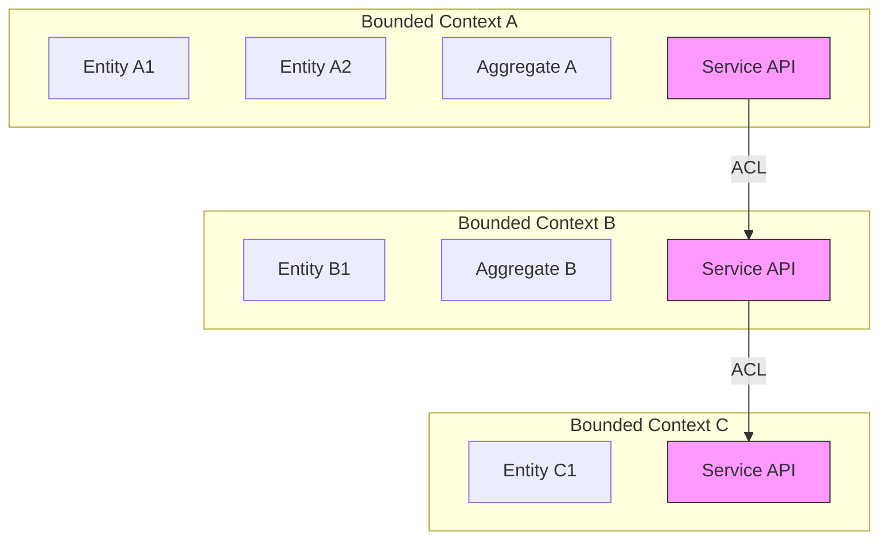
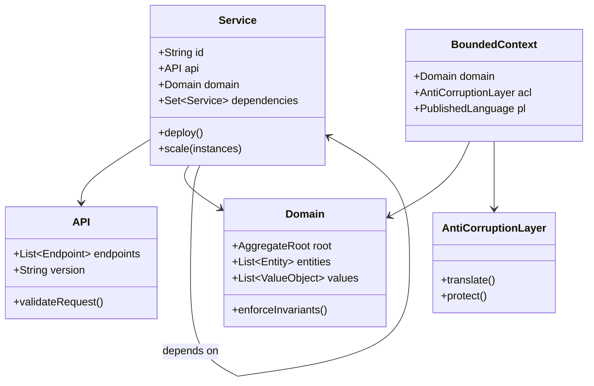
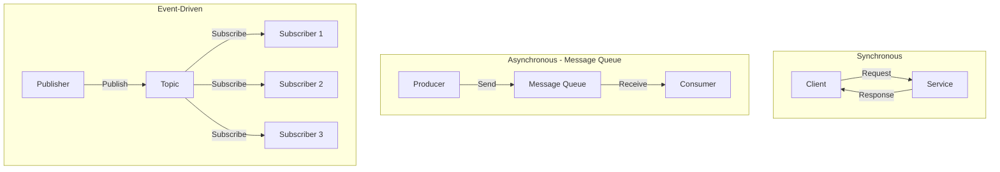
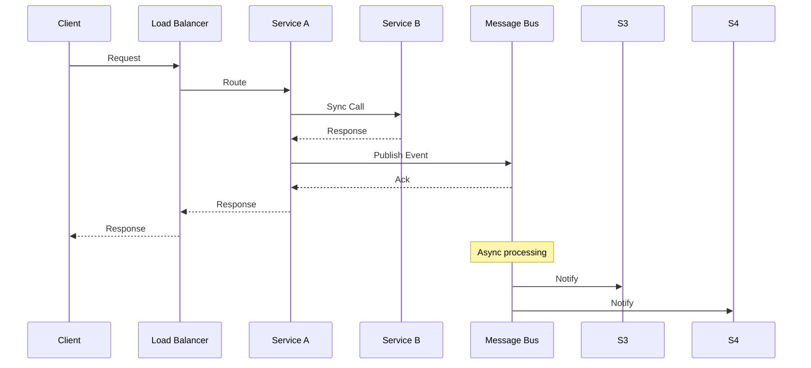

# 02.1 微服务形式化模型

## 02.1.1 概述

微服务架构将应用程序构建为一组小型、自治服务的集合。本节通过形式化方法定义微服务的核心概念和属性。

> **交叉引用**: 与 [02.2 服务发现与负载均衡](./02.2_服务发现与负载均衡.md)、[02.3 熔断与限流](./02.3_熔断与限流.md) 共同构成微服务体系。

---

## 02.1.2 服务边界形式化

### 02.1.2.1 形式化定义

**定义 02.1.1** (微服务). 微服务 $\mu$ 是一个七元组：
$$\mu = (ID, API, D, Dep, State, Res, SLO)$$
其中：

- $ID$: 唯一标识符
- $API$: 公开的接口集合
- $D$: 领域模型
- $Dep$: 依赖的其他服务集合
- $State$: 状态类型 $\in \{stateful, stateless\}$
- $Res$: 资源需求（CPU、内存、存储）
- $SLO$: 服务水平目标

**定义 02.1.2** (服务边界). 服务边界 $B$ 是领域边界的封装：
$$B(\mu) = \partial D_\mu \cup API_\mu$$
其中 $\partial D_\mu$ 表示领域 $\mu$ 的边界。

**定义 02.1.3** ( bounded context). 限界上下文 $BC$ 是领域驱动设计中的核心概念：
$$BC = (D, UBL, ACL, PL)$$
其中：

- $UBL$: 通用语言
- $ACL$: 防腐层
- $PL$: 发布语言

### 02.1.2.2 形式化定理

**定理 02.1.1** (服务自治性). 微服务 $\mu$ 是自治的，当且仅当：
$$\forall op \in API_\mu: op \text{ 可以在 } \mu \text{ 内部独立完成}$$
或
$$\forall dep \in Dep_\mu: dep \text{ 可用 } \Rightarrow op \text{ 可完成}$$

**定理 02.1.2** (边界封闭性). 领域 $D$ 的不变量在边界 $B$ 内保持：
$$\forall inv \in Invariant(D): B \models inv$$

### 02.1.2.3 架构图





### 02.1.2.4 代码示例

**Rust 实现：**

```rust
use std::collections::HashSet;
use std::sync::Arc;

// 微服务定义
#[derive(Clone, Debug)]
pub struct Microservice {
    pub id: String,
    pub api: API,
    pub domain: Domain,
    pub dependencies: HashSet<String>,
    pub state_type: StateType,
    pub resources: Resources,
    pub slo: SLO,
}

#[derive(Clone, Debug)]
pub enum StateType {
    Stateful,
    Stateless,
}

#[derive(Clone, Debug)]
pub struct API {
    pub version: String,
    pub endpoints: Vec<Endpoint>,
}

#[derive(Clone, Debug)]
pub struct Endpoint {
    pub path: String,
    pub method: HttpMethod,
    pub request_schema: Schema,
    pub response_schema: Schema,
}

#[derive(Clone, Debug)]
pub enum HttpMethod {
    GET,
    POST,
    PUT,
    DELETE,
    PATCH,
}

#[derive(Clone, Debug)]
pub struct Domain {
    pub name: String,
    pub aggregates: Vec<Aggregate>,
    pub entities: Vec<Entity>,
}

#[derive(Clone, Debug)]
pub struct Aggregate {
    pub id: String,
    pub root: Entity,
    pub invariants: Vec<String>,
}

#[derive(Clone, Debug)]
pub struct Entity {
    pub id: String,
    pub properties: Vec<Property>,
}

#[derive(Clone, Debug)]
pub struct Property {
    pub name: String,
    pub property_type: String,
}

#[derive(Clone, Debug)]
pub struct Resources {
    pub cpu_cores: u32,
    pub memory_mb: u32,
    pub storage_gb: u32,
}

#[derive(Clone, Debug)]
pub struct SLO {
    pub availability: f64,  // 0.0 - 1.0
    pub latency_p99_ms: u32,
    pub throughput_rps: u32,
}

type Schema = String;

// 限界上下文
pub struct BoundedContext {
    pub name: String,
    pub domain: Domain,
    pub acl: AntiCorruptionLayer,
    pub published_language: PublishedLanguage,
}

pub struct AntiCorruptionLayer {
    pub translations: Vec<Translation>,
}

pub struct Translation {
    pub external_model: String,
    pub internal_model: String,
    pub mapper: Box<dyn Fn(String) -> String>,
}

pub struct PublishedLanguage {
    pub events: Vec<DomainEvent>,
    pub commands: Vec<Command>,
}

pub struct DomainEvent {
    pub name: String,
    pub payload_schema: Schema,
}

pub struct Command {
    pub name: String,
    pub payload_schema: Schema,
}

// 服务注册与管理
pub struct ServiceRegistry {
    services: HashMap<String, Arc<Microservice>>,
}

impl ServiceRegistry {
    pub fn new() -> Self {
        Self {
            services: HashMap::new(),
        }
    }

    pub fn register(&mut self, service: Microservice) {
        self.services.insert(service.id.clone(), Arc::new(service));
    }

    pub fn get_service(&self, id: &str) -> Option<Arc<Microservice>> {
        self.services.get(id).cloned()
    }

    pub fn validate_dependencies(&self, service: &Microservice) -> bool {
        service.dependencies.iter().all(|dep| {
            self.services.contains_key(dep)
        })
    }
}

use std::collections::HashMap;
```

**Java 实现：**

```java
import java.util.*;

// 微服务实体
public class Microservice {
    private String id;
    private API api;
    private Domain domain;
    private Set<String> dependencies;
    private StateType stateType;
    private Resources resources;
    private SLO slo;

    public boolean isAutonomous() {
        return dependencies.isEmpty() ||
               dependencies.stream().allMatch(this::isDependencyAvailable);
    }

    private boolean isDependencyAvailable(String depId) {
        // 检查依赖服务是否可用
        return true;
    }

    // Getters and setters...
}

// 限界上下文
public class BoundedContext {
    private String name;
    private Domain domain;
    private AntiCorruptionLayer acl;
    private PublishedLanguage publishedLanguage;

    public void protectDomain() {
        acl.translate();
    }
}

// 防腐层
public class AntiCorruptionLayer {
    private List<Translation> translations;

    public String translate(String externalModel) {
        return translations.stream()
            .filter(t -> t.getExternalModel().equals(externalModel))
            .findFirst()
            .map(Translation::map)
            .orElse(externalModel);
    }
}

// 领域聚合
public class Aggregate {
    private String id;
    private Entity root;
    private List<String> invariants;

    public boolean enforceInvariants() {
        return invariants.stream().allMatch(this::checkInvariant);
    }

    private boolean checkInvariant(String invariant) {
        // 验证不变量
        return true;
    }
}
```

---

## 02.1.3 服务通信形式化

### 02.1.3.1 形式化定义

**定义 02.1.4** (通信模式). 服务间通信模式 $Comm$：
$$Comm \in \{sync, async, event-driven\}$$

**定义 02.1.5** (同步通信). 同步通信是一个请求-响应模式：
$$Sync(req, svc) = resp \quad \text{where } svc \in Dep_\mu$$
满足：
$$timeout \Rightarrow resp = \bot$$

**定义 02.1.6** (异步通信). 异步通信使用消息队列：
$$Async(msg, queue) = promise$$
其中 $promise$ 是未来结果的占位符。

**定义 02.1.7** (事件驱动通信). 事件驱动通信基于发布-订阅：
$$Event(evt, topic) = \{sub_1, sub_2, ..., sub_n\} \text{ 接收 } evt$$

### 02.1.3.2 形式化定理

**定理 02.1.3** (同步通信可靠性). 同步通信满足：
$$P(success) = P(svc.available) \times P(network.ok)$$

**定理 02.1.4** (异步通信最终一致性). 异步通信保证：
$$\Diamond (msg \in queue \Rightarrow \Diamond msg.processed)$$

### 02.1.3.3 架构图





### 02.1.3.4 代码示例

**Rust 实现：**

```rust
use std::future::Future;
use std::pin::Pin;
use std::time::Duration;
use tokio::time::timeout;

// 同步通信客户端
pub struct SyncClient {
    base_url: String,
    client: reqwest::Client,
}

impl SyncClient {
    pub fn new(base_url: &str) -> Self {
        Self {
            base_url: base_url.to_string(),
            client: reqwest::Client::new(),
        }
    }

    pub async fn call(&self, endpoint: &str, payload: &str) -> Result<String, Error> {
        let url = format!("{}/{}", self.base_url, endpoint);
        let result = timeout(
            Duration::from_secs(30),
            self.client.post(&url).body(payload.to_string()).send()
        ).await;

        match result {
            Ok(Ok(response)) => response.text().await.map_err(|e| e.into()),
            Ok(Err(e)) => Err(e.into()),
            Err(_) => Err(Error::Timeout),
        }
    }
}

// 异步消息生产者
pub struct AsyncProducer {
    queue: Arc<dyn MessageQueue>,
}

impl AsyncProducer {
    pub async fn send(&self, message: Message) -> Result<MessageId, Error> {
        self.queue.publish(message).await
    }
}

pub struct Message {
    pub id: String,
    pub payload: Vec<u8>,
    pub headers: HashMap<String, String>,
}

pub struct MessageId(String);

pub trait MessageQueue: Send + Sync {
    fn publish(&self, message: Message) -> Pin<Box<dyn Future<Output = Result<MessageId, Error>> + Send>>;
    fn subscribe(&self, topic: &str) -> Pin<Box<dyn Future<Output = Result<Box<dyn Stream<Item = Message>>, Error>> + Send>>;
}

use std::collections::HashMap;
use std::sync::Arc;
use futures::Stream;

#[derive(Debug)]
pub enum Error {
    Timeout,
    Network(String),
    Service(String),
}

impl From<reqwest::Error> for Error {
    fn from(e: reqwest::Error) -> Self {
        Error::Network(e.to_string())
    }
}

// 事件发布者
pub struct EventPublisher {
    event_bus: Arc<dyn EventBus>,
}

impl EventPublisher {
    pub fn new(event_bus: Arc<dyn EventBus>) -> Self {
        Self { event_bus }
    }

    pub async fn publish(&self, event: DomainEvent) -> Result<(), Error> {
        let envelope = EventEnvelope {
            event_id: uuid::Uuid::new_v4().to_string(),
            event_type: event.name.clone(),
            payload: serde_json::to_vec(&event).unwrap(),
            timestamp: chrono::Utc::now(),
        };

        self.event_bus.publish(&event.name, envelope).await
    }
}

pub trait EventBus: Send + Sync {
    async fn publish(&self, topic: &str, event: EventEnvelope) -> Result<(), Error>;
    async fn subscribe(&self, topic: &str) -> Result<Box<dyn Stream<Item = EventEnvelope>>, Error>;
}

pub struct EventEnvelope {
    pub event_id: String,
    pub event_type: String,
    pub payload: Vec<u8>,
    pub timestamp: chrono::DateTime<chrono::Utc>,
}
```

**Java 实现：**

```java
import org.springframework.web.reactive.function.client.WebClient;
import org.springframework.kafka.core.KafkaTemplate;
import reactor.core.publisher.Mono;
import java.time.Duration;

// 同步通信服务
@Service
public class SyncCommunicationService {

    private final WebClient webClient;

    public Mono<String> callService(String serviceUrl, String payload) {
        return webClient.post()
            .uri(serviceUrl)
            .bodyValue(payload)
            .retrieve()
            .bodyToMono(String.class)
            .timeout(Duration.ofSeconds(30));
    }
}

// 异步消息服务
@Service
public class AsyncMessageService {

    @Autowired
    private KafkaTemplate<String, String> kafkaTemplate;

    public CompletableFuture<SendResult<String, String>> sendMessage(
            String topic, String key, String message) {
        return kafkaTemplate.send(topic, key, message)
            .toCompletableFuture();
    }
}

// 事件发布服务
@Service
public class EventPublisherService {

    @Autowired
    private ApplicationEventPublisher publisher;

    public void publishDomainEvent(DomainEvent event) {
        EventEnvelope envelope = EventEnvelope.builder()
            .eventId(UUID.randomUUID().toString())
            .eventType(event.getClass().getSimpleName())
            .payload(serialize(event))
            .timestamp(Instant.now())
            .build();

        publisher.publishEvent(envelope);
    }
}

// 事件监听
@Component
public class DomainEventListener {

    @EventListener
    @Async
    public void handleEvent(EventEnvelope event) {
        // 处理事件
        processEvent(event);
    }

    @KafkaListener(topics = "domain-events")
    public void handleKafkaEvent(String message) {
        // 处理 Kafka 消息
    }
}
```

---

## 02.1.4 总结

| 属性 | 说明 | 形式化约束 |
|------|------|-----------|
| 服务边界 | 限界上下文的封装 | $B = \partial D \cup API$ |
| 自治性 | 独立部署和扩展 | $Dep \neq \emptyset \Rightarrow graceful$ |
| 通信 | 同步/异步/事件驱动 | $Comm \in \{sync, async, event\}$ |

> **交叉引用**: 服务间通信的故障处理请参考 [02.3 熔断与限流](./02.3_熔断与限流.md)。
