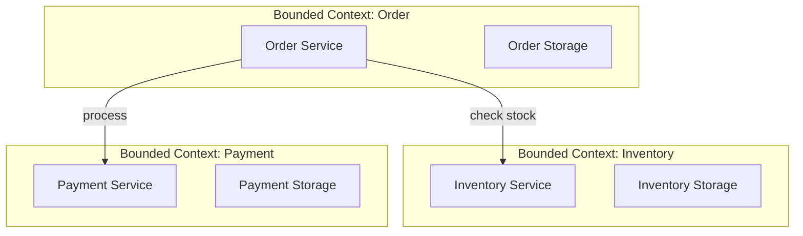
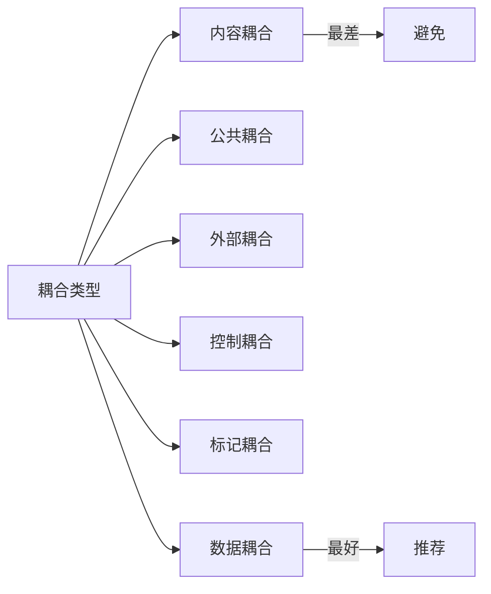
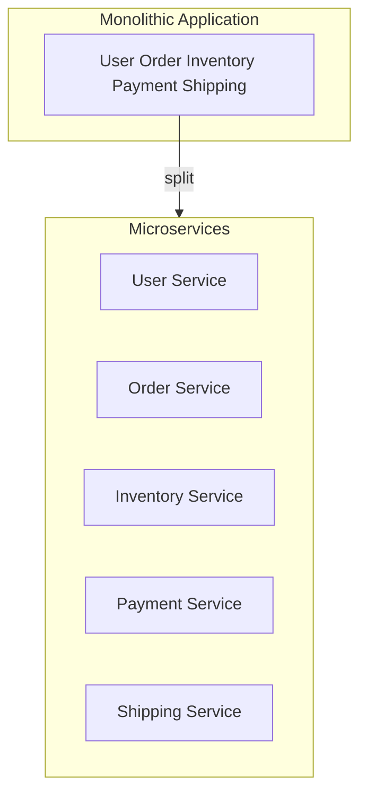
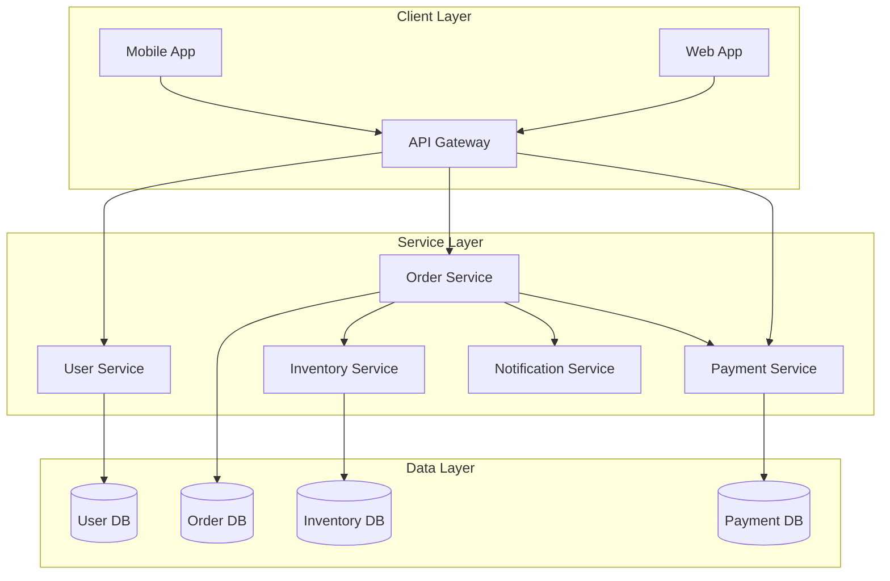

# 02.1 微服务设计原则

---

📌 **内容摘要**

本文档深入探讨微服务设计原则的核心原理和关键方法。内容涵盖微服务架构领域的主要知识点，包括分布式, 服务发现, 微服务等关键主题。适合初学者建立基础知识体系。

**关键词**: 分布式, 服务发现, 微服务, 微服务架构

📚 **学习目标**
- 理解微服务设计原则的基本概念和核心原理
- 掌握相关术语和符号表示
- 建立该领域的系统性知识框架

🎯 **难度级别**: 初级

⏱️ **预计阅读时间**: 15分钟

**前置知识**: 基础数学知识

---


## 目录

- [02.1 微服务设计原则](#021-微服务设计原则)
  - [目录](#目录)
  - [1. 概述](#1-概述)
  - [2. 单一职责原则 (SRP)](#2-单一职责原则-srp)
    - [2.1 形式化定义](#21-形式化定义)
    - [2.2 服务边界划分](#22-服务边界划分)
    - [2.3 反模式](#23-反模式)
  - [3. 松耦合原则](#3-松耦合原则)
    - [3.1 形式化定义](#31-形式化定义)
    - [3.2 耦合类型](#32-耦合类型)
    - [3.3 解耦策略](#33-解耦策略)
  - [4. 高内聚原则](#4-高内聚原则)
    - [4.1 形式化定义](#41-形式化定义)
    - [4.2 内聚类型](#42-内聚类型)
    - [4.3 设计实践](#43-设计实践)
  - [5. 服务粒度设计](#5-服务粒度设计)
    - [5.1 粒度评估](#51-粒度评估)
    - [5.2 拆分策略](#52-拆分策略)
  - [6. 架构图](#6-架构图)
  - [7. 相关文档](#7-相关文档)

## 1. 概述

微服务架构是一种将应用程序构建为一组小型、独立部署服务的架构风格。
每个服务运行在自己的进程中，通过轻量级机制（通常是 HTTP API）通信。

**核心原则**：

- 单一职责 (Single Responsibility)
- 松耦合 (Loose Coupling)
- 高内聚 (High Cohesion)

## 2. 单一职责原则 (SRP)

### 2.1 形式化定义

设服务 $S$，变更原因集合 $R = \{r_1, r_2, ..., r_n\}$：

$$SRP(S) \iff |R| = 1$$

**职责边界**：
$$Domain(S) = \{d \mid d \text{ is within the bounded context of } S\}$$

### 2.2 服务边界划分



**边界识别方法**：

1. **业务能力分析**：按业务能力划分服务
2. **DDD 限界上下文**：基于领域驱动设计的上下文边界
3. **数据所有权**：每个服务拥有独立的数据存储

### 2.3 反模式

| 反模式 | 描述 | 解决方案 |
|--------|------|----------|
| 上帝服务 | 单一服务处理过多职责 | 按领域拆分 |
| 贫血领域模型 | 业务逻辑泄露到服务层 | 富领域模型 |
| 共享数据库 | 多个服务共享数据库 | 数据库按服务隔离 |

## 3. 松耦合原则

### 3.1 形式化定义

设服务 $A$ 和 $B$，耦合度 $C(A, B)$：

$$C(A, B) = \frac{|dependencies(A, B)|}{|total\_interfaces(A)|}$$

**松耦合目标**：
$$\forall A, B \in Services: C(A, B) \leq \theta$$

其中 $\theta$ 为可接受的耦合阈值。

### 3.2 耦合类型



**耦合强度排序**：
$$Content > Common > External > Control > Stamp > Data$$

### 3.3 解耦策略

**异步消息解耦**：

```rust
// 发布-订阅模式实现
use tokio::sync::broadcast;

pub struct EventBus {
    sender: broadcast::Sender<Event>,
}

impl EventBus {
    pub fn new() -> Self {
        let (sender, _) = broadcast::channel(100);
        Self { sender }
    }

    pub fn publish(&self, event: Event) {
        let _ = self.sender.send(event);
    }

    pub fn subscribe(&self) -> broadcast::Receiver<Event> {
        self.sender.subscribe()
    }
}
```

**API 版本控制**：

```rust
// 版本化 API 路由
pub fn routes() -> Router {
    Router::new()
        .nest("/v1", v1_routes())
        .nest("/v2", v2_routes())
}
```

## 4. 高内聚原则

### 4.1 形式化定义

设模块 $M$，功能集合 $F = \{f_1, f_2, ..., f_n\}$，内聚度 $Cohesion(M)$：

$$Cohesion(M) = \frac{\text{related\_functions}(F)}{|F|}$$

**高内聚目标**：
$$Cohesion(M) \rightarrow 1$$

### 4.2 内聚类型

| 类型 | 描述 | 示例 |
|------|------|------|
| 功能内聚 | 模块执行单一功能 | 订单创建服务 |
| 顺序内聚 | 功能按顺序执行 | 验证→处理→存储 |
| 通信内聚 | 功能操作相同数据 | 订单查询服务 |
| 过程内聚 | 功能按特定顺序执行 | 结账流程 |

### 4.3 设计实践

**分层架构内聚**：

```
service/
├── api/           # API 层 - 输入适配
├── application/   # 应用层 - 用例编排
├── domain/        # 领域层 - 核心业务逻辑
└── infrastructure/# 基础设施层 - 输出适配
```

**Go 项目结构**：

```go
// internal/domain/order.go - 领域层
package domain

type Order struct {
    ID        string
    UserID    string
    Items     []OrderItem
    Status    OrderStatus
    CreatedAt time.Time
}

func (o *Order) CalculateTotal() decimal.Decimal {
    // 领域逻辑
}

// internal/application/order_service.go - 应用层
package application

type OrderService struct {
    repo    OrderRepository
    payment PaymentService
}

func (s *OrderService) CreateOrder(cmd CreateOrderCommand) (*Order, error) {
    // 应用逻辑
}
```

## 5. 服务粒度设计

### 5.1 粒度评估

**粒度评估公式**：

$$GranularityScore = \alpha \cdot \frac{1}{Cohesion} + \beta \cdot Coupling + \gamma \cdot Complexity$$

其中：

- $\alpha, \beta, \gamma$ 为权重系数
- $Cohesion$ 越高分数越低（越好）
- $Coupling$ 越低分数越低（越好）

### 5.2 拆分策略

**按业务功能拆分**：



**按数据拆分**：

```rust
// 用户服务 - 用户数据所有权
pub struct UserService {
    user_repo: UserRepository,
    // 只操作用户相关数据
}

// 订单服务 - 订单数据所有权
pub struct OrderService {
    order_repo: OrderRepository,
    // 只操作订单相关数据
}
```

## 6. 架构图



## 7. 相关文档

- [02.2_服务发现与注册](./02.2_服务发现与注册.md) - 服务间通信基础设施
- [02.3_API网关](./02.3_API网关.md) - 服务入口管理
- [02.4_可观测性](./02.4_可观测性.md) - 监控与追踪
- [01_设计模式](../01_设计模式/01.5_分布式模式.md) - 微服务设计模式
---

## 📚 延伸阅读

- [02.1 微服务形式化模型](../02_微服务架构/02.1_微服务形式化模型.md)
- [02.4 可观测性](../02_微服务架构/02.4_可观测性.md)
- [02.2 服务发现与注册](../02_微服务架构/02.2_服务发现与注册.md)
- [02.2 服务发现与负载均衡](../02_微服务架构/02.2_服务发现与负载均衡.md)
- [02.3 API 网关](../02_微服务架构/02.3_API网关.md)
