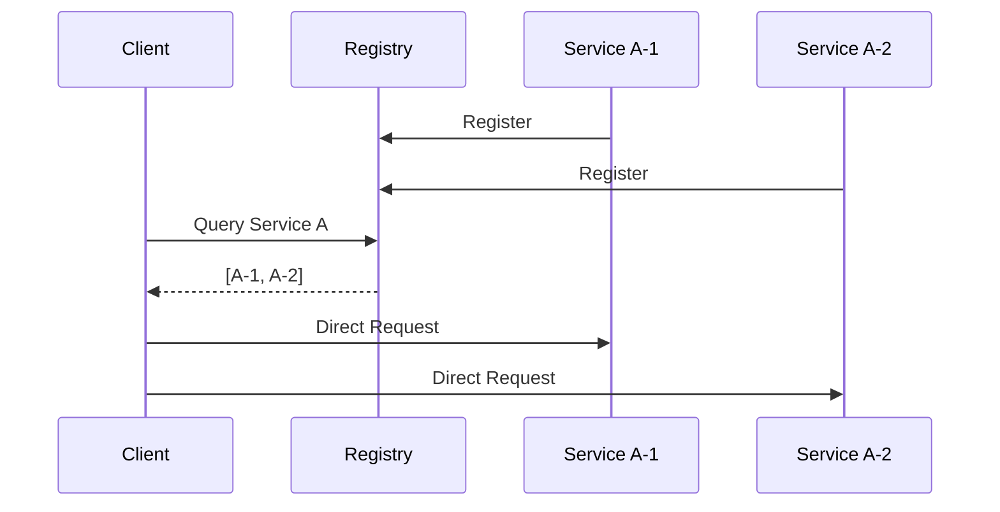
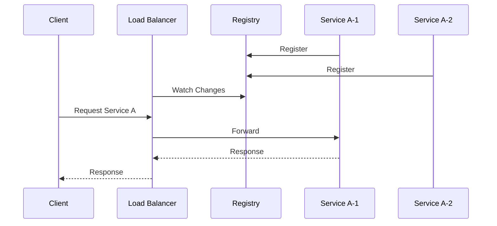
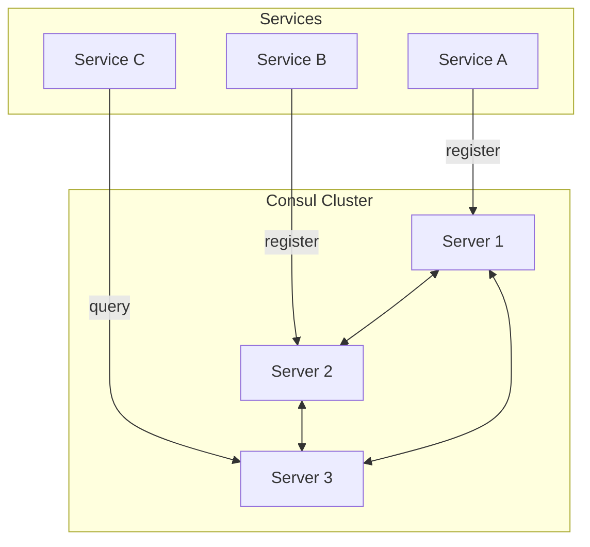
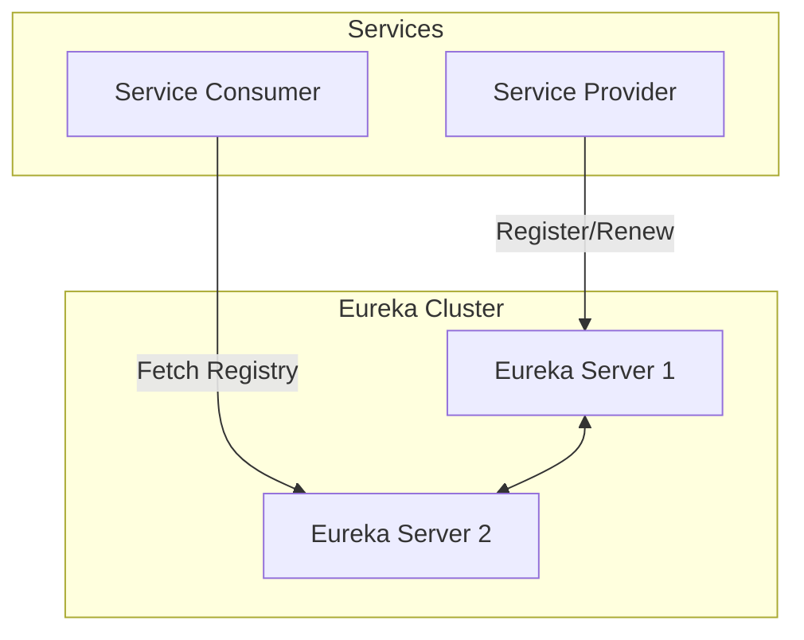
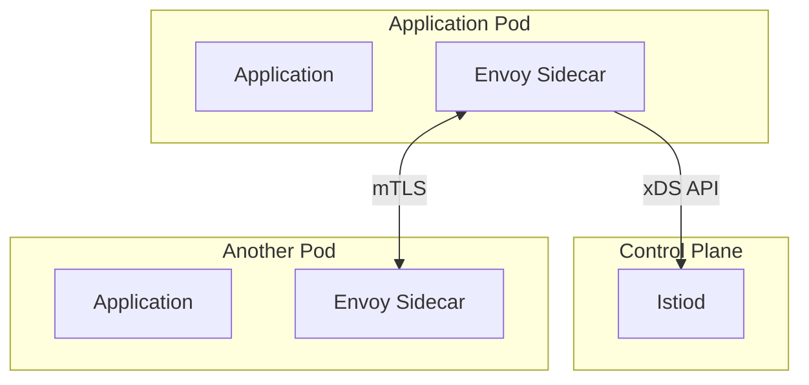

# 02.2 服务发现与注册

## 目录

- [02.2 服务发现与注册](#022-服务发现与注册)
  - [目录](#目录)
  - [1. 概述](#1-概述)
  - [2. 服务注册模型](#2-服务注册模型)
    - [2.1 客户端发现](#21-客户端发现)
    - [2.2 服务端发现](#22-服务端发现)
  - [3. Consul 实现](#3-consul-实现)
    - [3.1 架构](#31-架构)
    - [3.2 Rust 客户端](#32-rust-客户端)
    - [3.3 Go 客户端](#33-go-客户端)
  - [4. Eureka 实现](#4-eureka-实现)
    - [4.1 架构](#41-架构)
    - [4.2 服务注册](#42-服务注册)
  - [5. 服务网格 (Service Mesh)](#5-服务网格-service-mesh)
    - [5.1 架构](#51-架构)
    - [5.2 Sidecar 模式](#52-sidecar-模式)
    - [5.3 Istio 集成](#53-istio-集成)
  - [6. 健康检查](#6-健康检查)
  - [7. 相关文档](#7-相关文档)

## 1. 概述

服务发现与注册是微服务架构的核心基础设施，解决服务间如何相互定位的问题。

**核心问题**：

- 服务实例动态变化（扩缩容、故障迁移）
- 网络位置透明化
- 负载均衡与健康检查

## 2. 服务注册模型

### 2.1 客户端发现



**特点**：

- 客户端直接选择服务实例
- 客户端需集成服务发现逻辑
- 少一跳网络延迟

### 2.2 服务端发现



**特点**：

- 通过负载均衡器路由
- 客户端无需感知服务位置
- 集中式流量管理

## 3. Consul 实现

### 3.1 架构



### 3.2 Rust 客户端

```rust
use consul::{Client, Config};
use consul::catalog::CatalogRegistration;
use consul::health::Health;

pub struct ServiceRegistry {
    client: Client,
    service_name: String,
    service_id: String,
}

impl ServiceRegistry {
    pub fn new(addr: &str, service_name: &str, service_id: &str) -> Self {
        let config = Config::new().unwrap();
        let client = Client::new(config);

        Self {
            client,
            service_name: service_name.to_string(),
            service_id: service_id.to_string(),
        }
    }

    pub async fn register(&self, address: &str, port: u16) -> Result<(), Box<dyn std::error::Error>> {
        let registration = CatalogRegistration {
            Node: self.service_id.clone(),
            Address: address.to_string(),
            Service: Some(consul::catalog::Service {
                Service: self.service_name.clone(),
                ID: Some(self.service_id.clone()),
                Port: Some(port),
                Address: Some(address.to_string()),
                ..Default::default()
            }),
            ..Default::default()
        };

        self.client.catalog.register(registration, None).await?;
        Ok(())
    }

    pub async fn discover(&self, service_name: &str) -> Result<Vec<String>, Box<dyn std::error::Error>> {
        let health = Health::new(self.client.clone());
        let services = health.service(service_name, true, None).await?;

        let addresses: Vec<String> = services.0
            .iter()
            .map(|s| {
                let address = s.Service.Address.clone().unwrap_or_default();
                let port = s.Service.Port.unwrap_or(80);
                format!("{}:{}", address, port)
            })
            .collect();

        Ok(addresses)
    }

    pub async fn deregister(&self) -> Result<(), Box<dyn std::error::Error>> {
        self.client.catalog.deregister(
            consul::catalog::CatalogDeregistration {
                Node: self.service_id.clone(),
                ServiceID: Some(self.service_id.clone()),
                ..Default::default()
            },
            None,
        ).await?;
        Ok(())
    }
}

// 健康检查端点
use axum::{routing::get, Router};
use std::net::SocketAddr;

async fn health_check() -> &'static str {
    "OK"
}

pub fn health_router() -> Router {
    Router::new().route("/health", get(health_check))
}
```

### 3.3 Go 客户端

```go
package main

import (
    "fmt"
    "log"

    "github.com/hashicorp/consul/api"
)

type ServiceRegistry struct {
    client       *api.Client
    serviceName  string
    serviceID    string
}

func NewServiceRegistry(consulAddr, serviceName, serviceID string) (*ServiceRegistry, error) {
    config := api.DefaultConfig()
    config.Address = consulAddr

    client, err := api.NewClient(config)
    if err != nil {
        return nil, err
    }

    return &ServiceRegistry{
        client:      client,
        serviceName: serviceName,
        serviceID:   serviceID,
    }, nil
}

func (r *ServiceRegistry) Register(address string, port int) error {
    registration := &api.AgentServiceRegistration{
        ID:      r.serviceID,
        Name:    r.serviceName,
        Address: address,
        Port:    port,
        Check: &api.AgentServiceCheck{
            HTTP:     fmt.Sprintf("http://%s:%d/health", address, port),
            Interval: "10s",
            Timeout:  "5s",
        },
    }

    return r.client.Agent().ServiceRegister(registration)
}

func (r *ServiceRegistry) Discover(serviceName string) ([]string, error) {
    services, _, err := r.client.Health().Service(serviceName, "", true, nil)
    if err != nil {
        return nil, err
    }

    var addresses []string
    for _, service := range services {
        address := fmt.Sprintf("%s:%d", service.Service.Address, service.Service.Port)
        addresses = append(addresses, address)
    }

    return addresses, nil
}

func (r *ServiceRegistry) Deregister() error {
    return r.client.Agent().ServiceDeregister(r.serviceID)
}

func main() {
    registry, err := NewServiceRegistry("localhost:8500", "user-service", "user-1")
    if err != nil {
        log.Fatal(err)
    }

    // Register service
    if err := registry.Register("127.0.0.1", 8080); err != nil {
        log.Fatal(err)
    }

    // Discover services
    addresses, err := registry.Discover("user-service")
    if err != nil {
        log.Fatal(err)
    }

    fmt.Printf("Discovered addresses: %v\n", addresses)

    // Deregister on shutdown
    defer registry.Deregister()
}
```

## 4. Eureka 实现

### 4.1 架构



### 4.2 服务注册

```rust
// 使用 reqwest 实现 Eureka 客户端
use reqwest::Client;
use serde_json::json;

pub struct EurekaClient {
    client: Client,
    eureka_url: String,
    app_name: String,
    instance_id: String,
}

impl EurekaClient {
    pub fn new(eureka_url: &str, app_name: &str, instance_id: &str) -> Self {
        Self {
            client: Client::new(),
            eureka_url: eureka_url.to_string(),
            app_name: app_name.to_string(),
            instance_id: instance_id.to_string(),
        }
    }

    pub async fn register(&self, host: &str, port: u16) -> Result<(), reqwest::Error> {
        let registration = json!({
            "instance": {
                "instanceId": self.instance_id,
                "hostName": host,
                "app": self.app_name.to_uppercase(),
                "ipAddr": host,
                "status": "UP",
                "port": {
                    "$": port,
                    "@enabled": true
                },
                "healthCheckUrl": format!("http://{}:{}/health", host, port),
                "statusPageUrl": format!("http://{}:{}/info", host, port),
                "homePageUrl": format!("http://{}:{}/", host, port),
                "dataCenterInfo": {
                    "@class": "com.netflix.appinfo.InstanceInfo$DefaultDataCenterInfo",
                    "name": "MyOwn"
                }
            }
        });

        self.client
            .post(format!("{}/apps/{}", self.eureka_url, self.app_name))
            .header("Content-Type", "application/json")
            .json(&registration)
            .send()
            .await?;

        Ok(())
    }
}
```

## 5. 服务网格 (Service Mesh)

### 5.1 架构



### 5.2 Sidecar 模式

```yaml
# Kubernetes Deployment with Sidecar
apiVersion: apps/v1
kind: Deployment
metadata:
  name: user-service
spec:
  replicas: 3
  selector:
    matchLabels:
      app: user-service
  template:
    metadata:
      labels:
        app: user-service
    spec:
      containers:
      - name: user-service
        image: user-service:latest
        ports:
        - containerPort: 8080
      - name: istio-proxy
        image: istio/proxyv2:latest
        args:
        - proxy
        - sidecar
        env:
        - name: ISTIO_META_INTERCEPTION_MODE
          value: TPROXY
```

### 5.3 Istio 集成

**流量管理配置**：

```yaml
apiVersion: networking.istio.io/v1beta1
kind: VirtualService
metadata:
  name: user-service
spec:
  hosts:
  - user-service
  http:
  - match:
    - headers:
        version:
          exact: v2
    route:
    - destination:
        host: user-service
        subset: v2
      weight: 10
    - destination:
        host: user-service
        subset: v1
      weight: 90
  - route:
    - destination:
        host: user-service
        subset: v1
```

**目标规则**：

```yaml
apiVersion: networking.istio.io/v1beta1
kind: DestinationRule
metadata:
  name: user-service
spec:
  host: user-service
  trafficPolicy:
    loadBalancer:
      simple: LEAST_CONN
    connectionPool:
      tcp:
        maxConnections: 100
      http:
        http1MaxPendingRequests: 50
    outlierDetection:
      consecutiveErrors: 5
      interval: 30s
      baseEjectionTime: 30s
  subsets:
  - name: v1
    labels:
      version: v1
  - name: v2
    labels:
      version: v2
```

## 6. 健康检查

**主动健康检查**：

```rust
use tokio::time::{interval, Duration};

pub struct HealthChecker {
    registry: ServiceRegistry,
    check_interval: Duration,
}

impl HealthChecker {
    pub fn new(registry: ServiceRegistry, check_interval: Duration) -> Self {
        Self {
            registry,
            check_interval,
        }
    }

    pub async fn start(&self) {
        let mut ticker = interval(self.check_interval);

        loop {
            ticker.tick().await;
            self.check_services().await;
        }
    }

    async fn check_services(&self) {
        // 实现健康检查逻辑
        // 1. 获取所有注册的服务
        // 2. 发送健康检查请求
        // 3. 更新服务状态
        // 4. 移除不健康的服务
    }
}
```

## 7. 相关文档

- [02.1_微服务设计原则](./02.1_微服务设计原则.md) - 服务设计基础
- [02.3_API网关](./02.3_API网关.md) - 服务入口管理
- [01.5_分布式模式](../01_设计模式/01.5_分布式模式.md) - 分布式系统设计模式
