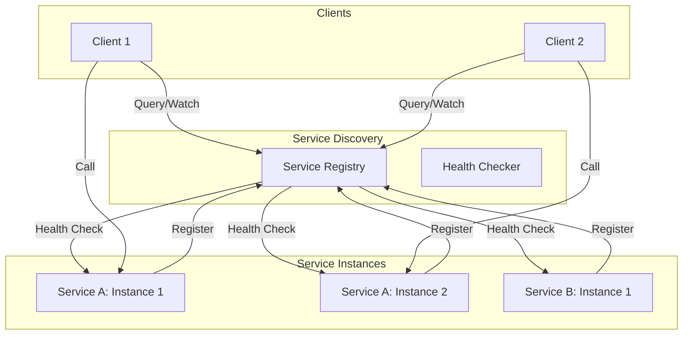
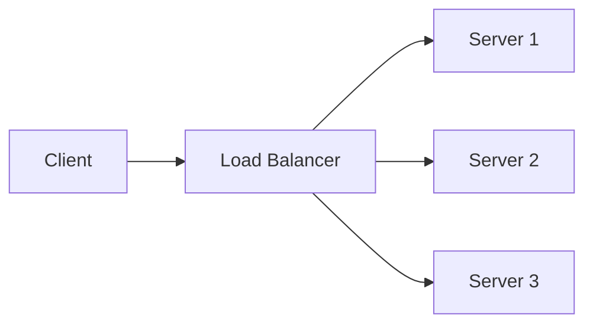

# 02.2 服务发现与负载均衡

---

📌 **内容摘要**

本文档深入探讨服务发现与负载均衡的核心原理和关键方法。内容涵盖微服务架构领域的主要知识点，包括分布式, 服务发现, 微服务等关键主题。适合有一定基础的学习者系统学习。

**关键词**: 分布式, 服务发现, 微服务, 微服务架构

📚 **学习目标**
- 掌握服务发现与负载均衡的核心概念和主要方法
- 理解相关理论的应用场景
- 建立该领域的系统性知识框架

🎯 **难度级别**: 中级

⏱️ **预计阅读时间**: 15分钟

**前置知识**: 相关领域的基础概念

---


## 02.2.1 概述

服务发现与负载均衡是微服务架构的核心基础设施，确保服务实例的动态注册、发现和流量分配。

> **交叉引用**: 与 [02.1 微服务形式化模型](./02.1_微服务形式化模型.md)、[02.3 熔断与限流](./02.3_熔断与限流.md) 共同构成微服务体系。

---

## 02.2.2 服务发现形式化

### 02.2.2.1 形式化定义

**定义 02.2.1** (服务注册表). 服务注册表 $R$ 是一个映射：
$$R: ServiceID \to \mathcal{P}(Instance)$$
其中 $Instance = (host, port, metadata, health)$

**定义 02.2.2** (服务实例). 服务实例 $inst$ 是一个五元组：
$$inst = (id, sid, endpoint, meta, h)$$
其中：

- $id$: 实例唯一标识
- $sid$: 所属服务ID
- $endpoint = (host, port)$: 网络端点
- $meta$: 元数据（版本、区域等）
- $h \in \{healthy, unhealthy, unknown\}$: 健康状态

**定义 02.2.3** (发现协议). 发现协议 $DP$：
$$DP \in \{pull, push, watch\}$$

- Pull: 客户端主动查询
- Push: 服务端主动推送
- Watch: 长连接监听变更

### 02.2.2.2 形式化定理

**定理 02.2.1** (最终一致性). 服务注册表最终反映实际实例状态：
$$\Diamond (R(sid) = \{inst | inst.sid = sid \land inst.h = healthy\})$$

**定理 02.2.2** (发现延迟上界). 对于 Pull 模式，最大发现延迟为：
$$T_{discover} \leq T_{interval}$$
对于 Push/Watch 模式：
$$T_{discover} \leq T_{network} + T_{process}$$

### 02.2.2.3 架构图



### 02.2.2.4 代码示例

**Rust 实现：**

```rust
use std::collections::HashMap;
use std::sync::{Arc, RwLock};
use std::time::{Duration, Instant};

#[derive(Clone, Debug)]
pub struct ServiceInstance {
    pub id: String,
    pub service_id: String,
    pub host: String,
    pub port: u16,
    pub metadata: HashMap<String, String>,
    pub health_status: HealthStatus,
    pub last_heartbeat: Instant,
}

#[derive(Clone, Debug, PartialEq)]
pub enum HealthStatus {
    Healthy,
    Unhealthy,
    Unknown,
}

pub struct ServiceRegistry {
    services: Arc<RwLock<HashMap<String, Vec<ServiceInstance>>>>,
}

impl ServiceRegistry {
    pub fn new() -> Self {
        Self {
            services: Arc::new(RwLock::new(HashMap::new())),
        }
    }

    pub fn register(&self, instance: ServiceInstance) -> Result<(), RegistryError> {
        let mut services = self.services.write().unwrap();
        let instances = services.entry(instance.service_id.clone()).or_insert_with(Vec::new);

        if instances.iter().any(|i| i.id == instance.id) {
            return Err(RegistryError::AlreadyExists);
        }

        instances.push(instance);
        Ok(())
    }

    pub fn query(&self, service_id: &str) -> Vec<ServiceInstance> {
        let services = self.services.read().unwrap();

        services.get(service_id)
            .map(|instances| {
                instances.iter()
                    .filter(|i| i.health_status == HealthStatus::Healthy)
                    .cloned()
                    .collect()
            })
            .unwrap_or_default()
    }
}

#[derive(Debug)]
pub enum RegistryError {
    AlreadyExists,
}
```

**Java 实现：**

```java
@Service
public class ServiceRegistry {

    private final Map<String, List<ServiceInstance>> services = new ConcurrentHashMap<>();

    public void register(ServiceInstance instance) {
        services.computeIfAbsent(instance.getServiceId(), k ->
            new CopyOnWriteArrayList<>()).add(instance);
    }

    public List<ServiceInstance> query(String serviceId) {
        return services.getOrDefault(serviceId, Collections.emptyList())
            .stream()
            .filter(i -> i.getHealthStatus() == HealthStatus.HEALTHY)
            .collect(Collectors.toList());
    }
}
```

---

## 02.2.3 负载均衡形式化

### 02.2.3.1 形式化定义

**定义 02.2.4** (负载均衡器). 负载均衡器 $LB$ 是一个函数：
$$LB: Request \times \mathcal{P}(Instance) \to Instance$$

**定义 02.2.5** (一致性哈希). 一致性哈希函数 $CH$：
$$CH: Key \times \mathcal{P}(Node) \to Node$$
满足单调性和平衡性。

### 02.2.3.2 形式化定理

**定理 02.2.3** (一致性哈希单调性). 设节点集合从 $N$ 变为 $N'$：
$$|N \Delta N'| = 1 \Rightarrow |\{k | CH(k, N) \neq CH(k, N')\}| \approx \frac{|K|}{|N|}$$

### 02.2.3.3 架构图



### 02.2.3.4 代码示例

**Rust 实现：**

```rust
use std::collections::BTreeMap;
use std::hash::{Hash, Hasher};
use std::sync::atomic::{AtomicUsize, Ordering};

pub trait LoadBalancer {
    fn select(&self, key: Option<&str>) -> Option<&str>;
    fn add_node(&mut self, node: &str, weight: u32);
}

pub struct RoundRobinBalancer {
    nodes: Vec<String>,
    current: AtomicUsize,
}

impl LoadBalancer for RoundRobinBalancer {
    fn select(&self, _key: Option<&str>) -> Option<&str> {
        if self.nodes.is_empty() {
            return None;
        }
        let index = self.current.fetch_add(1, Ordering::Relaxed) % self.nodes.len();
        Some(&self.nodes[index])
    }

    fn add_node(&mut self, node: &str, _weight: u32) {
        self.nodes.push(node.to_string());
    }
}

pub struct ConsistentHashBalancer {
    ring: BTreeMap<u64, String>,
    virtual_nodes: u32,
}

impl ConsistentHashBalancer {
    fn hash(&self, key: &str) -> u64 {
        use std::collections::hash_map::DefaultHasher;
        let mut hasher = DefaultHasher::new();
        key.hash(&mut hasher);
        hasher.finish()
    }
}

impl LoadBalancer for ConsistentHashBalancer {
    fn select(&self, key: Option<&str>) -> Option<&str> {
        let key = key?;
        let hash = self.hash(key);

        self.ring.range(hash..).next()
            .or_else(|| self.ring.iter().next())
            .map(|(_, node)| node.as_str())
    }

    fn add_node(&mut self, node: &str, _weight: u32) {
        for i in 0..self.virtual_nodes {
            let virtual_key = format!("{}#{}", node, i);
            let hash = self.hash(&virtual_key);
            self.ring.insert(hash, node.to_string());
        }
    }
}
```

**Java 实现：**

```java
public interface LoadBalancer {
    String select(String key);
    void addNode(String node, int weight);
}

@Component
public class ConsistentHashBalancer implements LoadBalancer {

    private final TreeMap<Long, String> ring = new TreeMap<>();
    private final int virtualNodes;

    @Override
    public String select(String key) {
        if (ring.isEmpty()) return null;

        long hash = hash(key);
        Map.Entry<Long, String> entry = ring.ceilingEntry(hash);
        if (entry == null) {
            entry = ring.firstEntry();
        }
        return entry.getValue();
    }

    @Override
    public void addNode(String node, int weight) {
        for (int i = 0; i < virtualNodes * weight; i++) {
            String virtualKey = node + "#" + i;
            ring.put(hash(virtualKey), node);
        }
    }

    private long hash(String key) {
        try {
            MessageDigest md = MessageDigest.getInstance("MD5");
            byte[] digest = md.digest(key.getBytes(StandardCharsets.UTF_8));
            return ((long) (digest[3] & 0xFF) << 24) |
                   ((long) (digest[2] & 0xFF) << 16) |
                   ((long) (digest[1] & 0xFF) << 8) |
                   ((long) (digest[0] & 0xFF));
        } catch (NoSuchAlgorithmException e) {
            return key.hashCode();
        }
    }
}
```

---

## 02.2.4 总结

| 组件 | 核心功能 | 关键算法 |
|------|---------|---------|
| 服务发现 | 动态注册与发现 | 健康检查、缓存一致性 |
| 负载均衡 | 流量分配 | 轮询、加权、一致性哈希 |
---

## 📚 延伸阅读

- [02.1 微服务形式化模型](../02_微服务架构/02.1_微服务形式化模型.md)
- [02.1 微服务设计原则](../02_微服务架构/02.1_微服务设计原则.md)
- [02.2 服务发现与注册](../02_微服务架构/02.2_服务发现与注册.md)
