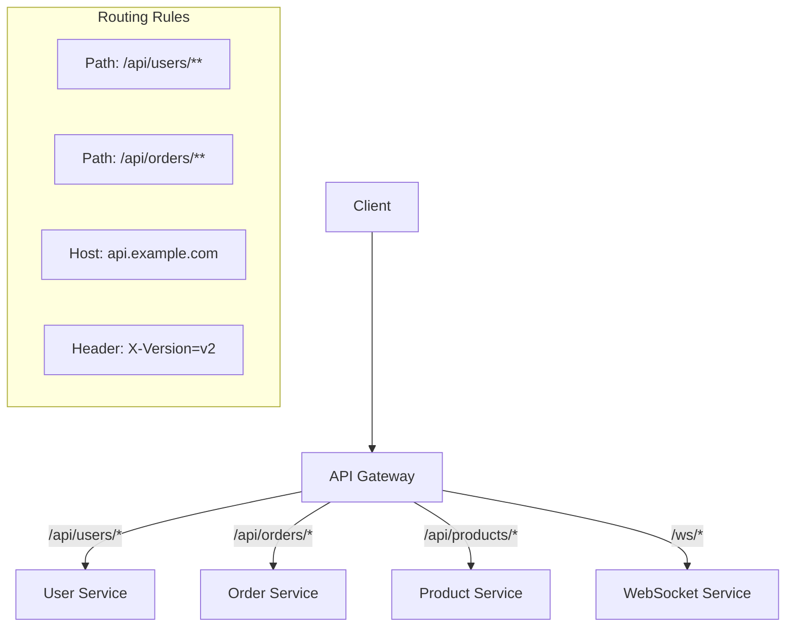
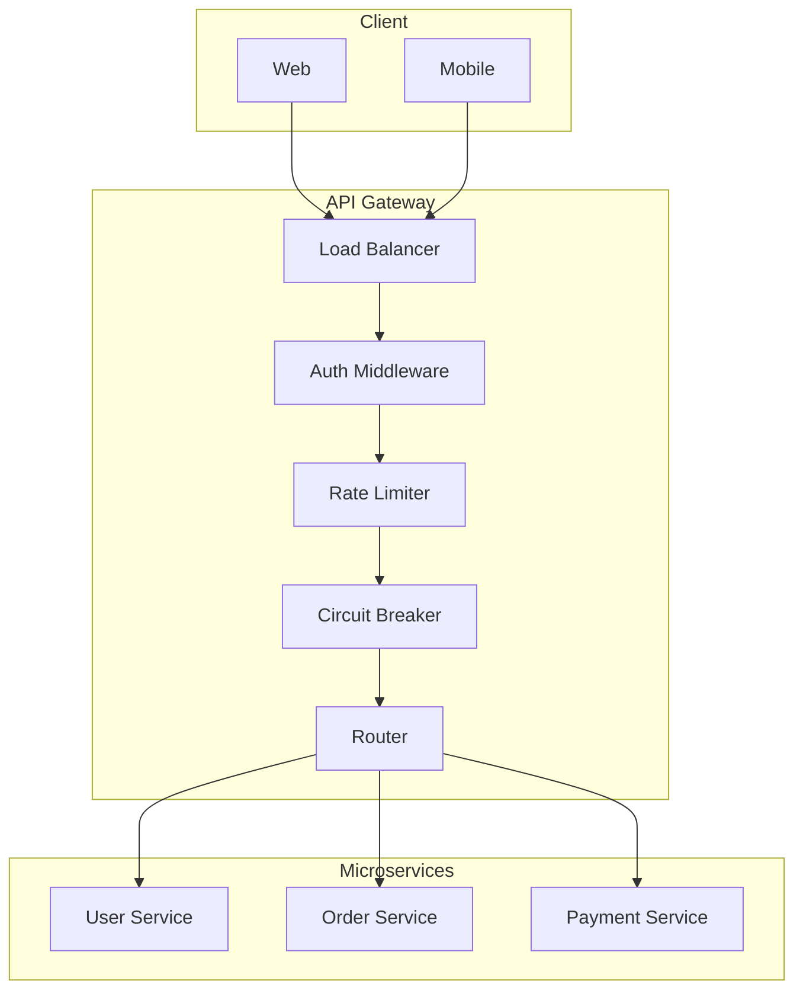

# 02.3 API 网关

---

📌 **内容摘要**

本文档深入探讨API 网关的核心原理和关键方法。内容涵盖微服务架构领域的主要知识点，包括分布式, 服务发现, 微服务等关键主题。适合有一定基础的学习者系统学习。

**关键词**: 分布式, 服务发现, 微服务, 微服务架构

📚 **学习目标**
- 掌握API 网关的核心概念和主要方法
- 理解相关理论的应用场景
- 建立该领域的系统性知识框架

🎯 **难度级别**: 中级

⏱️ **预计阅读时间**: 15分钟

**前置知识**: 相关领域的基础概念

---


## 目录

- [02.3 API 网关](#023-api-网关)
  - [目录](#目录)
  - [1. 概述](#1-概述)
  - [2. 路由管理](#2-路由管理)
    - [2.1 路由模型](#21-路由模型)
    - [2.2 动态路由](#22-动态路由)
    - [2.3 Rust 实现](#23-rust-实现)
    - [2.4 Go 实现](#24-go-实现)
  - [3. 限流策略](#3-限流策略)
    - [3.1 算法](#31-算法)
    - [3.2 实现](#32-实现)
  - [4. 认证与授权](#4-认证与授权)
    - [4.1 JWT 认证](#41-jwt-认证)
    - [4.2 OAuth2 集成](#42-oauth2-集成)
  - [5. 熔断与降级](#5-熔断与降级)
  - [6. 架构图](#6-架构图)
  - [7. 相关文档](#7-相关文档)

## 1. 概述

API 网关是微服务架构的入口，负责请求路由、协议转换、认证授权、限流熔断等横切关注点。

**核心职责**：

- 请求路由与负载均衡
- 协议转换（HTTP/gRPC/WebSocket）
- 认证与授权
- 限流与熔断
- 日志与监控

## 2. 路由管理

### 2.1 路由模型



**路由匹配公式**：

$$
Route(r) = \begin{cases}
S_i & \text{if } match(path(r), pattern_i) \land match(header(r), rule_i) \\
default & \text{otherwise}
\end{cases}
$$

### 2.2 动态路由

```rust
use std::collections::HashMap;
use regex::Regex;

pub struct Route {
    pub id: String,
    pub path_pattern: Regex,
    pub methods: Vec<String>,
    pub target_service: String,
    pub strip_prefix: bool,
    pub rewrite_path: Option<String>,
}

pub struct Router {
    routes: Vec<Route>,
}

impl Router {
    pub fn new() -> Self {
        Self { routes: Vec::new() }
    }

    pub fn add_route(&mut self, route: Route) {
        self.routes.push(route);
    }

    pub fn match_route(&self, path: &str, method: &str) -> Option<&Route> {
        self.routes.iter().find(|r| {
            r.path_pattern.is_match(path) &&
            (r.methods.is_empty() || r.methods.contains(&method.to_string()))
        })
    }
}

// 使用示例
fn create_router() -> Router {
    let mut router = Router::new();

    router.add_route(Route {
        id: "users".to_string(),
        path_pattern: Regex::new(r"^/api/users/.*$").unwrap(),
        methods: vec!["GET".to_string(), "POST".to_string()],
        target_service: "user-service".to_string(),
        strip_prefix: true,
        rewrite_path: None,
    });

    router.add_route(Route {
        id: "orders".to_string(),
        path_pattern: Regex::new(r"^/api/orders/.*$").unwrap(),
        methods: vec![], // 所有方法
        target_service: "order-service".to_string(),
        strip_prefix: true,
        rewrite_path: Some("/v1/orders".to_string()),
    });

    router
}
```

### 2.3 Rust 实现

```rust
use axum::{
    routing::get,
    Router,
    extract::{Path, State},
    http::Request,
    response::Response,
    body::Body,
};
use tower::ServiceExt;
use std::sync::Arc;

pub struct GatewayState {
    client: reqwest::Client,
    service_registry: Arc<dyn ServiceRegistry>,
    router: Router,
}

pub fn create_gateway(state: Arc<GatewayState>) -> Router {
    Router::new()
        .route("/api/:service/*path", get(handle_request).post(handle_request))
        .with_state(state)
}

async fn handle_request(
    State(state): State<Arc<GatewayState>>,
    Path((service, path)): Path<(String, String)>,
    req: Request<Body>,
) -> Result<Response, GatewayError> {
    // 1. 服务发现
    let target = state.service_registry
        .resolve(&service)
        .await
        .ok_or(GatewayError::ServiceNotFound)?;

    // 2. 构建目标 URL
    let target_url = format!("http://{}/{}", target, path);

    // 3. 转发请求
    let response = state.client
        .request(req.method().clone(), &target_url)
        .headers(req.headers().clone())
        .body(req.into_body())
        .send()
        .await
        .map_err(|_| GatewayError::UpstreamError)?;

    // 4. 转换响应
    let mut builder = Response::builder()
        .status(response.status());

    for (key, value) in response.headers() {
        builder = builder.header(key, value);
    }

    let body = axum::body::Body::from(response.bytes().await.unwrap_or_default());

    builder.body(body).map_err(|_| GatewayError::InternalError)
}
```

### 2.4 Go 实现

```go
package main

import (
    "io"
    "net/http"
    "net/http/httputil"
    "net/url"
    "strings"
)

type Gateway struct {
    routes map[string]*url.URL
    proxy  *httputil.ReverseProxy
}

func NewGateway() *Gateway {
    return &Gateway{
        routes: make(map[string]*url.URL),
    }
}

func (g *Gateway) AddRoute(prefix string, target string) error {
    targetURL, err := url.Parse(target)
    if err != nil {
        return err
    }
    g.routes[prefix] = targetURL
    return nil
}

func (g *Gateway) ServeHTTP(w http.ResponseWriter, r *http.Request) {
    // Find matching route
    var target *url.URL
    var matchedPrefix string

    for prefix, url := range g.routes {
        if strings.HasPrefix(r.URL.Path, prefix) {
            target = url
            matchedPrefix = prefix
            break
        }
    }

    if target == nil {
        http.Error(w, "Service not found", http.StatusNotFound)
        return
    }

    // Create reverse proxy
    proxy := httputil.NewSingleHostReverseProxy(target)

    // Modify request
    originalDirector := proxy.Director
    proxy.Director = func(req *http.Request) {
        originalDirector(req)
        req.URL.Path = strings.TrimPrefix(req.URL.Path, matchedPrefix)
        req.Host = target.Host
    }

    proxy.ServeHTTP(w, r)
}

func main() {
    gateway := NewGateway()

    // Register routes
    gateway.AddRoute("/api/users", "http://user-service:8080")
    gateway.AddRoute("/api/orders", "http://order-service:8080")

    http.ListenAndServe(":8080", gateway)
}
```

## 3. 限流策略

### 3.1 算法

**令牌桶 (Token Bucket)**：

$$tokens(t) = min(C, tokens(t-1) + r \cdot \Delta t - consumed)$$

其中：

- $C$：桶容量
- $r$：令牌产生速率
- $consumed$：消耗的令牌数

**漏桶 (Leaky Bucket)**：

$$bucket(t) = max(0, bucket(t-1) + requests - r \cdot \Delta t)$$

**滑动窗口 (Sliding Window)**：

$$count(window) = \sum_{t \in window} requests(t)$$

### 3.2 实现

```rust
use std::sync::Mutex;
use std::time::{Duration, Instant};
use std::collections::VecDeque;

pub struct TokenBucket {
    capacity: u64,
    tokens: Mutex<f64>,
    last_update: Mutex<Instant>,
    refill_rate: f64, // tokens per second
}

impl TokenBucket {
    pub fn new(capacity: u64, refill_rate: f64) -> Self {
        Self {
            capacity,
            tokens: Mutex::new(capacity as f64),
            last_update: Mutex::new(Instant::now()),
            refill_rate,
        }
    }

    pub fn consume(&self, tokens: u64) -> bool {
        let mut current_tokens = self.tokens.lock().unwrap();
        let mut last_update = self.last_update.lock().unwrap();

        // Refill tokens
        let now = Instant::now();
        let elapsed = now.duration_since(*last_update).as_secs_f64();
        *current_tokens = (*current_tokens + elapsed * self.refill_rate)
            .min(self.capacity as f64);
        *last_update = now;

        // Try to consume
        if *current_tokens >= tokens as f64 {
            *current_tokens -= tokens as f64;
            true
        } else {
            false
        }
    }
}

// Redis 分布式限流
use redis::AsyncCommands;

pub struct DistributedRateLimiter {
    redis: redis::aio::Connection,
    key: String,
    limit: u64,
    window: Duration,
}

impl DistributedRateLimiter {
    pub async fn is_allowed(&mut self, identifier: &str) -> Result<bool, redis::RedisError> {
        let key = format!("{}:{}", self.key, identifier);
        let now = chrono::Utc::now().timestamp() as u64;
        let window_start = now - self.window.as_secs();

        let mut pipe = redis::pipe();
        pipe.atomic()
            .zrembyscore(&key, 0, window_start)
            .zcard(&key)
            .zadd(&key, now, now)
            .expire(&key, self.window.as_secs() as usize)
            .query_async(&mut self.redis)
            .await?;

        let count: u64 = self.redis.zcard(&key).await?;
        Ok(count <= self.limit)
    }
}
```

## 4. 认证与授权

### 4.1 JWT 认证

```rust
use jsonwebtoken::{decode, encode, DecodingKey, EncodingKey, Header, Validation};
use serde::{Deserialize, Serialize};

# [derive(Debug, Serialize, Deserialize)]
struct Claims {
    sub: String,
    exp: usize,
    roles: Vec<String>,
}

pub struct JwtAuth {
    secret: String,
}

impl JwtAuth {
    pub fn new(secret: String) -> Self {
        Self { secret }
    }

    pub fn generate_token(&self, user_id: &str, roles: Vec<String>) -> Result<String, jwt::errors::Error> {
        let expiration = chrono::Utc::now()
            .checked_add_signed(chrono::Duration::hours(24))
            .expect("valid timestamp")
            .timestamp() as usize;

        let claims = Claims {
            sub: user_id.to_string(),
            exp: expiration,
            roles,
        };

        encode(
            &Header::default(),
            &claims,
            &EncodingKey::from_secret(self.secret.as_bytes()),
        )
    }

    pub fn validate_token(&self, token: &str) -> Result<Claims, jwt::errors::Error> {
        let validation = Validation::default();
        let token_data = decode::<Claims>(
            token,
            &DecodingKey::from_secret(self.secret.as_bytes()),
            &validation,
        )?;
        Ok(token_data.claims)
    }
}

// Axum 中间件
use axum::{
    middleware::Next,
    response::Response,
};

pub async fn auth_middleware<B>(
    mut req: Request<B>,
    next: Next<B>,
) -> Result<Response, StatusCode> {
    let auth_header = req
        .headers()
        .get("Authorization")
        .and_then(|h| h.to_str().ok())
        .and_then(|h| h.strip_prefix("Bearer "));

    let token = auth_header.ok_or(StatusCode::UNAUTHORIZED)?;

    let auth = JwtAuth::new(std::env::var("JWT_SECRET").unwrap());
    let claims = auth.validate_token(token)
        .map_err(|_| StatusCode::UNAUTHORIZED)?;

    req.extensions_mut().insert(claims);
    Ok(next.run(req).await)
}
```

### 4.2 OAuth2 集成

```rust
use oauth2::{
    AuthUrl, ClientId, ClientSecret, TokenUrl,
    basic::BasicClient, reqwest::async_http_client,
    AuthorizationCode, TokenResponse,
};

pub struct OAuth2Provider {
    client: BasicClient,
}

impl OAuth2Provider {
    pub fn new(
        client_id: &str,
        client_secret: &str,
        auth_url: &str,
        token_url: &str,
    ) -> Self {
        let client = BasicClient::new(
            ClientId::new(client_id.to_string()),
            Some(ClientSecret::new(client_secret.to_string())),
            AuthUrl::new(auth_url.to_string()).unwrap(),
            Some(TokenUrl::new(token_url.to_string()).unwrap()),
        );

        Self { client }
    }

    pub async fn exchange_code(&self, code: &str) -> Result<String, Box<dyn std::error::Error>> {
        let token = self.client
            .exchange_code(AuthorizationCode::new(code.to_string()))
            .request_async(async_http_client)
            .await?;

        Ok(token.access_token().secret().clone())
    }
}
```

## 5. 熔断与降级

```rust
// 集成断路器模式
use std::sync::Arc;
use tokio::sync::RwLock;

pub struct GatewayCircuitBreaker {
    state: Arc<RwLock<CircuitState>>,
    failure_threshold: u32,
    success_threshold: u32,
    timeout: Duration,
}

impl GatewayCircuitBreaker {
    pub async fn execute<F, Fut, T>(&self, operation: F) -> Result<T, GatewayError>
    where
        F: FnOnce() -> Fut,
        Fut: std::future::Future<Output = Result<T, GatewayError>>,
    {
        match *self.state.read().await {
            CircuitState::Open => Err(GatewayError::CircuitOpen),
            CircuitState::HalfOpen => {
                match operation().await {
                    Ok(result) => {
                        self.on_success().await;
                        Ok(result)
                    }
                    Err(e) => {
                        self.on_failure().await;
                        Err(e)
                    }
                }
            }
            CircuitState::Closed => {
                match operation().await {
                    Ok(result) => Ok(result),
                    Err(e) => {
                        self.on_failure().await;
                        Err(e)
                    }
                }
            }
        }
    }

    async fn on_success(&self) {
        let mut state = self.state.write().await;
        *state = CircuitState::Closed;
    }

    async fn on_failure(&self) {
        let mut state = self.state.write().await;
        // 更新失败计数，达到阈值后熔断
        *state = CircuitState::Open;
    }
}

// 降级处理
pub fn fallback_response(service: &str) -> Response {
    Response::builder()
        .status(StatusCode::SERVICE_UNAVAILABLE)
        .body(Body::from(format!(
            r#"{{"error": "Service {} temporarily unavailable", "fallback": true}}"#,
            service
        )))
        .unwrap()
}
```

## 6. 架构图



## 7. 相关文档

- [01.5_分布式模式](../01_设计模式/01.5_分布式模式.md) - 断路器、限流模式
- [02.2_服务发现与注册](./02.2_服务发现与注册.md) - 服务路由基础
- [02.4_可观测性](./02.4_可观测性.md) - 网关监控
---

## 📋 前置知识

- [02.2 服务发现与注册](../02_微服务架构/02.2_服务发现与注册.md)

---

## 📚 延伸阅读

- [02.1 微服务形式化模型](../02_微服务架构/02.1_微服务形式化模型.md)
- [02.1 微服务设计原则](../02_微服务架构/02.1_微服务设计原则.md)
- [02.4 可观测性](../02_微服务架构/02.4_可观测性.md)
- [02.2 服务发现与注册](../02_微服务架构/02.2_服务发现与注册.md)
- [02.2 服务发现与负载均衡](../02_微服务架构/02.2_服务发现与负载均衡.md)
