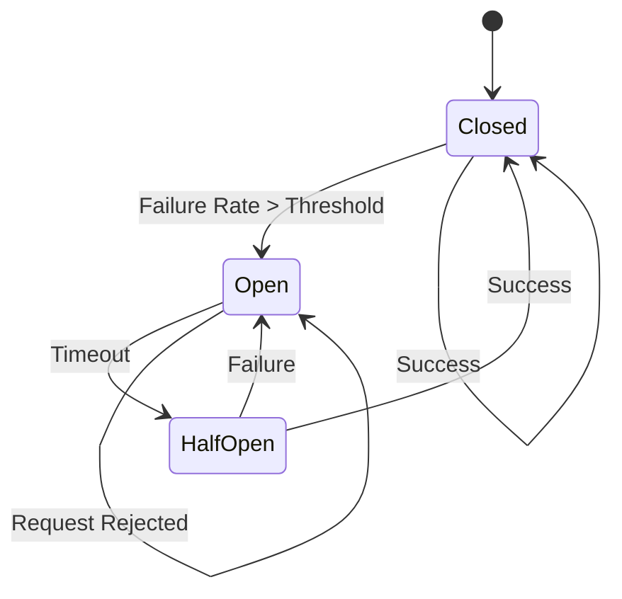
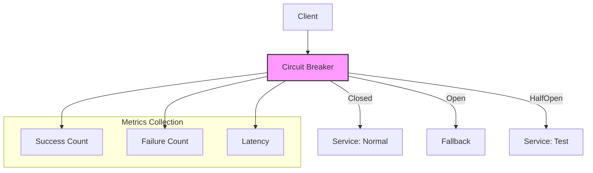
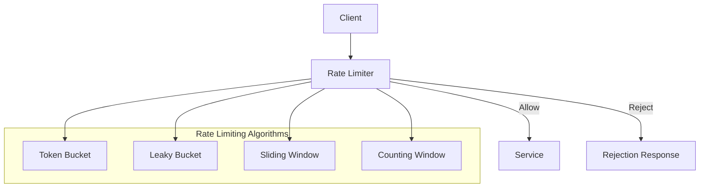
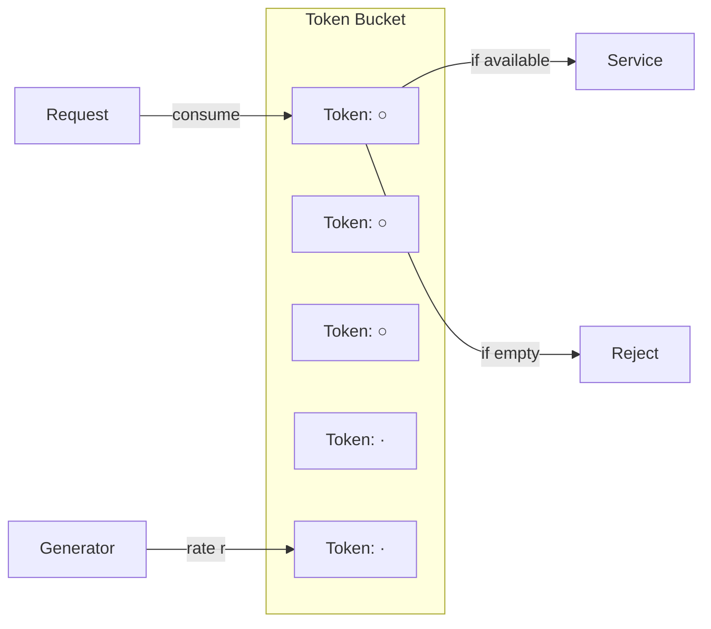

# 02.3 熔断与限流

---

📌 **内容摘要**

本文档深入探讨熔断与限流的核心原理和关键方法。内容涵盖微服务架构领域的主要知识点，包括服务发现, 一致性, 分布式, 共识算法等关键主题。适合有一定基础的学习者系统学习。

**关键词**: 服务发现, 一致性, 分布式, 共识算法, 微服务架构, 分布式系统, 微服务

📚 **学习目标**
- 掌握熔断与限流的核心概念和主要方法
- 理解相关理论的应用场景
- 建立该领域的系统性知识框架

🎯 **难度级别**: 中级

⏱️ **预计阅读时间**: 15分钟

**前置知识**: 相关领域的基础概念

---


## 02.3.1 概述

熔断与限流是微服务架构中的故障隔离和流量控制机制，确保系统在异常情况下保持稳定。

> **交叉引用**: 与 [02.1 微服务形式化模型](./02.1_微服务形式化模型.md)、[02.2 服务发现与负载均衡](./02.2_服务发现与负载均衡.md) 共同构成微服务体系。

---

## 02.3.2 故障模型形式化

### 02.3.2.1 形式化定义

**定义 02.3.1** (故障类型). 分布式系统中的故障类型 $F$：
$$F \in \{crash, omission, timing, byzantine\}$$

- Crash: 节点停止响应
- Omission: 消息丢失
- Timing: 超时
- Byzantine: 任意故障

**定义 02.3.2** (级联故障). 级联故障 $CF$ 是故障的传播：
$$CF(s_1, s_2) \iff fail(s_1) \Rightarrow overload(s_2) \Rightarrow fail(s_2)$$

**定义 02.3.3** (雪崩效应). 雪崩效应是级联故障的扩展：
$$Avalanche = \{s_1, s_2, ..., s_n\} \text{ 其中 } \forall i > 1: CF(s_{i-1}, s_i)$$

### 02.3.2.2 形式化定理

**定理 02.3.1** (故障传播上界). 对于具有熔断机制的系统，故障传播深度有界：
$$depth(CF) \leq k$$
其中 $k$ 为熔断触发深度。

**定理 02.3.2** (超时幂等性). 若操作 $op$ 是幂等的，则：
$$timeout(op) \Rightarrow retry(op) \text{ is safe}$$

---

## 02.3.3 熔断器模式形式化

### 02.3.3.1 形式化定义

**定义 02.3.4** (熔断器). 熔断器 $CB$ 是一个有限状态机：
$$CB = (S, s_0, \Sigma, \delta)$$
其中：

- $S = \{Closed, Open, HalfOpen\}$
- $s_0 = Closed$
- $\Sigma = \{success, failure, timeout\}$
- $\delta: S \times \Sigma \to S$

**定义 02.3.5** (状态转移). 状态转移函数：
$$\delta(s, e) = \begin{cases}
Open & s = Closed \land failureRate > threshold \\
HalfOpen & s = Open \land timeout_{recovery} \\
Closed & s = HalfOpen \land success \\
Open & s = HalfOpen \land failure \\
s & otherwise
\end{cases}$$

**定义 02.3.6** (失败率计算). 失败率 $FR$：
$$FR = \frac{\#failures}{\#requests} \times 100\%$$
在滑动窗口 $W$ 内计算。

### 02.3.3.2 形式化定理

**定理 02.3.3** (熔断保护). 当熔断器处于 $Open$ 状态时：
$$\forall req: CB(req) = reject \Rightarrow \neg overload(downstream)$$

**定理 02.3.4** (自动恢复). 熔断器最终恢复：
$$CB = Open \Rightarrow \Diamond CB \in \{HalfOpen, Closed\}$$

### 02.3.3.3 架构图





### 02.3.3.4 代码示例

**Rust 实现：**

```rust
use std::sync::atomic::{AtomicU64, Ordering};
use std::sync::Arc;
use std::time::{Duration, Instant};
use tokio::sync::RwLock;

# [derive(Clone, Copy, Debug, PartialEq)]
pub enum CircuitState {
    Closed,      // 正常状态
    Open,        // 熔断状态
    HalfOpen,    // 半开状态
}

pub struct CircuitBreaker {
    config: CircuitConfig,
    state: Arc<RwLock<CircuitState>>,
    metrics: Arc<Metrics>,
    last_failure_time: Arc<RwLock<Option<Instant>>>,
    half_open_requests: Arc<AtomicU64>,
}

# [derive(Clone)]
pub struct CircuitConfig {
    pub failure_threshold: u32,
    pub success_threshold: u32,
    pub timeout_duration: Duration,
    pub recovery_timeout: Duration,
    pub half_open_max_requests: u64,
}

struct Metrics {
    failures: AtomicU64,
    successes: AtomicU64,
    consecutive_successes: AtomicU64,
    consecutive_failures: AtomicU64,
}

impl CircuitBreaker {
    pub fn new(config: CircuitConfig) -> Self {
        Self {
            config,
            state: Arc::new(RwLock::new(CircuitState::Closed)),
            metrics: Arc::new(Metrics {
                failures: AtomicU64::new(0),
                successes: AtomicU64::new(0),
                consecutive_successes: AtomicU64::new(0),
                consecutive_failures: AtomicU64::new(0),
            }),
            last_failure_time: Arc::new(RwLock::new(None)),
            half_open_requests: Arc::new(AtomicU64::new(0)),
        }
    }

    pub async fn execute<F, T>(&self, operation: F) -> Result<T, CircuitError>
    where
        F: FnOnce() -> Result<T, Box<dyn std::error::Error>>,
    {
        // 检查当前状态
        let state = *self.state.read().await;

        match state {
            CircuitState::Open => {
                // 检查是否到达恢复时间
                let last_failure = *self.last_failure_time.read().await;
                if let Some(time) = last_failure {
                    if time.elapsed() >= self.config.recovery_timeout {
                        *self.state.write().await = CircuitState::HalfOpen;
                        self.half_open_requests.store(0, Ordering::SeqCst);
                    } else {
                        return Err(CircuitError::CircuitOpen);
                    }
                }

                // 半开状态
                let half_open_count = self.half_open_requests.fetch_add(1, Ordering::SeqCst);
                if half_open_count >= self.config.half_open_max_requests {
                    return Err(CircuitError::TooManyHalfOpenRequests);
                }

                self.try_operation(operation).await
            }
            CircuitState::HalfOpen => {
                let half_open_count = self.half_open_requests.fetch_add(1, Ordering::SeqCst);
                if half_open_count >= self.config.half_open_max_requests {
                    return Err(CircuitError::TooManyHalfOpenRequests);
                }

                self.try_operation(operation).await
            }
            CircuitState::Closed => {
                self.try_operation(operation).await
            }
        }
    }

    async fn try_operation<F, T>(&self, operation: F) -> Result<T, CircuitError>
    where
        F: FnOnce() -> Result<T, Box<dyn std::error::Error>>,
    {
        let result = tokio::time::timeout(self.config.timeout_duration, async {
            operation()
        }).await;

        match result {
            Ok(Ok(value)) => {
                self.on_success().await;
                Ok(value)
            }
            Ok(Err(_)) | Err(_) => {
                self.on_failure().await;
                Err(CircuitError::OperationFailed)
            }
        }
    }

    async fn on_success(&self) {
        self.metrics.successes.fetch_add(1, Ordering::SeqCst);
        let consecutive = self.metrics.consecutive_successes.fetch_add(1, Ordering::SeqCst) + 1;

        let state = *self.state.read().await;
        if state == CircuitState::HalfOpen && consecutive >= self.config.success_threshold {
            *self.state.write().await = CircuitState::Closed;
            self.reset_metrics();
        }

        self.metrics.consecutive_failures.store(0, Ordering::SeqCst);
    }

    async fn on_failure(&self) {
        self.metrics.failures.fetch_add(1, Ordering::SeqCst);
        let consecutive = self.metrics.consecutive_failures.fetch_add(1, Ordering::SeqCst) + 1;

        *self.last_failure_time.write().await = Some(Instant::now());

        let state = *self.state.read().await;
        if (state == CircuitState::Closed && consecutive >= self.config.failure_threshold) ||
           (state == CircuitState::HalfOpen) {
            *self.state.write().await = CircuitState::Open;
            self.reset_metrics();
        }

        self.metrics.consecutive_successes.store(0, Ordering::SeqCst);
    }

    fn reset_metrics(&self) {
        self.metrics.consecutive_successes.store(0, Ordering::SeqCst);
        self.metrics.consecutive_failures.store(0, Ordering::SeqCst);
        self.half_open_requests.store(0, Ordering::SeqCst);
    }

    pub async fn get_state(&self) -> CircuitState {
        *self.state.read().await
    }
}

# [derive(Debug)]
pub enum CircuitError {
    CircuitOpen,
    TooManyHalfOpenRequests,
    OperationFailed,
}

impl std::fmt::Display for CircuitError {
    fn fmt(&self, f: &mut std::fmt::Formatter<'_>) -> std::fmt::Result {
        match self {
            CircuitError::CircuitOpen => write!(f, "Circuit breaker is open"),
            CircuitError::TooManyHalfOpenRequests => write!(f, "Too many half-open requests"),
            CircuitError::OperationFailed => write!(f, "Operation failed"),
        }
    }
}

impl std::error::Error for CircuitError {}
```

**Java 实现：**

```java
import io.github.resilience4j.circuitbreaker.*;
import io.github.resilience4j.circuitbreaker.annotation.CircuitBreaker;
import org.springframework.stereotype.Service;
import java.time.Duration;

@Service
public class CircuitBreakerService {

    private final CircuitBreakerRegistry circuitBreakerRegistry;

    public CircuitBreakerService() {
        CircuitBreakerConfig config = CircuitBreakerConfig.custom()
            .failureRateThreshold(50)
            .slowCallRateThreshold(50)
            .slowCallDurationThreshold(Duration.ofSeconds(2))
            .permittedNumberOfCallsInHalfOpenState(3)
            .slidingWindowSize(10)
            .waitDurationInOpenState(Duration.ofSeconds(10))
            .build();

        this.circuitBreakerRegistry = CircuitBreakerRegistry.of(config);
    }

    @CircuitBreaker(name = "serviceA", fallbackMethod = "fallback")
    public String callService() {
        // 调用下游服务
        return restTemplate.getForObject("http://service-a/api", String.class);
    }

    public String fallback(Throwable t) {
        return "Fallback response";
    }

    // 编程式使用
    public <T> T executeWithCircuitBreaker(String name, Supplier<T> operation) {
        CircuitBreaker cb = circuitBreakerRegistry.circuitBreaker(name);

        return Decorators.ofSupplier(operation)
            .withCircuitBreaker(cb)
            .withFallback(Arrays.asList(CallNotPermittedException.class),
                e -> getFallback())
            .get();
    }

    private <T> T getFallback() {
        return (T) "Fallback";
    }
}
```

---

## 02.3.4 流量控制形式化

### 02.3.4.1 形式化定义

**定义 02.3.7** (限流器). 限流器 $RL$ 限制请求速率：
$$RL: Request \times Time \to \{allow, reject\}$$

**定义 02.3.8** (令牌桶). 令牌桶算法：
- 桶容量 $C$
- 令牌生成速率 $r$ tokens/second
- 请求消耗 $c$ tokens

$$allow(req) \iff bucket \geq c \Rightarrow bucket := bucket - c$$

**定义 02.3.9** (漏桶). 漏桶算法：
- 桶容量 $C$
- 漏水速率 $r$ requests/second

$$allow(req) \iff queue.size < C \Rightarrow queue.enqueue(req)$$

**定义 02.3.10** (滑动窗口). 滑动窗口计数：
$$count(t, \Delta t) = \sum_{t - \Delta t}^{t} requests_i$$
$$allow(req) \iff count(t, \Delta t) < limit$$

### 02.3.4.2 形式化定理

**定理 02.3.5** (令牌桶速率保证). 令牌桶保证长期平均速率不超过 $r$：
$$\lim_{T \to \infty} \frac{\#allowed}{T} \leq r$$

**定理 02.3.6** (突发容量). 令牌桶允许突发流量：
$$burst_{max} = C$$

### 02.3.4.3 架构图





### 02.3.4.4 代码示例

**Rust 实现：**

```rust
use std::sync::atomic::{AtomicU64, Ordering};
use std::sync::Arc;
use std::time::{Duration, Instant};
use tokio::sync::Mutex;
use dashmap::DashMap;

// 令牌桶限流器
pub struct TokenBucket {
    capacity: u64,
    tokens: Arc<Mutex<f64>>,
    rate: f64, // tokens per second
    last_update: Arc<Mutex<Instant>>,
}

impl TokenBucket {
    pub fn new(capacity: u64, rate: f64) -> Self {
        Self {
            capacity,
            tokens: Arc::new(Mutex::new(capacity as f64)),
            rate,
            last_update: Arc::new(Mutex::new(Instant::now())),
        }
    }

    pub async fn allow(&self, tokens: u64) -> bool {
        let mut current_tokens = self.tokens.lock().await;
        let mut last_update = self.last_update.lock().await;

        // 计算新令牌
        let now = Instant::now();
        let elapsed = now.duration_since(*last_update).as_secs_f64();
        *current_tokens = (*current_tokens + elapsed * self.rate)
            .min(self.capacity as f64);
        *last_update = now;

        // 检查是否足够
        if *current_tokens >= tokens as f64 {
            *current_tokens -= tokens as f64;
            true
        } else {
            false
        }
    }
}

// 滑动窗口限流器
pub struct SlidingWindow {
    window_size: Duration,
    limit: u64,
    requests: Arc<Mutex<Vec<Instant>>>,
}

impl SlidingWindow {
    pub fn new(window_size: Duration, limit: u64) -> Self {
        Self {
            window_size,
            limit,
            requests: Arc::new(Mutex::new(Vec::new())),
        }
    }

    pub async fn allow(&self) -> bool {
        let mut requests = self.requests.lock().await;
        let now = Instant::now();

        // 移除过期的请求记录
        requests.retain(|&t| now.duration_since(t) < self.window_size);

        // 检查是否超过限制
        if requests.len() < self.limit as usize {
            requests.push(now);
            true
        } else {
            false
        }
    }
}

// 分布式限流器（基于 Redis）
pub struct DistributedRateLimiter {
    redis: Arc<redis::aio::Connection>,
    key_prefix: String,
}

impl DistributedRateLimiter {
    pub async fn allow(&self, key: &str, limit: u64, window_secs: u64) -> Result<bool, redis::RedisError> {
        let full_key = format!("{}:{}", self.key_prefix, key);
        let mut conn = self.redis.clone();

        let script = r#"
            local key = KEYS[1]
            local limit = tonumber(ARGV[1])
            local window = tonumber(ARGV[2])

            local current = redis.call('GET', key)
            if current == false then
                redis.call('SET', key, 1, 'EX', window)
                return 1
            end

            current = tonumber(current)
            if current < limit then
                redis.call('INCR', key)
                return 1
            else
                return 0
            end
        "#;

        let result: i32 = redis::Script::new(script)
            .key(&full_key)
            .arg(limit)
            .arg(window_secs)
            .invoke_async(&mut conn)
            .await?;

        Ok(result == 1)
    }
}

// 多层限流器
pub struct MultiTierRateLimiter {
    global: Arc<TokenBucket>,
    per_user: DashMap<String, Arc<TokenBucket>>,
    per_endpoint: DashMap<String, Arc<SlidingWindow>>,
}

impl MultiTierRateLimiter {
    pub fn new(global_capacity: u64, global_rate: f64) -> Self {
        Self {
            global: Arc::new(TokenBucket::new(global_capacity, global_rate)),
            per_user: DashMap::new(),
            per_endpoint: DashMap::new(),
        }
    }

    pub async fn allow(&self, user_id: &str, endpoint: &str) -> bool {
        // 检查全局限制
        if !self.global.allow(1).await {
            return false;
        }

        // 检查用户级别限制
        let user_limiter = self.per_user.entry(user_id.to_string())
            .or_insert_with(|| Arc::new(TokenBucket::new(100, 10.0)));
        if !user_limiter.allow(1).await {
            return false;
        }

        // 检查端点级别限制
        let endpoint_limiter = self.per_endpoint.entry(endpoint.to_string())
            .or_insert_with(|| Arc::new(SlidingWindow::new(Duration::from_secs(60), 1000)));
        if !endpoint_limiter.allow().await {
            return false;
        }

        true
    }
}
```

**Java 实现：**

```java
import com.google.common.util.concurrent.RateLimiter;
import io.github.resilience4j.ratelimiter.RateLimiterConfig;
import io.github.resilience4j.ratelimiter.RateLimiterRegistry;
import org.springframework.stereotype.Service;
import java.time.Duration;

@Service
public class RateLimitingService {

    private final RateLimiterRegistry rateLimiterRegistry;

    public RateLimitingService() {
        RateLimiterConfig config = RateLimiterConfig.custom()
            .limitForPeriod(100)
            .limitRefreshPeriod(Duration.ofSeconds(1))
            .timeoutDuration(Duration.ofMillis(100))
            .build();

        this.rateLimiterRegistry = RateLimiterRegistry.of(config);
    }

    // Guava 令牌桶
    public void guavaRateLimit() {
        RateLimiter rateLimiter = RateLimiter.create(10.0); // 每秒10个许可

        if (rateLimiter.tryAcquire()) {
            // 处理请求
        } else {
            // 限流拒绝
        }
    }

    // Resilience4j
    @io.github.resilience4j.ratelimiter.annotation.RateLimiter(name = "api")
    public String rateLimitedOperation() {
        return "Success";
    }

    // 自定义滑动窗口
    public class SlidingWindowRateLimiter {
        private final long windowSizeMs;
        private final int limit;
        private final Queue<Long> timestamps = new ConcurrentLinkedQueue<>();

        public synchronized boolean allow() {
            long now = System.currentTimeMillis();
            long windowStart = now - windowSizeMs;

            // 移除过期时间戳
            timestamps.removeIf(t -> t < windowStart);

            if (timestamps.size() < limit) {
                timestamps.offer(now);
                return true;
            }
            return false;
        }
    }

    // Redis 分布式限流
    @Autowired
    private StringRedisTemplate redisTemplate;

    public boolean distributedRateLimit(String key, int limit, int windowSeconds) {
        String redisKey = "rate_limit:" + key;

        Long current = redisTemplate.opsForValue().increment(redisKey);
        if (current == 1) {
            redisTemplate.expire(redisKey, windowSeconds, TimeUnit.SECONDS);
        }

        return current <= limit;
    }
}
```

---

## 02.3.5 总结

| 机制 | 目的 | 触发条件 | 恢复策略 |
|------|------|---------|---------|
| 熔断 | 防止级联故障 | 失败率阈值 | 超时自动恢复 |
| 限流 | 保护服务容量 | 请求速率 | 拒绝或排队 |

> **交叉引用**: 熔断与限流的监控指标请参考 [02.4 可观测性](./02.4_可观测性.md)。
---

## 📚 延伸阅读

- [02.4 可观测性](../02_微服务架构/02.4_可观测性.md)
- [02.1 微服务形式化模型](../02_微服务架构/02.1_微服务形式化模型.md)
- [02.1 微服务设计原则](../02_微服务架构/02.1_微服务设计原则.md)
- [02.2 服务发现与注册](../02_微服务架构/02.2_服务发现与注册.md)
- [02.2 服务发现与负载均衡](../02_微服务架构/02.2_服务发现与负载均衡.md)
