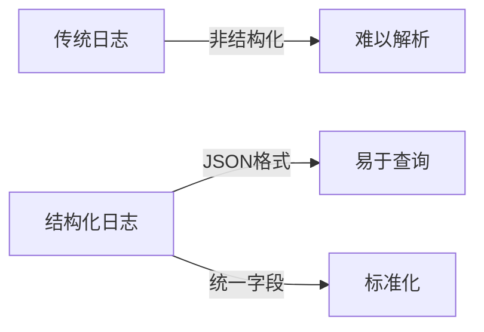
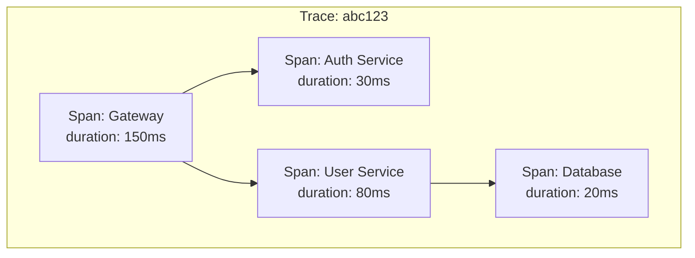
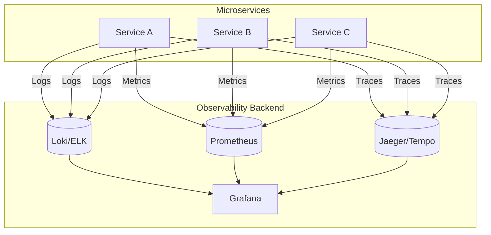

# 02.4 可观测性

## 目录

- [02.4 可观测性](#024-可观测性)
  - [目录](#目录)
  - [1. 概述](#1-概述)
  - [2. 日志 (Logging)](#2-日志-logging)
    - [2.1 结构化日志](#21-结构化日志)
    - [2.2 分布式追踪关联](#22-分布式追踪关联)
    - [2.3 Rust 实现](#23-rust-实现)
    - [2.4 Go 实现](#24-go-实现)
  - [3. 指标 (Metrics)](#3-指标-metrics)
    - [3.1 指标类型](#31-指标类型)
    - [3.2 Prometheus 集成](#32-prometheus-集成)
  - [4. 分布式追踪 (Tracing)](#4-分布式追踪-tracing)
    - [4.1 追踪模型](#41-追踪模型)
    - [4.2 OpenTelemetry 实现](#42-opentelemetry-实现)
  - [5. OpenTelemetry 完整集成](#5-opentelemetry-完整集成)
  - [6. 架构图](#6-架构图)
  - [7. 相关文档](#7-相关文档)

## 1. 概述

可观测性是通过系统的外部输出（日志、指标、追踪）理解系统内部状态的能力。在微服务架构中，可观测性尤为重要。

**三大支柱**：

- **日志 (Logs)**：离散事件记录
- **指标 (Metrics)**：聚合的数值数据
- **追踪 (Traces)**：请求链路追踪

## 2. 日志 (Logging)

### 2.1 结构化日志



**标准字段**：

```json
{
  "timestamp": "2024-01-15T10:30:00Z",
  "level": "INFO",
  "service": "user-service",
  "trace_id": "abc123",
  "span_id": "def456",
  "message": "User created",
  "user_id": "12345",
  "duration_ms": 45
}
```

### 2.2 分布式追踪关联

```
日志关联公式：
CorrelationID = TraceID + SpanID + ParentSpanID

完整链路：
Client → Gateway → Service A → Service B → Database
   │        │          │          │         │
   └────────┴──────────┴──────────┴─────────┘
              TraceID: abc123
```

### 2.3 Rust 实现

```rust
use tracing::{info, error, warn, debug, span, Level};
use tracing_subscriber::{layer::SubscriberExt, util::SubscriberInitExt};
use serde_json::json;

pub fn init_logging() {
    tracing_subscriber::registry()
        .with(
            tracing_subscriber::EnvFilter::try_from_default_env()
                .unwrap_or_else(|_| "info".into()),
        )
        .with(tracing_subscriber::fmt::layer().json())
        .init();
}

pub struct Logger;

impl Logger {
    pub fn info(service: &str, trace_id: &str, message: &str, extra: serde_json::Value) {
        info!(
            service = service,
            trace_id = trace_id,
            message = message,
            extra = %extra,
            "INFO"
        );
    }

    pub fn error(service: &str, trace_id: &str, error: &dyn std::error::Error, context: &str) {
        error!(
            service = service,
            trace_id = trace_id,
            error = %error,
            context = context,
            "ERROR"
        );
    }
}

// 使用示例
async fn create_user(trace_id: &str, user_data: &UserData) -> Result<User, Error> {
    let span = span!(Level::INFO, "create_user", trace_id = trace_id);
    let _enter = span.enter();

    info!(
        event = "user_creation_started",
        email = user_data.email,
        "Starting user creation"
    );

    match db_insert_user(user_data).await {
        Ok(user) => {
            info!(
                event = "user_created",
                user_id = user.id,
                "User created successfully"
            );
            Ok(user)
        }
        Err(e) => {
            error!(
                event = "user_creation_failed",
                error = %e,
                "Failed to create user"
            );
            Err(e)
        }
    }
}
```

### 2.4 Go 实现

```go
package main

import (
    "os"

    "github.com/rs/zerolog"
    "github.com/rs/zerolog/log"
)

func init() {
    // 配置结构化日志
    zerolog.TimeFieldFormat = zerolog.TimeFormatUnix
    log.Logger = log.Output(zerolog.ConsoleWriter{
        Out:        os.Stdout,
        TimeFormat: "2006-01-02 15:04:05",
    })
}

type Logger struct {
    logger zerolog.Logger
}

func NewLogger(service string) *Logger {
    return &Logger{
        logger: log.With().
            Str("service", service).
            Logger(),
    }
}

func (l *Logger) Info(traceID string, msg string, fields map[string]interface{}) {
    event := l.logger.Info().
        Str("trace_id", traceID).
        Str("message", msg)

    for k, v := range fields {
        event = event.Interface(k, v)
    }

    event.Msg("")
}

func (l *Logger) Error(traceID string, err error, context string) {
    l.logger.Error().
        Str("trace_id", traceID).
        Err(err).
        Str("context", context).
        Msg("")
}

// 使用示例
func CreateUser(traceID string, userData *UserData) (*User, error) {
    logger := NewLogger("user-service")

    logger.Info(traceID, "user_creation_started", map[string]interface{}{
        "email": userData.Email,
    })

    user, err := dbInsertUser(userData)
    if err != nil {
        logger.Error(traceID, err, "failed_to_create_user")
        return nil, err
    }

    logger.Info(traceID, "user_created", map[string]interface{}{
        "user_id": user.ID,
    })

    return user, nil
}
```

## 3. 指标 (Metrics)

### 3.1 指标类型

| 类型 | 描述 | 示例 |
|------|------|------|
| Counter | 单调递增计数器 | 请求总数 |
| Gauge | 可增可减的数值 | 当前连接数 |
| Histogram | 采样分布 | 请求延迟分布 |
| Summary | 滑动时间窗口统计 | P99 延迟 |

### 3.2 Prometheus 集成

```rust
use prometheus::{Counter, Gauge, Histogram, Registry, Encoder, TextEncoder};
use prometheus::{register_counter, register_gauge, register_histogram};
use std::time::Instant;

pub struct Metrics {
    pub requests_total: Counter,
    pub active_connections: Gauge,
    pub request_duration: Histogram,
    pub error_rate: Counter,
}

impl Metrics {
    pub fn new() -> Result<Self, prometheus::Error> {
        let requests_total = register_counter!(
            "http_requests_total",
            "Total number of HTTP requests",
            &["method", "status", "path"]
        )?;

        let active_connections = register_gauge!(
            "active_connections",
            "Number of active connections"
        )?;

        let request_duration = register_histogram!(
            "http_request_duration_seconds",
            "HTTP request duration in seconds",
            vec![0.005, 0.01, 0.025, 0.05, 0.1, 0.25, 0.5, 1.0, 2.5, 5.0, 10.0]
        )?;

        let error_rate = register_counter!(
            "http_errors_total",
            "Total number of HTTP errors",
            &["type"]
        )?;

        Ok(Self {
            requests_total,
            active_connections,
            request_duration,
            error_rate,
        })
    }

    pub fn record_request(&self, method: &str, status: u16, path: &str, duration: f64) {
        let status_str = status.to_string();
        self.requests_total
            .with_label_values(&[method, &status_str, path])
            .inc();
        self.request_duration.observe(duration);
    }
}

// Axum 中间件
use axum::{
    middleware::Next,
    response::Response,
    extract::Request,
};

pub async fn metrics_middleware(
    request: Request,
    next: Next,
) -> Response {
    let start = Instant::now();
    let method = request.method().to_string();
    let path = request.uri().path().to_string();

    let response = next.run(request).await;

    let duration = start.elapsed().as_secs_f64();
    let status = response.status().as_u16();

    // 记录指标
    METRICS.record_request(&method, status, &path, duration);

    response
}
```

## 4. 分布式追踪 (Tracing)

### 4.1 追踪模型



**Span 结构**：

```
Span {
    trace_id:     16 bytes
    span_id:      8 bytes
    parent_id:    8 bytes (optional)
    name:         string
    start_time:   timestamp
    end_time:     timestamp
    attributes:   map<string, any>
    events:       []Event
    status:       Status
}
```

### 4.2 OpenTelemetry 实现

```rust
use opentelemetry::{
    global,
    trace::{TraceContextExt, Tracer},
    Context, KeyValue,
};
use opentelemetry_otlp::WithExportConfig;
use opentelemetry_sdk::trace::TracerProvider;
use std::time::Duration;

pub fn init_tracer() -> Result<TracerProvider, Box<dyn std::error::Error>> {
    let exporter = opentelemetry_otlp::SpanExporter::builder()
        .with_tonic()
        .with_endpoint("http://localhost:4317")
        .with_timeout(Duration::from_secs(3))
        .build()?;

    let provider = TracerProvider::builder()
        .with_batch_exporter(exporter)
        .with_resource(opentelemetry_sdk::Resource::new(vec![
            KeyValue::new("service.name", "user-service"),
            KeyValue::new("service.version", "1.0.0"),
        ]))
        .build();

    global::set_tracer_provider(provider.clone());

    Ok(provider)
}

// 在应用中使用
pub async fn handle_request(ctx: Context) {
    let tracer = global::tracer("user-service");

    let span = tracer
        .span_builder("handle_request")
        .with_attributes(vec![
            KeyValue::new("http.method", "GET"),
            KeyValue::new("http.path", "/api/users"),
        ])
        .start(&tracer);

    let cx = Context::current_with_span(span);

    // 在 span 上下文中执行操作
    cx.span().add_event("Processing started", vec![]);

    // 嵌套 span
    {
        let inner_span = tracer.start_with_context("database_query", &cx);
        // 数据库操作
        inner_span.end();
    }

    cx.span().add_event("Processing completed", vec![
        KeyValue::new("result", "success"),
    ]);
}
```

## 5. OpenTelemetry 完整集成

```rust
use opentelemetry::global;
use opentelemetry_otlp::{ExportConfig, Protocol, WithExportConfig};
use opentelemetry_sdk::{
    propagation::TraceContextPropagator,
    runtime,
    trace::{self, RandomIdGenerator, Sampler},
    Resource,
};
use tracing::{Subscriber, subscriber::set_global_default};
use tracing_bunyan_formatter::{BunyanFormattingLayer, JsonStorageLayer};
use tracing_opentelemetry::OpenTelemetryLayer;
use tracing_subscriber::{layer::SubscriberExt, EnvFilter, Registry};

pub struct Observability;

impl Observability {
    pub fn init(service_name: &str) -> Result<(), Box<dyn std::error::Error>> {
        // 设置全局传播器
        global::set_text_map_propagator(TraceContextPropagator::new());

        // 初始化 Tracer
        let tracer = Self::init_tracer(service_name)?;

        // 初始化 Logger
        Self::init_logger(service_name, tracer)?;

        Ok(())
    }

    fn init_tracer(service_name: &str) -> Result<trace::Tracer, Box<dyn std::error::Error>> {
        let export_config = ExportConfig {
            endpoint: "http://localhost:4317".to_string(),
            protocol: Protocol::Grpc,
            timeout: Duration::from_secs(3),
        };

        let provider = trace::TracerProvider::builder()
            .with_batch_exporter(
                opentelemetry_otlp::SpanExporter::builder()
                    .with_tonic()
                    .with_export_config(export_config)
                    .build()?,
                runtime::Tokio,
            )
            .with_config(
                trace::Config::default()
                    .with_sampler(Sampler::AlwaysOn)
                    .with_id_generator(RandomIdGenerator::default())
                    .with_resource(Resource::new(vec![
                        opentelemetry::KeyValue::new("service.name", service_name.to_string()),
                    ])),
            )
            .build();

        let tracer = provider.tracer(service_name);
        global::set_tracer_provider(provider);

        Ok(tracer)
    }

    fn init_logger(
        service_name: &str,
        tracer: trace::Tracer,
    ) -> Result<(), Box<dyn std::error::Error>> {
        let formatting_layer = BunyanFormattingLayer::new(
            service_name.to_string(),
            std::io::stdout,
        );

        let subscriber = Registry::default()
            .with(EnvFilter::new("info"))
            .with(JsonStorageLayer)
            .with(formatting_layer)
            .with(OpenTelemetryLayer::new(tracer));

        set_global_default(subscriber)?;

        Ok(())
    }
}

// 关闭清理
pub fn shutdown() {
    global::shutdown_tracer_provider();
}
```

## 6. 架构图



## 7. 相关文档

- [02.1_微服务设计原则](./02.1_微服务设计原则.md) - 服务设计基础
- [02.3_API网关](./02.3_API网关.md) - 网关层可观测性
- [03_工作流系统](../03_工作流系统/) - 工作流追踪
