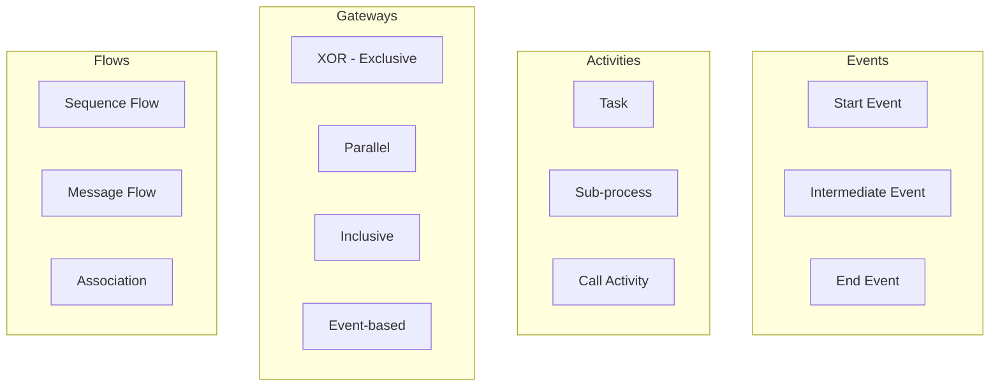
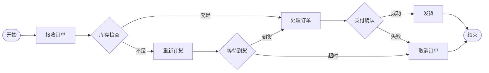
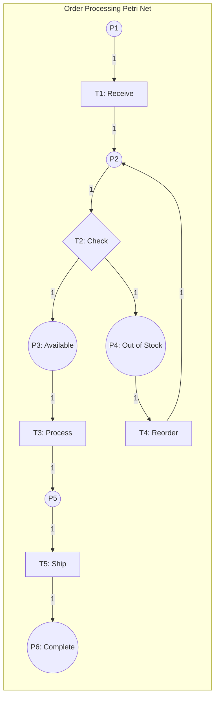

# 03.1 工作流基础

---

📌 **内容摘要**

本文档系统介绍工作流的基础理论和核心概念。内容涵盖工作流系统领域的主要知识点，包括工作流, BPMN, 编排等关键主题。适合初学者建立基础知识体系。

**关键词**: 工作流, BPMN, 编排, 工作流系统

📚 **学习目标**
- 理解工作流的基本概念和核心原理
- 掌握相关术语和符号表示
- 建立该领域的系统性知识框架

🎯 **难度级别**: 初级

⏱️ **预计阅读时间**: 15分钟

**前置知识**: 基础数学知识

---


## 目录

- [03.1 工作流基础](#031-工作流基础)
  - [目录](#目录)
  - [1. 概述](#1-概述)
  - [2. BPMN (Business Process Model and Notation)](#2-bpmn-business-process-model-and-notation)
    - [2.1 核心元素](#21-核心元素)
    - [2.2 流程示例](#22-流程示例)
    - [2.3 XML 表示](#23-xml-表示)
  - [3. 状态机 (State Machine)](#3-状态机-state-machine)
    - [3.1 形式化定义](#31-形式化定义)
    - [3.2 Rust 实现](#32-rust-实现)
    - [3.3 Go 实现](#33-go-实现)
  - [4. Petri 网](#4-petri-网)
    - [4.1 形式化定义](#41-形式化定义)
    - [4.2 建模能力](#42-建模能力)
  - [5. 工作流对比](#5-工作流对比)
  - [6. 相关文档](#6-相关文档)

## 1. 概述

工作流系统用于定义、执行和管理业务流程。选择合适的建模方法对工作流系统的成功至关重要。

**主流建模方法**：

- **BPMN**：业务流程建模标准，可视化友好
- **状态机**：适用于事件驱动的流程
- **Petri 网**：数学基础严谨，适合复杂并发分析

## 2. BPMN (Business Process Model and Notation)

### 2.1 核心元素



**符号说明**：

| 元素 | 图形 | 用途 |
|------|------|------|
| 开始事件 | ◯ | 流程起点 |
| 结束事件 | ◉ | 流程终点 |
| 任务 | ▭ | 执行的工作 |
| 网关 | ◇ | 分支/合并 |
| 池 | ▭▭ | 组织边界 |
| 泳道 | ▭ | 角色/部门 |

### 2.2 流程示例



### 2.3 XML 表示

```xml
<?xml version="1.0" encoding="UTF-8"?>
<bpmn:definitions xmlns:bpmn="http://www.omg.org/spec/BPMN/20100524/MODEL"
                  id="Definitions_1"
                  targetNamespace="http://bpmn.io/schema/bpmn">

  <bpmn:process id="OrderProcess" isExecutable="true">

    <!-- 开始事件 -->
    <bpmn:startEvent id="StartEvent_1" name="开始">
      <bpmn:outgoing>Flow_1</bpmn:outgoing>
    </bpmn:startEvent>

    <!-- 用户任务：接收订单 -->
    <bpmn:userTask id="ReceiveOrder" name="接收订单">
      <bpmn:incoming>Flow_1</bpmn:incoming>
      <bpmn:outgoing>Flow_2</bpmn:outgoing>
    </bpmn:userTask>

    <!-- 排他网关：库存检查 -->
    <bpmn:exclusiveGateway id="CheckStock" name="库存充足？">
      <bpmn:incoming>Flow_2</bpmn:incoming>
      <bpmn:outgoing>Flow_3</bpmn:outgoing>
      <bpmn:outgoing>Flow_4</bpmn:outgoing>
    </bpmn:exclusiveGateway>

    <!-- 服务任务：处理订单 -->
    <bpmn:serviceTask id="ProcessOrder" name="处理订单"
                      camunda:class="com.example.ProcessOrderDelegate">
      <bpmn:incoming>Flow_3</bpmn:incoming>
      <bpmn:outgoing>Flow_5</bpmn:outgoing>
    </bpmn:serviceTask>

    <!-- 结束事件 -->
    <bpmn:endEvent id="EndEvent_1" name="结束">
      <bpmn:incoming>Flow_5</bpmn:incoming>
    </bpmn:endEvent>

    <!-- 流程连线 -->
    <bpmn:sequenceFlow id="Flow_1" sourceRef="StartEvent_1" targetRef="ReceiveOrder"/>
    <bpmn:sequenceFlow id="Flow_2" sourceRef="ReceiveOrder" targetRef="CheckStock"/>
    <bpmn:sequenceFlow id="Flow_3" name="是" sourceRef="CheckStock" targetRef="ProcessOrder">
      <bpmn:conditionExpression xsi:type="bpmn:tFormalExpression">
        ${stock >= orderQuantity}
      </bpmn:conditionExpression>
    </bpmn:sequenceFlow>

  </bpmn:process>
</bpmn:definitions>
```

## 3. 状态机 (State Machine)

### 3.1 形式化定义

有限状态机 (FSM) 定义为五元组：

$$M = (S, s_0, \Sigma, \delta, F)$$

其中：

- $S$：有限状态集合
- $s_0 \in S$：初始状态
- $\Sigma$：输入字母表（事件集合）
- $\delta: S \times \Sigma \rightarrow S$：状态转移函数
- $F \subseteq S$：终止状态集合

**状态转移**：
$$\delta(s, e) = s' \text{ where } s, s' \in S, e \in \Sigma$$

### 3.2 Rust 实现

```rust
use std::collections::HashMap;

// 状态定义
#[derive(Debug, Clone, PartialEq, Eq, Hash)]
pub enum OrderState {
    Created,
    PendingPayment,
    Paid,
    Processing,
    Shipped,
    Delivered,
    Cancelled,
}

// 事件定义
#[derive(Debug, Clone, PartialEq, Eq, Hash)]
pub enum OrderEvent {
    Submit,
    Pay,
    Process,
    Ship,
    Deliver,
    Cancel,
    Timeout,
}

// 状态机
pub struct StateMachine {
    current_state: OrderState,
    transitions: HashMap<(OrderState, OrderEvent), OrderState>,
    callbacks: HashMap<(OrderState, OrderEvent), Box<dyn Fn()>>,
}

impl StateMachine {
    pub fn new() -> Self {
        let mut sm = Self {
            current_state: OrderState::Created,
            transitions: HashMap::new(),
            callbacks: HashMap::new(),
        };
        sm.init_transitions();
        sm
    }

    fn init_transitions(&mut self) {
        // 定义状态转移
        self.transitions.insert((OrderState::Created, OrderEvent::Submit), OrderState::PendingPayment);
        self.transitions.insert((OrderState::PendingPayment, OrderEvent::Pay), OrderState::Paid);
        self.transitions.insert((OrderState::PendingPayment, OrderEvent::Timeout), OrderState::Cancelled);
        self.transitions.insert((OrderState::Paid, OrderEvent::Process), OrderState::Processing);
        self.transitions.insert((OrderState::Processing, OrderEvent::Ship), OrderState::Shipped);
        self.transitions.insert((OrderState::Shipped, OrderEvent::Deliver), OrderState::Delivered);

        // 取消可发生在多个状态
        for state in [OrderState::Created, OrderState::PendingPayment, OrderState::Paid] {
            self.transitions.insert((state.clone(), OrderEvent::Cancel), OrderState::Cancelled);
        }
    }

    pub fn trigger(&mut self, event: OrderEvent) -> Result<OrderState, String> {
        let key = (self.current_state.clone(), event);

        match self.transitions.get(&key) {
            Some(new_state) => {
                println!("Transition: {:?} --{:?}--> {:?}",
                    self.current_state, event, new_state);

                // 执行回调
                if let Some(callback) = self.callbacks.get(&key) {
                    callback();
                }

                self.current_state = new_state.clone();
                Ok(new_state.clone())
            }
            None => Err(format!(
                "Invalid transition from {:?} with event {:?}",
                self.current_state, event
            )),
        }
    }

    pub fn on_transition<F>(&mut self,
        from: OrderState,
        event: OrderEvent,
        callback: F
    ) where F: Fn() + 'static {
        self.callbacks.insert((from, event), Box::new(callback));
    }

    pub fn get_state(&self) -> &OrderState {
        &self.current_state
    }
}

fn main() {
    let mut sm = StateMachine::new();

    sm.on_transition(OrderState::Paid, OrderEvent::Process, || {
        println!("Sending notification: Order is being processed");
    });

    sm.trigger(OrderEvent::Submit).unwrap();
    sm.trigger(OrderEvent::Pay).unwrap();
    sm.trigger(OrderEvent::Process).unwrap();
    sm.trigger(OrderEvent::Ship).unwrap();
    sm.trigger(OrderEvent::Deliver).unwrap();

    println!("Final state: {:?}", sm.get_state());
}
```

### 3.3 Go 实现

```go
package main

import (
    "fmt"
)

// State type
type State string

const (
    StateCreated         State = "Created"
    StatePendingPayment  State = "PendingPayment"
    StatePaid            State = "Paid"
    StateProcessing      State = "Processing"
    StateShipped         State = "Shipped"
    StateDelivered       State = "Delivered"
    StateCancelled       State = "Cancelled"
)

// Event type
type Event string

const (
    EventSubmit   Event = "Submit"
    EventPay      Event = "Pay"
    EventProcess  Event = "Process"
    EventShip     Event = "Ship"
    EventDeliver  Event = "Deliver"
    EventCancel   Event = "Cancel"
    EventTimeout  Event = "Timeout"
)

// TransitionKey for map key
type TransitionKey struct {
    State State
    Event Event
}

// StateMachine struct
type StateMachine struct {
    currentState State
    transitions  map[TransitionKey]State
    callbacks    map[TransitionKey]func()
}

// NewStateMachine creates a new state machine
func NewStateMachine() *StateMachine {
    sm := &StateMachine{
        currentState: StateCreated,
        transitions:  make(map[TransitionKey]State),
        callbacks:    make(map[TransitionKey]func()),
    }
    sm.initTransitions()
    return sm
}

func (sm *StateMachine) initTransitions() {
    sm.transitions[TransitionKey{StateCreated, EventSubmit}] = StatePendingPayment
    sm.transitions[TransitionKey{StatePendingPayment, EventPay}] = StatePaid
    sm.transitions[TransitionKey{StatePendingPayment, EventTimeout}] = StateCancelled
    sm.transitions[TransitionKey{StatePaid, EventProcess}] = StateProcessing
    sm.transitions[TransitionKey{StateProcessing, EventShip}] = StateShipped
    sm.transitions[TransitionKey{StateShipped, EventDeliver}] = StateDelivered

    // Cancel from multiple states
    sm.transitions[TransitionKey{StateCreated, EventCancel}] = StateCancelled
    sm.transitions[TransitionKey{StatePendingPayment, EventCancel}] = StateCancelled
    sm.transitions[TransitionKey{StatePaid, EventCancel}] = StateCancelled
}

func (sm *StateMachine) Trigger(event Event) (State, error) {
    key := TransitionKey{sm.currentState, event}

    if newState, ok := sm.transitions[key]; ok {
        fmt.Printf("Transition: %s --%s--> %s\n", sm.currentState, event, newState)

        if callback, ok := sm.callbacks[key]; ok {
            callback()
        }

        sm.currentState = newState
        return newState, nil
    }

    return "", fmt.Errorf("invalid transition from %s with event %s", sm.currentState, event)
}

func (sm *StateMachine) OnTransition(from State, event Event, callback func()) {
    sm.callbacks[TransitionKey{from, event}] = callback
}

func (sm *StateMachine) GetState() State {
    return sm.currentState
}

func main() {
    sm := NewStateMachine()

    sm.OnTransition(StatePaid, EventProcess, func() {
        fmt.Println("Sending notification: Order is being processed")
    })

    sm.Trigger(EventSubmit)
    sm.Trigger(EventPay)
    sm.Trigger(EventProcess)
    sm.Trigger(EventShip)
    sm.Trigger(EventDeliver)

    fmt.Printf("Final state: %s\n", sm.GetState())
}
```

## 4. Petri 网

### 4.1 形式化定义

Petri 网定义为四元组：

$$PN = (P, T, F, M_0)$$

其中：

- $P = \{p_1, p_2, ..., p_m\}$：库所 (Place) 集合
- $T = \{t_1, t_2, ..., t_n\}$：变迁 (Transition) 集合
- $F \subseteq (P \times T) \cup (T \times P)$：弧关系
- $M_0: P \rightarrow \mathbb{N}$：初始标识

**变迁使能条件**：
$$\forall p \in \bullet t: M(p) \geq W(p, t)$$

**变迁触发**：
$$M'(p) = M(p) - W(p, t) + W(t, p)$$

### 4.2 建模能力



**分析特性**：

- **可达性**：从初始状态能否到达目标状态
- **有界性**：库所中令牌数量的上限
- **活性**：系统是否存在死锁
- **公平性**：各变迁触发机会的公平程度

## 5. 工作流对比

| 特性 | BPMN | 状态机 | Petri 网 |
|------|------|--------|----------|
| 可视化 | ⭐⭐⭐ | ⭐⭐ | ⭐⭐ |
| 表达能力 | ⭐⭐⭐ | ⭐⭐ | ⭐⭐⭐ |
| 执行效率 | ⭐⭐ | ⭐⭐⭐ | ⭐⭐ |
| 形式化验证 | ⭐⭐ | ⭐⭐⭐ | ⭐⭐⭐ |
| 并发支持 | ⭐⭐⭐ | ⭐⭐ | ⭐⭐⭐ |
| 学习曲线 | 中等 | 简单 | 陡峭 |

**选择建议**：

- **BPMN**：业务流程管理、需要业务人员参与的场景
- **状态机**：事件驱动、状态转换清晰的场景
- **Petri 网**：需要严格形式化验证的复杂并发系统

## 6. 相关文档

- [03.2_编排与编排](./03.2_编排与编排.md) - 工作流协调模式
- [03.3_工作流引擎](./03.3_工作流引擎.md) - 工作流引擎对比
- [03.4_长时间运行流程](./03.4_长时间运行流程.md) - Saga 模式
- [01.3_行为型模式](../01_设计模式/01.3_行为型模式.md) - 状态模式
---

## 📚 延伸阅读

- [03.3 事件驱动架构](../03_工作流系统/03.3_事件驱动架构.md)
- [01.3 行为型模式 (Behavioral Patterns)](../01_设计模式/01.3_行为型模式.md)
- [01.3 行为型模式形式化](../01_设计模式/01.3_行为型模式形式化.md)
- [03.1 工作流形式化](../03_工作流系统/03.1_工作流形式化.md)
- [03.3 工作流引擎](../03_工作流系统/03.3_工作流引擎.md)
