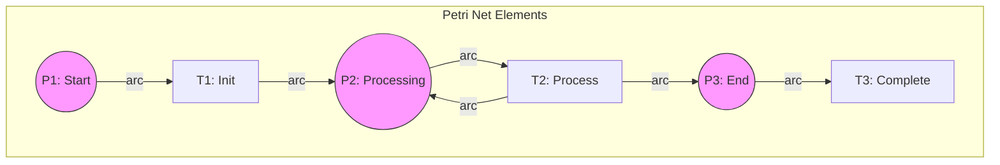
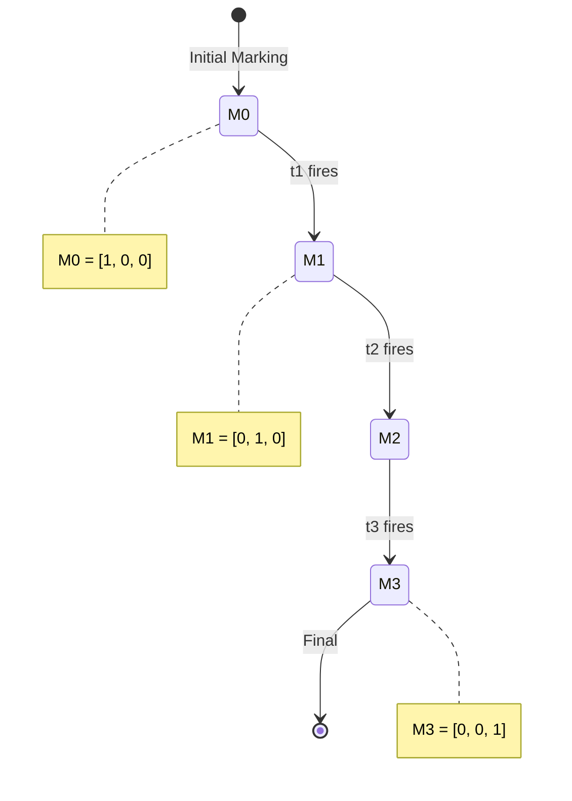
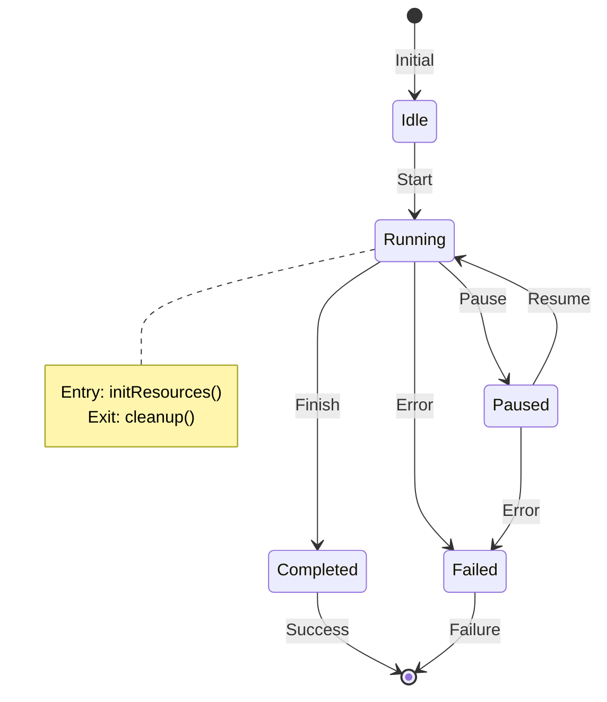

# 03.1 工作流形式化

## 03.1.1 概述

工作流系统用于建模、执行和管理业务流程。本节通过 Petri 网和状态机对工作流进行形式化描述。

> **交叉引用**: 与 [03.2 分布式事务](./03.2_分布式事务.md)、[03.3 事件驱动架构](./03.3_事件驱动架构.md) 共同构成工作流体系。

---

## 03.1.2 Petri 网形式化

### 03.1.2.1 形式化定义

**定义 03.1.1** (Petri 网). Petri 网 $PN$ 是一个四元组：
$$PN = (P, T, F, M_0)$$
其中：

- $P = \{p_1, p_2, ..., p_n\}$: 有限库所(place)集合
- $T = \{t_1, t_2, ..., t_m\}$: 有限变迁(transition)集合，$P \cap T = \emptyset$
- $F \subseteq (P \times T) \cup (T \times P)$: 弧(flow relation)
- $M_0: P \to \mathbb{N}$: 初始标识(marking)

**定义 03.1.2** (标识). 标识 $M$ 是库所到非负整数的映射，表示令牌(token)分布：
$$M: P \to \mathbb{N}$$

**定义 03.1.3** (变迁使能). 变迁 $t \in T$ 在标识 $M$ 下使能(enabled)，记为 $M[t\rangle$，当且仅当：
$$\forall p \in {}^\bullet t: M(p) \geq 1$$
其中 ${}^\bullet t = \{p | (p, t) \in F\}$ 是 $t$ 的输入库所。

**定义 03.1.4** (变迁触发). 使能的变迁 $t$ 触发后产生新标识 $M'$：
$$M' = M - {}^\bullet t + t^\bullet$$
其中 $t^\bullet = \{p | (t, p) \in F\}$ 是 $t$ 的输出库所。

### 03.1.2.2 形式化定理

**定理 03.1.1** (可达性). 标识 $M'$ 从 $M$ 可达，当且仅当存在变迁序列 $\sigma$：
$$M[\sigma\rangle M'$$

**定理 03.1.2** (有界性). Petri 网是 $k$-有界的，当且仅当：
$$\forall M \in R(M_0), \forall p \in P: M(p) \leq k$$
其中 $R(M_0)$ 是从 $M_0$ 可达的所有标识集合。

**定理 03.1.3** (活性). 变迁 $t$ 是活的，当且仅当：
$$\forall M \in R(M_0), \exists M' \in R(M): M'[t\rangle$$

### 03.1.2.3 架构图





### 03.1.2.4 代码示例

**Rust 实现：**

```rust
use std::collections::{HashMap, HashSet};
use std::fmt;

// Petri 网定义
pub struct PetriNet {
    places: HashSet<String>,
    transitions: HashSet<String>,
    flow: HashMap<String, HashSet<String>>, // place -> transitions 或 transition -> places
    marking: HashMap<String, u32>,
}

#[derive(Clone)]
pub struct Marking {
    tokens: HashMap<String, u32>,
}

impl PetriNet {
    pub fn new() -> Self {
        Self {
            places: HashSet::new(),
            transitions: HashSet::new(),
            flow: HashMap::new(),
            marking: HashMap::new(),
        }
    }

    pub fn add_place(&mut self, name: &str, initial_tokens: u32) {
        self.places.insert(name.to_string());
        self.marking.insert(name.to_string(), initial_tokens);
    }

    pub fn add_transition(&mut self, name: &str) {
        self.transitions.insert(name.to_string());
    }

    pub fn add_arc(&mut self, from: &str, to: &str) {
        self.flow.entry(from.to_string())
            .or_insert_with(HashSet::new)
            .insert(to.to_string());
    }

    // 获取变迁的输入库所
    pub fn input_places(&self, transition: &str) -> HashSet<String> {
        let mut inputs = HashSet::new();
        for (place, targets) in &self.flow {
            if self.places.contains(place) && targets.contains(transition) {
                inputs.insert(place.clone());
            }
        }
        inputs
    }

    // 获取变迁的输出库所
    pub fn output_places(&self, transition: &str) -> HashSet<String> {
        self.flow.get(transition)
            .cloned()
            .unwrap_or_default()
            .into_iter()
            .filter(|p| self.places.contains(p))
            .collect()
    }

    // 检查变迁是否使能
    pub fn is_enabled(&self, transition: &str) -> bool {
        let inputs = self.input_places(transition);
        inputs.iter().all(|p| {
            self.marking.get(p).copied().unwrap_or(0) >= 1
        })
    }

    // 触发变迁
    pub fn fire(&mut self, transition: &str) -> Result<(), PetriNetError> {
        if !self.transitions.contains(transition) {
            return Err(PetriNetError::TransitionNotFound);
        }

        if !self.is_enabled(transition) {
            return Err(PetriNetError::TransitionNotEnabled);
        }

        // 消耗输入令牌
        for place in self.input_places(transition) {
            *self.marking.get_mut(&place).unwrap() -= 1;
        }

        // 产生输出令牌
        for place in self.output_places(transition) {
            *self.marking.entry(place).or_insert(0) += 1;
        }

        Ok(())
    }

    pub fn get_marking(&self) -> HashMap<String, u32> {
        self.marking.clone()
    }
}

#[derive(Debug)]
pub enum PetriNetError {
    TransitionNotFound,
    TransitionNotEnabled,
}

// 工作流引擎基于 Petri 网
pub struct WorkflowEngine {
    petri_net: PetriNet,
    task_handlers: HashMap<String, Box<dyn Fn() -> Result<(), TaskError>>>,
}

impl WorkflowEngine {
    pub fn new(petri_net: PetriNet) -> Self {
        Self {
            petri_net,
            task_handlers: HashMap::new(),
        }
    }

    pub fn register_task(&mut self, transition: &str, handler: Box<dyn Fn() -> Result<(), TaskError>>) {
        self.task_handlers.insert(transition.to_string(), handler);
    }

    pub fn execute(&mut self) -> Result<(), WorkflowError> {
        loop {
            let enabled: Vec<String> = self.petri_net.transitions.iter()
                .filter(|t| self.petri_net.is_enabled(t))
                .cloned()
                .collect();

            if enabled.is_empty() {
                break; // 无使能变迁，结束
            }

            for transition in enabled {
                // 执行任务
                if let Some(handler) = self.task_handlers.get(&transition) {
                    handler().map_err(|e| WorkflowError::TaskFailed(e))?;
                }

                // 触发变迁
                self.petri_net.fire(&transition)?;
            }
        }

        Ok(())
    }
}

#[derive(Debug)]
pub enum TaskError {
    ExecutionFailed(String),
}

#[derive(Debug)]
pub enum WorkflowError {
    PetriNetError(PetriNetError),
    TaskFailed(TaskError),
}

impl From<PetriNetError> for WorkflowError {
    fn from(e: PetriNetError) -> Self {
        WorkflowError::PetriNetError(e)
    }
}
```

**Java 实现：**

```java
import java.util.*;
import java.util.concurrent.ConcurrentHashMap;

public class PetriNet {

    private final Set<String> places = ConcurrentHashMap.newKeySet();
    private final Set<String> transitions = ConcurrentHashMap.newKeySet();
    private final Map<String, Set<String>> flow = new ConcurrentHashMap<>();
    private final Map<String, Integer> marking = new ConcurrentHashMap<>();

    public void addPlace(String name, int initialTokens) {
        places.add(name);
        marking.put(name, initialTokens);
    }

    public void addTransition(String name) {
        transitions.add(name);
    }

    public void addArc(String from, String to) {
        flow.computeIfAbsent(from, k -> ConcurrentHashMap.newKeySet()).add(to);
    }

    public Set<String> getInputPlaces(String transition) {
        Set<String> inputs = new HashSet<>();
        for (Map.Entry<String, Set<String>> entry : flow.entrySet()) {
            if (places.contains(entry.getKey()) && entry.getValue().contains(transition)) {
                inputs.add(entry.getKey());
            }
        }
        return inputs;
    }

    public boolean isEnabled(String transition) {
        return getInputPlaces(transition).stream()
            .allMatch(p -> marking.getOrDefault(p, 0) >= 1);
    }

    public synchronized void fire(String transition) {
        if (!isEnabled(transition)) {
            throw new IllegalStateException("Transition not enabled: " + transition);
        }

        // Consume tokens
        for (String place : getInputPlaces(transition)) {
            marking.compute(place, (k, v) -> v - 1);
        }

        // Produce tokens
        Set<String> outputs = flow.getOrDefault(transition, Collections.emptySet());
        for (String place : outputs) {
            if (places.contains(place)) {
                marking.merge(place, 1, Integer::sum);
            }
        }
    }

    public Map<String, Integer> getMarking() {
        return new HashMap<>(marking);
    }
}

// 工作流引擎
@Service
public class WorkflowEngine {

    private final PetriNet petriNet;
    private final Map<String, TaskHandler> taskHandlers = new HashMap<>();

    public void registerTask(String transition, TaskHandler handler) {
        taskHandlers.put(transition, handler);
    }

    public void execute() {
        while (true) {
            Set<String> enabled = petriNet.transitions.stream()
                .filter(petriNet::isEnabled)
                .collect(Collectors.toSet());

            if (enabled.isEmpty()) break;

            for (String transition : enabled) {
                TaskHandler handler = taskHandlers.get(transition);
                if (handler != null) {
                    handler.execute();
                }
                petriNet.fire(transition);
            }
        }
    }
}

@FunctionalInterface
public interface TaskHandler {
    void execute();
}
```

---

## 03.1.3 状态机形式化

### 03.1.3.1 形式化定义

**定义 03.1.5** (有限状态机). 有限状态机 $FSM$ 是一个五元组：
$$FSM = (S, \Sigma, \delta, s_0, F)$$
其中：

- $S$: 有限状态集合
- $\Sigma$: 输入字母表（事件集合）
- $\delta: S \times \Sigma \to S$: 状态转移函数
- $s_0 \in S$: 初始状态
- $F \subseteq S$: 接受状态集合

**定义 03.1.6** (扩展状态机). 扩展状态机 $EFSM$ 增加变量集合：
$$EFSM = (S, \Sigma, \delta, s_0, F, V, G, A)$$
其中：

- $V$: 变量集合
- $G: S \times \Sigma \times V \to \{true, false\}$: 守卫条件
- $A: S \times \Sigma \times V \to V$: 动作函数

**定义 03.1.7** (分层状态机). 分层状态机 $HSM$ 允许状态嵌套：
$$HSM = (S, \Sigma, \delta, s_0, F, \rho)$$
其中 $\rho: S \to 2^S$ 是子状态映射。

### 03.1.3.2 形式化定理

**定理 03.1.4** (状态机完备性). 对于确定性 FSM：
$$\forall s \in S, \forall e \in \Sigma: |\delta(s, e)| \leq 1$$

**定理 03.1.5** (状态机等价). 两个 FSM $M_1$ 和 $M_2$ 等价，当且仅当：
$$L(M_1) = L(M_2)$$
其中 $L(M)$ 是 $M$ 接受的语言。

### 03.1.3.3 架构图



### 03.1.3.4 代码示例

**Rust 实现：**

```rust
use std::collections::HashMap;

// 状态机定义
pub struct StateMachine<S, E> {
    current_state: S,
    transitions: HashMap<(S, E), S>,
    on_enter: HashMap<S, Box<dyn Fn()>>,
    on_exit: HashMap<S, Box<dyn Fn()>>,
}

impl<S: Eq + std::hash::Hash + Clone, E: Eq + std::hash::Hash + Clone> StateMachine<S, E> {
    pub fn new(initial_state: S) -> Self {
        Self {
            current_state: initial_state,
            transitions: HashMap::new(),
            on_enter: HashMap::new(),
            on_exit: HashMap::new(),
        }
    }

    pub fn add_transition(&mut self, from: S, event: E, to: S) {
        self.transitions.insert((from, event), to);
    }

    pub fn on_enter(&mut self, state: S, callback: Box<dyn Fn()>) {
        self.on_enter.insert(state, callback);
    }

    pub fn on_exit(&mut self, state: S, callback: Box<dyn Fn()>) {
        self.on_exit.insert(state, callback);
    }

    pub fn trigger(&mut self, event: E) -> Result<(), StateMachineError> {
        let key = (self.current_state.clone(), event);

        if let Some(new_state) = self.transitions.get(&key).cloned() {
            // 退出当前状态
            if let Some(callback) = self.on_exit.get(&self.current_state) {
                callback();
            }

            self.current_state = new_state.clone();

            // 进入新状态
            if let Some(callback) = self.on_enter.get(&new_state) {
                callback();
            }

            Ok(())
        } else {
            Err(StateMachineError::InvalidTransition)
        }
    }

    pub fn current_state(&self) -> &S {
        &self.current_state
    }
}

#[derive(Debug)]
pub enum StateMachineError {
    InvalidTransition,
}

// 订单状态机示例
#[derive(Clone, PartialEq, Eq, Hash, Debug)]
pub enum OrderState {
    Created,
    Paid,
    Shipped,
    Delivered,
    Cancelled,
}

#[derive(Clone, PartialEq, Eq, Hash)]
pub enum OrderEvent {
    Pay,
    Ship,
    Deliver,
    Cancel,
}

pub struct OrderStateMachine {
    sm: StateMachine<OrderState, OrderEvent>,
}

impl OrderStateMachine {
    pub fn new() -> Self {
        let mut sm = StateMachine::new(OrderState::Created);

        // 定义状态转移
        sm.add_transition(OrderState::Created, OrderEvent::Pay, OrderState::Paid);
        sm.add_transition(OrderState::Created, OrderEvent::Cancel, OrderState::Cancelled);
        sm.add_transition(OrderState::Paid, OrderEvent::Ship, OrderState::Shipped);
        sm.add_transition(OrderState::Paid, OrderEvent::Cancel, OrderState::Cancelled);
        sm.add_transition(OrderState::Shipped, OrderEvent::Deliver, OrderState::Delivered);

        // 定义进入回调
        sm.on_enter(OrderState::Paid, Box::new(|| {
            println!("Entering Paid state - sending confirmation email");
        }));

        sm.on_enter(OrderState::Shipped, Box::new(|| {
            println!("Entering Shipped state - updating inventory");
        }));

        Self { sm }
    }

    pub fn process(&mut self, event: OrderEvent) -> Result<(), StateMachineError> {
        self.sm.trigger(event)
    }

    pub fn state(&self) -> &OrderState {
        self.sm.current_state()
    }
}
```

**Java 实现：**

```java
import java.util.*;
import java.util.function.Consumer;

public class StateMachine<S, E> {

    private S currentState;
    private final Map<Transition<S, E>, S> transitions = new HashMap<>();
    private final Map<S, Consumer<S>> onEnter = new HashMap<>();
    private final Map<S, Consumer<S>> onExit = new HashMap<>();

    public StateMachine(S initialState) {
        this.currentState = initialState;
    }

    public void addTransition(S from, E event, S to) {
        transitions.put(new Transition<>(from, event), to);
    }

    public void onEnter(S state, Consumer<S> callback) {
        onEnter.put(state, callback);
    }

    public void onExit(S state, Consumer<S> callback) {
        onExit.put(state, callback);
    }

    public void trigger(E event) {
        S nextState = transitions.get(new Transition<>(currentState, event));
        if (nextState == null) {
            throw new IllegalStateException("Invalid transition");
        }

        Consumer<S> exitCallback = onExit.get(currentState);
        if (exitCallback != null) exitCallback.accept(currentState);

        currentState = nextState;

        Consumer<S> enterCallback = onEnter.get(currentState);
        if (enterCallback != null) enterCallback.accept(currentState);
    }

    public S getCurrentState() {
        return currentState;
    }

    private static class Transition<S, E> {
        final S state;
        final E event;

        Transition(S state, E event) {
            this.state = state;
            this.event = event;
        }

        @Override
        public boolean equals(Object o) {
            if (this == o) return true;
            if (!(o instanceof Transition)) return false;
            Transition<?, ?> that = (Transition<?, ?>) o;
            return Objects.equals(state, that.state) && Objects.equals(event, that.event);
        }

        @Override
        public int hashCode() {
            return Objects.hash(state, event);
        }
    }
}

// Spring State Machine
@Configuration
@EnableStateMachine
public class OrderStateMachineConfig extends StateMachineConfigurerAdapter<OrderState, OrderEvent> {

    @Override
    public void configure(StateMachineStateConfigurer<OrderState, OrderEvent> states) throws Exception {
        states.withStates()
            .initial(OrderState.CREATED)
            .states(EnumSet.allOf(OrderState.class))
            .end(OrderState.DELIVERED)
            .end(OrderState.CANCELLED);
    }

    @Override
    public void configure(StateMachineTransitionConfigurer<OrderState, OrderEvent> transitions) throws Exception {
        transitions
            .withExternal()
                .source(OrderState.CREATED).target(OrderState.PAID).event(OrderEvent.PAY)
                .and()
            .withExternal()
                .source(OrderState.CREATED).target(OrderState.CANCELLED).event(OrderEvent.CANCEL)
                .and()
            .withExternal()
                .source(OrderState.PAID).target(OrderState.SHIPPED).event(OrderEvent.SHIP);
    }
}
```

---

## 03.1.4 Petri 网与状态机比较

| 特性 | Petri 网 | 状态机 |
|------|---------|--------|
| 并发建模 | 原生支持 | 需扩展 |
| 形式化分析 | 成熟理论 | 成熟理论 |
| 可视化 | 库所-变迁图 | 状态图 |
| 实现复杂度 | 较高 | 较低 |
| 适用场景 | 复杂工作流 | 业务状态管理 |

> **交叉引用**: 工作流中的事务处理请参考 [03.2 分布式事务](./03.2_分布式事务.md)。
