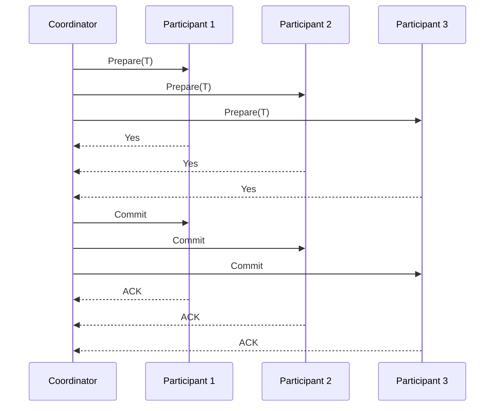
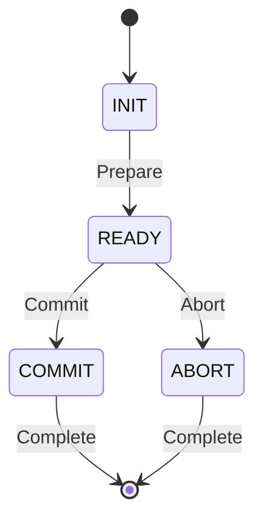
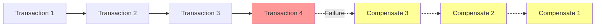
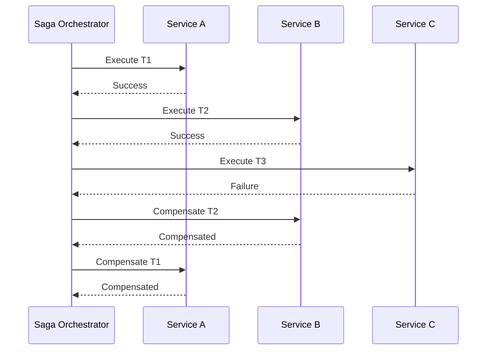
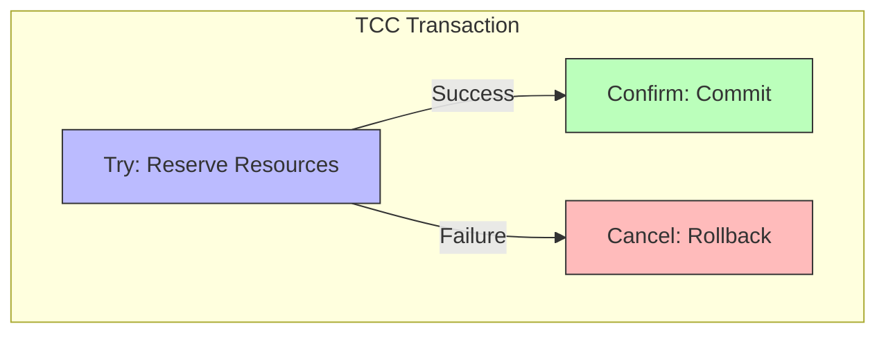

# 03.2 分布式事务

---

📌 **内容摘要**

本文档深入探讨分布式事务的核心原理和关键方法。内容涵盖工作流系统领域的主要知识点，包括决策理论, 风险, 最终一致性, 一致性模型, BPMN等关键主题。适合有一定基础的学习者系统学习。

**关键词**: 决策理论, 风险, 最终一致性, 一致性模型, BPMN, 一致性, 编排, 工作流系统

📚 **学习目标**

- 掌握分布式事务的核心概念和主要方法
- 理解相关理论的应用场景
- 建立该领域的系统性知识框架

🎯 **难度级别**: 中级

⏱️ **预计阅读时间**: 15分钟

**前置知识**: 相关领域的基础概念

---


## 03.2.1 概述

分布式事务确保跨多个服务的操作满足 ACID 特性。本节形式化描述 2PC、Saga 和 TCC 三种模式。

> **交叉引用**: 与 [03.1 工作流形式化](./03.1_工作流形式化.md)、[04.1 一致性模型](../04_分布式系统/04.1_一致性模型.md) 形成完整的分布式事务理论体系。

---

## 03.2.2 两阶段提交 (2PC) 形式化

### 03.2.2.1 形式化定义

**定义 03.2.1** (2PC 参与者). 2PC 包含一个协调者 $C$ 和 $n$ 个参与者 $P = \{p_1, p_2, ..., p_n\}$。

**定义 03.2.2** (阶段一：准备). 协调者发送 Prepare 请求：
$$C \to p_i: Prepare(T)$$
参与者响应：
$$p_i \to C: Vote_i \in \{Yes, No\}$$

**定义 03.2.3** (阶段二：提交/回滚). 协调者决策：
$$Decision = \begin{cases} Commit & \forall i: Vote_i = Yes \\ Abort & \exists i: Vote_i = No \end{cases}$$

**定义 03.2.4** (2PC 状态机). 参与者状态：
$$S_p \in \{INIT, READY, COMMIT, ABORT\}$$
协调者状态：
$$S_c \in \{INIT, WAIT, COMMIT, ABORT\}$$

### 03.2.2.2 形式化定理

**定理 03.2.1** (原子性). 2PC 保证所有参与者最终状态一致：
$$\forall i, j: S_{p_i} = COMMIT \iff S_{p_j} = COMMIT$$

**定理 03.2.2** (阻塞问题). 若协调者在 WAIT 状态故障，参与者可能阻塞直到协调者恢复。

### 03.2.2.3 架构图





### 03.2.2.4 代码示例

**Rust 实现：**

```rust
use std::collections::HashMap;
use std::sync::Arc;
use tokio::sync::{mpsc, Mutex};

#[derive(Clone, Debug, PartialEq)]
pub enum Vote {
    Yes,
    No,
}

#[derive(Clone, Debug, PartialEq)]
pub enum Decision {
    Commit,
    Abort,
}

#[derive(Clone, Debug, PartialEq)]
pub enum ParticipantState {
    Init,
    Ready,
    Committed,
    Aborted,
}

pub struct Participant {
    id: String,
    state: Arc<Mutex<ParticipantState>>,
}

impl Participant {
    pub async fn prepare(&self, transaction_id: &str) -> Vote {
        // 执行本地事务准备（写入undo/redo日志）
        let can_commit = self.execute_prepare(transaction_id).await;

        let mut state = self.state.lock().await;
        if can_commit {
            *state = ParticipantState::Ready;
            Vote::Yes
        } else {
            *state = ParticipantState::Aborted;
            Vote::No
        }
    }

    pub async fn commit(&self, _transaction_id: &str) -> Result<(), String> {
        let mut state = self.state.lock().await;
        // 执行本地提交
        self.execute_commit().await;
        *state = ParticipantState::Committed;
        Ok(())
    }

    pub async fn abort(&self, _transaction_id: &str) -> Result<(), String> {
        let mut state = self.state.lock().await;
        // 执行本地回滚
        self.execute_abort().await;
        *state = ParticipantState::Aborted;
        Ok(())
    }

    async fn execute_prepare(&self, _transaction_id: &str) -> bool {
        // 准备逻辑
        true
    }

    async fn execute_commit(&self) {
        // 提交逻辑
    }

    async fn execute_abort(&self) {
        // 回滚逻辑
    }
}

pub struct Coordinator {
    participants: Vec<Participant>,
}

impl Coordinator {
    pub fn new(participants: Vec<Participant>) -> Self {
        Self { participants }
    }

    pub async fn execute_transaction(&self, transaction_id: &str) -> Result<(), String> {
        // 阶段一：准备
        let mut votes = Vec::new();
        for participant in &self.participants {
            let vote = participant.prepare(transaction_id).await;
            votes.push(vote);
        }

        // 决策
        let decision = if votes.iter().all(|v| *v == Vote::Yes) {
            Decision::Commit
        } else {
            Decision::Abort
        };

        // 阶段二：执行决策
        for participant in &self.participants {
            match decision {
                Decision::Commit => {
                    participant.commit(transaction_id).await?;
                }
                Decision::Abort => {
                    participant.abort(transaction_id).await?;
                }
            }
        }

        Ok(())
    }
}
```

**Java 实现：**

```java
import java.util.*;
import java.util.concurrent.*;

public class TwoPhaseCommit {

    public enum Vote { YES, NO }
    public enum Decision { COMMIT, ABORT }

    public interface Participant {
        Vote prepare(String transactionId);
        void commit(String transactionId);
        void abort(String transactionId);
    }

    public static class Coordinator {
        private final List<Participant> participants;

        public Coordinator(List<Participant> participants) {
            this.participants = participants;
        }

        public void executeTransaction(String transactionId) throws Exception {
            // Phase 1: Prepare
            List<Vote> votes = new ArrayList<>();
            for (Participant p : participants) {
                votes.add(p.prepare(transactionId));
            }

            // Decision
            Decision decision = votes.stream().allMatch(v -> v == Vote.YES)
                ? Decision.COMMIT
                : Decision.ABORT;

            // Phase 2: Execute
            for (Participant p : participants) {
                if (decision == Decision.COMMIT) {
                    p.commit(transactionId);
                } else {
                    p.abort(transactionId);
                }
            }
        }
    }
}
```

---

## 03.2.3 Saga 模式形式化

### 03.2.3.1 形式化定义

**定义 03.2.5** (Saga). Saga 是一系列本地事务 $T = [t_1, t_2, ..., t_n]$，每个 $t_i$ 有对应的补偿事务 $c_i$。

**定义 03.2.6** (Saga 执行). Saga 执行是成功完成或补偿完成之一：
$$Execute(Saga) = \begin{cases}
[t_1, t_2, ..., t_n] & \text{全部成功} \\
[t_1, ..., t_k, c_k, ..., c_1] & t_{k+1} \text{ 失败}
\end{cases}$$

**定义 03.2.7** (补偿一致性). Saga 保证补偿后系统处于一致状态：
$$compensate([t_1, ..., t_k]) = [t_1, ..., t_k, c_k, ..., c_1] \equiv \text{初始状态}$$

### 03.2.3.2 形式化定理

**定理 03.2.3** (最终一致性). Saga 保证最终一致性：
$$\Diamond (state = consistent)$$

**定理 03.2.4** (补偿幂等性). 补偿事务应满足幂等性：
$$c_i \circ c_i = c_i$$

### 03.2.3.3 架构图





### 03.2.3.4 代码示例

**Rust 实现：**

```rust
use std::future::Future;
use std::pin::Pin;

pub struct Saga {
    steps: Vec<SagaStep>,
}

pub struct SagaStep {
    name: String,
    action: Box<dyn Fn() -> Pin<Box<dyn Future<Output = Result<(), String>> + Send>> + Send>,
    compensation: Box<dyn Fn() -> Pin<Box<dyn Future<Output = Result<(), String>> + Send>> + Send>,
}

impl Saga {
    pub fn new() -> Self {
        Self { steps: Vec::new() }
    }

    pub fn add_step(
        &mut self,
        name: &str,
        action: Box<dyn Fn() -> Pin<Box<dyn Future<Output = Result<(), String>> + Send>> + Send>,
        compensation: Box<dyn Fn() -> Pin<Box<dyn Future<Output = Result<(), String>> + Send>> + Send>,
    ) {
        self.steps.push(SagaStep {
            name: name.to_string(),
            action,
            compensation,
        });
    }

    pub async fn execute(&self) -> Result<(), SagaError> {
        let mut completed_steps = Vec::new();

        for (i, step) in self.steps.iter().enumerate() {
            match (step.action)().await {
                Ok(()) => {
                    completed_steps.push(i);
                }
                Err(e) => {
                    // 执行补偿
                    for &completed_idx in completed_steps.iter().rev() {
                        let comp_step = &self.steps[completed_idx];
                        if let Err(comp_err) = (comp_step.compensation)().await {
                            return Err(SagaError::CompensationFailed {
                                step: comp_step.name.clone(),
                                error: comp_err,
                            });
                        }
                    }
                    return Err(SagaError::StepFailed {
                        step: step.name.clone(),
                        error: e,
                    });
                }
            }
        }

        Ok(())
    }
}

# [derive(Debug)]
pub enum SagaError {
    StepFailed { step: String, error: String },
    CompensationFailed { step: String, error: String },
}

// 订单 Saga 示例
pub struct OrderSaga {
    saga: Saga,
}

impl OrderSaga {
    pub fn new(order_id: &str) -> Self {
        let mut saga = Saga::new();
        let order_id = order_id.to_string();

        // 步骤1: 创建订单
        let order_id_clone = order_id.clone();
        saga.add_step(
            "create_order",
            Box::new(move || {
                let oid = order_id_clone.clone();
                Box::pin(async move {
                    println!("Creating order {}", oid);
                    Ok(())
                })
            }),
            Box::new(move || {
                let oid = order_id.clone();
                Box::pin(async move {
                    println!("Canceling order {}", oid);
                    Ok(())
                })
            }),
        );

        Self { saga }
    }

    pub async fn execute(&self) -> Result<(), SagaError> {
        self.saga.execute().await
    }
}
```

**Java 实现：**

```java
import java.util.*;
import java.util.function.Supplier;
import java.util.concurrent.CompletableFuture;

public class SagaOrchestrator {

    private final List<SagaStep> steps = new ArrayList<>();

    public SagaOrchestrator addStep(
            String name,
            Supplier<CompletableFuture<Void>> action,
            Supplier<CompletableFuture<Void>> compensation) {
        steps.add(new SagaStep(name, action, compensation));
        return this;
    }

    public CompletableFuture<Void> execute() {
        List<Integer> completedSteps = new ArrayList<>();

        return executeStep(0, completedSteps);
    }

    private CompletableFuture<Void> executeStep(int index, List<Integer> completed) {
        if (index >= steps.size()) {
            return CompletableFuture.completedFuture(null);
        }

        SagaStep step = steps.get(index);
        return step.action.get()
            .thenCompose(v -> {
                completed.add(index);
                return executeStep(index + 1, completed);
            })
            .exceptionally(ex -> {
                // Compensate
                return compensate(completed);
            });
    }

    private Void compensate(List<Integer> completed) {
        for (int i = completed.size() - 1; i >= 0; i--) {
            SagaStep step = steps.get(completed.get(i));
            step.compensation.get().join();
        }
        return null;
    }

    static class SagaStep {
        final String name;
        final Supplier<CompletableFuture<Void>> action;
        final Supplier<CompletableFuture<Void>> compensation;

        SagaStep(String name, Supplier<CompletableFuture<Void>> action,
                 Supplier<CompletableFuture<Void>> compensation) {
            this.name = name;
            this.action = action;
            this.compensation = compensation;
        }
    }
}

// Seata Saga 配置示例
@Configuration
public class SagaConfig {

    @Bean
    public StateMachineEngine stateMachineEngine() {
        // 加载状态机定义
        return StateMachineBuilderFactory.create()
            .build("order_saga.json");
    }
}
```

---

## 03.2.4 TCC 模式形式化

### 03.2.4.1 形式化定义

**定义 03.2.8** (TCC). Try-Confirm-Cancel 是三个阶段的补偿事务：
- $Try$: 预留资源
- $Confirm$: 确认执行
- $Cancel$: 取消预留

**定义 03.2.9** (TCC 执行). TCC 事务 $t$ 的执行：
$$t = \begin{cases}
Try \to Confirm & \text{成功} \\
Try \to Cancel & \text{失败}
\end{cases}$$

### 03.2.4.2 形式化定理

**定理 03.2.5** (资源隔离). Try 阶段预留的资源对其他事务不可见。

**定理 03.2.6** (幂等性要求). Confirm 和 Cancel 必须幂等：
$$Confirm \circ Confirm = Confirm, \quad Cancel \circ Cancel = Cancel$$

### 03.2.4.3 架构图



### 03.2.4.4 代码示例

**Rust 实现：**

```rustn#[async_trait::async_trait]
pub trait TccAction {
    async fn try_action(&self) -> Result<(), String>;
    async fn confirm(&self) -> Result<(), String>;
    async fn cancel(&self) -> Result<(), String>;
}

pub struct TccTransaction {
    actions: Vec<Box<dyn TccAction + Send + Sync>>,
}

impl TccTransaction {
    pub fn new() -> Self {
        Self { actions: Vec::new() }
    }

    pub fn add_action(&mut self, action: Box<dyn TccAction + Send + Sync>) {
        self.actions.push(action);
    }

    pub async fn execute(&self) -> Result<(), TccError> {
        let mut tried_actions = Vec::new();

        // Try 阶段
        for (i, action) in self.actions.iter().enumerate() {
            match action.try_action().await {
                Ok(()) => tried_actions.push(i),
                Err(e) => {
                    // Cancel 所有已 Try 的操作
                    for &idx in tried_actions.iter().rev() {
                        self.actions[idx].cancel().await.ok();
                    }
                    return Err(TccError::TryFailed(e));
                }
            }
        }

        // Confirm 阶段
        for &idx in &tried_actions {
            if let Err(e) = self.actions[idx].confirm().await {
                // Confirm 失败需要人工介入或记录日志
                return Err(TccError::ConfirmFailed(e));
            }
        }

        Ok(())
    }
}

# [derive(Debug)]
pub enum TccError {
    TryFailed(String),
    ConfirmFailed(String),
}

// 库存扣减 TCC 实现
pub struct InventoryTcc {
    product_id: String,
    quantity: u32,
}

# [async_trait::async_trait]
impl TccAction for InventoryTcc {
    async fn try_action(&self) -> Result<(), String> {
        // 检查库存并冻结
        println!("Try: Freezing {} units of product {}",
                 self.quantity, self.product_id);
        Ok(())
    }

    async fn confirm(&self) -> Result<(), String> {
        // 确认扣减：从冻结库存中扣减
        println!("Confirm: Deducting {} units from product {}",
                 self.quantity, self.product_id);
        Ok(())
    }

    async fn cancel(&self) -> Result<(), String> {
        // 取消：释放冻结库存
        println!("Cancel: Releasing {} units for product {}",
                 self.quantity, self.product_id);
        Ok(())
    }
}
```

**Java 实现：**

```java
@LocalTCC
public interface InventoryService {

    @TwoPhaseBusinessAction(name = "deductInventory",
        commitMethod = "commit", rollbackMethod = "rollback")
    boolean tryDeduct(@BusinessActionContextParameter(paramName = "productId") String productId,
                      @BusinessActionContextParameter(paramName = "quantity") int quantity);

    boolean commit(BusinessActionContext context);

    boolean rollback(BusinessActionContext context);
}

@Service
public class InventoryServiceImpl implements InventoryService {

    @Autowired
    private InventoryRepository inventoryRepository;

    @Override
    public boolean tryDeduct(String productId, int quantity) {
        // 检查库存
        Inventory inventory = inventoryRepository.findByProductId(productId);
        if (inventory.getAvailable() < quantity) {
            throw new InsufficientInventoryException();
        }

        // 冻结库存
        inventory.freeze(quantity);
        inventoryRepository.save(inventory);
        return true;
    }

    @Override
    public boolean commit(BusinessActionContext context) {
        String productId = context.getActionContext("productId");
        int quantity = Integer.parseInt(context.getActionContext("quantity"));

        // 确认：从可用库存扣减，减少冻结
        Inventory inventory = inventoryRepository.findByProductId(productId);
        inventory.confirmDeduct(quantity);
        inventoryRepository.save(inventory);
        return true;
    }

    @Override
    public boolean rollback(BusinessActionContext context) {
        String productId = context.getActionContext("productId");
        int quantity = Integer.parseInt(context.getActionContext("quantity"));

        // 回滚：释放冻结
        Inventory inventory = inventoryRepository.findByProductId(productId);
        inventory.unfreeze(quantity);
        inventoryRepository.save(inventory);
        return true;
    }
}
```

---

## 03.2.5 三种模式比较

| 特性 | 2PC | Saga | TCC |
|------|-----|------|-----|
| 一致性 | 强一致性 | 最终一致性 | 最终一致性 |
| 阻塞 | 是 | 否 | 否 |
| 复杂度 | 低 | 中 | 高 |
| 性能 | 低 | 高 | 高 |
| 补偿 | 回滚 | 业务补偿 | 资源释放 |
| 适用场景 | 短事务 | 长事务 | 资源预留 |

> **交叉引用**: 分布式事务的一致性保证请参考 [04.1 一致性模型](../04_分布式系统/04.1_一致性模型.md)。
---

## 📋 前置知识

- [02.1 Petri 网基础](../../05_形式化理论/02_Petri网理论/02.1_Petri网基础.md)

---

## 📚 延伸阅读

- [04.3 分布式事务](../04_分布式系统/04.3_分布式事务.md)
- [03.2 Future与Promise](../../03_编程范式/03_异步编程模型/03.2_Future与Promise.md)
- [03.1 工作流基础](../03_工作流系统/03.1_工作流基础.md)
- [03.1 工作流形式化](../03_工作流系统/03.1_工作流形式化.md)
- [04.1 一致性模型](../04_分布式系统/04.1_一致性模型.md)
