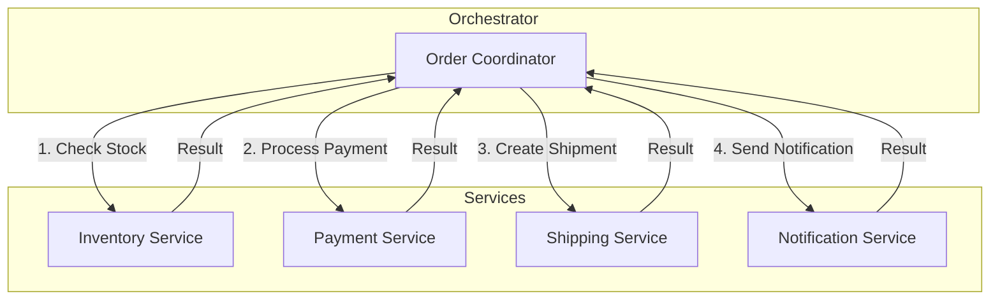
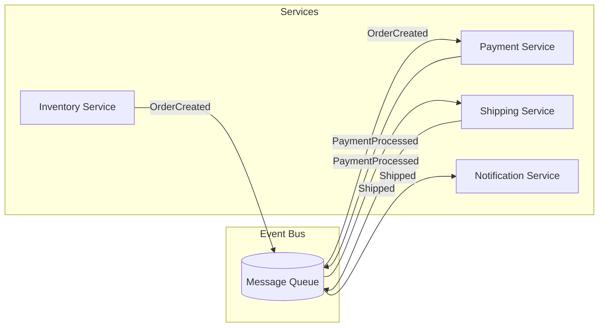
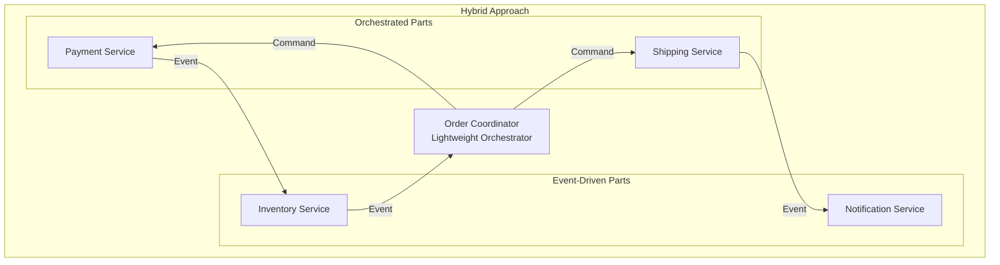

# 03.2 编排与编排 (Orchestration vs Choreography)

## 目录

- [03.2 编排与编排 (Orchestration vs Choreography)](#032-编排与编排-orchestration-vs-choreography)
  - [目录](#目录)
  - [1. 概述](#1-概述)
  - [2. 编排 (Orchestration)](#2-编排-orchestration)
    - [2.1 形式化定义](#21-形式化定义)
    - [2.2 架构图](#22-架构图)
    - [2.3 Rust 实现](#23-rust-实现)
    - [2.4 Go 实现](#24-go-实现)
  - [3. 编排 (Choreography)](#3-编排-choreography)
    - [3.1 形式化定义](#31-形式化定义)
    - [3.2 架构图](#32-架构图)
    - [3.3 Rust 实现](#33-rust-实现)
    - [3.4 Go 实现](#34-go-实现)
  - [4. 混合模式](#4-混合模式)
  - [5. 对比分析](#5-对比分析)
  - [6. 相关文档](#6-相关文档)

## 1. 概述

在微服务架构中，协调多个服务完成业务流程有两种主要模式：

- **编排 (Orchestration)**：中央控制器协调各服务
- **编排 (Choreography)**：各服务通过事件自治协调

## 2. 编排 (Orchestration)

### 2.1 形式化定义

设编排器 $O$，服务集合 $S = \{s_1, s_2, ..., s_n\}$，流程 $P$：

$$P = O \circ (s_1 \oplus s_2 \oplus ... \oplus s_n)$$

其中 $\oplus$ 表示有序组合，编排器控制调用顺序：

$$O.execute(P): s_i \rightarrow s_{i+1} \text{ based on } result(s_i)$$

### 2.2 架构图



### 2.3 Rust 实现

```rust
use async_trait::async_trait;

// 服务接口
#[async_trait]
trait Service {
    async fn execute(&self, input: WorkflowData) -> Result<WorkflowData, WorkflowError>;
    async fn compensate(&self, input: WorkflowData) -> Result<(), WorkflowError>;
}

// 库存服务
struct InventoryService;

#[async_trait]
impl Service for InventoryService {
    async fn execute(&self, input: WorkflowData) -> Result<WorkflowData, WorkflowError> {
        println!("Checking inventory for product: {:?}", input.get("product_id"));
        // 实际业务逻辑
        let mut output = input.clone();
        output.insert("stock_available".to_string(), WorkflowValue::Bool(true));
        Ok(output)
    }

    async fn compensate(&self, input: WorkflowData) -> Result<(), WorkflowError> {
        println!("Restoring inventory");
        Ok(())
    }
}

// 支付服务
struct PaymentService;

#[async_trait]
impl Service for PaymentService {
    async fn execute(&self, input: WorkflowData) -> Result<WorkflowData, WorkflowError> {
        println!("Processing payment");
        let mut output = input.clone();
        output.insert("payment_id".to_string(), WorkflowValue::String("pay_123".to_string()));
        Ok(output)
    }

    async fn compensate(&self, _input: WorkflowData) -> Result<(), WorkflowError> {
        println!("Refunding payment");
        Ok(())
    }
}

// 编排器
pub struct Orchestrator {
    services: Vec<Box<dyn Service>>,
    compensations: Vec<usize>,
}

impl Orchestrator {
    pub fn new() -> Self {
        Self {
            services: Vec::new(),
            compensations: Vec::new(),
        }
    }

    pub fn add_service(&mut self, service: Box<dyn Service>) {
        self.services.push(service);
    }

    pub async fn execute(&self, initial_data: WorkflowData) -> Result<WorkflowData, WorkflowError> {
        let mut data = initial_data;
        let mut executed: Vec<usize> = Vec::new();

        for (idx, service) in self.services.iter().enumerate() {
            match service.execute(data.clone()).await {
                Ok(result) => {
                    data = result;
                    executed.push(idx);
                }
                Err(e) => {
                    // 执行补偿
                    self.compensate(&executed, data.clone()).await;
                    return Err(e);
                }
            }
        }

        Ok(data)
    }

    async fn compensate(&self, executed: &[usize], data: WorkflowData) {
        for &idx in executed.iter().rev() {
            if let Err(e) = self.services[idx].compensate(data.clone()).await {
                eprintln!("Compensation failed: {:?}", e);
            }
        }
    }
}

// 类型定义
type WorkflowData = std::collections::HashMap<String, WorkflowValue>;

#[derive(Clone)]
enum WorkflowValue {
    String(String),
    Int(i64),
    Bool(bool),
}

#[derive(Debug)]
struct WorkflowError;

#[tokio::main]
async fn main() {
    let mut orchestrator = Orchestrator::new();

    orchestrator.add_service(Box::new(InventoryService));
    orchestrator.add_service(Box::new(PaymentService));

    let initial_data = [
        ("product_id".to_string(), WorkflowValue::String("prod_1".to_string())),
        ("quantity".to_string(), WorkflowValue::Int(2)),
    ].into_iter().collect();

    match orchestrator.execute(initial_data).await {
        Ok(result) => println!("Workflow completed: {:?}", result.keys().collect::<Vec<_>>()),
        Err(_) => println!("Workflow failed"),
    }
}
```

### 2.4 Go 实现

```go
package main

import (
    "fmt"
)

// Service interface
type Service interface {
    Execute(input WorkflowData) (WorkflowData, error)
    Compensate(input WorkflowData) error
}

// InventoryService
type InventoryService struct{}

func (s *InventoryService) Execute(input WorkflowData) (WorkflowData, error) {
    fmt.Printf("Checking inventory for product: %v\n", input["product_id"])
    output := input.Copy()
    output["stock_available"] = true
    return output, nil
}

func (s *InventoryService) Compensate(input WorkflowData) error {
    fmt.Println("Restoring inventory")
    return nil
}

// PaymentService
type PaymentService struct{}

func (s *PaymentService) Execute(input WorkflowData) (WorkflowData, error) {
    fmt.Println("Processing payment")
    output := input.Copy()
    output["payment_id"] = "pay_123"
    return output, nil
}

func (s *PaymentService) Compensate(input WorkflowData) error {
    fmt.Println("Refunding payment")
    return nil
}

// Orchestrator
type Orchestrator struct {
    services []Service
}

func NewOrchestrator() *Orchestrator {
    return &Orchestrator{
        services: []Service{},
    }
}

func (o *Orchestrator) AddService(service Service) {
    o.services = append(o.services, service)
}

func (o *Orchestrator) Execute(initialData WorkflowData) (WorkflowData, error) {
    data := initialData
    executed := []int{}

    for idx, service := range o.services {
        result, err := service.Execute(data)
        if err != nil {
            o.compensate(executed, data)
            return nil, err
        }
        data = result
        executed = append(executed, idx)
    }

    return data, nil
}

func (o *Orchestrator) compensate(executed []int, data WorkflowData) {
    for i := len(executed) - 1; i >= 0; i-- {
        idx := executed[i]
        if err := o.services[idx].Compensate(data); err != nil {
            fmt.Printf("Compensation failed: %v\n", err)
        }
    }
}

// WorkflowData
type WorkflowData map[string]interface{}

func (w WorkflowData) Copy() WorkflowData {
    copy := make(WorkflowData)
    for k, v := range w {
        copy[k] = v
    }
    return copy
}

func main() {
    orchestrator := NewOrchestrator()

    orchestrator.AddService(&InventoryService{})
    orchestrator.AddService(&PaymentService{})

    initialData := WorkflowData{
        "product_id": "prod_1",
        "quantity":   2,
    }

    result, err := orchestrator.Execute(initialData)
    if err != nil {
        fmt.Printf("Workflow failed: %v\n", err)
    } else {
        fmt.Printf("Workflow completed with keys: %v\n", getKeys(result))
    }
}

func getKeys(m map[string]interface{}) []string {
    keys := make([]string, 0, len(m))
    for k := range m {
        keys = append(keys, k)
    }
    return keys
}
```

## 3. 编排 (Choreography)

### 3.1 形式化定义

设服务集合 $S = \{s_1, s_2, ..., s_n\}$，事件集合 $E$，每个服务 $s_i$ 有：

$$s_i = (subscribe(E_{in}), process(), publish(E_{out}))$$

**事件驱动协调**：
$$publish(s_i, e) \Rightarrow \forall s_j \in S: e \in E_{in}(s_j) \rightarrow trigger(s_j)$$

### 3.2 架构图



### 3.3 Rust 实现

```rust
use tokio::sync::broadcast;
use serde::{Serialize, Deserialize};

#[derive(Clone, Debug, Serialize, Deserialize)]
enum DomainEvent {
    OrderCreated { order_id: String, product_id: String, quantity: i32 },
    InventoryReserved { order_id: String },
    PaymentProcessed { order_id: String, payment_id: String },
    OrderShipped { order_id: String, tracking_id: String },
    NotificationSent { order_id: String, message: String },
}

// 事件总线
pub struct EventBus {
    sender: broadcast::Sender<DomainEvent>,
}

impl EventBus {
    pub fn new() -> Self {
        let (sender, _) = broadcast::channel(100);
        Self { sender }
    }

    pub fn publish(&self, event: DomainEvent) {
        let _ = self.sender.send(event);
    }

    pub fn subscribe(&self) -> broadcast::Receiver<DomainEvent> {
        self.sender.subscribe()
    }
}

// 库存服务
pub struct InventoryChoreographer {
    event_bus: EventBus,
}

impl InventoryChoreographer {
    pub fn new(event_bus: EventBus) -> Self {
        Self { event_bus }
    }

    pub async fn run(&self) {
        let mut receiver = self.event_bus.subscribe();

        while let Ok(event) = receiver.recv().await {
            match event {
                DomainEvent::OrderCreated { order_id, product_id, quantity } => {
                    println!("[Inventory] Reserving stock for product: {}", product_id);

                    // 执行库存预留
                    println!("[Inventory] Reserved {} units of {}", quantity, product_id);

                    // 发布事件
                    self.event_bus.publish(DomainEvent::InventoryReserved { order_id });
                }
                _ => {}
            }
        }
    }
}

// 支付服务
pub struct PaymentChoreographer {
    event_bus: EventBus,
}

impl PaymentChoreographer {
    pub fn new(event_bus: EventBus) -> Self {
        Self { event_bus }
    }

    pub async fn run(&self) {
        let mut receiver = self.event_bus.subscribe();

        while let Ok(event) = receiver.recv().await {
            match event {
                DomainEvent::InventoryReserved { order_id } => {
                    println!("[Payment] Processing payment for order: {}", order_id);

                    // 执行支付处理
                    let payment_id = format!("pay_{}", order_id);

                    // 发布事件
                    self.event_bus.publish(DomainEvent::PaymentProcessed {
                        order_id,
                        payment_id
                    });
                }
                _ => {}
            }
        }
    }
}

// 发货服务
pub struct ShippingChoreographer {
    event_bus: EventBus,
}

impl ShippingChoreographer {
    pub fn new(event_bus: EventBus) -> Self {
        Self { event_bus }
    }

    pub async fn run(&self) {
        let mut receiver = self.event_bus.subscribe();

        while let Ok(event) = receiver.recv().await {
            match event {
                DomainEvent::PaymentProcessed { order_id, payment_id } => {
                    println!("[Shipping] Creating shipment for order: {}", order_id);

                    // 执行发货
                    let tracking_id = format!("track_{}", order_id);

                    // 发布事件
                    self.event_bus.publish(DomainEvent::OrderShipped {
                        order_id,
                        tracking_id
                    });
                }
                _ => {}
            }
        }
    }
}

#[tokio::main]
async fn main() {
    let event_bus = EventBus::new();

    let inventory = InventoryChoreographer::new(event_bus.clone());
    let payment = PaymentChoreographer::new(event_bus.clone());
    let shipping = ShippingChoreographer::new(event_bus.clone());

    // 启动各服务
    tokio::spawn(async move { inventory.run().await });
    tokio::spawn(async move { payment.run().await });
    tokio::spawn(async move { shipping.run().await });

    // 触发流程
    tokio::time::sleep(tokio::time::Duration::from_millis(100)).await;

    event_bus.publish(DomainEvent::OrderCreated {
        order_id: "order_1".to_string(),
        product_id: "prod_1".to_string(),
        quantity: 2,
    });

    tokio::time::sleep(tokio::time::Duration::from_secs(2)).await;
}
```

### 3.4 Go 实现

```go
package main

import (
    "fmt"
    "sync"
)

// DomainEvent type
type DomainEvent interface {
    EventType() string
}

type OrderCreated struct {
    OrderID   string
    ProductID string
    Quantity  int
}

func (e OrderCreated) EventType() string { return "OrderCreated" }

type InventoryReserved struct {
    OrderID string
}

func (e InventoryReserved) EventType() string { return "InventoryReserved" }

type PaymentProcessed struct {
    OrderID   string
    PaymentID string
}

func (e PaymentProcessed) EventType() string { return "PaymentProcessed" }

type OrderShipped struct {
    OrderID    string
    TrackingID string
}

func (e OrderShipped) EventType() string { return "OrderShipped" }

// EventBus
type EventBus struct {
    listeners map[string][]chan DomainEvent
    mu        sync.RWMutex
}

func NewEventBus() *EventBus {
    return &EventBus{
        listeners: make(map[string][]chan DomainEvent),
    }
}

func (eb *EventBus) Subscribe(eventType string) chan DomainEvent {
    ch := make(chan DomainEvent, 10)
    eb.mu.Lock()
    eb.listeners[eventType] = append(eb.listeners[eventType], ch)
    eb.mu.Unlock()
    return ch
}

func (eb *EventBus) Publish(event DomainEvent) {
    eb.mu.RLock()
    listeners := eb.listeners[event.EventType()]
    eb.mu.RUnlock()

    for _, ch := range listeners {
        go func(c chan DomainEvent) {
            c <- event
        }(ch)
    }
}

// InventoryChoreographer
type InventoryChoreographer struct {
    eventBus *EventBus
}

func (c *InventoryChoreographer) Run() {
    ch := c.eventBus.Subscribe("OrderCreated")

    for event := range ch {
        if e, ok := event.(OrderCreated); ok {
            fmt.Printf("[Inventory] Reserving stock for product: %s\n", e.ProductID)

            c.eventBus.Publish(InventoryReserved{OrderID: e.OrderID})
        }
    }
}

// PaymentChoreographer
type PaymentChoreographer struct {
    eventBus *EventBus
}

func (c *PaymentChoreographer) Run() {
    ch := c.eventBus.Subscribe("InventoryReserved")

    for event := range ch {
        if e, ok := event.(InventoryReserved); ok {
            fmt.Printf("[Payment] Processing payment for order: %s\n", e.OrderID)

            paymentID := fmt.Sprintf("pay_%s", e.OrderID)
            c.eventBus.Publish(PaymentProcessed{
                OrderID:   e.OrderID,
                PaymentID: paymentID,
            })
        }
    }
}

// ShippingChoreographer
type ShippingChoreographer struct {
    eventBus *EventBus
}

func (c *ShippingChoreographer) Run() {
    ch := c.eventBus.Subscribe("PaymentProcessed")

    for event := range ch {
        if e, ok := event.(PaymentProcessed); ok {
            fmt.Printf("[Shipping] Creating shipment for order: %s\n", e.OrderID)

            trackingID := fmt.Sprintf("track_%s", e.OrderID)
            c.eventBus.Publish(OrderShipped{
                OrderID:    e.OrderID,
                TrackingID: trackingID,
            })
        }
    }
}

func main() {
    eventBus := NewEventBus()

    inventory := &InventoryChoreographer{eventBus: eventBus}
    payment := &PaymentChoreographer{eventBus: eventBus}
    shipping := &ShippingChoreographer{eventBus: eventBus}

    go inventory.Run()
    go payment.Run()
    go shipping.Run()

    // Trigger workflow
    eventBus.Publish(OrderCreated{
        OrderID:   "order_1",
        ProductID: "prod_1",
        Quantity:  2,
    })

    select {}
}
```

## 4. 混合模式



## 5. 对比分析

| 维度 | Orchestration | Choreography |
|------|---------------|--------------|
| **控制方式** | 集中控制 | 分散自治 |
| **耦合度** | 服务依赖编排器 | 服务间松耦合 |
| **可见性** | 流程清晰 | 需要额外工具 |
| **灵活性** | 修改需改编排器 | 增删服务容易 |
| **事务管理** | 易于实现Saga | 需要额外协调 |
| **复杂度** | 简单流程适合 | 复杂流程困难 |
| **故障排查** | 集中日志 | 分布式追踪 |

**选择建议**：

- **Orchestration**：复杂流程、需要严格顺序控制、 Saga 补偿事务
- **Choreography**：简单事件链、高自治要求、快速扩展

## 6. 相关文档

- [03.1_工作流基础](./03.1_工作流基础.md) - 工作流建模基础
- [03.3_工作流引擎](./03.3_工作流引擎.md) - 工作流引擎实现
- [03.4_长时间运行流程](./03.4_长时间运行流程.md) - Saga 模式详解
- [01.5_分布式模式](../01_设计模式/01.5_分布式模式.md) - 分布式事务模式
