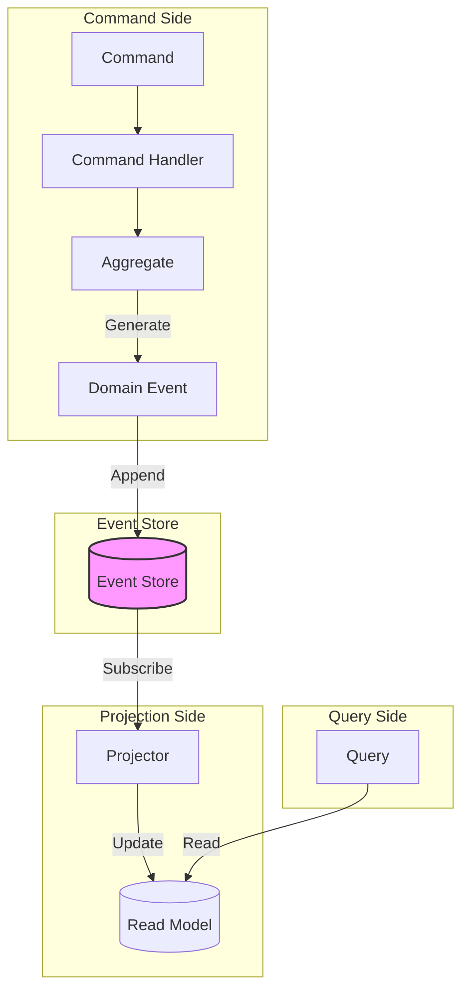
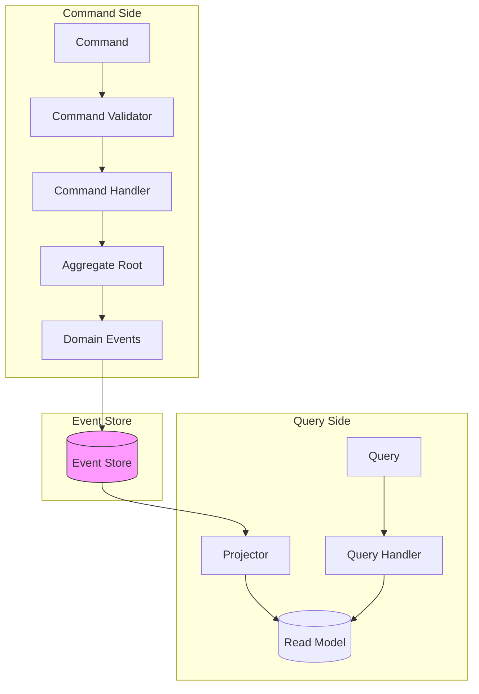
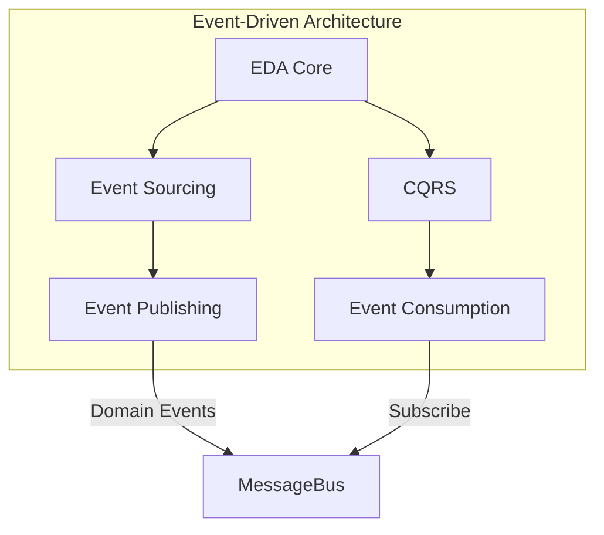

# 03.3 事件驱动架构

---

📌 **内容摘要**

本文档深入探讨事件驱动架构的核心原理和关键方法。内容涵盖工作流系统领域的主要知识点，包括服务发现, 一致性, 分布式, 共识算法等关键主题。适合有一定基础的学习者系统学习。

**关键词**: 服务发现, 一致性, 工作流系统, 分布式, 共识算法, 分布式系统, 微服务

📚 **学习目标**
- 掌握事件驱动架构的核心概念和主要方法
- 理解相关理论的应用场景
- 建立该领域的系统性知识框架

🎯 **难度级别**: 中级

⏱️ **预计阅读时间**: 15分钟

**前置知识**: 相关领域的基础概念

---


## 03.3.1 概述

事件驱动架构 (EDA) 是一种以事件为核心进行系统设计和集成的架构模式，包括事件溯源 (Event Sourcing) 和 CQRS (命令查询职责分离)。

> **交叉引用**: 与 [02.4 可观测性](../02_微服务架构/02.4_可观测性.md)、[04.3 分布式时钟](../04_分布式系统/04.3_分布式时钟.md) 形成完整的事件驱动体系。

---

## 03.3.2 事件溯源形式化

### 03.3.2.1 形式化定义

**定义 03.3.1** (事件). 事件 $e$ 是领域中发生的事实：
$$e = (id, type, payload, timestamp, metadata)$$
其中：

- $id$: 事件唯一标识
- $type$: 事件类型
- $payload$: 事件数据
- $timestamp$: 发生时间
- $metadata$: 元数据（聚合ID、版本等）

**定义 03.3.2** (事件存储). 事件存储 $ES$ 是事件的只追加集合：
$$ES = [e_1, e_2, ..., e_n]$$
满足：
$$\forall i < j: timestamp(e_i) \leq timestamp(e_j)$$

**定义 03.3.3** (聚合状态). 聚合状态 $S$ 是事件的折叠(fold)：
$$S = fold(S_0, [e_1, e_2, ..., e_n])$$
其中 $fold$ 是应用函数的累积：
$$fold(s, []) = s$$
$$fold(s, [e | es]) = fold(apply(s, e), es)$$

**定义 03.3.4** (事件溯源聚合). 聚合 $A$ 是一个三元组：
$$A = (id, version, events)$$
其中 $version$ 是最后应用事件的序列号。

### 03.3.2.2 形式化定理

**定理 03.3.1** (状态可重现性). 对于任意事件序列 $E$ 和初始状态 $S_0$：
$$state(E) = fold(S_0, E)$$
该状态是确定性和可重现的。

**定理 03.3.2** (审计完备性). 事件存储 $ES$ 包含系统状态的完整历史：
$$\forall t: \exists ES_t \subseteq ES: state(ES_t) = state\ at\ time\ t$$

### 03.3.2.3 架构图



### 03.3.2.4 代码示例

**Rust 实现：**

```rust
use std::collections::HashMap;
use serde::{Serialize, Deserialize};
use chrono::{DateTime, Utc};
use uuid::Uuid;

// 事件定义
#[derive(Clone, Debug, Serialize, Deserialize)]
pub struct DomainEvent {
    pub id: String,
    pub aggregate_id: String,
    pub event_type: String,
    pub version: u64,
    pub payload: serde_json::Value,
    pub timestamp: DateTime<Utc>,
    pub metadata: HashMap<String, String>,
}

impl DomainEvent {
    pub fn new(aggregate_id: &str, event_type: &str, version: u64, payload: serde_json::Value) -> Self {
        Self {
            id: Uuid::new_v4().to_string(),
            aggregate_id: aggregate_id.to_string(),
            event_type: event_type.to_string(),
            version,
            payload,
            timestamp: Utc::now(),
            metadata: HashMap::new(),
        }
    }
}

// 事件存储接口
#[async_trait::async_trait]
pub trait EventStore: Send + Sync {
    async fn append(&self, events: Vec<DomainEvent>) -> Result<(), EventStoreError>;
    async fn read_stream(&self, aggregate_id: &str) -> Result<Vec<DomainEvent>, EventStoreError>;
    async fn read_all(&self, position: u64, count: usize) -> Result<Vec<DomainEvent>, EventStoreError>;
}

#[derive(Debug)]
pub enum EventStoreError {
    OptimisticConcurrency,
    StorageError(String),
}

// 聚合根 trait
pub trait Aggregate: Send + Sync {
    fn aggregate_id(&self) -> &str;
    fn version(&self) -> u64;
    fn apply_event(&mut self, event: &DomainEvent);
    fn uncommitted_events(&self) -> &[DomainEvent];
    fn mark_committed(&mut self);
}

// 订单聚合示例
#[derive(Clone, Debug)]
pub struct Order {
    order_id: String,
    customer_id: String,
    items: Vec<OrderItem>,
    status: OrderStatus,
    version: u64,
    uncommitted_events: Vec<DomainEvent>,
}

#[derive(Clone, Debug)]
pub struct OrderItem {
    product_id: String,
    quantity: u32,
    price: f64,
}

#[derive(Clone, Debug, PartialEq)]
pub enum OrderStatus {
    Pending,
    Paid,
    Shipped,
    Cancelled,
}

impl Order {
    pub fn new(order_id: &str, customer_id: &str) -> Self {
        let mut order = Self {
            order_id: order_id.to_string(),
            customer_id: customer_id.to_string(),
            items: Vec::new(),
            status: OrderStatus::Pending,
            version: 0,
            uncommitted_events: Vec::new(),
        };

        order.raise_event("OrderCreated", serde_json::json!({
            "order_id": order_id,
            "customer_id": customer_id,
        }));

        order
    }

    pub fn add_item(&mut self, product_id: &str, quantity: u32, price: f64) {
        if self.status != OrderStatus::Pending {
            panic!("Cannot modify non-pending order");
        }

        self.raise_event("ItemAdded", serde_json::json!({
            "product_id": product_id,
            "quantity": quantity,
            "price": price,
        }));
    }

    pub fn pay(&mut self) {
        if self.status != OrderStatus::Pending {
            panic!("Order already paid or cancelled");
        }

        self.raise_event("OrderPaid", serde_json::json!({
            "order_id": &self.order_id,
            "amount": self.total_amount(),
        }));
    }

    fn total_amount(&self) -> f64 {
        self.items.iter()
            .map(|item| item.price * item.quantity as f64)
            .sum()
    }

    fn raise_event(&mut self, event_type: &str, payload: serde_json::Value) {
        self.version += 1;
        let event = DomainEvent::new(&self.order_id, event_type, self.version, payload);
        self.apply_event(&event);
        self.uncommitted_events.push(event);
    }
}

impl Aggregate for Order {
    fn aggregate_id(&self) -> &str {
        &self.order_id
    }

    fn version(&self) -> u64 {
        self.version
    }

    fn apply_event(&mut self, event: &DomainEvent) {
        match event.event_type.as_str() {
            "OrderCreated" => {
                self.order_id = event.payload["order_id"].as_str().unwrap().to_string();
                self.customer_id = event.payload["customer_id"].as_str().unwrap().to_string();
                self.status = OrderStatus::Pending;
            }
            "ItemAdded" => {
                self.items.push(OrderItem {
                    product_id: event.payload["product_id"].as_str().unwrap().to_string(),
                    quantity: event.payload["quantity"].as_u64().unwrap() as u32,
                    price: event.payload["price"].as_f64().unwrap(),
                });
            }
            "OrderPaid" => {
                self.status = OrderStatus::Paid;
            }
            _ => {}
        }
    }

    fn uncommitted_events(&self) -> &[DomainEvent] {
        &self.uncommitted_events
    }

    fn mark_committed(&mut self) {
        self.uncommitted_events.clear();
    }
}

// 仓库模式
pub struct AggregateRepository<T: Aggregate> {
    event_store: Box<dyn EventStore>,
    _phantom: std::marker::PhantomData<T>,
}

impl<T: Aggregate + Default> AggregateRepository<T> {
    pub fn new(event_store: Box<dyn EventStore>) -> Self {
        Self {
            event_store,
            _phantom: std::marker::PhantomData,
        }
    }

    pub async fn load(&self, aggregate_id: &str) -> Result<T, EventStoreError> {
        let events = self.event_store.read_stream(aggregate_id).await?;

        let mut aggregate = T::default();
        for event in events {
            aggregate.apply_event(&event);
        }

        Ok(aggregate)
    }

    pub async fn save(&self, aggregate: &mut T) -> Result<(), EventStoreError> {
        let events: Vec<DomainEvent> = aggregate.uncommitted_events().to_vec();
        self.event_store.append(events).await?;
        aggregate.mark_committed();
        Ok(())
    }
}

impl Default for Order {
    fn default() -> Self {
        Self {
            order_id: String::new(),
            customer_id: String::new(),
            items: Vec::new(),
            status: OrderStatus::Pending,
            version: 0,
            uncommitted_events: Vec::new(),
        }
    }
}
```

**Java 实现：**

```java
import java.time.Instant;
import java.util.*;

// 事件定义
@Data
@Builder
public class DomainEvent {
    private final String id;
    private final String aggregateId;
    private final String eventType;
    private final long version;
    private final Object payload;
    private final Instant timestamp;
    private final Map<String, String> metadata;
}

// 聚合根基类
public abstract class AggregateRoot {

    private String aggregateId;
    private long version = 0;
    private final List<DomainEvent> uncommittedEvents = new ArrayList<>();

    protected void apply(DomainEvent event) {
        applyEvent(event);
        uncommittedEvents.add(event);
        version = event.getVersion();
    }

    protected abstract void applyEvent(DomainEvent event);

    public void loadFromHistory(List<DomainEvent> events) {
        for (DomainEvent event : events) {
            applyEvent(event);
            version = event.getVersion();
        }
    }

    public void markCommitted() {
        uncommittedEvents.clear();
    }
}

// 订单聚合
public class Order extends AggregateRoot {

    private String customerId;
    private List<OrderItem> items = new ArrayList<>();
    private OrderStatus status = OrderStatus.PENDING;

    public static Order create(String orderId, String customerId) {
        Order order = new Order();
        order.apply(DomainEvent.builder()
            .id(UUID.randomUUID().toString())
            .aggregateId(orderId)
            .eventType("OrderCreated")
            .version(1)
            .payload(new OrderCreatedEvent(orderId, customerId))
            .timestamp(Instant.now())
            .build());
        return order;
    }

    public void addItem(String productId, int quantity, BigDecimal price) {
        if (status != OrderStatus.PENDING) {
            throw new IllegalStateException("Cannot modify non-pending order");
        }

        apply(DomainEvent.builder()
            .id(UUID.randomUUID().toString())
            .aggregateId(getAggregateId())
            .eventType("ItemAdded")
            .version(getVersion() + 1)
            .payload(new ItemAddedEvent(productId, quantity, price))
            .timestamp(Instant.now())
            .build());
    }

    @Override
    protected void applyEvent(DomainEvent event) {
        switch (event.getEventType()) {
            case "OrderCreated":
                OrderCreatedEvent created = (OrderCreatedEvent) event.getPayload();
                this.setAggregateId(created.getOrderId());
                this.customerId = created.getCustomerId();
                break;
            case "ItemAdded":
                ItemAddedEvent added = (ItemAddedEvent) event.getPayload();
                items.add(new OrderItem(added.getProductId(), added.getQuantity(), added.getPrice()));
                break;
            // ...
        }
    }
}

// 事件存储
public interface EventStore {
    void append(List<DomainEvent> events);
    List<DomainEvent> readStream(String aggregateId);
    List<DomainEvent> readAll(long position, int count);
}

// Spring Data Event Store
@Component
public class JpaEventStore implements EventStore {

    @Autowired
    private EventRepository eventRepository;

    @Override
    @Transactional
    public void append(List<DomainEvent> events) {
        for (DomainEvent event : events) {
            EventEntity entity = EventEntity.builder()
                .id(event.getId())
                .aggregateId(event.getAggregateId())
                .eventType(event.getEventType())
                .version(event.getVersion())
                .payload(serialize(event.getPayload()))
                .timestamp(event.getTimestamp())
                .build();

            eventRepository.save(entity);
        }
    }

    @Override
    public List<DomainEvent> readStream(String aggregateId) {
        return eventRepository.findByAggregateIdOrderByVersionAsc(aggregateId)
            .stream()
            .map(this::toDomainEvent)
            .collect(Collectors.toList());
    }
}
```

---

## 03.3.3 CQRS 形式化

### 03.3.3.1 形式化定义

**定义 03.3.5** (CQRS). 命令查询职责分离将读写操作分离：
$$Command: State \times Input \to State \times Events$$
$$Query: State \to Output$$

**定义 03.3.6** (命令). 命令 $cmd$ 是改变系统状态的意图：
$$cmd = (id, type, payload, timestamp)$$
命令处理器：
$$Handler_{cmd}: cmd \to Result\langle Events, Error\rangle$$

**定义 03.3.7** (查询). 查询 $q$ 是读取系统状态的请求：
$$q = (id, criteria, projection)$$
查询处理器：
$$Handler_q: q \to Result\langle View, Error\rangle$$

### 03.3.3.2 形式化定理

**定理 03.3.3** (最终一致性). CQRS 读写模型最终一致：
$$\Diamond (ReadModel = Project(EventStore))$$

**定理 03.3.4** (命令验证). 命令执行前必须通过验证：
$$Handler_{cmd}(cmd) = \begin{cases}
Ok(events) & Validate(cmd) = true \\
Err(e) & otherwise
\end{cases}$$

### 03.3.3.3 架构图



### 03.3.3.4 代码示例

**Rust 实现：**

```rust
use std::sync::Arc;
use async_trait::async_trait;

// 命令 trait
# [async_trait]
pub trait Command: Send + Sync {
    type Aggregate: Aggregate;
    type Result;

    fn aggregate_id(&self) -> &str;
    async fn execute(&self, aggregate: &mut Self::Aggregate) -> Self::Result;
}

// 查询 trait
# [async_trait]
pub trait Query: Send + Sync {
    type Result;

    async fn execute(&self, read_model: &dyn ReadModel) -> Self::Result;
}

// 读模型接口
# [async_trait]
pub trait ReadModel: Send + Sync {
    async fn find_order(&self, order_id: &str) -> Option<OrderView>;
    async fn find_orders_by_customer(&self, customer_id: &str) -> Vec<OrderView>;
}

// 订单视图（读模型）
# [derive(Clone, Debug)]
pub struct OrderView {
    pub order_id: String,
    pub customer_id: String,
    pub items: Vec<OrderItemView>,
    pub total_amount: f64,
    pub status: String,
}

# [derive(Clone, Debug)]
pub struct OrderItemView {
    pub product_id: String,
    pub product_name: String,
    pub quantity: u32,
    pub unit_price: f64,
    pub subtotal: f64,
}

// 命令示例
pub struct CreateOrderCommand {
    pub order_id: String,
    pub customer_id: String,
}

# [async_trait]
impl Command for CreateOrderCommand {
    type Aggregate = Order;
    type Result = Result<Vec<DomainEvent>, CommandError>;

    fn aggregate_id(&self) -> &str {
        &self.order_id
    }

    async fn execute(&self, _aggregate: &mut Self::Aggregate) -> Self::Result {
        let order = Order::new(&self.order_id, &self.customer_id);
        Ok(order.uncommitted_events().to_vec())
    }
}

pub struct AddItemCommand {
    pub order_id: String,
    pub product_id: String,
    pub quantity: u32,
    pub price: f64,
}

# [async_trait]
impl Command for AddItemCommand {
    type Aggregate = Order;
    type Result = Result<Vec<DomainEvent>, CommandError>;

    fn aggregate_id(&self) -> &str {
        &self.order_id
    }

    async fn execute(&self, aggregate: &mut Self::Aggregate) -> Self::Result {
        aggregate.add_item(&self.product_id, self.quantity, self.price);
        Ok(aggregate.uncommitted_events().to_vec())
    }
}

// 查询示例
pub struct GetOrderQuery {
    pub order_id: String,
}

# [async_trait]
impl Query for GetOrderQuery {
    type Result = Option<OrderView>;

    async fn execute(&self, read_model: &dyn ReadModel) -> Self::Result {
        read_model.find_order(&self.order_id).await
    }
}

// 命令总线
pub struct CommandBus {
    event_store: Arc<dyn EventStore>,
}

impl CommandBus {
    pub async fn dispatch<C>(&self, command: C) -> Result<(), CommandError>
    where
        C: Command,
    {
        // 加载聚合
        let events = self.event_store.read_stream(command.aggregate_id()).await
            .map_err(|e| CommandError::StorageError(e.to_string()))?;

        let mut aggregate = C::Aggregate::default();
        for event in events {
            aggregate.apply_event(&event);
        }

        // 执行命令
        let new_events = command.execute(&mut aggregate).await?;

        // 存储事件
        self.event_store.append(new_events).await
            .map_err(|e| CommandError::StorageError(e.to_string()))?;

        Ok(())
    }
}

# [derive(Debug)]
pub enum CommandError {
    ValidationError(String),
    StorageError(String),
    AggregateError(String),
}

// 投影器
pub struct OrderProjector {
    read_model: Arc<dyn ReadModel + Send + Sync>,
}

impl OrderProjector {
    pub async fn project(&self, event: &DomainEvent) -> Result<(), ProjectionError> {
        match event.event_type.as_str() {
            "OrderCreated" => {
                // 创建读模型
            }
            "ItemAdded" => {
                // 更新读模型
            }
            _ => {}
        }
        Ok(())
    }
}

# [derive(Debug)]
pub enum ProjectionError {
    UpdateFailed(String),
}
```

**Java 实现：**

```java
import org.springframework.stereotype.Component;
import org.springframework.transaction.annotation.Transactional;
import java.util.List;

// 命令接口
public interface Command<T> {
    String getAggregateId();
}

// 查询接口
public interface Query<T> {
    T execute(ReadModel readModel);
}

// 命令总线
@Component
public class CommandBus {

    @Autowired
    private EventStore eventStore;

    @Autowired
    private ApplicationEventPublisher publisher;

    @Transactional
    public <T extends AggregateRoot> void dispatch(Command<T> command, Class<T> aggregateClass) {
        // 加载聚合
        T aggregate = loadAggregate(command.getAggregateId(), aggregateClass);

        // 执行命令
        List<DomainEvent> events = handle(command, aggregate);

        // 存储事件
        eventStore.append(events);

        // 发布事件
        events.forEach(publisher::publishEvent);
    }

    private <T extends AggregateRoot> T loadAggregate(String aggregateId, Class<T> clazz) {
        List<DomainEvent> events = eventStore.readStream(aggregateId);
        try {
            T aggregate = clazz.getDeclaredConstructor().newInstance();
            aggregate.loadFromHistory(events);
            return aggregate;
        } catch (Exception e) {
            throw new RuntimeException(e);
        }
    }
}

// 查询端点
@RestController
@RequestMapping("/orders")
public class OrderQueryController {

    @Autowired
    private OrderReadModel readModel;

    @GetMapping("/{orderId}")
    public OrderView getOrder(@PathVariable String orderId) {
        return readModel.findById(orderId)
            .orElseThrow(() -> new NotFoundException("Order not found"));
    }

    @GetMapping("/customer/{customerId}")
    public List<OrderView> getCustomerOrders(@PathVariable String customerId) {
        return readModel.findByCustomerId(customerId);
    }
}

// 投影器
@Component
public class OrderProjector {

    @Autowired
    private OrderViewRepository repository;

    @EventListener
    public void on(OrderCreatedEvent event) {
        OrderView view = OrderView.builder()
            .orderId(event.getOrderId())
            .customerId(event.getCustomerId())
            .status("PENDING")
            .build();
        repository.save(view);
    }

    @EventListener
    public void on(ItemAddedEvent event) {
        OrderView view = repository.findById(event.getOrderId())
            .orElseThrow();
        view.addItem(event.getProductId(), event.getQuantity(), event.getPrice());
        repository.save(view);
    }
}
```

---

## 03.3.4 事件驱动架构总结



| 特性 | 事件溯源 | CQRS |
|------|---------|------|
| 核心 | 状态存储为事件序列 | 读写分离 |
| 一致性 | 强一致性（写端） | 最终一致性 |
| 复杂度 | 高 | 中 |
| 优势 | 审计、时序查询 | 性能优化 |

> **交叉引用**: 事件时间顺序处理请参考 [04.3 分布式时钟](../04_分布式系统/04.3_分布式时钟.md)。
---

## 📋 前置知识

- [03.1 工作流基础](../03_工作流系统/03.1_工作流基础.md)

---

## 📚 延伸阅读

- [02.4 可观测性](../02_微服务架构/02.4_可观测性.md)
- [02.1 微服务形式化模型](../02_微服务架构/02.1_微服务形式化模型.md)
- [02.1 微服务设计原则](../02_微服务架构/02.1_微服务设计原则.md)
- [04.3 分布式时钟](../04_分布式系统/04.3_分布式时钟.md)
