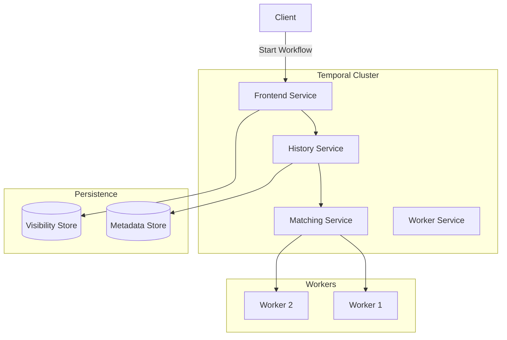
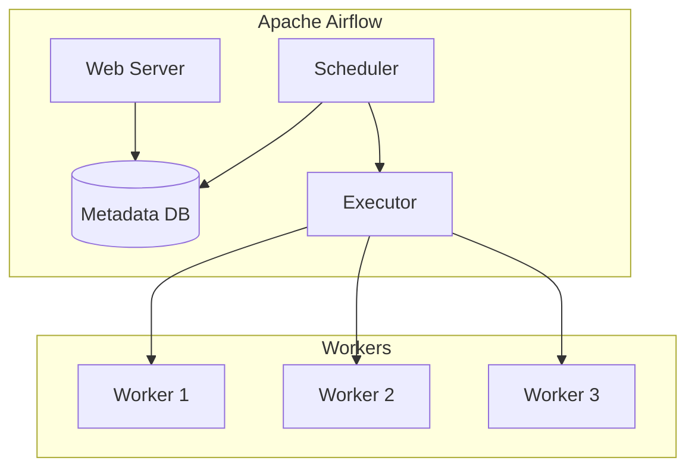
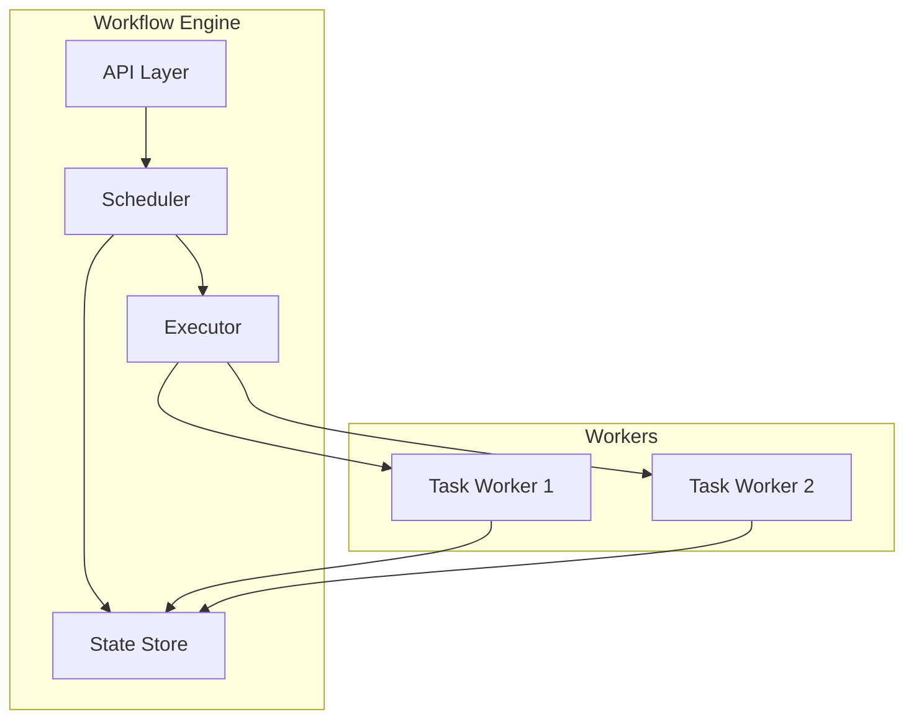

# 03.3 工作流引擎

---

📌 **内容摘要**

本文档深入探讨工作流引擎的核心原理和关键方法。内容涵盖工作流系统领域的主要知识点，包括工作流, BPMN, 编排等关键主题。适合有一定基础的学习者系统学习。

**关键词**: 工作流, BPMN, 编排, 工作流系统

📚 **学习目标**
- 掌握工作流引擎的核心概念和主要方法
- 理解相关理论的应用场景
- 建立该领域的系统性知识框架

🎯 **难度级别**: 中级

⏱️ **预计阅读时间**: 15分钟

**前置知识**: 相关领域的基础概念

---


## 目录

- [03.3 工作流引擎](#033-工作流引擎)
  - [目录](#目录)
  - [1. 概述](#1-概述)
  - [2. Cadence / Temporal](#2-cadence--temporal)
    - [2.1 架构](#21-架构)
    - [2.2 工作流定义](#22-工作流定义)
    - [2.3 Rust SDK](#23-rust-sdk)
    - [2.4 Go SDK](#24-go-sdk)
  - [3. Apache Airflow](#3-apache-airflow)
    - [3.1 架构](#31-架构)
    - [3.2 DAG 定义](#32-dag-定义)
    - [3.3 任务编排](#33-任务编排)
  - [4. 引擎对比](#4-引擎对比)
  - [5. 自研引擎设计](#5-自研引擎设计)
    - [5.1 核心组件](#51-核心组件)
    - [5.2 Rust 实现](#52-rust-实现)
  - [6. 相关文档](#6-相关文档)

## 1. 概述

工作流引擎是执行业务流程的核心基础设施，负责流程定义解析、状态管理、任务调度、错误处理等功能。

**主流引擎**：

- **Cadence/Temporal**：持久化工作流，适合长时间运行流程
- **Apache Airflow**：数据管道编排，适合批处理工作流
- **Camunda**：BPMN 标准引擎，适合业务流程

## 2. Cadence / Temporal

### 2.1 架构



### 2.2 工作流定义

```rust
use temporal_sdk::{ActivityOptions, WorkflowContext, WorkflowResult};
use temporal_client::WorkflowClientTrait;

// 工作流函数
#[workflow]
async fn order_workflow(ctx: WorkflowContext, order_id: String) -> WorkflowResult<String> {
    // 执行活动：检查库存
    let stock_result = ctx.activity(
        "check_inventory",
        ActivityOptions::default(),
        order_id.clone(),
    ).await?;

    if !stock_result.available {
        return Ok("Out of stock".to_string());
    }

    // 执行活动：处理支付
    let payment_result = ctx.activity(
        "process_payment",
        ActivityOptions::default(),
        order_id.clone(),
    ).await?;

    // 执行活动：发货
    let _ = ctx.activity(
        "ship_order",
        ActivityOptions::default(),
        order_id.clone(),
    ).await?;

    Ok("Order completed".to_string())
}

// 活动实现
#[activity]
async fn check_inventory(order_id: String) -> Result<StockResult, ActivityError> {
    // 查询库存
    Ok(StockResult { available: true })
}

#[activity]
async fn process_payment(order_id: String) -> Result<PaymentResult, ActivityError> {
    // 处理支付
    Ok(PaymentResult { success: true })
}

#[activity]
async fn ship_order(order_id: String) -> Result<ShipResult, ActivityError> {
    // 创建发货
    Ok(ShipResult { tracking_id: "TRK123".to_string() })
}
```

### 2.3 Rust SDK

```rust
use temporal_sdk::Worker;
use temporal_client::{Client, ClientOptionsBuilder};

#[tokio::main]
async fn main() -> Result<(), Box<dyn std::error::Error>> {
    // 连接 Temporal 服务器
    let client = Client::new(
        ClientOptionsBuilder::default()
            .target_url("http://localhost:7233".parse()?)
            .client_name("order-worker")
            .build()?,
    ).await?;

    // 创建工作流
    let handle = client
        .start_workflow(
            "order-queue".to_string(),
            "order-workflow".to_string(),
            "order-123".to_string(),
            None,
            WorkflowOptions::default(),
        )
        .await?;

    // 等待结果
    let result = handle.result().await?;
    println!("Workflow result: {:?}", result);

    Ok(())
}
```

### 2.4 Go SDK

```go
package main

import (
    "context"
    "fmt"
    "log"
    "time"

    "go.temporal.io/sdk/client"
    "go.temporal.io/sdk/worker"
    "go.temporal.io/sdk/workflow"
)

// OrderWorkflow workflow definition
func OrderWorkflow(ctx workflow.Context, orderID string) (string, error) {
    ao := workflow.ActivityOptions{
        StartToCloseTimeout: 10 * time.Second,
    }
    ctx = workflow.WithActivityOptions(ctx, ao)

    var stockResult StockResult
    err := workflow.ExecuteActivity(ctx, CheckInventory, orderID).Get(ctx, &stockResult)
    if err != nil || !stockResult.Available {
        return "", fmt.Errorf("out of stock")
    }

    var paymentResult PaymentResult
    err = workflow.ExecuteActivity(ctx, ProcessPayment, orderID).Get(ctx, &paymentResult)
    if err != nil {
        return "", err
    }

    var shipResult ShipResult
    err = workflow.ExecuteActivity(ctx, ShipOrder, orderID).Get(ctx, &shipResult)
    if err != nil {
        return "", err
    }

    return "Order completed", nil
}

// Activity implementations
func CheckInventory(ctx context.Context, orderID string) (StockResult, error) {
    // Check inventory logic
    return StockResult{Available: true}, nil
}

func ProcessPayment(ctx context.Context, orderID string) (PaymentResult, error) {
    // Process payment logic
    return PaymentResult{Success: true}, nil
}

func ShipOrder(ctx context.Context, orderID string) (ShipResult, error) {
    // Ship order logic
    return ShipResult{TrackingID: "TRK123"}, nil
}

func main() {
    // Create client
    c, err := client.NewClient(client.Options{})
    if err != nil {
        log.Fatalln("Unable to create client", err)
    }
    defer c.Close()

    // Create worker
    w := worker.New(c, "order-queue", worker.Options{})

    // Register workflow and activities
    w.RegisterWorkflow(OrderWorkflow)
    w.RegisterActivity(CheckInventory)
    w.RegisterActivity(ProcessPayment)
    w.RegisterActivity(ShipOrder)

    // Start worker
    err = w.Run(worker.InterruptCh())
    if err != nil {
        log.Fatalln("Unable to start worker", err)
    }
}
```

## 3. Apache Airflow

### 3.1 架构



### 3.2 DAG 定义

```python
from airflow import DAG
from airflow.operators.python import PythonOperator
from airflow.providers.postgres.operators.postgres import PostgresOperator
from airflow.utils.dates import days_ago
from datetime import timedelta

default_args = {
    'owner': 'data-team',
    'depends_on_past': False,
    'email': ['alert@example.com'],
    'email_on_failure': True,
    'email_on_retry': False,
    'retries': 3,
    'retry_delay': timedelta(minutes=5),
}

# DAG Definition
with DAG(
    'etl_pipeline',
    default_args=default_args,
    description='ETL pipeline for daily data processing',
    schedule_interval=timedelta(hours=1),
    start_date=days_ago(1),
    catchup=False,
    tags=['etl', 'production'],
) as dag:

    # Extract tasks
    extract_users = PostgresOperator(
        task_id='extract_users',
        sql='SELECT * FROM source.users WHERE updated_at > {{ ds }}',
        postgres_conn_id='source_db',
    )

    extract_orders = PostgresOperator(
        task_id='extract_orders',
        sql='SELECT * FROM source.orders WHERE created_at > {{ ds }}',
        postgres_conn_id='source_db',
    )

    # Transform task
    def transform_data(**context):
        """Transform extracted data"""
        # Get data from XCom
        users = context['ti'].xcom_pull(task_ids='extract_users')
        orders = context['ti'].xcom_pull(task_ids='extract_orders')

        # Transform logic
        transformed = {
            'user_count': len(users),
            'order_count': len(orders),
            'date': context['ds']
        }

        # Push to XCom
        context['ti'].xcom_push(key='transformed_data', value=transformed)
        return transformed

    transform = PythonOperator(
        task_id='transform_data',
        python_callable=transform_data,
        provide_context=True,
    )

    # Load task
    load_data = PostgresOperator(
        task_id='load_data',
        sql='''
            INSERT INTO warehouse.daily_stats (date, user_count, order_count)
            VALUES ('{{ ds }}',
                    {{ ti.xcom_pull(task_ids='transform_data', key='user_count') }},
                    {{ ti.xcom_pull(task_ids='transform_data', key='order_count') }})
        ''',
        postgres_conn_id='warehouse_db',
    )

    # Define dependencies
    [extract_users, extract_orders] >> transform >> load_data
```

### 3.3 任务编排

```python
from airflow import DAG
from airflow.operators.dummy import DummyOperator
from airflow.operators.python import BranchPythonOperator
from datetime import datetime, timedelta

def check_data_quality(**context):
    """Branch based on data quality check"""
    quality_score = context['ti'].xcom_pull(task_ids='data_quality_check')

    if quality_score >= 0.9:
        return 'process_data'
    elif quality_score >= 0.7:
        return 'manual_review'
    else:
        return 'alert_data_team'

with DAG(
    'conditional_pipeline',
    start_date=datetime(2024, 1, 1),
    schedule_interval='@daily',
) as dag:

    start = DummyOperator(task_id='start')

    data_quality_check = PythonOperator(
        task_id='data_quality_check',
        python_callable=lambda: 0.85,  # Return quality score
    )

    branch = BranchPythonOperator(
        task_id='branch',
        python_callable=check_data_quality,
        provide_context=True,
    )

    process_data = DummyOperator(task_id='process_data')
    manual_review = DummyOperator(task_id='manual_review')
    alert_data_team = DummyOperator(task_id='alert_data_team')

    end = DummyOperator(
        task_id='end',
        trigger_rule='one_success'  # Trigger if any upstream succeeds
    )

    start >> data_quality_check >> branch
    branch >> [process_data, manual_review, alert_data_team] >> end
```

## 4. 引擎对比

| 特性 | Temporal | Airflow | Camunda |
|------|----------|---------|---------|
| **主要场景** | 微服务编排 | 数据管道 | 业务流程 |
| **持久化** | 事件溯源 | 数据库 | 数据库 |
| **故障恢复** | 自动重放 | 重试机制 | 事务补偿 |
| **扩展性** | 高 | 中 | 中 |
| **学习曲线** | 中 | 低 | 中 |
| **云原生** | 是 | 是 | 部分 |
| **多语言** | Go/Java/TS | Python | Java |

## 5. 自研引擎设计

### 5.1 核心组件



### 5.2 Rust 实现

```rust
use std::collections::HashMap;
use async_trait::async_trait;
use serde::{Serialize, Deserialize};
use tokio::sync::{mpsc, RwLock};
use uuid::Uuid;

// 工作流定义
#[derive(Debug, Clone, Serialize, Deserialize)]
pub struct WorkflowDefinition {
    pub id: String,
    pub name: String,
    pub steps: Vec<StepDefinition>,
}

#[derive(Debug, Clone, Serialize, Deserialize)]
pub struct StepDefinition {
    pub id: String,
    pub name: String,
    pub step_type: StepType,
    pub next_steps: Vec<String>,
    pub retry_policy: Option<RetryPolicy>,
}

#[derive(Debug, Clone, Serialize, Deserialize)]
pub enum StepType {
    Task { handler: String },
    Condition { expression: String },
    Parallel { branches: Vec<String> },
    Wait { duration_secs: u64 },
}

// 工作流实例
#[derive(Debug, Clone, Serialize, Deserialize)]
pub struct WorkflowInstance {
    pub id: String,
    pub definition_id: String,
    pub status: WorkflowStatus,
    pub current_step: String,
    pub context: HashMap<String, serde_json::Value>,
    pub history: Vec<StepExecution>,
}

#[derive(Debug, Clone, Serialize, Deserialize)]
pub enum WorkflowStatus {
    Pending,
    Running,
    Completed,
    Failed,
    Cancelled,
}

// 引擎核心
pub struct WorkflowEngine {
    definitions: RwLock<HashMap<String, WorkflowDefinition>>,
    instances: RwLock<HashMap<String, WorkflowInstance>>,
    task_queue: mpsc::Sender<TaskMessage>,
    executors: Vec<Box<dyn TaskExecutor>>,
}

#[async_trait]
pub trait TaskExecutor: Send + Sync {
    async fn execute(&self, task: &TaskMessage) -> TaskResult;
}

impl WorkflowEngine {
    pub fn new() -> Self {
        let (tx, mut rx) = mpsc::channel(100);

        let engine = Self {
            definitions: RwLock::new(HashMap::new()),
            instances: RwLock::new(HashMap::new()),
            task_queue: tx,
            executors: Vec::new(),
        };

        // 启动调度器
        tokio::spawn(async move {
            while let Some(task) = rx.recv().await {
                // 分配任务到执行器
                println!("Processing task: {:?}", task);
            }
        });

        engine
    }

    pub async fn register_definition(&self, definition: WorkflowDefinition) {
        let mut defs = self.definitions.write().await;
        defs.insert(definition.id.clone(), definition);
    }

    pub async fn start_workflow(&self, definition_id: &str, context: HashMap<String, serde_json::Value>)
        -> Result<String, WorkflowError> {
        let definitions = self.definitions.read().await;
        let definition = definitions.get(definition_id)
            .ok_or(WorkflowError::DefinitionNotFound)?;

        let instance_id = Uuid::new_v4().to_string();
        let first_step = definition.steps.first()
            .ok_or(WorkflowError::EmptyWorkflow)?;

        let instance = WorkflowInstance {
            id: instance_id.clone(),
            definition_id: definition_id.to_string(),
            status: WorkflowStatus::Running,
            current_step: first_step.id.clone(),
            context,
            history: Vec::new(),
        };

        let mut instances = self.instances.write().await;
        instances.insert(instance_id.clone(), instance);

        // 调度第一步
        self.schedule_step(&instance_id, &first_step.id).await?;

        Ok(instance_id)
    }

    async fn schedule_step(&self, instance_id: &str, step_id: &str) -> Result<(), WorkflowError> {
        self.task_queue.send(TaskMessage {
            instance_id: instance_id.to_string(),
            step_id: step_id.to_string(),
        }).await.map_err(|_| WorkflowError::ScheduleError)?;

        Ok(())
    }

    pub async fn get_instance(&self, instance_id: &str) -> Option<WorkflowInstance> {
        let instances = self.instances.read().await;
        instances.get(instance_id).cloned()
    }
}

// 类型定义
#[derive(Debug)]
pub struct TaskMessage {
    pub instance_id: String,
    pub step_id: String,
}

#[derive(Debug)]
pub struct TaskResult {
    pub success: bool,
    pub output: Option<serde_json::Value>,
    pub error: Option<String>,
}

#[derive(Debug)]
pub struct StepExecution {
    pub step_id: String,
    pub started_at: chrono::DateTime<chrono::Utc>,
    pub completed_at: Option<chrono::DateTime<chrono::Utc>>,
    pub result: Option<TaskResult>,
}

#[derive(Debug)]
pub struct RetryPolicy {
    pub max_retries: u32,
    pub retry_delay_secs: u64,
}

#[derive(Debug)]
pub enum WorkflowError {
    DefinitionNotFound,
    EmptyWorkflow,
    ScheduleError,
}

#[tokio::main]
async fn main() {
    let engine = WorkflowEngine::new();

    // 注册工作流定义
    let definition = WorkflowDefinition {
        id: "order-process".to_string(),
        name: "Order Processing".to_string(),
        steps: vec![
            StepDefinition {
                id: "validate".to_string(),
                name: "Validate Order".to_string(),
                step_type: StepType::Task { handler: "validate_order".to_string() },
                next_steps: vec!["process".to_string()],
                retry_policy: Some(RetryPolicy { max_retries: 3, retry_delay_secs: 5 }),
            },
            StepDefinition {
                id: "process".to_string(),
                name: "Process Order".to_string(),
                step_type: StepType::Task { handler: "process_order".to_string() },
                next_steps: vec![],
                retry_policy: None,
            },
        ],
    };

    engine.register_definition(definition).await;

    // 启动工作流
    let context = [
        ("order_id".to_string(), serde_json::json!("ORD-123")),
        ("customer_id".to_string(), serde_json!("CUST-456")),
    ].into_iter().collect();

    let instance_id = engine.start_workflow("order-process", context).await.unwrap();
    println!("Started workflow instance: {}", instance_id);
}
```

## 6. 相关文档

- [03.1_工作流基础](./03.1_工作流基础.md) - 工作流建模
- [03.2_编排与编排](./03.2_编排与编排.md) - 协调模式
- [03.4_长时间运行流程](./03.4_长时间运行流程.md) - Saga 实现
- [01.3_行为型模式](../01_设计模式/01.3_行为型模式.md) - 状态机模式
---

## 📚 延伸阅读

- [02.1 微服务形式化模型](../02_微服务架构/02.1_微服务形式化模型.md)
- [02.1 微服务设计原则](../02_微服务架构/02.1_微服务设计原则.md)
- [04.3 任务调度](./06_调度系统/04_分布式调度/04.3_任务调度.md)
- [03.1 工作流基础](../03_工作流系统/03.1_工作流基础.md)
- [03.1 工作流形式化](../03_工作流系统/03.1_工作流形式化.md)
