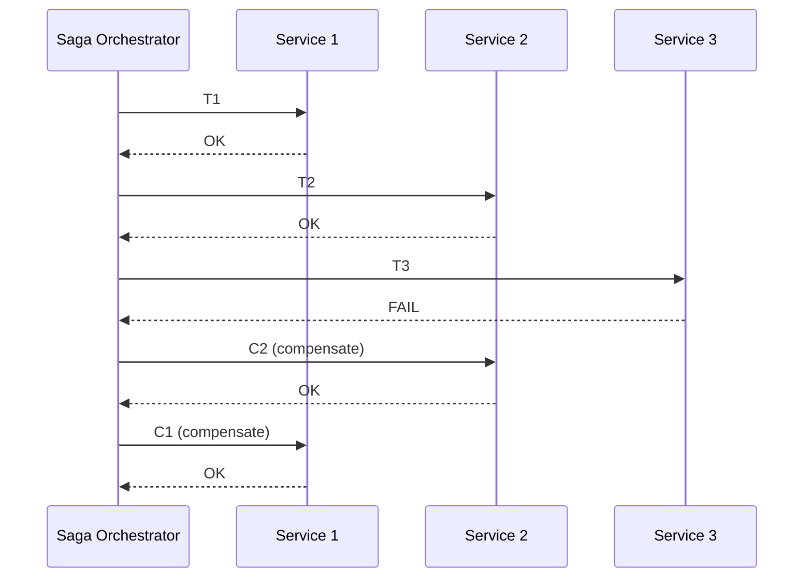
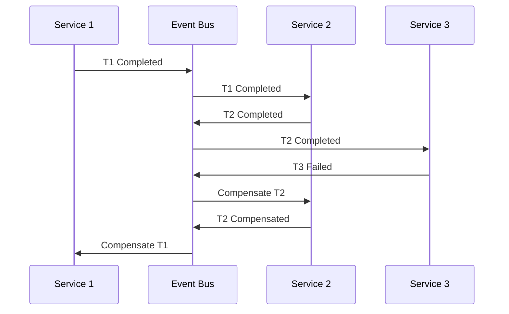
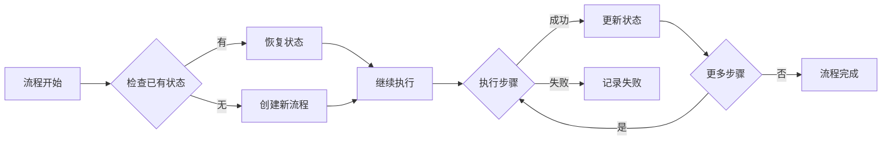

# 03.4 长时间运行流程

## 目录

- [03.4 长时间运行流程](#034-长时间运行流程)
  - [目录](#目录)
  - [1. 概述](#1-概述)
  - [2. Saga 模式](#2-saga-模式)
    - [2.1 形式化定义](#21-形式化定义)
    - [2.2 编排式 Saga](#22-编排式-saga)
    - [2.3 编排式 Saga](#23-编排式-saga)
    - [2.4 Rust 实现](#24-rust-实现)
  - [3. 补偿事务](#3-补偿事务)
    - [3.1 补偿策略](#31-补偿策略)
    - [3.2 实现模式](#32-实现模式)
  - [4. 超时处理](#4-超时处理)
  - [5. 持久化与恢复](#5-持久化与恢复)
  - [6. 相关文档](#6-相关文档)

## 1. 概述

长时间运行流程 (Long-Running Processes) 是跨越较长时间（可能数小时、数天甚至更长）的业务流程。这类流程需要特别考虑：

- **状态持久化**：流程状态需要持久化存储
- **故障恢复**：支持从中断点恢复
- **超时处理**：长时间等待的超时策略
- **补偿机制**：部分失败时的回滚能力

## 2. Saga 模式

### 2.1 形式化定义

Saga 是由一系列本地事务 $T = \{t_1, t_2, ..., t_n\}$ 组成的分布式事务，每个本地事务有对应的补偿事务 $C = \{c_1, c_2, ..., c_n\}$：

$$
Saga(T, C) = \begin{cases}
t_1 \circ t_2 \circ ... \circ t_n & \text{if all succeed} \\
c_i \circ c_{i-1} \circ ... \circ c_1 & \text{if } t_{i+1} \text{ fails}
\end{cases}
$$

其中 $\circ$ 表示事务组合。

### 2.2 编排式 Saga



### 2.3 编排式 Saga



### 2.4 Rust 实现

```rust
use async_trait::async_trait;
use serde::{Serialize, Deserialize};
use std::sync::Arc;
use tokio::sync::RwLock;
use uuid::Uuid;

// Saga 状态
# [derive(Debug, Clone, Serialize, Deserialize, PartialEq)]
pub enum SagaStatus {
    Started,
    InProgress { step: usize },
    Compensating { failed_step: usize },
    Completed,
    Failed,
    Compensated,
}

// Saga 步骤
# [async_trait]
pub trait SagaStep: Send + Sync {
    fn name(&self) -> &str;
    async fn execute(&self, ctx: &mut SagaContext) -> Result<(), SagaError>;
    async fn compensate(&self, ctx: &SagaContext) -> Result<(), SagaError>;
}

// Saga 上下文
# [derive(Debug, Clone, Serialize, Deserialize)]
pub struct SagaContext {
    pub saga_id: String,
    pub data: serde_json::Map<String, serde_json::Value>,
    pub execution_log: Vec<StepExecution>,
}

impl SagaContext {
    pub fn new() -> Self {
        Self {
            saga_id: Uuid::new_v4().to_string(),
            data: serde_json::Map::new(),
            execution_log: Vec::new(),
        }
    }

    pub fn set<T: Serialize>(&mut self, key: &str, value: T) {
        self.data.insert(key.to_string(), serde_json::to_value(value).unwrap());
    }

    pub fn get<T: for<'de> Deserialize<'de>>(&self, key: &str) -> Option<T> {
        self.data.get(key).and_then(|v| serde_json::from_value(v.clone()).ok())
    }
}

// Saga 编排器
pub struct SagaOrchestrator {
    steps: Vec<Arc<dyn SagaStep>>,
    persistence: Arc<dyn SagaPersistence>,
}

impl SagaOrchestrator {
    pub fn new(persistence: Arc<dyn SagaPersistence>) -> Self {
        Self {
            steps: Vec::new(),
            persistence,
        }
    }

    pub fn add_step(&mut self, step: Arc<dyn SagaStep>) {
        self.steps.push(step);
    }

    pub async fn execute(&self, mut ctx: SagaContext) -> Result<SagaContext, SagaError> {
        // 持久化初始状态
        self.persistence.save(&ctx.saga_id, &SagaState {
            status: SagaStatus::Started,
            context: ctx.clone(),
        }).await?;

        let mut executed_steps: Vec<usize> = Vec::new();

        for (idx, step) in self.steps.iter().enumerate() {
            // 更新状态
            self.persistence.save(&ctx.saga_id, &SagaState {
                status: SagaStatus::InProgress { step: idx },
                context: ctx.clone(),
            }).await?;

            // 执行步骤
            match step.execute(&mut ctx).await {
                Ok(()) => {
                    // 记录执行日志
                    ctx.execution_log.push(StepExecution {
                        step_name: step.name().to_string(),
                        executed_at: chrono::Utc::now(),
                        success: true,
                        error: None,
                    });
                    executed_steps.push(idx);
                }
                Err(e) => {
                    // 记录失败
                    ctx.execution_log.push(StepExecution {
                        step_name: step.name().to_string(),
                        executed_at: chrono::Utc::now(),
                        success: false,
                        error: Some(e.to_string()),
                    });

                    // 执行补偿
                    self.compensate(&ctx, &executed_steps).await?;

                    self.persistence.save(&ctx.saga_id, &SagaState {
                        status: SagaStatus::Failed,
                        context: ctx.clone(),
                    }).await?;

                    return Err(e);
                }
            }
        }

        // 完成
        self.persistence.save(&ctx.saga_id, &SagaState {
            status: SagaStatus::Completed,
            context: ctx.clone(),
        }).await?;

        Ok(ctx)
    }

    async fn compensate(&self, ctx: &SagaContext, executed: &[usize]) -> Result<(), SagaError> {
        for &idx in executed.iter().rev() {
            let step = &self.steps[idx];

            self.persistence.save(&ctx.saga_id, &SagaState {
                status: SagaStatus::Compensating { failed_step: idx },
                context: ctx.clone(),
            }).await?;

            if let Err(e) = step.compensate(ctx).await {
                // 补偿失败需要人工介入
                eprintln!("Compensation failed for step {}: {}", step.name(), e);
                // 可以发送告警、记录到死信队列等
            }
        }

        self.persistence.save(&ctx.saga_id, &SagaState {
            status: SagaStatus::Compensated,
            context: ctx.clone(),
        }).await?;

        Ok(())
    }
}

// 持久化接口
# [async_trait]
pub trait SagaPersistence: Send + Sync {
    async fn save(&self, saga_id: &str, state: &SagaState) -> Result<(), SagaError>;
    async fn load(&self, saga_id: &str) -> Result<Option<SagaState>, SagaError>;
}

// 具体实现示例：订单 Saga
pub struct ReserveInventoryStep;

# [async_trait]
impl SagaStep for ReserveInventoryStep {
    fn name(&self) -> &str {
        "ReserveInventory"
    }

    async fn execute(&self, ctx: &mut SagaContext) -> Result<(), SagaError> {
        let order_id: String = ctx.get("order_id").ok_or(SagaError::MissingData)?;
        println!("Reserving inventory for order: {}", order_id);

        // 实际业务逻辑：调用库存服务
        let reservation_id = format!("RES-{}-{}", order_id, Uuid::new_v4());
        ctx.set("inventory_reservation_id", &reservation_id);

        Ok(())
    }

    async fn compensate(&self, ctx: &SagaContext) -> Result<(), SagaError> {
        let reservation_id: String = ctx.get("inventory_reservation_id")
            .ok_or(SagaError::MissingData)?;
        println!("Releasing inventory reservation: {}", reservation_id);

        // 实际业务逻辑：释放库存
        Ok(())
    }
}

pub struct ProcessPaymentStep;

# [async_trait]
impl SagaStep for ProcessPaymentStep {
    fn name(&self) -> &str {
        "ProcessPayment"
    }

    async fn execute(&self, ctx: &mut SagaContext) -> Result<(), SagaError> {
        let order_id: String = ctx.get("order_id").ok_or(SagaError::MissingData)?;
        println!("Processing payment for order: {}", order_id);

        let payment_id = format!("PAY-{}-{}", order_id, Uuid::new_v4());
        ctx.set("payment_id", &payment_id);

        Ok(())
    }

    async fn compensate(&self, ctx: &SagaContext) -> Result<(), SagaError> {
        let payment_id: String = ctx.get("payment_id")
            .ok_or(SagaError::MissingData)?;
        println!("Refunding payment: {}", payment_id);

        Ok(())
    }
}

// 类型定义
# [derive(Debug, Clone, Serialize, Deserialize)]
pub struct SagaState {
    pub status: SagaStatus,
    pub context: SagaContext,
}

# [derive(Debug, Clone, Serialize, Deserialize)]
pub struct StepExecution {
    pub step_name: String,
    pub executed_at: chrono::DateTime<chrono::Utc>,
    pub success: bool,
    pub error: Option<String>,
}

# [derive(Debug)]
pub enum SagaError {
    ExecutionError(String),
    MissingData,
    PersistenceError(String),
}

impl std::fmt::Display for SagaError {
    fn fmt(&self, f: &mut std::fmt::Formatter<'_>) -> std::fmt::Result {
        match self {
            SagaError::ExecutionError(e) => write!(f, "Execution error: {}", e),
            SagaError::MissingData => write!(f, "Missing required data"),
            SagaError::PersistenceError(e) => write!(f, "Persistence error: {}", e),
        }
    }
}

impl std::error::Error for SagaError {}

# [tokio::main]
async fn main() {
    // 内存持久化实现（实际应使用数据库）
    struct InMemoryPersistence;

    #[async_trait]
    impl SagaPersistence for InMemoryPersistence {
        async fn save(&self, saga_id: &str, state: &SagaState) -> Result<(), SagaError> {
            println!("Saving saga {}: {:?}", saga_id, state.status);
            Ok(())
        }

        async fn load(&self, _saga_id: &str) -> Result<Option<SagaState>, SagaError> {
            Ok(None)
        }
    }

    let persistence: Arc<dyn SagaPersistence> = Arc::new(InMemoryPersistence);
    let mut saga = SagaOrchestrator::new(persistence);

    saga.add_step(Arc::new(ReserveInventoryStep));
    saga.add_step(Arc::new(ProcessPaymentStep));

    let mut ctx = SagaContext::new();
    ctx.set("order_id", "ORDER-123");
    ctx.set("amount", 100.0);

    match saga.execute(ctx).await {
        Ok(result) => println!("Saga completed: {:?}", result.data),
        Err(e) => println!("Saga failed: {}", e),
    }
}
```

## 3. 补偿事务

### 3.1 补偿策略

| 策略 | 描述 | 适用场景 |
|------|------|----------|
| 立即补偿 | 失败立即执行补偿 | 关键业务 |
| 延迟补偿 | 定时任务批量补偿 | 非关键业务 |
| 人工补偿 | 失败记录待人工处理 | 复杂业务 |
| 自动重试 | 失败后自动重试 | 临时故障 |

### 3.2 实现模式

```rust
// 补偿重试策略
pub struct CompensationPolicy {
    pub max_retries: u32,
    pub retry_delay: std::time::Duration,
    pub fallback: CompensationFallback,
}

pub enum CompensationFallback {
    Ignore,
    Alert,
    ManualIntervention,
    DeadLetterQueue,
}

// 幂等补偿
pub struct IdempotentCompensator<T> {
    compensations: Arc<RwLock<HashMap<String, CompensationRecord>>>,
    compensator: Box<dyn Fn(T) -> BoxFuture<'static, Result<(), CompensationError>> + Send + Sync>,
}

impl<T: Clone + Send + Sync + 'static> IdempotentCompensator<T> {
    pub async fn compensate(&self, id: &str, data: T) -> Result<(), CompensationError> {
        // 检查是否已补偿
        {
            let records = self.compensations.read().await;
            if let Some(record) = records.get(id) {
                if record.status == CompensationStatus::Completed {
                    return Ok(()); // 已补偿，幂等返回
                }
            }
        }

        // 执行补偿
        let result = (self.compensator)(data).await;

        // 记录结果
        {
            let mut records = self.compensations.write().await;
            records.insert(id.to_string(), CompensationRecord {
                id: id.to_string(),
                status: if result.is_ok() {
                    CompensationStatus::Completed
                } else {
                    CompensationStatus::Failed
                },
                executed_at: chrono::Utc::now(),
            });
        }

        result
    }
}
```

## 4. 超时处理

```rust
use tokio::time::{timeout, Duration};

pub struct TimeoutPolicy {
    pub total_timeout: Duration,
    pub step_timeout: Duration,
}

pub struct TimeoutSagaOrchestrator {
    inner: SagaOrchestrator,
    policy: TimeoutPolicy,
}

impl TimeoutSagaOrchestrator {
    pub async fn execute_with_timeout(&self, ctx: SagaContext) -> Result<SagaContext, SagaError> {
        match timeout(self.policy.total_timeout, self.inner.execute(ctx)).await {
            Ok(result) => result,
            Err(_) => Err(SagaError::ExecutionError("Saga timed out".to_string())),
        }
    }

    async fn execute_step_with_timeout(
        &self,
        step: &Arc<dyn SagaStep>,
        ctx: &mut SagaContext,
    ) -> Result<(), SagaError> {
        match timeout(self.policy.step_timeout, step.execute(ctx)).await {
            Ok(result) => result,
            Err(_) => Err(SagaError::ExecutionError(
                format!("Step {} timed out", step.name())
            )),
        }
    }
}
```

## 5. 持久化与恢复



```rust
// 恢复机制
impl SagaOrchestrator {
    pub async fn resume(&self, saga_id: &str) -> Result<SagaContext, SagaError> {
        let state = self.persistence.load(saga_id).await?
            .ok_or(SagaError::PersistenceError("Saga not found".to_string()))?;

        match state.status {
            SagaStatus::InProgress { step } => {
                // 从断点继续
                println!("Resuming saga {} from step {}", saga_id, step);
                self.resume_from_step(state.context, step).await
            }
            SagaStatus::Compensating { failed_step } => {
                // 继续补偿
                println!("Resuming compensation for saga {} at step {}", saga_id, failed_step);
                self.continue_compensation(state.context, failed_step).await
            }
            _ => Err(SagaError::ExecutionError(
                format!("Cannot resume saga with status {:?}", state.status)
            )),
        }
    }
}
```

## 6. 相关文档

- [03.1_工作流基础](./03.1_工作流基础.md) - 工作流建模
- [03.2_编排与编排](./03.2_编排与编排.md) - Saga 协调模式
- [03.3_工作流引擎](./03.3_工作流引擎.md) - 引擎实现
- [04.3_分布式事务](../04_分布式系统/04.3_分布式事务.md) - 分布式事务理论
