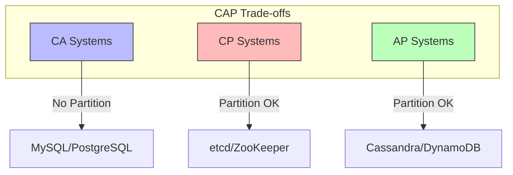
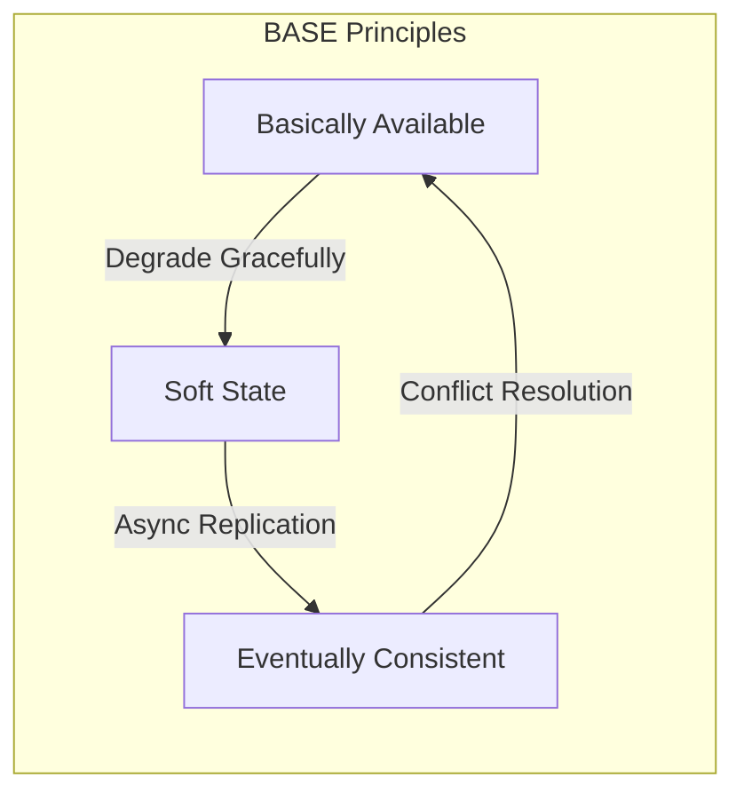
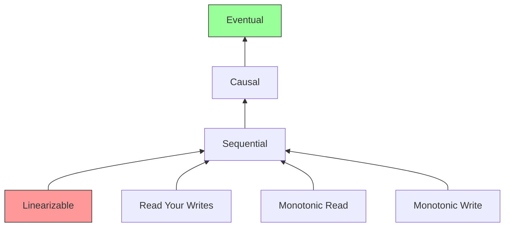

# 04.1 一致性模型

---

📌 **内容摘要**

本文档深入探讨一致性模型的核心原理和关键方法。内容涵盖分布式系统领域的主要知识点，包括最终一致性, 一致性模型, BPMN, 一致性, 编排等关键主题。适合具备相关基础的学习者进行深入研究。

**关键词**: 最终一致性, 一致性模型, BPMN, 一致性, 编排, 工作流, 共识算法, Raft

📚 **学习目标**
- 深入理解一致性模型的理论体系和形式化方法
- 能够进行相关定理的形式化证明
- 建立该领域的系统性知识框架

🎯 **难度级别**: 高级

⏱️ **预计阅读时间**: 15分钟

**前置知识**: 该领域的中级知识, 形式化方法基础

---


## 04.1.1 概述

一致性模型定义了分布式系统中数据副本之间的一致性行为。本节形式化描述 CAP、BASE 和线性一致性等核心概念。

> **交叉引用**: 与 [03.2 分布式事务](../03_工作流系统/03.2_分布式事务.md)、[04.2 共识算法](./04.2_共识算法形式化.md) 形成完整的分布式系统理论。

---

## 04.1.2 CAP 定理形式化

### 04.1.2.1 形式化定义

**定义 04.1.1** (CAP). CAP 定理指出分布式系统最多同时满足以下三项中的两项：

- **C** (Consistency): 一致性
- **A** (Availability): 可用性
- **P** (Partition Tolerance): 分区容错性

**定义 04.1.2** (一致性). 一致性要求所有节点在同一时间看到相同的数据：
$$\forall n_1, n_2 \in Nodes, \forall t: read_{n_1}(t) = read_{n_2}(t)$$

**定义 04.1.3** (可用性). 可用性要求每个请求都能收到非错误响应：
$$\forall req: \neg(timeout(req) \lor error(req))$$

**定义 04.1.4** (分区容错性). 分区容错性要求系统在任意网络分区下仍能运行：
$$\forall partition: system\ continues$$

### 04.1.2.2 形式化定理

**定理 04.1.1** (CAP 不可能性). 在网络分区存在时，系统不能同时保证一致性和可用性：
$$P \Rightarrow \neg(C \land A)$$

_证明概要_：

1. 假设网络分区将系统分为 $G_1$ 和 $G_2$
2. 写入 $G_1$ 的数据无法同步到 $G_2$
3. 若要保持一致性，$G_2$ 必须拒绝读取 $\Rightarrow$ 不可用
4. 若要保持可用性，$G_2$ 返回旧数据 $\Rightarrow$ 不一致$\square$

**定理 04.1.2** (PACELC). 扩展 CAP 定理：

- 若分区 (P)，在可用性 (A) 和一致性 (C) 之间选择
- 否则 (E)，在延迟 (L) 和一致性 (C) 之间选择

### 04.1.2.3 架构图



---

## 04.1.3 BASE 理论形式化

### 04.1.3.1 形式化定义

**定义 04.1.5** (BASE). BASE 是对 ACID 的替代，包含：

- **B**asically **A**vailable: 基本可用
- **S**oft state: 软状态
- **E**ventually consistent: 最终一致性

**定义 04.1.6** (基本可用). 系统在部分故障时仍提供核心功能：
$$BA: \forall req: P(response\ within\ degraded\ SLA) > 0$$

**定义 04.1.7** (软状态). 允许数据在没有外部输入的情况下变化：
$$SoftState: \exists t: state(t+1) \neq state(t) \land no\ input$$

**定义 04.1.8** (最终一致性). 若无新更新，所有副本最终一致：
$$\Diamond (\forall i, j: replica_i = replica_j)$$

### 04.1.3.2 形式化定理

**定理 04.1.3** (最终一致性收敛). 对于最终一致性系统，收敛时间有界：
$$T_{converge} \leq T_{sync} + T_{propagation}$$

### 04.1.3.3 架构图



---

## 04.1.4 一致性级别形式化

### 04.1.4.1 形式化定义

**定义 04.1.9** (线性一致性). 线性一致性要求操作表现得如同在某一瞬间原子完成：
$$\forall op_1, op_2: (op_1 \prec op_2) \Rightarrow (complete(op_1) < start(op_2))$$
其中 $\prec$ 表示 happens-before 关系。

**定义 04.1.10** (顺序一致性). 顺序一致性允许不同处理器看到不同的操作顺序，但每个处理器的操作顺序与其程序顺序一致。

**定义 04.1.11** (因果一致性). 因果一致性要求因果相关的操作对所有节点以相同顺序可见：
$$e_1 \leadsto e_2 \Rightarrow \forall n: order_n(e_1) < order_n(e_2)$$

**定义 04.1.12** (读己之写). 读己之写一致性保证客户端能读到自己的写入：
$$write_k(x, v) \leadsto read_k(x) \Rightarrow read_k(x) = v$$

**定义 04.1.13** (单调读). 单调读保证客户端不会读到旧值：
$$read_k(x, v_1) \leadsto read_k(x, v_2) \Rightarrow v_2 \geq v_1$$

**定义 04.1.14** (单调写). 单调写保证写操作按发出顺序执行：
$$write_k(x, v_1) \leadsto write_k(x, v_2) \Rightarrow order(write(v_1)) < order(write(v_2))$$

### 04.1.4.2 形式化定理

**定理 04.1.4** (一致性层次). 一致性级别形成偏序：
$$Linearizable \subset Sequential \subset Causal \subset Eventual$$

**定理 04.1.5** (单调读与读己之写). 单调读不蕴含读己之写：
$$MonotonicRead \nRightarrow ReadYourWrites$$

### 04.1.4.3 架构图



### 04.1.4.4 代码示例

**Rust 实现：**

```rust
use std::sync::Arc;
use std::collections::HashMap;
use tokio::sync::RwLock;

// 一致性级别
#[derive(Clone, Copy, Debug, PartialEq)]
pub enum ConsistencyLevel {
    Linearizable,   // 线性一致性
    Sequential,     // 顺序一致性
    Causal,         // 因果一致性
    MonotonicRead,  // 单调读
    ReadYourWrites, // 读己之写
    Eventual,       // 最终一致性
}

// 版本化值
#[derive(Clone, Debug)]
pub struct VersionedValue {
    pub value: String,
    pub version: u64,
    pub timestamp: u64,
    pub client_id: String,
}

// 分布式存储节点
pub struct StorageNode {
    data: Arc<RwLock<HashMap<String, Vec<VersionedValue>>>>,
    consistency_level: ConsistencyLevel,
    node_id: String,
}

impl StorageNode {
    pub fn new(node_id: String, level: ConsistencyLevel) -> Self {
        Self {
            data: Arc::new(RwLock::new(HashMap::new())),
            consistency_level: level,
            node_id,
        }
    }

    pub async fn write(&self, key: &str, value: &str, client_id: &str) -> Result<VersionedValue, StorageError> {
        let mut data = self.data.write().await;

        let versions = data.entry(key.to_string()).or_insert_with(Vec::new);
        let new_version = versions.last().map(|v| v.version + 1).unwrap_or(1);

        let versioned = VersionedValue {
            value: value.to_string(),
            version: new_version,
            timestamp: current_timestamp(),
            client_id: client_id.to_string(),
        };

        versions.push(versioned.clone());

        // 根据一致性级别决定是否等待复制
        match self.consistency_level {
            ConsistencyLevel::Linearizable | ConsistencyLevel::Sequential => {
                // 同步复制到多数节点
                self.replicate_sync(key, &versioned).await?;
            }
            _ => {
                // 异步复制
                self.replicate_async(key, versioned.clone());
            }
        }

        Ok(versioned)
    }

    pub async fn read(&self, key: &str, client_id: Option<&str>) -> Result<Option<VersionedValue>, StorageError> {
        let data = self.data.read().await;

        match data.get(key) {
            Some(versions) if !versions.is_empty() => {
                let value = match self.consistency_level {
                    ConsistencyLevel::Linearizable => {
                        // 读取最新已提交的版本
                        self.read_latest_committed(key).await?
                    }
                    ConsistencyLevel::ReadYourWrites => {
                        // 确保读到该客户端的写入
                        if let Some(cid) = client_id {
                            versions.iter()
                                .rev()
                                .find(|v| v.client_id == cid)
                                .or_else(|| versions.last())
                                .cloned()
                        } else {
                            versions.last().cloned()
                        }
                    }
                    ConsistencyLevel::MonotonicRead => {
                        // 返回最新版本
                        versions.last().cloned()
                    }
                    _ => versions.last().cloned(),
                };
                Ok(value)
            }
            _ => Ok(None),
        }
    }

    async fn replicate_sync(&self, _key: &str, _value: &VersionedValue) -> Result<(), StorageError> {
        // 同步复制实现
        Ok(())
    }

    fn replicate_async(&self, _key: &str, _value: VersionedValue) {
        // 异步复制实现
    }

    async fn read_latest_committed(&self, key: &str) -> Result<Option<VersionedValue>, StorageError> {
        // 查询多数节点获取最新已提交版本
        Ok(None)
    }
}

#[derive(Debug)]
pub enum StorageError {
    ReplicationFailed,
    QuorumNotReached,
}

fn current_timestamp() -> u64 {
    std::time::SystemTime::now()
        .duration_since(std::time::UNIX_EPOCH)
        .unwrap()
        .as_millis() as u64
}

// 因果一致性向量时钟
#[derive(Clone, Debug)]
pub struct CausalContext {
    vector_clock: HashMap<String, u64>,
}

impl CausalContext {
    pub fn new() -> Self {
        Self {
            vector_clock: HashMap::new(),
        }
    }

    pub fn increment(&mut self, node_id: &str) {
        *self.vector_clock.entry(node_id.to_string()).or_insert(0) += 1;
    }

    pub fn merge(&mut self, other: &CausalContext) {
        for (node, count) in &other.vector_clock {
            let current = self.vector_clock.get(node).copied().unwrap_or(0);
            self.vector_clock.insert(node.clone(), current.max(*count));
        }
    }

    pub fn happened_before(&self, other: &CausalContext) -> bool {
        // 检查 self 是否发生在 other 之前
        let mut all_less_or_equal = true;
        let mut at_least_one_less = false;

        for (node, count) in &self.vector_clock {
            let other_count = other.vector_clock.get(node).copied().unwrap_or(0);
            if *count > other_count {
                all_less_or_equal = false;
                break;
            }
            if *count < other_count {
                at_least_one_less = true;
            }
        }

        // 还需要检查 other 中不在 self 中的节点
        for (node, count) in &other.vector_clock {
            if !self.vector_clock.contains_key(node) && *count > 0 {
                at_least_one_less = true;
            }
        }

        all_less_or_equal && at_least_one_less
    }
}
```

**Java 实现：**

```java
import java.util.*;
import java.util.concurrent.*;
import java.util.concurrent.atomic.AtomicLong;

public class ConsistencyModels {

    // 一致性级别
    public enum ConsistencyLevel {
        LINEARIZABLE,   // 线性一致性
        SEQUENTIAL,     // 顺序一致性
        CAUSAL,         // 因果一致性
        READ_YOUR_WRITES,
        MONOTONIC_READ,
        EVENTUAL
    }

    // 版本化数据
    @Data
    public static class VersionedValue {
        private final String value;
        private final long version;
        private final long timestamp;
        private final String clientId;
    }

    // 分布式存储
    public class DistributedStore {

        private final Map<String, List<VersionedValue>> data = new ConcurrentHashMap<>();
        private final ConsistencyLevel consistencyLevel;
        private final String nodeId;

        public VersionedValue write(String key, String value, String clientId) {
            List<VersionedValue> versions = data.computeIfAbsent(key, k -> new CopyOnWriteArrayList<>());

            long newVersion = versions.isEmpty() ? 1 : versions.get(versions.size() - 1).getVersion() + 1;

            VersionedValue versioned = new VersionedValue(
                value, newVersion, System.currentTimeMillis(), clientId
            );

            versions.add(versioned);

            switch (consistencyLevel) {
                case LINEARIZABLE:
                case SEQUENTIAL:
                    replicateSync(key, versioned);
                    break;
                default:
                    replicateAsync(key, versioned);
            }

            return versioned;
        }

        public Optional<VersionedValue> read(String key, String clientId) {
            List<VersionedValue> versions = data.get(key);
            if (versions == null || versions.isEmpty()) {
                return Optional.empty();
            }

            switch (consistencyLevel) {
                case READ_YOUR_WRITES:
                    return versions.stream()
                        .filter(v -> v.getClientId().equals(clientId))
                        .findFirst()
                        .or(() -> Optional.of(versions.get(versions.size() - 1)));

                case MONOTONIC_READ:
                    return Optional.of(versions.get(versions.size() - 1));

                default:
                    return Optional.of(versions.get(versions.size() - 1));
            }
        }

        private void replicateSync(String key, VersionedValue value) {
            // 同步复制
        }

        private void replicateAsync(String key, VersionedValue value) {
            // 异步复制
        }
    }

    // 向量时钟实现因果一致性
    public class VectorClock {

        private final Map<String, Long> clock = new ConcurrentHashMap<>();

        public void increment(String nodeId) {
            clock.merge(nodeId, 1L, Long::sum);
        }

        public void merge(VectorClock other) {
            other.clock.forEach((node, count) ->
                clock.merge(node, count, Math::max));
        }

        public boolean happenedBefore(VectorClock other) {
            boolean allLessOrEqual = true;
            boolean atLeastOneLess = false;

            for (Map.Entry<String, Long> entry : clock.entrySet()) {
                Long otherCount = other.clock.get(entry.getKey());
                if (otherCount == null) otherCount = 0L;

                if (entry.getValue() > otherCount) {
                    allLessOrEqual = false;
                    break;
                }
                if (entry.getValue() < otherCount) {
                    atLeastOneLess = true;
                }
            }

            return allLessOrEqual && atLeastOneLess;
        }
    }
}
```

---

## 04.1.5 一致性模型比较

| 模型 | 保证 | 性能 | 适用场景 |
|------|------|------|---------|
| 线性一致性 | 最强 | 最低 | 金融交易 |
| 顺序一致性 | 强 | 低 | 多核内存 |
| 因果一致性 | 中等 | 中 | 社交网络 |
| 最终一致性 | 弱 | 高 | CDN、DNS |

> **交叉引用**: 一致性协议的实现请参考 [04.2 共识算法](./04.2_共识算法形式化.md)。
---

## 📚 延伸阅读

- [04.3 分布式事务](../04_分布式系统/04.3_分布式事务.md)
- [04.2 共识算法](../04_分布式系统/04.2_共识算法.md)
- [04.2 共识算法形式化](../04_分布式系统/04.2_共识算法形式化.md)
- [03.1 工作流基础](../03_工作流系统/03.1_工作流基础.md)
- [03.1 工作流形式化](../03_工作流系统/03.1_工作流形式化.md)
