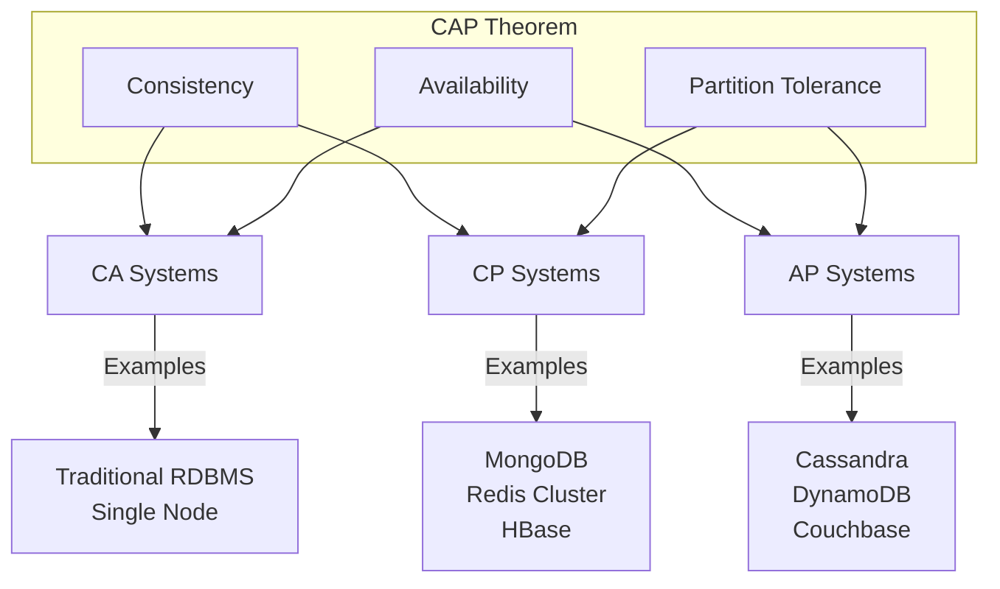
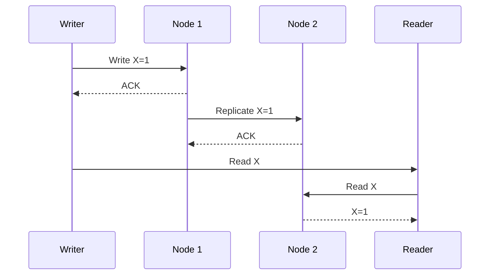
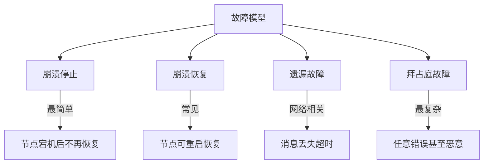

# 04.1 分布式基础

## 目录

- [04.1 分布式基础](#041-分布式基础)
  - [目录](#目录)
  - [1. 概述](#1-概述)
  - [2. CAP 定理](#2-cap-定理)
    - [2.1 形式化定义](#21-形式化定义)
    - [2.2 权衡选择](#22-权衡选择)
    - [2.3 系统分类](#23-系统分类)
  - [3. 一致性模型](#3-一致性模型)
    - [3.1 强一致性](#31-强一致性)
    - [3.2 弱一致性](#32-弱一致性)
    - [3.3 最终一致性](#33-最终一致性)
  - [4. 分布式时钟](#4-分布式时钟)
    - [4.1 物理时钟](#41-物理时钟)
    - [4.2 逻辑时钟](#42-逻辑时钟)
    - [4.3 向量时钟](#43-向量时钟)
  - [5. 故障模型](#5-故障模型)
  - [6. 相关文档](#6-相关文档)

## 1. 概述

分布式系统是由多个独立计算节点组成的系统，这些节点通过网络通信协调工作。理解分布式系统的基本理论对于设计可靠系统至关重要。

**核心挑战**：

- 网络不可靠
- 节点可能故障
- 时钟不同步
- 数据一致性

## 2. CAP 定理

### 2.1 形式化定义

CAP 定理指出分布式系统最多只能同时满足以下三个特性中的两个：

$$\forall System \in Distributed: |{C, A, P} \cap Properties(System)| \leq 2$$

其中：

- **C (Consistency)**：所有节点在同一时间看到相同数据
- **A (Availability)**：每个请求都能收到响应（不保证最新）
- **P (Partition Tolerance)**：系统在网络分区时仍能运行

### 2.2 权衡选择



### 2.3 系统分类

| 类型 | 特性 | 代表系统 | 适用场景 |
|------|------|----------|----------|
| **CP** | 牺牲可用性 | etcd, ZooKeeper, Consul | 配置中心、服务发现 |
| **AP** | 牺牲一致性 | Cassandra, DynamoDB | 日志、会话、社交 |
| **CA** | 非分布式 | MySQL, PostgreSQL | 单节点事务 |

## 3. 一致性模型

### 3.1 强一致性

**线性一致性 (Linearizability)**：

$$\forall ops: \text{if } op_1 \text{ completes before } op_2 \text{ starts, then } op_1 \prec op_2$$



**顺序一致性 (Sequential Consistency)**：

所有操作按某种全局顺序执行，每个节点的操作保持程序顺序。

### 3.2 弱一致性

**读写一致性 (Read-Your-Writes)**：

$$write(x) \prec read(x) \Rightarrow read(x) \text{ returns written value}$$

**单调读 (Monotonic Reads)**：

$$read_1(x) = v \land read_1 \prec read_2 \Rightarrow read_2(x) \geq v$$

**单调写 (Monotonic Writes)**：

$$write_1(x) \prec write_2(x) \Rightarrow write_1 \text{ applied before } write_2$$

### 3.3 最终一致性

**定义**：

$$\lim_{t \to \infty} P(data\_consistent(t)) = 1$$

**冲突解决策略**：

| 策略 | 描述 | 示例 |
|------|------|------|
| Last-Write-Wins | 时间戳最大的获胜 | DynamoDB |
| Vector Clocks | 检测并发冲突 | Riak |
| CRDTs | 无冲突复制数据类型 | Redis |

## 4. 分布式时钟

### 4.1 物理时钟

**时钟同步挑战**：

$$|C_i(t) - C_j(t)| \leq \epsilon$$

**NTP 协议**：

$$
delay = \frac{(t_4 - t_1) - (t_3 - t_2)}{2} \\
offset = \frac{(t_2 - t_1) + (t_3 - t_4)}{2}
$$

### 4.2 逻辑时钟

**Lamport 时间戳**：

$$
C_i = \begin{cases}
C_i + 1 & \text{local event} \\
max(C_i, C_j) + 1 & \text{message from } j
\end{cases}
$$

```rust
# [derive(Clone, Copy, Debug, PartialEq, Eq, PartialOrd, Ord)]
pub struct LamportClock {
    time: u64,
}

impl LamportClock {
    pub fn new() -> Self {
        Self { time: 0 }
    }

    pub fn tick(&mut self) {
        self.time += 1;
    }

    pub fn update(&mut self, other: LamportClock) {
        self.time = self.time.max(other.time) + 1;
    }

    pub fn time(&self) -> u64 {
        self.time
    }
}

// 使用示例
pub struct Process {
    id: u64,
    clock: LamportClock,
}

impl Process {
    pub fn send_message(&mut self) -> Message {
        self.clock.tick();
        Message {
            sender: self.id,
            timestamp: self.clock,
            payload: vec![],
        }
    }

    pub fn receive_message(&mut self, msg: &Message) {
        self.clock.update(msg.timestamp);
        self.clock.tick();
    }
}

pub struct Message {
    sender: u64,
    timestamp: LamportClock,
    payload: Vec<u8>,
}
```

### 4.3 向量时钟

**定义**：

$$VC_i = [c_1, c_2, ..., c_n]$$

$$VC_i[j] = \text{number of events known by } i \text{ from process } j$$

**比较规则**：

$$VC_1 \leq VC_2 \iff \forall k: VC_1[k] \leq VC_2[k]$$

$$VC_1 \parallel VC_2 \iff \neg(VC_1 \leq VC_2) \land \neg(VC_2 \leq VC_1)$$

```rust
# [derive(Clone, Debug)]
pub struct VectorClock {
    clocks: Vec<u64>,
    process_id: usize,
}

impl VectorClock {
    pub fn new(num_processes: usize, process_id: usize) -> Self {
        Self {
            clocks: vec![0; num_processes],
            process_id,
        }
    }

    pub fn tick(&mut self) {
        self.clocks[self.process_id] += 1;
    }

    pub fn update(&mut self, other: &VectorClock) {
        for i in 0..self.clocks.len() {
            self.clocks[i] = self.clocks[i].max(other.clocks[i]);
        }
    }

    pub fn compare(&self, other: &VectorClock) -> ClockRelation {
        let less = self.clocks.iter()
            .zip(other.clocks.iter())
            .all(|(a, b)| a <= b);
        let greater = self.clocks.iter()
            .zip(other.clocks.iter())
            .all(|(a, b)| a >= b);

        match (less, greater) {
            (true, true) => ClockRelation::Equal,
            (true, false) => ClockRelation::Before,
            (false, true) => ClockRelation::After,
            (false, false) => ClockRelation::Concurrent,
        }
    }
}

pub enum ClockRelation {
    Equal,
    Before,    // self happened before other
    After,     // self happened after other
    Concurrent,// concurrent events
}
```

## 5. 故障模型



**故障检测**：

```rust
use std::time::{Duration, Instant};
use std::collections::HashMap;

pub struct FailureDetector {
    heartbeats: HashMap<String, Instant>,
    timeout: Duration,
    suspects: HashMap<String, Instant>,
}

impl FailureDetector {
    pub fn new(timeout: Duration) -> Self {
        Self {
            heartbeats: HashMap::new(),
            timeout,
            suspects: HashMap::new(),
        }
    }

    pub fn heartbeat(&mut self, node_id: &str) {
        self.heartbeats.insert(node_id.to_string(), Instant::now());
        self.suspects.remove(node_id);
    }

    pub fn is_suspected(&self, node_id: &str) -> bool {
        if let Some(last_heartbeat) = self.heartbeats.get(node_id) {
            Instant::now().duration_since(*last_heartbeat) > self.timeout
        } else {
            true
        }
    }

    pub fn get_suspected(&self) -> Vec<String> {
        self.heartbeats.iter()
            .filter(|(_, last)| Instant::now().duration_since(**last) > self.timeout)
            .map(|(id, _)| id.clone())
            .collect()
    }
}
```

## 6. 相关文档

- [04.2_共识算法](./04.2_共识算法.md) - 分布式一致性算法
- [04.3_分布式事务](./04.3_分布式事务.md) - 事务处理
- [04.4_数据分区](./04.4_数据分区.md) - 分区策略
- [01.5_分布式模式](../01_设计模式/01.5_分布式模式.md) - 分布式设计模式
