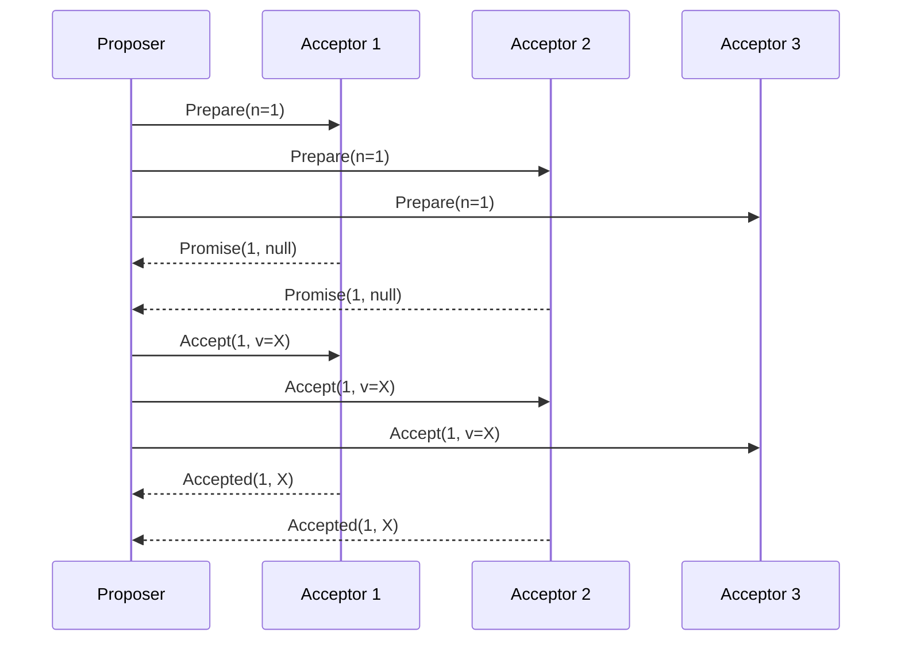
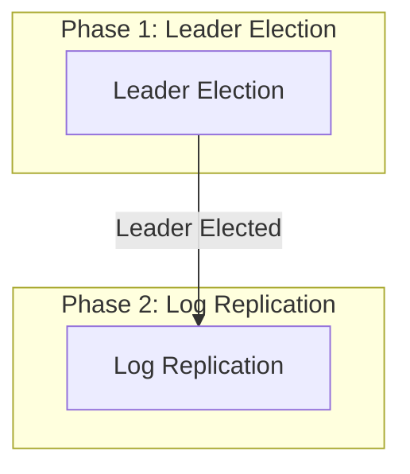
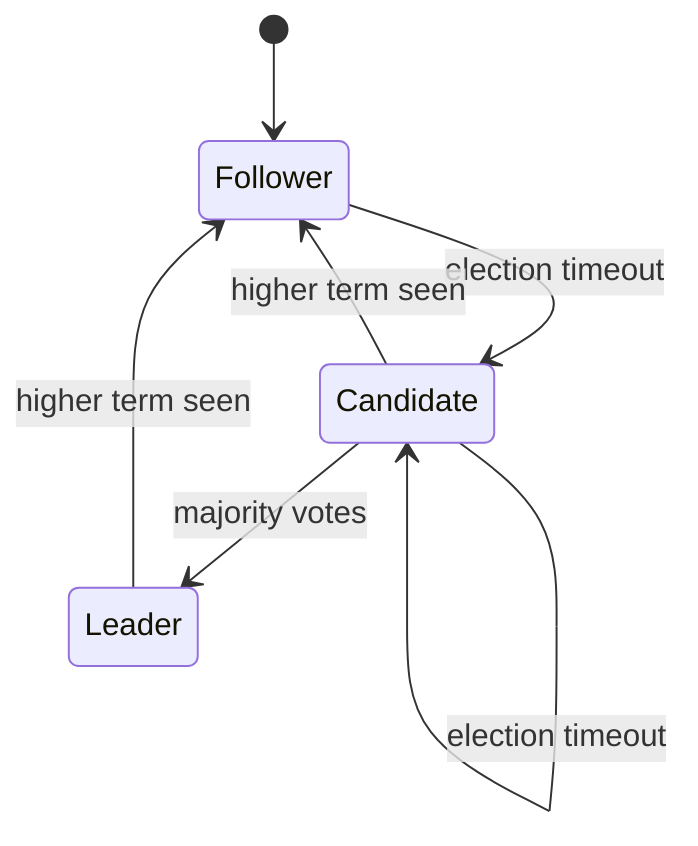
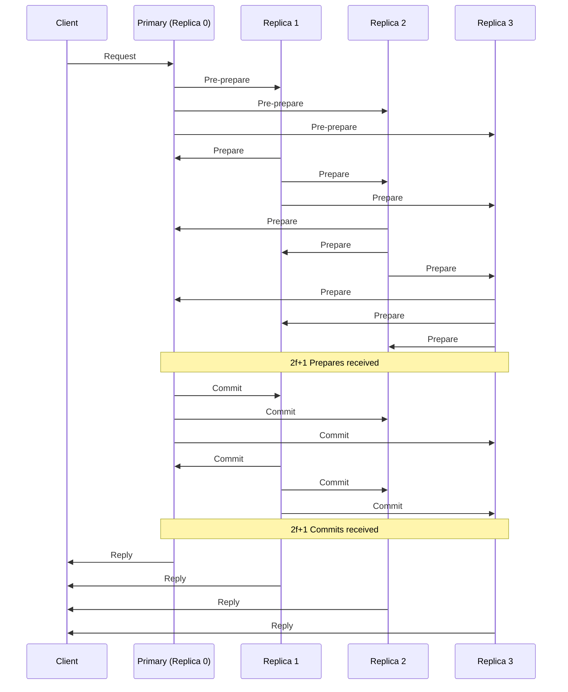

# 04.2 共识算法

---

📌 **内容摘要**

本文档深入探讨共识算法的核心原理和关键方法。内容涵盖分布式系统领域的主要知识点，包括一致性, 共识算法, Raft, Paxos等关键主题。适合具备相关基础的学习者进行深入研究。

**关键词**: 一致性, 共识算法, Raft, 分布式系统, Paxos

📚 **学习目标**
- 深入理解共识算法的理论体系和形式化方法
- 能够进行相关定理的形式化证明
- 建立该领域的系统性知识框架

🎯 **难度级别**: 高级

⏱️ **预计阅读时间**: 15分钟

**前置知识**: 该领域的中级知识, 形式化方法基础

---


## 目录

- [04.2 共识算法](#042-共识算法)
  - [目录](#目录)
  - [1. 概述](#1-概述)
  - [2. Paxos](#2-paxos)
    - [2.1 基本 Paxos](#21-基本-paxos)
    - [2.2 Multi-Paxos](#22-multi-paxos)
    - [2.3 Rust 实现](#23-rust-实现)
  - [3. Raft](#3-raft)
    - [3.1 算法原理](#31-算法原理)
    - [3.2 状态机](#32-状态机)
    - [3.3 Rust 实现](#33-rust-实现)
    - [3.4 Go 实现](#34-go-实现)
  - [4. PBFT](#4-pbft)
    - [4.1 拜占庭容错](#41-拜占庭容错)
    - [4.2 算法流程](#42-算法流程)
  - [5. 算法对比](#5-算法对比)
  - [6. 相关文档](#6-相关文档)

## 1. 概述

共识算法解决分布式系统中多个节点就某个值达成一致的协议。这是分布式系统的核心问题之一。

**共识要求**：

- **安全性 (Safety)**：一旦达成共识，值不会更改
- **活性 (Liveness)**：系统最终能够达成共识

## 2. Paxos

### 2.1 基本 Paxos

**角色**：

- **Proposer**：提议者
- **Acceptor**：接受者
- **Learner**：学习者

**两个阶段**：

$$Phase\ 1\ (Prepare):$$
$$Proposer \rightarrow Acceptors: Prepare(n)$$
$$Acceptors \rightarrow Proposer: Promise(n, v)$$

$$Phase\ 2\ (Accept):$$
$$Proposer \rightarrow Acceptors: Accept(n, v)$$
$$Acceptors \rightarrow Proposer: Accepted(n, v)$$



### 2.2 Multi-Paxos

Multi-Paxos 通过选出一个 Leader 来优化 Basic Paxos 的性能：



### 2.3 Rust 实现

```rust
use std::collections::HashMap;
use std::sync::{Arc, Mutex};

#[derive(Clone, Debug)]
pub struct Proposal {
    pub number: u64,
    pub value: String,
}

#[derive(Clone, Debug)]
pub struct Promise {
    pub proposal_number: u64,
    pub accepted_proposal: Option<Proposal>,
}

pub struct Acceptor {
    id: u64,
    promised_number: Arc<Mutex<u64>>,
    accepted_proposal: Arc<Mutex<Option<Proposal>>>,
}

impl Acceptor {
    pub fn new(id: u64) -> Self {
        Self {
            id,
            promised_number: Arc::new(Mutex::new(0)),
            accepted_proposal: Arc::new(Mutex::new(None)),
        }
    }

    pub fn prepare(&self, proposal_number: u64) -> Option<Promise> {
        let mut promised = self.promised_number.lock().unwrap();

        if proposal_number > *promised {
            *promised = proposal_number;
            let accepted = self.accepted_proposal.lock().unwrap().clone();

            Some(Promise {
                proposal_number,
                accepted_proposal: accepted,
            })
        } else {
            None
        }
    }

    pub fn accept(&self, proposal: &Proposal) -> bool {
        let promised = *self.promised_number.lock().unwrap();

        if proposal.number >= promised {
            let mut accepted = self.accepted_proposal.lock().unwrap();
            *accepted = Some(proposal.clone());
            true
        } else {
            false
        }
    }
}

pub struct Proposer {
    id: u64,
    acceptors: Vec<Arc<Acceptor>>,
    majority: usize,
}

impl Proposer {
    pub fn new(id: u64, acceptors: Vec<Arc<Acceptor>>) -> Self {
        let majority = acceptors.len() / 2 + 1;
        Self { id, acceptors, majority }
    }

    pub fn propose(&self, value: String) -> Result<String, &'static str> {
        let proposal_number = self.generate_proposal_number();
        let proposal = Proposal { number: proposal_number, value };

        // Phase 1: Prepare
        let mut promises = Vec::new();
        for acceptor in &self.acceptors {
            if let Some(promise) = acceptor.prepare(proposal_number) {
                promises.push(promise);
            }

            if promises.len() >= self.majority {
                break;
            }
        }

        if promises.len() < self.majority {
            return Err("Failed to get majority promises");
        }

        // 检查是否已有接受的值
        let final_value = promises.iter()
            .filter_map(|p| p.accepted_proposal.as_ref())
            .max_by_key(|p| p.number)
            .map(|p| p.value.clone())
            .unwrap_or_else(|| proposal.value.clone());

        // Phase 2: Accept
        let accept_proposal = Proposal {
            number: proposal_number,
            value: final_value.clone(),
        };

        let mut accepts = 0;
        for acceptor in &self.acceptors {
            if acceptor.accept(&accept_proposal) {
                accepts += 1;
            }

            if accepts >= self.majority {
                return Ok(final_value);
            }
        }

        Err("Failed to get majority accepts")
    }

    fn generate_proposal_number(&self) -> u64 {
        use std::time::{SystemTime, UNIX_EPOCH};
        let timestamp = SystemTime::now()
            .duration_since(UNIX_EPOCH)
            .unwrap()
            .as_millis() as u64;
        timestamp << 8 | self.id
    }
}
```

## 3. Raft

### 3.1 算法原理

Raft 将共识问题分解为三个子问题：

- **Leader 选举**：选出一个 Leader 处理所有请求
- **日志复制**：Leader 将日志条目复制到所有节点
- **安全性**：保证日志一致性

### 3.2 状态机



**任期 (Term)**：

$$Term \in \mathbb{N}, \text{单调递增}$$

每个 Term 最多一个 Leader。

### 3.3 Rust 实现

```rust
use std::collections::HashMap;
use std::sync::{Arc, Mutex};
use std::time::{Duration, Instant};
use tokio::time::{sleep, timeout};
use serde::{Serialize, Deserialize};

#[derive(Clone, Copy, Debug, PartialEq, Eq)]
pub enum NodeState {
    Follower,
    Candidate,
    Leader,
}

#[derive(Clone, Debug, Serialize, Deserialize)]
pub struct LogEntry {
    pub term: u64,
    pub index: u64,
    pub command: String,
}

#[derive(Clone, Debug)]
pub struct RaftNode {
    pub id: u64,
    pub state: Arc<Mutex<NodeState>>,
    pub current_term: Arc<Mutex<u64>>,
    pub voted_for: Arc<Mutex<Option<u64>>>,
    pub log: Arc<Mutex<Vec<LogEntry>>>,
    pub commit_index: Arc<Mutex<u64>>,
    pub last_applied: Arc<Mutex<u64>>,

    // Leader state
    pub next_index: Arc<Mutex<HashMap<u64, u64>>>,
    pub match_index: Arc<Mutex<HashMap<u64, u64>>>,

    // Timing
    pub election_timeout: Duration,
    pub last_heartbeat: Arc<Mutex<Instant>>,
}

// RPC Messages
#[derive(Clone, Debug, Serialize, Deserialize)]
pub struct RequestVoteRequest {
    pub term: u64,
    pub candidate_id: u64,
    pub last_log_index: u64,
    pub last_log_term: u64,
}

#[derive(Clone, Debug, Serialize, Deserialize)]
pub struct RequestVoteResponse {
    pub term: u64,
    pub vote_granted: bool,
}

#[derive(Clone, Debug, Serialize, Deserialize)]
pub struct AppendEntriesRequest {
    pub term: u64,
    pub leader_id: u64,
    pub prev_log_index: u64,
    pub prev_log_term: u64,
    pub entries: Vec<LogEntry>,
    pub leader_commit: u64,
}

#[derive(Clone, Debug, Serialize, Deserialize)]
pub struct AppendEntriesResponse {
    pub term: u64,
    pub success: bool,
    pub match_index: u64,
}

impl RaftNode {
    pub fn new(id: u64, peers: Vec<u64>) -> Self {
        Self {
            id,
            state: Arc::new(Mutex::new(NodeState::Follower)),
            current_term: Arc::new(Mutex::new(0)),
            voted_for: Arc::new(Mutex::new(None)),
            log: Arc::new(Mutex::new(vec![])),
            commit_index: Arc::new(Mutex::new(0)),
            last_applied: Arc::new(Mutex::new(0)),
            next_index: Arc::new(Mutex::new(HashMap::new())),
            match_index: Arc::new(Mutex::new(HashMap::new())),
            election_timeout: Duration::from_millis(150 + (id * 50)),
            last_heartbeat: Arc::new(Mutex::new(Instant::now())),
        }
    }

    pub fn request_vote(&self, req: RequestVoteRequest) -> RequestVoteResponse {
        let mut current_term = self.current_term.lock().unwrap();
        let mut voted_for = self.voted_for.lock().unwrap();

        if req.term < *current_term {
            return RequestVoteResponse {
                term: *current_term,
                vote_granted: false,
            };
        }

        if req.term > *current_term {
            *current_term = req.term;
            *voted_for = None;
            *self.state.lock().unwrap() = NodeState::Follower;
        }

        let vote_granted = (voted_for.is_none() || voted_for == Some(req.candidate_id))
            && self.is_log_up_to_date(req.last_log_index, req.last_log_term);

        if vote_granted {
            *voted_for = Some(req.candidate_id);
        }

        RequestVoteResponse {
            term: *current_term,
            vote_granted,
        }
    }

    pub fn append_entries(&self, req: AppendEntriesRequest) -> AppendEntriesResponse {
        let mut current_term = self.current_term.lock().unwrap();
        let mut state = self.state.lock().unwrap();
        let mut last_heartbeat = self.last_heartbeat.lock().unwrap();

        if req.term < *current_term {
            return AppendEntriesResponse {
                term: *current_term,
                success: false,
                match_index: 0,
            };
        }

        *last_heartbeat = Instant::now();

        if req.term > *current_term {
            *current_term = req.term;
            *self.voted_for.lock().unwrap() = None;
        }

        *state = NodeState::Follower;

        // Log consistency check
        let log = self.log.lock().unwrap();
        if req.prev_log_index > 0 {
            if log.len() < req.prev_log_index as usize {
                return AppendEntriesResponse {
                    term: *current_term,
                    success: false,
                    match_index: log.len() as u64,
                };
            }

            if log[req.prev_log_index as usize - 1].term != req.prev_log_term {
                return AppendEntriesResponse {
                    term: *current_term,
                    success: false,
                    match_index: 0,
                };
            }
        }

        drop(log);

        // Append entries
        let mut log = self.log.lock().unwrap();
        for entry in req.entries {
            if entry.index <= log.len() as u64 {
                if log[entry.index as usize - 1].term != entry.term {
                    log.truncate(entry.index as usize - 1);
                    log.push(entry);
                }
            } else {
                log.push(entry);
            }
        }

        // Update commit index
        if req.leader_commit > *self.commit_index.lock().unwrap() {
            *self.commit_index.lock().unwrap() = req.leader_commit.min(log.len() as u64);
        }

        AppendEntriesResponse {
            term: *current_term,
            success: true,
            match_index: log.len() as u64,
        }
    }

    fn is_log_up_to_date(&self, last_index: u64, last_term: u64) -> bool {
        let log = self.log.lock().unwrap();
        let my_last_index = log.len() as u64;
        let my_last_term = log.last().map(|e| e.term).unwrap_or(0);

        last_term > my_last_term || (last_term == my_last_term && last_index >= my_last_index)
    }
}
```

### 3.4 Go 实现

```go
package main

import (
    "fmt"
    "math/rand"
    "sync"
    "time"
)

type NodeState int

const (
    Follower NodeState = iota
    Candidate
    Leader
)

type LogEntry struct {
    Term    int
    Index   int
    Command string
}

type RaftNode struct {
    id       int
    state    NodeState
    mu       sync.Mutex

    currentTerm int
    votedFor    int
    log         []LogEntry
    commitIndex int
    lastApplied int

    // Leader state
    nextIndex  map[int]int
    matchIndex map[int]int

    // Channels
    voteCh      chan RequestVoteRequest
    appendCh    chan AppendEntriesRequest

    // Timing
    electionTimeout  time.Duration
    lastHeartbeat    time.Time
}

type RequestVoteRequest struct {
    Term         int
    CandidateID  int
    LastLogIndex int
    LastLogTerm  int
}

type RequestVoteResponse struct {
    Term        int
    VoteGranted bool
}

type AppendEntriesRequest struct {
    Term         int
    LeaderID     int
    PrevLogIndex int
    PrevLogTerm  int
    Entries      []LogEntry
    LeaderCommit int
}

type AppendEntriesResponse struct {
    Term       int
    Success    bool
    MatchIndex int
}

func NewRaftNode(id int, peers []int) *RaftNode {
    return &RaftNode{
        id:              id,
        state:           Follower,
        votedFor:        -1,
        log:             make([]LogEntry, 0),
        nextIndex:       make(map[int]int),
        matchIndex:      make(map[int]int),
        voteCh:          make(chan RequestVoteRequest),
        appendCh:        make(chan AppendEntriesRequest),
        electionTimeout: time.Duration(150+rand.Intn(150)) * time.Millisecond,
    }
}

func (n *RaftNode) RequestVote(req RequestVoteRequest) RequestVoteResponse {
    n.mu.Lock()
    defer n.mu.Unlock()

    if req.Term < n.currentTerm {
        return RequestVoteResponse{Term: n.currentTerm, VoteGranted: false}
    }

    if req.Term > n.currentTerm {
        n.currentTerm = req.Term
        n.votedFor = -1
        n.state = Follower
    }

    voteGranted := (n.votedFor == -1 || n.votedFor == req.CandidateID) &&
        n.isLogUpToDate(req.LastLogIndex, req.LastLogTerm)

    if voteGranted {
        n.votedFor = req.CandidateID
    }

    return RequestVoteResponse{Term: n.currentTerm, VoteGranted: voteGranted}
}

func (n *RaftNode) AppendEntries(req AppendEntriesRequest) AppendEntriesResponse {
    n.mu.Lock()
    defer n.mu.Unlock()

    n.lastHeartbeat = time.Now()

    if req.Term < n.currentTerm {
        return AppendEntriesResponse{Term: n.currentTerm, Success: false}
    }

    if req.Term > n.currentTerm {
        n.currentTerm = req.Term
        n.votedFor = -1
        n.state = Follower
    }

    n.state = Follower

    // Log consistency check
    if req.PrevLogIndex > 0 {
        if len(n.log) < req.PrevLogIndex {
            return AppendEntriesResponse{
                Term:       n.currentTerm,
                Success:    false,
                MatchIndex: len(n.log),
            }
        }

        if n.log[req.PrevLogIndex-1].Term != req.PrevLogTerm {
            return AppendEntriesResponse{Term: n.currentTerm, Success: false}
        }
    }

    // Append entries
    for _, entry := range req.Entries {
        if entry.Index <= len(n.log) {
            if n.log[entry.Index-1].Term != entry.Term {
                n.log = n.log[:entry.Index-1]
                n.log = append(n.log, entry)
            }
        } else {
            n.log = append(n.log, entry)
        }
    }

    if req.LeaderCommit > n.commitIndex {
        n.commitIndex = min(req.LeaderCommit, len(n.log))
    }

    return AppendEntriesResponse{
        Term:       n.currentTerm,
        Success:    true,
        MatchIndex: len(n.log),
    }
}

func (n *RaftNode) isLogUpToDate(lastIndex, lastTerm int) bool {
    myLastIndex := len(n.log)
    myLastTerm := 0
    if myLastIndex > 0 {
        myLastTerm = n.log[myLastIndex-1].Term
    }

    return lastTerm > myLastTerm || (lastTerm == myLastTerm && lastIndex >= myLastIndex)
}

func min(a, b int) int {
    if a < b {
        return a
    }
    return b
}
```

## 4. PBFT

### 4.1 拜占庭容错

拜占庭容错要求系统在 $f$ 个节点故障时仍能正常工作：

$$N \geq 3f + 1$$

**容错能力**：

- 可容忍任意故障（包括恶意行为）
- 需要 $2f + 1$ 个节点达成共识

### 4.2 算法流程



## 5. 算法对比

| 算法 | 容错类型 | 节点数要求 | 性能 | 复杂度 | 典型应用 |
|------|---------|-----------|------|--------|----------|
| Paxos | 崩溃容错 | $2f + 1$ | 中 | 高 | Chubby |
| Raft | 崩溃容错 | $2f + 1$ | 高 | 低 | etcd, TiKV |
| PBFT | 拜占庭容错 | $3f + 1$ | 低 | 高 | 区块链 |
| ZAB | 崩溃容错 | $2f + 1$ | 高 | 中 | ZooKeeper |

## 6. 相关文档

- [04.1_分布式基础](./04.1_分布式基础.md) - CAP 与一致性模型
- [04.3_分布式事务](./04.3_分布式事务.md) - 事务一致性
- [04.4_数据分区](./04.4_数据分区.md) - 分区策略
---

## 📋 前置知识

- [04.1 一致性模型](../04_分布式系统/04.1_一致性模型.md)

---

## 📚 延伸阅读

- [04.3 分布式事务](../04_分布式系统/04.3_分布式事务.md)
- [04.2 共识算法形式化](../04_分布式系统/04.2_共识算法形式化.md)
- [04.1 一致性模型](../04_分布式系统/04.1_一致性模型.md)
- [04.1 分布式基础](../04_分布式系统/04.1_分布式基础.md)
- [04.4 数据分区](../04_分布式系统/04.4_数据分区.md)
