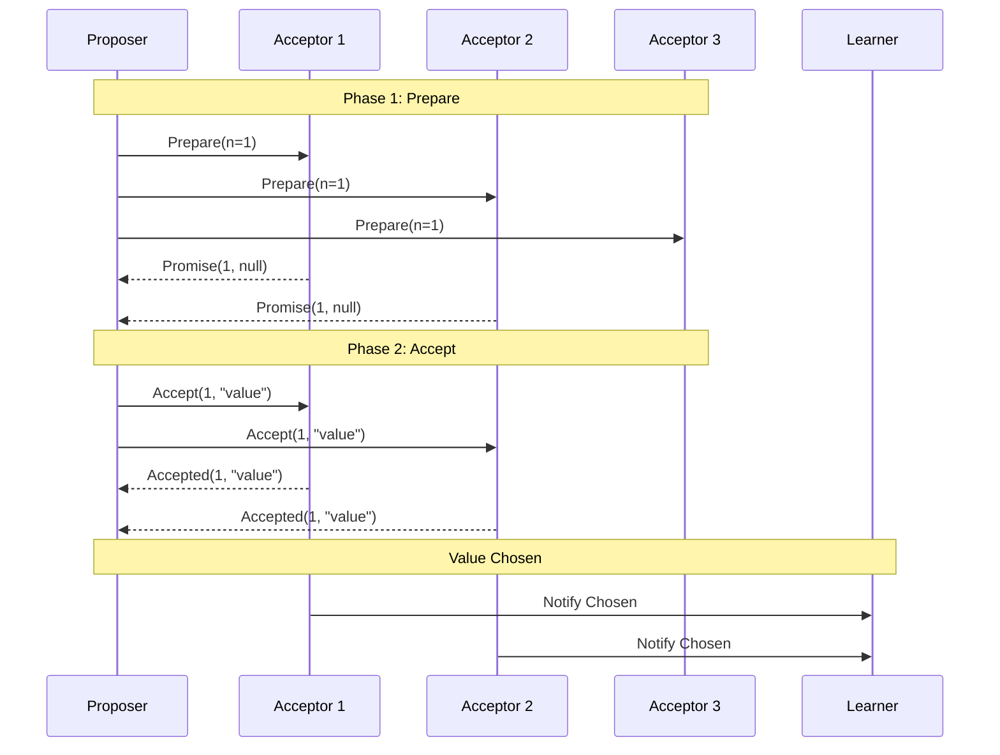
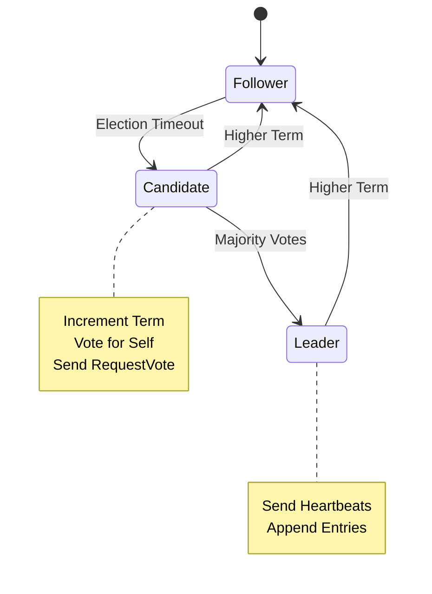
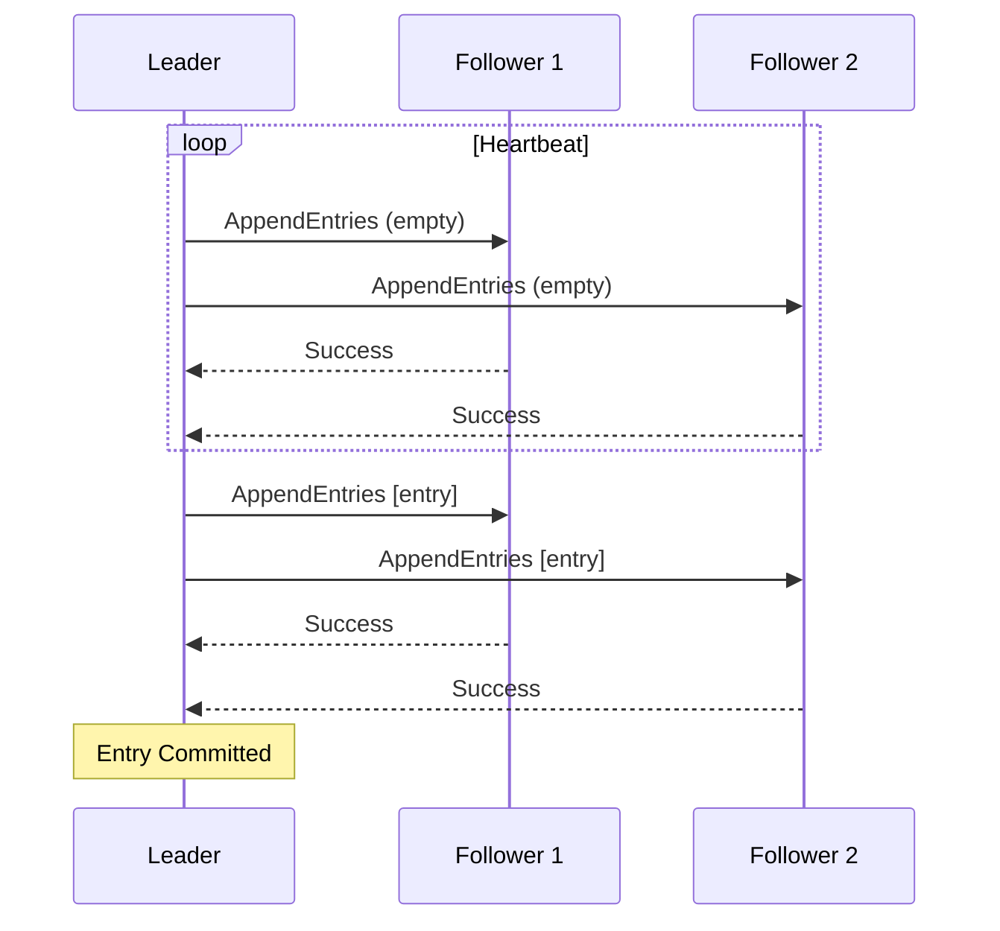

# 04.2 共识算法形式化

## 04.2.1 概述

共识算法是分布式系统中使多个节点就某个值达成一致的核心机制。本节形式化描述 Paxos 和 Raft 两种经典算法。

> **交叉引用**: 与 [04.1 一致性模型](./04.1_一致性模型.md)、[04.3 分布式时钟](./04.3_分布式时钟.md) 形成完整的分布式系统理论。

---

## 04.2.2 共识问题形式化

### 04.2.2.1 形式化定义

**定义 04.2.1** (共识问题). 在 $n$ 个进程的系统中，每个进程 $p_i$ 提议一个值 $v_i$，共识要求满足：

- **终止性 (Termination)**: 每个正确进程最终决策
- **一致性 (Agreement)**: 所有正确进程决策相同
- **有效性 (Validity)**: 决策值必须是某个进程提议的值

**定义 04.2.2** (拜占庭容错). 拜占庭故障模型下，进程可能任意行为。拜占庭容错要求：
$$n \geq 3f + 1$$
其中 $f$ 是故障节点数。

**定义 04.2.3** (崩溃容错). 崩溃故障模型下，进程只是停止运行：
$$n \geq 2f + 1$$

### 04.2.2.2 形式化定理

**定理 04.2.1** (FLP 不可能性). 在异步系统中，即使只有一个故障进程，也不存在确定性共识算法。

**定理 04.2.2** (多数派原则). 崩溃容错系统需要多数派达成一致：
$$quorum = \lfloor \frac{n}{2} \rfloor + 1$$

---

## 04.2.3 Paxos 形式化

### 04.2.3.1 形式化定义

**定义 04.2.4** (Paxos 角色). Paxos 包含三种角色：

- **Proposer**: 提出提案
- **Acceptor**: 接受提案
- **Learner**: 学习已选定的值

**定义 04.2.5** (提案). 提案 $P$ 是一个二元组：
$$P = (n, v)$$
其中 $n$ 是提案编号，$v$ 是提案值。

**定义 04.2.6** (Paxos 两阶段). Paxos 分为两个阶段：

**阶段一 (Prepare)**:

1. Proposer 发送 $Prepare(n)$ 给 Acceptor 多数派
2. Acceptor 回复 $Promise(n, (n', v'))$，承诺不接受小于 $n$ 的提案

**阶段二 (Accept)**:

1. Proposer 收到多数 Promise 后，选择最大 $n'$ 对应的 $v'$，或自己的值
2. 发送 $Accept(n, v)$ 给 Acceptor 多数派
3. Acceptor 接受提案（若 $n$ 是见过的最大编号）

### 04.2.3.2 形式化定理

**定理 04.2.3** (Paxos 安全性). Paxos 保证最多一个值被选定。

_证明_：

1. 假设两个值 $v_1$ 和 $v_2$ 都被选定
2. 则存在多数派 $Q_1$ 接受 $v_1$，多数派 $Q_2$ 接受 $v_2$
3. $Q_1 \cap Q_2 \neq \emptyset$（鸽巢原理）
4. 交集节点接受了两个不同值，矛盾$\square$

**定理 04.2.4** (Paxos 活性). 若存在多数派正确运行且消息最终送达，则最终会有值被选定。

### 04.2.3.3 架构图



### 04.2.3.4 代码示例

**Rust 实现：**

```rust
use std::collections::{HashMap, HashSet};
use std::sync::{Arc, Mutex};

// 提案
#[derive(Clone, Debug, PartialEq)]
pub struct Proposal {
    pub number: u64,
    pub value: String,
}

impl Proposal {
    pub fn new(number: u64, value: &str) -> Self {
        Self {
            number,
            value: value.to_string(),
        }
    }
}

// Acceptor
pub struct Acceptor {
    id: String,
    min_proposal: Arc<Mutex<u64>>,
    accepted_proposal: Arc<Mutex<Option<Proposal>>>,
}

impl Acceptor {
    pub fn new(id: &str) -> Self {
        Self {
            id: id.to_string(),
            min_proposal: Arc::new(Mutex::new(0)),
            accepted_proposal: Arc::new(Mutex::new(None)),
        }
    }

    // Phase 1: Prepare
    pub fn prepare(&self, proposal_num: u64) -> Result<Option<Proposal>, PaxosError> {
        let mut min = self.min_proposal.lock().unwrap();

        if proposal_num > *min {
            *min = proposal_num;
            let accepted = self.accepted_proposal.lock().unwrap().clone();
            Ok(accepted)
        } else {
            Err(PaxosError::PromiseRejected(*min))
        }
    }

    // Phase 2: Accept
    pub fn accept(&self, proposal: &Proposal) -> Result<(), PaxosError> {
        let min = self.min_proposal.lock().unwrap();

        if proposal.number >= *min {
            let mut accepted = self.accepted_proposal.lock().unwrap();
            *accepted = Some(proposal.clone());
            Ok(())
        } else {
            Err(PaxosError::AcceptRejected(*min))
        }
    }

    pub fn get_accepted(&self) -> Option<Proposal> {
        self.accepted_proposal.lock().unwrap().clone()
    }
}

// Proposer
pub struct Proposer {
    id: String,
    proposal_counter: Arc<Mutex<u64>>,
    acceptors: Vec<Arc<Acceptor>>,
    quorum: usize,
}

impl Proposer {
    pub fn new(id: &str, acceptors: Vec<Arc<Acceptor>>) -> Self {
        let quorum = acceptors.len() / 2 + 1;
        Self {
            id: id.to_string(),
            proposal_counter: Arc::new(Mutex::new(0)),
            acceptors,
            quorum,
        }
    }

    fn next_proposal_number(&self) -> u64 {
        let mut counter = self.proposal_counter.lock().unwrap();
        *counter += 1;
        *counter
    }

    pub fn propose(&self, value: &str) -> Result<Proposal, PaxosError> {
        let proposal_num = self.next_proposal_number();

        // Phase 1: Prepare
        let mut promises = Vec::new();
        let mut max_accepted: Option<Proposal> = None;

        for acceptor in &self.acceptors {
            match acceptor.prepare(proposal_num) {
                Ok(accepted) => {
                    promises.push(acceptor.id.clone());
                    if let Some(ref prop) = accepted {
                        if max_accepted.is_none() || prop.number > max_accepted.as_ref().unwrap().number {
                            max_accepted = Some(prop.clone());
                        }
                    }
                }
                Err(_) => {}
            }

            if promises.len() >= self.quorum {
                break;
            }
        }

        if promises.len() < self.quorum {
            return Err(PaxosError::QuorumNotReached);
        }

        // 决定提案值
        let proposal_value = max_accepted.map(|p| p.value).unwrap_or_else(|| value.to_string());
        let proposal = Proposal::new(proposal_num, &proposal_value);

        // Phase 2: Accept
        let mut accepts = Vec::new();

        for acceptor in &self.acceptors {
            if let Ok(()) = acceptor.accept(&proposal) {
                accepts.push(acceptor.id.clone());
            }

            if accepts.len() >= self.quorum {
                return Ok(proposal);
            }
        }

        Err(PaxosError::QuorumNotReached)
    }
}

#[derive(Debug)]
pub enum PaxosError {
    PromiseRejected(u64),
    AcceptRejected(u64),
    QuorumNotReached,
}
```

**Java 实现：**

```java
import java.util.*;
import java.util.concurrent.*;
import java.util.concurrent.atomic.AtomicLong;

public class Paxos {

    @Data
    public static class Proposal {
        private final long number;
        private final String value;
    }

    public static class Acceptor {

        private final String id;
        private final AtomicLong minProposal = new AtomicLong(0);
        private Proposal acceptedProposal;

        public synchronized Promise prepare(long proposalNum) {
            if (proposalNum > minProposal.get()) {
                minProposal.set(proposalNum);
                return new Promise(acceptedProposal);
            }
            return null; // Reject
        }

        public synchronized boolean accept(Proposal proposal) {
            if (proposal.getNumber() >= minProposal.get()) {
                minProposal.set(proposal.getNumber());
                acceptedProposal = proposal;
                return true;
            }
            return false;
        }
    }

    public static class Proposer {

        private final String id;
        private final List<Acceptor> acceptors;
        private final int quorum;
        private final AtomicLong proposalCounter = new AtomicLong(0);

        public Proposer(String id, List<Acceptor> acceptors) {
            this.id = id;
            this.acceptors = acceptors;
            this.quorum = acceptors.size() / 2 + 1;
        }

        public Proposal propose(String value) {
            long proposalNum = proposalCounter.incrementAndGet();

            // Phase 1: Prepare
            List<Promise> promises = new ArrayList<>();
            Proposal maxAccepted = null;

            for (Acceptor acceptor : acceptors) {
                Promise promise = acceptor.prepare(proposalNum);
                if (promise != null) {
                    promises.add(promise);
                    if (promise.getAccepted() != null) {
                        if (maxAccepted == null ||
                            promise.getAccepted().getNumber() > maxAccepted.getNumber()) {
                            maxAccepted = promise.getAccepted();
                        }
                    }
                }
                if (promises.size() >= quorum) break;
            }

            if (promises.size() < quorum) {
                throw new RuntimeException("Quorum not reached in prepare phase");
            }

            // Phase 2: Accept
            String proposalValue = maxAccepted != null ? maxAccepted.getValue() : value;
            Proposal proposal = new Proposal(proposalNum, proposalValue);

            int accepts = 0;
            for (Acceptor acceptor : acceptors) {
                if (acceptor.accept(proposal)) {
                    accepts++;
                }
                if (accepts >= quorum) {
                    return proposal;
                }
            }

            throw new RuntimeException("Quorum not reached in accept phase");
        }
    }

    @Data
    public static class Promise {
        private final Proposal accepted;
    }
}
```

---

## 04.2.4 Raft 形式化

### 04.2.4.1 形式化定义

**定义 04.2.7** (Raft 状态). 每个节点处于三种状态之一：
$$State \in \{Follower, Candidate, Leader\}$$

**定义 04.2.8** (任期). 任期 $term$ 是单调递增的逻辑时钟：
$$term \in \mathbb{N}^+$$

**定义 04.2.9** (日志条目). 日志条目 $entry$：
$$entry = (term, index, command)$$

**定义 04.2.10** (Raft 一致性属性).

- **选举安全性**: 每个任期最多一个 Leader
- **Leader 完备性**: 如果日志条目在某任期提交，则出现在所有后续任期的 Leader 中
- **状态机安全性**: 若某节点应用了某索引的日志条目，其他节点不会在该索引应用不同条目

### 04.2.4.2 形式化定理

**定理 04.2.5** (Raft 安全性). Raft 保证已提交的日志条目不会被覆盖或修改。

**定理 04.2.6** (Leader 选举). 在随机超时机制下，Leader 选举在期望 $O(1)$ 轮内完成。

### 04.2.4.3 架构图





### 04.2.4.4 代码示例

**Rust 实现：**

```rust
use std::collections::HashMap;
use std::sync::{Arc, Mutex};
use std::time::{Duration, Instant};

#[derive(Clone, Copy, Debug, PartialEq)]
pub enum NodeState {
    Follower,
    Candidate,
    Leader,
}

#[derive(Clone, Debug)]
pub struct LogEntry {
    pub term: u64,
    pub index: u64,
    pub command: String,
}

pub struct RaftNode {
    id: String,
    state: Arc<Mutex<NodeState>>,
    current_term: Arc<Mutex<u64>>,
    voted_for: Arc<Mutex<Option<String>>>,
    log: Arc<Mutex<Vec<LogEntry>>>,
    commit_index: Arc<Mutex<u64>>,
    last_applied: Arc<Mutex<u64>>,

    // Leader 状态
    next_index: Arc<Mutex<HashMap<String, u64>>>,
    match_index: Arc<Mutex<HashMap<String, u64>>>,

    // 超时
    election_timeout: Duration,
    last_heartbeat: Arc<Mutex<Instant>>,
}

impl RaftNode {
    pub fn new(id: &str) -> Self {
        Self {
            id: id.to_string(),
            state: Arc::new(Mutex::new(NodeState::Follower)),
            current_term: Arc::new(Mutex::new(0)),
            voted_for: Arc::new(Mutex::new(None)),
            log: Arc::new(Mutex::new(vec![LogEntry {
                term: 0,
                index: 0,
                command: String::new(),
            }])),
            commit_index: Arc::new(Mutex::new(0)),
            last_applied: Arc::new(Mutex::new(0)),
            next_index: Arc::new(Mutex::new(HashMap::new())),
            match_index: Arc::new(Mutex::new(HashMap::new())),
            election_timeout: Duration::from_millis(150 + rand::random::<u64>() % 150),
            last_heartbeat: Arc::new(Mutex::new(Instant::now())),
        }
    }

    // 处理 RequestVote RPC
    pub fn handle_request_vote(&self, args: RequestVoteArgs) -> RequestVoteReply {
        let mut current_term = self.current_term.lock().unwrap();
        let mut voted_for = self.voted_for.lock().unwrap();
        let log = self.log.lock().unwrap();

        if args.term < *current_term {
            return RequestVoteReply {
                term: *current_term,
                vote_granted: false,
            };
        }

        if args.term > *current_term {
            *current_term = args.term;
            *voted_for = None;
            *self.state.lock().unwrap() = NodeState::Follower;
        }

        let last_log = log.last().unwrap();
        let log_ok = args.last_log_term > last_log.term ||
            (args.last_log_term == last_log.term && args.last_log_index >= last_log.index);

        let vote_granted = (voted_for.is_none() || voted_for.as_ref() == Some(&args.candidate_id))
            && log_ok;

        if vote_granted {
            *voted_for = Some(args.candidate_id);
        }

        RequestVoteReply {
            term: *current_term,
            vote_granted,
        }
    }

    // 处理 AppendEntries RPC
    pub fn handle_append_entries(&self, args: AppendEntriesArgs) -> AppendEntriesReply {
        let mut current_term = self.current_term.lock().unwrap();
        let mut state = self.state.lock().unwrap();
        let mut log = self.log.lock().unwrap();
        let mut last_heartbeat = self.last_heartbeat.lock().unwrap();

        if args.term < *current_term {
            return AppendEntriesReply {
                term: *current_term,
                success: false,
            };
        }

        *last_heartbeat = Instant::now();
        *current_term = args.term;
        *state = NodeState::Follower;

        // 日志一致性检查
        if args.prev_log_index > 0 {
            if args.prev_log_index >= log.len() as u64 {
                return AppendEntriesReply {
                    term: *current_term,
                    success: false,
                };
            }

            let prev_entry = &log[args.prev_log_index as usize];
            if prev_entry.term != args.prev_log_term {
                return AppendEntriesReply {
                    term: *current_term,
                    success: false,
                };
            }
        }

        // 追加条目
        for entry in args.entries {
            let idx = entry.index as usize;
            if idx < log.len() {
                if log[idx].term != entry.term {
                    log.truncate(idx);
                    log.push(entry);
                }
            } else {
                log.push(entry);
            }
        }

        // 更新 commit_index
        if args.leader_commit > *self.commit_index.lock().unwrap() {
            let last_index = log.last().map(|e| e.index).unwrap_or(0);
            *self.commit_index.lock().unwrap() = args.leader_commit.min(last_index);
        }

        AppendEntriesReply {
            term: *current_term,
            success: true,
        }
    }

    // 成为 Candidate 并开始选举
    pub fn start_election(&self) {
        let mut state = self.state.lock().unwrap();
        let mut current_term = self.current_term.lock().unwrap();
        let mut voted_for = self.voted_for.lock().unwrap();

        *state = NodeState::Candidate;
        *current_term += 1;
        *voted_for = Some(self.id.clone());

        // 发送 RequestVote 给其他节点
    }

    // Leader 复制日志
    pub fn replicate_log(&self, peer: &str, entries: Vec<LogEntry>) {
        // 发送 AppendEntries 到 peer
    }
}

#[derive(Clone, Debug)]
pub struct RequestVoteArgs {
    pub term: u64,
    pub candidate_id: String,
    pub last_log_index: u64,
    pub last_log_term: u64,
}

#[derive(Clone, Debug)]
pub struct RequestVoteReply {
    pub term: u64,
    pub vote_granted: bool,
}

#[derive(Clone, Debug)]
pub struct AppendEntriesArgs {
    pub term: u64,
    pub leader_id: String,
    pub prev_log_index: u64,
    pub prev_log_term: u64,
    pub entries: Vec<LogEntry>,
    pub leader_commit: u64,
}

#[derive(Clone, Debug)]
pub struct AppendEntriesReply {
    pub term: u64,
    pub success: bool,
}
```

**Java 实现：**

```java
import java.util.*;
import java.util.concurrent.*;
import java.util.concurrent.atomic.AtomicLong;

public class RaftNode {

    public enum State { FOLLOWER, CANDIDATE, LEADER }

    @Data
    public static class LogEntry {
        private final long term;
        private final long index;
        private final String command;
    }

    private final String id;
    private volatile State state = State.FOLLOWER;
    private final AtomicLong currentTerm = new AtomicLong(0);
    private volatile String votedFor;
    private final List<LogEntry> log = new CopyOnWriteArrayList<>();
    private final AtomicLong commitIndex = new AtomicLong(0);
    private final AtomicLong lastApplied = new AtomicLong(0);

    // Leader state
    private final Map<String, Long> nextIndex = new ConcurrentHashMap<>();
    private final Map<String, Long> matchIndex = new ConcurrentHashMap<>();

    private volatile long lastHeartbeat = System.currentTimeMillis();
    private final Random random = new Random();

    public RequestVoteReply handleRequestVote(RequestVoteArgs args) {
        synchronized (this) {
            if (args.getTerm() < currentTerm.get()) {
                return new RequestVoteReply(currentTerm.get(), false);
            }

            if (args.getTerm() > currentTerm.get()) {
                currentTerm.set(args.getTerm());
                votedFor = null;
                state = State.FOLLOWER;
            }

            LogEntry lastLog = log.get(log.size() - 1);
            boolean logOk = args.getLastLogTerm() > lastLog.getTerm() ||
                (args.getLastLogTerm() == lastLog.getTerm() &&
                 args.getLastLogIndex() >= lastLog.getIndex());

            boolean voteGranted = (votedFor == null || votedFor.equals(args.getCandidateId()))
                && logOk;

            if (voteGranted) {
                votedFor = args.getCandidateId();
            }

            return new RequestVoteReply(currentTerm.get(), voteGranted);
        }
    }

    public AppendEntriesReply handleAppendEntries(AppendEntriesArgs args) {
        synchronized (this) {
            if (args.getTerm() < currentTerm.get()) {
                return new AppendEntriesReply(currentTerm.get(), false);
            }

            lastHeartbeat = System.currentTimeMillis();
            currentTerm.set(args.getTerm());
            state = State.FOLLOWER;

            // 日志一致性检查和追加
            if (args.getPrevLogIndex() > 0) {
                if (args.getPrevLogIndex() >= log.size()) {
                    return new AppendEntriesReply(currentTerm.get(), false);
                }

                LogEntry prevEntry = log.get((int) args.getPrevLogIndex());
                if (prevEntry.getTerm() != args.getPrevLogTerm()) {
                    return new AppendEntriesReply(currentTerm.get(), false);
                }
            }

            // 追加新条目
            for (LogEntry entry : args.getEntries()) {
                int idx = (int) entry.getIndex();
                if (idx < log.size()) {
                    if (log.get(idx).getTerm() != entry.getTerm()) {
                        log.subList(idx, log.size()).clear();
                        log.add(entry);
                    }
                } else {
                    log.add(entry);
                }
            }

            // 更新 commit index
            if (args.getLeaderCommit() > commitIndex.get()) {
                long lastIndex = log.get(log.size() - 1).getIndex();
                commitIndex.set(Math.min(args.getLeaderCommit(), lastIndex));
            }

            return new AppendEntriesReply(currentTerm.get(), true);
        }
    }

    public void startElection() {
        state = State.CANDIDATE;
        currentTerm.incrementAndGet();
        votedFor = id;
        // 发送 RequestVote 给其他节点
    }

    @Data
    @AllArgsConstructor
    public static class RequestVoteArgs {
        private long term;
        private String candidateId;
        private long lastLogIndex;
        private long lastLogTerm;
    }

    @Data
    @AllArgsConstructor
    public static class RequestVoteReply {
        private long term;
        private boolean voteGranted;
    }

    @Data
    public static class AppendEntriesArgs {
        private long term;
        private String leaderId;
        private long prevLogIndex;
        private long prevLogTerm;
        private List<LogEntry> entries;
        private long leaderCommit;
    }

    @Data
    @AllArgsConstructor
    public static class AppendEntriesReply {
        private long term;
        private boolean success;
    }
}
```

---

## 04.2.5 共识算法比较

| 特性 | Paxos | Raft |
|------|-------|------|
| 可理解性 | 困难 | 容易 |
| 工程实现 | 复杂 | 简单 |
| 成员变更 | 复杂 | 联合共识 |
| 日志复制 | 隐式 | 显式 |
| 工业应用 | Chubby | etcd, Consul |

## 04.2.6 代码示例

### Lean形式化代码

完整的共识算法形式化规约，包括Paxos和Raft的安全性证明框架，参见：
📄 [`examples/lean/ConsensusAlgorithm.lean`](../../../examples/lean/ConsensusAlgorithm.lean)

包含内容：

- 共识问题的形式化定义（终止性、一致性、有效性）
- FLP不可能性定理的陈述
- Paxos两阶段提交的安全性证明
- Raft选举安全性和状态机安全性的规约

```lean
-- 共识问题的三个核心属性

-- 终止性：每个正确进程最终决策
def Termination (decide : ProcessId → Option Value)
    (correct : ProcessId → Bool) : Prop :=
  ∀ (p : ProcessId), correct p → ∃ (v : Value), decide p = some v

-- 一致性：所有正确进程决策相同
def Agreement (decide : ProcessId → Option Value)
    (correct : ProcessId → Bool) : Prop :=
  ∀ (p₁ p₂ : ProcessId) (v₁ v₂ : Value),
    correct p₁ → correct p₂ →
    decide p₁ = some v₁ → decide p₂ = some v₂ →
    v₁ = v₂

-- FLP不可能性定理
theorem FLP_impossibility :
  ∀ (config : SystemConfig),
    config.network = .asynchronous →
    config.f ≥ 1 →
    ¬ (∃ (alg : ConsensusProblem),
        alg.termination ∧ alg.agreement)

-- Paxos安全性定理
theorem paxos_safety :
  ∀ (acceptorStates : ProcessId → AcceptorState)
    (chosen : List Proposal),
    (∀ (p : ProcessId) (prop : Proposal),
      (acceptorStates p).accepted = some prop → prop ∈ chosen) →
    Safety chosen  -- 最多一个值被选定

-- Raft选举安全性
def ElectionSafety (nodes : ProcessId → Node) : Prop :=
  ∀ (p₁ p₂ : ProcessId),
    (nodes p₁).state = .leader →
    (nodes p₂).state = .leader →
    (nodes p₁).currentTerm = (nodes p₂).currentTerm →
    p₁ = p₂
```

---

> **交叉引用**: 共识算法中的时间戳处理请参考 [04.3 分布式时钟](./04.3_分布式时钟.md)。
