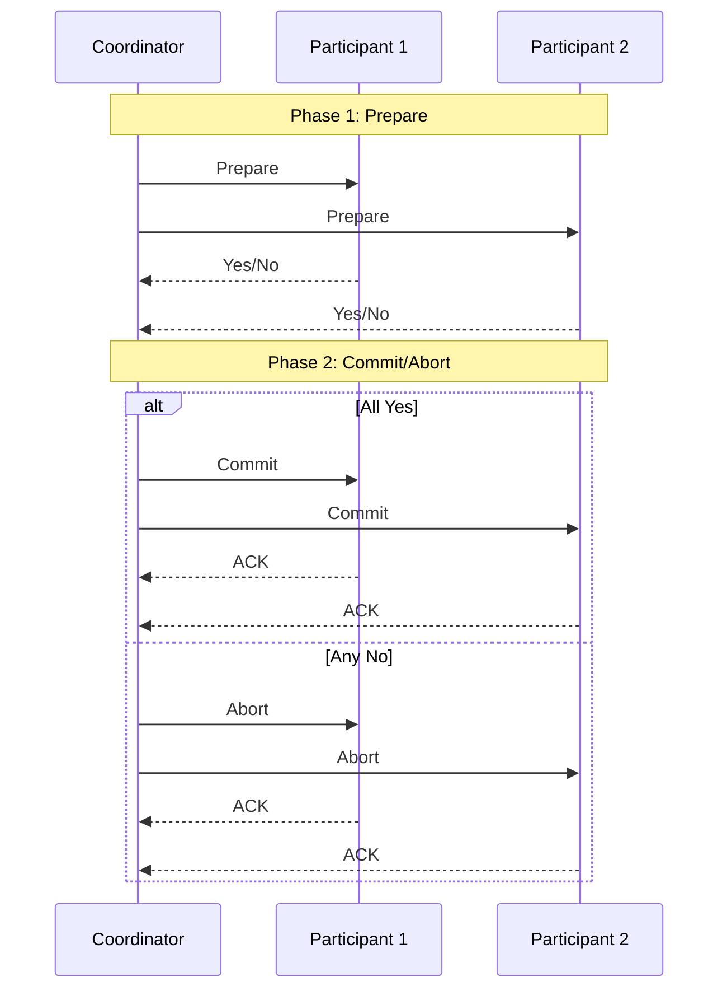
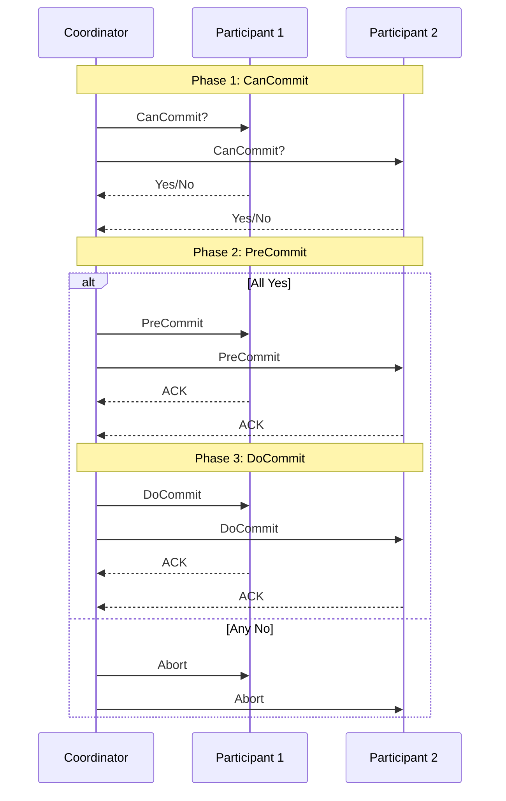
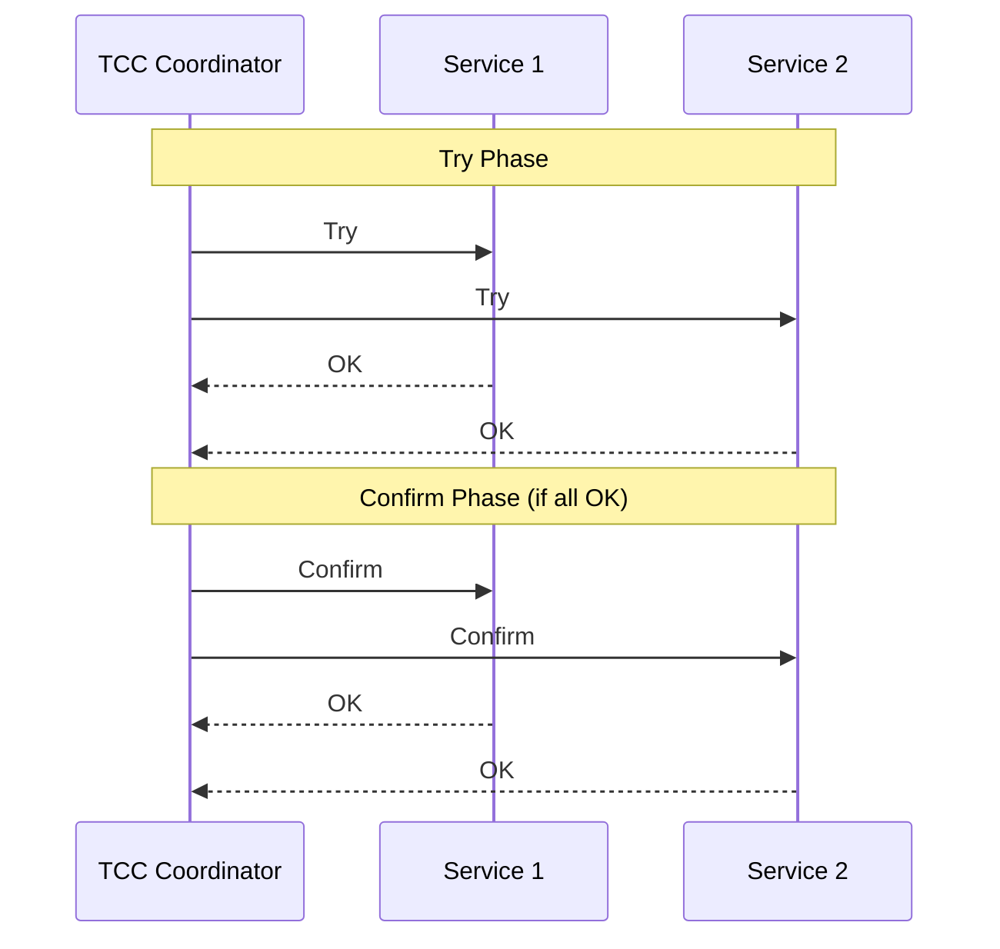
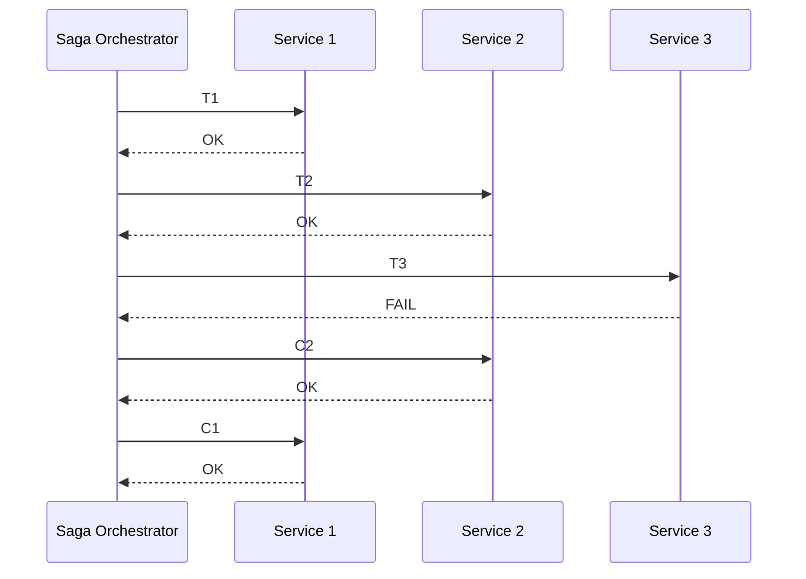
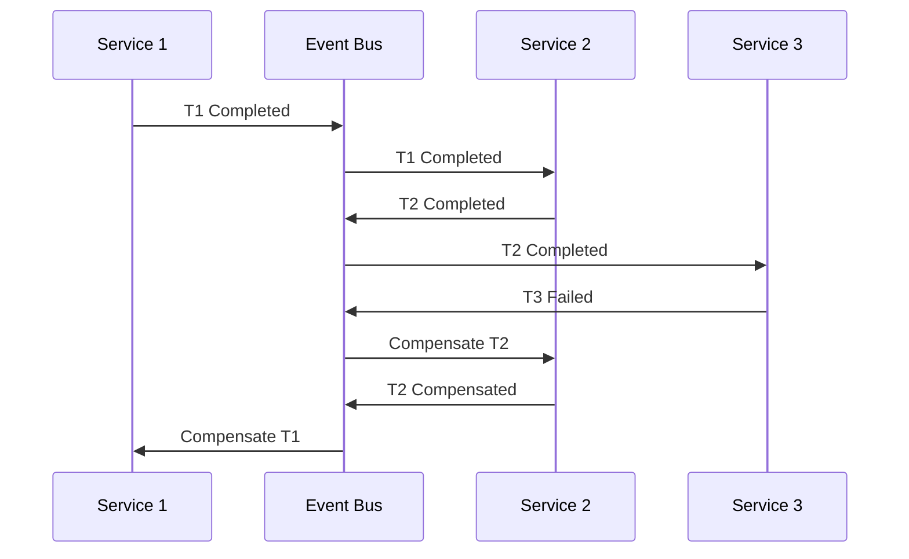

# 04.3 分布式事务

---

📌 **内容摘要**

本文档深入探讨分布式事务的核心原理和关键方法。内容涵盖分布式系统领域的主要知识点，包括共识算法, 一致性等关键主题。适合具备相关基础的学习者进行深入研究。

**关键词**: 分布式系统, 共识算法, 一致性

📚 **学习目标**
- 深入理解分布式事务的理论体系和形式化方法
- 能够进行相关定理的形式化证明
- 建立该领域的系统性知识框架

🎯 **难度级别**: 高级

⏱️ **预计阅读时间**: 15分钟

**前置知识**: 该领域的中级知识, 形式化方法基础

---


## 目录

- [04.3 分布式事务](#043-分布式事务)
  - [目录](#目录)
  - [1. 概述](#1-概述)
  - [2. 两阶段提交 (2PC)](#2-两阶段提交-2pc)
    - [2.1 算法流程](#21-算法流程)
    - [2.2 优缺点](#22-优缺点)
    - [2.3 Rust 实现](#23-rust-实现)
  - [3. 三阶段提交 (3PC)](#3-三阶段提交-3pc)
    - [3.1 改进点](#31-改进点)
    - [3.2 算法流程](#32-算法流程)
  - [4. TCC](#4-tcc)
    - [4.1 三阶段定义](#41-三阶段定义)
    - [4.2 Rust 实现](#42-rust-实现)
    - [4.3 Go 实现](#43-go-实现)
  - [5. Saga](#5-saga)
    - [5.1 编排式 Saga](#51-编排式-saga)
    - [5.2 编排式 Saga](#52-编排式-saga)
  - [6. 方案对比](#6-方案对比)
  - [7. 相关文档](#7-相关文档)

## 1. 概述

分布式事务解决跨多个服务/数据库的事务一致性问题。由于 CAP 定理的限制，分布式事务需要在一致性和可用性之间做出权衡。

**核心挑战**：

- 网络分区
- 节点故障
- 性能开销

## 2. 两阶段提交 (2PC)

### 2.1 算法流程



**形式化定义**：

$$Phase\ 1: \forall p \in Participants: prepare(p) \rightarrow vote_p \in \{YES, NO\}$$

$$
Phase\ 2: \begin{cases}
commit & \text{if } \forall p: vote_p = YES \\
abort & \text{if } \exists p: vote_p = NO
\end{cases}
$$

### 2.2 优缺点

**优点**：

- 强一致性保证
- 实现相对简单

**缺点**：

- 同步阻塞
- 单点故障（协调者）
- 性能开销大

### 2.3 Rust 实现

```rust
use std::collections::HashMap;
use std::sync::{Arc, Mutex};
use async_trait::async_trait;

# [derive(Debug, Clone, PartialEq)]
pub enum Vote {
    Yes,
    No,
}

# [derive(Debug, Clone, PartialEq)]
pub enum Decision {
    Commit,
    Abort,
}

# [async_trait]
pub trait Participant: Send + Sync {
    async fn prepare(&self) -> Vote;
    async fn commit(&self) -> Result<(), String>;
    async fn abort(&self) -> Result<(), String>;
}

pub struct TwoPhaseCoordinator {
    participants: Vec<Arc<dyn Participant>>,
}

impl TwoPhaseCoordinator {
    pub fn new(participants: Vec<Arc<dyn Participant>>) -> Self {
        Self { participants }
    }

    pub async fn execute(&self) -> Result<(), String> {
        // Phase 1: Prepare
        let mut votes = Vec::new();
        for participant in &self.participants {
            let vote = participant.prepare().await;
            votes.push(vote);
        }

        // Phase 2: Decide
        let decision = if votes.iter().all(|v| *v == Vote::Yes) {
            Decision::Commit
        } else {
            Decision::Abort
        };

        // Phase 2: Execute
        for participant in &self.participants {
            match decision {
                Decision::Commit => {
                    participant.commit().await?;
                }
                Decision::Abort => {
                    participant.abort().await?;
                }
            }
        }

        if decision == Decision::Commit {
            Ok(())
        } else {
            Err("Transaction aborted".to_string())
        }
    }
}

// 具体实现示例
pub struct DatabaseParticipant {
    name: String,
}

# [async_trait]
impl Participant for DatabaseParticipant {
    async fn prepare(&self) -> Vote {
        println!("[{}] Preparing transaction...", self.name);
        // 实际实现：执行本地事务，获取锁
        Vote::Yes
    }

    async fn commit(&self) -> Result<(), String> {
        println!("[{}] Committing transaction...", self.name);
        // 实际实现：提交本地事务
        Ok(())
    }

    async fn abort(&self) -> Result<(), String> {
        println!("[{}] Aborting transaction...", self.name);
        // 实际实现：回滚本地事务
        Ok(())
    }
}
```

## 3. 三阶段提交 (3PC)

### 3.1 改进点

3PC 在 2PC 基础上增加了一个预提交阶段，解决协调者单点故障问题：

- **CanCommit**：协调者询问参与者是否可以执行
- **PreCommit**：参与者预提交，释放部分锁
- **DoCommit**：最终提交

### 3.2 算法流程



## 4. TCC

### 4.1 三阶段定义

TCC (Try-Confirm-Cancel) 是一种业务层面的分布式事务方案：

| 阶段 | 操作 | 说明 |
|------|------|------|
| Try | 预留资源 | 执行业务检查，预留必要资源 |
| Confirm | 确认执行 | 真正执行业务 |
| Cancel | 取消回滚 | 释放预留资源 |



### 4.2 Rust 实现

```rust
use async_trait::async_trait;

# [async_trait]
pub trait TccAction: Send + Sync {
    async fn try_action(&self) -> Result<(), TccError>;
    async fn confirm(&self) -> Result<(), TccError>;
    async fn cancel(&self) -> Result<(), TccError>;
}

pub struct TccCoordinator {
    actions: Vec<Box<dyn TccAction>>,
}

impl TccCoordinator {
    pub fn new() -> Self {
        Self { actions: Vec::new() }
    }

    pub fn add_action(&mut self, action: Box<dyn TccAction>) {
        self.actions.push(action);
    }

    pub async fn execute(&self) -> Result<(), TccError> {
        let mut completed = Vec::new();

        // Try phase
        for (idx, action) in self.actions.iter().enumerate() {
            match action.try_action().await {
                Ok(()) => {
                    completed.push(idx);
                }
                Err(e) => {
                    // Cancel all completed actions
                    for &completed_idx in completed.iter().rev() {
                        if let Err(cancel_err) = self.actions[completed_idx].cancel().await {
                            eprintln!("Cancel failed: {:?}", cancel_err);
                        }
                    }
                    return Err(e);
                }
            }
        }

        // Confirm phase
        for action in &self.actions {
            action.confirm().await?;
        }

        Ok(())
    }
}

// 具体实现
pub struct InventoryTccAction {
    product_id: String,
    quantity: i32,
}

# [async_trait]
impl TccAction for InventoryTccAction {
    async fn try_action(&self) -> Result<(), TccError> {
        println!("Try: Reserving {} units of product {}", self.quantity, self.product_id);
        // 冻结库存
        Ok(())
    }

    async fn confirm(&self) -> Result<(), TccError> {
        println!("Confirm: Deducting {} units of product {}", self.quantity, self.product_id);
        // 真正扣减库存
        Ok(())
    }

    async fn cancel(&self) -> Result<(), TccError> {
        println!("Cancel: Releasing reservation for product {}", self.product_id);
        // 释放冻结库存
        Ok(())
    }
}

# [derive(Debug)]
pub enum TccError {
    TryFailed(String),
    ConfirmFailed(String),
    CancelFailed(String),
}
```

### 4.3 Go 实现

```go
package main

import (
    "fmt"
)

// TccAction interface
type TccAction interface {
    Try() error
    Confirm() error
    Cancel() error
}

// TccCoordinator struct
type TccCoordinator struct {
    actions []TccAction
}

func NewTccCoordinator() *TccCoordinator {
    return &TccCoordinator{
        actions: []TccAction{},
    }
}

func (c *TccCoordinator) AddAction(action TccAction) {
    c.actions = append(c.actions, action)
}

func (c *TccCoordinator) Execute() error {
    completed := []int{}

    // Try phase
    for idx, action := range c.actions {
        if err := action.Try(); err != nil {
            // Cancel all completed actions
            for i := len(completed) - 1; i >= 0; i-- {
                if err := c.actions[completed[i]].Cancel(); err != nil {
                    fmt.Printf("Cancel failed: %v\n", err)
                }
            }
            return err
        }
        completed = append(completed, idx)
    }

    // Confirm phase
    for _, action := range c.actions {
        if err := action.Confirm(); err != nil {
            return err
        }
    }

    return nil
}

// InventoryTccAction
type InventoryTccAction struct {
    ProductID string
    Quantity  int
}

func (a *InventoryTccAction) Try() error {
    fmt.Printf("Try: Reserving %d units of product %s\n", a.Quantity, a.ProductID)
    return nil
}

func (a *InventoryTccAction) Confirm() error {
    fmt.Printf("Confirm: Deducting %d units of product %s\n", a.Quantity, a.ProductID)
    return nil
}

func (a *InventoryTccAction) Cancel() error {
    fmt.Printf("Cancel: Releasing reservation for product %s\n", a.ProductID)
    return nil
}

func main() {
    coordinator := NewTccCoordinator()

    coordinator.AddAction(&InventoryTccAction{
        ProductID: "PROD-001",
        Quantity:  10,
    })

    if err := coordinator.Execute(); err != nil {
        fmt.Printf("TCC failed: %v\n", err)
    }
}
```

## 5. Saga

Saga 模式的详细内容已在 [03.4_长时间运行流程](../03_工作流系统/03.4_长时间运行流程.md) 中介绍。

### 5.1 编排式 Saga



### 5.2 编排式 Saga



## 6. 方案对比

| 方案 | 一致性 | 性能 | 复杂度 | 适用场景 |
|------|--------|------|--------|----------|
| 2PC | 强一致 | 低 | 低 | 传统单体数据库 |
| 3PC | 强一致 | 低 | 中 | 高可用要求场景 |
| TCC | 最终一致 | 高 | 高 | 高并发互联网应用 |
| Saga | 最终一致 | 高 | 中 | 微服务架构 |

## 7. 相关文档

- [03.4_长时间运行流程](../03_工作流系统/03.4_长时间运行流程.md) - Saga 模式详解
- [04.1_分布式基础](./04.1_分布式基础.md) - CAP 理论
- [04.2_共识算法](./04.2_共识算法.md) - 分布式一致性
- [04.4_数据分区](./04.4_数据分区.md) - 分区一致性
---

## 📋 前置知识

- [04.2 共识算法](../04_分布式系统/04.2_共识算法.md)

---

## 📚 延伸阅读

- [04.2 共识算法](../04_分布式系统/04.2_共识算法.md)
- [04.2 共识算法形式化](../04_分布式系统/04.2_共识算法形式化.md)
- [02.1 微服务形式化模型](../02_微服务架构/02.1_微服务形式化模型.md)
- [02.1 微服务设计原则](../02_微服务架构/02.1_微服务设计原则.md)
- [04.4 数据分区](../04_分布式系统/04.4_数据分区.md)
