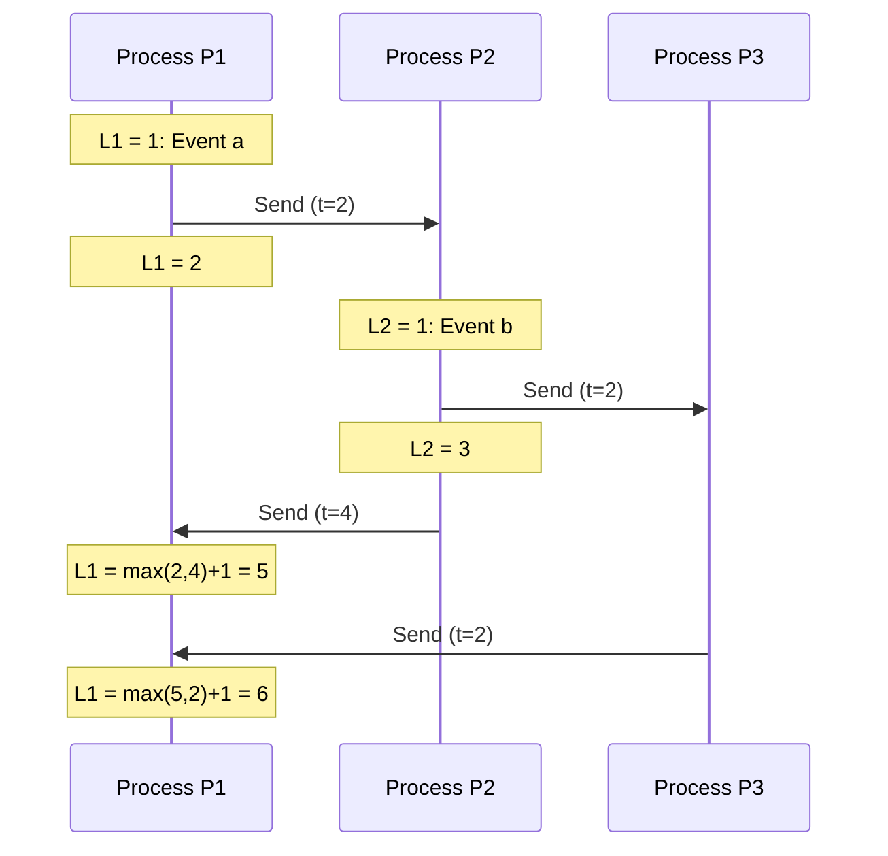
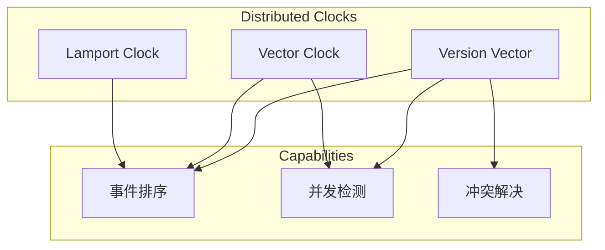

# 04.3 分布式时钟

---

📌 **内容摘要**

本文档深入探讨分布式时钟的核心原理和关键方法。内容涵盖分布式系统领域的主要知识点，包括BPMN, 一致性, 编排, 工作流, 共识算法等关键主题。适合具备相关基础的学习者进行深入研究。

**关键词**: BPMN, 一致性, 编排, 工作流, 共识算法, Raft, 分布式系统, Paxos

📚 **学习目标**
- 深入理解分布式时钟的理论体系和形式化方法
- 能够进行相关定理的形式化证明
- 建立该领域的系统性知识框架

🎯 **难度级别**: 高级

⏱️ **预计阅读时间**: 15分钟

**前置知识**: 该领域的中级知识, 形式化方法基础

---


## 04.3.1 概述

分布式时钟是分布式系统中用于事件排序和因果关系追踪的基础机制。本节形式化描述逻辑时钟和向量时钟。

> **交叉引用**: 与 [03.3 事件驱动架构](../03_工作流系统/03.3_事件驱动架构.md)、[04.2 共识算法](./04.2_共识算法形式化.md) 形成完整的分布式系统理论。

---

## 04.3.2 逻辑时钟形式化

### 04.3.2.1 形式化定义

**定义 04.3.1** (事件发生). 事件 $e$ 是进程 $p$ 在物理时间 $t$ 发生的动作：
$$e = (p, t, type)$$
其中 $type \in \{send, receive, internal\}$

**定义 04.3.2** (Happens-Before 关系). 关系 $\prec$（happens-before）定义：

1. 同进程内：$e \prec e'$ 若 $e$ 发生在 $e'$ 之前
2. 消息传递：$send(m) \prec receive(m)$
3. 传递性：$e \prec e'$ 且 $e' \prec e''$ 则 $e \prec e''$

**定义 04.3.2** (并发事件). 事件 $e$ 和 $e'$ 并发，记为 $e \parallel e'$：
$$e \parallel e' \iff \neg(e \prec e') \land \neg(e' \prec e)$$

### 04.3.2.2 Lamport 时间戳

**定义 04.3.3** (Lamport 时间戳). 进程 $p_i$ 维护逻辑时钟 $L_i$：

1. 执行事件前：$L_i := L_i + 1$
2. 发送消息：附带时间戳 $t = L_i$
3. 接收消息：$L_i := max(L_i, t) + 1$

**定理 04.3.1** (Lamport 正确性).
$$e \prec e' \Rightarrow L(e) < L(e')$$
注意：逆命题不成立。

### 04.3.2.3 架构图



### 04.3.2.4 代码示例

**Rust 实现：**

```rust
use std::cmp;

pub struct LamportClock {
    time: u64,
}

impl LamportClock {
    pub fn new() -> Self {
        Self { time: 0 }
    }

    pub fn tick(&mut self) -> u64 {
        self.time += 1;
        self.time
    }

    pub fn send_event(&mut self) -> u64 {
        self.tick()
    }

    pub fn receive_event(&mut self, received_time: u64) -> u64 {
        self.time = cmp::max(self.time, received_time) + 1;
        self.time
    }

    pub fn current_time(&self) -> u64 {
        self.time
    }
}

// 带 Lamport 时间戳的消息
#[derive(Clone, Debug)]
pub struct Message {
    pub payload: String,
    pub timestamp: u64,
    pub sender: String,
}

// 使用 Lamport 时钟的进程
pub struct Process {
    id: String,
    clock: LamportClock,
    event_log: Vec<(u64, String)>,
}

impl Process {
    pub fn new(id: &str) -> Self {
        Self {
            id: id.to_string(),
            clock: LamportClock::new(),
            event_log: Vec::new(),
        }
    }

    pub fn internal_event(&mut self, description: &str) -> u64 {
        let ts = self.clock.tick();
        self.event_log.push((ts, description.to_string()));
        println!("[{}] Internal Event: {} at time {}", self.id, description, ts);
        ts
    }

    pub fn send_message(&mut self, payload: &str) -> Message {
        let ts = self.clock.send_event();
        let msg = Message {
            payload: payload.to_string(),
            timestamp: ts,
            sender: self.id.clone(),
        };
        self.event_log.push((ts, format!("Send: {}", payload)));
        println!("[{}] Send: {} at time {}", self.id, payload, ts);
        msg
    }

    pub fn receive_message(&mut self, msg: &Message) -> u64 {
        let ts = self.clock.receive_event(msg.timestamp);
        self.event_log.push((ts, format!("Receive from {}: {}", msg.sender, msg.payload)));
        println!("[{}] Receive from {}: {} at time {} (msg time: {})",
                 self.id, msg.sender, msg.payload, ts, msg.timestamp);
        ts
    }
}
```

**Java 实现：**

```java
import java.util.*;
import java.util.concurrent.atomic.AtomicLong;

public class LamportClock {

    private final AtomicLong time = new AtomicLong(0);

    public long tick() {
        return time.incrementAndGet();
    }

    public long sendEvent() {
        return tick();
    }

    public long receiveEvent(long receivedTime) {
        long newTime = Math.max(time.get(), receivedTime) + 1;
        time.set(newTime);
        return newTime;
    }

    public long currentTime() {
        return time.get();
    }
}

@Data
public class Message {
    private final String payload;
    private final long timestamp;
    private final String sender;
}

public class Process {

    private final String id;
    private final LamportClock clock = new LamportClock();
    private final List<Event> eventLog = new ArrayList<>();

    public long internalEvent(String description) {
        long ts = clock.tick();
        eventLog.add(new Event(ts, description, EventType.INTERNAL));
        System.out.printf("[%s] Internal: %s at time %d%n", id, description, ts);
        return ts;
    }

    public Message sendMessage(String payload) {
        long ts = clock.sendEvent();
        Message msg = new Message(payload, ts, id);
        eventLog.add(new Event(ts, "Send: " + payload, EventType.SEND));
        System.out.printf("[%s] Send: %s at time %d%n", id, payload, ts);
        return msg;
    }

    public long receiveMessage(Message msg) {
        long ts = clock.receiveEvent(msg.getTimestamp());
        eventLog.add(new Event(ts, "Receive from " + msg.getSender(), EventType.RECEIVE));
        System.out.printf("[%s] Receive from %s: %s at time %d%n",
            id, msg.getSender(), msg.getPayload(), ts);
        return ts;
    }

    enum EventType { INTERNAL, SEND, RECEIVE }

    @Data
    @AllArgsConstructor
    static class Event {
        private final long timestamp;
        private final String description;
        private final EventType type;
    }
}
```

---

## 04.3.3 向量时钟形式化

### 04.3.3.1 形式化定义

**定义 04.3.4** (向量时钟). 系统有 $n$ 个进程，向量时钟 $V$ 是 $n$ 维向量：
$$V = [v_1, v_2, ..., v_n]$$
其中 $v_i$ 是进程 $p_i$ 的事件计数。

**定义 04.3.5** (向量时钟更新).

1. 进程 $p_i$ 执行事件：$V[i] := V[i] + 1$
2. $p_i$ 发送消息：附带 $V$
3. $p_j$ 接收消息：$V[j] := max(V[j], V_{msg}[j]) + 1$，其他分量取最大值

**定义 04.3.6** (向量时钟比较).
$$V \leq V' \iff \forall i: V[i] \leq V'[i]$$
$$V < V' \iff V \leq V' \land \exists i: V[i] < V'[i]$$

**定理 04.3.2** (向量时钟正确性).
$$e \prec e' \iff V(e) < V(e')$$
$$e \parallel e' \iff \neg(V(e) < V(e')) \land \neg(V(e') < V(e))$$

### 04.3.3.2 架构图

```mermaid
graph TB
    subgraph "Process P1"
        P1_1[V1=[1,0,0]]
        P1_2[V1=[2,0,0]]
        P1_3[V1=[3,2,1]]
    end

    subgraph "Process P2"
        P2_1[V2=[0,1,0]]
        P2_2[V2=[2,2,0]]
        P2_3[V2=[2,3,1]]
    end

    subgraph "Process P3"
        P3_1[V3=[0,0,1]]
        P3_2[V3=[2,2,2]]
    end

    P1_2 -.->|Send| P2_2
    P2_1 -.->|Send| P1_3
    P1_3 -.->|Send| P3_2
    P3_1 -.->|Send| P2_3
```

### 04.3.3.3 代码示例

**Rust 实现：**

```rustnuse std::collections::HashMap;
use std::cmp;

pub struct VectorClock {
    process_id: String,
    vector: HashMap<String, u64>,
}

impl VectorClock {
    pub fn new(process_id: &str, all_processes: &[String]) -> Self {
        let mut vector = HashMap::new();
        for p in all_processes {
            vector.insert(p.clone(), 0);
        }

        Self {
            process_id: process_id.to_string(),
            vector,
        }
    }

    pub fn tick(&mut self) {
        let entry = self.vector.entry(self.process_id.clone()).or_insert(0);
        *entry += 1;
    }

    pub fn send_event(&mut self) -> HashMap<String, u64> {
        self.tick();
        self.vector.clone()
    }

    pub fn receive_event(&mut self, received_vector: &HashMap<String, u64>) {
        // 取每个分量的最大值，然后递增自己的分量
        for (process, time) in received_vector {
            let entry = self.vector.entry(process.clone()).or_insert(0);
            *entry = cmp::max(*entry, *time);
        }
        self.tick();
    }

    pub fn compare(&self, other: &VectorClock) -> Option<Ordering> {
        let mut all_less_or_equal = true;
        let mut all_greater_or_equal = true;
        let mut at_least_one_less = false;
        let mut at_least_one_greater = false;

        // 获取所有进程ID
        let all_keys: HashSet<_> = self.vector.keys()
            .chain(other.vector.keys())
            .collect();

        for key in all_keys {
            let v1 = self.vector.get(key).copied().unwrap_or(0);
            let v2 = other.vector.get(key).copied().unwrap_or(0);

            if v1 < v2 {
                all_greater_or_equal = false;
                at_least_one_less = true;
            } else if v1 > v2 {
                all_less_or_equal = false;
                at_least_one_greater = true;
            }
        }

        if all_less_or_equal && at_least_one_less {
            Some(Ordering::Less)
        } else if all_greater_or_equal && at_least_one_greater {
            Some(Ordering::Greater)
        } else if self.vector == other.vector {
            Some(Ordering::Equal)
        } else {
            None // Concurrent
        }
    }

    pub fn happened_before(&self, other: &VectorClock) -> bool {
        matches!(self.compare(other), Some(Ordering::Less))
    }

    pub fn is_concurrent(&self, other: &VectorClock) -> bool {
        self.compare(other).is_none()
    }

    pub fn get_vector(&self) -> &HashMap<String, u64> {
        &self.vector
    }
}

use std::cmp::Ordering;
use std::collections::HashSet;

// 带向量时钟的消息
#[derive(Clone, Debug)]
pub struct VectorMessage {
    pub payload: String,
    pub vector_clock: HashMap<String, u64>,
    pub sender: String,
}

// 使用向量时钟的进程
pub struct VectorProcess {
    id: String,
    clock: VectorClock,
    event_log: Vec<(HashMap<String, u64>, String)>,
}

impl VectorProcess {
    pub fn new(id: &str, all_processes: &[String]) -> Self {
        Self {
            id: id.to_string(),
            clock: VectorClock::new(id, all_processes),
            event_log: Vec::new(),
        }
    }

    pub fn internal_event(&mut self, description: &str) -> HashMap<String, u64> {
        self.clock.tick();
        let vector = self.clock.get_vector().clone();
        self.event_log.push((vector.clone(), description.to_string()));
        println!("[{}] Internal: {} at {:?}", self.id, description, vector);
        vector
    }

    pub fn send_message(&mut self, payload: &str) -> VectorMessage {
        let vector = self.clock.send_event();
        let msg = VectorMessage {
            payload: payload.to_string(),
            vector_clock: vector.clone(),
            sender: self.id.clone(),
        };
        self.event_log.push((vector.clone(), format!("Send: {}", payload)));
        println!("[{}] Send: {} at {:?}", self.id, payload, vector);
        msg
    }

    pub fn receive_message(&mut self, msg: &VectorMessage) -> HashMap<String, u64> {
        self.clock.receive_event(&msg.vector_clock);
        let vector = self.clock.get_vector().clone();
        self.event_log.push((vector.clone(), format!("Receive from {}: {}", msg.sender, msg.payload)));

        let ordering = VectorClock::new(&self.id, &self.clock.vector.keys().cloned().collect::<Vec<_>>())
            .compare(&VectorClock { process_id: msg.sender.clone(), vector: msg.vector_clock.clone() });

        match ordering {
            Some(Ordering::Less) => println!("[{}] Message from {} happened after current", self.id, msg.sender),
            Some(Ordering::Greater) => println!("[{}] Message from {} happened before current", self.id, msg.sender),
            Some(Ordering::Equal) => println!("[{}] Message from {} at same time", self.id, msg.sender),
            None => println!("[{}] Message from {} is concurrent", self.id, msg.sender),
        }

        vector
    }
}

// 版本向量（用于冲突检测）
pub struct VersionVector {
    versions: HashMap<String, u64>,
}

impl VersionVector {
    pub fn new() -> Self {
        Self {
            versions: HashMap::new(),
        }
    }

    pub fn increment(&mut self, replica_id: &str) {
        *self.versions.entry(replica_id.to_string()).or_insert(0) += 1;
    }

    pub fn merge(&mut self, other: &VersionVector) {
        for (replica, version) in &other.versions {
            let current = self.versions.get(replica).copied().unwrap_or(0);
            self.versions.insert(replica.clone(), current.max(*version));
        }
    }

    pub fn dominates(&self, other: &VersionVector) -> bool {
        for (replica, version) in &other.versions {
            let current = self.versions.get(replica).copied().unwrap_or(0);
            if current < *version {
                return false;
            }
        }
        !self.versions.is_empty() || !other.versions.is_empty()
    }

    pub fn is_concurrent_with(&self, other: &VersionVector) -> bool {
        !self.dominates(other) && !other.dominates(self)
    }
}
```

**Java 实现：**

```java
import java.util.*;
import java.util.concurrent.ConcurrentHashMap;

public class VectorClock {

    private final String processId;
    private final Map<String, Long> vector = new ConcurrentHashMap<>();

    public VectorClock(String processId, List<String> allProcesses) {
        this.processId = processId;
        for (String p : allProcesses) {
            vector.put(p, 0L);
        }
    }

    public void tick() {
        vector.merge(processId, 1L, Long::sum);
    }

    public Map<String, Long> sendEvent() {
        tick();
        return new HashMap<>(vector);
    }

    public void receiveEvent(Map<String, Long> receivedVector) {
        for (Map.Entry<String, Long> entry : receivedVector.entrySet()) {
            vector.merge(entry.getKey(), entry.getValue(), Math::max);
        }
        tick();
    }

    public ComparisonResult compare(VectorClock other) {
        boolean allLessOrEqual = true;
        boolean allGreaterOrEqual = true;
        boolean atLeastOneLess = false;
        boolean atLeastOneGreater = false;

        Set<String> allKeys = new HashSet<>();
        allKeys.addAll(this.vector.keySet());
        allKeys.addAll(other.vector.keySet());

        for (String key : allKeys) {
            long v1 = this.vector.getOrDefault(key, 0L);
            long v2 = other.vector.getOrDefault(key, 0L);

            if (v1 < v2) {
                allGreaterOrEqual = false;
                atLeastOneLess = true;
            } else if (v1 > v2) {
                allLessOrEqual = false;
                atLeastOneGreater = true;
            }
        }

        if (allLessOrEqual && atLeastOneLess) {
            return ComparisonResult.BEFORE;
        } else if (allGreaterOrEqual && atLeastOneGreater) {
            return ComparisonResult.AFTER;
        } else if (this.vector.equals(other.vector)) {
            return ComparisonResult.EQUAL;
        } else {
            return ComparisonResult.CONCURRENT;
        }
    }

    public boolean happenedBefore(VectorClock other) {
        return compare(other) == ComparisonResult.BEFORE;
    }

    public boolean isConcurrent(VectorClock other) {
        return compare(other) == ComparisonResult.CONCURRENT;
    }

    public enum ComparisonResult { BEFORE, AFTER, EQUAL, CONCURRENT }
}

@Data
public class VectorMessage {
    private final String payload;
    private final Map<String, Long> vectorClock;
    private final String sender;
}

@Component
public class VectorProcess {

    private final String id;
    private final VectorClock clock;
    private final List<Event> eventLog = new ArrayList<>();

    public VectorProcess(String id, List<String> allProcesses) {
        this.id = id;
        this.clock = new VectorClock(id, allProcesses);
    }

    public Map<String, Long> internalEvent(String description) {
        clock.tick();
        Map<String, Long> vector = new HashMap<>(clock.getVector());
        eventLog.add(new Event(vector, description, EventType.INTERNAL));
        System.out.printf("[%s] Internal: %s at %s%n", id, description, vector);
        return vector;
    }

    public VectorMessage sendMessage(String payload) {
        Map<String, Long> vector = clock.sendEvent();
        VectorMessage msg = new VectorMessage(payload, vector, id);
        eventLog.add(new Event(vector, "Send: " + payload, EventType.SEND));
        System.out.printf("[%s] Send: %s at %s%n", id, payload, vector);
        return msg;
    }

    public Map<String, Long> receiveMessage(VectorMessage msg) {
        clock.receiveEvent(msg.getVectorClock());
        Map<String, Long> vector = new HashMap<>(clock.getVector());
        eventLog.add(new Event(vector, "Receive from " + msg.getSender(), EventType.RECEIVE));

        VectorClock.ComparisonResult result = clock.compare(
            new VectorClock(msg.getSender(), new ArrayList<>(msg.getVectorClock().keySet())));

        System.out.printf("[%s] Receive from %s: %s at %s - %s%n",
            id, msg.getSender(), msg.getPayload(), vector, result);
        return vector;
    }

    enum EventType { INTERNAL, SEND, RECEIVE }

    @Data
    @AllArgsConstructor
    static class Event {
        private final Map<String, Long> vector;
        private final String description;
        private final EventType type;
    }
}

// 版本向量用于冲突检测
public class VersionVector {

    private final Map<String, Long> versions = new ConcurrentHashMap<>();

    public void increment(String replicaId) {
        versions.merge(replicaId, 1L, Long::sum);
    }

    public void merge(VersionVector other) {
        for (Map.Entry<String, Long> entry : other.versions.entrySet()) {
            versions.merge(entry.getKey(), entry.getValue(), Math::max);
        }
    }

    public boolean dominates(VersionVector other) {
        for (Map.Entry<String, Long> entry : other.versions.entrySet()) {
            if (versions.getOrDefault(entry.getKey(), 0L) < entry.getValue()) {
                return false;
            }
        }
        return !versions.isEmpty() || !other.versions.isEmpty();
    }

    public boolean isConcurrentWith(VersionVector other) {
        return !dominates(other) && !other.dominates(this);
    }
}
```

---

## 04.3.4 分布式时钟比较

| 特性 | Lamport 时钟 | 向量时钟 | 版本向量 |
|------|-------------|---------|---------|
| 空间复杂度 | O(1) | O(n) | O(n) |
| 因果关系 | 部分捕获 | 完整捕获 | 完整捕获 |
| 并发检测 | 不能 | 能 | 能 |
| 应用场景 | 简单排序 | 调试/分析 | 冲突检测 |



> **交叉引用**: 向量时钟在事件溯源中的应用请参考 [03.3 事件驱动架构](../03_工作流系统/03.3_事件驱动架构.md)。
---

## 📚 延伸阅读

- [03.3 事件驱动架构](../03_工作流系统/03.3_事件驱动架构.md)
- [03.1 工作流基础](../03_工作流系统/03.1_工作流基础.md)
- [03.1 工作流形式化](../03_工作流系统/03.1_工作流形式化.md)
- [04.2 共识算法](../04_分布式系统/04.2_共识算法.md)
- [04.2 共识算法形式化](../04_分布式系统/04.2_共识算法形式化.md)
