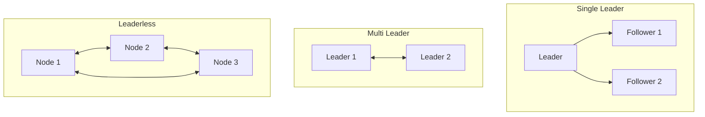

# 04.4 数据分区

---

📌 **内容摘要**

本文档深入探讨数据分区的核心原理和关键方法。内容涵盖分布式系统领域的主要知识点，包括一致性模型, 最终一致性, 强一致性等关键主题。适合具备相关基础的学习者进行深入研究。

**关键词**: 一致性模型, 分布式系统, 最终一致性, 强一致性

📚 **学习目标**
- 深入理解数据分区的理论体系和形式化方法
- 能够进行相关定理的形式化证明
- 建立该领域的系统性知识框架

🎯 **难度级别**: 高级

⏱️ **预计阅读时间**: 15分钟

**前置知识**: 该领域的中级知识, 形式化方法基础

---


## 目录

- [04.4 数据分区](#044-数据分区)
  - [目录](#目录)
  - [1. 概述](#1-概述)
  - [2. 分片 (Sharding)](#2-分片-sharding)
    - [2.1 分片策略](#21-分片策略)
    - [2.2 架构图](#22-架构图)
    - [2.3 Rust 实现](#23-rust-实现)
  - [3. 复制 (Replication)](#3-复制-replication)
    - [3.1 复制模式](#31-复制模式)
    - [3.2 一致性权衡](#32-一致性权衡)
    - [3.3 Rust 实现](#33-rust-实现)
  - [4. 一致性哈希](#4-一致性哈希)
    - [4.1 算法原理](#41-算法原理)
    - [4.2 虚拟节点](#42-虚拟节点)
    - [4.3 Rust 实现](#43-rust-实现)
    - [4.4 Go 实现](#44-go-实现)
  - [5. 方案对比](#5-方案对比)
  - [6. 相关文档](#6-相关文档)

## 1. 概述

数据分区是将数据分散到多个节点存储的技术，用于解决单机存储容量和性能瓶颈。

**分区目标**：

- 水平扩展存储能力
- 提升读写性能
- 提高系统可用性

## 2. 分片 (Sharding)

### 2.1 分片策略

| 策略 | 描述 | 优点 | 缺点 |
|------|------|------|------|
| 范围分片 | 按 ID 范围 | 范围查询高效 | 热点问题 |
| 哈希分片 | Hash(key) % N | 分布均匀 | 范围查询低效 |
| 列表分片 | 离散值列表 | 灵活 | 扩展性差 |
| 复合分片 | 组合策略 | 综合优势 | 复杂度高 |

### 2.2 架构图

```mermaid
graph TB
    Client[Client] --> Router[Shard Router]

    Router -->|Hash(key)%3=0| S1[Shard 1]
    Router -->|Hash(key)%3=1| S2[Shard 2]
    Router -->|Hash(key)%3=2| S3[Shard 3]

    subgraph Shards["Shards"]
        S1
        S2
        S3
    end
```

### 2.3 Rust 实现

```rust
use std::collections::HashMap;

pub trait ShardKey {
    fn shard_key(&self) -> u64;
}

pub struct ShardRouter {
    num_shards: u64,
    shards: HashMap<u64, Shard>,
}

pub struct Shard {
    id: u64,
    address: String,
}

impl ShardRouter {
    pub fn new(num_shards: u64) -> Self {
        let mut shards = HashMap::new();
        for i in 0..num_shards {
            shards.insert(i, Shard {
                id: i,
                address: format!("shard-{}", i),
            });
        }

        Self { num_shards, shards }
    }

    pub fn route<K: ShardKey>(&self, key: &K) -> Option<&Shard> {
        let shard_id = key.shard_key() % self.num_shards;
        self.shards.get(&shard_id)
    }

    // 哈希分片
    pub fn hash_route(&self, key: &str) -> Option<&Shard> {
        use std::collections::hash_map::DefaultHasher;
        use std::hash::{Hash, Hasher};

        let mut hasher = DefaultHasher::new();
        key.hash(&mut hasher);
        let hash = hasher.finish();

        let shard_id = hash % self.num_shards;
        self.shards.get(&shard_id)
    }

    // 范围分片
    pub fn range_route(&self, id: u64) -> Option<&Shard> {
        let shard_id = id / (1000 / self.num_shards);
        self.shards.get(&shard_id.min(self.num_shards - 1))
    }
}

// 使用示例
impl ShardKey for String {
    fn shard_key(&self) -> u64 {
        use std::collections::hash_map::DefaultHasher;
        use std::hash::{Hash, Hasher};

        let mut hasher = DefaultHasher::new();
        self.hash(&mut hasher);
        hasher.finish()
    }
}
```

## 3. 复制 (Replication)

### 3.1 复制模式



**复制策略**：

| 模式 | 写入 | 读取 | 一致性 |
|------|------|------|--------|
| 单主 | Leader | Leader/Replica | 可调 |
| 多主 | 任意 Leader | 任意 | 冲突解决 |
| 无主 | 多节点确认 | 多节点读取 | Quorum |

### 3.2 一致性权衡

**Quorum 机制**：

$$W + R > N$$

其中：

- $W$：写入确认的节点数
- $R$：读取的节点数
- $N$：副本总数

**配置策略**：

- $W=1, R=N$：快速写入，慢读取
- $W=N, R=1$：慢写入，快速读取
- $W=R=\lceil(N+1)/2\rceil$：平衡配置

### 3.3 Rust 实现

```rust
use std::sync::Arc;
use tokio::sync::{mpsc, RwLock};
use serde::{Serialize, Deserialize};

#[derive(Clone, Debug, Serialize, Deserialize)]
pub struct ReplicationEntry {
    pub index: u64,
    pub term: u64,
    pub data: Vec<u8>,
}

pub struct ReplicatedLog {
    entries: Arc<RwLock<Vec<ReplicationEntry>>>,
    commit_index: Arc<RwLock<u64>>,
    last_applied: Arc<RwLock<u64>>,
}

impl ReplicatedLog {
    pub fn new() -> Self {
        Self {
            entries: Arc::new(RwLock::new(vec![])),
            commit_index: Arc::new(RwLock::new(0)),
            last_applied: Arc::new(RwLock::new(0)),
        }
    }

    pub async fn append(&self, entry: ReplicationEntry) -> u64 {
        let mut entries = self.entries.write().await;
        let index = entries.len() as u64 + 1;
        entries.push(entry);
        index
    }

    pub async fn get(&self, index: u64) -> Option<ReplicationEntry> {
        let entries = self.entries.read().await;
        entries.get(index as usize - 1).cloned()
    }

    pub async fn commit(&self, index: u64) {
        let mut commit_index = self.commit_index.write().await;
        if index > *commit_index {
            *commit_index = index;
        }
    }

    pub async fn is_committed(&self, index: u64) -> bool {
        let commit_index = self.commit_index.read().await;
        index <= *commit_index
    }
}

// 主从复制管理器
pub struct ReplicationManager {
    leader: String,
    replicas: Vec<String>,
    log: ReplicatedLog,
}

impl ReplicationManager {
    pub fn new(leader: String, replicas: Vec<String>) -> Self {
        Self {
            leader,
            replicas,
            log: ReplicatedLog::new(),
        }
    }

    pub async fn replicate(&self, data: Vec<u8>, term: u64) -> Result<u64, String> {
        let entry = ReplicationEntry {
            index: 0, // Will be set by append
            term,
            data,
        };

        let index = self.log.append(entry).await;

        // 异步复制到从节点
        for replica in &self.replicas {
            let replica = replica.clone();
            let entry = self.log.get(index).await.unwrap();
            tokio::spawn(async move {
                Self::send_to_replica(&replica, entry).await;
            });
        }

        Ok(index)
    }

    async fn send_to_replica(replica: &str, entry: ReplicationEntry) -> Result<(), String> {
        println!("Replicating entry {} to {}", entry.index, replica);
        // 实际网络调用
        Ok(())
    }
}
```

## 4. 一致性哈希

### 4.1 算法原理

一致性哈希将节点和数据映射到同一个环形空间：

$$hash: Key \rightarrow [0, 2^{32}-1]$$

数据存储在顺时针方向的第一个节点：

$$node(key) = \min\{node \in Nodes \mid hash(node) \geq hash(key)\}$$

```mermaid
graph LR
    subgraph HashRing["Hash Ring"]
        direction clockwise
        A[Node A<br/>hash=100]
        B[Node B<br/>hash=500]
        C[Node C<br/>hash=900]

        K1[Key 1<br/>hash=250] --> B
        K2[Key 2<br/>hash=600] --> C
        K3[Key 3<br/>hash=50] --> A
    end
```

### 4.2 虚拟节点

为解决数据分布不均问题，引入虚拟节点：

$$virtual\_nodes = k \cdot physical\_nodes$$

每个物理节点对应 $k$ 个虚拟节点在环上。

### 4.3 Rust 实现

```rust
use std::collections::{BTreeMap, HashMap};
use std::hash::{Hash, Hasher};

pub struct ConsistentHash {
    ring: BTreeMap<u64, String>,
    nodes: HashMap<String, Vec<u64>>, // node -> virtual node hashes
    replicas: usize, // number of virtual nodes per physical node
}

impl ConsistentHash {
    pub fn new(replicas: usize) -> Self {
        Self {
            ring: BTreeMap::new(),
            nodes: HashMap::new(),
            replicas,
        }
    }

    pub fn add_node(&mut self, node: &str) {
        let mut virtual_hashes = Vec::with_capacity(self.replicas);

        for i in 0..self.replicas {
            let virtual_key = format!("{}#{}", node, i);
            let hash = Self::hash(&virtual_key);
            virtual_hashes.push(hash);
            self.ring.insert(hash, node.to_string());
        }

        self.nodes.insert(node.to_string(), virtual_hashes);
    }

    pub fn remove_node(&mut self, node: &str) {
        if let Some(virtual_hashes) = self.nodes.remove(node) {
            for hash in virtual_hashes {
                self.ring.remove(&hash);
            }
        }
    }

    pub fn get_node(&self, key: &str) -> Option<&String> {
        if self.ring.is_empty() {
            return None;
        }

        let hash = Self::hash(key);

        // Find the first node with hash >= key hash
        let entry = self.ring.range(hash..).next();

        match entry {
            Some((_, node)) => Some(node),
            None => {
                // Wrap around to the first node
                self.ring.values().next()
            }
        }
    }

    pub fn get_nodes(&self, key: &str, count: usize) -> Vec<&String> {
        if self.ring.is_empty() || count == 0 {
            return vec![];
        }

        let hash = Self::hash(key);
        let mut result = Vec::with_capacity(count);
        let mut seen = std::collections::HashSet::new();

        // Start from the first node >= hash
        let start = self.ring.range(hash..).next()
            .map(|(h, _)| *h)
            .or_else(|| self.ring.keys().next().copied())
            .unwrap();

        // Iterate through the ring
        let mut current = start;
        loop {
            if let Some(node) = self.ring.get(&current) {
                if seen.insert(node.clone()) {
                    result.push(node);
                    if result.len() >= count {
                        break;
                    }
                }
            }

            // Move to next node
            let next = self.ring.range(current + 1..).next()
                .map(|(h, _)| *h)
                .or_else(|| self.ring.keys().next().copied());

            match next {
                Some(n) if n != start => current = n,
                _ => break,
            }
        }

        result
    }

    fn hash<T: Hash>(t: &T) -> u64 {
        use std::collections::hash_map::DefaultHasher;
        let mut hasher = DefaultHasher::new();
        t.hash(&mut hasher);
        hasher.finish()
    }
}

fn main() {
    let mut ch = ConsistentHash::new(150); // 150 virtual nodes per physical node

    ch.add_node("node1");
    ch.add_node("node2");
    ch.add_node("node3");

    let key = "user:123";
    let node = ch.get_node(key);
    println!("Key {} -> Node {:?}", key, node);

    // Get 2 replicas for redundancy
    let nodes = ch.get_nodes(key, 2);
    println!("Replicas for {}: {:?}", key, nodes);

    // Simulate node failure
    ch.remove_node("node2");
    let new_node = ch.get_node(key);
    println!("After removing node2, Key {} -> Node {:?}", key, new_node);
}
```

### 4.4 Go 实现

```go
package main

import (
    "fmt"
    "hash/crc32"
    "sort"
)

type ConsistentHash struct {
    ring     []uint32
    hashMap  map[uint32]string
    replicas int
}

func NewConsistentHash(replicas int) *ConsistentHash {
    return &ConsistentHash{
        ring:     []uint32{},
        hashMap:  make(map[uint32]string),
        replicas: replicas,
    }
}

func (ch *ConsistentHash) Add(node string) {
    for i := 0; i < ch.replicas; i++ {
        hash := ch.hash(fmt.Sprintf("%s#%d", node, i))
        ch.ring = append(ch.ring, hash)
        ch.hashMap[hash] = node
    }
    sort.Slice(ch.ring, func(i, j int) bool {
        return ch.ring[i] < ch.ring[j]
    })
}

func (ch *ConsistentHash) Remove(node string) {
    for i := 0; i < ch.replicas; i++ {
        hash := ch.hash(fmt.Sprintf("%s#%d", node, i))
        delete(ch.hashMap, hash)
    }

    // Rebuild ring
    newRing := []uint32{}
    for _, hash := range ch.ring {
        if _, exists := ch.hashMap[hash]; exists {
            newRing = append(newRing, hash)
        }
    }
    ch.ring = newRing
}

func (ch *ConsistentHash) Get(key string) string {
    if len(ch.ring) == 0 {
        return ""
    }

    hash := ch.hash(key)

    // Binary search for the first node >= hash
    idx := sort.Search(len(ch.ring), func(i int) bool {
        return ch.ring[i] >= hash
    })

    if idx == len(ch.ring) {
        idx = 0
    }

    return ch.hashMap[ch.ring[idx]]
}

func (ch *ConsistentHash) hash(key string) uint32 {
    return crc32.ChecksumIEEE([]byte(key))
}

func main() {
    ch := NewConsistentHash(150)

    ch.Add("node1")
    ch.Add("node2")
    ch.Add("node3")

    key := "user:123"
    node := ch.Get(key)
    fmt.Printf("Key %s -> Node %s\n", key, node)

    // Simulate node failure
    ch.Remove("node2")
    newNode := ch.Get(key)
    fmt.Printf("After removing node2, Key %s -> Node %s\n", key, newNode)
}
```

## 5. 方案对比

| 方案 | 扩展性 | 一致性 | 复杂度 | 适用场景 |
|------|--------|--------|--------|----------|
| 范围分片 | 中 | 强 | 低 | 时间序列数据 |
| 哈希分片 | 高 | 最终 | 低 | 均匀分布数据 |
| 一致性哈希 | 高 | 最终 | 中 | 动态扩缩容 |
| 复制 | 读高 | 可调 | 中 | 读多写少 |

## 6. 相关文档

- [04.1_分布式基础](./04.1_分布式基础.md) - CAP 与一致性模型
- [04.2_共识算法](./04.2_共识算法.md) - 数据一致性保证
- [04.3_分布式事务](./04.3_分布式事务.md) - 跨分区事务
- [01.5_分布式模式](../01_设计模式/01.5_分布式模式.md) - 分区设计模式
---

## 📚 延伸阅读

- [04.2 共识算法](../04_分布式系统/04.2_共识算法.md)
- [04.2 共识算法形式化](../04_分布式系统/04.2_共识算法形式化.md)
- [04.1 一致性模型](../04_分布式系统/04.1_一致性模型.md)
- [04.1 分布式基础](../04_分布式系统/04.1_分布式基础.md)
- [01.5 分布式模式 (Distributed Patterns)](../01_设计模式/01.5_分布式模式.md)
