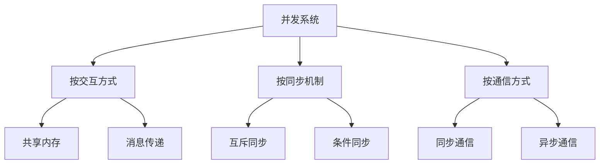

# 05. Petri网与进程代数：并发系统建模与分析

## 目录

1. [5.1 并发系统基础](#51-并发系统基础)
2. [5.2 Petri网理论](#52-petri网理论)
3. [5.3 进程代数](#53-进程代数)
4. [5.4 并发语义](#54-并发语义)
5. [5.5 分析技术](#55-分析技术)
6. [5.6 高级Petri网](#56-高级petri网)
7. [5.7 形式化验证](#57-形式化验证)
8. [5.8 系统设计应用](#58-系统设计应用)

## 5.1 并发系统基础

### 5.1.1 并发系统定义

**定义 5.1.1** (并发系统) 并发系统是多个进程同时执行的系统。

**定义 5.1.2** (进程) 进程是系统的基本执行单元。

**定义 5.1.3** (并发性) 并发性是多个进程同时存在的性质。

**定理 5.1.1** (并发系统的复杂性) 并发系统的复杂性源于进程间的交互。

**证明** 通过交互分析：

1. 多个进程需要协调行动
2. 协调需要同步和通信
3. 同步和通信引入复杂性

### 5.1.2 并发系统特征

**定义 5.1.4** (并发系统特征) 并发系统具有以下特征：

1. **并行性**：多个进程同时执行
2. **不确定性**：执行顺序不确定
3. **交互性**：进程间相互影响
4. **同步性**：进程需要协调

**定义 5.1.5** (并发系统分类) 并发系统按不同维度分类：



### 5.1.3 并发问题

**定义 5.1.6** (竞态条件) 竞态条件是多个进程访问共享资源时的冲突。

**定义 5.1.7** (死锁) 死锁是多个进程相互等待对方释放资源的状态。

**定义 5.1.8** (活锁) 活锁是进程不断改变状态但不前进的状态。

**定理 5.1.2** (死锁的必要条件) 死锁需要同时满足四个条件：互斥、占有等待、非抢占、循环等待。

**证明** 通过必要条件分析：

1. 互斥：资源不能被多个进程同时使用
2. 占有等待：进程持有资源时等待其他资源
3. 非抢占：资源不能被强制剥夺
4. 循环等待：存在循环等待链

## 5.2 Petri网理论

### 5.2.1 基本Petri网

**定义 5.2.1** (Petri网) Petri网是一个四元组 $\mathcal{PN} = (P, T, F, M_0)$，其中：

- $P$ 是库所集
- $T$ 是变迁集
- $F \subseteq (P \times T) \cup (T \times P)$ 是流关系
- $M_0: P \to \mathbb{N}$ 是初始标识

**定义 5.2.2** (标识) 标识是库所中托肯数量的函数 $M: P \to \mathbb{N}$。

**定义 5.2.3** (变迁使能) 变迁 $t$ 在标识 $M$ 下使能，如果：

$$\forall p \in \bullet t: M(p) \geq F(p, t)$$

**定理 5.2.1** (Petri网的基本性质) Petri网可以建模并发系统的行为。

**证明** 通过建模能力：

1. 库所表示系统状态
2. 变迁表示系统事件
3. 流关系表示因果关系

### 5.2.2 Petri网执行

**定义 5.2.4** (变迁发生) 变迁 $t$ 从标识 $M$ 发生到标识 $M'$，记作 $M[t\rangle M'$，如果：

$$M'(p) = M(p) - F(p, t) + F(t, p)$$

**定义 5.2.5** (可达性) 标识 $M$ 从 $M_0$ 可达，如果存在变迁序列 $\sigma$ 使得 $M_0[\sigma\rangle M$。

**定义 5.2.6** (可达图) 可达图是Petri网所有可达标识和变迁关系的图。

**定理 5.2.2** (可达性的可判定性) Petri网的可达性问题是可判定的。

**证明** 通过可达图构造：

1. 可达图是有限的
2. 可达性等价于可达图中的可达性
3. 图可达性是可判定的

### 5.2.3 Petri网性质

**定义 5.2.7** (有界性) Petri网是有界的，如果所有库所的托肯数有上界。

**定义 5.2.8** (安全性) Petri网是安全的，如果所有库所的托肯数不超过1。

**定义 5.2.9** (活性) Petri网是活的，如果每个变迁在某个可达标识下使能。

**定理 5.2.3** (性质的关系) 有界性和活性是独立性质。

**证明** 通过反例构造：

1. 构造有界但不活的Petri网
2. 构造活但不有界的Petri网
3. 因此性质独立

## 5.3 进程代数

### 5.3.1 CCS基础

**定义 5.3.1** (CCS进程) CCS进程通过以下语法定义：

$$P ::= 0 \mid \alpha.P \mid P + Q \mid P \mid Q \mid P \setminus L \mid P[f] \mid X$$

其中：

- $0$ 是空进程
- $\alpha.P$ 是前缀进程
- $P + Q$ 是选择进程
- $P \mid Q$ 是并行进程
- $P \setminus L$ 是限制进程
- $P[f]$ 是重命名进程
- $X$ 是进程变量

**定义 5.3.2** (CCS语义) CCS的语义通过转移关系定义：

```text
(前缀) α.P --α--> P
(选择1) P + Q --α--> P' / P --α--> P'
(选择2) P + Q --α--> Q' / Q --α--> Q'
(并行1) P | Q --α--> P' | Q / P --α--> P'
(并行2) P | Q --α--> P | Q' / Q --α--> Q'
(通信) P | Q --τ--> P' | Q' / P --α--> P', Q --ᾱ--> Q'
```

**定理 5.3.1** (CCS的表达能力) CCS可以表达所有可计算的并发行为。

**证明** 通过编码：

1. 每个图灵机可以编码为CCS进程
2. CCS包含图灵完备的子集
3. 因此具有完全的表达能力

### 5.3.2 π演算

**定义 5.3.3** (π演算进程) π演算进程通过以下语法定义：

$$P ::= 0 \mid \bar{x}y.P \mid x(y).P \mid P + Q \mid P \mid Q \mid (\nu x)P \mid !P$$

其中：

- $\bar{x}y.P$ 是输出进程
- $x(y).P$ 是输入进程
- $(\nu x)P$ 是限制进程
- $!P$ 是复制进程

**定义 5.3.4** (π演算语义) π演算的语义通过转移关系定义：

```text
(输出) x̄y.P --x̄y--> P
(输入) x(y).P --xz--> P{z/y}
(通信) P | Q --τ--> P' | Q' / P --x̄y--> P', Q --xz--> Q'
(限制) (νx)P --α--> (νx)P' / P --α--> P', x ∉ α
```

**定理 5.3.2** (π演算的动态性) π演算可以建模动态变化的通信结构。

**证明** 通过名称传递：

1. 通道名称可以作为数据传递
2. 传递的名称可以建立新的通信
3. 因此可以建模动态结构

### 5.3.3 CSP

**定义 5.3.5** (CSP进程) CSP进程通过以下语法定义：

$$P ::= STOP \mid SKIP \mid a \to P \mid P \sqcap Q \mid P \parallel Q \mid P \setminus A$$

其中：

- $STOP$ 是停止进程
- $SKIP$ 是成功终止
- $a \to P$ 是前缀进程
- $P \sqcap Q$ 是内部选择
- $P \parallel Q$ 是并行组合
- $P \setminus A$ 是隐藏操作

**定理 5.3.3** (CSP的确定性) CSP提供确定性的并发模型。

**证明** 通过语义定义：

1. CSP的语义是确定性的
2. 内部选择是确定性的
3. 因此CSP是确定性的

## 5.4 并发语义

### 5.4.1 操作语义

**定义 5.4.1** (操作语义) 操作语义通过转移关系定义进程的行为。

**定义 5.4.2** (转移关系) 转移关系是形如 $P \xrightarrow{\alpha} Q$ 的关系。

**定义 5.4.3** (转移序列) 转移序列是转移关系的序列：

$$P_0 \xrightarrow{\alpha_1} P_1 \xrightarrow{\alpha_2} \cdots \xrightarrow{\alpha_n} P_n$$

**定理 5.4.1** (操作语义的完备性) 操作语义完全描述进程的行为。

**证明** 通过语义对应：

1. 每个行为对应转移关系
2. 转移关系完全描述行为
3. 因此操作语义完备

### 5.4.2 指称语义

**定义 5.4.4** (指称语义) 指称语义将进程映射到数学对象。

**定义 5.4.5** (幂集语义) 幂集语义将进程映射到转移集合。

**定义 5.4.6** (语义函数) 语义函数 $\llbracket \cdot \rrbracket$ 将进程映射到语义域。

**定理 5.4.2** (指称语义的抽象性) 指称语义提供行为的抽象表示。

**证明** 通过抽象映射：

1. 语义函数抽象行为细节
2. 抽象表示便于分析
3. 因此指称语义抽象

### 5.4.3 公理语义

**定义 5.4.7** (公理语义) 公理语义通过等式公理定义进程等价。

**定义 5.4.8** (强互模拟) 强互模拟是最大的对称关系 $R$ 使得：

如果 $P R Q$ 且 $P \xrightarrow{\alpha} P'$，则存在 $Q'$ 使得 $Q \xrightarrow{\alpha} Q'$ 且 $P' R Q'$。

**定义 5.4.9** (弱互模拟) 弱互模拟忽略内部动作 $\tau$。

**定理 5.4.3** (互模拟的等价性) 强互模拟是等价关系。

**证明** 通过关系性质：

1. 自反性：$P$ 与自身互模拟
2. 对称性：互模拟定义包含对称性
3. 传递性：互模拟的复合是互模拟

## 5.5 分析技术

### 5.5.1 可达性分析

**定义 5.5.1** (可达性分析) 可达性分析是计算系统可达状态的方法。

**定义 5.5.2** (状态空间) 状态空间是系统所有可能状态的集合。

**定义 5.5.3** (状态爆炸) 状态爆炸是状态空间大小随系统规模指数增长的现象。

**定理 5.5.1** (可达性分析的复杂性) Petri网的可达性分析是EXPSPACE完全的。

**证明** 通过复杂度分析：

1. 可达图大小可能指数增长
2. 可达性等价于可达图中的可达性
3. 因此复杂度为EXPSPACE

### 5.5.2 不变性分析

**定义 5.5.4** (不变性) 不变性是系统始终满足的性质。

**定义 5.5.5** (S-不变性) S-不变性是库所权重的线性组合，在变迁发生下保持不变。

**定义 5.5.6** (T-不变性) T-不变性是变迁权重的线性组合，使标识回到原状态。

**定理 5.5.2** (不变性的构造) S-不变性可以通过线性代数方法构造。

**证明** 通过线性方程组：

1. S-不变性满足线性方程组
2. 线性方程组可以通过高斯消元求解
3. 因此可以构造S-不变性

### 5.5.3 结构分析

**定义 5.5.7** (结构分析) 结构分析是基于Petri网结构性质的分析。

**定义 5.5.8** (冲突) 冲突是多个变迁共享输入库所。

**定义 5.5.9** (并发) 并发是变迁不共享输入库所。

**定理 5.5.3** (结构性质) 结构性质可以通过图论方法分析。

**证明** 通过图论：

1. Petri网可以表示为二分图
2. 图论提供丰富的分析工具
3. 因此可以分析结构性质

## 5.6 高级Petri网

### 5.6.1 时间Petri网

**定义 5.6.1** (时间Petri网) 时间Petri网是带有时间约束的Petri网。

**定义 5.6.2** (时间区间) 时间区间 $[a, b]$ 表示变迁的时间约束。

**定义 5.6.3** (时间语义) 时间语义考虑变迁发生的时间。

**定理 5.6.1** (时间Petri网的分析) 时间Petri网的分析比基本Petri网更复杂。

**证明** 通过复杂度分析：

1. 时间约束增加状态空间
2. 时间语义需要额外处理
3. 因此分析更复杂

### 5.6.2 着色Petri网

**定义 5.6.4** (着色Petri网) 着色Petri网是带有数据值的Petri网。

**定义 5.6.5** (颜色集) 颜色集是托肯可能的值集。

**定义 5.6.6** (弧表达式) 弧表达式定义托肯的流动条件。

**定理 5.6.2** (着色Petri网的表达能力) 着色Petri网比基本Petri网表达能力更强。

**证明** 通过编码：

1. 基本Petri网可以编码为着色Petri网
2. 着色Petri网可以表达数据操作
3. 因此表达能力更强

### 5.6.3 层次Petri网

**定义 5.6.7** (层次Petri网) 层次Petri网是支持层次结构的Petri网。

**定义 5.6.8** (子网) 子网是层次Petri网的组成部分。

**定义 5.6.9** (接口) 接口是子网与外部交互的点。

**定理 5.6.3** (层次Petri网的可组合性) 层次Petri网支持模块化设计。

**证明** 通过组合性：

1. 子网可以独立设计
2. 子网可以通过接口组合
3. 因此支持模块化设计

## 5.7 形式化验证

### 5.7.1 模型检查

**定义 5.7.1** (模型检查) 模型检查是验证系统是否满足规范的方法。

**定义 5.7.2** (时态逻辑规范) 时态逻辑规范描述系统的时态性质。

**定义 5.7.3** (反例) 反例是系统不满足规范的执行路径。

**定理 5.7.1** (模型检查的完备性) 模型检查可以找到所有违反规范的反例。

**证明** 通过状态空间搜索：

1. 模型检查搜索整个状态空间
2. 找到所有可能的执行路径
3. 因此找到所有反例

### 5.7.2 等价性检查

**定义 5.7.4** (等价性检查) 等价性检查是验证两个进程是否等价的方法。

**定义 5.7.5** (互模拟检查) 互模拟检查是验证互模拟关系的方法。

**定义 5.7.6** (等价性算法) 等价性算法是计算最大互模拟的算法。

**定理 5.7.2** (等价性检查的算法) 互模拟检查可以通过分区细化算法实现。

**证明** 通过算法构造：

1. 从最粗分区开始
2. 逐步细化直到稳定
3. 因此得到最大互模拟

### 5.7.3 性能分析

**定义 5.7.7** (性能分析) 性能分析是分析系统性能指标的方法。

**定义 5.7.8** (吞吐量) 吞吐量是系统处理事件的速度。

**定义 5.7.9** (响应时间) 响应时间是系统响应请求的时间。

**定理 5.7.3** (性能分析的可行性) 性能分析可以通过马尔可夫链实现。

**证明** 通过随机过程：

1. 并发系统可以建模为随机过程
2. 马尔可夫链提供性能分析方法
3. 因此可以进行性能分析

## 5.8 系统设计应用

### 5.8.1 工作流建模

**定义 5.8.1** (工作流) 工作流是业务流程的自动化。

**定义 5.8.2** (工作流网) 工作流网是建模工作流的Petri网。

**定义 5.8.3** (工作流性质) 工作流性质包括合理性、活性和有界性。

**定理 5.8.1** (工作流网的正确性) 工作流网可以验证业务流程的正确性。

**证明** 通过性质验证：

1. 工作流网可以建模业务流程
2. 可以验证工作流性质
3. 因此可以验证正确性

### 5.8.2 制造系统

**定义 5.8.4** (制造系统) 制造系统是生产产品的系统。

**定义 5.8.5** (制造Petri网) 制造Petri网是建模制造系统的Petri网。

**定义 5.8.6** (制造性质) 制造性质包括无死锁、无饥饿和公平性。

**定理 5.8.2** (制造系统的分析) 制造系统可以通过Petri网进行分析。

**证明** 通过建模能力：

1. Petri网可以建模制造过程
2. 可以分析制造性质
3. 因此可以进行系统分析

### 5.8.3 通信协议

**定义 5.8.7** (通信协议) 通信协议是通信实体间的约定。

**定义 5.8.8** (协议建模) 协议建模是使用形式化方法建模协议。

**定义 5.8.9** (协议验证) 协议验证是验证协议正确性的过程。

**定理 5.8.3** (协议的正确性) 通信协议可以通过形式化方法验证。

**证明** 通过验证技术：

1. 协议可以建模为并发系统
2. 形式化方法可以验证性质
3. 因此可以验证协议正确性

---

**参考文献**：

1. Petri, C. A. (1962). Kommunikation mit Automaten. *Schriften des IIM*, 3.
2. Reisig, W. (2013). *Understanding Petri Nets: Modeling Techniques, Analysis Methods, Case Studies*. Springer.
3. Milner, R. (1989). *Communication and Concurrency*. Prentice Hall.
4. Hoare, C. A. R. (1985). *Communicating Sequential Processes*. Prentice Hall.
5. Murata, T. (1989). Petri nets: Properties, analysis and applications. *Proceedings of the IEEE*, 77(4), 541-580.
