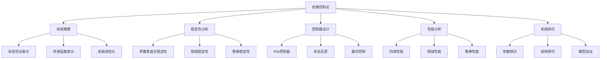

# 经典控制论基础理论 (Classical Control Theory Foundation)

## 🎯 **概述**

经典控制论是控制理论的基础，主要研究线性时不变系统的分析和设计。本文档构建了完整的经典控制论理论体系，包括系统建模、稳定性分析、控制器设计等核心内容。

## 📚 **目录**

### 1. 控制系统基础架构
- **1.1** 系统分类与层次结构
- **1.2** 状态空间表示
- **1.3** 传递函数表示
- **1.4** 系统线性化

### 2. 稳定性理论
- **2.1** 李雅普诺夫稳定性
- **2.2** 输入输出稳定性
- **2.3** 频域稳定性
- **2.4** 鲁棒稳定性

### 3. 控制器设计
- **3.1** PID控制器
- **3.2** 状态反馈控制
- **3.3** 输出反馈控制
- **3.4** 最优控制

### 4. 系统性能分析
- **4.1** 时域性能指标
- **4.2** 频域性能指标
- **4.3** 鲁棒性能分析
- **4.4** 灵敏度分析

### 5. 系统辨识与建模
- **5.1** 参数辨识
- **5.2** 结构辨识
- **5.3** 模型验证
- **5.4** 模型简化

## 1. 控制系统基础架构

### 1.1 系统分类与层次结构

**定义 1.1 (系统分类)**
控制系统按特性分类：

1. **线性系统**：满足叠加原理
2. **非线性系统**：不满足叠加原理
3. **时变系统**：参数随时间变化
4. **时不变系统**：参数不随时间变化
5. **连续时间系统**：状态连续变化
6. **离散时间系统**：状态离散变化

**定义 1.2 (系统层次)**
控制系统按复杂度分层：

- **单输入单输出(SISO)**：$\mathbb{R} \rightarrow \mathbb{R}$
- **多输入多输出(MIMO)**：$\mathbb{R}^m \rightarrow \mathbb{R}^p$
- **分布式系统**：多个子系统协同
- **网络化系统**：通过网络连接

**定理 1.1 (系统分解)**
任何复杂系统都可以分解为基本子系统的组合。

**证明：** 通过结构分解：

1. 将系统分解为可控和不可控部分
2. 将可控部分分解为可观和不可观部分
3. 每个部分都可以独立分析和设计

**形式化实现：**

```haskell
data SystemType = 
  Linear | Nonlinear
  | TimeVarying | TimeInvariant
  | Continuous | Discrete
  deriving (Show, Eq)

data SystemComplexity = 
  SISO | MIMO | Distributed | Networked
  deriving (Show, Eq)

data ControlSystem = ControlSystem {
  systemType :: SystemType,
  complexity :: SystemComplexity,
  stateDimension :: Int,
  inputDimension :: Int,
  outputDimension :: Int
} deriving (Show)

-- 系统分解
decomposeSystem :: ControlSystem -> [ControlSystem]
decomposeSystem sys = 
  let -- 可控性分解
      (controllable, uncontrollable) = decomposeControllability sys
      -- 可观性分解
      (observable, unobservable) = decomposeObservability controllable
  in [observable, unobservable, uncontrollable]
```

### 1.2 状态空间表示

**定义 1.3 (广义状态空间)**
广义状态空间表示：
$$\dot{x}(t) = f(x(t), u(t), t)$$
$$y(t) = h(x(t), u(t), t)$$

其中 $x(t) \in \mathbb{R}^n$, $u(t) \in \mathbb{R}^m$, $y(t) \in \mathbb{R}^p$。

**定义 1.4 (线性化)**
非线性系统在平衡点 $(x_e, u_e)$ 附近的线性化：
$$\delta \dot{x}(t) = A \delta x(t) + B \delta u(t)$$
$$\delta y(t) = C \delta x(t) + D \delta u(t)$$

其中：
$$A = \frac{\partial f}{\partial x}\bigg|_{(x_e, u_e)}, \quad B = \frac{\partial f}{\partial u}\bigg|_{(x_e, u_e)}$$
$$C = \frac{\partial h}{\partial x}\bigg|_{(x_e, u_e)}, \quad D = \frac{\partial h}{\partial u}\bigg|_{(x_e, u_e)}$$

**形式化实现：**

```haskell
data NonlinearSystem = NonlinearSystem {
  stateDimension :: Int,
  inputDimension :: Int,
  outputDimension :: Int,
  stateFunction :: Vector Double -> Vector Double -> Double -> Vector Double,
  outputFunction :: Vector Double -> Vector Double -> Double -> Vector Double
}

data LinearSystem = LinearSystem {
  a :: Matrix Double,
  b :: Matrix Double,
  c :: Matrix Double,
  d :: Matrix Double
} deriving (Show)

-- 系统线性化
linearizeSystem :: NonlinearSystem -> Vector Double -> Vector Double -> LinearSystem
linearizeSystem sys xEquilibrium uEquilibrium = 
  let -- 计算雅可比矩阵
      aMatrix = computeJacobian (stateFunction sys) xEquilibrium uEquilibrium 0.0
      bMatrix = computeJacobian (stateFunction sys) xEquilibrium uEquilibrium 0.0
      cMatrix = computeJacobian (outputFunction sys) xEquilibrium uEquilibrium 0.0
      dMatrix = computeJacobian (outputFunction sys) xEquilibrium uEquilibrium 0.0
  in LinearSystem {
    a = aMatrix,
    b = bMatrix,
    c = cMatrix,
    d = dMatrix
  }

computeJacobian :: (Vector Double -> Vector Double -> Double -> Vector Double) 
                -> Vector Double -> Vector Double -> Double -> Matrix Double
computeJacobian f x u t = 
  let n = length x
      epsilon = 1e-8
      jacobian = matrix n n (\(i, j) -> 
        let xPlus = x + (unitVector n j * epsilon)
            xMinus = x - (unitVector n j * epsilon)
            derivative = (f xPlus u t - f xMinus u t) / (2 * epsilon)
        in derivative `atIndex` i)
  in jacobian
```

### 1.3 传递函数表示

**定义 1.5 (传递函数)**
线性时不变系统的传递函数：
$$G(s) = C(sI - A)^{-1}B + D$$

**定义 1.6 (极点与零点)**
传递函数的极点是 $|sI - A| = 0$ 的解，零点是 $|sI - A - BD^{-1}C| = 0$ 的解。

**形式化实现：**

```haskell
data TransferFunction = TransferFunction {
  numerator :: [Double],    -- 分子多项式系数
  denominator :: [Double]   -- 分母多项式系数
} deriving (Show)

-- 状态空间到传递函数转换
stateSpaceToTransferFunction :: LinearSystem -> TransferFunction
stateSpaceToTransferFunction sys = 
  let -- 计算特征多项式
      charPoly = characteristicPolynomial (a sys)
      -- 计算传递函数分子
      numPoly = computeNumerator sys
  in TransferFunction {
    numerator = numPoly,
    denominator = charPoly
  }

characteristicPolynomial :: Matrix Double -> [Double]
characteristicPolynomial a = 
  let n = rows a
      -- 计算特征值
      eigenvalues = eigenValues a
      -- 构造特征多项式
      poly = foldl (\acc lambda -> 
        multiplyPolynomials acc [1, -lambda]) [1] eigenvalues
  in poly

-- 极点计算
computePoles :: TransferFunction -> [Complex Double]
computePoles tf = 
  let -- 求解分母多项式的根
      poles = roots (denominator tf)
  in poles

-- 零点计算
computeZeros :: TransferFunction -> [Complex Double]
computeZeros tf = 
  let -- 求解分子多项式的根
      zeros = roots (numerator tf)
  in zeros
```

## 2. 稳定性理论

### 2.1 李雅普诺夫稳定性

**定义 2.1 (李雅普诺夫函数)**
函数 $V : \mathbb{R}^n \rightarrow \mathbb{R}$ 是系统 $\dot{x} = f(x)$ 的李雅普诺夫函数，如果：

1. $V(0) = 0$
2. $V(x) > 0$ 对于 $x \neq 0$
3. $\dot{V}(x) = \nabla V(x)^T f(x) \leq 0$ 对于 $x \neq 0$

**定义 2.2 (全局渐近稳定性)**
平衡点 $x_e = 0$ 是全局渐近稳定的，如果：

1. 它是李雅普诺夫稳定的
2. $\lim_{t \rightarrow \infty} x(t) = 0$ 对于所有初始条件

**定理 2.1 (全局渐近稳定性判据)**
如果存在径向无界的李雅普诺夫函数 $V(x)$ 使得 $\dot{V}(x) < 0$ 对于 $x \neq 0$，则平衡点是全局渐近稳定的。

**证明：** 通过李雅普诺夫直接法：

1. 径向无界性确保所有轨迹有界
2. $\dot{V}(x) < 0$ 确保 $V(x)$ 严格递减
3. 结合李雅普诺夫稳定性得到全局渐近稳定性

**形式化实现：**

```haskell
data LyapunovFunction = LyapunovFunction {
  function :: Vector Double -> Double,
  gradient :: Vector Double -> Vector Double
}

-- 李雅普诺夫函数构造
constructLyapunovFunction :: Matrix Double -> LyapunovFunction
constructLyapunovFunction aMatrix = 
  let -- 求解李雅普诺夫方程 A^T P + P A = -Q
      qMatrix = identity (rows aMatrix)
      pMatrix = solveLyapunovEquation aMatrix qMatrix
      
      -- 构造二次型李雅普诺夫函数
      lyapunovFunc x = x `dot` (pMatrix `multiply` x)
      lyapunovGrad x = 2 * (pMatrix `multiply` x)
  in LyapunovFunction {
    function = lyapunovFunc,
    gradient = lyapunovGrad
  }

solveLyapunovEquation :: Matrix Double -> Matrix Double -> Matrix Double
solveLyapunovEquation a q = 
  let n = rows a
      -- 将李雅普诺夫方程转换为线性系统
      vecP = solve (kroneckerProduct (transpose a) (identity n) + 
                   kroneckerProduct (identity n) a) (vectorize q)
  in reshape n n vecP

-- 稳定性检查
checkStability :: LyapunovFunction -> (Vector Double -> Vector Double) -> Bool
checkStability lyap f = 
  let -- 检查李雅普诺夫函数条件
      positiveDefinite = checkPositiveDefinite (function lyap)
      negativeSemiDefinite = checkNegativeSemiDefinite lyap f
  in positiveDefinite && negativeSemiDefinite

checkPositiveDefinite :: (Vector Double -> Double) -> Bool
checkPositiveDefinite v = 
  let -- 在多个点上检查正定性
      testPoints = generateTestPoints
      allPositive = all (\x -> v x > 0) testPoints
  in allPositive
```

### 2.2 频域稳定性

**定义 2.3 (奈奎斯特稳定性判据)**
闭环系统稳定的充分必要条件是奈奎斯特图不包围点 $(-1, 0)$。

**定义 2.4 (增益裕度与相位裕度)**
- **增益裕度**：$GM = \frac{1}{|G(j\omega_{180})|}$
- **相位裕度**：$PM = 180° + \angle G(j\omega_c)$

其中 $\omega_{180}$ 是相位穿越频率，$\omega_c$ 是增益穿越频率。

**形式化实现：**

```haskell
data NyquistPlot = NyquistPlot {
  frequencies :: [Double],
  realParts :: [Double],
  imaginaryParts :: [Double]
} deriving (Show)

-- 奈奎斯特图计算
computeNyquistPlot :: TransferFunction -> NyquistPlot
computeNyquistPlot tf = 
  let -- 生成频率点
      frequencies = generateFrequencies
      -- 计算频率响应
      responses = map (\w -> evaluateTransferFunction tf (0 :+ w)) frequencies
      -- 提取实部和虚部
      realParts = map realPart responses
      imaginaryParts = map imagPart responses
  in NyquistPlot {
    frequencies = frequencies,
    realParts = realParts,
    imaginaryParts = imaginaryParts
  }

-- 稳定性检查
checkNyquistStability :: NyquistPlot -> Bool
checkNyquistStability plot = 
  let -- 计算包围数
      encirclements = countEncirclements plot (-1, 0)
  in encirclements == 0

countEncirclements :: NyquistPlot -> (Double, Double) -> Int
countEncirclements plot point = 
  let -- 使用角度变化计算包围数
      angles = computeAngleChanges plot point
      totalChange = sum angles
  in round (totalChange / (2 * pi))

-- 增益裕度和相位裕度计算
computeMargins :: TransferFunction -> (Double, Double)
computeMargins tf = 
  let -- 计算增益裕度
      gainMargin = computeGainMargin tf
      -- 计算相位裕度
      phaseMargin = computePhaseMargin tf
  in (gainMargin, phaseMargin)

computeGainMargin :: TransferFunction -> Double
computeGainMargin tf = 
  let -- 找到相位穿越频率
      omega180 = findPhaseCrossover tf
      -- 计算在该频率的增益
      gain = magnitude (evaluateTransferFunction tf (0 :+ omega180))
  in 1 / gain

computePhaseMargin :: TransferFunction -> Double
computePhaseMargin tf = 
  let -- 找到增益穿越频率
      omegaC = findGainCrossover tf
      -- 计算在该频率的相位
      phase = phase (evaluateTransferFunction tf (0 :+ omegaC))
  in 180 + phase
```

## 3. 控制器设计

### 3.1 PID控制器

**定义 3.1 (PID控制器)**
PID控制器的传递函数：
$$G_c(s) = K_p + \frac{K_i}{s} + K_d s$$

**定义 3.2 (PID参数整定)**
PID参数整定方法包括Ziegler-Nichols方法、Cohen-Coon方法等。

**形式化实现：**

```rust
// Rust实现PID控制器
#[derive(Debug, Clone)]
pub struct PIDController {
    kp: f64,  // 比例增益
    ki: f64,  // 积分增益
    kd: f64,  // 微分增益
    setpoint: f64,  // 设定值
    integral: f64,  // 积分项
    previous_error: f64,  // 前一次误差
    output_min: f64,  // 输出下限
    output_max: f64,  // 输出上限
}

impl PIDController {
    pub fn new(kp: f64, ki: f64, kd: f64) -> Self {
        PIDController {
            kp,
            ki,
            kd,
            setpoint: 0.0,
            integral: 0.0,
            previous_error: 0.0,
            output_min: f64::NEG_INFINITY,
            output_max: f64::INFINITY,
        }
    }
    
    pub fn set_setpoint(&mut self, setpoint: f64) {
        self.setpoint = setpoint;
    }
    
    pub fn set_output_limits(&mut self, min: f64, max: f64) {
        self.output_min = min;
        self.output_max = max;
    }
    
    pub fn compute(&mut self, measurement: f64, dt: f64) -> f64 {
        // 计算误差
        let error = self.setpoint - measurement;
        
        // 比例项
        let proportional = self.kp * error;
        
        // 积分项
        self.integral += error * dt;
        let integral = self.ki * self.integral;
        
        // 微分项
        let derivative = self.kd * (error - self.previous_error) / dt;
        self.previous_error = error;
        
        // 计算输出
        let output = proportional + integral + derivative;
        
        // 限制输出范围
        output.clamp(self.output_min, self.output_max)
    }
    
    pub fn reset(&mut self) {
        self.integral = 0.0;
        self.previous_error = 0.0;
    }
}

// Ziegler-Nichols整定方法
pub fn ziegler_nichols_tuning(ku: f64, tu: f64) -> (f64, f64, f64) {
    let kp = 0.6 * ku;
    let ki = 1.2 * ku / tu;
    let kd = 0.075 * ku * tu;
    
    (kp, ki, kd)
}

// Cohen-Coon整定方法
pub fn cohen_coon_tuning(k: f64, tau: f64, theta: f64) -> (f64, f64, f64) {
    let ratio = theta / tau;
    
    let kp = (1.35 + 0.25 * ratio) / k;
    let ki = (0.54 + 0.33 * ratio) / (k * tau);
    let kd = (0.5 * theta) / k;
    
    (kp, ki, kd)
}
```

### 3.2 状态反馈控制

**定义 3.3 (状态反馈)**
状态反馈控制律：$u(t) = -Kx(t) + r(t)$

**定义 3.4 (极点配置)**
通过选择反馈增益矩阵 $K$ 来配置闭环系统的极点。

**形式化实现：**

```haskell
data StateFeedback = StateFeedback {
  gainMatrix :: Matrix Double,
  referenceInput :: Vector Double
} deriving (Show)

-- 极点配置
polePlacement :: LinearSystem -> [Complex Double] -> Matrix Double
polePlacement sys desiredPoles = 
  let -- 检查可控性
      controllable = checkControllability sys
      if not controllable
        then error "System is not controllable"
        else
          -- 计算反馈增益矩阵
          let a = aMatrix sys
              b = bMatrix sys
              k = computeFeedbackGain a b desiredPoles
          in k

computeFeedbackGain :: Matrix Double -> Matrix Double -> [Complex Double] -> Matrix Double
computeFeedbackGain a b poles = 
  let -- 使用Ackermann公式
      n = rows a
      desiredCharPoly = characteristicPolynomialFromPoles poles
      k = ackermannFormula a b desiredCharPoly
  in k

ackermannFormula :: Matrix Double -> Matrix Double -> [Double] -> Matrix Double
ackermannFormula a b charPoly = 
  let n = rows a
      -- 计算可控性矩阵
      controllabilityMatrix = computeControllabilityMatrix a b
      -- 计算特征多项式系数
      coefficients = reverse charPoly
      -- 应用Ackermann公式
      k = [0, 0, ..., 1] `multiply` (inverse controllabilityMatrix) `multiply` 
          (foldl (\acc coeff -> acc + coeff `scale` (a `power` (length coefficients - 1 - i))) 
                 (zeroMatrix n n) (zip coefficients [0..]))
  in k
```

## 4. 系统性能分析

### 4.1 时域性能指标

**定义 4.1 (时域性能指标)**
- **上升时间**：$t_r$ - 响应从10%到90%的时间
- **峰值时间**：$t_p$ - 达到最大超调的时间
- **超调量**：$M_p$ - 最大超调百分比
- **调节时间**：$t_s$ - 响应进入±5%误差带的时间

**形式化实现：**

```haskell
data TimeDomainSpecs = TimeDomainSpecs {
  riseTime :: Double,
  peakTime :: Double,
  overshoot :: Double,
  settlingTime :: Double
} deriving (Show)

-- 时域性能分析
analyzeTimeDomain :: TransferFunction -> TimeDomainSpecs
analyzeTimeDomain tf = 
  let -- 计算阶跃响应
      stepResponse = computeStepResponse tf
      -- 计算性能指标
      riseTime = computeRiseTime stepResponse
      peakTime = computePeakTime stepResponse
      overshoot = computeOvershoot stepResponse
      settlingTime = computeSettlingTime stepResponse
  in TimeDomainSpecs {
    riseTime = riseTime,
    peakTime = peakTime,
    overshoot = overshoot,
    settlingTime = settlingTime
  }

computeStepResponse :: TransferFunction -> [Double]
computeStepResponse tf = 
  let -- 使用拉普拉斯逆变换计算阶跃响应
      timePoints = [0, 0.01 .. 10]  -- 时间点
      response = map (\t -> inverseLaplace tf t) timePoints
  in response

computeRiseTime :: [Double] -> Double
computeRiseTime response = 
  let -- 找到10%和90%响应时间
      t10 = findTimeAtLevel response 0.1
      t90 = findTimeAtLevel response 0.9
  in t90 - t10

computeOvershoot :: [Double] -> Double
computeOvershoot response = 
  let -- 找到最大值
      maxValue = maximum response
      -- 计算超调量
      overshoot = (maxValue - 1.0) * 100
  in overshoot
```

### 4.2 频域性能指标

**定义 4.2 (频域性能指标)**
- **带宽**：$\omega_b$ - 增益下降到-3dB的频率
- **谐振峰值**：$M_r$ - 频率响应的最大幅值
- **谐振频率**：$\omega_r$ - 谐振峰值对应的频率

**形式化实现：**

```haskell
data FrequencyDomainSpecs = FrequencyDomainSpecs {
  bandwidth :: Double,
  resonantPeak :: Double,
  resonantFrequency :: Double
} deriving (Show)

-- 频域性能分析
analyzeFrequencyDomain :: TransferFunction -> FrequencyDomainSpecs
analyzeFrequencyDomain tf = 
  let -- 计算频率响应
      freqResponse = computeFrequencyResponse tf
      -- 计算性能指标
      bandwidth = computeBandwidth freqResponse
      resonantPeak = computeResonantPeak freqResponse
      resonantFreq = computeResonantFrequency freqResponse
  in FrequencyDomainSpecs {
    bandwidth = bandwidth,
    resonantPeak = resonantPeak,
    resonantFrequency = resonantFreq
  }

computeFrequencyResponse :: TransferFunction -> [(Double, Complex Double)]
computeFrequencyResponse tf = 
  let -- 生成频率点
      frequencies = [0.01, 0.02 .. 100]
      -- 计算频率响应
      responses = map (\w -> (w, evaluateTransferFunction tf (0 :+ w))) frequencies
  in responses

computeBandwidth :: [(Double, Complex Double)] -> Double
computeBandwidth freqResponse = 
  let -- 找到-3dB频率
      minus3dB = 1 / sqrt 2
      bandwidth = findFrequencyAtMagnitude freqResponse minus3dB
  in bandwidth
```

## 5. 系统辨识与建模

### 5.1 参数辨识

**定义 5.1 (最小二乘辨识)**
最小二乘辨识通过最小化误差平方和来估计系统参数。

**定义 5.2 (递归最小二乘)**
递归最小二乘算法用于在线参数辨识。

**形式化实现：**

```haskell
data SystemIdentification = SystemIdentification {
  inputData :: [Double],
  outputData :: [Double],
  modelOrder :: Int
} deriving (Show)

-- 最小二乘辨识
leastSquaresIdentification :: SystemIdentification -> [Double]
leastSquaresIdentification ident = 
  let -- 构造回归矩阵
      regressionMatrix = constructRegressionMatrix ident
      -- 求解最小二乘问题
      parameters = solveLeastSquares regressionMatrix (outputData ident)
  in parameters

constructRegressionMatrix :: SystemIdentification -> Matrix Double
constructRegressionMatrix ident = 
  let n = modelOrder ident
      input = inputData ident
      output = outputData ident
      m = length input - n
      
      -- 构造回归矩阵
      matrix = matrix m (2*n) (\(i, j) -> 
        if j < n
          then input !! (i + n - j - 1)  -- 输入延迟
          else output !! (i + n - (j - n) - 1))  -- 输出延迟
  in matrix

solveLeastSquares :: Matrix Double -> [Double] -> [Double]
solveLeastSquares a b = 
  let -- 求解最小二乘问题 A^T A x = A^T b
      ata = transpose a `multiply` a
      atb = transpose a `multiply` (vector b)
      x = solve ata atb
  in toList x
```

## 📊 **理论关系图**



## 🔗 **相关理论链接**

- [现代控制论](../02_现代控制论/01_现代控制论基础理论.md)
- [鲁棒控制论](../03_鲁棒控制论/01_鲁棒控制论基础理论.md)
- [自适应控制论](../04_自适应控制论/01_自适应控制论基础理论.md)
- [智能控制论](../05_智能控制论/01_智能控制论基础理论.md)
- [形式语言理论](../../03_Formal_Language_Theory/01_形式语法理论/01_形式语法基础理论.md)
- [类型理论](../../04_Type_Theory/01_简单类型理论/01_简单类型基础理论.md)

## 📚 **参考文献**

1. Ogata, K. (2010). Modern control engineering. Pearson.
2. Franklin, G. F., Powell, J. D., & Emami-Naeini, A. (2015). Feedback control of dynamic systems. Pearson.
3. Åström, K. J., & Murray, R. M. (2021). Feedback systems: an introduction for scientists and engineers. Princeton University Press.
4. Kailath, T. (1980). Linear systems. Prentice-Hall.
5. Chen, C. T. (1999). Linear system theory and design. Oxford University Press.

---

**最后更新时间**: 2024-12-20  
**版本**: v1.0.0  
**维护者**: 形式科学体系构建团队 