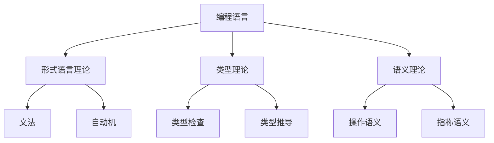

# 编程语言综合框架

## 目录

1. [概述](#1-概述)
2. [理论基础](#2-理论基础)
3. [语言范式](#3-语言范式)
4. [类型系统](#4-类型系统)
5. [语义理论](#5-语义理论)
6. [实现技术](#6-实现技术)
7. [语言设计](#7-语言设计)
8. [哲学批判与反思](#8-哲学批判与反思)
9. [理论整合](#9-理论整合)
10. [未来发展方向](#10-未来发展方向)

## 1. 概述

### 1.1 定义与范围

**定义 1.1.1** 编程语言 (Programming Language)
编程语言是用于表达计算过程和算法的形式化符号系统，具有语法、语义和语用三个层次。

**定义 1.1.2** 语言设计原则
编程语言设计应遵循以下原则：

- 简洁性：语言结构简单明了
- 一致性：语法和语义保持一致
- 表达能力：能够表达复杂的计算
- 可读性：程序易于理解和维护

### 1.2 核心特征

| 特征 | 描述 | 重要性 |
|------|------|--------|
| 抽象性 | 隐藏底层细节，提供高层抽象 | 高 |
| 表达性 | 能够表达复杂的计算逻辑 | 高 |
| 安全性 | 防止运行时错误和类型错误 | 高 |
| 效率性 | 生成高效的机器代码 | 中 |
| 可扩展性 | 支持语言扩展和库开发 | 中 |

### 1.3 理论地位



## 2. 理论基础

### 2.1 形式语言理论

#### 2.1.1 文法理论

**定义 2.1.1** 上下文无关文法
上下文无关文法是一个四元组 G = (V, Σ, R, S)，其中：

- V 是变量集（非终结符）
- Σ 是终结符集
- R 是产生式规则集
- S ∈ V 是起始符号

**示例 2.1.1** 简单算术表达式文法

```text
E → E + T | T
T → T * F | F
F → (E) | id
```

#### 2.1.2 自动机理论

**定义 2.1.2** 下推自动机
下推自动机是一个七元组 M = (Q, Σ, Γ, δ, q₀, Z₀, F)，其中：

- Q 是有限状态集
- Σ 是输入字母表
- Γ 是栈字母表
- δ: Q × Σ × Γ → P(Q × Γ*) 是转移函数
- q₀ ∈ Q 是初始状态
- Z₀ ∈ Γ 是初始栈符号
- F ⊆ Q 是接受状态集

### 2.2 类型理论

#### 2.2.1 简单类型理论

**定义 2.2.1** 类型
类型是值的集合，用于分类和约束程序中的值。

**定义 2.2.2** 类型环境
类型环境 Γ 是从变量到类型的映射：Γ: Var → Type

**定义 2.2.3** 类型判断
类型判断的形式为 Γ ⊢ e : τ，表示在环境 Γ 下，表达式 e 具有类型 τ。

#### 2.2.2 多态类型理论

**定义 2.2.4** 类型变量
类型变量 α, β, γ 表示未知类型。

**定义 2.2.5** 全称类型
全称类型 ∀α.τ 表示对所有类型 α，τ 都成立。

**示例 2.2.1** 多态恒等函数

```haskell
id :: ∀a. a -> a
id x = x
```

### 2.3 语义理论

#### 2.3.1 操作语义

**定义 2.3.1** 小步语义
小步语义描述程序的一步执行：⟨e, σ⟩ → ⟨e', σ'⟩

**示例 2.3.1** 算术表达式求值

```text
⟨x + y, σ⟩ → ⟨n, σ⟩    如果 σ(x) = n₁, σ(y) = n₂, n = n₁ + n₂
```

#### 2.3.2 指称语义

**定义 2.3.2** 指称语义
指称语义将程序映射到数学对象：e : State → Value

**示例 2.3.2** 变量指称

```text
x(σ) = σ(x)
```

## 3. 语言范式

### 3.1 命令式编程

#### 3.1.1 基本特征

**特征 3.1.1** 状态变化
命令式编程基于状态变化，程序通过修改内存状态来执行计算。

**特征 3.1.2** 顺序执行
程序按顺序执行指令，每条指令都可能改变程序状态。

**示例 3.1.1** 命令式程序

```rust
fn factorial(n: u32) -> u32 {
    let mut result = 1;
    let mut i = 1;
    while i <= n {
        result = result * i;
        i = i + 1;
    }
    result
}
```

#### 3.1.2 面向对象编程

**定义 3.1.1** 对象
对象是数据和方法的封装体，具有状态和行为。

**定义 3.1.2** 类
类是对象的模板，定义了对象的属性和方法。

**示例 3.1.2** 面向对象程序

```rust
struct Point {
    x: f64,
    y: f64,
}

impl Point {
    fn new(x: f64, y: f64) -> Point {
        Point { x, y }
    }
    
    fn distance(&self, other: &Point) -> f64 {
        ((self.x - other.x).powi(2) + (self.y - other.y).powi(2)).sqrt()
    }
}
```

### 3.2 函数式编程

#### 3.2.1 基本特征

**特征 3.2.1** 不可变性
函数式编程强调数据的不可变性，避免副作用。

**特征 3.2.2** 高阶函数
函数可以作为参数和返回值，支持函数组合。

**示例 3.2.1** 函数式程序

```haskell
factorial :: Integer -> Integer
factorial 0 = 1
factorial n = n * factorial (n - 1)

map :: (a -> b) -> [a] -> [b]
map _ [] = []
map f (x:xs) = f x : map f xs
```

#### 3.2.2 纯函数

**定义 3.2.1** 纯函数
纯函数是满足以下条件的函数：

- 相同输入总是产生相同输出
- 没有副作用
- 不依赖外部状态

**定理 3.2.1** (引用透明性)
纯函数满足引用透明性，即函数调用可以用其返回值替换。

### 3.3 逻辑编程

#### 3.3.1 基本特征

**特征 3.3.1** 声明式
逻辑编程是声明式的，描述"是什么"而非"怎么做"。

**特征 3.3.2** 基于规则
程序由事实和规则组成，通过推理引擎执行。

**示例 3.3.1** Prolog程序

```prolog
parent(john, mary).
parent(mary, bob).
ancestor(X, Y) :- parent(X, Y).
ancestor(X, Y) :- parent(X, Z), ancestor(Z, Y).
```

### 3.4 并发编程

#### 3.4.1 异步编程

**定义 3.4.1** 异步函数
异步函数可以暂停执行，让出控制权给其他任务。

**示例 3.4.1** Rust异步程序

```rust
async fn fetch_data(url: &str) -> Result<String, Box<dyn std::error::Error>> {
    let response = reqwest::get(url).await?;
    let text = response.text().await?;
    Ok(text)
}

#[tokio::main]
async fn main() {
    let data = fetch_data("https://api.example.com/data").await.unwrap();
    println!("{}", data);
}
```

#### 3.4.2 并发模型

**模型 3.4.1** Actor模型
Actor是独立的计算单元，通过消息传递通信。

**模型 3.4.2** CSP模型
通信顺序进程模型，强调进程间的同步通信。

## 4. 类型系统

### 4.1 类型检查

#### 4.1.1 静态类型检查

**定义 4.1.1** 静态类型
静态类型在编译时确定，编译器检查类型一致性。

**算法 4.1.1** 类型检查算法

```rust
fn type_check(expr: &Expr, env: &TypeEnv) -> Result<Type, TypeError> {
    match expr {
        Expr::Var(name) => {
            env.get(name).ok_or(TypeError::UnboundVariable(name.clone()))
        },
        Expr::App(f, arg) => {
            let f_type = type_check(f, env)?;
            let arg_type = type_check(arg, env)?;
            match f_type {
                Type::Arrow(param_type, return_type) => {
                    if param_type == arg_type {
                        Ok(*return_type)
                    } else {
                        Err(TypeError::TypeMismatch(param_type, arg_type))
                    }
                },
                _ => Err(TypeError::NotAFunction(f_type))
            }
        },
        Expr::Lambda(param, body) => {
            let param_type = Type::Var(format!("α_{}", param));
            let mut new_env = env.clone();
            new_env.insert(param.clone(), param_type.clone());
            let body_type = type_check(body, &new_env)?;
            Ok(Type::Arrow(Box::new(param_type), Box::new(body_type)))
        }
    }
}
```

#### 4.1.2 动态类型检查

**定义 4.1.2** 动态类型
动态类型在运行时确定，运行时检查类型一致性。

### 4.2 类型推导

#### 4.2.1 Hindley-Milner类型系统

**算法 4.2.1** 统一算法

```rust
fn unify(t1: &Type, t2: &Type) -> Result<Substitution, UnificationError> {
    match (t1, t2) {
        (Type::Var(v), t) | (t, Type::Var(v)) => {
            if occurs_in(v, t) {
                Err(UnificationError::OccursCheck)
            } else {
                Ok(Substitution::singleton(v.clone(), t.clone()))
            }
        },
        (Type::Arrow(a1, b1), Type::Arrow(a2, b2)) => {
            let s1 = unify(a1, a2)?;
            let s2 = unify(&b1.apply(&s1), &b2.apply(&s1))?;
            Ok(s1.compose(&s2))
        },
        (Type::Int, Type::Int) | (Type::Bool, Type::Bool) => {
            Ok(Substitution::empty())
        },
        _ => Err(UnificationError::TypeMismatch(t1.clone(), t2.clone()))
    }
}
```

### 4.3 高级类型系统

#### 4.3.1 依赖类型

**定义 4.3.1** 依赖类型
依赖类型允许类型依赖于值：Πx:A.B(x)

**示例 4.3.1** 向量长度类型

```haskell
data Vec : Nat -> Type -> Type where
  Nil  : Vec 0 a
  Cons : a -> Vec n a -> Vec (S n) a
```

#### 4.3.2 线性类型

**定义 4.3.2** 线性类型
线性类型确保值被使用且仅使用一次。

**示例 4.3.2** Rust所有权

```rust
fn take_ownership(s: String) -> String {
    s  // 转移所有权
}

fn main() {
    let s1 = String::from("hello");
    let s2 = take_ownership(s1);  // s1的所有权转移给s2
    // println!("{}", s1);  // 编译错误：s1已被移动
}
```

## 5. 语义理论

### 5.1 操作语义

#### 5.1.1 结构化操作语义

**定义 5.1.1** 配置
配置 ⟨e, σ⟩ 表示表达式 e 在状态 σ 下的执行。

**规则 5.1.1** 变量求值

```text
⟨x, σ⟩ → ⟨σ(x), σ⟩
```

**规则 5.1.2** 函数应用

```text
⟨e₁, σ⟩ → ⟨e₁', σ'⟩
─────────────────────
⟨e₁ e₂, σ⟩ → ⟨e₁' e₂, σ'⟩

⟨λx.e, σ⟩ v → ⟨e[v/x], σ⟩
```

#### 5.1.2 并发语义

**定义 5.1.2** 并发配置
并发配置 ⟨P₁ || P₂, σ⟩ 表示两个进程的并行执行。

**规则 5.1.3** 并行执行

```text
⟨P₁, σ⟩ → ⟨P₁', σ'⟩
─────────────────────
⟨P₁ || P₂, σ⟩ → ⟨P₁' || P₂, σ'⟩
```

### 5.2 指称语义

#### 5.2.1 环境模型

**定义 5.2.1** 语义域
语义域 D 是程序值的数学表示。

**定义 5.2.2** 环境
环境 ρ: Var → D 是从变量到语义值的映射。

**定义 5.2.3** 指称函数
指称函数 ·: Expr → (Env → D) 将表达式映射到语义值。

#### 5.2.2 连续语义

**定义 5.2.4** 连续函数
连续函数保持有向完备偏序的上确界。

**定理 5.2.1** (不动点定理)
每个连续函数都有最小不动点。

## 6. 实现技术

### 6.1 编译器技术

#### 6.1.1 词法分析

**定义 6.1.1** 词法分析器
词法分析器将源代码转换为词法单元序列。

**算法 6.1.1** 正则表达式到NFA

```rust
fn regex_to_nfa(regex: &str) -> NFA {
    let mut nfa = NFA::new();
    let mut stack = Vec::new();
    
    for c in regex.chars() {
        match c {
            '|' => {
                let right = stack.pop().unwrap();
                let left = stack.pop().unwrap();
                stack.push(nfa.alternation(left, right));
            },
            '*' => {
                let n = stack.pop().unwrap();
                stack.push(nfa.kleene_star(n));
            },
            _ => {
                stack.push(nfa.symbol(c));
            }
        }
    }
    
    stack.pop().unwrap()
}
```

#### 6.1.2 语法分析

**定义 6.1.2** 语法分析器
语法分析器将词法单元序列转换为抽象语法树。

**算法 6.1.2** 递归下降解析

```rust
fn parse_expression(tokens: &mut Peekable<Iter<Token>>) -> Result<Expr, ParseError> {
    let mut left = parse_term(tokens)?;
    
    while let Some(token) = tokens.peek() {
        match token {
            Token::Plus | Token::Minus => {
                let op = tokens.next().unwrap();
                let right = parse_term(tokens)?;
                left = Expr::Binary(op.clone(), Box::new(left), Box::new(right));
            },
            _ => break,
        }
    }
    
    Ok(left)
}
```

### 6.2 运行时系统

#### 6.2.1 内存管理

**策略 6.2.1** 垃圾回收
垃圾回收自动回收不再使用的内存。

**算法 6.2.1** 标记-清除算法

```rust
fn mark_sweep(heap: &mut Heap) {
    // 标记阶段
    for root in heap.roots() {
        mark(root, heap);
    }
    
    // 清除阶段
    heap.sweep();
}

fn mark(obj: ObjectId, heap: &mut Heap) {
    if heap.is_marked(obj) {
        return;
    }
    
    heap.mark(obj);
    for child in heap.children(obj) {
        mark(child, heap);
    }
}
```

#### 6.2.2 并发运行时

**模型 6.2.1** 工作窃取调度
工作窃取调度器平衡线程间的工作负载。

## 7. 语言设计

### 7.1 设计原则

#### 7.1.1 正交性

**原则 7.1.1** 正交设计
语言特性应该相互独立，组合使用时不产生意外行为。

#### 7.1.2 一致性

**原则 7.1.2** 一致语法
相似的构造应该使用相似的语法。

### 7.2 设计模式

#### 7.2.1 语法糖

**模式 7.2.1** 语法糖
语法糖提供更简洁的语法，但语义等价于基础构造。

**示例 7.2.1** 列表推导

```haskell
-- 语法糖
[x * 2 | x <- [1..5], even x]

-- 等价的基础构造
map (*2) (filter even [1..5])
```

#### 7.2.2 宏系统

**模式 7.2.2** 宏
宏在编译时进行代码转换，提供元编程能力。

**示例 7.2.2** Rust宏

```rust
macro_rules! vec {
    ( $( $x:expr ),* ) => {
        {
            let mut temp_vec = Vec::new();
            $(
                temp_vec.push($x);
            )*
            temp_vec
        }
    };
}
```

## 8. 哲学批判与反思

### 8.1 认识论批判

#### 8.1.1 抽象层次

**批判 8.1.1** 抽象复杂性
编程语言通过抽象隐藏复杂性，但这种抽象可能：

- 掩盖底层实现的复杂性
- 导致性能问题的误解
- 限制对系统行为的理解

**反思 8.1.1** 透明性平衡
需要在抽象便利性和实现透明性之间找到平衡：

- 提供多层次的抽象
- 允许必要时查看底层实现
- 保持抽象的一致性

#### 8.1.2 表达能力

**批判 8.1.2** 表达限制
每种编程语言都有其表达能力的限制：

- 某些问题难以用特定范式表达
- 语言设计可能限制创新思维
- 范式可能影响问题解决方式

### 8.2 方法论批判

#### 8.2.1 语言选择

**批判 8.2.1** 工具主义
编程语言选择可能受到非技术因素影响：

- 流行度而非适用性
- 学习成本而非表达能力
- 生态系统而非语言特性

#### 8.2.2 范式之争

**批判 8.2.2** 范式绝对化
不同编程范式可能被过度绝对化：

- 忽视范式的互补性
- 过度强调范式差异
- 忽略实际应用需求

### 8.3 价值论批判

#### 8.3.1 语言设计价值

**批判 8.3.1** 设计目标
语言设计的目标需要批判性评估：

- 简洁性是否牺牲了表达能力
- 安全性是否限制了灵活性
- 性能是否影响了可读性

#### 8.3.2 社会影响

**批判 8.3.2** 社会维度
编程语言具有社会维度：

- 语言可能反映设计者的价值观
- 语言可能影响编程社区文化
- 语言可能影响软件质量

## 9. 理论整合

### 9.1 跨学科整合

#### 9.1.1 语言学整合

**整合 9.1.1** 语言理论
编程语言理论可以从自然语言理论借鉴：

- 语法理论的应用
- 语义分析的方法
- 语用学的考虑

#### 9.1.2 认知科学整合

**整合 9.1.2** 认知模型
编程语言设计应考虑认知因素：

- 人类认知的限制
- 学习曲线的优化
- 错误预防的设计

### 9.2 技术整合

#### 9.2.1 工具链整合

**整合 9.2.1** 开发工具
编程语言需要完整的工具链支持：

- 编辑器集成
- 调试工具
- 性能分析工具

#### 9.2.2 标准整合

**整合 9.2.2** 标准化
编程语言需要标准化支持：

- 语言标准规范
- 库接口标准
- 工具接口标准

### 9.3 应用整合

#### 9.3.1 领域特定语言

**整合 9.3.1** DSL设计
领域特定语言需要与通用语言整合：

- 嵌入DSL的设计
- 外部DSL的实现
- DSL与通用语言的互操作

#### 9.3.2 多语言编程

**整合 9.3.2** 语言互操作
现代系统需要多语言协作：

- 语言间的接口设计
- 数据交换格式
- 运行时集成

## 10. 未来发展方向

### 10.1 技术发展趋势

#### 10.1.1 智能化

**趋势 10.1.1** AI辅助编程
编程语言将更加智能化：

- 自动代码生成
- 智能错误检测
- 自动优化建议

#### 10.1.2 并发性

**趋势 10.1.2** 并发编程
并发编程将成为主流：

- 更好的并发抽象
- 自动并发优化
- 并发安全性保证

### 10.2 语言设计趋势

#### 10.2.1 类型系统发展

**趋势 10.2.1** 高级类型
类型系统将更加高级：

- 依赖类型系统
- 线性类型系统
- 效应类型系统

#### 10.2.2 语义发展

**趋势 10.2.2** 形式语义
语义理论将更加形式化：

- 更精确的语义定义
- 更好的语义工具
- 更广泛的应用

### 10.3 应用领域扩展

#### 10.3.1 新兴领域

**扩展 10.3.1** 新应用
编程语言将扩展到新领域：

- 量子编程语言
- 生物编程语言
- 社会编程语言

#### 10.3.2 跨学科应用

**扩展 10.3.2** 学科融合
编程语言将促进学科融合：

- 数学与编程的融合
- 艺术与编程的融合
- 科学计算与编程的融合

## 总结

编程语言作为人类与计算机交互的重要媒介，承载着丰富的理论内涵和实践价值。从基本的语法语义理论到高级的类型系统，从传统的命令式编程到现代的函数式编程，编程语言展现了其强大的表达能力和适应能力。

然而，我们也需要保持批判性思维，认识到编程语言设计的复杂性和挑战性。通过哲学批判和理论整合，我们可以更好地理解编程语言的本质和价值，推动其在更广泛领域的应用和发展。

未来，随着技术的进步和理论的发展，编程语言将继续在软件开发、人工智能、科学计算等领域发挥重要作用，为人类创造更智能、更高效、更安全的计算环境。

---

-**参考文献**

1. Pierce, B. C. (2002). Types and Programming Languages. MIT Press.
2. Abelson, H., & Sussman, G. J. (1996). Structure and Interpretation of Computer Programs. MIT Press.
3. Scott, M. L. (2015). Programming Language Pragmatics. Morgan Kaufmann.
4. Winskel, G. (1993). The Formal Semantics of Programming Languages. MIT Press.
5. Cardelli, L., & Wegner, P. (1985). On understanding types, data abstraction, and polymorphism. ACM Computing Surveys, 17(4), 471-522.

-**相关链接**

- [返回主目录](../00_Master_Index/01_Comprehensive_Knowledge_System.md)
- [数学基础](../02_Mathematical_Foundation/01_Comprehensive_Mathematical_Framework.md)
- [理论体系](../03_Theoretical_System/01_Comprehensive_Theory_Framework.md)
- [形式模型](../04_Formal_Model/01_Comprehensive_Formal_Model_Framework.md)
- [形式语言](../07_Formal_Language/01_Automata_Theory.md)
