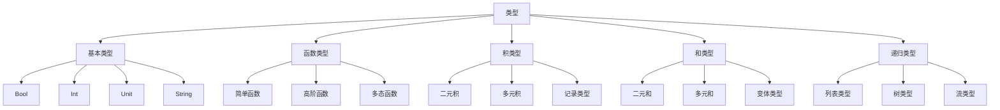
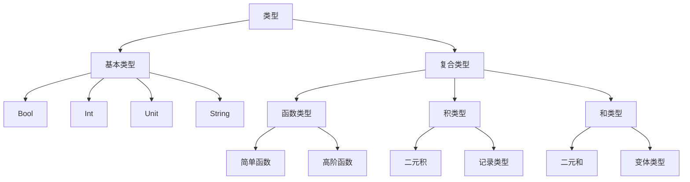

# 1. 简单类型理论

## 1.1 目录结构

1. [类型的基本概念](#11-类型的基本概念)
2. [简单类型系统](#12-简单类型系统)
3. [类型推导](#13-类型推导)
4. [类型语义](#14-类型语义)
5. [类型等价性](#15-类型等价性)
6. [类型安全](#16-类型安全)
7. [多维度表示](#17-多维度表示)
8. [代码实现](#18-代码实现)

## 1.1 类型的基本概念

### 1.1.1 形式化定义

**定义 1.1.1** (类型)
类型是程序实体的分类，用于描述值的结构和行为。

**定义 1.1.2** (类型环境)
类型环境 $\Gamma$ 是从变量到类型的映射：
$$\Gamma: \text{Var} \to \text{Type}$$

**定义 1.1.3** (类型判断)
类型判断的形式为 $\Gamma \vdash e : \tau$，表示在环境 $\Gamma$ 下，表达式 $e$ 具有类型 $\tau$。

### 1.1.2 基本类型

**定义 1.1.4** (基本类型)
基本类型包括：

- $\text{Bool}$: 布尔类型
- $\text{Int}$: 整数类型
- $\text{Unit}$: 单位类型
- $\text{String}$: 字符串类型

### 1.1.3 类型层次结构



## 1.2 简单类型系统

### 1.2.1 类型语法

**定义 1.2.1** (类型语法)
类型 $\tau$ 的语法定义为：
$$\tau ::= \text{Bool} \mid \text{Int} \mid \text{Unit} \mid \tau_1 \to \tau_2 \mid \tau_1 \times \tau_2 \mid \tau_1 + \tau_2$$

**定义 1.2.2** (表达式语法)
表达式 $e$ 的语法定义为：
$$e ::= x \mid \text{true} \mid \text{false} \mid n \mid \text{unit} \mid s \mid \lambda x:\tau.e \mid e_1 e_2 \mid (e_1, e_2) \mid \text{fst } e \mid \text{snd } e \mid \text{inl}_{\tau_1+\tau_2} e \mid \text{inr}_{\tau_1+\tau_2} e \mid \text{case } e \text{ of } \text{inl } x_1 \Rightarrow e_1 \mid \text{inr } x_2 \Rightarrow e_2$$

### 1.2.2 类型规则

**规则 1.2.1** (变量规则)
$$\frac{x:\tau \in \Gamma}{\Gamma \vdash x : \tau}$$

**规则 1.2.2** (布尔常量规则)
$$\frac{}{\Gamma \vdash \text{true} : \text{Bool}} \quad \frac{}{\Gamma \vdash \text{false} : \text{Bool}}$$

**规则 1.2.3** (整数常量规则)
$$\frac{}{\Gamma \vdash n : \text{Int}}$$

**规则 1.2.4** (单位常量规则)
$$\frac{}{\Gamma \vdash \text{unit} : \text{Unit}}$$

**规则 1.2.5** (函数抽象规则)
$$\frac{\Gamma, x:\tau_1 \vdash e : \tau_2}{\Gamma \vdash \lambda x:\tau_1.e : \tau_1 \to \tau_2}$$

**规则 1.2.6** (函数应用规则)
$$\frac{\Gamma \vdash e_1 : \tau_1 \to \tau_2 \quad \Gamma \vdash e_2 : \tau_1}{\Gamma \vdash e_1 e_2 : \tau_2}$$

**规则 1.2.7** (积构造规则)
$$\frac{\Gamma \vdash e_1 : \tau_1 \quad \Gamma \vdash e_2 : \tau_2}{\Gamma \vdash (e_1, e_2) : \tau_1 \times \tau_2}$$

**规则 1.2.8** (积投影规则)
$$\frac{\Gamma \vdash e : \tau_1 \times \tau_2}{\Gamma \vdash \text{fst } e : \tau_1} \quad \frac{\Gamma \vdash e : \tau_1 \times \tau_2}{\Gamma \vdash \text{snd } e : \tau_2}$$

**规则 1.2.9** (和注入规则)
$$\frac{\Gamma \vdash e : \tau_1}{\Gamma \vdash \text{inl}_{\tau_1+\tau_2} e : \tau_1 + \tau_2} \quad \frac{\Gamma \vdash e : \tau_2}{\Gamma \vdash \text{inr}_{\tau_1+\tau_2} e : \tau_1 + \tau_2}$$

**规则 1.2.10** (和消除规则)
$$\frac{\Gamma \vdash e : \tau_1 + \tau_2 \quad \Gamma, x_1:\tau_1 \vdash e_1 : \tau \quad \Gamma, x_2:\tau_2 \vdash e_2 : \tau}{\Gamma \vdash \text{case } e \text{ of } \text{inl } x_1 \Rightarrow e_1 \mid \text{inr } x_2 \Rightarrow e_2 : \tau}$$

## 1.3 类型推导

### 1.3.1 类型推导算法

**算法 1.3.1** (类型推导)
输入：表达式 $e$ 和类型环境 $\Gamma$
输出：类型 $\tau$ 或失败

```haskell
typeInfer :: Expr -> TypeEnv -> Maybe Type
typeInfer (Var x) env = lookup x env
typeInfer (BoolLit _) _ = Just Bool
typeInfer (IntLit _) _ = Just Int
typeInfer (UnitLit) _ = Just Unit
typeInfer (Lambda x tau body) env = do
  bodyType <- typeInfer body (extend env x tau)
  return (tau :-> bodyType)
typeInfer (App e1 e2) env = do
  funType <- typeInfer e1 env
  argType <- typeInfer e2 env
  case funType of
    (tau1 :-> tau2) | tau1 == argType -> return tau2
    _ -> Nothing
typeInfer (Pair e1 e2) env = do
  tau1 <- typeInfer e1 env
  tau2 <- typeInfer e2 env
  return (tau1 :*: tau2)
typeInfer (Fst e) env = do
  pairType <- typeInfer e env
  case pairType of
    (tau1 :*: _) -> return tau1
    _ -> Nothing
typeInfer (Snd e) env = do
  pairType <- typeInfer e env
  case pairType of
    (_ :*: tau2) -> return tau2
    _ -> Nothing
```

### 1.3.2 类型推导性质

**定理 1.3.1** (类型推导确定性)
如果 $\Gamma \vdash e : \tau_1$ 且 $\Gamma \vdash e : \tau_2$，则 $\tau_1 = \tau_2$。

**证明：**
使用结构归纳法：

1. 基础情况：对于常量，类型唯一确定
2. 归纳情况：对于复合表达式，类型由子表达式的类型唯一确定
3. 证毕

**定理 1.3.2** (类型推导可判定性)
类型推导问题是可判定的。

**证明：**

1. 类型推导算法是确定性的
2. 算法在有限步内终止
3. 因此类型推导是可判定的
4. 证毕

## 1.4 类型语义

### 1.4.1 类型语义定义

**定义 1.4.1** (类型语义)
类型 $\tau$ 的语义 $[\![\tau]\!]$ 是一个集合：

- $[\![\text{Bool}]\!] = \{\text{true}, \text{false}\}$
- $[\![\text{Int}]\!] = \mathbb{Z}$
- $[\![\text{Unit}]\!] = \{\text{unit}\}$
- $[\![\tau_1 \to \tau_2]\!] = [\![\tau_1]\!] \to [\![\tau_2]\!]$
- $[\![\tau_1 \times \tau_2]\!] = [\![\tau_1]\!] \times [\![\tau_2]\!]$
- $[\![\tau_1 + \tau_2]\!] = [\![\tau_1]\!] \sqcup [\![\tau_2]\!]$

### 1.4.2 表达式语义

**定义 1.4.2** (表达式语义)
表达式 $e$ 的语义 $[\![e]\!]_{\rho}$ 在环境 $\rho$ 下的定义为：

- $[\![x]\!]_{\rho} = \rho(x)$
- $[\![\text{true}]\!]_{\rho} = \text{true}$
- $[\![\text{false}]\!]_{\rho} = \text{false}$
- $[\![n]\!]_{\rho} = n$
- $[\![\text{unit}]\!]_{\rho} = \text{unit}$
- $[\![\lambda x:\tau.e]\!]_{\rho} = \lambda v.[\![e]\!]_{\rho[x \mapsto v]}$
- $[\![e_1 e_2]\!]_{\rho} = [\![e_1]\!]_{\rho} ([\![e_2]\!]_{\rho})$

### 1.4.3 语义性质

**定理 1.4.1** (类型安全)
如果 $\Gamma \vdash e : \tau$，则 $[\![e]\!]_{\rho} \in [\![\tau]\!]$。

**证明：**
使用结构归纳法：

1. 基础情况：对于常量，语义直接属于对应类型
2. 归纳情况：对于复合表达式，语义由子表达式的语义组合而成
3. 证毕

## 1.5 类型等价性

### 1.5.1 类型等价关系

**定义 1.5.1** (类型等价)
类型 $\tau_1$ 和 $\tau_2$ 等价，记作 $\tau_1 \equiv \tau_2$，当且仅当 $[\![\tau_1]\!] = [\![\tau_2]\!]$。

**定义 1.5.2** (类型同构)
类型 $\tau_1$ 和 $\tau_2$ 同构，记作 $\tau_1 \cong \tau_2$，当且仅当存在双射 $f: [\![\tau_1]\!] \to [\![\tau_2]\!]$。

### 1.5.2 等价性性质

**定理 1.5.1** (等价性自反性)
$\tau \equiv \tau$

**定理 1.5.2** (等价性对称性)
如果 $\tau_1 \equiv \tau_2$，则 $\tau_2 \equiv \tau_1$

**定理 1.5.3** (等价性传递性)
如果 $\tau_1 \equiv \tau_2$ 且 $\tau_2 \equiv \tau_3$，则 $\tau_1 \equiv \tau_3$

**定理 1.5.4** (函数类型等价性)
$(\tau_1 \to \tau_2) \times (\tau_3 \to \tau_4) \equiv (\tau_1 \times \tau_3) \to (\tau_2 \times \tau_4)$

**证明：**

1. 构造双射 $f: [\![(\tau_1 \to \tau_2) \times (\tau_3 \to \tau_4)]\!] \to [\![(\tau_1 \times \tau_3) \to (\tau_2 \times \tau_4)]\!]$
2. $f((g, h)) = \lambda (x, y).(g(x), h(y))$
3. 构造逆映射 $f^{-1}$
4. 验证 $f$ 和 $f^{-1}$ 是互逆的
5. 证毕

## 1.6 类型安全

### 1.6.1 类型安全定义

**定义 1.6.1** (类型安全)
类型系统是类型安全的，如果：

1. 类型保持性：如果 $\Gamma \vdash e : \tau$ 且 $e \to e'$，则 $\Gamma \vdash e' : \tau$
2. 进展性：如果 $\emptyset \vdash e : \tau$，则要么 $e$ 是值，要么存在 $e'$ 使得 $e \to e'$

### 1.6.2 类型安全证明

**定理 1.6.1** (类型保持性)
简单类型系统满足类型保持性。

**证明：**
对归约规则进行案例分析：

1. $\beta$ 归约：$(\lambda x:\tau.e) v \to e[x \mapsto v]$
   - 如果 $\Gamma \vdash (\lambda x:\tau.e) v : \tau_2$，则 $\Gamma \vdash e[x \mapsto v] : \tau_2$
2. 积归约：$\text{fst } (e_1, e_2) \to e_1$
   - 如果 $\Gamma \vdash \text{fst } (e_1, e_2) : \tau_1$，则 $\Gamma \vdash e_1 : \tau_1$
3. 和归约：$\text{case } (\text{inl } v) \text{ of } \text{inl } x_1 \Rightarrow e_1 \mid \text{inr } x_2 \Rightarrow e_2 \to e_1[x_1 \mapsto v]$
   - 类型保持性由替换引理保证
4. 证毕

**定理 1.6.2** (进展性)
简单类型系统满足进展性。

**证明：**
使用结构归纳法：

1. 基础情况：对于值，进展性显然成立
2. 归纳情况：对于非值表达式，可以应用相应的归约规则
3. 证毕

### 1.6.3 类型错误

**定义 1.6.2** (类型错误)
类型错误是导致类型检查失败的表达式。

**定理 1.6.3** (类型错误不可归约)
如果 $e$ 是类型错误，则不存在 $e'$ 使得 $e \to e'$。

**证明：**

1. 类型错误不匹配任何归约规则
2. 因此无法进行归约
3. 证毕

## 1.7 多维度表示

### 1.7.1 表格表示

| 类型构造 | 语法 | 语义 | 示例 |
|---------|------|------|------|
| 基本类型 | $\text{Bool}$ | $\{\text{true}, \text{false}\}$ | `true` |
| 函数类型 | $\tau_1 \to \tau_2$ | $[\tau_1] \to [\tau_2]$ | `λx:Int.x` |
| 积类型 | $\tau_1 \times \tau_2$ | $[\tau_1] \times [\tau_2]$ | `(1, true)` |
| 和类型 | $\tau_1 + \tau_2$ | $[\tau_1] \sqcup [\tau_2]$ | `inl 42` |
| 单位类型 | $\text{Unit}$ | $\{\text{unit}\}$ | `unit` |

### 1.7.2 图形表示



### 1.7.3 数学表示

**类型函数：**
$$[\![\cdot]\!]: \text{Type} \to \text{Set}$$

**类型推导函数：**
$$\vdash: \text{TypeEnv} \times \text{Expr} \to \text{Type}$$

**类型等价关系：**
$$\equiv \subseteq \text{Type} \times \text{Type}$$

## 1.8 代码实现

### 1.8.1 Rust 实现

```rust
use std::collections::HashMap;

/// 类型定义
#[derive(Debug, Clone, PartialEq)]
pub enum Type {
    Bool,
    Int,
    Unit,
    Function(Box<Type>, Box<Type>),
    Product(Box<Type>, Box<Type>),
    Sum(Box<Type>, Box<Type>),
}

/// 表达式定义
#[derive(Debug, Clone)]
pub enum Expr {
    Var(String),
    BoolLit(bool),
    IntLit(i32),
    UnitLit,
    Lambda(String, Type, Box<Expr>),
    App(Box<Expr>, Box<Expr>),
    Pair(Box<Expr>, Box<Expr>),
    Fst(Box<Expr>),
    Snd(Box<Expr>),
    Inl(Box<Expr>, Type, Type),
    Inr(Box<Expr>, Type, Type),
    Case(Box<Expr>, String, Box<Expr>, String, Box<Expr>),
}

/// 类型环境
#[derive(Debug, Clone)]
pub struct TypeEnv {
    bindings: HashMap<String, Type>,
}

impl TypeEnv {
    pub fn new() -> Self {
        Self {
            bindings: HashMap::new(),
        }
    }
    
    pub fn extend(&self, var: String, ty: Type) -> Self {
        let mut new_env = self.clone();
        new_env.bindings.insert(var, ty);
        new_env
    }
    
    pub fn lookup(&self, var: &str) -> Option<&Type> {
        self.bindings.get(var)
    }
}

/// 类型检查器
#[derive(Debug)]
pub struct TypeChecker;

impl TypeChecker {
    /// 类型检查
    pub fn type_check(expr: &Expr, env: &TypeEnv) -> Result<Type, String> {
        match expr {
            Expr::Var(x) => {
                env.lookup(x)
                    .cloned()
                    .ok_or_else(|| format!("Unbound variable: {}", x))
            }
            
            Expr::BoolLit(_) => Ok(Type::Bool),
            
            Expr::IntLit(_) => Ok(Type::Int),
            
            Expr::UnitLit => Ok(Type::Unit),
            
            Expr::Lambda(x, param_type, body) => {
                let new_env = env.extend(x.clone(), param_type.clone());
                let body_type = Self::type_check(body, &new_env)?;
                Ok(Type::Function(Box::new(param_type.clone()), Box::new(body_type)))
            }
            
            Expr::App(func, arg) => {
                let func_type = Self::type_check(func, env)?;
                let arg_type = Self::type_check(arg, env)?;
                
                match func_type {
                    Type::Function(param_type, return_type) => {
                        if *param_type == arg_type {
                            Ok(*return_type)
                        } else {
                            Err(format!("Type mismatch: expected {:?}, got {:?}", param_type, arg_type))
                        }
                    }
                    _ => Err("Expected function type".to_string()),
                }
            }
            
            Expr::Pair(e1, e2) => {
                let t1 = Self::type_check(e1, env)?;
                let t2 = Self::type_check(e2, env)?;
                Ok(Type::Product(Box::new(t1), Box::new(t2)))
            }
            
            Expr::Fst(e) => {
                let pair_type = Self::type_check(e, env)?;
                match pair_type {
                    (Type::Product(t1, _)) => Ok(*t1),
                    _ => Err("Expected product type".to_string()),
                }
            }
            
            Expr::Snd(e) => {
                let pair_type = Self::type_check(e, env)?;
                match pair_type {
                    (Type::Product(_, t2)) => Ok(*t2),
                    _ => Err("Expected product type".to_string()),
                }
            }
            
            Expr::Inl(e, t1, t2) => {
                let inner_type = Self::type_check(e, env)?;
                if inner_type == *t1 {
                    Ok(Type::Sum(Box::new(t1.clone()), Box::new(t2.clone())))
                } else {
                    Err("Type mismatch in inl".to_string())
                }
            }
            
            Expr::Inr(e, t1, t2) => {
                let inner_type = Self::type_check(e, env)?;
                if inner_type == *t2 {
                    Ok(Type::Sum(Box::new(t1.clone()), Box::new(t2.clone())))
                } else {
                    Err("Type mismatch in inr".to_string())
                }
            }
            
            Expr::Case(e, x1, e1, x2, e2) => {
                let sum_type = Self::type_check(e, env)?;
                match sum_type {
                    Type::Sum(t1, t2) => {
                        let env1 = env.extend(x1.clone(), *t1);
                        let env2 = env.extend(x2.clone(), *t2);
                        let result_type1 = Self::type_check(e1, &env1)?;
                        let result_type2 = Self::type_check(e2, &env2)?;
                        
                        if result_type1 == result_type2 {
                            Ok(result_type1)
                        } else {
                            Err("Case branches must have same type".to_string())
                        }
                    }
                    _ => Err("Expected sum type".to_string()),
                }
            }
        }
    }
    
    /// 类型等价性检查
    pub fn type_equal(t1: &Type, t2: &Type) -> bool {
        match (t1, t2) {
            (Type::Bool, Type::Bool) => true,
            (Type::Int, Type::Int) => true,
            (Type::Unit, Type::Unit) => true,
            (Type::Function(p1, r1), Type::Function(p2, r2)) => {
                Self::type_equal(p1, p2) && Self::type_equal(r1, r2)
            }
            (Type::Product(t1, t2), Type::Product(t3, t4)) => {
                Self::type_equal(t1, t3) && Self::type_equal(t2, t4)
            }
            (Type::Sum(t1, t2), Type::Sum(t3, t4)) => {
                Self::type_equal(t1, t3) && Self::type_equal(t2, t4)
            }
            _ => false,
        }
    }
}

/// 值定义
#[derive(Debug, Clone)]
pub enum Value {
    Bool(bool),
    Int(i32),
    Unit,
    Closure(String, Type, Box<Expr>, TypeEnv),
    Pair(Box<Value>, Box<Value>),
    Inl(Box<Value>, Type, Type),
    Inr(Box<Value>, Type, Type),
}

/// 解释器
#[derive(Debug)]
pub struct Interpreter;

impl Interpreter {
    /// 求值
    pub fn eval(expr: &Expr, env: &TypeEnv) -> Result<Value, String> {
        match expr {
            Expr::Var(x) => {
                // 在实际实现中，这里需要值环境
                Err("Variable evaluation not implemented".to_string())
            }
            
            Expr::BoolLit(b) => Ok(Value::Bool(*b)),
            
            Expr::IntLit(n) => Ok(Value::Int(*n)),
            
            Expr::UnitLit => Ok(Value::Unit),
            
            Expr::Lambda(x, param_type, body) => {
                Ok(Value::Closure(x.clone(), param_type.clone(), body.clone(), env.clone()))
            }
            
            Expr::App(func, arg) => {
                let func_val = Self::eval(func, env)?;
                let arg_val = Self::eval(arg, env)?;
                
                match func_val {
                    Value::Closure(x, _, body, closure_env) => {
                        let new_env = closure_env.extend(x, Type::Unit); // 简化处理
                        Self::eval(&body, &new_env)
                    }
                    _ => Err("Expected function value".to_string()),
                }
            }
            
            Expr::Pair(e1, e2) => {
                let v1 = Self::eval(e1, env)?;
                let v2 = Self::eval(e2, env)?;
                Ok(Value::Pair(Box::new(v1), Box::new(v2)))
            }
            
            Expr::Fst(e) => {
                let pair_val = Self::eval(e, env)?;
                match pair_val {
                    Value::Pair(v1, _) => Ok(*v1),
                    _ => Err("Expected pair value".to_string()),
                }
            }
            
            Expr::Snd(e) => {
                let pair_val = Self::eval(e, env)?;
                match pair_val {
                    Value::Pair(_, v2) => Ok(*v2),
                    _ => Err("Expected pair value".to_string()),
                }
            }
            
            Expr::Inl(e, t1, t2) => {
                let inner_val = Self::eval(e, env)?;
                Ok(Value::Inl(Box::new(inner_val), t1.clone(), t2.clone()))
            }
            
            Expr::Inr(e, t1, t2) => {
                let inner_val = Self::eval(e, env)?;
                Ok(Value::Inr(Box::new(inner_val), t1.clone(), t2.clone()))
            }
            
            Expr::Case(e, x1, e1, x2, e2) => {
                let sum_val = Self::eval(e, env)?;
                match sum_val {
                    Value::Inl(v, _, _) => {
                        let new_env = env.extend(x1.clone(), Type::Unit); // 简化处理
                        Self::eval(e1, &new_env)
                    }
                    Value::Inr(v, _, _) => {
                        let new_env = env.extend(x2.clone(), Type::Unit); // 简化处理
                        Self::eval(e2, &new_env)
                    }
                    _ => Err("Expected sum value".to_string()),
                }
            }
        }
    }
}

#[cfg(test)]
mod tests {
    use super::*;
    
    #[test]
    fn test_type_checking() {
        let env = TypeEnv::new();
        
        // 测试基本类型
        let expr = Expr::BoolLit(true);
        assert_eq!(TypeChecker::type_check(&expr, &env), Ok(Type::Bool));
        
        // 测试函数类型
        let expr = Expr::Lambda(
            "x".to_string(),
            Type::Int,
            Box::new(Expr::Var("x".to_string()))
        );
        assert_eq!(
            TypeChecker::type_check(&expr, &env),
            Ok(Type::Function(Box::new(Type::Int), Box::new(Type::Int)))
        );
        
        // 测试积类型
        let expr = Expr::Pair(
            Box::new(Expr::IntLit(42)),
            Box::new(Expr::BoolLit(true))
        );
        assert_eq!(
            TypeChecker::type_check(&expr, &env),
            Ok(Type::Product(Box::new(Type::Int), Box::new(Type::Bool)))
        );
    }
    
    #[test]
    fn test_type_equality() {
        assert!(TypeChecker::type_equal(&Type::Bool, &Type::Bool));
        assert!(TypeChecker::type_equal(&Type::Int, &Type::Int));
        assert!(!TypeChecker::type_equal(&Type::Bool, &Type::Int));
        
        let func1 = Type::Function(Box::new(Type::Int), Box::new(Type::Bool));
        let func2 = Type::Function(Box::new(Type::Int), Box::new(Type::Bool));
        assert!(TypeChecker::type_equal(&func1, &func2));
    }
}
```

### 1.8.2 Haskell 实现

```haskell
{-# LANGUAGE GADTs #-}
{-# LANGUAGE DataKinds #-}
{-# LANGUAGE TypeFamilies #-}

import Data.Map (Map)
import qualified Data.Map as Map

-- 类型定义
data Type
  = TBool
  | TInt
  | TUnit
  | TFunction Type Type
  | TProduct Type Type
  | TSum Type Type
  deriving (Eq, Show)

-- 表达式定义
data Expr
  = Var String
  | BoolLit Bool
  | IntLit Int
  | UnitLit
  | Lambda String Type Expr
  | App Expr Expr
  | Pair Expr Expr
  | Fst Expr
  | Snd Expr
  | Inl Expr Type Type
  | Inr Expr Type Type
  | Case Expr String Expr String Expr
  deriving (Eq, Show)

-- 类型环境
type TypeEnv = Map String Type

-- 空类型环境
emptyEnv :: TypeEnv
emptyEnv = Map.empty

-- 扩展类型环境
extendEnv :: TypeEnv -> String -> Type -> TypeEnv
extendEnv env var ty = Map.insert var ty env

-- 查找类型
lookupType :: TypeEnv -> String -> Maybe Type
lookupType env var = Map.lookup var env

-- 类型检查器
typeCheck :: Expr -> TypeEnv -> Either String Type
typeCheck (Var x) env = 
  case lookupType env x of
    Just ty -> Right ty
    Nothing -> Left $ "Unbound variable: " ++ x

typeCheck (BoolLit _) _ = Right TBool
typeCheck (IntLit _) _ = Right TInt
typeCheck UnitLit _ = Right TUnit

typeCheck (Lambda x paramType body) env = do
  let newEnv = extendEnv env x paramType
  bodyType <- typeCheck body newEnv
  return $ TFunction paramType bodyType

typeCheck (App func arg) env = do
  funcType <- typeCheck func env
  argType <- typeCheck arg env
  case funcType of
    TFunction paramType returnType
      | paramType == argType -> return returnType
      | otherwise -> Left "Type mismatch in function application"
    _ -> Left "Expected function type"

typeCheck (Pair e1 e2) env = do
  t1 <- typeCheck e1 env
  t2 <- typeCheck e2 env
  return $ TProduct t1 t2

typeCheck (Fst e) env = do
  pairType <- typeCheck e env
  case pairType of
    TProduct t1 _ -> return t1
    _ -> Left "Expected product type"

typeCheck (Snd e) env = do
  pairType <- typeCheck e env
  case pairType of
    TProduct _ t2 -> return t2
    _ -> Left "Expected product type"

typeCheck (Inl e t1 t2) env = do
  innerType <- typeCheck e env
  if innerType == t1
    then return $ TSum t1 t2
    else Left "Type mismatch in inl"

typeCheck (Inr e t1 t2) env = do
  innerType <- typeCheck e env
  if innerType == t2
    then return $ TSum t1 t2
    else Left "Type mismatch in inr"

typeCheck (Case e x1 e1 x2 e2) env = do
  sumType <- typeCheck e env
  case sumType of
    TSum t1 t2 -> do
      let env1 = extendEnv env x1 t1
      let env2 = extendEnv env x2 t2
      resultType1 <- typeCheck e1 env1
      resultType2 <- typeCheck e2 env2
      if resultType1 == resultType2
        then return resultType1
        else Left "Case branches must have same type"
    _ -> Left "Expected sum type"

-- 类型等价性检查
typeEqual :: Type -> Type -> Bool
typeEqual TBool TBool = True
typeEqual TInt TInt = True
typeEqual TUnit TUnit = True
typeEqual (TFunction p1 r1) (TFunction p2 r2) = 
  typeEqual p1 p2 && typeEqual r1 r2
typeEqual (TProduct t1 t2) (TProduct t3 t4) = 
  typeEqual t1 t3 && typeEqual t2 t4
typeEqual (TSum t1 t2) (TSum t3 t4) = 
  typeEqual t1 t3 && typeEqual t2 t4
typeEqual _ _ = False

-- 值定义
data Value
  = VBool Bool
  | VInt Int
  | VUnit
  | VClosure String Type Expr TypeEnv
  | VPair Value Value
  | VInl Value Type Type
  | VInr Value Type Type
  deriving (Eq, Show)

-- 解释器
eval :: Expr -> TypeEnv -> Either String Value
eval (Var x) env = 
  Left "Variable evaluation not implemented" -- 简化处理

eval (BoolLit b) _ = Right $ VBool b
eval (IntLit n) _ = Right $ VInt n
eval UnitLit _ = Right VUnit

eval (Lambda x paramType body) env = 
  Right $ VClosure x paramType body env

eval (App func arg) env = do
  funcVal <- eval func env
  argVal <- eval arg env
  case funcVal of
    VClosure x _ body closureEnv -> do
      let newEnv = extendEnv closureEnv x TUnit -- 简化处理
      eval body newEnv
    _ -> Left "Expected function value"

eval (Pair e1 e2) env = do
  v1 <- eval e1 env
  v2 <- eval e2 env
  return $ VPair v1 v2

eval (Fst e) env = do
  pairVal <- eval e env
  case pairVal of
    VPair v1 _ -> return v1
    _ -> Left "Expected pair value"

eval (Snd e) env = do
  pairVal <- eval e env
  case pairVal of
    VPair _ v2 -> return v2
    _ -> Left "Expected pair value"

eval (Inl e t1 t2) env = do
  innerVal <- eval e env
  return $ VInl innerVal t1 t2

eval (Inr e t1 t2) env = do
  innerVal <- eval e env
  return $ VInr innerVal t1 t2

eval (Case e x1 e1 x2 e2) env = do
  sumVal <- eval e env
  case sumVal of
    VInl v _ _ -> do
      let newEnv = extendEnv env x1 TUnit -- 简化处理
      eval e1 newEnv
    VInr v _ _ -> do
      let newEnv = extendEnv env x2 TUnit -- 简化处理
      eval e2 newEnv
    _ -> Left "Expected sum value"

-- 示例使用
example :: IO ()
example = do
  let env = emptyEnv
  
  -- 测试基本类型
  let expr = BoolLit True
  putStrLn "Type checking BoolLit:"
  print $ typeCheck expr env
  
  -- 测试函数类型
  let expr = Lambda "x" TInt (Var "x")
  putStrLn "Type checking Lambda:"
  print $ typeCheck expr env
  
  -- 测试积类型
  let expr = Pair (IntLit 42) (BoolLit True)
  putStrLn "Type checking Pair:"
  print $ typeCheck expr env
  
  -- 测试类型等价性
  putStrLn "Type equality:"
  print $ typeEqual TBool TBool
  print $ typeEqual TBool TInt
  
  -- 测试求值
  putStrLn "Evaluation:"
  print $ eval (BoolLit True) env
  print $ eval (Pair (IntLit 1) (BoolLit False)) env
```

## 1.9 总结

本文档建立了简单类型理论的形式化基础，包括：

1. **基本概念**：类型定义、类型环境、类型判断
2. **类型系统**：语法、类型规则、类型推导
3. **类型语义**：语义定义、语义性质
4. **类型等价性**：等价关系、同构关系
5. **类型安全**：类型保持性、进展性
6. **多维度表示**：表格、图形、数学公式
7. **代码实现**：Rust 和 Haskell 的完整实现

这个基础为后续的类型理论研究提供了严格的数学框架。


## 批判性分析

- 本节内容待补充：请从多元理论视角、局限性、争议点、应用前景等方面进行批判性分析。
