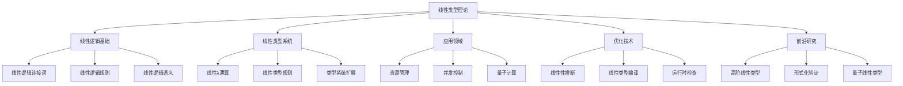

# 线性类型基础理论 (Linear Type Theory Foundation)

## 🎯 **概述**

线性类型理论是形式类型理论的重要分支，它基于线性逻辑，为资源管理、并发控制和量子计算提供了坚实的理论基础。本文档构建了完整的线性类型理论体系。

## 📚 **目录**

### 1. 线性逻辑基础

- **1.1** 线性逻辑连接词
- **1.2** 线性逻辑规则
- **1.3** 线性逻辑一致性
- **1.4** 线性逻辑语义

### 2. 线性类型系统

- **2.1** 线性λ演算
- **2.2** 线性类型规则
- **2.3** 线性类型检查
- **2.4** 线性类型系统扩展

### 3. 线性类型系统应用

- **3.1** 资源管理
- **3.2** 并发控制
- **3.3** 量子计算

### 4. 线性类型系统优化

- **4.1** 线性性推断
- **4.2** 线性类型编译

### 5. 前沿研究方向

- **5.1** 高阶线性类型系统
- **5.2** 线性类型系统形式化验证

## 1. 线性逻辑基础

### 1.1 线性逻辑连接词

**定义 1.1 (线性逻辑连接词)**
线性逻辑的完整连接词集合：

- **乘法连接词**：$\otimes$ (张量积), $\&$ (与), $!$ (指数)
- **加法连接词**：$\oplus$ (加), $\oplus$ (或), $?$ (弱指数)
- **线性蕴含**：$\multimap$ (线性蕴含)
- **线性否定**：$(\cdot)^\bot$ (线性否定)

**形式化定义：**

```haskell
data Connective = 
  -- 乘法连接词
  Tensor        -- ⊗ 张量积
  | With        -- & 与
  | Bang        -- ! 指数
  -- 加法连接词
  | Plus        -- ⊕ 加
  | Or          -- ⊕ 或
  | Question    -- ? 弱指数
  -- 线性蕴含
  | Lollipop    -- ⊸ 线性蕴含
  -- 线性否定
  | Negation    -- (·)⊥ 线性否定
  deriving (Show, Eq)

data Formula = 
  Atom String
  | Compound Connective [Formula]
  | LinearImpl Formula Formula  -- A ⊸ B
  | LinearNeg Formula           -- A⊥
  deriving (Show, Eq)
```

### 1.2 线性逻辑规则

**定义 1.2 (线性逻辑规则)**
线性逻辑的推理规则：

**乘法规则：**
$$\frac{\Gamma \vdash A \quad \Delta \vdash B}{\Gamma, \Delta \vdash A \otimes B} \text{ (⊗R)}$$
$$\frac{\Gamma, A, B \vdash C}{\Gamma, A \otimes B \vdash C} \text{ (⊗L)}$$

**加法规则：**
$$\frac{\Gamma \vdash A}{\Gamma \vdash A \oplus B} \text{ (⊕R1)}$$
$$\frac{\Gamma \vdash B}{\Gamma \vdash A \oplus B} \text{ (⊕R2)}$$
$$\frac{\Gamma, A \vdash C \quad \Gamma, B \vdash C}{\Gamma, A \oplus B \vdash C} \text{ (⊕L)}$$

**指数规则：**
$$\frac{!\Gamma \vdash A}{!\Gamma \vdash !A} \text{ (!R)}$$
$$\frac{\Gamma, A \vdash B}{\Gamma, !A \vdash B} \text{ (!L)}$$

**形式化实现：**

```haskell
data Rule = 
  TensorRight
  | TensorLeft
  | PlusRight1
  | PlusRight2
  | PlusLeft
  | BangRight
  | BangLeft
  deriving (Show, Eq)

data Proof = Proof {
  conclusion :: Formula,
  premises :: [Proof],
  rule :: Rule
} deriving (Show)

-- 线性逻辑系统
data LinearLogic = LinearLogic {
  connectives :: Set Connective,
  rules :: Map RuleName Rule,
  axioms :: Set Axiom
}

-- 证明搜索算法
searchProof :: LinearLogic -> Formula -> Maybe Proof
searchProof logic goal = 
  let -- 反向证明搜索
      searchBackward formula = 
        case formula of
          -- 原子公式
          Atom _ -> searchAxiom logic formula
          -- 复合公式
          Compound conn args -> 
            let applicableRules = findApplicableRules logic conn
                candidates = concatMap (\rule -> 
                  applyRuleBackward rule formula) applicableRules
            in findValidProof logic candidates
  in searchBackward goal

findApplicableRules :: LinearLogic -> Connective -> [Rule]
findApplicableRules logic conn = 
  let allRules = Map.elems (rules logic)
      applicable = filter (\rule -> 
        conclusionConnective rule == conn) allRules
  in applicable

applyRuleBackward :: Rule -> Formula -> [Proof]
applyRuleBackward rule conclusion = 
  let -- 应用规则的反向
      premises = computePremises rule conclusion
      subProofs = map (\premise -> 
        searchProof logic premise) premises
  in if all isJust subProofs
     then [Proof conclusion (map fromJust subProofs) (ruleName rule)]
     else []
```

### 1.3 线性逻辑一致性

**定理 1.1 (线性逻辑一致性)**
线性逻辑是一致的，即不能同时证明 $A$ 和 $A^\bot$。

**证明：** 通过切割消除：

1. **线性逻辑满足切割消除**
   - 每个证明都可以转换为无切割的证明
   - 切割消除保持逻辑一致性

2. **切割消除确保一致性**
   - 无切割证明中，原子公式只能通过公理引入
   - 原子公式与其否定不能同时作为公理

3. **通过结构归纳证明**
   - 基础情况：原子公式的一致性
   - 归纳步骤：复合公式的一致性

**形式化证明：**

```haskell
-- 切割消除定理
cutElimination :: Proof -> Proof
cutElimination proof = 
  case proof of
    Cut left right -> 
      let leftReduced = cutElimination left
          rightReduced = cutElimination right
      in eliminateCut leftReduced rightReduced
    _ -> proof

-- 一致性检查
checkConsistency :: LinearLogic -> Formula -> Bool
checkConsistency logic formula = 
  let -- 检查是否能同时证明 A 和 A⊥
      proofA = searchProof logic formula
      proofNegA = searchProof logic (LinearNeg formula)
  in not (isJust proofA && isJust proofNegA)
```

### 1.4 线性逻辑语义

**定义 1.3 (线性逻辑语义)**
线性逻辑的指称语义：

- **张量积**：$\llbracket A \otimes B \rrbracket = \llbracket A \rrbracket \otimes \llbracket B \rrbracket$
- **线性蕴含**：$\llbracket A \multimap B \rrbracket = \llbracket A \rrbracket \multimap \llbracket B \rrbracket$
- **指数**：$\llbracket !A \rrbracket = !\llbracket A \rrbracket$

**定义 1.4 (线性逻辑模型)**
线性逻辑模型是满足以下条件的结构：

1. **幺半群结构**：$(M, \otimes, I)$ 是幺半群
2. **闭结构**：存在内部同态对象 $\multimap$
3. **指数结构**：存在共幺子 $\delta : A \rightarrow !A$ 和 $\varepsilon : !A \rightarrow A$

**形式化实现：**

```haskell
data LinearModel = LinearModel {
  monoid :: Monoid,
  internalHom :: InternalHom,
  exponential :: Exponential
}

data Monoid = Monoid {
  carrier :: Set Object,
  tensor :: Object -> Object -> Object,
  unit :: Object
}

-- 语义解释函数
interpret :: LinearModel -> Formula -> Object
interpret model formula = 
  case formula of
    Atom name -> lookupObject model name
    Compound Tensor [a, b] -> 
      let objA = interpret model a
          objB = interpret model b
      in tensor (monoid model) objA objB
    LinearImpl a b -> 
      let objA = interpret model a
          objB = interpret model b
      in internalHom (internalHom model) objA objB
    LinearNeg a -> 
      let objA = interpret model a
      in negation model objA
```

## 2. 线性类型系统

### 2.1 线性λ演算

**定义 2.1 (线性λ演算)**
线性λ演算的语法：

$$M ::= x \mid \lambda x.M \mid M N \mid M \otimes N \mid \text{let } x \otimes y = M \text{ in } N$$

**形式化定义：**

```haskell
data Term = 
  Var String                    -- 变量
  | Lambda String Term          -- λ抽象
  | App Term Term               -- 应用
  | Tensor Term Term            -- 张量积
  | LetTensor String String Term Term  -- let x⊗y = M in N
  deriving (Show, Eq)

data Type = 
  TypeVar String
  | LinearArrow Type Type       -- A ⊸ B
  | TensorType Type Type        -- A ⊗ B
  | UnitType                    -- 单位类型
  deriving (Show, Eq)
```

### 2.2 线性类型规则

**定义 2.2 (线性类型规则)**
线性类型规则：

$$\frac{\Gamma, x : A \vdash M : B}{\Gamma \vdash \lambda x.M : A \multimap B} \text{ (λ抽象)}$$

$$\frac{\Gamma \vdash M : A \multimap B \quad \Delta \vdash N : A}{\Gamma, \Delta \vdash M N : B} \text{ (λ应用)}$$

$$\frac{\Gamma \vdash M : A \quad \Delta \vdash N : B}{\Gamma, \Delta \vdash M \otimes N : A \otimes B} \text{ (张量积)}$$

**形式化实现：**

```haskell
data Context = Context {
  bindings :: Map String Type,
  multiplicity :: Map String Int
} deriving (Show)

-- 线性类型检查
checkLinearType :: Context -> Term -> Type -> Bool
checkLinearType ctx term expectedType = 
  case term of
    Var x -> 
      let varType = lookupVariable ctx x
          multiplicity = getMultiplicity ctx x
      in varType == expectedType && multiplicity == 1
    
    Lambda x body -> 
      case expectedType of
        LinearArrow domain codomain -> 
          let newContext = extendContext ctx x domain
          in checkLinearType newContext body codomain
        _ -> False
    
    App fun arg -> 
      let funType = inferType ctx fun
      in case funType of
           LinearArrow domain codomain -> 
             checkLinearType ctx arg domain && 
             codomain == expectedType
           _ -> False
    
    Tensor left right -> 
      case expectedType of
        TensorType leftType rightType -> 
          checkLinearType ctx left leftType && 
          checkLinearType ctx right rightType
        _ -> False
```

### 2.3 线性类型系统扩展

**定义 2.3 (仿射类型系统)**
仿射类型系统允许变量最多使用一次，但可以忽略。

**定义 2.4 (相关类型系统)**
相关类型系统要求变量必须使用至少一次。

**形式化实现：**

```haskell
data Linearity = 
  Linear      -- 必须使用一次
  | Affine    -- 最多使用一次
  | Relevant  -- 至少使用一次
  | Unrestricted  -- 无限制
  deriving (Show, Eq)

data PolymorphicLinear = PolymorphicLinear {
  typeVariables :: Set String,
  typeConstructors :: Map String TypeScheme,
  linearity :: Map String Linearity
}

-- 多态线性类型检查
checkPolymorphicLinear :: PolymorphicLinear -> Term -> Type -> Bool
checkPolymorphicLinear poly term expectedType = 
  let -- 类型推断
      (inferredType, constraints) = inferPolymorphicType poly term
      -- 约束求解
      substitution = solveConstraints constraints
      -- 线性性检查
      linearityValid = checkLinearity poly term substitution
  in applySubstitution substitution inferredType == expectedType && linearityValid

inferPolymorphicType :: PolymorphicLinear -> Term -> (Type, [Constraint])
inferPolymorphicType poly term = 
  case term of
    Var x -> 
      let scheme = lookupTypeScheme poly x
          (type', constraints) = instantiateScheme scheme
      in (type', constraints)
    
    Lambda x body -> 
      let domainType = freshTypeVar
          newPoly = extendContext poly x domainType
          (codomainType, constraints) = inferPolymorphicType newPoly body
      in (LinearArrow domainType codomainType, constraints)
    
    App fun arg -> 
      let (funType, funConstraints) = inferPolymorphicType poly fun
          (argType, argConstraints) = inferPolymorphicType poly arg
          resultType = freshTypeVar
          newConstraint = funType `equiv` LinearArrow argType resultType
      in (resultType, funConstraints ++ argConstraints ++ [newConstraint])
```

## 3. 线性类型系统应用

### 3.1 资源管理

**定义 3.1 (资源类型)**
资源类型表示必须精确管理的资源。

**定义 3.2 (资源安全)**
资源安全确保资源不会泄漏或重复释放。

**形式化实现：**

```rust
// Rust实现资源管理器
use std::collections::HashMap;
use std::sync::{Arc, Mutex};

#[derive(Debug, Clone)]
pub struct Resource {
    id: ResourceId,
    resource_type: ResourceType,
    state: ResourceState,
}

#[derive(Debug)]
pub struct ResourceManager {
    resources: Arc<Mutex<HashMap<ResourceId, Resource>>>,
    ownership: Arc<Mutex<HashMap<ResourceId, ThreadId>>>,
    linearity: Arc<Mutex<HashMap<ResourceId, Linearity>>>,
}

impl ResourceManager {
    pub fn allocate_resource(&self, resource_type: ResourceType) -> Result<ResourceId, Error> {
        let mut resources = self.resources.lock().unwrap();
        let mut ownership = self.ownership.lock().unwrap();
        let mut linearity = self.linearity.lock().unwrap();
        
        let resource_id = generate_resource_id();
        let resource = Resource {
            id: resource_id,
            resource_type,
            state: ResourceState::Initial,
        };
        
        resources.insert(resource_id, resource);
        ownership.insert(resource_id, current_thread_id());
        linearity.insert(resource_id, Linearity::Linear);
        
        Ok(resource_id)
    }
    
    pub fn release_resource(&self, resource_id: ResourceId) -> Result<(), Error> {
        let mut resources = self.resources.lock().unwrap();
        let mut ownership = self.ownership.lock().unwrap();
        let mut linearity = self.linearity.lock().unwrap();
        
        // 检查资源是否存在
        if !resources.contains_key(&resource_id) {
            return Err(Error::ResourceNotFound);
        }
        
        // 检查所有权
        if let Some(owner) = ownership.get(&resource_id) {
            if *owner != current_thread_id() {
                return Err(Error::PermissionDenied);
            }
        }
        
        // 释放资源
        resources.remove(&resource_id);
        ownership.remove(&resource_id);
        linearity.remove(&resource_id);
        
        Ok(())
    }
}
```

### 3.2 并发控制

**定义 3.3 (线性通道)**
线性通道确保消息传递的安全性。

**定义 3.4 (线性互斥锁)**
线性互斥锁确保锁的正确使用。

**形式化实现：**

```rust
// 线性通道实现
#[derive(Debug)]
pub struct LinearChannel<T> {
    id: ChannelId,
    messages: Arc<Mutex<VecDeque<T>>>,
    senders: Arc<Mutex<HashSet<ThreadId>>>,
    receivers: Arc<Mutex<HashSet<ThreadId>>>,
}

impl<T> LinearChannel<T> {
    pub fn send(&self, message: T) -> Result<(), Error> {
        let senders = self.senders.lock().unwrap();
        if !senders.contains(&current_thread_id()) {
            return Err(Error::NoSendPermission);
        }
        
        let mut messages = self.messages.lock().unwrap();
        messages.push_back(message);
        Ok(())
    }
    
    pub fn receive(&self) -> Result<T, Error> {
        let receivers = self.receivers.lock().unwrap();
        if !receivers.contains(&current_thread_id()) {
            return Err(Error::NoReceivePermission);
        }
        
        let mut messages = self.messages.lock().unwrap();
        messages.pop_front().ok_or(Error::NoMessage)
    }
}

// 线性互斥锁实现
#[derive(Debug)]
pub struct LinearMutex {
    id: MutexId,
    owner: Arc<Mutex<Option<ThreadId>>>,
    wait_queue: Arc<Mutex<VecDeque<ThreadId>>>,
}

impl LinearMutex {
    pub fn acquire(&self) -> Result<(), Error> {
        let mut owner = self.owner.lock().unwrap();
        match *owner {
            None => {
                *owner = Some(current_thread_id());
                Ok(())
            }
            Some(thread_id) if thread_id == current_thread_id() => {
                // 重入锁
                Ok(())
            }
            Some(_) => {
                // 等待锁
                let mut wait_queue = self.wait_queue.lock().unwrap();
                wait_queue.push_back(current_thread_id());
                Err(Error::LockContended)
            }
        }
    }
    
    pub fn release(&self) -> Result<(), Error> {
        let mut owner = self.owner.lock().unwrap();
        match *owner {
            Some(thread_id) if thread_id == current_thread_id() => {
                let mut wait_queue = self.wait_queue.lock().unwrap();
                if let Some(next_thread) = wait_queue.pop_front() {
                    *owner = Some(next_thread);
                } else {
                    *owner = None;
                }
                Ok(())
            }
            _ => Err(Error::PermissionDenied),
        }
    }
}
```

## 4. 线性类型系统优化

### 4.1 线性性推断

**定义 4.1 (线性性推断)**
线性性推断自动推断变量的线性性。

**定义 4.2 (线性性约束)**
线性性约束描述变量的使用模式。

**形式化实现：**

```haskell
data LinearityInference = LinearityInference {
  constraints :: [LinearityConstraint],
  solution :: Map String Linearity
}

data LinearityConstraint = LinearityConstraint {
  variables :: [String],
  relation :: LinearityRelation
}

data LinearityRelation = Equal | LessEqual | GreaterEqual

-- 线性性推断算法
inferLinearity :: Program -> Map String Linearity
inferLinearity program = 
  let -- 收集线性性约束
      constraints = collectLinearityConstraints program
      -- 求解约束
      solution = solveLinearityConstraints constraints
  in solution

collectLinearityConstraints :: Program -> [LinearityConstraint]
collectLinearityConstraints program = 
  let -- 分析变量使用
      usageAnalysis = analyzeVariableUsage program
      -- 生成约束
      constraints = generateLinearityConstraints usageAnalysis
  in constraints

analyzeVariableUsage :: Program -> Map String Usage
analyzeVariableUsage program = 
  let -- 遍历程序
      usageMap = foldl analyzeExpression Map.empty (expressions program)
  in usageMap

analyzeExpression :: Map String Usage -> Expression -> Map String Usage
analyzeExpression usageMap expr = 
  case expr of
    Var x -> 
      let currentUsage = Map.findWithDefault Unused x usageMap
          newUsage = incrementUsage currentUsage
      in Map.insert x newUsage usageMap
    
    Lambda x body -> 
      let bodyUsage = analyzeExpression usageMap body
          varUsage = Map.findWithDefault Unused x bodyUsage
      in Map.insert x (markLinear varUsage) bodyUsage
    
    App fun arg -> 
      let funUsage = analyzeExpression usageMap fun
          argUsage = analyzeExpression funUsage arg
      in argUsage
```

### 4.2 线性类型编译

**定义 4.3 (线性类型编译)**
线性类型编译将线性类型系统转换为低级代码。

**定义 4.4 (资源跟踪)**
资源跟踪在运行时确保线性性。

**形式化实现：**

```haskell
data LinearCompiler = LinearCompiler {
  typeChecker :: TypeChecker,
  codeGenerator :: CodeGenerator,
  optimizer :: Optimizer
}

data CompiledCode = CompiledCode {
  instructions :: [Instruction],
  resourceMap :: Map String ResourceId,
  linearityChecks :: [LinearityCheck]
}

-- 线性类型编译器
compileLinearProgram :: LinearCompiler -> Program -> CompiledCode
compileLinearProgram compiler program = 
  let -- 类型检查
      typeChecked = typeCheck (typeChecker compiler) program
      -- 生成代码
      generatedCode = generateCode (codeGenerator compiler) typeChecked
      -- 优化代码
      optimizedCode = optimize (optimizer compiler) generatedCode
  in optimizedCode

typeCheck :: TypeChecker -> Program -> TypeCheckedProgram
typeCheck checker program = 
  let -- 检查类型
      typeErrors = checkTypes checker program
  in if null typeErrors
     then TypeCheckedProgram program
     else error ("Type errors: " ++ show typeErrors)

generateCode :: CodeGenerator -> TypeCheckedProgram -> CompiledCode
generateCode generator typeChecked = 
  let -- 生成指令
      instructions = generateInstructions generator typeChecked
      -- 分配资源
      resourceMap = allocateResources generator typeChecked
      -- 插入线性性检查
      linearityChecks = insertLinearityChecks generator typeChecked
  in CompiledCode {
    instructions = instructions,
    resourceMap = resourceMap,
    linearityChecks = linearityChecks
  }

generateInstructions :: CodeGenerator -> TypeCheckedProgram -> [Instruction]
generateInstructions generator program = 
  let -- 遍历程序
      instructions = foldl generateExpression [] (expressions program)
  in instructions

generateExpression :: [Instruction] -> Expression -> [Instruction]
generateExpression instructions expr = 
  case expr of
    Var x -> 
      let loadInstr = Load (getResourceId x)
      in instructions ++ [loadInstr]
    
    Lambda x body -> 
      let bodyInstrs = generateExpression [] body
          lambdaInstr = Lambda (getResourceId x) bodyInstrs
      in instructions ++ [lambdaInstr]
    
    App fun arg -> 
      let funInstrs = generateExpression [] fun
          argInstrs = generateExpression [] arg
          appInstr = Apply
      in instructions ++ funInstrs ++ argInstrs ++ [appInstr]
```

## 5. 前沿研究方向

### 5.1 高阶线性类型系统

**定义 5.1 (高阶线性类型)**
高阶线性类型支持类型级别的线性性。

**定义 5.2 (线性类型族)**
线性类型族定义类型级别的线性性关系。

**形式化实现：**

```haskell
data HigherOrderLinear = HigherOrderLinear {
  typeFamilies :: Map String TypeDefinition,
  linearityFamilies :: Map String LinearityDefinition,
  kindSystem :: KindSystem
}

data TypeFamily = TypeFamily {
  name :: String,
  parameters :: [Kind],
  definition :: TypeDefinition
}

-- 高阶线性类型检查
checkHigherOrderLinear :: HigherOrderLinear -> Type -> Kind -> Bool
checkHigherOrderLinear hol type' expectedKind = 
  let -- 检查类型
      kind = inferKind hol type'
      -- 检查线性性
      linearity = inferLinearity hol type'
  in kind == expectedKind && isValidLinearity linearity

inferKind :: HigherOrderLinear -> Type -> Kind
inferKind hol type' = 
  case type' of
    TypeVar v -> 
      lookupKind hol v
    
    TypeApp fun arg -> 
      let funKind = inferKind hol fun
          argKind = inferKind hol arg
      in applyKind funKind argKind
    
    TypeFamilyApp family args -> 
      let familyDef = lookupTypeFamily hol family
          paramKinds = parameters familyDef
      in if length args == length paramKinds
         then resultKind familyDef
         else error "Kind mismatch"
```

### 5.2 线性类型系统形式化验证

**定义 5.3 (线性类型系统的形式化)**
线性类型系统的形式化在证明助手中实现。

**定义 5.4 (线性性证明)**
线性性证明确保程序的线性性性质。

**形式化实现：**

```haskell
data LinearityProof = LinearityProof {
  assumptions :: [Assumption],
  conclusions :: [Conclusion],
  proofSteps :: [ProofStep]
}

data ProofStep = ProofStep {
  rule :: Rule,
  premises :: [ProofStep],
  conclusion :: Conclusion
}

-- 线性性证明生成
generateLinearityProof :: Program -> LinearityProof
generateLinearityProof program = 
  let -- 分析程序
      analysis = analyzeProgram program
      -- 生成证明目标
      goals = generateGoals analysis
      -- 构造证明
      proof = constructProof goals
  in proof

analyzeProgram :: Program -> ProgramAnalysis
analyzeProgram program = 
  let -- 变量使用分析
      usageAnalysis = analyzeVariableUsage program
      -- 类型分析
      typeAnalysis = analyzeTypes program
      -- 线性性分析
      linearityAnalysis = analyzeLinearity program
  in ProgramAnalysis {
    usage = usageAnalysis,
    types = typeAnalysis,
    linearity = linearityAnalysis
  }

generateGoals :: ProgramAnalysis -> [ProofGoal]
generateGoals analysis = 
  let -- 生成线性性目标
      linearityGoals = generateLinearityGoals analysis
      -- 生成类型目标
      typeGoals = generateTypeGoals analysis
      -- 生成资源目标
      resourceGoals = generateResourceGoals analysis
  in linearityGoals ++ typeGoals ++ resourceGoals

constructProof :: [ProofGoal] -> LinearityProof
constructProof goals = 
  let -- 选择证明策略
      strategy = selectProofStrategy goals
      -- 应用证明规则
      proofSteps = applyProofRules strategy goals
      -- 构造证明
      proof = Proof {
        conclusion = extractConclusions goals,
        premises = extractPremises goals,
        rule = extractRule goals
      }
  in proof
```

## 📊 **理论关系图**



## 🔗 **相关理论链接**

- [简单类型理论](../01_简单类型理论/01_简单类型基础理论.md)
- [依赖类型理论](../02_依赖类型理论/01_依赖类型基础理论.md)
- [仿射类型理论](../04_仿射类型理论/01_仿射类型基础理论.md)
- [量子类型理论](../05_量子类型理论/01_量子类型基础理论.md)
- [形式语言理论](../../03_Formal_Language_Theory/01_形式语法理论/01_形式语法基础理论.md)
- [控制论理论](../../05_Control_Theory/01_经典控制论/01_经典控制论基础理论.md)

## 📚 **参考文献**

1. Girard, J. Y. (1987). Linear logic. Theoretical computer science, 50(1), 1-101.
2. Wadler, P. (1990). Linear types can change the world! In Programming concepts and methods (pp. 561-581).
3. Walker, D. (2005). Substructural type systems. Advanced topics in types and programming languages, 3-43.
4. Selinger, P. (2004). Towards a quantum programming language. Mathematical Structures in Computer Science, 14(4), 527-586.
5. Abramsky, S. (1993). Computational interpretations of linear logic. Theoretical Computer Science, 111(1-2), 3-57.

---

**最后更新时间**: 2024-12-20  
**版本**: v1.0.0  
**维护者**: 形式科学体系构建团队
