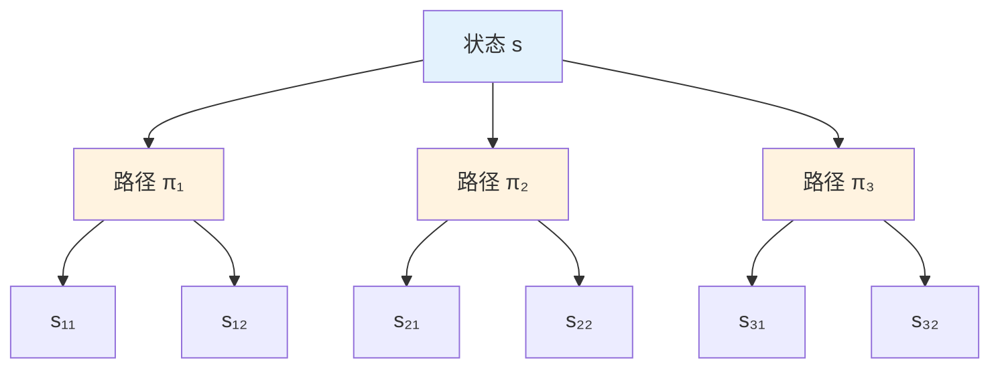
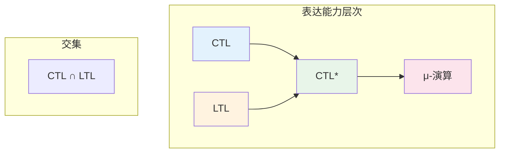
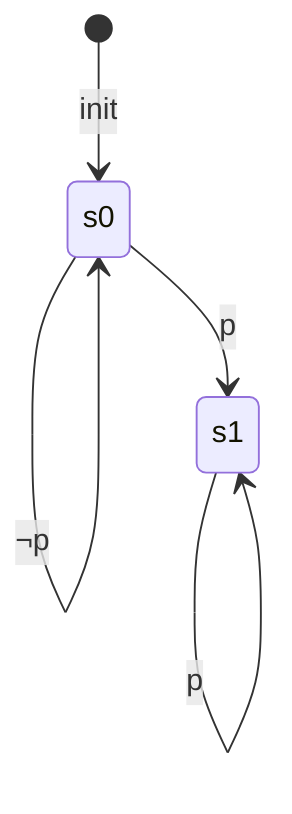

# 01.2 计算树逻辑 (CTL)

---

📌 **内容摘要**

本文档深入探讨计算树逻辑的核心原理和关键方法。内容涵盖时序逻辑领域的主要知识点，包括相关理论、方法及应用。适合具备相关基础的学习者进行深入研究。

**关键词**: 时序逻辑

📚 **学习目标**

- 深入理解计算树逻辑的理论体系和形式化方法
- 能够进行相关定理的形式化证明
- 建立该领域的系统性知识框架

🎯 **难度级别**: 高级

⏱️ **预计阅读时间**: 15分钟

**前置知识**: 该领域的中级知识, 形式化方法基础

---


## 目录

- [01.2 计算树逻辑 (CTL)](#012-计算树逻辑-ctl)
  - [目录](#目录)
  - [1. 概述](#1-概述)
  - [2. CTL 语法](#2-ctl-语法)
    - [2.1 路径量词](#21-路径量词)
    - [2.2 时序运算符](#22-时序运算符)
  - [3. CTL 语义](#3-ctl-语义)
    - [3.1 状态公式与路径公式](#31-状态公式与路径公式)
    - [3.2 语义定义](#32-语义定义)
  - [4. CTL\* 逻辑](#4-ctl-逻辑)
    - [4.1 CTL\* 语法](#41-ctl-语法)
    - [4.2 表达能力比较](#42-表达能力比较)
  - [5. CTL 模型检测](#5-ctl-模型检测)
    - [5.1 标记算法](#51-标记算法)
    - [5.2 复杂度分析](#52-复杂度分析)
  - [6. 形式化实现](#6-形式化实现)
    - [6.1 Haskell 实现](#61-haskell-实现)
    - [6.2 Lean 4 实现](#62-lean-4-实现)
  - [7. 应用示例](#7-应用示例)
  - [8. 相关文档](#8-相关文档)
  - [📋 前置知识](#-前置知识)
  - [📚 延伸阅读](#-延伸阅读)

---

## 1. 概述

**计算树逻辑 (Computation Tree Logic, CTL)** 是一种分支时间时序逻辑，与线性时序逻辑（参见 [01.1_线性时序逻辑_LTL.md](./01.1_线性时序逻辑_LTL.md)）不同，CTL 通过路径量词显式地量化计算树中的所有路径。

**分支时间 vs 线性时间：**



**主要特性：**

- 路径量词：$\mathbf{A}$（所有路径）、$\mathbf{E}$（存在路径）
- 状态公式：在状态上求值
- 多项式时间模型检测算法
- 广泛应用于硬件验证和协议分析

---

## 2. CTL 语法

### 2.1 路径量词

**定义 2.1.1 (路径量词)**

| 量词 | 名称 | 含义 |
|------|------|------|
| $\mathbf{A}$ | All | "对所有计算路径..." |
| $\mathbf{E}$ | Exists | "存在一条计算路径..." |

### 2.2 时序运算符

**定义 2.2.1 (CTL 语法)**

$$
\begin{aligned}
\phi &::= p \mid \top \mid \bot \mid \neg\phi \mid \phi_1 \land \phi_2 \mid \phi_1 \lor \phi_2 \mid \\
     &\quad \mathbf{AX}\phi \mid \mathbf{EX}\phi \mid \\
     &\quad \mathbf{AF}\phi \mid \mathbf{EF}\phi \mid \\
     &\quad \mathbf{AG}\phi \mid \mathbf{EG}\phi \mid \\
     &\quad \mathbf{A}[\phi_1 \mathbf{U}\phi_2] \mid \mathbf{E}[\phi_1 \mathbf{U}\phi_2]
\end{aligned}
$$

其中时序运算符组合：

| 公式 | 含义 |
|------|------|
| $\mathbf{AX}\phi$ | 所有后继状态满足 $\phi$ |
| $\mathbf{EX}\phi$ | 存在后继状态满足 $\phi$ |
| $\mathbf{AF}\phi$ | 所有路径最终满足 $\phi$ |
| $\mathbf{EF}\phi$ | 存在路径最终满足 $\phi$ |
| $\mathbf{AG}\phi$ | 所有路径始终满足 $\phi$ |
| $\mathbf{EG}\phi$ | 存在路径始终满足 $\phi$ |
| $\mathbf{A}[\phi_1 \mathbf{U}\phi_2]$ | 所有路径上，$\phi_1$ 直到 $\phi_2$ |
| $\mathbf{E}[\phi_1 \mathbf{U}\phi_2]$ | 存在路径，$\phi_1$ 直到 $\phi_2$ |

**定义 2.2.2 (派生公式)**

部分 CTL 公式可由基本公式定义：

$$
\begin{aligned}
\mathbf{AF}\phi &\equiv \mathbf{A}[\top \mathbf{U}\phi] \\
\mathbf{EF}\phi &\equiv \mathbf{E}[\top \mathbf{U}\phi] \\
\mathbf{AG}\phi &\equiv \neg\mathbf{EF}\neg\phi \\
\mathbf{EG}\phi &\equiv \neg\mathbf{AF}\neg\phi \\
\mathbf{AX}\phi &\equiv \neg\mathbf{EX}\neg\phi
\end{aligned}
$$

---

## 3. CTL 语义

### 3.1 状态公式与路径公式

**定义 3.1.1 (状态公式)**

状态公式在单个状态上求值，包含：

- 原子命题 $p$
- 布尔联结词 $\neg, \land, \lor$
- 以路径量词开头的时序公式

**定义 3.1.2 (路径公式)**

路径公式在路径上求值，包含：

- $\mathbf{X}\phi$：下一状态
- $\mathbf{F}\phi$：最终
- $\mathbf{G}\phi$：全局
- $\phi_1 \mathbf{U}\phi_2$：直到

### 3.2 语义定义

**定义 3.2.1 (CTL 状态语义)**

给定 Kripke 结构 $\mathcal{K} = (S, S_0, R, L)$，满足关系 $s \models \phi$ 定义如下：

$$
\begin{aligned}
s &\models p &&\Leftrightarrow p \in L(s) \\
s &\models \neg\phi &&\Leftrightarrow s \not\models \phi \\
s &\models \phi_1 \land \phi_2 &&\Leftrightarrow s \models \phi_1 \text{ 且 } s \models \phi_2 \\
s &\models \mathbf{EX}\phi &&\Leftrightarrow \exists s' : (s, s') \in R \text{ 且 } s' \models \phi \\
s &\models \mathbf{AX}\phi &&\Leftrightarrow \forall s' : (s, s') \in R \Rightarrow s' \models \phi \\
s &\models \mathbf{EF}\phi &&\Leftrightarrow \exists \text{ 路径 } \pi = s_0s_1\cdots : s_0 = s \text{ 且 } \exists i: s_i \models \phi \\
s &\models \mathbf{AF}\phi &&\Leftrightarrow \forall \text{ 路径 } \pi = s_0s_1\cdots : s_0 = s \Rightarrow \exists i: s_i \models \phi \\
s &\models \mathbf{EG}\phi &&\Leftrightarrow \exists \text{ 路径 } \pi = s_0s_1\cdots : s_0 = s \text{ 且 } \forall i: s_i \models \phi \\
s &\models \mathbf{AG}\phi &&\Leftrightarrow \forall \text{ 路径 } \pi = s_0s_1\cdots : s_0 = s \Rightarrow \forall i: s_i \models \phi \\
s &\models \mathbf{E}[\phi_1 \mathbf{U}\phi_2] &&\Leftrightarrow \exists \text{ 路径 } \pi = s_0s_1\cdots : s_0 = s \text{ 且 } \exists j: s_j \models \phi_2 \land \forall k < j: s_k \models \phi_1 \\
s &\models \mathbf{A}[\phi_1 \mathbf{U}\phi_2] &&\Leftrightarrow \forall \text{ 路径 } \pi = s_0s_1\cdots : s_0 = s \Rightarrow \exists j: s_j \models \phi_2 \land \forall k < j: s_k \models \phi_1
\end{aligned}
$$

**定理 3.2.1 (语义等价性)**

对于任意状态 $s$ 和公式 $\phi$：

$$
\begin{aligned}
s \models \mathbf{AF}\phi &\Leftrightarrow s \models \mathbf{A}[\top \mathbf{U}\phi] \\
s \models \mathbf{EF}\phi &\Leftrightarrow s \models \mathbf{E}[\top \mathbf{U}\phi] \\
s \models \mathbf{AG}\phi &\Leftrightarrow s \models \neg\mathbf{EF}\neg\phi
\end{aligned}
$$

**证明**：直接由语义定义可得。

---

## 4. CTL* 逻辑

### 4.1 CTL* 语法

__定义 4.1.1 (CTL_ 状态公式)_*

$$
\phi ::= p \mid \top \mid \bot \mid \neg\phi \mid \phi_1 \land \phi_2 \mid \mathbf{A}\psi \mid \mathbf{E}\psi
$$

__定义 4.1.2 (CTL_ 路径公式)_*

$$
\psi ::= \phi \mid \neg\psi \mid \psi_1 \land \psi_2 \mid \mathbf{X}\psi \mid \mathbf{F}\psi \mid \mathbf{G}\psi \mid \psi_1 \mathbf{U}\psi_2
$$

其中 $\phi$ 是状态公式，$\psi$ 是路径公式。

### 4.2 表达能力比较



**定理 4.2.1 (表达能力关系)**

1. **LTL $\not\subseteq$ CTL**：存在 LTL 公式不能表示为 CTL 公式
   - 示例：$\mathbf{FG}p$（公平性）

2. **CTL $\not\subseteq$ LTL**：存在 CTL 公式不能表示为 LTL 公式
   - 示例：$\mathbf{AG}\mathbf{EF}p$（从所有状态可达性）

3. __CTL_ = LTL + CTL_*：CTL* 包含两者作为真子集

**证明**：

对于 (1)，假设 $\mathbf{FG}p$ 等价于某 CTL 公式。考虑如下 Kripke 结构：



- 路径 $s_0s_1^\omega$ 满足 $\mathbf{FG}p$
- 路径 $s_0^\omega$ 不满足 $\mathbf{FG}p$
- CTL 的状态局部性无法区分这两条路径

---

## 5. CTL 模型检测

### 5.1 标记算法

**算法 5.1.1 (CTL 标记算法)**

输入：Kripke 结构 $\mathcal{K}$，CTL 公式 $\phi$
输出：满足 $\phi$ 的状态集合

```haskell
-- CTL 模型检测标记算法
ctlModelCheck :: KripkeStructure state ap -> CTL ap -> Set state
ctlModelCheck kripke phi =
  case phi of
    Atom p       -> Set.filter (\s -> p `Set.member` label s) (states kripke)
    Top          -> states kripke
    Bottom       -> Set.empty
    Not psi      -> states kripke `Set.difference` ctlModelCheck kripke psi
    And psi1 psi2 -> Set.intersection (ctlModelCheck kripke psi1)
                                     (ctlModelCheck kripke psi2)
    EX psi       -> checkEX kripke (ctlModelCheck kripke psi)
    EU psi1 psi2 -> checkEU kripke (ctlModelCheck kripke psi1)
                                   (ctlModelCheck kripke psi2)
    AU psi1 psi2 -> checkAU kripke (ctlModelCheck kripke psi1)
                                   (ctlModelCheck kripke psi2)
    EF psi       -> ctlModelCheck kripke (EU Top psi)
    AF psi       -> ctlModelCheck kripke (AU Top psi)
    EG psi       -> ctlModelCheck kripke (Not (AF (Not psi)))
    AG psi       -> ctlModelCheck kripke (Not (EF (Not psi)))

-- EX ψ: 存在后继满足 ψ
checkEX :: KripkeStructure state ap -> Set state -> Set state
checkEX kripke satisfyingPsi =
  Set.filter (\s -> any (`Set.member` satisfyingPsi) (successors kripke s))
             (states kripke)

-- E[ψ1 U ψ2]: 存在路径 ψ1 直到 ψ2
checkEU :: KripkeStructure state ap -> Set state -> Set state -> Set state
checkEU kripke satisfyingPsi1 satisfyingPsi2 =
  let -- 初始：所有满足 ψ2 的状态
      initial = satisfyingPsi2
      -- 迭代扩展
      extend current =
        let predecessors = Set.filter
              (\s -> any (`Set.member` current) (successors kripke s))
              (states kripke)
            newStates = Set.intersection predecessors satisfyingPsi1
        in Set.union current newStates
      -- 不动点计算
      fixpoint = iterateUntilStable extend initial
  in fixpoint

-- A[ψ1 U ψ2]: 所有路径 ψ1 直到 ψ2
checkAU :: KripkeStructure state ap -> Set state -> Set state -> Set state
checkAU kripke satisfyingPsi1 satisfyingPsi2 =
  let -- 计算不满足的状态（存在路径不满足）
      notPsi2 = states kripke `Set.difference` satisfyingPsi2
      notPsi1 = states kripke `Set.difference` satisfyingPsi1
      -- 计算 EG (¬ψ2) ∨ E[(¬ψ2) U (¬ψ1 ∧ ¬ψ2)]
      badStates = checkEG kripke notPsi2 `Set.union`
                  checkEU kripke notPsi2 (Set.intersection notPsi1 notPsi2)
  in states kripke `Set.difference` badStates

-- EG ψ: 存在路径始终 ψ
checkEG :: KripkeStructure state ap -> Set state -> Set state
checkEG kripke satisfyingPsi =
  let -- 从满足 ψ 的状态开始
      initial = satisfyingPsi
      -- 迭代移除没有满足 ψ 后继的状态
      shrink current =
        Set.filter (\s -> any (`Set.member` current) (successors kripke s))
                   current
      fixpoint = iterateUntilStable shrink initial
  in fixpoint
```

### 5.2 复杂度分析

**定理 5.2.1 (CTL 模型检测复杂度)**

CTL 模型检测问题可以在 $O(|\phi| \cdot (|S| + |R|))$ 时间内解决。

**证明**：

- 每个子公式的标记需要 $O(|S| + |R|)$ 时间
- 公式大小为 $|\phi|$，最多 $|\phi|$ 个子公式
- 总时间复杂度为 $O(|\phi| \cdot (|S| + |R|))$

__定理 5.2.2 (CTL_ 模型检测复杂度)_*

CTL* 模型检测是 PSPACE-完全的。

---

## 6. 形式化实现

### 6.1 Haskell 实现

```haskell
{-# LANGUAGE GADTs #-}

module CTL where

import qualified Data.Set as Set
import Data.Set (Set)
import Data.List (foldl')

-- CTL 公式数据类型
data CTL a where
  Atom     :: a -> CTL a
  Top      :: CTL a
  Bottom   :: CTL a
  Not      :: CTL a -> CTL a
  And      :: CTL a -> CTL a -> CTL a
  Or       :: CTL a -> CTL a -> CTL a
  EX       :: CTL a -> CTL a          -- 存在下一状态
  AX       :: CTL a -> CTL a          -- 所有下一状态
  EF       :: CTL a -> CTL a          -- 存在最终
  AF       :: CTL a -> CTL a          -- 所有最终
  EG       :: CTL a -> CTL a          -- 存在全局
  AG       :: CTL a -> CTL a          -- 所有全局
  EU       :: CTL a -> CTL a -> CTL a -- 存在直到
  AU       :: CTL a -> CTL a -> CTL a -- 所有直到
  deriving (Eq, Show)

-- Kripke 结构
data KripkeStructure s a = KripkeStructure
  { ksStates :: Set s
  , ksInitial :: Set s
  , ksTrans :: s -> Set s
  , ksLabel :: s -> Set a
  }

-- 求后继状态集合
successors :: (Ord s) => KripkeStructure s a -> s -> Set s
successors ks s = ksTrans ks s

-- 求前驱状态集合
predecessors :: (Ord s) => KripkeStructure s a -> s -> Set s
predecessors ks s =
  Set.filter (\s' -> s `Set.member` successors ks s') (ksStates ks)

-- 不动点迭代
iterateUntilStable :: (Eq a) => (a -> a) -> a -> a
iterateUntilStable f x =
  let x' = f x
  in if x' == x then x else iterateUntilStable f x'

-- CTL 模型检测主函数
evalCTL :: (Ord s, Ord a) => KripkeStructure s a -> CTL a -> Set s
evalCTL ks formula = case formula of
  Atom p    -> Set.filter (\s -> p `Set.member` ksLabel ks s) (ksStates ks)
  Top       -> ksStates ks
  Bottom    -> Set.empty
  Not phi   -> ksStates ks `Set.difference` evalCTL ks phi
  And p q   -> Set.intersection (evalCTL ks p) (evalCTL ks q)
  Or p q    -> Set.union (evalCTL ks p) (evalCTL ks q)
  EX phi    -> evalEX ks (evalCTL ks phi)
  AX phi    -> evalAX ks (evalCTL ks phi)
  EF phi    -> evalEF ks (evalCTL ks phi)
  AF phi    -> evalAF ks (evalCTL ks phi)
  EG phi    -> evalEG ks (evalCTL ks phi)
  AG phi    -> evalAG ks (evalCTL ks phi)
  EU p q    -> evalEU ks (evalCTL ks p) (evalCTL ks q)
  AU p q    -> evalAU ks (evalCTL ks p) (evalCTL ks q)

-- EX φ: 存在后继满足 φ
evalEX :: (Ord s, Ord a) => KripkeStructure s a -> Set s -> Set s
evalEX ks satPhi =
  Set.filter (\s -> not . Set.null $ Set.intersection (successors ks s) satPhi)
             (ksStates ks)

-- AX φ: 所有后继满足 φ
evalAX :: (Ord s, Ord a) => KripkeStructure s a -> Set s -> Set s
evalAX ks satPhi =
  Set.filter (\s -> Set.isSubsetOf (successors ks s) satPhi)
             (ksStates ks)

-- EF φ = E[true U φ]
evalEF :: (Ord s, Ord a) => KripkeStructure s a -> Set s -> Set s
evalEF ks = evalEU ks (ksStates ks)

-- AF φ: 所有路径最终 φ
evalAF :: (Ord s, Ord a) => KripkeStructure s a -> Set s -> Set s
evalAF ks satPhi =
  let initial = satPhi
      extend current =
        let preds = Set.unions $ Set.map (predecessors ks) current
            validPreds = Set.filter (\s -> Set.isSubsetOf (successors ks s) current) preds
        in Set.union current validPreds
  in iterateUntilStable extend initial

-- EG φ: 存在路径始终 φ
evalEG :: (Ord s, Ord a) => KripkeStructure s a -> Set s -> Set s
evalEG ks satPhi =
  let initial = satPhi
      shrink current =
        Set.filter (\s -> not . Set.null $ Set.intersection (successors ks s) current)
                   current
  in iterateUntilStable shrink initial

-- AG φ = ¬EF¬φ
evalAG :: (Ord s, Ord a) => KripkeStructure s a -> Set s -> Set s
evalAG ks satPhi = ksStates ks `Set.difference` evalEF ks (ksStates ks `Set.difference` satPhi)

-- E[p U q]: 存在路径 p 直到 q
evalEU :: (Ord s, Ord a) => KripkeStructure s a -> Set s -> Set s -> Set s
evalEU ks satP satQ =
  let initial = satQ
      extend current =
        let preds = Set.unions $ Set.map (predecessors ks) current
            validPreds = Set.intersection preds satP
        in Set.union current validPreds
  in iterateUntilStable extend initial

-- A[p U q]: 所有路径 p 直到 q
evalAU :: (Ord s, Ord a) => KripkeStructure s a -> Set s -> Set s -> Set s
evalAU ks satP satQ =
  let initial = satQ
      extend current =
        let preds = Set.unions $ Set.map (predecessors ks) current
            -- 状态的所有后继都在 current 中，且满足 p
            validPreds = Set.filter
              (\s -> Set.isSubsetOf (successors ks s) current && s `Set.member` satP)
              preds
        in Set.union current validPreds
  in iterateUntilStable extend initial

-- 常用规范模式
defSafety :: a -> CTL a
defSafety bad = AG (Not (Atom bad))

defLiveness :: a -> CTL a
defLiveness good = AF (Atom good)

defResponse :: a -> a -> CTL a
defResponse req resp = AG (Atom req `Implies` AF (Atom resp))
  where Implies p q = Or (Not p) q

defFairness :: a -> a -> CTL a
defFairness enabled taken =
  AG (AF (Atom enabled) `Implies` AF (Atom taken))
```

### 6.2 Lean 4 实现

```lean4
import Mathlib

/- CTL 公式定义 -/
inductive CTL (AP : Type) where
  | atom (p : AP) : CTL AP
  | top : CTL AP
  | bottom : CTL AP
  | not : CTL AP → CTL AP
  | and : CTL AP → CTL AP → CTL AP
  | ex : CTL AP → CTL AP          -- ∃X
  | ax : CTL AP → CTL AP          -- ∀X
  | ef : CTL AP → CTL AP          -- ∃F
  | af : CTL AP → CTL AP          -- ∀F
  | eg : CTL AP → CTL AP          -- ∃G
  | ag : CTL AP → CTL AP          -- ∀G
  | eu : CTL AP → CTL AP → CTL AP -- ∃U
  | au : CTL AP → CTL AP → CTL AP -- ∀U
  deriving DecidableEq, Repr

namespace CTL

notation "⊤" => top
notation "⊥" => bottom
notation "¬" φ => not φ
notation φ "∧" ψ => and φ ψ
notation φ "∨" ψ => or φ ψ  -- 需要定义 or
notation "∃X" φ => ex φ
notation "∀X" φ => ax φ
notation "∃F" φ => ef φ
notation "∀F" φ => af φ
notation "∃G" φ => eg φ
notation "∀G" φ => ag φ
notation "∃U" => eu
notation "∀U" => au

/- 派生定义 -/
def or (φ ψ : CTL AP) : CTL AP := not (and (not φ) (not ψ))
def implies (φ ψ : CTL AP) : CTL AP := or (not φ) ψ

/- Kripke 结构 -/
structure KripkeStructure (S AP : Type) where
  states : Set S
  trans : S → Set S
  label : S → Set AP
  total : ∀ s ∈ states, trans s ≠ ∅

/- 路径定义 -/
def Path (S : Type) := ℕ → S

def isPath {S AP} (K : KripkeStructure S AP) (π : Path S) : Prop :=
  ∀ n, π (n + 1) ∈ K.trans (π n)

def PathsFrom {S AP} (K : KripkeStructure S AP) (s : S) : Set (Path S) :=
  {π | π 0 = s ∧ isPath K π}

/- 路径满足关系 -/
inductive PathSatisfies {S AP : Type}
    (K : KripkeStructure S AP) (π : Path S) : CTL AP → Prop where
  | atom {p} : p ∈ K.label (π 0) → PathSatisfies K π (atom p)
  | top : PathSatisfies K π top
  | not {φ} : ¬PathSatisfies K π φ → PathSatisfies K π (not φ)
  | and {φ ψ} : PathSatisfies K π φ → PathSatisfies K π ψ →
                PathSatisfies K π (and φ ψ)
  | next {φ} : PathSatisfies K (fun n => π (n + 1)) φ →
               PathSatisfies K π (ex φ)
  | until {φ ψ} :
      (∃ j, PathSatisfies K (fun n => π (n + j)) ψ ∧
            ∀ k < j, PathSatisfies K (fun n => π (n + k)) φ) →
      PathSatisfies K π (eu φ ψ)

notation π "⊨ₚ" φ => PathSatisfies _ π φ

/- 状态满足关系 -/
inductive StateSatisfies {S AP : Type}
    (K : KripkeStructure S AP) : S → CTL AP → Prop where
  | atom {s p} : p ∈ K.label s → StateSatisfies K s (atom p)
  | top {s} : StateSatisfies K s top
  | not {s φ} : ¬StateSatisfies K s φ → StateSatisfies K s (not φ)
  | and {s φ ψ} : StateSatisfies K s φ → StateSatisfies K s ψ →
                  StateSatisfies K s (and φ ψ)
  | ex {s φ} : (∃ π ∈ PathsFrom K s, π ⊨ₚ φ) → StateSatisfies K s (ex φ)
  | ax {s φ} : (∀ π ∈ PathsFrom K s, π ⊨ₚ φ) → StateSatisfies K s (ax φ)
  | ef {s φ} : (∃ π ∈ PathsFrom K s, ∃ j,
                (fun n => π (n + j)) ⊨ₚ φ) → StateSatisfies K s (ef φ)
  | af {s φ} : (∀ π ∈ PathsFrom K s, ∃ j,
                (fun n => π (n + j)) ⊨ₚ φ) → StateSatisfies K s (af φ)
  | eg {s φ} : (∃ π ∈ PathsFrom K s, ∀ j,
                (fun n => π (n + j)) ⊨ₚ φ) → StateSatisfies K s (eg φ)
  | ag {s φ} : (∀ π ∈ PathsFrom K s, ∀ j,
                (fun n => π (n + j)) ⊨ₚ φ) → StateSatisfies K s (ag φ)
  | eu {s φ ψ} : (∃ π ∈ PathsFrom K s, ∃ j,
                  (fun n => π (n + j)) ⊨ₚ ψ ∧
                  ∀ k < j, (fun n => π (n + k)) ⊨ₚ φ) →
                  StateSatisfies K s (eu φ ψ)
  | au {s φ ψ} : (∀ π ∈ PathsFrom K s, ∃ j,
                  (fun n => π (n + j)) ⊨ₚ ψ ∧
                  ∀ k < j, (fun n => π (n + k)) ⊨ₚ φ) →
                  StateSatisfies K s (au φ ψ)

notation s "⊨" φ => StateSatisfies _ s φ

/- 派生运算符的语义等价性 -/
theorem ef_as_eu {S AP} {K : KripkeStructure S AP} {s : S} {φ : CTL AP} :
    (s ⊨ ef φ) ↔ (s ⊨ eu top φ) := by
  apply Iff.intro
  · intro h
    cases h with
    | intro π hπ =>
      cases hπ with
      | intro hπin hπsat =>
        cases hπsat with
        | intro j hj =>
          apply StateSatisfies.eu
          use π
          constructor
          · exact hπin
          · use j
            constructor
            · exact hj.1
            · intro k hk
              apply PathSatisfies.top
  · intro h
    cases h with
    | intro π hπ =>
      cases hπ with
      | intro hπin hπsat =>
        cases hπsat with
        | intro j hj =>
          apply StateSatisfies.ef
          use π
          constructor
          · exact hπin
          · use j
            exact hj.1

end CTL
```

---

## 7. 应用示例

**示例 7.1 (进程同步)**

```haskell
-- 两个进程的同步规范
processSync :: CTL String
processSync =
  -- 互斥：永不同时进入临界区
  AG (Not (And (Atom "inCrit1") (Atom "inCrit2")))
  `And`
  -- 活性：请求最终进入
  And (AG (Atom "request1" `Implies` EF (Atom "inCrit1")))
      (AG (Atom "request2" `Implies` EF (Atom "inCrit2")))
  `And`
  -- 无饥饿：重复请求最终获得
  And (AG (EG (Atom "request1") `Implies` AF (Atom "inCrit1")))
      (AG (EG (Atom "request2") `Implies` AF (Atom "inCrit2")))
```

**示例 7.2 (资源分配)**

```haskell
-- 资源分配系统
resourceAlloc :: CTL String
resourceAlloc =
  -- 安全性：资源永不重复分配
  AG (Atom "resourceFree" `Or`
      (And (Atom "heldBy1") (Not (Atom "heldBy2"))) `Or`
      (And (Atom "heldBy2") (Not (Atom "heldBy1"))))
  `And`
  -- 可用性：资源空闲时可被申请
  AG (Atom "resourceFree" `Implies`
      (And (EX (Atom "heldBy1")) (EX (Atom "heldBy2"))))
```

---

## 8. 相关文档

- [01.1_线性时序逻辑_LTL.md](./01.1_线性时序逻辑_LTL.md) - 线性时间逻辑
- [01.3_时序逻辑应用.md](./01.3_时序逻辑应用.md) - 实际应用案例
- [01.4_实时时序逻辑.md](./01.4_实时时序逻辑.md) - 带时间约束的扩展
- ../04_计算理论/04.3_复杂度理论.md - 复杂度分析基础

---

## 📋 前置知识

- [01.1 线性时序逻辑 (Linear Temporal Logic, LTL)](../01_时序逻辑/01.1_线性时序逻辑_LTL.md)

---

## 📚 延伸阅读

- [01.1 线性时序逻辑 (Linear Temporal Logic, LTL)](../01_时序逻辑/01.1_线性时序逻辑_LTL.md)
- [01.4 实时时序逻辑](../01_时序逻辑/01.4_实时时序逻辑.md)
