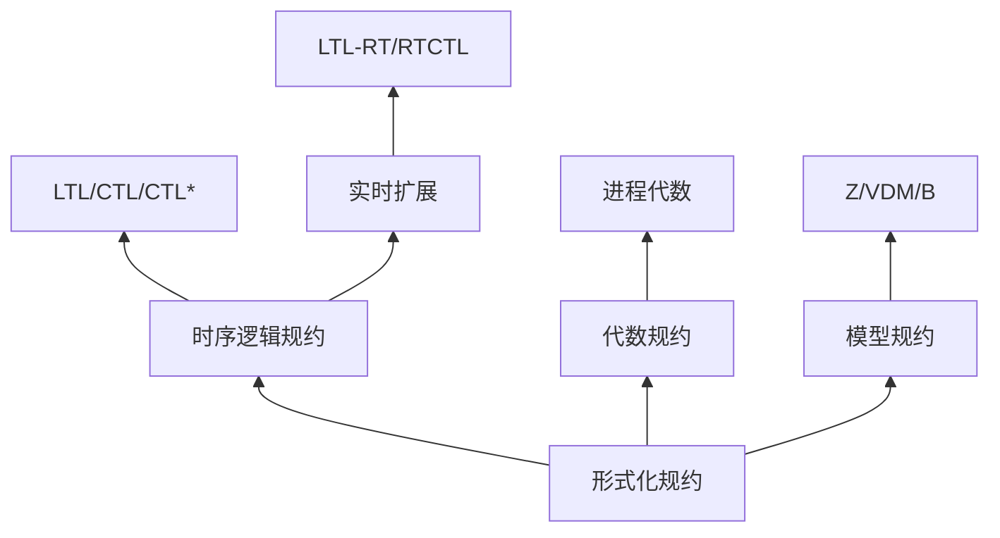

# 01.3 时序逻辑与规约

## 1. 引言

### 1.1 规约的重要性

形式化规约是验证的基石。时序逻辑提供了精确描述系统动态行为的语言，使得自动验证成为可能。

**核心挑战**：

- 如何将自然语言需求转化为形式化规约
- 如何确保规约的正确性、完备性、一致性
- 如何处理复杂系统的组合规约

### 1.2 规约层次结构



> **交叉引用**：LTL 和 CTL 的基础理论分别参见 [01.1_线性时序逻辑_LTL.md](./01.1_线性时序逻辑_LTL.md) 和 [01.2_计算树逻辑_CTL.md](./01.2_计算树逻辑_CTL.md)。

---

## 2. 规约模式库

### 2.1 Dwyer 规约模式

Dwyer 等人 (1999) 系统总结了常见规约模式：

**定义 2.1** (模式类别)。按目的和范围分类：

| 类别 | 目的 | 范围 |
|-----|-----|-----|
| 存在性 | 某事必须发生 | 全局/之间/之后/直到 |
| 全称性 | 某事必须始终成立 | 全局/之间/之后/直到 |
| 前件-后继 | 条件-响应关系 | 全局/之间/之后/直到 |
| 响应 | 请求-响应模式 | 全局/之间/之后/直到 |

### 2.2 存在性模式

**模式 2.1** (存在性 - Globally)。

```
自然语言: P 最终成立
LTL:      F P
CTL:      EF P
Scope:    Globally
```

**模式 2.2** (存在性 - After Q)。

```
自然语言: Q 发生后，P 最终成立
LTL:      G(Q → F P)
CTL:      AG(Q → EF P)
Scope:    After Q
```

**模式 2.3** (存在性 - Between Q and R)。

```
自然语言: 在 Q 和下一个 R 之间，P 必须发生
LTL:      G((Q ∧ ¬R ∧ F R) → (¬R U (P ∧ ¬R)))
CTL:      AG(Q ∧ ¬R → E[¬R U (P ∧ ¬R)])
Scope:    Between Q and R
```

### 2.3 全称性模式

**模式 2.4** (全称性 - Globally)。

```
自然语言: P 始终成立
LTL:      G P
CTL:      AG P
```

**模式 2.5** (全称性 - After Until)。

```
自然语言: 在 P 保持直到 Q 之后，R 始终成立
LTL:      (P U Q) → G R
```

### 2.4 响应模式

**模式 2.6** (立即响应)。

```
自然语言: P 发生后，Q 必须立即发生
LTL:      G(P → X Q)
CTL:      AG(P → AX Q)
```

**模式 2.7** (延迟响应 - 有界)。

```
自然语言: P 发生后，Q 在 k 步内必须发生
LTL:      G(P → F[≤k] Q)  -- 需实时扩展
RTCTL:    AG(P → EF[≤k] Q)
```

**模式 2.8** (交替响应)。

```
自然语言: 每个请求必须由对应的响应回答
LTL:      G(req → F(res ∧ matched(req, res)))
```

### 2.5 复杂模式

**模式 2.9** (严格交替)。

```
自然语言: P 和 Q 严格交替出现
LTL:      G(P → X(¬P U Q)) ∧ G(Q → X(¬Q U P))
```

**模式 2.10** (无重复)。

```
自然语言: P 最多发生一次
LTL:      G(P → G ¬P)
```

---

## 3. 公平性约束

### 3.1 公平性的必要性

**定义 3.1** (不公平路径)。若无约束，模型检测可能考虑不现实的无限执行（如进程永远不被调度）。

**例 3.1**：

```
考虑互斥协议：
性质: G(req → F enter)
问题: 存在一条路径，调度器永远不选择该进程
```

### 3.2 公平性分类

**定义 3.2** (公平性类型)。

| 类型 | 名称 | 形式化定义 | 强度 |
|-----|-----|-----------|-----|
| 无条件 | 无条件 | GF enabled → GF executed | 最弱 |
| 弱公平 | Justice | GF enabled → GF executed | 中等 |
| 强公平 | Compassion | FG enabled → GF executed | 最强 |

**定义 3.3** (弱公平性 - Justice)。

$$\text{Justice}(f) := \mathbf{GF}\,f$$

解释：性质 $f$ 无限次成立。

**定义 3.4** (强公平性 - Compassion)。

$$\text{Compassion}(p, q) := \mathbf{FG}\,p \to \mathbf{GF}\,q$$

解释：若 $p$ 最终永久成立，则 $q$ 必须无限次成立。

### 3.3 公平性下的模型检测

**定理 3.1** (公平 CTL 语义)。在公平性约束 $\mathcal{F}$ 下：

$$s \models_{\mathcal{F}} \mathbf{E}\mathbf{G}\varphi \Leftrightarrow \exists \pi \in Path(s): \pi \models \mathbf{G}\varphi \land \pi \models \mathcal{F}$$

**算法 3.1** (公平 EG 检测)。

```python
def fair_EG_check(M, phi, fairness):
    """
    在公平性约束下检测 EG phi
    """
    S_phi = CTL_MC(M, phi)
    M_phi = M.restrict(S_phi)

    # 找出满足所有公平性约束的 SCC
    sccs = compute_scc(M_phi)
    fair_sccs = []

    for scc in sccs:
        if len(scc) > 1 or has_self_loop(scc):
            # 检查是否满足所有 justice 约束
            if all(justice_satisfied(scc, f) for f in fairness.justice):
                # 检查是否满足所有 compassion 约束
                if all(compassion_satisfied(scc, p, q)
                       for (p, q) in fairness.compassion):
                    fair_sccs.append(scc)

    # 逆向可达性分析
    result = set().union(*fair_sccs)
    frontier = set(result)

    while frontier:
        pre = pre_image(frontier) ∩ S_phi
        new = pre - result
        result |= new
        frontier = new

    return result
```

---

## 4. 实时扩展

### 4.1 离散时间 RTCTL

**定义 4.1** (RTCTL 语法)。扩展 CTL 以包含时间界限：

$$\Phi ::= \ldots \mid \mathbf{E}\mathbf{X}^{\leq k}\Phi \mid \mathbf{E}\mathbf{F}^{\leq k}\Phi \mid \mathbf{E}\mathbf{G}^{\leq k}\Phi \mid \mathbf{E}[\Phi \mathbf{U}^{\leq k} \Phi]$$

**定义 4.2** (语义)。

- $s \models \mathbf{E}\mathbf{F}^{\leq k}\varphi \Leftrightarrow \exists \pi \in Path(s), \exists i \leq k: \pi[i] \models \varphi$
- $s \models \mathbf{E}[\varphi \mathbf{U}^{\leq k} \psi] \Leftrightarrow \exists \pi \in Path(s), \exists i \leq k: (\pi[i] \models \psi \land \forall j < i: \pi[j] \models \varphi)$

**定理 4.1** (RTCTL 复杂度)。RTCTL 模型检测是 P-完全的，时间复杂度 $O(|M| \cdot k_{max} \cdot |\Phi|)$。

### 4.2 连续时间 TCTL

**定义 4.3** (时间自动机)。扩展 Kripke 结构以包含时钟约束。

**定义 4.4** (TCTL 语法)。

$$\Phi ::= \ldots \mid \mathbf{E}\Diamond_{\sim c}\Phi \mid \mathbf{A}\Box_{\sim c}\Phi \mid \mathbf{E}\Phi \mathbf{U}_{\sim c} \Phi$$

其中 $\sim \in \{<, \leq, =, \geq, >\}$，$c \in \mathbb{N}$。

### 4.3 实时 LTL (LTL-RT)

**定义 4.5** (度量时序逻辑 MTL)。

$$\varphi ::= \ldots \mid \Diamond_{[a,b]}\varphi \mid \Box_{[a,b]}\varphi \mid \varphi \mathbf{U}_{[a,b]} \psi$$

**定理 4.2** (MTL 可判定性)。

- 离散时间 MTL: 可判定，EXPSPACE-完全
- 连续时间 MTL: 不可判定（但 MITL 可判定）

---

## 5. 规约的工程实践

### 5.1 规约分解

**原则 5.1** (单一职责)。每个规约只描述一个性质。

**反例**：

```
G(req → (F grant ∧ G ¬conflict))
问题: 混合了活性和安全性
```

**修正**：

```
活性: G(req → F grant)
安全: G ¬(grant₁ ∧ grant₂)  -- 互斥
```

### 5.2 规约验证

**定义 5.1** (规约属性)。

| 属性 | 检查方法 |
|-----|---------|
| 可满足性 | SAT 求解 |
| 一致性 | 检查 ¬φ 是否不可满足 |
| 独立性 | 检查 φ₁ ⊭ φ₂ 且 φ₂ ⊭ φ₁ |
| 完备性 | 覆盖所有需求场景 |

### 5.3 反例分析

**例 5.1** (死锁检测)。

```
规约: AG EF progress
反例: 进入一个无出边的状态 (死锁)
```

**例 5.2** (饥饿检测)。

```
规约: AG(req → AF grant)
反例: 存在路径: req 后永远等待
```

---

## 6. Lean 形式化：规约模式

### 6.1 模式库定义

```lean4
import Mathlib
import «FormalScience».LTL

-- 规约模式类型
inductive SpecPattern (A : Type) where
  -- 存在性模式
  | eventually (P : LTL A) : SpecPattern A
  | eventuallyAfter (P Q : LTL A) : SpecPattern A
  -- 全称性模式
  | always (P : LTL A) : SpecPattern A
  | alwaysAfter (P Q : LTL A) : SpecPattern A
  -- 响应模式
  | response (P Q : LTL A) : SpecPattern A
  | boundedResponse (P Q : LTL A) (k : Nat) : SpecPattern A
  -- 前置条件-后置条件
  | prePost (pre post : LTL A) : SpecPattern A
  deriving Repr

-- 模式到 LTL 的转换
def SpecPattern.toLTL {A} : SpecPattern A → LTL A
  | eventually P => LTL.finally P
  | eventuallyAfter P Q => LTL.globally (LTL.implies Q (LTL.finally P))
  | always P => LTL.globally P
  | alwaysAfter P Q => LTL.implies (LTL.globally Q) (LTL.globally P)
  | response P Q => LTL.globally (LTL.implies P (LTL.finally Q))
  | boundedResponse P Q k =>
      -- 需引入带界限的时序算子
      sorry
  | prePost pre post => LTL.globally (LTL.implies pre post)
```

### 6.2 公平性约束

```lean4
-- 公平性约束类型
structure FairnessConstraint (A : Type) where
  -- 弱公平性: GF enabled → GF executed
  justice : List (LTL A)
  -- 强公平性: FG enabled → GF executed
  compassion : List (LTL A × LTL A)

-- 在公平性下的满足关系
def fairSatisfies {S A} (M : Kripke S A)
    (fairness : FairnessConstraint A)
    (s : S) (φ : CTL A) : Prop :=
  sorry  -- 需路径满足公平性约束
```

### 6.3 规约验证定理

```lean4
-- 定理: 响应模式蕴含活性
example {A} (P Q : LTL A) :
    Satisfies π (SpecPattern.toLTL (SpecPattern.response P Q)) →
    (∃ k, π k ⊨ P) → (∃ j ≥ k, π j ⊨ Q) := by
  sorry  -- 需完整语义定义

-- 定理: 安全性质的传递性
example {A} (P Q R : LTL A) :
    (∀ π, π ⊨ LTL.globally (LTL.implies P Q)) →
    (∀ π, π ⊨ LTL.globally (LTL.implies Q R)) →
    (∀ π, π ⊨ LTL.globally (LTL.implies P R)) := by
  sorry
```

---

## 7. 工具与实践

### 7.1 主流工具对比

| 工具 | 支持逻辑 | 特点 |
|-----|---------|-----|
| SPIN | LTL | 显式状态，高效，Promela |
| NuSMV | LTL, CTL | 符号模型检测，BDD |
| UPPAAL | TCTL | 实时系统，图形化 |
| PRISM | PCTL | 概率模型检测 |
| TLA+ | TLA | 规约重于验证 |

### 7.2 规约最佳实践

1. **从需求出发**：每个形式化规约应有对应的自然语言需求
2. **分层规约**：系统级 → 组件级 → 接口级
3. **可追踪性**：需求 ↔ 规约 ↔ 验证结果
4. **评审与确认**：非形式化专家参与评审

---

## 参考文献

1. Dwyer, M. B., Avrunin, G. S., & Corbett, J. C. (1999). Patterns in Property Specifications for Finite-State Verification. ICSE.
2. Koymans, R. (1990). Specifying Real-Time Properties with Metric Temporal Logic. Real-Time Systems.
3. Alur, R., & Dill, D. L. (1994). A Theory of Timed Automata. TCS.
4. Alur, R., Feder, T., & Henzinger, T. A. (1996). The Benefits of Relaxing Punctuality. JACM.

---

## 索引

- **规约模式**: §2
- **响应模式**: §2.4
- **公平性**: §3
- **Justice**: §3.2
- **Compassion**: §3.2
- **RTCTL**: §4.1
- **TCTL**: §4.2
- **MTL**: §4.3
- **Dwyer 模式**: §2.1
