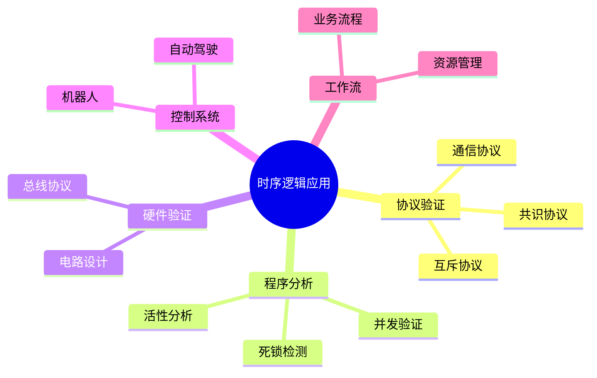
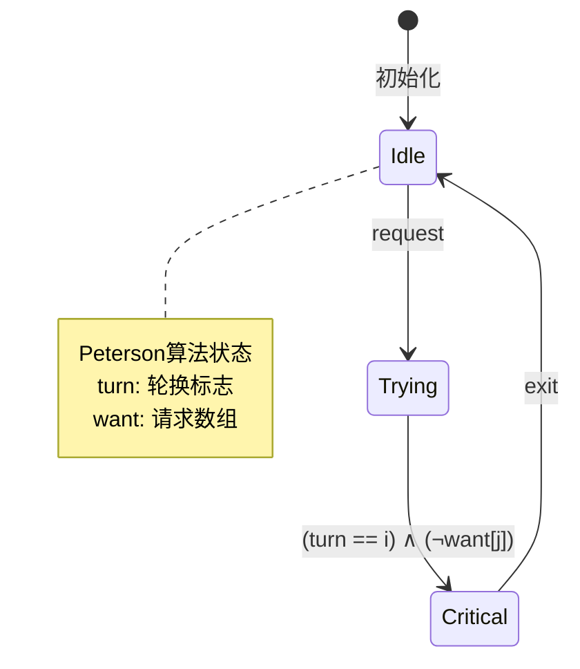
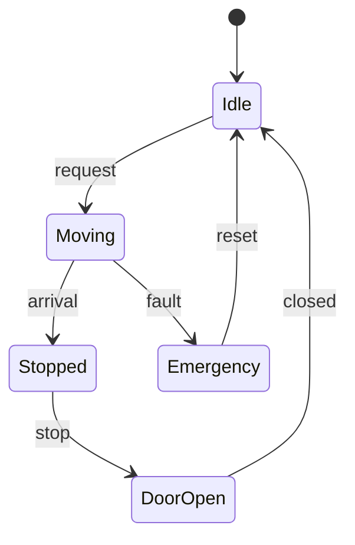

# 01.3 时序逻辑应用

---

📌 **内容摘要**

本文档深入探讨时序逻辑应用的核心原理和关键方法。内容涵盖时序逻辑领域的主要知识点，包括CTL, 同步, BPMN, 编排, LTL等关键主题。适合具备相关基础的学习者进行深入研究。

**关键词**: CTL, 同步, BPMN, 编排, LTL, 并发编程, 共识算法, Raft

📚 **学习目标**

- 深入理解时序逻辑应用的理论体系和形式化方法
- 能够进行相关定理的形式化证明
- 了解在实际系统中的应用场景

🎯 **难度级别**: 高级

⏱️ **预计阅读时间**: 15分钟

**前置知识**: 该领域的中级知识, 形式化方法基础

---


## 目录

- [01.3 时序逻辑应用](#013-时序逻辑应用)
  - [目录](#目录)
  - [1. 概述](#1-概述)
  - [2. 协议验证](#2-协议验证)
    - [2.1 互斥协议](#21-互斥协议)
    - [2.2 共识协议](#22-共识协议)
    - [2.3 通信协议](#23-通信协议)
  - [3. 程序分析](#3-程序分析)
    - [3.1 并发程序验证](#31-并发程序验证)
    - [3.2 死锁检测](#32-死锁检测)
    - [3.3 活性分析](#33-活性分析)
  - [4. 硬件验证](#4-硬件验证)
    - [4.1 电路验证](#41-电路验证)
    - [4.2 总线协议验证](#42-总线协议验证)
  - [5. 控制系统](#5-控制系统)
    - [5.1 机器人控制](#51-机器人控制)
    - [5.2 自动驾驶](#52-自动驾驶)
  - [6. 工作流验证](#6-工作流验证)
  - [7. 工具与实现](#7-工具与实现)
    - [7.1 模型检测工具](#71-模型检测工具)
    - [7.2 应用案例](#72-应用案例)
  - [8. 相关文档](#8-相关文档)
  - [📚 延伸阅读](#-延伸阅读)

---

## 1. 概述

时序逻辑在实际系统验证中具有广泛应用，从软件协议到硬件电路，从并发程序到控制系统。
本文档介绍时序逻辑（LTL 和 CTL，参见 [01.1_线性时序逻辑_LTL.md](./01.1_线性时序逻辑_LTL.md) 和 [01.2_计算树逻辑_CTL.md](./01.2_计算树逻辑_CTL.md)）的主要应用场景和验证方法。

**应用领域概览：**



---

## 2. 协议验证

### 2.1 互斥协议

**问题描述**：确保多个进程在访问共享资源时互斥。

**规范形式化**：

```haskell
-- 安全性：永不同时进入临界区
safety :: LTL String
safety = Globally (Not (And (Atom "crit1") (Atom "crit2")))

-- 活性：请求最终获得许可 (无饥饿)
liveness :: LTL String
liveness =
  And (Globally (Atom "req1" `Implies` Finally (Atom "crit1")))
      (Globally (Atom "req2" `Implies` Finally (Atom "crit2")))

-- 公平性：如果进程重复请求，则最终获得
devStarvation :: LTL String
devStarvation =
  And (Globally (Finally (Atom "req1")) `Implies`
       Globally (Finally (Atom "crit1")))
      (Globally (Finally (Atom "req2")) `Implies`
       Globally (Finally (Atom "crit2")))
```

**Peterson 算法验证**：

```haskell
-- Peterson 互斥算法的规范
petersonSpec :: CTL String
petersonSpec =
  -- 安全性
  AG (Not (And (Atom "in_crit_0") (Atom "in_crit_1")))
  `And`
  -- 活性
  AG (Atom "want_to_enter_0" `Implies` AF (Atom "in_crit_0"))
  `And`
  AG (Atom "want_to_enter_1" `Implies` AF (Atom "in_crit_1"))
```



### 2.2 共识协议

**问题描述**：分布式系统中，多个节点就某个值达成一致。

**规范形式化**：

```haskell
-- 一致性：所有正确节点最终达成一致
agreement :: LTL String
agreement =
  Finally (Globally (And
    (Atom "node1_decided" `Implies` Atom "node2_decided")
    (Atom "node2_value" `Equals` Atom "node1_value")))

-- 有效性：决定的值必须是某个节点提议的值
validity :: LTL String
validity =
  Globally (Atom "decided" `Implies`
    (Or (Atom "value_proposed_by_1")
        (Or (Atom "value_proposed_by_2")
            (Atom "value_proposed_by_3"))))

-- 终止性：所有正确节点最终做决定
termination :: LTL String
termination =
  And (Finally (Atom "node1_decided"))
      (And (Finally (Atom "node2_decided"))
           (Finally (Atom "node3_decided")))
```

**Raft 共识协议**：

```haskell
-- Raft 协议规范
raftSpec :: CTL String
raftSpec =
  -- 安全性：同一任期最多一个领导者
  AG (Atom "leader_elected" `Implies`
      AX (Not (Atom "another_leader_same_term")))
  `And`
  -- 日志一致性：如果两个节点在同一索引有日志，则内容相同
  AG (Atom "same_index" `Implies`
      (Atom "same_log_entry" `Or` Not (Atom "both_committed")))
  `And`
  -- 领导者完备性：如果日志条目被提交，则出现在所有未来领导者的日志中
  AG (Atom "log_committed" `Implies`
      AG (Atom "leader" `Implies` Atom "has_committed_entry"))
```

### 2.3 通信协议

**TCP 协议验证**：

```haskell
-- TCP 连接建立和释放
tcpSpec :: LTL String
tcpSpec =
  -- 三次握手正确性
  Globally (Atom "SYN_sent" `Implies`
    Finally (Atom "ESTABLISHED"))
  `And`
  -- 数据可靠性
  Globally (Atom "data_sent" `Implies`
    (Finally (Atom "data_received") `Or`
     Finally (Atom "connection_reset")))
  `And`
  -- 连接正确关闭
  Globally (Atom "FIN_sent" `Implies`
    (Finally (Atom "CLOSED") `Or`
     Finally (Atom "TIME_WAIT")))
```

---

## 3. 程序分析

### 3.1 并发程序验证

**线程安全规范**：

```haskell
-- 数据竞争自由
dataRaceFreedom :: LTL String
dataRaceFreedom =
  Globally (Not (And (Atom "thread1_writing") (Atom "thread2_accessing")))

-- 原子性
atomicity :: LTL String
atomicity =
  Globally (Atom "begin_atomic" `Implies`
    (Atom "in_atomic" `Until` Atom "end_atomic"))

-- 可见性
visibility :: LTL String
visibility =
  Globally (Atom "write" `Implies`
    Finally (Globally (Atom "read" `Implies` Atom "sees_write")))
```

**Java 内存模型验证**：

```haskell
-- happens-before 关系
happensBefore :: CTL String
happensBefore =
  AG (Atom "volatile_write" `Implies`
      AX (AG (Atom "volatile_read" `Implies` Atom "hb_established")))
```

### 3.2 死锁检测

**死锁特征**：

```haskell
-- 死锁条件：循环等待
deadlockCondition :: CTL String
deadlockCondition =
  EF (And (Atom "thread1_waiting_for_lock2")
          (And (Atom "thread2_waiting_for_lock1")
               (And (Atom "lock1_held_by_thread1")
                    (Atom "lock2_held_by_thread2"))))

-- 无死锁保证
noDeadlock :: LTL String
noDeadlock =
  Globally (Not (And (Atom "waiting") (Not (Finally (Atom "granted")))))
```

**银行家算法验证**：

```haskell
-- 安全状态：存在安全序列
safeState :: CTL String
safeState =
  EG (Or (Atom "all_processes_finished")
         (Exists (Atom "can_satisfy_some_request")))
```

### 3.3 活性分析

**终止性验证**：

```haskell
-- 程序终止
termination :: LTL String
termination = Finally (Atom "terminated")

-- 循环终止
loopTermination :: LTL String
loopTermination =
  Globally (Atom "loop_condition" `Implies`
    (Finally (Not (Atom "loop_condition"))))

-- 函数返回
functionReturns :: LTL String
functionReturns =
  Globally (Atom "function_called" `Implies` Finally (Atom "function_returned"))
```

---

## 4. 硬件验证

### 4.1 电路验证

**时序电路规范**：

```haskell
-- 触发器正确性
flipFlopSpec :: LTL String
flipFlopSpec =
  Globally (RisingEdge (Atom "clock") `Implies`
    Next (Atom "output" `Equals` Current (Atom "input")))
  where
    RisingEdge p = p `And` (Not (Previous p))
    Previous p = Not (Not p)  -- 简化表示

-- 建立时间和保持时间
setupHoldTime :: LTL String
setupHoldTime =
  Globally (RisingEdge (Atom "clk") `Implies`
    (And (PastStable (Atom "data") (Atom "t_setup"))
         (FutureStable (Atom "data") (Atom "t_hold"))))
```

**CPU 流水线验证**：

```haskell
-- 数据冒险检测
dataHazard :: CTL String
dataHazard =
  AG (Atom "instruction_in_decode" `And` Atom "needs_register" `And`
      Atom "register_being_written" `Implies`
      AF (Atom "stall_pipeline" `Or` Atom "forward_result"))

-- 控制冒险
controlHazard :: CTL String
controlHazard =
  AG (Atom "branch_instruction" `Implies`
      AX (Atom "correct_pc_selected"))
```

### 4.2 总线协议验证

**AMBA AXI 协议**：

```haskell
-- AXI 握手协议
axiHandshake :: LTL String
axiHandshake =
  -- VALID/READY 握手
  Globally (And (Atom "VALID" `Implies`
                  (Atom "VALID" `Until` (Atom "VALID" `And` Atom "READY")))
                (Atom "READY" `Implies`
                  (Or (Not (Atom "VALID"))
                      (Atom "READY" `Until` (Atom "VALID" `And` Atom "READY")))))

-- 保序性
axiOrdering :: CTL String
axiOrdering =
  AG (Atom "same_id" `And` Atom "first_transaction_started" `Implies`
      AF (Atom "first_transaction_completed" `Implies`
          AX (Atom "second_transaction_completed")))
```

---

## 5. 控制系统

### 5.1 机器人控制

**导航任务规范**：

```haskell
-- 到达目标
reachGoal :: LTL String
reachGoal =
  Finally (Atom "at_goal")
  `And`
  Globally (Atom "at_goal" `Implies` Atom "task_completed")

-- 避障
obstacleAvoidance :: LTL String
obstacleAvoidance =
  Globally (Atom "obstacle_detected" `Implies`
    (Atom "avoidance_action" `Until` Atom "path_clear"))

-- 循环巡逻
patrol :: LTL String
patrol =
  Globally (Finally (Atom "at_location_A")) `And`
  Globally (Finally (Atom "at_location_B")) `And`
  Globally (Finally (Atom "at_location_C"))
```

**多机器人协调**：

```haskell
-- 编队保持
formationKeeping :: CTL String
formationKeeping =
  AG (Atom "leader_moving" `Implies`
      AF (And (Atom "follower1_in_position")
              (Atom "follower2_in_position")))

-- 碰撞避免
collisionAvoidance :: LTL String
collisionAvoidance =
  AG (Not (And (Atom "robot1_close") (Atom "robot2_close")))
```

### 5.2 自动驾驶

**交通规则验证**：

```haskell
-- 红灯停
trafficLightCompliance :: LTL String
trafficLightCompliance =
  Globally (Atom "red_light" `Implies`
    Next (Atom "stopped" `Until` Atom "green_light"))

-- 保持车道
laneKeeping :: LTL String
laneKeeping =
  Globally (Atom "on_highway" `Implies` Atom "in_lane")

-- 安全距离
safeDistance :: LTL String
safeDistance =
  Globally (Atom "vehicle_ahead" `Implies`
    (Atom "distance" `GreaterThan` Atom "min_safe_distance"))

-- 综合规范
autonomousDrivingSpec :: LTL String
autonomousDrivingSpec =
  -- 永不碰撞
  Globally (Not (Atom "collision"))
  `And`
  -- 最终到达目的地
  Finally (Atom "at_destination")
  `And`
  -- 始终遵守交通规则
  Globally (Atom "obey_traffic_rules")
  `And`
  -- 对紧急情况响应
  Globally (Atom "emergency" `Implies` Finally (Atom "emergency_handled"))
```

---

## 6. 工作流验证

**业务流程验证**：

```haskell
-- 工作流正确性
workflowCorrectness :: CTL String
workflowCorrectness =
  -- 可达性：从启动到完成
  EF (Atom "completed")
  `And`
  -- 无死锁
  AG (Atom "enabled_activity" `Implies` EF (Atom "activity_executed"))
  `And`
  -- 顺序约束
  AG (Atom "activity_A_completed" `Implies`
      AX (Not (Atom "activity_B_started") `Or`
          Atom "activity_A_completed"))
```

**资源分配工作流**：

```haskell
-- 资源分配规范
resourceWorkflow :: LTL String
resourceWorkflow =
  -- 资源可用性
  Globally (Atom "request_resource" `Implies`
    Finally (Atom "resource_granted"))
  `And`
  -- 资源释放
  Globally (Atom "resource_used" `Implies`
    Finally (Atom "resource_released"))
  `And`
  -- 资源不重复分配
  Globally (Atom "resource_granted" `Implies`
    (Atom "resource_in_use" `Until` Atom "resource_released"))
```

---

## 7. 工具与实现

### 7.1 模型检测工具

```haskell
-- 模型检测器接口
data ModelChecker = ModelChecker
  { checkLTL :: System -> LTL Formula -> VerificationResult
  , checkCTL :: System -> CTL Formula -> VerificationResult
  }

data VerificationResult =
    Verified
  | Counterexample Path
  | Unknown
  deriving (Show)

-- SPIN 风格的 Promela 模型检查
spinCheck :: PromelaModel -> LTL String -> IO VerificationResult
spinCheck model spec = do
  -- 转换为 never claim
  let neverClaim = ltlToNeverClaim spec
  -- 运行 SPIN
  result <- runSpin model neverClaim
  return $ parseSpinOutput result

-- NuSMV 风格的符号模型检查
nusmvCheck :: NuSMVModel -> CTL String -> IO VerificationResult
nusmvCheck model spec = do
  -- BDD 表示
  let bdd = encodeToBDD model
  -- 符号模型检测
  result <- symbolicMC bdd spec
  return result
```

### 7.2 应用案例

**案例：电梯系统验证**

```haskell
-- 电梯系统规范
elevatorSpec :: CTL String
elevatorSpec =
  -- 安全性：门只在停止时打开
  AG (Atom "door_open" `Implies` Atom "stopped")
  `And`
  -- 活性：请求最终得到服务
  AG (Atom "floor_requested" `Implies` AF (Atom "floor_reached"))
  `And`
  -- 公平性：请求按顺序服务
  AG (Atom "request_earlier" `Implies`
      AF (Atom "request_served" `And` AX (AF (Atom "later_request_served"))))
```



---

## 8. 相关文档

- [01.1_线性时序逻辑_LTL.md](./01.1_线性时序逻辑_LTL.md) - LTL 理论基础
- [01.2_计算树逻辑_CTL.md](./01.2_计算树逻辑_CTL.md) - CTL 理论基础
- [01.4_实时时序逻辑.md](./01.4_实时时序逻辑.md) - 实时扩展
- [../02_Petri网理论/02.1_Petri网基础.md](../02_Petri网理论/02.1_Petri网基础.md) - Petri 网建模
- ../04_软件工程/03_工作流系统 - 工作流应用

---

## 📚 延伸阅读

- [01.4 实时时序逻辑](../01_时序逻辑/01.4_实时时序逻辑.md)
- [03.2 Future与Promise](../../03_编程范式/03_异步编程模型/03.2_Future与Promise.md)
- [03.1 工作流基础](../../04_软件工程/03_工作流系统/03.1_工作流基础.md)
- [03.1 工作流形式化](../../04_软件工程/03_工作流系统/03.1_工作流形式化.md)
- [01.1 线性时序逻辑 (Linear Temporal Logic, LTL)](../01_时序逻辑/01.1_线性时序逻辑_LTL.md)
