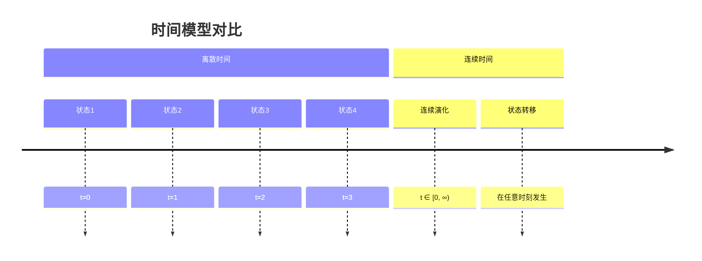
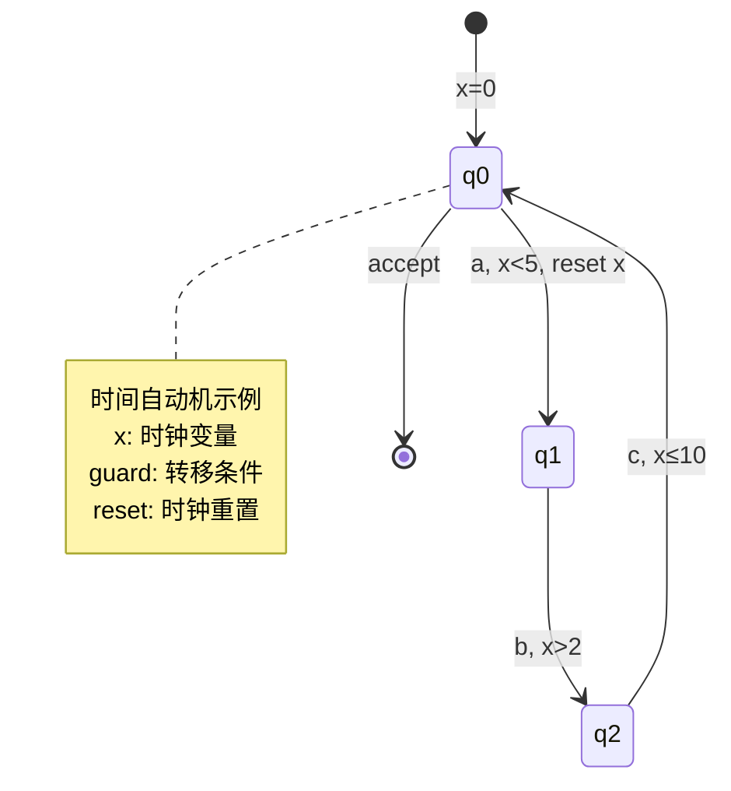

# 01.4 实时时序逻辑

---

📌 **内容摘要**

本文档深入探讨实时时序逻辑的核心原理和关键方法。内容涵盖时序逻辑领域的主要知识点，包括CTL, LTL等关键主题。适合具备相关基础的学习者进行深入研究。

**关键词**: CTL, 时序逻辑, LTL

📚 **学习目标**
- 深入理解实时时序逻辑的理论体系和形式化方法
- 能够进行相关定理的形式化证明
- 建立该领域的系统性知识框架

🎯 **难度级别**: 高级

⏱️ **预计阅读时间**: 15分钟

**前置知识**: 该领域的中级知识, 形式化方法基础

---


## 目录

- [01.4 实时时序逻辑](#014-实时时序逻辑)
  - [目录](#目录)
  - [1. 概述](#1-概述)
  - [2. 时间模型](#2-时间模型)
    - [2.1 离散时间与连续时间](#21-离散时间与连续时间)
    - [2.2 时间语义](#22-时间语义)
  - [3. 带时间约束的 LTL](#3-带时间约束的-ltl)
    - [3.1 MTL 语法](#31-mtl-语法)
    - [3.2 MTL 语义](#32-mtl-语义)
  - [4. TCTL：实时 CTL](#4-tctl实时-ctl)
    - [4.1 TCTL 语法](#41-tctl-语法)
    - [4.2 TCTL 语义](#42-tctl-语义)
  - [5. 持续时间演算](#5-持续时间演算)
    - [5.1 区间时序逻辑](#51-区间时序逻辑)
    - [5.2 持续时间演算基础](#52-持续时间演算基础)
  - [6. 时间自动机](#6-时间自动机)
    - [6.1 定义与语义](#61-定义与语义)
    - [6.2 区域等价](#62-区域等价)
  - [7. 模型检测](#7-模型检测)
  - [8. 形式化实现](#8-形式化实现)
  - [9. 相关文档](#9-相关文档)

---

## 1. 概述

**实时时序逻辑**扩展了经典时序逻辑（参见 [01.1_线性时序逻辑_LTL.md](./01.1_线性时序逻辑_LTL.md) 和 [01.2_计算树逻辑_CTL.md](./01.2_计算树逻辑_CTL.md)），增加了对时间约束的表达能力。这对于验证实时系统（如嵌入式系统、控制系统、通信协议）至关重要。

**主要逻辑体系：**

| 逻辑 | 全称 | 基础 | 时间域 |
|------|------|------|--------|
| MTL | Metric Temporal Logic | LTL | 离散/连续 |
| TCTL | Timed CTL | CTL | 连续 |
| DC | Duration Calculus | 区间逻辑 | 连续 |
| RTCTL | Real-Time CTL | CTL | 离散 |

---

## 2. 时间模型

### 2.1 离散时间与连续时间

**定义 2.1.1 (时间域)**

- **离散时间**：$\mathbb{N}$ 或有限子集
- **稠密时间**：$\mathbb{R}_{\geq 0}$（连续）
- **超稠密时间**：$\mathbb{N} \times \mathbb{R}_{\geq 0}$（混合）



### 2.2 时间语义

**定义 2.2.1 (时间状态序列)**

时间状态序列是 $\mathbb{R}_{\geq 0} \rightarrow S$ 的函数，满足：

- 右连续性
- 有限变异性（有限时间内有限次状态变化）

**定义 2.2.2 (时间路径)**

时间路径是带时间戳的状态序列：

$$
\rho = (s_0, t_0) \rightarrow (s_1, t_1) \rightarrow (s_2, t_2) \rightarrow \cdots
$$

其中 $t_i \in \mathbb{R}_{\geq 0}$ 且 $t_i \leq t_{i+1}$。

---

## 3. 带时间约束的 LTL

### 3.1 MTL 语法

**定义 3.1.1 (MTL 语法)**

度量时序逻辑（Metric Temporal Logic）的语法：

$$
\phi ::= p \mid \neg\phi \mid \phi_1 \land \phi_2 \mid \phi_1 \mathbf{U}_I \phi_2 \mid \phi_1 \mathbf{R}_I \phi_2
$$

其中 $I \subseteq \mathbb{R}_{\geq 0}$ 是时间区间，形式为：

- $[a, b]$：闭区间
- $(a, b)$：开区间
- $[a, \infty)$：无界区间

**定义 3.1.2 (派生运算符)**

$$
\begin{aligned}
\mathbf{F}_I \phi &\equiv \top \mathbf{U}_I \phi \\
\mathbf{G}_I \phi &\equiv \neg\mathbf{F}_I \neg\phi \\
\mathbf{X}_I \phi &\equiv \bot \mathbf{U}_I \phi
\end{aligned}
$$

### 3.2 MTL 语义

**定义 3.2.1 (MTL 语义)**

给定时间路径 $\rho = (s_0, t_0), (s_1, t_1), \ldots$：

$$
\begin{aligned}
\rho \models p &\Leftrightarrow p \in L(s_0) \\
\rho \models \phi_1 \mathbf{U}_I \phi_2 &\Leftrightarrow \exists i \geq 0: t_i \in I \land \rho^i \models \phi_2 \land \forall j < i: \rho^j \models \phi_1
\end{aligned}
$$

**定理 3.2.1 (MTL 表达力)**

MTL 可以表达以下时间约束模式：

$$
\begin{aligned}
\mathbf{F}_{[0,5]}\phi &\text{：} \phi \text{ 在5个时间单位内成立} \\
\mathbf{G}_{[0,10]}\phi &\text{：} \phi \text{ 在10个时间单位内始终成立} \\
\phi_1 \mathbf{U}_{[3,7]}\phi_2 &\text{：} \phi_1 \text{ 保持直到 } \phi_2 \text{ 在3-7个时间单位内成立}
\end{aligned}
$$

---

## 4. TCTL：实时 CTL

### 4.1 TCTL 语法

**定义 4.1.1 (TCTL 语法)**

$$
\phi ::= p \mid \neg\phi \mid \phi_1 \land \phi_2 \mid \mathbf{EX}\phi \mid \mathbf{E}\phi_1 \mathbf{U}_I \phi_2 \mid \mathbf{A}\phi_1 \mathbf{U}_I \phi_2
$$

其中 $I$ 是时间区间。

**定义 4.1.2 (派生 TCTL 公式)**

$$
\begin{aligned}
\mathbf{EF}_I \phi &\equiv \mathbf{E}\top \mathbf{U}_I \phi \\
\mathbf{AF}_I \phi &\equiv \mathbf{A}\top \mathbf{U}_I \phi \\
\mathbf{EG}_I \phi &\equiv \neg\mathbf{AF}_I \neg\phi \\
\mathbf{AG}_I \phi &\equiv \neg\mathbf{EF}_I \neg\phi
\end{aligned}
$$

### 4.2 TCTL 语义

**定义 4.2.1 (带时间的 Kripke 结构)**

带时间的 Kripke 结构 $(S, s_0, R, L, \delta)$，其中：

- $\delta: S \rightarrow \mathbb{R}_{\geq 0}$ 是状态持续时间函数

**定义 4.2.2 (TCTL 语义)**

$$
\begin{aligned}
s \models \mathbf{EX}\phi &\Leftrightarrow \exists s': (s, s') \in R \land s' \models \phi \\
s \models \mathbf{E}\phi_1 \mathbf{U}_I \phi_2 &\Leftrightarrow \exists \text{ 路径 } \pi = s_0s_1\cdots: s_0 = s \land \\
&\qquad \exists i: \tau_i \in I \land s_i \models \phi_2 \land \forall j < i: s_j \models \phi_1
\end{aligned}
$$

其中 $\tau_i = \sum_{k=0}^{i-1} \delta(s_k)$ 是累计时间。

---

## 5. 持续时间演算

### 5.1 区间时序逻辑

**定义 5.1.1 (区间)**

区间 $[b, e] = \{t \in \mathbb{R} \mid b \leq t \leq e\}$，其中 $b \leq e$。

**定义 5.1.2 (区间关系)**

$$
\begin{aligned}
[b_1, e_1] \frown [b_2, e_2] &\Leftrightarrow b_2 = e_1 \quad \text{（邻接）} \\
[b_1, e_1] \subseteq [b_2, e_2] &\Leftrightarrow b_2 \leq b_1 \land e_1 \leq e_2 \quad \text{（包含）}
\end{aligned}
$$

### 5.2 持续时间演算基础

**定义 5.2.1 (状态表达式)**

状态表达式 $S$ 在时刻 $t$ 的值为布尔值或实数值。

**定义 5.2.2 (持续时间)**

状态 $P$ 在区间 $[b, e]$ 上的持续时间：

$$
\int P = \int_b^e P(t) dt
$$

**定义 5.2.3 (DC 公式)**

$$
\phi ::= \ell \bowtie c \mid \int S \bowtie c \mid \neg\phi \mid \phi_1 \lor \phi_2 \mid \phi_1 ; \phi_2
$$

其中：

- $\ell$ 是区间长度
- $\bowtie \in \{<, \leq, =, \geq, >\}$
- $;$ 是 chop 运算符（区间连接）

**定理 5.2.1 (DC 表达力)**

DC 可以表达：

$$
\begin{aligned}
\mathbf{true} ; \lceil P \rceil ; \mathbf{true} &\text{：} P \text{ 在某子区间上成立} \\
\ell = k &\text{：区间长度恰好为 } k \\
\int P \geq k &\text{：} P \text{ 持续时间至少为 } k
\end{aligned}
$$

**定义 5.2.4 (Chop 语义)**

$$
\mathcal{I} \models \phi_1 ; \phi_2 \Leftrightarrow \exists m: [b, m] \models \phi_1 \land [m, e] \models \phi_2
$$

---

## 6. 时间自动机

### 6.1 定义与语义

**定义 6.1.1 (时间自动机)**

时间自动机是六元组 $\mathcal{A} = (Q, \Sigma, C, E, q_0, F)$：

- $Q$：有限位置集合
- $\Sigma$：字母表
- $C$：时钟变量有限集合
- $E \subseteq Q \times \Sigma \times \mathcal{G}(C) \times 2^C \times Q$：边集
  - $\mathcal{G}(C)$：时钟约束（守卫）
  - $2^C$：重置时钟集合
- $q_0 \in Q$：初始位置
- $F \subseteq Q$：接受位置

**定义 6.1.2 (时钟约束)**

时钟约束 $\mathcal{G}(C)$ 的语法：

$$
g ::= x \bowtie c \mid x - y \bowtie c \mid g_1 \land g_2 \mid \top
$$

其中 $x, y \in C$, $c \in \mathbb{N}$, $\bowtie \in \{<, \leq, =, \geq, >\}$。

**定义 6.1.3 (语义)**

时间自动机的配置是 $(q, \nu)$，其中：

- $q \in Q$ 是当前位置
- $\nu: C \rightarrow \mathbb{R}_{\geq 0}$ 是时钟赋值

转移有两种类型：

1. **延迟转移**：$(q, \nu) \xrightarrow{d} (q, \nu + d)$，其中 $d \in \mathbb{R}_{\geq 0}$
2. **离散转移**：$(q, \nu) \xrightarrow{a} (q', \nu')$，如果存在边 $(q, a, g, r, q')$ 使得 $\nu \models g$ 且 $\nu' = \nu[r \mapsto 0]$



### 6.2 区域等价

**定义 6.2.1 (时钟区域)**

时钟区域是时钟赋值的等价类，由以下等价关系定义：

$$
\nu \sim \nu' \Leftrightarrow \forall x \in C:
\begin{cases}
\lfloor \nu(x) \rfloor = \lfloor \nu'(x) \rfloor \\
\text{frac}(\nu(x)) = 0 \Leftrightarrow \text{frac}(\nu'(x)) = 0 \\
\text{frac}(\nu(x)) \leq \text{frac}(\nu(y)) \Leftrightarrow \text{frac}(\nu'(x)) \leq \text{frac}(\nu'(y))
\end{cases}
$$

**定理 6.2.1 (区域有限性)**

对于 $n$ 个时钟，最大常数为 $k$，区域数量有上界：

$$
|Regions| \leq n! \cdot 2^n \cdot (2k + 2)^n
$$

**定义 6.2.2 (区域自动机)**

区域自动机是时间自动机的有限抽象，状态为 $(q, [\nu])$，其中 $[\nu]$ 是时钟区域。

---

## 7. 模型检测

**定理 7.1 (TCTL 模型检测复杂度)**

TCTL 模型检测是 PSPACE-完全的。

**算法 7.1 (时间自动机模型检测)**

```haskell
-- 时间自动机模型检测
timedModelCheck :: TimedAutomaton -> TCTL Formula -> Bool
timedModelCheck ta formula =
  -- 步骤1: 构造区域自动机
  let regionAutomaton = constructRegionAutomaton ta
  -- 步骤2: 在区域自动机上进行CTL模型检测
  in ctlModelCheck regionAutomaton (toUntimed formula)

-- 构造区域自动机
constructRegionAutomaton :: TimedAutomaton -> KripkeStructure
tconstructRegionAutomaton ta =
  let -- 计算所有可达区域
      regions = computeRegions (clocks ta) (maxConstant ta)
      -- 构造区域转移
      regionTransitions =
        [ ((q, r), (q', r'))
        | q <- locations ta
        , r <- regions
        , (q, a, g, reset, q') <- edges ta
        , r `satisfies` g
        , let r' = resetClocks r reset
        ]
  in KripkeStructure
       { states = [(q, r) | q <- locations ta, r <- regions]
       , transitions = regionTransitions
       }
```

---

## 8. 形式化实现

```haskell
{-# LANGUAGE GADTs #-}

module RealTimeTemporalLogic where

import Data.Ratio
import qualified Data.Set as Set

-- 时间类型
type Time = Rational
type TimeInterval = (Maybe Time, Maybe Time)  -- (下界, 上界)

-- MTL 公式
data MTL a where
  MAtom     :: a -> MTL a
  MNot      :: MTL a -> MTL a
  MAnd      :: MTL a -> MTL a -> MTL a
  MUntil    :: TimeInterval -> MTL a -> MTL a -> MTL a
  MRelease  :: TimeInterval -> MTL a -> MTL a -> MTL a
  deriving (Eq, Show)

-- 派生运算符
meventually :: TimeInterval -> MTL a -> MTL a
eventually i phi = MUntil i (MAtom True) phi

mglobally :: TimeInterval -> MTL a -> MTL a
globally i phi = MRelease i (MAtom False) phi

-- 时间信号
type TimedSignal a = [(Time, a)]

-- MTL 语义
evalMTL :: TimedSignal Bool -> MTL Bool -> Bool
evalMTL signal formula = case formula of
  MAtom p -> case signal of
    ((_, v):_) -> v == p
    [] -> False
  MNot phi -> not (evalMTL signal phi)
  MAnd phi1 phi2 -> evalMTL signal phi1 && evalMTL signal phi2
  MUntil (lo, hi) phi1 phi2 ->
    existsTime signal (\t ->
      inInterval t (lo, hi) &&
      evalMTL (dropBefore t signal) phi2 &&
      all (\t' -> evalMTL (atTime t' signal) phi1) [0..t-1])
  where
    inInterval t (Nothing, Nothing) = True
    inInterval t (Just l, Nothing) = t >= l
    inInterval t (Nothing, Just h) = t <= h
    inInterval t (Just l, Just h) = t >= l && t <= h

-- 持续时间演算
data DC a where
  DCLength :: DC a                    -- ℓ
  DCIntegral :: a -> DC a             -- ∫P
  DCNot :: DC a -> DC a
  DCOr :: DC a -> DC a -> DC a
  DCChop :: DC a -> DC a -> DC a      -- ;
  deriving (Eq, Show)

-- DC 语义在区间上
type Interval = (Time, Time)

evalDC :: (Interval -> a -> Bool) -> Interval -> DC a -> Bool
evalDC evalState int@(b, e) formula = case formula of
  DCLength -> True  -- ℓ 总为真，其值通过其他方式获取
  DCIntegral p ->
    let duration = integrate (\t -> if evalState (t, t) p then 1 else 0) b e
    in duration > 0  -- 简化语义
  DCNot phi -> not (evalDC evalState int phi)
  DCOr phi1 phi2 -> evalDC evalState int phi1 || evalDC evalState int phi2
  DCChop phi1 phi2 ->
    any (\m -> evalDC evalState (b, m) phi1 && evalDC evalState (m, e) phi2)
        [b, b + 0.001 .. e]

-- 时间自动机
data TimedAutomaton loc sigma = TimedAutomaton
  { taLocations :: [loc]
  , taAlphabet :: [sigma]
  , taClocks :: [String]
  , taEdges :: [Edge loc sigma]
  , taInitial :: loc
  , taAccepting :: [loc]
  }

data Edge loc sigma = Edge
  { edgeSource :: loc
  , edgeSymbol :: sigma
  , edgeGuard :: ClockConstraint
  , edgeReset :: [String]
  , edgeTarget :: loc
  }

data ClockConstraint
  = CCLt String Rational
  | CCLeq String Rational
  | CCEq String Rational
  | CCAnd ClockConstraint ClockConstraint
  | CCTrue
  deriving (Eq, Show)

type ClockValuation = [(String, Time)]

evalGuard :: ClockValuation -> ClockConstraint -> Bool
evalGuard val guard = case guard of
  CCTrue -> True
  CCLt c r -> case lookup c val of Just v -> v < r; Nothing -> True
  CCLeq c r -> case lookup c val of Just v -> v <= r; Nothing -> True
  CCEq c r -> case lookup c val of Just v -> v == r; Nothing -> False
  CCAnd g1 g2 -> evalGuard val g1 && evalGuard val g2

resetClocks :: ClockValuation -> [String] -> ClockValuation
resetClocks val clocks = map (\(c, v) -> if c `elem` clocks then (c, 0) else (c, v)) val
```

---

## 9. 相关文档

- [01.1_线性时序逻辑_LTL.md](./01.1_线性时序逻辑_LTL.md) - 线性时序逻辑基础
- [01.2_计算树逻辑_CTL.md](./01.2_计算树逻辑_CTL.md) - 计算树逻辑基础
- [01.3_时序逻辑应用.md](./01.3_时序逻辑应用.md) - 应用案例
- [../03_控制论/03.3_混杂系统.md](../03_控制论/03.3_混杂系统.md) - 混杂系统理论
---

## 📋 前置知识

- [01.3 时序逻辑与规约](../01_时序逻辑/01.3_时序逻辑与规约.md)

---

## 📚 延伸阅读

- [01.1 线性时序逻辑 (Linear Temporal Logic, LTL)](../01_时序逻辑/01.1_线性时序逻辑_LTL.md)
- [01.2 计算树逻辑 (CTL)](../01_时序逻辑/01.2_计算树逻辑_CTL.md)
