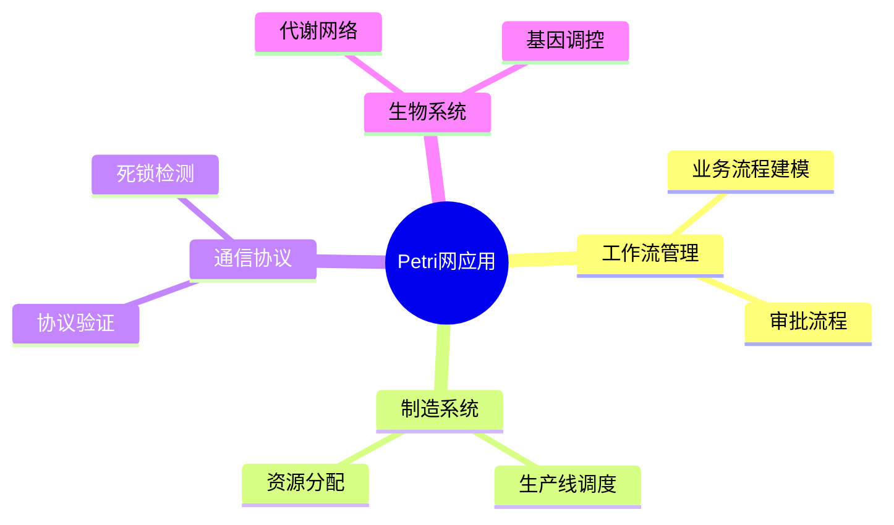
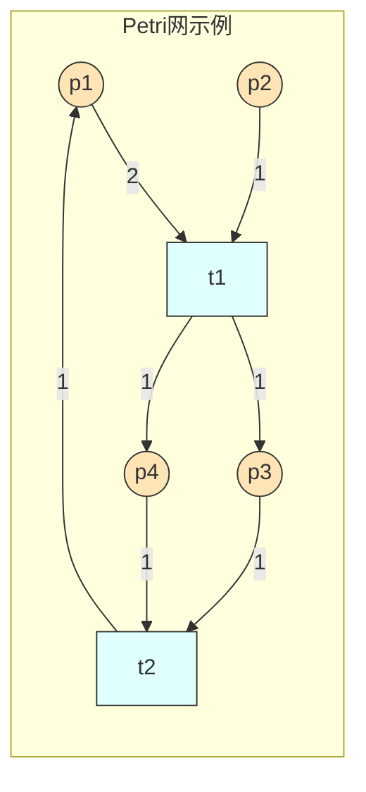
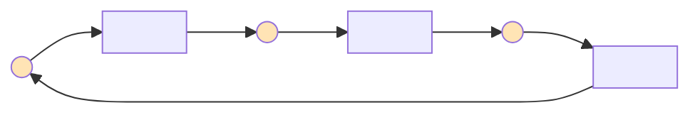
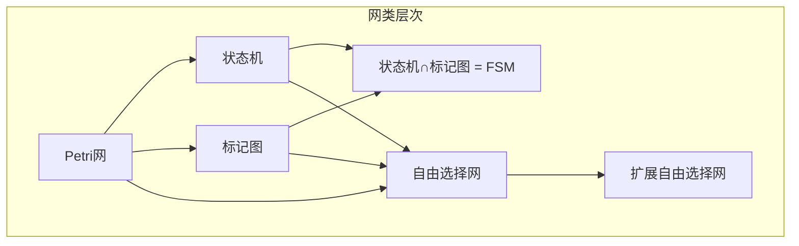

# 02.1 Petri 网基础

---

📌 **内容摘要**

本文档系统介绍Petri 网的基础理论和核心概念。内容涵盖Petri网理论领域的主要知识点，包括调度, 分布式系统, 并发, 资源分配, 同步等关键主题。适合具备相关基础的学习者进行深入研究。

**关键词**: 调度, 分布式系统, 并发, 资源分配, 同步, BPMN, 一致性, 编排

📚 **学习目标**

- 深入理解Petri 网的理论体系和形式化方法
- 能够进行相关定理的形式化证明
- 建立该领域的系统性知识框架

🎯 **难度级别**: 高级

⏱️ **预计阅读时间**: 15分钟

**前置知识**: 该领域的中级知识, 形式化方法基础

---


## 1. 引言

### 1.1 Petri 网概述

Petri 网由 Carl Adam Petri 于 1962 年在其博士论文中提出，是描述并发、异步、分布式系统的形式化模型。

**核心优势**：

- 图形化与形式化的统一
- 自然表达并发与同步
- 丰富的分析技术
- 工业界广泛应用

### 1.2 应用场景



> **交叉引用**：高级 Petri 网变体参见 [02.3_高级Petri网.md](./02.3_高级Petri网.md)。

---

## 2. 基本定义

### 2.1 Petri 网结构

**定义 2.1** (Petri 网)。一个 Petri 网是一个四元组 $N = (P, T, F, W)$：

- $P = \{p_1, p_2, \ldots, p_m\}$：有限**库所** (place) 集合
- $T = \{t_1, t_2, \ldots, t_n\}$：有限**变迁** (transition) 集合，$P \cap T = \emptyset$
- $F \subseteq (P \times T) \cup (T \times P)$：**流关系** (flow relation)
- $W: F \to \mathbb{N}^+$：**权重函数** (weight function)

**定义 2.2** (标准 Petri 网)。若 $\forall f \in F: W(f) = 1$，则称 $N$ 为**标准 Petri 网**（此时可省略 $W$）。

### 2.2 图形表示



**约定**：

- 库所：圆形 $○$
- 变迁：矩形 $□$ 或条形 $|$
- 有向弧：$\to$
- 弧权重：标注数字（默认1）
- 标记：库所内的黑点 $●$

### 2.3 前集与后集

**定义 2.3** (前集与后集)。对于 $x \in P \cup T$：

- **输入集**（前集）：$^{\bullet}x = \{y \mid (y, x) \in F\}$
- **输出集**（后集）：$x^{\bullet} = \{y \mid (x, y) \in F\}$

对于集合 $X \subseteq P \cup T$：

$$^{\bullet}X = \bigcup_{x \in X} {^{\bullet}x}, \quad X^{\bullet} = \bigcup_{x \in X} x^{\bullet}$$

**例 2.1**：在上图示例中：

- $^{\bullet}t_1 = \{p_1, p_2\}$
- $t_1^{\bullet} = \{p_3, p_4\}$
- $^{\bullet}p_3 = \{t_1\}$

---

## 3. 标记与动态行为

### 3.1 标记定义

**定义 3.1** (标记/标识)。**标记** $M$（或称**标识**）是函数 $M: P \to \mathbb{N}$，表示每个库所中的**令牌** (token) 数量。

标记可表示为向量：$M = (M(p_1), M(p_2), \ldots, M(p_m))^T$

**定义 3.2** (初始标记)。指定一个初始标记 $M_0$，则 $(N, M_0)$ 称为**标记 Petri 网** (marked Petri net)。

### 3.2 变迁使能

**定义 3.3** (变迁使能)。变迁 $t \in T$ 在标记 $M$ 下**使能**（记为 $M[t\rangle$），当且仅当：

$$\forall p \in {^{bullet}}t: M(p) \geq W(p, t)$$

即：每个输入库所的令牌数不少于对应弧的权重。

### 3.3 变迁触发

**定义 3.4** (变迁触发/发射)。使能的变迁 $t$ 可以**触发**（或称**发射**），产生新标记 $M'$（记为 $M[t\rangle M'$）：

$$M'(p) = M(p) - W(p, t) + W(t, p), \quad \forall p \in P$$

其中约定：若 $(p, t) \notin F$，则 $W(p, t) = 0$；若 $(t, p) \notin F$，则 $W(t, p) = 0$。

**定理 3.1** (令牌守恒)。变迁触发过程中令牌数的变化：

$$\sum_{p \in P} M'(p) = \sum_{p \in P} M(p) + \sum_{p \in t^{\bullet}} W(t, p) - \sum_{p \in {^{\bullet}t}} W(p, t)$$

### 3.4 触发序列与可达性

**定义 3.5** (触发序列)。序列 $\sigma = t_1 t_2 \ldots t_k$ 是**合法的**，若存在标记序列 $M_1, M_2, \ldots, M_k$ 满足：

$$M_0[t_1\rangle M_1[t_2\rangle M_2 \ldots [t_k\rangle M_k$$

记为 $M_0[\sigma\rangle M_k$。

**定义 3.6** (可达集)。从 $M_0$ 可达的所有标记集合：

$$R(N, M_0) = \{M \mid \exists \sigma: M_0[\sigma\rangle M\}$$

**定义 3.7** (可达图)。以 $R(N, M_0)$ 为节点、触发关系为边的有向图。

---

## 4. 特殊 Petri 网类

### 4.1 状态机 (State Machine)

**定义 4.1** (状态机)。Petri 网 $N = (P, T, F)$ 是**状态机**，若每个变迁恰有一个输入和一个输出库所：

$$\forall t \in T: |^{\bullet}t| = |t^{\bullet}| = 1$$

**性质 4.1**。状态机中：

- 令牌总数守恒
- 等价于有限状态机
- 可达性问题可判定



### 4.2 标记图 (Marked Graph)

**定义 4.2** (标记图)。Petri 网 $N = (P, T, F)$ 是**标记图**，若每个库所恰有一个输入和一个输出变迁：

$$\forall p \in P: |^{\bullet}p| = |p^{\bullet}| = 1$$

**性质 4.2**。标记图中：

- 并发行为被显式表示
- 活性和有界性可高效判定

### 4.3 自由选择网 (Free-Choice Net)

**定义 4.3** (自由选择网)。Petri 网 $N = (P, T, F)$ 是**自由选择网**，若：

$$\forall p_1, p_2 \in P: p_1^{\bullet} \cap p_2^{\bullet} \neq \emptyset \Rightarrow |p_1^{\bullet}| = |p_2^{\bullet}| = 1$$

即：若库所的输出变迁有交集，则这些库所都只有一个输出变迁。

**定理 4.1** (Commoner)。自由选择网是活的当且仅当每个死锁（siphon）包含一个标记陷阱（trap）。

### 4.4 网类包含关系



---

## 5. 基本性质

### 5.1 有界性

**定义 5.1** (有界性)。

- **k-有界**：$\exists k \in \mathbb{N}, \forall M \in R(N, M_0), \forall p \in P: M(p) \leq k$
- **安全** (1-有界)：$\forall M \in R(N, M_0), \forall p \in P: M(p) \leq 1$
- **有界**：$\exists k: N$ 是 k-有界的

**定理 5.1** (有界性判定)。有界性问题是可判定的，但 EXPSPACE-困难。

### 5.2 活性

**定义 5.2** (活性层次)。对于变迁 $t$：

| 层次 | 定义 | 含义 |
|-----|------|-----|
| L0 | $\exists M \in R(N, M_0): M[t\rangle$ | 某个可达标记使能 t |
| L1 | $\forall M \in R(N, M_0), \exists M' \in R(N, M): M'[t\rangle$ | t 总是潜在使能 |
| L2 | $\forall k \in \mathbb{N}, \forall M \in R(N, M_0), \exists \sigma: |\sigma| \geq k \land M[\sigma t\rangle$ | t 无限次可触发 |
| L3 | $\exists \sigma: M_0[\sigma\rangle$ 且 t 在 $\sigma$ 中出现无限次 | t 无限次触发 |
| L4 | $\forall M \in R(N, M_0): M[t\rangle$ | t 始终使能 |

**定义 5.3** (活性)。网是**活的**（或具有**活性**），若所有变迁都是 L1-活的。

### 5.3 可逆性与 Home 状态

**定义 5.4** (可逆性)。Petri 网是**可逆的**，若：

$$\forall M \in R(N, M_0): M_0 \in R(N, M)$$

即：总能回到初始标记。

**定义 5.5** (Home 状态)。$M_h$ 是 **Home 状态**，若：

$$\forall M \in R(N, M_0): M_h \in R(N, M)$$

---

## 6. Lean 形式化

### 6.1 Petri 网基本定义

```lean4
import Mathlib

-- 库所和变迁类型参数化
variable {P T : Type} [DecidableEq P] [DecidableEq T]

-- 权重函数
def Weight (P T : Type) := (P × T) ⊕ (T × P) → ℕ

-- Petri 网结构
structure PetriNet (P T : Type) where
  places : Finset P
  transitions : Finset T
  flow : Finset ((P × T) ⊕ (T × P))
  weight : Weight P T
  -- 良构性: 权重仅在流关系上有定义
  weight_defined : ∀ x, weight x > 0 → x ∈ flow

-- 标记 (标识)
def Marking (P : Type) := P → ℕ

-- 前集和后集
def pre_set {P T} (N : PetriNet P T) (t : T) : Finset P :=
  N.places.filter (λ p => (Sum.inl (p, t)) ∈ N.flow)

def post_set {P T} (N : PetriNet P T) (t : T) : Finset P :=
  N.places.filter (λ p => (Sum.inr (t, p)) ∈ N.flow)
```

### 6.2 变迁使能与触发

```lean4
-- 变迁使能条件
def enabled {P T} (N : PetriNet P T) (M : Marking P) (t : T) : Prop :=
  ∀ p ∈ N.places,
    let w_in := if (Sum.inl (p, t)) ∈ N.flow then N.weight (Sum.inl (p, t)) else 0
    M p ≥ w_in

-- 变迁触发
def fire {P T} (N : PetriNet P T) (M : Marking P) (t : T) : Marking P :=
  λ p =>
    let w_in := if (Sum.inl (p, t)) ∈ N.flow then N.weight (Sum.inl (p, t)) else 0
    let w_out := if (Sum.inr (t, p)) ∈ N.flow then N.weight (Sum.inr (t, p)) else 0
    M p - w_in + w_out

-- 触发关系
def fires {P T} (N : PetriNet P T) (M : Marking P) (t : T) (M' : Marking P) : Prop :=
  enabled N M t ∧ fire N M t = M'

infix:50 "  " => fires
```

### 6.3 可达性

```lean4
-- 触发序列
def FiringSeq {P T} (N : PetriNet P T) := List T

-- 触发序列产生的新标记
def seq_fire {P T} (N : PetriNet P T) (M : Marking P) : FiringSeq N → Marking P
  | [] => M
  | t::ts => seq_fire N (fire N M t) ts

-- 可达性 (归纳定义)
inductive Reachable {P T} (N : PetriNet P T) (M₀ : Marking P) :
    Marking P → Prop where
  | refl : Reachable N M₀ M₀
  | step : ∀ M t M',
      Reachable N M₀ M →
      enabled N M t →
      M' = fire N M t →
      Reachable N M₀ M'

infix:50 " →* " => Reachable
```

### 6.4 性质定义

```lean4
-- k-有界性
def k_bounded {P T} (N : PetriNet P T) (M₀ : Marking P) (k : ℕ) : Prop :=
  ∀ M, Reachable N M₀ M → ∀ p ∈ N.places, M p ≤ k

-- 安全性 (1-有界)
def safe {P T} (N : PetriNet P T) (M₀ : Marking P) : Prop :=
  k_bounded N M₀ 1

-- L1-活性
def L1_live {P T} (N : PetriNet P T) (M₀ : Marking P) (t : T) : Prop :=
  ∀ M, Reachable N M₀ M → ∃ M', Reachable N M M' ∧ enabled N M' t

-- 网是活的
def live {P T} (N : PetriNet P T) (M₀ : Marking P) : Prop :=
  ∀ t ∈ N.transitions, L1_live N M₀ t
```

---

## 7. 分析技术概览

### 7.1 可达性分析

| 方法 | 适用场景 | 复杂度 |
|-----|---------|-------|
| 状态空间枚举 | 小规模网 | 指数级 |
| 符号化分析 | 大规模网 | 较高 |
| 偏序约简 | 并发网 | 中等 |
| 抽象 | 复杂网 | 取决于抽象 |

> **交叉引用**：详细分析方法参见 [02.2_Petri网分析方法.md](./02.2_Petri网分析方法.md)。

### 7.2 常用工具

- **PIPE2**: 图形化 Petri 网编辑器与分析器
- **CPN Tools**: 着色 Petri 网工具
- **Tina**: 时间 Petri 网分析器
- **LoLA**: 高效可达性分析器

---

## 参考文献

1. Petri, C. A. (1962). Kommunikation mit Automaten. PhD Thesis.
2. Murata, T. (1989). Petri Nets: Properties, Analysis and Applications. Proceedings of the IEEE.
3. Reisig, W. (2013). Understanding Petri Nets. Springer.
4. Desel, J., & Esparza, J. (1995). Free Choice Petri Nets. Cambridge University Press.

---

## Lean 4 形式化代码

完整的 Petri 网形式化代码（包含网结构、变迁触发、可达性、活性）：

📄 `examples/lean/PetriNet.lean`

### 核心代码片段

```lean4
-- Petri网结构
structure PetriNet (P T : Type) where
  places : Finset P
  transitions : Finset T
  flow : Finset ((P × T) ⊕ (T × P))
  weight : Weight P T
  weight_defined : ∀ x, weight x > 0 → x ∈ flow

-- 标记 (Marking)
def Marking (P : Type) := P → ℕ

-- 变迁使能条件
def enabled {P T : Type} [DecidableEq P] (N : PetriNet P T)
    (M : Marking P) (t : T) : Prop :=
  ∀ p ∈ N.places,
    let w_in := getWeight N (Sum.inl (p, t))
    M p ≥ w_in

-- 变迁触发
def fire {P T : Type} [DecidableEq P] (N : PetriNet P T)
    (M : Marking P) (t : T) : Marking P :=
  λ p =>
    let w_in := getWeight N (Sum.inl (p, t))
    let w_out := getWeight N (Sum.inr (t, p))
    M p - w_in + w_out

-- 可达性（归纳定义）
inductive Reachable {P T : Type} [DecidableEq P] (N : PetriNet P T)
    (M₀ : Marking P) : Marking P → Prop where
  | refl : Reachable N M₀ M₀
  | step : ∀ M t M',
      Reachable N M₀ M → enabled N M t → M' = fire N M t →
      Reachable N M₀ M'

-- k-有界性
def k_bounded {P T : Type} [DecidableEq P] (N : PetriNet P T)
    (M₀ : Marking P) (k : ℕ) : Prop :=
  ∀ M, Reachable N M₀ M → ∀ p ∈ N.places, M p ≤ k
```

---

## 索引

- **变迁 (Transition)**: §2.1, §3
- **触发 (Firing)**: §3.3
- **可达性 (Reachability)**: §3.4
- **活性 (Liveness)**: §5.2
- **库所 (Place)**: §2.1
- **令牌 (Token)**: §3.1
- **标记 (Marking)**: §3.1
- **有界性 (Boundedness)**: §5.1

---

## 📚 延伸阅读

- [02.3 高级 Petri 网](../02_Petri网理论/02.3_高级Petri网.md)
- [03.1 工作流基础](../../04_软件工程/03_工作流系统/03.1_工作流基础.md)
- [03.1 工作流形式化](../../04_软件工程/03_工作流系统/03.1_工作流形式化.md)
- [02.2 Petri 网分析方法](../02_Petri网理论/02.2_Petri网分析方法.md)
