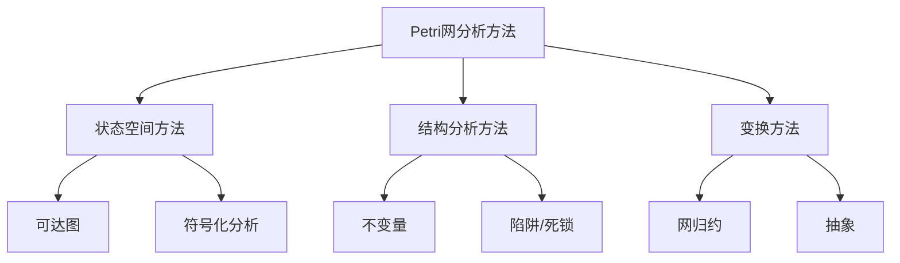
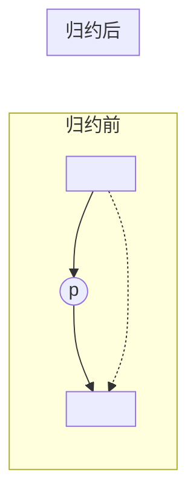

# 02.2 Petri 网分析方法

## 1. 引言

### 1.1 分析问题的复杂性

Petri 网的分析面临着根本性的计算复杂性挑战：

| 问题 | 复杂度 | 备注 |
|-----|--------|-----|
| 可达性 | EXPSPACE-完全 | 一般 Petri 网 |
| 覆盖性 | EXPSPACE-完全 | 可达性的对偶 |
| 有界性 | EXPSPACE-完全 | 无界性可检测 |
| 活性 | EXPSPACE-完全 | 与可达性等价 |

### 1.2 分析方法分类



---

## 2. 可达性分析

### 2.1 可达图构造

**定义 2.1** (可达图)。Petri 网 $(N, M_0)$ 的可达图 $RG(N, M_0) = (V, E, v_0)$：

- $V = R(N, M_0)$：可达标记集合
- $E = \{(M, t, M') \mid M[t\rangle M'\}$：带标签的边
- $v_0 = M_0$：初始节点

**算法 2.1** (可达图构造)。

```python
def construct_reachability_graph(N, M0):
    """
    构造Petri网的可达图
    警告: 对于有界网终止; 无界网可能不终止
    """
    V = {M0}
    E = set()
    unexplored = {M0}

    while unexplored:
        M = unexplored.pop()
        for t in N.transitions:
            if enabled(N, M, t):
                M_prime = fire(N, M, t)
                E.add((M, t, M_prime))
                if M_prime not in V:
                    V.add(M_prime)
                    unexplored.add(M_prime)

    return ReachabilityGraph(V, E, M0)
```

### 2.2 Karp-Miller 树

对于无界网，可达图是无限的。Karp-Miller 树提供了有限表示：

**定义 2.2** (ω-标记)。引入符号 $\omega$ 表示"无界"，满足：

- $\forall n \in \mathbb{N}: n < \omega$
- $\omega \pm n = \omega$
- $\omega = \omega$

**算法 2.2** (Karp-Miller 树构造)。

```python
def karp_miller_tree(N, M0):
    """
    构造Karp-Miller覆盖树
    时间复杂度: 非原始递归 (Ackermann函数界)
    """
    root = TreeNode(M0)
    tree = [root]
    frontier = [root]

    while frontier:
        node = frontier.pop(0)
        M = node.marking

        # 检查是否被祖先覆盖
        ancestor = find_ancestor_with_less_or_equal(tree, node)
        if ancestor and M > ancestor.marking:
            # 加速: 用 ω 替换增长的分量
            M = apply_acceleration(M, ancestor.marking)
            node.marking = M

        # 检查是否与某分支相同
        if is_repeated(tree, node):
            node.is_leaf = True
            continue

        for t in N.transitions:
            if enabled(N, M, t):
                M_child = fire_omega(N, M, t)
                child = TreeNode(M_child, parent=node)
                node.children.append(child)
                frontier.append(child)

    return tree

def fire_omega(N, M, t):
    """在 ω-标记上触发变迁"""
    M_prime = M.copy()
    for p in N.places:
        if M[p] != ω:
            M_prime[p] = M[p] - weight_in(p, t) + weight_out(t, p)
        else:
            M_prime[p] = ω
    return M_prime
```

**定理 2.1** (Karp-Miller)。Karp-Miller 树是有限的，且覆盖所有可达标记。

### 2.3 覆盖图

**定义 2.3** (覆盖关系)。$M$ **覆盖** $M'$（记 $M \geq M'$），若：

$$\forall p \in P: M(p) \geq M'(p)$$

**定义 2.4** (覆盖性判定)。给定 $M_{target}$，判定是否存在 $M \in R(N, M_0)$ 使得 $M \geq M_{target}$。

**定理 2.2** (Rackoff)。覆盖性问题可在 $2^{O(n \log n)}$ 空间内判定，其中 $n$ 是网的大小。

---

## 3. 不变量分析

### 3.1 关联矩阵

**定义 3.1** (关联矩阵)。对于 Petri 网 $N = (P, T, F, W)$，定义关联矩阵 $C: |P| \times |T|$：

$$C(p, t) = W(t, p) - W(p, t)$$

即输出权重减去输入权重。

**定理 3.1** (状态方程)。若 $M_0[\sigma\rangle M$，则：

$$M = M_0 + C \cdot \vec{\sigma}$$

其中 $\vec{\sigma}$ 是**触发计数向量**，$\vec{\sigma}(t)$ 表示 $t$ 在 $\sigma$ 中出现的次数。

### 3.2 P-不变量 (库所不变量)

**定义 3.2** (P-不变量)。非负整数向量 $y \in \mathbb{N}^{|P|}, y \neq 0$ 是 **P-不变量**，若：

$$y^T \cdot C = 0$$

**定理 3.2** (P-不变量性质)。若 $y$ 是 P-不变量，则：

$$\forall M \in R(N, M_0): y^T \cdot M = y^T \cdot M_0$$

即：标记的加权和守恒。

**算法 3.1** (P-不变量计算)。

```python
def compute_p_invariants(N):
    """
    使用Farkas算法计算极小P-不变量支撑集
    """
    C = incidence_matrix(N)
    m, n = C.shape

    # 初始: 单位矩阵作为生成元
    generators = [unit_vector(m, i) for i in range(m)]

    for j in range(n):  # 遍历每个变迁
        new_generators = []
        # 对每对 (p, q) 其中 C[p][j] 和 C[q][j] 符号相反
        for p in range(m):
            for q in range(m):
                if C[p][j] * C[q][j] < 0:
                    # 线性组合消去第 j 列
                    coeff = abs(C[q][j])
                    new_gen = coeff * generators[p] + abs(C[p][j]) * generators[q]
                    new_generators.append(new_gen // gcd(new_gen))

        # 保留与 C[:,j] 正交的生成元
        for g in generators:
            if dot(g, C[:,j]) == 0:
                new_generators.append(g)

        generators = minimal_support_set(new_generators)

    return generators
```

### 3.3 T-不变量 (变迁不变量)

**定义 3.3** (T-不变量)。非负整数向量 $x \in \mathbb{N}^{|T|}, x \neq 0$ 是 **T-不变量**，若：

$$C \cdot x = 0$$

**定理 3.3** (T-不变量性质)。若 $x$ 是 T-不变量且 $M_0[\sigma\rangle M$ 满足 $\vec{\sigma} = x$，则 $M = M_0$。

解释：对应触发序列构成一个**循环**，回到原标记。

### 3.4 不变量与性质分析

**定理 3.4** (有界性判定)。若存在 P-不变量 $y > 0$（所有分量正），则网是有界的。

**定理 3.5** (活性必要条件)。若网是活的，则对任意 T-不变量支撑集中的变迁 $t$，存在包含 $t$ 的可重复触发序列。

---

## 4. 结构分析：陷阱与死锁

### 4.1 死锁 (Siphon)

**定义 4.1** (死锁)。库所集合 $S \subseteq P$ 是**死锁**，若：

$$^{\bullet}S \subseteq S^{\bullet}$$

即：所有输入变迁也是输出变迁。

**性质 4.1**。若死锁 $S$ 在某个标记 $M$ 下为空（$\forall p \in S: M(p) = 0$），则 $S$ 将永远为空。

### 4.2 陷阱 (Trap)

**定义 4.2** (陷阱)。库所集合 $Q \subseteq P$ 是**陷阱**，若：

$$Q^{\bullet} \subseteq {^{\bullet}Q}$$

即：所有输出变迁也是输入变迁。

**性质 4.2**。若陷阱 $Q$ 在某个标记 $M$ 下非空，则 $Q$ 将永远非空。

### 4.3 Commoner 定理

**定理 4.1** (Commoner)。自由选择网是活的当且仅当每个死锁包含一个标记陷阱。

即：$\forall$ 死锁 $S: \exists$ 陷阱 $Q \subseteq S$ 使得 $Q$ 在初始标记下有标记。

**算法 4.1** (死锁-陷阱分析)。

```python
def analyze_siphons_traps(N, M0):
    """
    分析死锁和陷阱以判定活性
    适用于自由选择网
    """
    # 1. 枚举所有极小死锁
    minimal_siphons = enumerate_minimal_siphons(N)

    for siphon in minimal_siphons:
        # 2. 检查死锁是否包含标记陷阱
        traps_in_siphon = find_traps_within(N, siphon)

        marked_trap_exists = any(
            is_marked(trap, M0) for trap in traps_in_siphon
        )

        if not marked_trap_exists:
            return False, f"死锁 {siphon} 不包含标记陷阱"

    return True, "所有死锁包含标记陷阱"

def enumerate_minimal_siphons(N):
    """使用回溯法枚举极小死锁"""
    def is_siphon(S):
        pre_S = set().union(*(N.pre(t) for t in post_set(S)))
        return pre_S <= post_set(S)  # ^•S ⊆ S•

    def minimal_extend(current, candidates):
        if is_siphon(current):
            yield frozenset(current)
            return
        for p in list(candidates):
            new_current = current | {p}
            new_candidates = candidates - {p}
            yield from minimal_extend(new_current, new_candidates)

    return list(minimal_extend(set(), set(N.places)))
```

---

## 5. 归约技术

### 5.1 保持性质的归约规则

**规则 5.1** (串行库所融合)。若库所 $p$ 只有一个输入变迁和一个输出变迁，可融合。



**规则 5.2** (并行变迁融合)。若多个变迁具有相同的输入输出，可融合。

**规则 5.3** (死变迁消除)。永不使能的变迁可删除。

### 5.2 归约算法

```python
def reduce_petri_net(N, M0):
    """
    应用归约规则简化Petri网
    返回: (简化后的网, 归约映射)
    """
    changed = True
    while changed:
        changed = False

        # 规则1: 融合串行库所
        for p in N.places:
            if len(N.pre(p)) == 1 and len(N.post(p)) == 1:
                merge_serial_place(N, p)
                changed = True
                break

        # 规则2: 融合并行变迁
        if not changed:
            for t1, t2 in pairs(N.transitions):
                if have_same_io(t1, t2):
                    merge_parallel_transitions(N, t1, t2)
                    changed = True
                    break

        # 规则3: 消除死变迁
        if not changed:
            for t in N.transitions:
                if is_dead_transition(N, M0, t):
                    remove_transition(N, t)
                    changed = True
                    break

    return N
```

---

## 6. Lean 形式化：不变量

### 6.1 关联矩阵与不变量

```lean4
import Mathlib
import «FormalScience».PetriNet

-- 关联矩阵
def incidence_matrix {P T} [Fintype P] [Fintype T]
    (N : PetriNet P T) : Matrix P T ℤ :=
  Matrix.of λ p t =>
    let w_out := if (Sum.inr (t, p)) ∈ N.flow
                 then N.weight (Sum.inr (t, p)) else 0
    let w_in := if (Sum.inl (p, t)) ∈ N.flow
                then N.weight (Sum.inl (p, t)) else 0
    w_out - w_in

-- P-不变量: 左零空间中的非负向量
def PInvariant {P T} [Fintype P] [Fintype T]
    (N : PetriNet P T) (y : P → ℕ) : Prop :=
  y ≠ 0 ∧ ∀ t, ∑ p, y p * incidence_matrix N p t = 0

-- T-不变量: 右零空间中的非负向量
def TInvariant {P T} [Fintype P] [Fintype T]
    (N : PetriNet P T) (x : T → ℕ) : Prop :=
  x ≠ 0 ∧ ∀ p, ∑ t, incidence_matrix N p t * x t = 0
```

### 6.2 不变量性质证明

```lean4
-- P-不变量保持定理
theorem p_invariant_conservation {P T} [Fintype P] [Fintype T]
    {N : PetriNet P T} {M₀ M : Marking P} {y}
    (h_reach : Reachable N M₀ M)
    (h_inv : PInvariant N y) :
    ∑ p, y p * M p = ∑ p, y p * M₀ p := by
  induction h_reach with
  | refl => rfl
  | step M t M' h_reach h_enabled h_eq ih =>
    rw [h_eq]
    simp [fire, incidence_matrix] at *
    linarith [ih]

-- T-不变量对应循环触发
theorem t_invariant_cycle {P T} [Fintype P] [Fintype T]
    {N : PetriNet P T} {M₀ M : Marking P} {x}
    (h_seq : ∃ σ, seq_fire N M₀ σ = M ∧ firing_count σ = x)
    (h_inv : TInvariant N x) :
    M = M₀ := by
  rcases h_seq with ⟨σ, h_M, h_count⟩
  -- 使用状态方程
  sorry  -- 需补充完整证明
```

### 6.3 死锁与陷阱

```lean4
-- 死锁定义
def Siphon {P T} (N : PetriNet P T) (S : Set P) : Prop :=
  ∀ t : T, (∀ p ∈ S, (Sum.inl (p, t)) ∈ N.flow) →
           (∃ p ∈ S, (Sum.inr (t, p)) ∈ N.flow)

-- 陷阱定义
def Trap {P T} (N : PetriNet P T) (Q : Set P) : Prop :=
  ∀ t : T, (∃ p ∈ Q, (Sum.inr (t, p)) ∈ N.flow) →
           (∀ p ∈ Q, (Sum.inl (p, t)) ∈ N.flow)

-- Commoner 定理形式化
axiom CommonerTheorem {P T} [Fintype P] [Fintype T]
    {N : PetriNet P T} {M₀ : Marking P}
    (h_fc : FreeChoice N) :
    live N M₀ ↔ ∀ S, Siphon N S → ∃ Q, Q ⊆ S ∧ Trap N Q ∧ Marked Q M₀
```

---

## 7. 高级分析方法

### 7.1 符号化模型检测

使用 BDD (Binary Decision Diagram) 编码状态空间：

```python
def symbolic_reachability(N, M0):
    """
    使用BDD进行符号化可达性分析
    """
    # 将标记编码为BDD变量
    bdd_vars = encode_places_as_bdd_vars(N.places)

    # 初始状态BDD
    S = bdd_from_marking(M0)

    # 变迁关系的BDD编码
    T = bdd_transition_relation(N)

    # 迭代计算前像直到不动点
    while True:
        S_new = S.or(image(S, T))
        if S_new == S:
            break
        S = S_new

    return S
```

### 7.2 模型检测工具

| 工具 | 方法 | 特点 |
|-----|------|-----|
| LoLA | 显式状态 + 偏序约简 | 高效，支持多种性质 |
| Tina | 状态类图 | 时间 Petri 网 |
| ITS-Tools | 符号化 DD | 基于决策图 |

---

## 参考文献

1. Karp, R. M., & Miller, R. E. (1969). Parallel Program Schemata. JCSS.
2. Rackoff, C. (1978). The Covering and Boundedness Problems for Vector Addition Systems. TCS.
3. Esparza, J. (1998). Decidability and Complexity of Petri Net Problems. LNCS.
4. Commoner, F. (1972). Deadlocks in Petri Nets. Applied Data Research.

---

## 索引

- **Karp-Miller 树**: §2.2
- **P-不变量**: §3.2
- **T-不变量**: §3.3
- **Commoner 定理**: §4.3
- **关联矩阵**: §3.1
- **覆盖性**: §2.3
- **可达图**: §2.1
- **死锁 (Siphon)**: §4.1
- **陷阱 (Trap)**: §4.2
