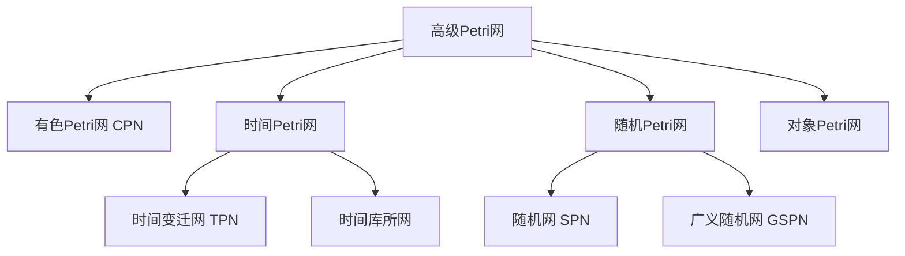
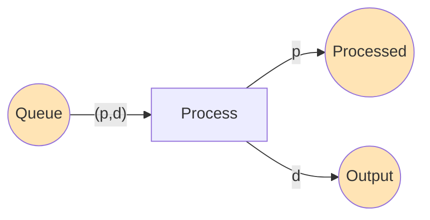
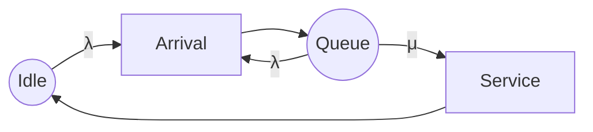
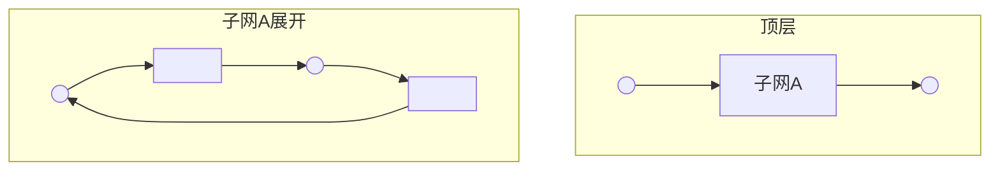

# 02.3 高级 Petri 网

## 1. 引言

### 1.1 从基本网到高级网

基本 Petri 网虽然表达能力强大，但在建模复杂系统时面临挑战：

| 局限 | 高级网解决方案 |
|-----|-------------|
| 令牌无结构 | 有色网：令牌携带数据值 |
| 无时序信息 | 时间网：变迁有时延 |
| 无概率信息 | 随机网：变迁有触发概率 |
| 无层次抽象 | 分层网：嵌套子网 |

### 1.2 高级网分类



---

## 2. 有色 Petri 网 (Colored Petri Nets, CPN)

### 2.1 基本思想

**定义 2.1** (有色网)。每个令牌具有**颜色**（数据值），库所和弧带有**类型**和**表达式**。

**优势**：

- 模型紧凑：一个有色库所 = 多个基本库所
- 数据操作：通过颜色值表达计算
- 可读性强：更接近编程语言

### 2.2 形式化定义

**定义 2.2** (有色 Petri 网)。CPN 是九元组 $CPN = (\Sigma, P, T, A, N, C, G, E, I)$：

| 元素 | 含义 |
|-----|------|
| $\Sigma$ | 有限非空**颜色集**集合 |
| $P$ | 有限**库所**集合 |
| $T$ | 有限**变迁**集合 |
| $A$ | 有限**弧**集合，$A \cap P = A \cap T = P \cap T = \emptyset$ |
| $N: A \to (P \times T) \cup (T \times P)$ | 节点函数 |
| $C: P \to \Sigma$ | 颜色函数，为每个库所分配颜色集 |
| $G: T \to Expr_{Bool}$ | 守卫函数，为变迁分配布尔表达式 |
| $E: A \to Expr_{MS}$ | 弧表达式函数 |
| $I: P \to Expr_{MS}$ | 初始化函数 |

### 2.3 颜色集与多重集

**定义 2.3** (颜色集)。颜色集类似数据类型：

```ml
colset PID = int with 1..10;     (* 进程ID *)
colset DATA = string;             (* 数据 *)
colset MSG = product PID * DATA; (* 消息: 目标*数据 *)
colset PID_LIST = list PID;       (* PID列表 *)
```

**定义 2.4** (多重集)。库所中的标记是**多重集**（multiset），允许多个同色令牌：

$$ms = 3'p1 ++ 2'p2 ++ 1'p3$$

表示：3个颜色为 $p1$ 的令牌，2个 $p2$，1个 $p3$。

### 2.4 使能与触发

**定义 2.5** (绑定)。**绑定** $b$ 为弧表达式中的变量赋值。

**定义 2.6** (使能)。变迁 $t$ 在绑定 $b$ 下使能，若：

1. 守卫 $G(t)\langle b \rangle = true$
2. 所有输入库所包含足够令牌（弧表达式求值结果 $\subseteq$ 当前标记）

**例 2.1** (CPN 使能示例)：



- `Queue` 包含：`1'(1,"data1") ++ 1'(2,"data2")`
- 绑定：`p=1, d="data1"` 使能变迁

### 2.5 CPN 工具与应用

**CPN Tools** 是主流建模与分析工具：

```cpn
(* CPN ML 示例 *)
val n = 5; (* 进程数 *)

colset PID = int with 1..n;
colset DATA = string;

fun process_data(d: DATA) =
    "processed_" ^ d;

(* 变迁守卫 *)
guard [p > 0 andalso p <= n];
```

---

## 3. 时间 Petri 网

### 3.1 时间扩展方式

**定义 3.1** (时间 Petri 网类型)。

| 类型 | 时间关联 | 触发规则 |
|-----|---------|---------|
| TPN (Time Petri Nets) | 变迁 | 时间区间使能 |
| TdPN (Timed Petri Nets) | 变迁 | 固定时延 |
| 时间库所网 | 库所 | 令牌老化 |

### 3.2 时间 Petri 网 (TPN)

**定义 3.2** (TPN)。TPN = $(P, T, F, W, M_0, I)$，其中：

- $I: T \to \mathbb{Q}_{\geq 0} \times (\mathbb{Q}_{\geq 0} \cup \{\infty\})$：时间区间函数
- $I(t) = [eft(t), lft(t)]$：最早/最迟触发时间

**定义 3.3** (状态)。TPN 状态是 $(M, \theta)$：

- $M$：标记
- $\theta: T_{enabled} \to \mathbb{R}_{\geq 0}$：使能变迁的已等待时间

**定义 3.4** (语义)。

- **时间流逝**：等待时间增加，只要 $I(t)$ 不被违反
- **触发**：选择使能且 $\theta(t) \in I(t)$ 的变迁触发

### 3.3 时间自动机等价

**定理 3.1** (Merlin-Farber)。TPN 与时间自动机具有等价表达能力。

**定理 3.2** (可判定性)。TPN 的有界性和可达性是可判定的。

### 3.4 状态类图

对于分析 TPN，**状态类图** (State Class Graph) 提供有限抽象：

**定义 3.5** (状态类)。状态类 $C = (M, D)$：

- $M$：离散标记
- $D$：使能变迁的触发时间约束（差分约束系统）

**算法 3.1** (状态类构造)。

```python
def state_class_graph(TPN):
    """
    构造TPN的状态类图
    用于有界性分析和模型检测
    """
    C0 = (M0, D0)  # 初始状态类
    classes = {C0}
    edges = []
    unexplored = [C0]

    while unexplored:
        C = unexplored.pop()
        M, D = C

        for t in enabled(M):
            # 检查 t 是否可触发
            if is_firable(D, t):
                M_prime = fire(M, t)
                D_prime = update_constraints(D, t, M_prime)

                C_prime = (M_prime, D_prime)

                if C_prime not in classes:
                    classes.add(C_prime)
                    unexplored.append(C_prime)

                edges.append((C, t, C_prime))

    return StateClassGraph(classes, edges)
```

---

## 4. 随机 Petri 网

### 4.1 基本定义

**定义 4.1** (随机 Petri 网 SPN)。SPN = $(P, T, F, W, M_0, \Lambda)$，其中：

- $\Lambda: T \to \mathbb{R}_{>0}$：变迁触发率函数

**假设**：变迁触发时间服从**指数分布**。

### 4.2 连续时间马尔可夫链

**定理 4.1** (SPN → CTMC)。SPN 的标记过程是一个连续时间马尔可夫链 (CTMC)。

**状态转移率**：
$$q_{M, M'} = \sum_{t: fire(M,t)=M'} \lambda(t)$$

**例 4.1** (M/M/1 队列的 SPN 模型)：



### 4.3 广义随机 Petri 网 (GSPN)

**定义 4.2** (GSPN)。区分两类变迁：

- **时间变迁** (timed)：指数分布，优先级低
- **瞬时变迁** (immediate)：零时延，优先级高

**定理 4.2** (嵌入马尔可夫链)。GSPN 的可达图可转化为嵌入离散时间马尔可夫链。

### 4.4 性能分析

```python
def spn_analysis(SPN):
    """
    SPN稳态性能分析
    """
    # 1. 构造可达图
    RG = construct_reachability_graph(SPN)

    # 2. 构建生成矩阵Q
    Q = build_generator_matrix(RG, SPN.rates)

    # 3. 求解稳态概率: πQ = 0, Σπ = 1
    pi = solve_stationary_distribution(Q)

    # 4. 计算性能指标
    throughput = sum(pi[s] * sum(rates for t in enabled(s)) for s in RG.states)
    avg_tokens = sum(pi[s] * sum(s.M) for s in RG.states)

    return PerformanceMetrics(throughput, avg_tokens, pi)
```

---

## 5. 层次与组合 Petri 网

### 5.1 层次 Petri 网

**定义 5.1** (超库所/超变迁)。允许库所或变迁表示子网。



### 5.2 网组合算子

| 算子 | 含义 | 应用 |
|-----|------|-----|
| 同步组合 | 共享变迁同步 | 并发系统组合 |
| 异步组合 | 库所连接 | 消息传递 |
| 层次替换 | 超节点展开 | 抽象与细化 |

---

## 6. Lean 形式化：有色网基础

### 6.1 颜色集定义

```lean4
import Mathlib
import «FormalScience».PetriNet

-- 颜色类型
inductive ColorType
  | int (low high : ℤ)
  | string
  | product : List ColorType → ColorType
  | list : ColorType → ColorType
  | unit
  deriving Repr, DecidableEq

-- 颜色值
def ColorValue : ColorType → Type
  | int low high => { n : ℤ // low ≤ n ∧ n ≤ high }
  | string => String
  | product ts => List.foldl (λ acc t => acc × ColorValue t) Unit ts
  | list t => List (ColorValue t)
  | unit => Unit
```

### 6.2 有色网结构

```lean4
-- 弧表达式 (简化版: 变量绑定到多重集)
structure ArcExpr (Var : Type) (CT : ColorType) where
  vars : List Var
  eval : (Var → ColorValue CT) → Multiset (ColorValue CT)

-- 有色 Petri 网
structure ColoredPN (P T Var : Type) where
  color_type : P → ColorType
  arc_expr : (P × T) ⊕ (T × P) → ArcExpr Var (color_type (match · with
    | Sum.inl (p, _) => p
    | Sum.inr (_, p) => p))
  guard : T → (Var → Option (Σ t, ColorValue t)) → Bool
  -- 继承自基本网结构
  base : PetriNet P T
```

### 6.3 时间网形式化框架

```lean4
-- 时间区间
structure TimeInterval where
  eft : ℚ  -- 最早触发时间
  lft : Option ℚ  -- 最迟触发时间 (∞ 表示为 none)
  valid : lft.isNone ∨ eft ≤ lft.getD 0

-- TPN 状态
structure TPNState (P T : Type) where
  marking : Marking P
  clock : T → ℚ  -- 使能变迁的时钟值
  dom : T → Prop  -- 时钟有定义的变迁

-- 时间流逝
def time_elapse {P T} (s : TPNState P T) (δ : ℚ) : TPNState P T where
  marking := s.marking
  clock := λ t => if s.dom t then s.clock t + δ else 0
  dom := s.dom
```

---

## 7. 高级网分析工具

### 7.1 工具对比

| 工具 | 网类型 | 主要功能 |
|-----|--------|---------|
| CPN Tools | CPN | 建模、仿真、状态空间分析 |
| Tina | TPN, PNC | 状态类图、模型检测 |
| TimeNet | GSPN | 性能分析 |
| MARCIE | 有色GSPN | 模型检测、性能分析 |

### 7.2 应用案例

**案例 1：通信协议验证**

- 使用 CPN 建模 TCP 协议
- 验证流量控制正确性
- 分析吞吐量性能

**案例 2：制造系统调度**

- 使用时间网建模生产线
- 验证时序约束满足性
- 优化生产节拍

---

## 参考文献

1. Jensen, K. (1996). Coloured Petri Nets: Basic Concepts. Springer.
2. Merlin, P. M., & Farber, D. J. (1976). Recoverability of Communication Protocols. IEEE Trans.
3. Molloy, M. K. (1982). Performance Analysis Using Stochastic Petri Nets. IEEE Trans.
4. Marsan, M. A., et al. (1995). Modelling with Generalized Stochastic Petri Nets. Wiley.

---

## 索引

- **CPN Tools**: §2.5
- **CPN (有色 Petri 网)**: §2
- **GSPN**: §4.3
- **SPN**: §4
- **TPN**: §3.2
- **状态类**: §3.4
- **时间变迁**: §3.2
- **颜色集**: §2.3
- **多重集**: §2.3
- **马尔可夫链**: §4.2
