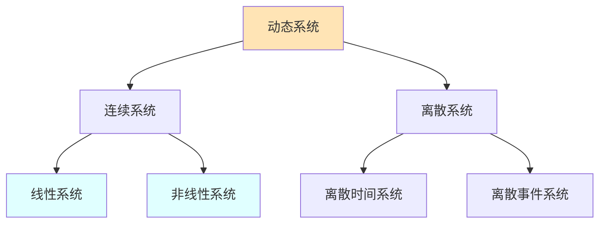
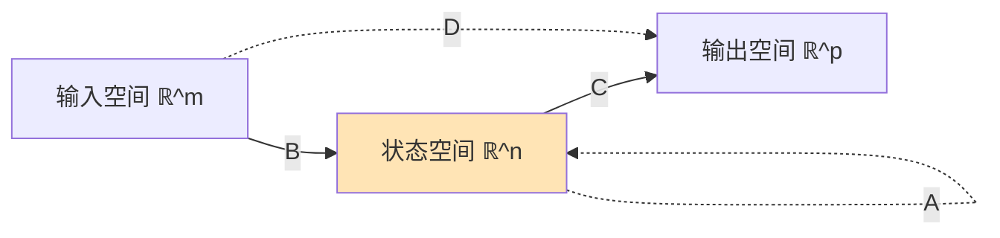

# 03.1 系统动力学

## 1. 引言

### 1.1 控制论的历史与意义

控制论 (Cybernetics) 由 Norbert Wiener 于 1948 年创立，研究动物和机器中的控制与通信。现代控制理论已发展为应用数学的重要分支。

**核心问题**：

- 如何描述系统的动态行为？
- 如何分析系统的稳定性？
- 如何设计控制器实现目标？

### 1.2 系统分类



> **交叉引用**：离散事件系统参见 [03.3_离散事件系统.md](./03.3_离散事件系统.md)。

---

## 2. 状态空间表示

### 2.1 状态空间模型

**定义 2.1** (连续时间状态空间)。线性时不变 (LTI) 系统：

$$\dot{x}(t) = Ax(t) + Bu(t)$$
$$y(t) = Cx(t) + Du(t)$$

其中：

- $x \in \mathbb{R}^n$：状态向量
- $u \in \mathbb{R}^m$：输入向量
- $y \in \mathbb{R}^p$：输出向量
- $A \in \mathbb{R}^{n \times n}$：系统矩阵
- $B \in \mathbb{R}^{n \times m}$：输入矩阵
- $C \in \mathbb{R}^{p \times n}$：输出矩阵
- $D \in \mathbb{R}^{p \times m}$：前馈矩阵

**定义 2.2** (离散时间状态空间)。

$$x[k+1] = Ax[k] + Bu[k]$$
$$y[k] = Cx[k] + Du[k]$$

### 2.2 状态空间的几何解释



**定理 2.1** (解的存在唯一性)。若 $A, B, C, D$ 有界，$u(t)$ 分段连续，则状态方程有唯一解。

### 2.3 连续时间解

**定理 2.2** (状态转移)。连续时间系统解：

$$x(t) = e^{A(t-t_0)}x(t_0) + \int_{t_0}^{t} e^{A(t-\tau)}Bu(\tau)d\tau$$

**定义 2.3** (状态转移矩阵)。$\Phi(t, t_0) = e^{A(t-t_0)}$。

**矩阵指数计算**：

$$e^{At} = \sum_{k=0}^{\infty} \frac{A^k t^k}{k!}$$

**算法 2.1** (矩阵指数数值计算)。

```python
import numpy as np
from scipy.linalg import expm

def state_response(A, B, x0, u_func, t_span, dt=0.01):
    """
    计算状态响应
    """
    t = np.arange(t_span[0], t_span[1], dt)
    x = np.zeros((len(A), len(t)))
    x[:, 0] = x0

    for i in range(1, len(t)):
        # 离散化近似 (零阶保持)
        Ad = expm(A * dt)
        Bd = np.linalg.inv(A) @ (Ad - np.eye(len(A))) @ B
        x[:, i] = Ad @ x[:, i-1] + Bd @ u_func(t[i-1])

    return t, x
```

### 2.4 离散时间解

**定理 2.3** (离散时间解)。

$$x[k] = A^k x[0] + \sum_{j=0}^{k-1} A^{k-1-j}Bu[j]$$

---

## 3. 线性化与非线性系统

### 3.1 非线性状态空间

**定义 3.1** (非线性系统)。

$$\dot{x} = f(x, u)$$
$$y = h(x, u)$$

其中 $f: \mathbb{R}^n \times \mathbb{R}^m \to \mathbb{R}^n$，$h: \mathbb{R}^n \times \mathbb{R}^m \to \mathbb{R}^p$ 是非线性函数。

### 3.2 平衡点与线性化

**定义 3.2** (平衡点)。$(x^*, u^*)$ 是平衡点，若：

$$f(x^*, u^*) = 0$$

**定理 3.1** (雅可比线性化)。在平衡点 $(x^*, u^*)$ 附近：

$$A = \frac{\partial f}{\partial x}\bigg|_{(x^*, u^*)}, \quad B = \frac{\partial f}{\partial u}\bigg|_{(x^*, u^*)}$$
$$C = \frac{\partial h}{\partial x}\bigg|_{(x^*, u^*)}, \quad D = \frac{\partial h}{\partial u}\bigg|_{(x^*, u^*)}$$

**算法 3.1** (数值线性化)。

```python
def linearize(f, h, x_star, u_star, eps=1e-6):
    """
    数值计算雅可比矩阵
    """
    n = len(x_star)
    m = len(u_star)

    # 计算 A = ∂f/∂x
    A = np.zeros((n, n))
    for i in range(n):
        dx = np.zeros(n)
        dx[i] = eps
        A[:, i] = (f(x_star + dx, u_star) - f(x_star - dx, u_star)) / (2 * eps)

    # 计算 B = ∂f/∂u
    B = np.zeros((n, m))
    for i in range(m):
        du = np.zeros(m)
        du[i] = eps
        B[:, i] = (f(x_star, u_star + du) - f(x_star, u_star - du)) / (2 * eps)

    # 类似计算 C, D

    return A, B, C, D
```

---

## 4. 稳定性理论

### 4.1 稳定性定义

**定义 4.1** (Lyapunov 稳定性)。平衡点 $x^* = 0$ 是：

| 稳定性类型 | 定义 |
|-----------|-----|
| **稳定** | $\forall \epsilon > 0, \exists \delta > 0: \|x(0)\| < \delta \Rightarrow \|x(t)\| < \epsilon, \forall t \geq 0$ |
| **渐近稳定** | 稳定且 $\lim_{t \to \infty} x(t) = 0$ |
| **指数稳定** | $\exists \alpha, \lambda > 0: \|x(t)\| \leq \alpha e^{-\lambda t}\|x(0)\|$ |
| **不稳定** | 不稳定 |

### 4.2 线性系统稳定性

**定理 4.1** (特征值判据)。LTI 系统渐近稳定 $\Leftrightarrow$ $A$ 的所有特征值满足 $\text{Re}(\lambda_i) < 0$。

**证明概要**：

- $e^{At}$ 的解由特征值决定
- 若所有 $\text{Re}(\lambda_i) < 0$，则 $\|e^{At}\| \to 0$
- 反之，若有特征值实部 $\geq 0$，存在不收敛解。 ∎

**定义 4.2** (Hurwitz 矩阵)。所有特征值实部为负的矩阵。

### 4.3 Lyapunov 直接法

**定义 4.3** (Lyapunov 函数)。函数 $V: \mathbb{R}^n \to \mathbb{R}$ 满足：

1. $V(0) = 0$ 且 $V(x) > 0$ 对于 $x \neq 0$（正定）
2. $\dot{V}(x) \leq 0$（负半定）

**定理 4.2** (Lyapunov 稳定性定理)。若存在 Lyapunov 函数，则平衡点稳定；若 $\dot{V}(x) < 0$（负定），则渐近稳定。

**定理 4.3** (线性系统的 Lyapunov 方程)。对于 LTI 系统，渐近稳定 $\Leftrightarrow$ 存在正定 $P$ 满足：

$$A^TP + PA = -Q$$

对于任意正定 $Q$。

**算法 4.1** (求解 Lyapunov 方程)。

```python
from scipy.linalg import solve_continuous_are, eigvals

def check_stability_lyapunov(A):
    """
    使用Lyapunov方程检查稳定性
    """
    n = A.shape[0]
    Q = np.eye(n)  # 选择 Q = I

    # 解 A^T P + P A = -Q
    P = solve_continuous_lyapunov(A.T, -Q)

    # 检查 P 是否正定
    eigenvalues = eigvals(P)
    is_positive_definite = np.all(eigenvalues > 0)

    return is_positive_definite, P, eigenvalues

def solve_continuous_lyapunov(A, Q):
    """
    向量化方法解Lyapunov方程
    """
    n = A.shape[0]
    # (I ⊗ A + A ⊗ I) vec(P) = -vec(Q)
    I = np.eye(n)
    M = np.kron(I, A) + np.kron(A, I)
    q_vec = Q.reshape(-1)
    p_vec = np.linalg.solve(M, -q_vec)
    return p_vec.reshape(n, n)
```

### 4.4 输入-输出稳定性

**定义 4.4** (BIBO 稳定)。有界输入产生有界输出。

**定理 4.4** (BIBO 稳定条件)。传递函数 $G(s)$ 的所有极点实部为负。

---

## 5. 能控性与能观性

### 5.1 能控性

**定义 5.1** (能控性)。系统是能控的，若对于任意 $x_0, x_f$，存在输入 $u(t)$ 在有限时间内将状态从 $x_0$ 转移到 $x_f$。

**定理 5.1** (能控性秩条件)。系统能控 $\Leftrightarrow$ 能控性矩阵满秩：

$$\mathcal{C} = [B \mid AB \mid A^2B \mid \cdots \mid A^{n-1}B]$$

$$\text{rank}(\mathcal{C}) = n$$

### 5.2 能观性

**定义 5.2** (能观性)。系统是能观的，若通过输出 $y(t)$ 可唯一确定初始状态 $x(0)$。

**定理 5.2** (能观性秩条件)。系统能观 $\Leftrightarrow$ 能观性矩阵满秩：

$$\mathcal{O} = \begin{bmatrix} C \\ CA \\ \vdots \\ CA^{n-1} \end{bmatrix}$$

$$\text{rank}(\mathcal{O}) = n$$

---

## 6. Lean 形式化

### 6.1 状态空间定义

```lean4
import Mathlib

-- 有限维状态空间
structure StateSpace (n m p : ℕ) where
  A : Matrix (Fin n) (Fin n) ℝ  -- 系统矩阵
  B : Matrix (Fin n) (Fin m) ℝ  -- 输入矩阵
  C : Matrix (Fin p) (Fin n) ℝ  -- 输出矩阵
  D : Matrix (Fin p) (Fin m) ℝ  -- 前馈矩阵

-- 状态向量
def StateVector (n : ℕ) := Fin n → ℝ

-- 连续时间状态导数
def state_derivative {n m} (sys : StateSpace n m p)
    (x : StateVector n) (u : StateVector m) : StateVector n :=
  fun i => ∑ j, sys.A i j * x j + ∑ j, sys.B i j * u j

-- 输出计算
def output {n m p} (sys : StateSpace n m p)
    (x : StateVector n) (u : StateVector m) : StateVector p :=
  fun i => ∑ j, sys.C i j * x j + ∑ j, sys.D i j * u j
```

### 6.2 稳定性判定

```lean4
-- 矩阵特征值实部全负
def Hurwitz {n} (A : Matrix (Fin n) (Fin n) ℝ) : Prop :=
  ∀ e ∈ A.eigenvalues, e.re < 0

-- 渐近稳定性定理
theorem asymptotic_stable_iff_hurwitz {n m p} (sys : StateSpace n m p) :
    Hurwitz sys.A ↔
    ∀ x₀, Tendsto (λ t => (Matrix.exponential (t • sys.A)).mulVec x₀)
                  atTop (𝓝 0) := by
  sorry  -- 需特征值分解定理

-- Lyapunov方程
def LyapunovEquation {n} (A P Q : Matrix (Fin n) (Fin n) ℝ) : Prop :=
  Aᵀ * P + P * A = -Q

-- Lyapunov稳定性定理
theorem lyapunov_stability {n} {A P Q : Matrix (Fin n) (Fin n) ℝ}
    (h_pos_def_Q : Q.PosDef)
    (h_eq : LyapunovEquation A P Q)
    (h_pos_def_P : P.PosDef) :
    Hurwitz A := by
  sorry
```

### 6.3 能控性矩阵

```lean4
-- 能控性矩阵
def ControllabilityMatrix {n m} (A : Matrix (Fin n) (Fin n) ℝ)
    (B : Matrix (Fin n) (Fin m) ℝ) :
    Matrix (Fin n) (Fin (n * m)) ℝ :=
  Matrix.of λ i (j : Fin (n * m)) =>
    let k := j.val / m
    let l := j.val % m
    (A ^ k * B) i (Fin.cast (by simp) (Fin.mk l (by omega)))

-- 能控性秩条件
def Controllable {n m} (A : Matrix (Fin n) (Fin n) ℝ)
    (B : Matrix (Fin n) (Fin m) ℝ) : Prop :=
  Matrix.rank (ControllabilityMatrix A B) = n

-- 能控性蕴含任意状态可达
theorem controllable_implies_reachable {n m} {A B}
    (h_ctrl : Controllable A B) :
    ∀ x₀ xf : StateVector n,
    ∃ u : ℝ → StateVector m,
    ∃ T > 0,
    let x t := state_evolution A B x₀ u t;
    x T = xf := by
  sorry
```

---

## 7. 数值仿真

### 7.1 数值积分方法

```python
def simulate_rk4(f, x0, t_span, dt=0.01):
    """
    四阶Runge-Kutta积分
    """
    t = np.arange(t_span[0], t_span[1], dt)
    x = np.zeros((len(x0), len(t)))
    x[:, 0] = x0

    for i in range(len(t) - 1):
        k1 = f(t[i], x[:, i])
        k2 = f(t[i] + dt/2, x[:, i] + dt*k1/2)
        k3 = f(t[i] + dt/2, x[:, i] + dt*k2/2)
        k4 = f(t[i] + dt, x[:, i] + dt*k3)
        x[:, i+1] = x[:, i] + dt/6 * (k1 + 2*k2 + 2*k3 + k4)

    return t, x

# 示例: Van der Pol振荡器
def van_der_pol(t, x, mu=1.0):
    """
    Van der Pol方程: x'' - mu(1-x^2)x' + x = 0
    """
    x1, x2 = x
    dx1 = x2
    dx2 = mu * (1 - x1**2) * x2 - x1
    return np.array([dx1, dx2])
```

---

## 参考文献

1. Kalman, R. E. (1960). On the General Theory of Control Systems. IFAC.
2. Lyapunov, A. M. (1892). The General Problem of the Stability of Motion.
3. Khalil, H. K. (2002). Nonlinear Systems. Prentice Hall.
4. Antsaklis, P. J., & Michel, A. N. (2006). Linear Systems. Birkhäuser.

---

## 索引

- **LTI 系统**: §2.1
- **Lyapunov 函数**: §4.3
- **Lyapunov 稳定性**: §4.3
- **状态空间**: §2
- **状态转移矩阵**: §2.3
- **平衡点**: §3.2
- **矩阵指数**: §2.3
- **能控性**: §5.1
- **能观性**: §5.2
- **稳定性**: §4
- **线性化**: §3.2
